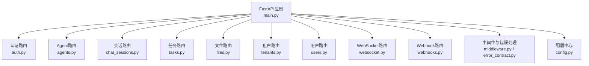
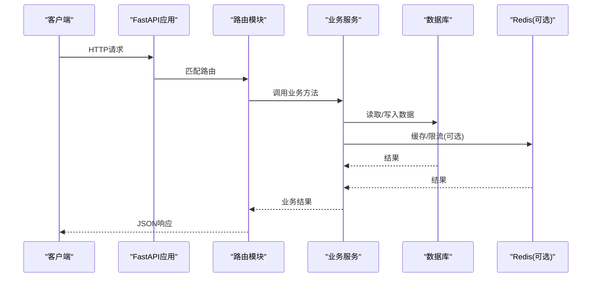
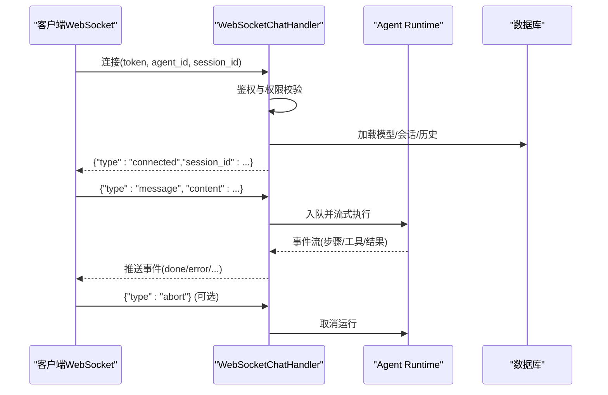
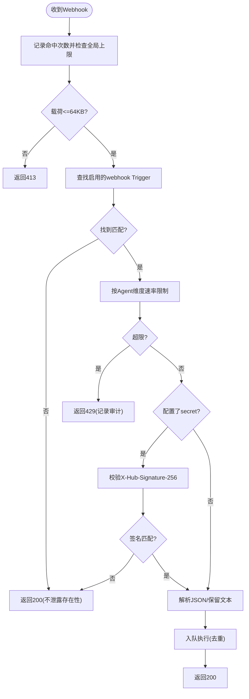
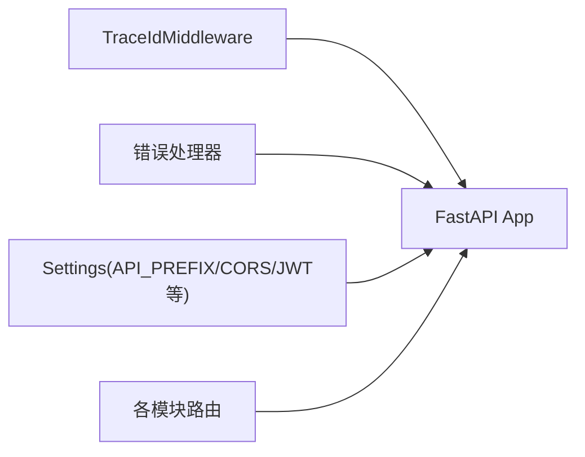

# API参考文档

<cite>
**本文引用的文件**   
- [backend/app/main.py](file://backend/app/main.py)
- [backend/app/api/auth.py](file://backend/app/api/auth.py)
- [backend/app/api/webhooks.py](file://backend/app/api/webhooks.py)
- [backend/app/api/websocket.py](file://backend/app/api/websocket.py)
- [backend/app/core/error_contract.py](file://backend/app/core/error_contract.py)
- [backend/app/core/middleware.py](file://backend/app/core/middleware.py)
- [backend/app/config.py](file://backend/app/config.py)
- [backend/app/api/agents.py](file://backend/app/api/agents.py)
- [backend/app/api/chat_sessions.py](file://backend/app/api/chat_sessions.py)
- [backend/app/api/tasks.py](file://backend/app/api/tasks.py)
- [backend/app/api/files.py](file://backend/app/api/files.py)
- [backend/app/api/tenants.py](file://backend/app/api/tenants.py)
- [backend/app/api/users.py](file://backend/app/api/users.py)
</cite>

## 目录
1. [简介](#简介)
2. [项目结构](#项目结构)
3. [核心组件](#核心组件)
4. [架构总览](#架构总览)
5. [详细组件分析](#详细组件分析)
6. [依赖关系分析](#依赖关系分析)
7. [性能与限流](#性能与限流)
8. [故障排查指南](#故障排查指南)
9. [结论](#结论)
10. [附录：客户端集成与SDK说明](#附录客户端集成与sdk说明)

## 简介
本文件为Clawith平台的API参考文档，覆盖RESTful接口、WebSocket实时通信以及Webhook回调。内容包括端点路径、HTTP方法、请求/响应格式、认证方式、错误码与状态码、版本管理、限流策略与安全注意事项，并提供客户端集成与SDK使用建议。

## 项目结构
后端基于FastAPI构建，采用模块化路由组织（按功能域拆分），统一错误处理、CORS与追踪中间件，启动时注册各模块路由并挂载公共前缀。关键入口与路由注册位于应用主文件中，认证、用户、租户、Agent、会话、任务、文件、WebSocket与Webhook等能力分别由独立模块提供。

**图表来源** 
- [backend/app/main.py:352-471](file://backend/app/main.py#L352-L471)
- [backend/app/core/middleware.py:1-53](file://backend/app/core/middleware.py#L1-L53)
- [backend/app/core/error_contract.py:1-229](file://backend/app/core/error_contract.py#L1-L229)
- [backend/app/config.py:79-200](file://backend/app/config.py#L79-L200)

**章节来源**
- [backend/app/main.py:352-471](file://backend/app/main.py#L352-L471)
- [backend/app/config.py:79-200](file://backend/app/config.py#L79-L200)

## 核心组件
- 认证与会话：支持邮箱/用户名+密码登录、SSO注册与登录、多租户切换、邮件验证与密码重置。
- Agent与任务：Agent模板列表、创建/更新/删除、任务CRUD与日志、手动触发执行。
- 会话管理：Direct Chat会话的创建、查询、软删除与运行态查看。
- 文件管理：Agent工作空间的文件读写、版本回滚、协作锁与预览。
- WebSocket：实时聊天连接、消息收发、事件流、断线重连与取消运行。
- Webhook：外部事件接入，签名校验、速率限制与重试控制。
- 租户与用户：企业自创建、成员配额与角色管理。

**章节来源**
- [backend/app/api/auth.py:1-800](file://backend/app/api/auth.py#L1-L800)
- [backend/app/api/agents.py:1-200](file://backend/app/api/agents.py#L1-L200)
- [backend/app/api/chat_sessions.py:1-200](file://backend/app/api/chat_sessions.py#L1-L200)
- [backend/app/api/tasks.py:1-185](file://backend/app/api/tasks.py#L1-L185)
- [backend/app/api/files.py:1-200](file://backend/app/api/files.py#L1-L200)
- [backend/app/api/webhooks.py:1-183](file://backend/app/api/webhooks.py#L1-L183)
- [backend/app/api/tenants.py:1-200](file://backend/app/api/tenants.py#L1-L200)
- [backend/app/api/users.py:1-200](file://backend/app/api/users.py#L1-L200)

## 架构总览
整体架构遵循“路由层 + 服务层 + 数据访问层”的分层模式。FastAPI负责HTTP/WebSocket路由与鉴权；业务逻辑封装在services中；数据库通过SQLAlchemy异步会话访问。中间件提供全局追踪与日志，错误处理器统一返回结构化错误对象。

[无图表来源，因为该图为概念性架构图]

## 详细组件分析

### REST API：认证与账户
- 基础信息
  - 前缀：/api（可通过配置修改）
  - 认证：Bearer Token（JWT），部分公开端点无需鉴权
  - 通用错误：统一包含error对象与trace_id

- 主要端点
  - GET /api/auth/registration-config
    - 用途：获取注册配置（是否需要邀请码）
    - 认证：否
    - 响应：invitation_code_required: boolean
  - GET /api/auth/check-duplicate
    - 参数：email?, username?
    - 用途：检查邮箱或用户名是否已存在
    - 响应：{email_exists, username_exists, conflicts, has_conflict}
  - POST /api/auth/register/init
    - 用途：初始化注册（支持首次用户自动创建默认租户）
    - 响应：access_token, user, message, needs_company_setup
  - POST /api/auth/register/sso
    - 用途：SSO注册/登录
    - 响应：access_token, user, needs_company_setup
  - POST /api/auth/login
    - 用途：邮箱/用户名+密码登录，支持多租户选择
    - 响应：TokenResponse或MultiTenantResponse
  - GET /api/auth/email-hint
    - 用途：根据用户名返回脱敏邮箱提示
  - POST /api/auth/forgot-password
    - 用途：发送密码重置邮件
  - POST /api/auth/reset-password
    - 用途：使用一次性token重置密码
  - GET /api/auth/me
    - 用途：获取当前用户信息
  - PATCH /api/auth/me
    - 用途：更新当前用户资料
  - GET /api/auth/my-tenants
    - 用途：获取当前身份关联的所有租户
  - POST /api/auth/switch-tenant
    - 用途：切换租户并返回新token与可选redirect_url
  - PUT /api/auth/me/password
    - 用途：修改当前用户密码（更新全局Identity密码）

- 错误与状态码
  - 401 未授权：凭证无效或过期
  - 403 禁止：账号禁用、未验证邮箱、跨租户访问失败
  - 409 冲突：邮箱/用户名重复
  - 422 校验失败：请求体不符合Schema
  - 500 内部错误：服务端异常

- 示例（路径引用）
  - 登录成功响应结构参考：[backend/app/api/auth.py:422-543](file://backend/app/api/auth.py#L422-L543)
  - 注册初始化响应结构参考：[backend/app/api/auth.py:138-254](file://backend/app/api/auth.py#L138-L254)

**章节来源**
- [backend/app/api/auth.py:1-800](file://backend/app/api/auth.py#L1-L800)

### REST API：Agent与任务
- 主要端点
  - GET /api/agents/templates
    - 用途：列出可用Agent模板
  - Agent CRUD与权限控制（路径前缀：/api/agents）
    - 创建/更新/删除Agent，需具备相应权限
    - 模型有效性校验（active model）
  - 任务管理（路径前缀：/api/agents/{agent_id}/tasks）
    - GET /：列出任务（支持status/type过滤）
    - POST /：创建任务（todo类型将触发后台执行）
    - PATCH /{task_id}：更新任务
    - GET /{task_id}/logs：获取进度日志
    - POST /{task_id}/logs：追加日志
    - POST /{task_id}/trigger：手动触发执行（测试用）

- 错误与状态码
  - 403 禁止：无权访问Agent或任务
  - 404 未找到：资源不存在
  - 422 校验失败：请求体不符合Schema

- 示例（路径引用）
  - 任务CRUD与触发参考：[backend/app/api/tasks.py:30-185](file://backend/app/api/tasks.py#L30-L185)
  - Agent模板列表参考：[backend/app/api/agents.py:142-168](file://backend/app/api/agents.py#L142-L168)

**章节来源**
- [backend/app/api/agents.py:1-200](file://backend/app/api/agents.py#L1-L200)
- [backend/app/api/tasks.py:1-185](file://backend/app/api/tasks.py#L1-L185)

### REST API：会话管理（Direct Chat）
- 主要端点（路径前缀：/api/agents）
  - 会话CRUD：创建、查询、软删除
  - 运行态查看：ActiveRunOut、工具执行待对账、恢复/取消
  - 权限：仅会话所有者或管理员可访问

- 错误与状态码
  - 403 禁止：非会话所有者且无管理员权限
  - 404 未找到：会话不存在

- 示例（路径引用）
  - 会话模型与权限校验参考：[backend/app/api/chat_sessions.py:1-200](file://backend/app/api/chat_sessions.py#L1-L200)

**章节来源**
- [backend/app/api/chat_sessions.py:1-200](file://backend/app/api/chat_sessions.py#L1-L200)

### REST API：文件管理（Agent工作空间）
- 主要端点（路径前缀：/api/agents/{agent_id}/files）
  - 列举目录、读取文本内容、上传/写入、版本回滚、编辑锁
  - 安全：路径穿越防护、企业目录可见性控制

- 错误与状态码
  - 403 禁止：路径穿越或越权访问
  - 413 载荷过大：超过大小限制
  - 422 校验失败

- 示例（路径引用）
  - 文件操作与路径安全参考：[backend/app/api/files.py:1-200](file://backend/app/api/files.py#L1-L200)

**章节来源**
- [backend/app/api/files.py:1-200](file://backend/app/api/files.py#L1-L200)

### REST API：租户与用户
- 租户
  - POST /api/tenants/self-create：自创建公司（支持多租户切换）
  - 其他租户管理端点（名称、slug、logo、SSO开关等）
- 用户
  - GET /api/users：列出租户内用户（管理员）
  - PATCH /api/users/{user_id}/quota：调整配额
  - PATCH /api/users/{user_id}/role：变更角色（含保护规则）

- 错误与状态码
  - 403 禁止：越权或租户锁定
  - 404 未找到：租户/用户不存在
  - 422 校验失败

- 示例（路径引用）
  - 租户自创建参考：[backend/app/api/tenants.py:152-200](file://backend/app/api/tenants.py#L152-L200)
  - 用户管理与配额参考：[backend/app/api/users.py:49-157](file://backend/app/api/users.py#L49-L157)

**章节来源**
- [backend/app/api/tenants.py:1-200](file://backend/app/api/tenants.py#L1-L200)
- [backend/app/api/users.py:1-200](file://backend/app/api/users.py#L1-L200)

### WebSocket：实时聊天
- 连接
  - 路径：/ws/chat/{agent_id}?token=...&session_id=&lang=
  - 认证：Query token（JWT），服务端解码后校验用户与Agent访问权限
  - 建立成功后返回connected事件，携带session_id

- 消息协议（客户端→服务端）
  - type: "message" | "abort" | "attach_run" | "onboarding_trigger"
  - content/display_content/file_name/model_id/message_id/run_id/correlation_id等字段按需携带
  - attach_run：重新附着到正在运行的Run，需要run_id与cursor

- 事件（服务端→客户端）
  - connected：连接建立，返回session_id
  - done：助手回复完成（content、role等）
  - error：运行时错误（code、message、stage、trace_id、run_id、agent_id）
  - 其他运行时事件（如工具调用、步骤推进等）

- 生命周期
  - setup：鉴权、加载模型、解析/创建会话、加载历史
  - message_loop：接收消息、入队运行、流式输出、持久化
  - 断开：清理连接、释放资源

- 错误与状态码
  - 4001：认证失败或会话不合法
  - 4002：设置失败或会话范围不匹配
  - 4003：Agent过期

- 示例（路径引用）
  - WebSocket路由与处理器参考：[backend/app/api/websocket.py:229-800](file://backend/app/api/websocket.py#L229-L800)

**图表来源** 
- [backend/app/api/websocket.py:229-800](file://backend/app/api/websocket.py#L229-L800)

**章节来源**
- [backend/app/api/websocket.py:1-800](file://backend/app/api/websocket.py#L1-L800)

### Webhook：外部事件回调
- 端点
  - POST /api/webhooks/t/{token}
  - 公开端点，无需鉴权；安全性由唯一token、可选HMAC签名、速率限制与载荷大小限制保障

- 请求头
  - X-Hub-Signature-256：可选，用于HMAC校验（sha256）

- 请求体
  - 最大64KB；JSON优先解析，失败则保留原始文本

- 响应
  - 200 OK：{"ok": true}
  - 413：载荷过大
  - 429：超出速率限制（每token每分钟上限，硬上限60/min）
  - 503：运行时不可用

- 流程
  - 记录命中次数（Redis ZSET）
  - 查找匹配的Trigger（type=webhook且启用）
  - 按Agent维度进行速率限制
  - 可选HMAC校验
  - 入队执行并去重

- 示例（路径引用）
  - Webhook接收与处理参考：[backend/app/api/webhooks.py:45-183](file://backend/app/api/webhooks.py#L45-L183)

**图表来源** 
- [backend/app/api/webhooks.py:45-183](file://backend/app/api/webhooks.py#L45-L183)

**章节来源**
- [backend/app/api/webhooks.py:1-183](file://backend/app/api/webhooks.py#L1-L183)

## 依赖关系分析
- 路由注册与公共前缀
  - 所有受保护的API通常以/api为前缀，可通过配置修改
  - 部分公共端点（如Webhook、页面公开访问）不使用前缀
- 中间件与错误处理
  - TraceIdMiddleware：注入trace_id并记录请求/响应耗时
  - 统一错误处理器：标准化错误对象，包含code、message、trace_id等

**图表来源** 
- [backend/app/core/middleware.py:1-53](file://backend/app/core/middleware.py#L1-L53)
- [backend/app/core/error_contract.py:1-229](file://backend/app/core/error_contract.py#L1-L229)
- [backend/app/config.py:79-200](file://backend/app/config.py#L79-L200)
- [backend/app/main.py:352-471](file://backend/app/main.py#L352-L471)

**章节来源**
- [backend/app/core/middleware.py:1-53](file://backend/app/core/middleware.py#L1-L53)
- [backend/app/core/error_contract.py:1-229](file://backend/app/core/error_contract.py#L1-L229)
- [backend/app/config.py:79-200](file://backend/app/config.py#L79-L200)
- [backend/app/main.py:352-471](file://backend/app/main.py#L352-L471)

## 性能与限流
- 速率限制
  - Webhook：每token每分钟最多5次（可按Agent配置），全局硬上限60/min
  - Redis ZSET实现滑动窗口计数，避免内存泄漏
- 负载限制
  - Webhook载荷上限64KB
- 并发与超时
  - Agent运行时命令并发度、Claim TTL、重试次数等可通过配置调整
- 缓存与压缩
  - 会话上下文压缩阈值、最近消息数量、工具结果内联大小等可调

**章节来源**
- [backend/app/api/webhooks.py:24-43](file://backend/app/api/webhooks.py#L24-L43)
- [backend/app/config.py:124-162](file://backend/app/config.py#L124-L162)

## 故障排查指南
- 统一错误对象
  - code：错误代码（如validation_error、internal_error、http_4xx等）
  - message：人类可读描述
  - trace_id：请求追踪ID（响应头X-Trace-Id也包含）
  - run_id/agent_id/stage/details/retryable：可选上下文
- 常见错误
  - 422：请求体校验失败，查看detail中的errors
  - 401/403：鉴权或权限问题，检查token与租户/角色
  - 429：速率限制，降低频率或申请更高限额
  - 503：运行时不可用，稍后重试
- 调试建议
  - 使用X-Trace-Id贯穿请求链路
  - 关注日志中的[WS]/[REGISTER_SSO]/[LOGIN]等标记
  - 对于WebSocket，关注error事件的stage与code定位阶段

**章节来源**
- [backend/app/core/error_contract.py:1-229](file://backend/app/core/error_contract.py#L1-L229)
- [backend/app/core/middleware.py:1-53](file://backend/app/core/middleware.py#L1-L53)
- [backend/app/api/websocket.py:173-206](file://backend/app/api/websocket.py#L173-L206)

## 结论
Clawith平台提供了完善的REST与WebSocket API，覆盖认证、Agent与任务、会话、文件、租户与用户管理等核心能力。统一的错误处理与追踪机制提升了可观测性与排障效率。通过合理的限流与配置项，系统具备良好的可扩展性与稳定性。

## 附录：客户端集成与SDK说明
- 认证与鉴权
  - 使用Bearer Token（JWT）进行鉴权，部分端点无需鉴权
  - 首次登录可能需要邮箱验证或选择租户
- 版本管理
  - 版本信息可通过/api/version获取（包含version与commit）
  - 健康检查：/api/health
- 限流与重试
  - Webhook需遵守速率限制，必要时退避重试
  - 运行时错误（503）建议指数退避重试
- 安全建议
  - 妥善保管JWT与Webhook secret
  - 校验Webhook签名（X-Hub-Signature-256）
  - 使用HTTPS传输敏感数据
- SDK使用建议
  - 封装HTTP客户端，统一添加Authorization头与X-Trace-Id
  - WebSocket客户端需处理断线重连与事件队列
  - 对错误对象进行解析与上报

**章节来源**
- [backend/app/main.py:473-513](file://backend/app/main.py#L473-L513)
- [backend/app/api/webhooks.py:134-143](file://backend/app/api/webhooks.py#L134-L143)
- [backend/app/core/error_contract.py:1-229](file://backend/app/core/error_contract.py#L1-L229)