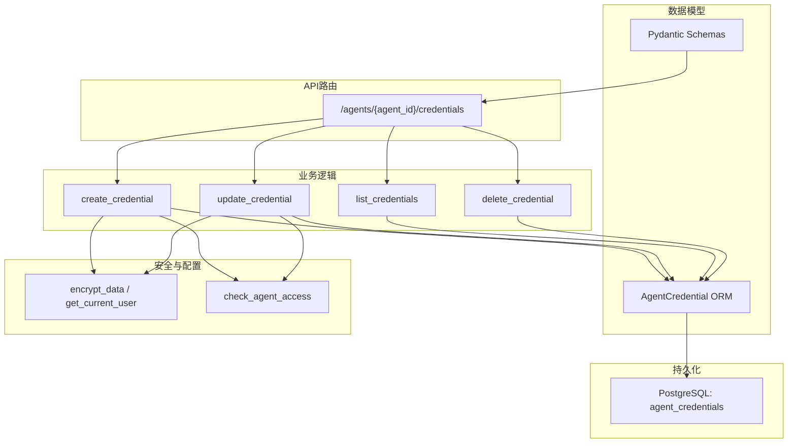
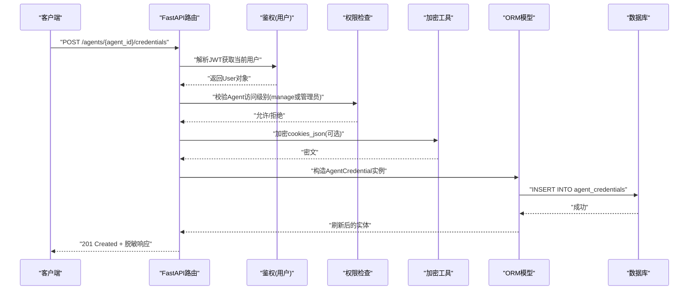
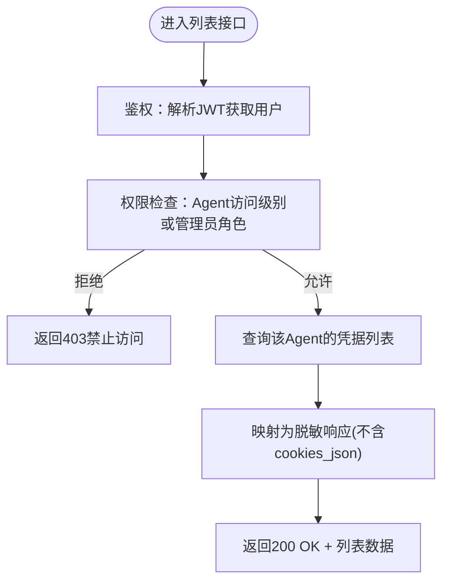
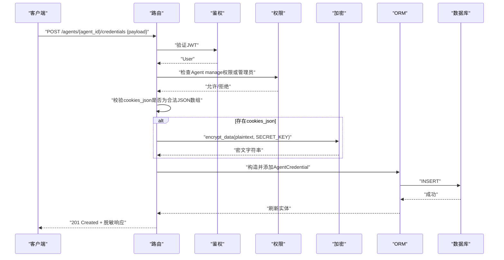
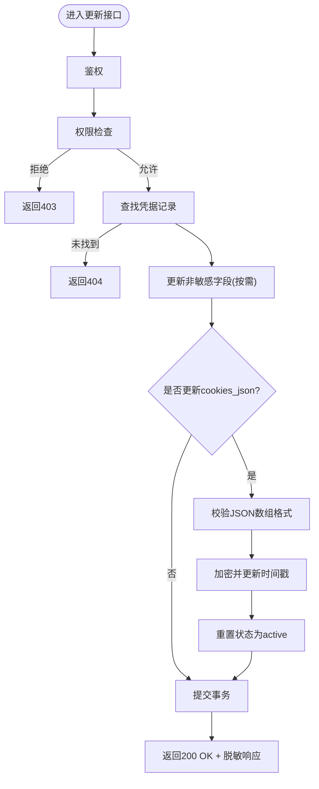
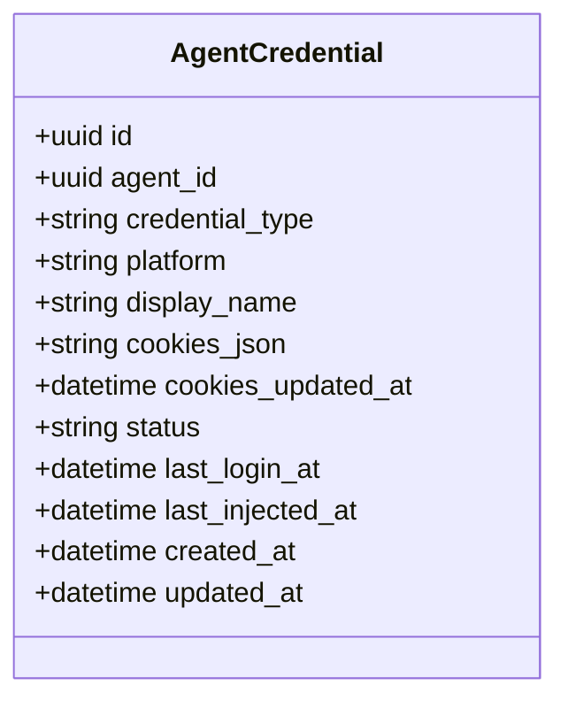
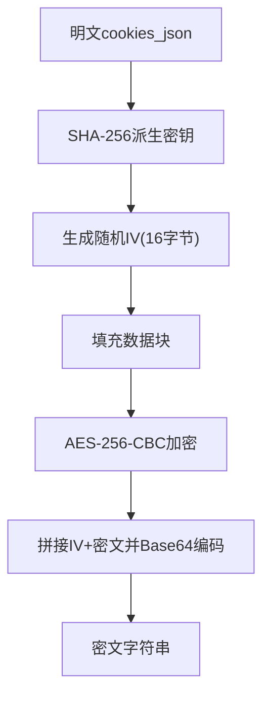
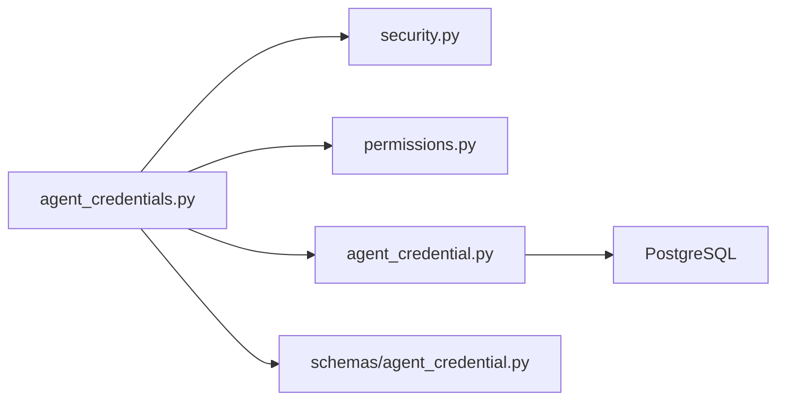

# Agent凭据管理API

<cite>
**本文引用的文件**   
- [backend/app/api/agent_credentials.py](file://backend/app/api/agent_credentials.py)
- [backend/app/models/agent_credential.py](file://backend/app/models/agent_credential.py)
- [backend/app/schemas/agent_credential.py](file://backend/app/schemas/agent_credential.py)
- [backend/app/core/security.py](file://backend/app/core/security.py)
- [backend/app/core/error_contract.py](file://backend/app/core/error_contract.py)
- [backend/app/services/audit_logger.py](file://backend/app/services/audit_logger.py)
- [backend/alembic/versions/027_add_agent_credentials.py](file://backend/alembic/versions/027_add_agent_credentials.py)
- [backend/alembic/versions/047_remove_agent_credential_plaintext_fields.py](file://backend/alembic/versions/047_remove_agent_credential_plaintext_fields.py)
</cite>

## 目录
1. [简介](#简介)
2. [项目结构](#项目结构)
3. [核心组件](#核心组件)
4. [架构总览](#架构总览)
5. [详细组件分析](#详细组件分析)
6. [依赖关系分析](#依赖关系分析)
7. [性能考虑](#性能考虑)
8. [故障排查指南](#故障排查指南)
9. [结论](#结论)
10. [附录](#附录)

## 简介
本文件为Clawith平台的Agent凭据管理系统提供完整的API文档。系统用于为每个Agent安全地存储第三方平台会话凭据（如浏览器Cookie），以便在创建新的AgentBay浏览器会话时自动注入登录态，避免明文保存敏感信息。当前实现聚焦于“网站”类型的凭据（website），并预留了其他类型字段扩展能力。所有敏感数据在落盘前使用AES-256-CBC加密，且API响应中绝不返回敏感内容。

## 项目结构
与Agent凭据相关的后端代码主要分布在以下模块：
- API路由层：定义凭据的CRUD接口
- 模型层：定义数据库表结构与字段
- Schema层：定义请求/响应数据结构
- 安全层：提供加密、鉴权等能力
- 审计日志：提供统一的审计写入能力
- 迁移脚本：维护数据库表结构演进

**图表来源** 
- [backend/app/api/agent_credentials.py:28-219](file://backend/app/api/agent_credentials.py#L28-L219)
- [backend/app/models/agent_credential.py:18-78](file://backend/app/models/agent_credential.py#L18-L78)
- [backend/app/schemas/agent_credential.py:13-52](file://backend/app/schemas/agent_credential.py#L13-L52)
- [backend/app/core/security.py:54-124](file://backend/app/core/security.py#L54-L124)

**章节来源**
- [backend/app/api/agent_credentials.py:1-219](file://backend/app/api/agent_credentials.py#L1-L219)
- [backend/app/models/agent_credential.py:1-78](file://backend/app/models/agent_credential.py#L1-L78)
- [backend/app/schemas/agent_credential.py:1-52](file://backend/app/schemas/agent_credential.py#L1-L52)

## 核心组件
- API路由与端点
  - GET /agents/{agent_id}/credentials：列出某Agent的所有凭据（不含敏感字段）
  - POST /agents/{agent_id}/credentials：创建新凭据（支持可选的cookies_json）
  - PUT /agents/{agent_id}/credentials/{credential_id}：更新凭据（仅更新提供的字段；若更新cookies_json则重新加密并重置状态）
  - DELETE /agents/{agent_id}/credentials/{credential_id}：删除凭据
- 数据模型
  - AgentCredential：包含标识、平台、显示名、状态、时间戳及加密后的cookies_json等字段
- Schema
  - AgentCredentialCreate/Update/Response：约束输入输出，确保响应不泄露敏感数据
- 安全机制
  - AES-256-CBC加密cookies_json，密钥由配置项SECRET_KEY派生
  - 基于JWT的用户认证与角色检查，结合Agent访问控制策略限制操作权限

**章节来源**
- [backend/app/api/agent_credentials.py:52-219](file://backend/app/api/agent_credentials.py#L52-L219)
- [backend/app/models/agent_credential.py:18-78](file://backend/app/models/agent_credential.py#L18-L78)
- [backend/app/schemas/agent_credential.py:13-52](file://backend/app/schemas/agent_credential.py#L13-L52)
- [backend/app/core/security.py:54-124](file://backend/app/core/security.py#L54-L124)

## 架构总览
下图展示了凭据管理的整体调用链与数据流：客户端通过FastAPI路由进入控制器，进行鉴权与权限校验后，对数据进行格式校验与加密，再持久化到数据库；读取时仅返回脱敏结果。

**图表来源** 
- [backend/app/api/agent_credentials.py:76-126](file://backend/app/api/agent_credentials.py#L76-L126)
- [backend/app/core/security.py:54-84](file://backend/app/core/security.py#L54-L84)
- [backend/app/models/agent_credential.py:18-78](file://backend/app/models/agent_credential.py#L18-L78)

## 详细组件分析

### 凭据列表接口
- 路径与方法：GET /agents/{agent_id}/credentials
- 功能：返回指定Agent的所有凭据，按创建时间倒序排列；响应不包含任何敏感字段，仅提供has_cookies布尔标志表示是否存在已加密的cookies
- 权限要求：需要对该Agent具备manage级别访问权限，或当前用户为平台/组织管理员
- 错误处理：无权限返回403；数据库查询异常由全局错误处理器统一封装

**图表来源** 
- [backend/app/api/agent_credentials.py:52-74](file://backend/app/api/agent_credentials.py#L52-L74)

**章节来源**
- [backend/app/api/agent_credentials.py:52-74](file://backend/app/api/agent_credentials.py#L52-L74)

### 凭据创建接口
- 路径与方法：POST /agents/{agent_id}/credentials
- 功能：创建新的凭据记录；可选传入cookies_json（JSON数组字符串），服务端会进行格式校验并使用AES-256-CBC加密存储；成功后返回脱敏响应
- 权限要求：同列表接口
- 错误处理：cookies_json格式非法返回400；无权限返回403

**图表来源** 
- [backend/app/api/agent_credentials.py:76-126](file://backend/app/api/agent_credentials.py#L76-L126)
- [backend/app/core/security.py:54-84](file://backend/app/core/security.py#L54-L84)

**章节来源**
- [backend/app/api/agent_credentials.py:76-126](file://backend/app/api/agent_credentials.py#L76-L126)

### 凭据更新接口
- 路径与方法：PUT /agents/{agent_id}/credentials/{credential_id}
- 功能：部分更新凭据；若更新cookies_json，将进行格式校验、重新加密并更新时间戳，同时将状态重置为active；否则仅更新提供的字段
- 权限要求：同列表接口
- 错误处理：凭据不存在返回404；cookies_json格式非法返回400；无权限返回403

**图表来源** 
- [backend/app/api/agent_credentials.py:128-189](file://backend/app/api/agent_credentials.py#L128-L189)

**章节来源**
- [backend/app/api/agent_credentials.py:128-189](file://backend/app/api/agent_credentials.py#L128-L189)

### 凭据删除接口
- 路径与方法：DELETE /agents/{agent_id}/credentials/{credential_id}
- 功能：删除指定凭据记录
- 权限要求：同列表接口
- 错误处理：凭据不存在返回404；无权限返回403

**章节来源**
- [backend/app/api/agent_credentials.py:192-219](file://backend/app/api/agent_credentials.py#L192-L219)

### 数据模型与Schema
- 模型字段说明
  - id：主键UUID
  - agent_id：关联Agent的外键，级联删除
  - credential_type：凭据类型（默认website，预留email/social/api_key等扩展）
  - platform：平台域名（如baidu.com）
  - display_name：人类可读名称
  - cookies_json：加密后的Playwright兼容Cookie数组（文本存储）
  - cookies_updated_at：最后一次捕获/更新时间
  - status：运行状态（active/expired/needs_relogin）
  - last_login_at：最近一次成功登录时间
  - last_injected_at：最近一次注入到浏览器会话的时间
  - created_at/updated_at：创建与更新时间戳
- Schema约束
  - Create/Update：限定可传字段与默认值
  - Response：明确不包含cookies_json，以has_cookies替代指示是否存在

**图表来源** 
- [backend/app/models/agent_credential.py:18-78](file://backend/app/models/agent_credential.py#L18-L78)

**章节来源**
- [backend/app/models/agent_credential.py:18-78](file://backend/app/models/agent_credential.py#L18-L78)
- [backend/app/schemas/agent_credential.py:13-52](file://backend/app/schemas/agent_credential.py#L13-L52)

### 安全与加密
- 加密算法：AES-256-CBC，随机IV，Base64编码存储
- 密钥派生：使用配置的SECRET_KEY经SHA-256得到32字节密钥
- 解密函数：配套decrypt_data用于内部解密（当前API不暴露解密能力）
- 鉴权与授权：
  - JWT鉴权：get_current_user解析令牌并加载用户
  - 权限检查：check_agent_access确保对Agent的manage权限或管理员角色

**图表来源** 
- [backend/app/core/security.py:54-84](file://backend/app/core/security.py#L54-L84)

**章节来源**
- [backend/app/core/security.py:54-124](file://backend/app/core/security.py#L54-L124)

### 审计日志
- 审计服务：audit_logger提供通用审计写入能力，支持多种动作类型与上下文信息
- 当前凭据API未直接调用审计写入，但系统具备审计基础设施，可在后续扩展中集成凭据操作的审计记录

**章节来源**
- [backend/app/services/audit_logger.py:1-215](file://backend/app/services/audit_logger.py#L1-L215)

## 依赖关系分析
- API路由依赖：
  - FastAPI路由与依赖注入
  - SQLAlchemy异步会话
  - 权限检查与用户鉴权
  - 加密工具
- 模型依赖：
  - SQLAlchemy ORM与PostgreSQL UUID类型
- Schema依赖：
  - Pydantic BaseModel与字段约束
- 外部依赖：
  - PyCryptodome用于AES加密
  - jose用于JWT编解码
  - bcrypt用于密码哈希（与凭据无关，但属于安全模块）

**图表来源** 
- [backend/app/api/agent_credentials.py:1-219](file://backend/app/api/agent_credentials.py#L1-L219)
- [backend/app/core/security.py:1-227](file://backend/app/core/security.py#L1-L227)
- [backend/app/models/agent_credential.py:1-78](file://backend/app/models/agent_credential.py#L1-L78)
- [backend/app/schemas/agent_credential.py:1-52](file://backend/app/schemas/agent_credential.py#L1-L52)

**章节来源**
- [backend/app/api/agent_credentials.py:1-219](file://backend/app/api/agent_credentials.py#L1-L219)
- [backend/app/core/security.py:1-227](file://backend/app/core/security.py#L1-L227)

## 性能考虑
- 加密开销：AES-256-CBC加解密为CPU密集型操作，建议在批量场景下评估并发与线程池配置
- 数据库索引：agent_credentials表对agent_id建立索引，提升按Agent查询效率
- 响应体积：响应不包含敏感字段，减少数据传输量
- 事务粒度：每个接口独立事务，保证一致性

[本节为通用指导，无需引用具体文件]

## 故障排查指南
- 常见错误码
  - 400 Bad Request：cookies_json格式非法或非数组
  - 403 Forbidden：无权限操作凭据（需manage权限或管理员角色）
  - 404 Not Found：凭据不存在
  - 500 Internal Server Error：未处理异常，统一错误处理器将返回标准化错误对象
- 错误对象结构
  - code：错误码
  - message：错误消息
  - trace_id：追踪ID（便于日志定位）
  - details：附加详情（可选）
  - retryable：是否可重试（可选）
- 排查建议
  - 检查请求体中的cookies_json是否为合法的JSON数组字符串
  - 确认JWT令牌有效且用户具备相应权限
  - 查看trace_id对应的服务端日志定位问题

**章节来源**
- [backend/app/core/error_contract.py:57-229](file://backend/app/core/error_contract.py#L57-L229)

## 结论
本API实现了Agent凭据的安全存储与管理，采用AES-256-CBC加密与严格的访问控制，确保敏感数据不落明文且不泄露至响应。当前版本聚焦于网站类凭据（website），并通过字段设计预留扩展空间。未来可扩展审计日志、凭据轮换与过期管理等高级能力。

[本节为总结性内容，无需引用具体文件]

## 附录

### API端点清单
- GET /agents/{agent_id}/credentials
  - 描述：列出Agent的凭据（不含敏感字段）
  - 权限：manage或管理员
  - 响应：脱敏凭据列表
- POST /agents/{agent_id}/credentials
  - 描述：创建凭据（可选cookies_json）
  - 权限：manage或管理员
  - 请求体：AgentCredentialCreate
  - 响应：脱敏凭据对象
- PUT /agents/{agent_id}/credentials/{credential_id}
  - 描述：更新凭据（部分更新）
  - 权限：manage或管理员
  - 请求体：AgentCredentialUpdate
  - 响应：脱敏凭据对象
- DELETE /agents/{agent_id}/credentials/{credential_id}
  - 描述：删除凭据
  - 权限：manage或管理员
  - 响应：204 No Content

**章节来源**
- [backend/app/api/agent_credentials.py:52-219](file://backend/app/api/agent_credentials.py#L52-L219)

### 数据模型字段说明
- id：UUID主键
- agent_id：关联Agent外键
- credential_type：凭据类型（website/email/social/api_key）
- platform：平台域名
- display_name：显示名称
- cookies_json：加密后的Cookie数组（文本）
- cookies_updated_at：最后更新时间
- status：状态（active/expired/needs_relogin）
- last_login_at：最近登录时间
- last_injected_at：最近注入时间
- created_at/updated_at：时间戳

**章节来源**
- [backend/app/models/agent_credential.py:18-78](file://backend/app/models/agent_credential.py#L18-L78)

### 数据库迁移历史
- 初始建表：包含username/password/login_url等明文字段（已废弃）
- 清理明文字段：移除username/password/login_url，强化安全

**章节来源**
- [backend/alembic/versions/027_add_agent_credentials.py:15-45](file://backend/alembic/versions/027_add_agent_credentials.py#L15-L45)
- [backend/alembic/versions/047_remove_agent_credential_plaintext_fields.py:22-31](file://backend/alembic/versions/047_remove_agent_credential_plaintext_fields.py#L22-L31)

### 安全最佳实践
- 始终使用HTTPS传输凭据相关请求
- 妥善保管SECRET_KEY，避免泄露
- 定期轮换凭据，及时更新cookies_json
- 最小权限原则：仅授予必要的Agent管理权限
- 启用审计日志（后续扩展）以追踪凭据操作

[本节为通用指导，无需引用具体文件]