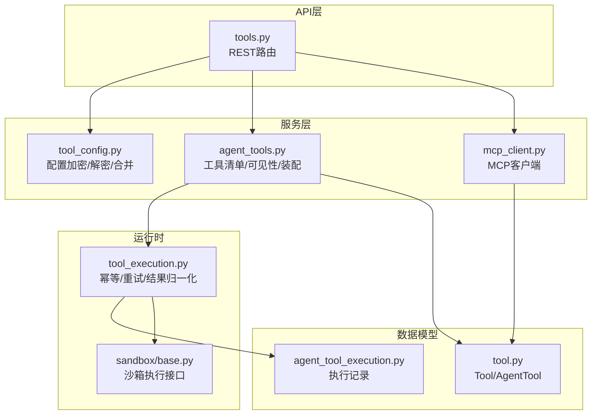
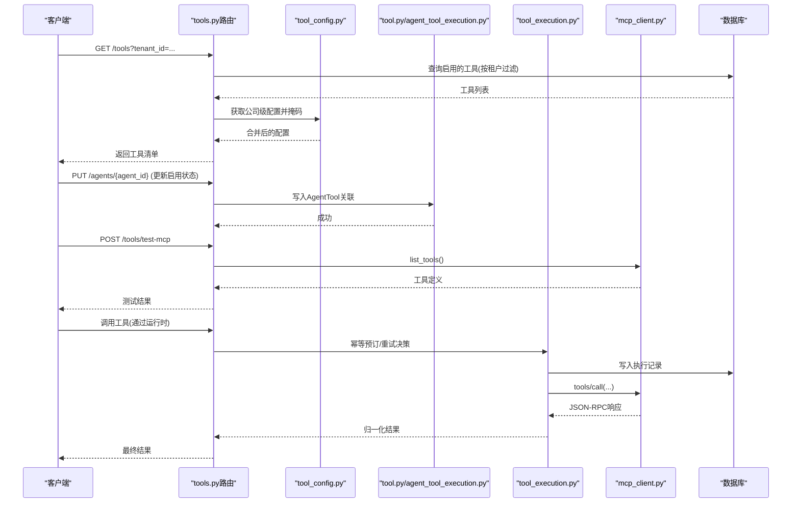
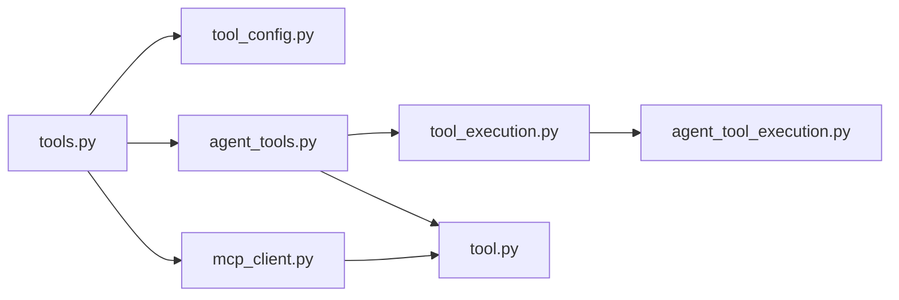

# Agent工具管理API

<cite>
**本文引用的文件**
- [backend/app/api/tools.py](file://backend/app/api/tools.py)
- [backend/app/services/tool_config.py](file://backend/app/services/tool_config.py)
- [backend/app/models/tool.py](file://backend/app/models/tool.py)
- [backend/app/services/agent_tools.py](file://backend/app/services/agent_tools.py)
- [backend/app/services/agent_runtime/tool_execution.py](file://backend/app/services/agent_runtime/tool_execution.py)
- [backend/app/services/mcp_client.py](file://backend/app/services/mcp_client.py)
- [backend/app/models/agent_tool_execution.py](file://backend/app/models/agent_tool_execution.py)
- [backend/app/services/sandbox/base.py](file://backend/app/services/sandbox/base.py)
</cite>

## 目录
1. [简介](#简介)
2. [项目结构](#项目结构)
3. [核心组件](#核心组件)
4. [架构总览](#架构总览)
5. [详细组件分析](#详细组件分析)
6. [依赖关系分析](#依赖关系分析)
7. [性能考虑](#性能考虑)
8. [故障排查指南](#故障排查指南)
9. [结论](#结论)
10. [附录：API参考与调用示例](#附录api参考与调用示例)

## 简介
本文件为Clawith平台的Agent工具管理系统提供完整的API文档，覆盖工具的注册、发现、调用、监控等全生命周期接口。系统支持内置工具、MCP工具、自定义工具等多种类型，并提供工具配置管理、参数验证、权限控制、执行结果处理、错误恢复、性能监控、版本管理、依赖解析与沙箱执行环境等技术细节。文档同时给出API调用示例与集成指南，帮助开发者快速接入与扩展。

## 项目结构
后端围绕FastAPI路由暴露工具管理API，结合数据模型、服务层与运行时组件实现工具的全生命周期管理：
- API层：tools.py定义工具CRUD、按Agent分配、MCP连接测试与凭据管理等接口
- 配置层：tool_config.py负责敏感字段加解密、租户级配置合并与掩码展示
- 数据模型：tool.py定义Tool与AgentTool实体，agent_tool_execution.py定义执行记录表
- 工具发现与装配：agent_tools.py提供OpenAI函数式工具清单、动态加载与可见性策略
- 运行时执行：agent_runtime/tool_execution.py提供幂等执行、重试策略、结果归一化与审计元数据
- MCP客户端：mcp_client.py实现MCP协议连接、传输自动探测与工具调用
- 沙箱执行：sandbox/base.py定义统一执行接口与能力描述

**图表来源**
- [backend/app/api/tools.py](file://backend/app/api/tools.py)
- [backend/app/services/tool_config.py](file://backend/app/services/tool_config.py)
- [backend/app/services/agent_tools.py](file://backend/app/services/agent_tools.py)
- [backend/app/services/mcp_client.py](file://backend/app/services/mcp_client.py)
- [backend/app/services/agent_runtime/tool_execution.py](file://backend/app/services/agent_runtime/tool_execution.py)
- [backend/app/models/tool.py](file://backend/app/models/tool.py)
- [backend/app/models/agent_tool_execution.py](file://backend/app/models/agent_tool_execution.py)
- [backend/app/services/sandbox/base.py](file://backend/app/services/sandbox/base.py)

**章节来源**
- [backend/app/api/tools.py](file://backend/app/api/tools.py)
- [backend/app/services/tool_config.py](file://backend/app/services/tool_config.py)
- [backend/app/models/tool.py](file://backend/app/models/tool.py)
- [backend/app/services/agent_tools.py](file://backend/app/services/agent_tools.py)
- [backend/app/services/agent_runtime/tool_execution.py](file://backend/app/services/agent_runtime/tool_execution.py)
- [backend/app/services/mcp_client.py](file://backend/app/services/mcp_client.py)
- [backend/app/models/agent_tool_execution.py](file://backend/app/models/agent_tool_execution.py)
- [backend/app/services/sandbox/base.py](file://backend/app/services/sandbox/base.py)

## 核心组件
- 工具模型与分配
  - Tool：工具元数据（名称、显示名、描述、类型、分类、图标、参数Schema、运行时配置、MCP信息、启用状态、默认启用、来源、租户ID、时间戳）
  - AgentTool：Agent与工具的关联（启用状态、每Agent配置覆盖、来源、安装者Agent、创建时间）
- 工具配置管理
  - 敏感字段识别与加解密（基于config_schema与硬编码键集）
  - 租户级配置存储（tenant_settings中key前缀tool_config:<tool_name>）
  - 全局/租户/Agent三级配置合并与掩码展示
- 工具发现与装配
  - 内置工具清单（OpenAI function-calling格式），按Agent可见性与渠道就绪条件动态装配
  - OKR专用工具、系统工具、通道消息工具等分类控制
- 运行时执行与幂等
  - 执行指纹、去重、重试策略（safe/conditional/never）、副作用分类（read/write/external_write）
  - 结果归一化、摘要截断、私有二进制归档、审计元数据约束
- MCP客户端
  - 自动探测Streamable HTTP与SSE传输，维护会话ID，统一JSON-RPC封装
  - tools/list与tools/call调用，错误与内容块标准化
- 沙箱执行
  - 统一执行接口（代码、语言、超时、工作目录），健康检查与能力描述

**章节来源**
- [backend/app/models/tool.py](file://backend/app/models/tool.py)
- [backend/app/services/tool_config.py](file://backend/app/services/tool_config.py)
- [backend/app/services/agent_tools.py](file://backend/app/services/agent_tools.py)
- [backend/app/services/agent_runtime/tool_execution.py](file://backend/app/services/agent_runtime/tool_execution.py)
- [backend/app/services/mcp_client.py](file://backend/app/services/mcp_client.py)
- [backend/app/services/sandbox/base.py](file://backend/app/services/sandbox/base.py)

## 架构总览
下图展示了从API到数据与外部服务的完整调用链，包括工具可见性、配置合并、MCP通信与执行幂等保障。

**图表来源**
- [backend/app/api/tools.py](file://backend/app/api/tools.py)
- [backend/app/services/tool_config.py](file://backend/app/services/tool_config.py)
- [backend/app/models/tool.py](file://backend/app/models/tool.py)
- [backend/app/services/agent_runtime/tool_execution.py](file://backend/app/services/agent_runtime/tool_execution.py)
- [backend/app/services/mcp_client.py](file://backend/app/services/mcp_client.py)
- [backend/app/models/agent_tool_execution.py](file://backend/app/models/agent_tool_execution.py)

## 详细组件分析

### 工具管理API（tools.py）
- 功能要点
  - 工具CRUD：创建、批量更新启用状态、更新单个工具、删除非内置工具
  - 按Agent分配：获取Agent可用工具（含启用状态、MCP授权提供者、来源）、批量更新启用状态
  - MCP服务器管理：批量更新某MCP服务器的URL与API Key（加密存储）
  - 管理员视图：列出Agent安装的工具、删除Agent工具关联（若不再被使用则清理MCP工具）
  - 工具配置：获取与更新Agent级工具配置（合并全局与租户配置，敏感字段掩码/解密）
  - Smithery授权状态：读取已分配的Smithery连接状态，必要时返回授权URL
- 权限与可见性
  - 内置工具全局可见；admin工具仅对当前租户或平台级可见；agent工具需显式分配
  - 系统Agent可看到所有工具；普通Agent不可见OKR专属工具
  - Feishu工具仅在Agent具备Feishu渠道时可见
- 关键路径
  - GET /tools：按租户范围列出builtin与admin工具，附带公司级配置
  - POST /tools：创建admin工具（名称在租户内唯一）
  - PUT /tools/bulk：批量启用/禁用
  - PUT /tools/{tool_id}：更新工具元数据与配置（内置工具需指定tenant_id）
  - DELETE /tools/{tool_id}：删除非内置工具
  - GET /tools/agents/{agent_id}：获取Agent工具清单与启用状态
  - PUT /tools/agents/{agent_id}：更新Agent工具启用状态（系统类工具不可禁用）
  - GET /tools/agents/{agent_id}/mcp-tools/{tool_id}/authorization-status：查询Smithery授权状态
  - POST /tools/test-mcp：测试MCP连接并列出工具
  - PUT /tools/mcp-server：批量更新MCP服务器URL与API Key
  - GET /tools/agent-installed：管理员视角的Agent安装工具列表
  - DELETE /tools/agent-tool/{agent_tool_id}：删除Agent工具关联（可能级联删除MCP工具）
  - GET/PUT /tools/agents/{agent_id}/tool-config/{tool_id}：获取/更新Agent级工具配置

**章节来源**
- [backend/app/api/tools.py](file://backend/app/api/tools.py)

### 工具配置管理（tool_config.py）
- 敏感字段识别
  - 硬编码键集（如api_key、private_key、auth_code、password、secret）与config_schema中的password类型字段
- 加密/解密
  - 基于SECRET_KEY进行对称加密/解密，避免明文存储
- 租户级配置
  - 以tenant_settings.key="tool_config:<tool_name>"存储，读取时解密并合并
- 配置合并与掩码
  - 全局/租户/Agent三级合并，Agent覆盖优先；全局敏感字段掩码展示（保留后缀）

**章节来源**
- [backend/app/services/tool_config.py](file://backend/app/services/tool_config.py)

### 工具模型（tool.py）
- Tool字段说明
  - name/display_name/description/type/category/icon/parameters_schema/config/config_schema
  - mcp_server_url/mcp_server_name/mcp_tool_name
  - enabled/is_default/source/tenant_id/created_at/updated_at
- AgentTool字段说明
  - agent_id/tool_id/enabled/config/source/install_by_agent_id/created_at

**章节来源**
- [backend/app/models/tool.py](file://backend/app/models/tool.py)

### 工具发现与装配（agent_tools.py）
- 工具清单生成
  - 内置工具清单（OpenAI function-calling格式），隐藏部分内部工具名
  - 系统核心工具始终包含（如write_file、send_channel_file等）
  - 通道消息工具按需包含（当任一渠道配置就绪）
  - OKR专属工具仅对系统Agent可见
- 动态加载与缓存
  - 按Agent+工具名缓存配置（TTL=60s），减少DB查询
  - 优先级：Agent覆盖 > 租户配置（builtin） > 工具默认配置
  - 敏感字段按config_schema解密
- OS感知与描述补丁
  - 根据AgentBay计算机工具配置（os_type）动态修补agentbay_file_transfer描述与路径提示

**章节来源**
- [backend/app/services/agent_tools.py](file://backend/app/services/agent_tools.py)

### 运行时执行与幂等（tool_execution.py）
- 执行状态与策略
  - 状态：not_started/started/succeeded/failed/unknown
  - 副作用分类：read/write/external_write
  - 重试策略：safe/conditional/never
- 输入校验与脱敏
  - 参数规范化、控制字符替换、URL与DSN敏感信息脱敏
  - 结果摘要大小限制与截断标记
- 幂等与去重
  - 基于run_id+tool_call_id的唯一约束与指纹计算
  - 执行预订（Reservation）决定是否允许执行或复用已有结果
- 结果归一化
  - 统一status/result_summary/result_ref/error_code/retryable/artifact/evidence引用
  - 私有二进制内容归档与元数据约束（最大字节数、白名单键）
- 异常与恢复
  - 抛出ToolExecutionError/RetryableToolNodeError/ToolExecutionReconciliationPending
  - 支持安全读重试与外部写保守策略

**章节来源**
- [backend/app/services/agent_runtime/tool_execution.py](file://backend/app/services/agent_runtime/tool_execution.py)

### MCP客户端（mcp_client.py）
- 传输模式
  - Streamable HTTP：POST JSON-RPC，支持会话ID
  - SSE：GET /sse事件流，POST /messages发送请求
- 自动探测
  - 首次只读请求（tools/list）选择传输模式，后续复用
- 认证
  - 支持Bearer Token与URL中apiKey提取并转为Authorization头
- 工具调用
  - list_tools：返回name/description/inputSchema
  - call_tool_result/call_tool：标准化JSON-RPC响应与文本适配

**章节来源**
- [backend/app/services/mcp_client.py](file://backend/app/services/mcp_client.py)

### 执行记录模型（agent_tool_execution.py）
- 字段与约束
  - tenant_id/run_id/tool_call_id/tool_name/assistant_message_id/arguments_hash/sanitized_arguments
  - effect/retry_policy/attempt_count/status/result_summary/result_ref/result_metadata
  - lease_owner/lease_expires_at/started_at/completed_at/updated_at
- 索引与唯一性
  - run_id+tool_call_id唯一约束；多列索引优化查询与锁竞争

**章节来源**
- [backend/app/models/agent_tool_execution.py](file://backend/app/models/agent_tool_execution.py)

### 沙箱执行接口（sandbox/base.py）
- ExecutionResult：success/stdout/stderr/exit_code/duration_ms/error
- SandboxCapabilities：supported_languages/max_timeout/max_memory_mb/network_available/filesystem_available
- SandboxBackend协议：name/execute/health_check/get_capabilities
- BaseSandboxBackend：抽象基类与结果格式化

**章节来源**
- [backend/app/services/sandbox/base.py](file://backend/app/services/sandbox/base.py)

## 依赖关系分析
- API层依赖服务层进行配置与工具装配，服务层依赖数据模型与外部MCP客户端
- 运行时执行模块依赖执行记录模型确保幂等与审计
- 工具可见性与装配逻辑依赖Agent与Channel配置

**图表来源**
- [backend/app/api/tools.py](file://backend/app/api/tools.py)
- [backend/app/services/tool_config.py](file://backend/app/services/tool_config.py)
- [backend/app/services/agent_tools.py](file://backend/app/services/agent_tools.py)
- [backend/app/services/mcp_client.py](file://backend/app/services/mcp_client.py)
- [backend/app/services/agent_runtime/tool_execution.py](file://backend/app/services/agent_runtime/tool_execution.py)
- [backend/app/models/tool.py](file://backend/app/models/tool.py)
- [backend/app/models/agent_tool_execution.py](file://backend/app/models/agent_tool_execution.py)

**章节来源**
- [backend/app/api/tools.py](file://backend/app/api/tools.py)
- [backend/app/services/tool_config.py](file://backend/app/services/tool_config.py)
- [backend/app/services/agent_tools.py](file://backend/app/services/agent_tools.py)
- [backend/app/services/mcp_client.py](file://backend/app/services/mcp_client.py)
- [backend/app/services/agent_runtime/tool_execution.py](file://backend/app/services/agent_runtime/tool_execution.py)
- [backend/app/models/tool.py](file://backend/app/models/tool.py)
- [backend/app/models/agent_tool_execution.py](file://backend/app/models/agent_tool_execution.py)

## 性能考虑
- 配置缓存：Agent+工具名的配置缓存（TTL=60s）降低DB压力
- 批量操作：批量启用/禁用与MCP服务器凭据更新减少往返
- 传输优化：MCP自动探测传输模式，避免重复握手
- 结果归档：大摘要与二进制内容归档，减少主库负载
- 索引设计：执行记录的多列索引提升查询与锁竞争效率

[本节为通用指导，不直接分析具体文件]

## 故障排查指南
- 常见错误
  - 参数校验失败：检查parameters_schema与传入参数类型一致性
  - 权限不足：确认用户具备Agent管理权限与租户边界
  - MCP连接失败：检查server_url与API Key，确认传输模式可达
  - 执行幂等冲突：查看执行记录状态与重试策略，必要时人工对账
- 定位方法
  - 查看工具配置合并结果与敏感字段掩码
  - 检查Agent工具分配与启用状态
  - 审查执行记录的状态、尝试次数与元数据
  - 使用test-mcp接口验证MCP连通性与工具清单

**章节来源**
- [backend/app/api/tools.py](file://backend/app/api/tools.py)
- [backend/app/services/tool_config.py](file://backend/app/services/tool_config.py)
- [backend/app/services/agent_runtime/tool_execution.py](file://backend/app/services/agent_runtime/tool_execution.py)
- [backend/app/services/mcp_client.py](file://backend/app/services/mcp_client.py)

## 结论
Clawith的Agent工具管理系统提供了完善的工具生命周期管理能力，涵盖注册、发现、调用、监控与执行幂等保障。通过分层架构与清晰的职责划分，系统实现了高内聚、低耦合的设计，便于扩展与维护。建议在生产环境中充分使用批量操作、配置缓存与结果归档机制，以提升性能与稳定性。

[本节为总结，不直接分析具体文件]

## 附录：API参考与调用示例

### 工具CRUD
- 列出工具
  - 方法：GET
  - 路径：/tools
  - 查询参数：tenant_id（可选）
  - 响应：工具列表（含配置与元数据）
- 创建工具
  - 方法：POST
  - 路径：/tools
  - 请求体：ToolCreate（name、display_name、description、type、category、icon、parameters_schema、mcp_*、is_default、tenant_id）
  - 响应：{id, name}
- 批量更新启用状态
  - 方法：PUT
  - 路径：/tools/bulk
  - 请求体：[{tool_id, enabled}]
  - 响应：{ok: true}
- 更新工具
  - 方法：PUT
  - 路径：/tools/{tool_id}
  - 请求体：ToolUpdate（display_name、description、icon、enabled、mcp_*、parameters_schema、is_default、config、tenant_id）
  - 响应：{ok: true}
- 删除工具
  - 方法：DELETE
  - 路径：/tools/{tool_id}
  - 响应：{ok: true}

**章节来源**
- [backend/app/api/tools.py](file://backend/app/api/tools.py)

### 按Agent分配与管理
- 获取Agent工具
  - 方法：GET
  - 路径：/tools/agents/{agent_id}
  - 响应：工具清单（含enabled、is_default、mcp_authorization_provider、source）
- 更新Agent工具启用状态
  - 方法：PUT
  - 路径：/tools/agents/{agent_id}
  - 请求体：[{tool_id, enabled}]
  - 响应：{ok: true}

**章节来源**
- [backend/app/api/tools.py](file://backend/app/api/tools.py)

### MCP相关
- 测试MCP连接
  - 方法：POST
  - 路径：/tools/test-mcp
  - 请求体：{server_url, api_key}
  - 响应：{ok, tools}
- 批量更新MCP服务器凭据
  - 方法：PUT
  - 路径：/tools/mcp-server
  - 请求体：{server_name, server_url, api_key, tenant_id}
  - 响应：{ok, updated}
- 查询Smithery授权状态
  - 方法：GET
  - 路径：/tools/agents/{agent_id}/mcp-tools/{tool_id}/authorization-status
  - 响应：{provider, state, connected[, authorization_url]}

**章节来源**
- [backend/app/api/tools.py](file://backend/app/api/tools.py)
- [backend/app/services/mcp_client.py](file://backend/app/services/mcp_client.py)

### 工具配置管理
- 获取Agent工具配置
  - 方法：GET
  - 路径：/tools/agents/{agent_id}/tool-config/{tool_id}
  - 响应：{global_config, agent_config, merged_config, config_schema}
- 更新Agent工具配置
  - 方法：PUT
  - 路径：/tools/agents/{agent_id}/tool-config/{tool_id}
  - 请求体：{config}
  - 响应：{ok: true}

**章节来源**
- [backend/app/api/tools.py](file://backend/app/api/tools.py)
- [backend/app/services/tool_config.py](file://backend/app/services/tool_config.py)

### 管理员视图
- 列出Agent安装的工具
  - 方法：GET
  - 路径：/tools/agent-installed
  - 查询参数：tenant_id（可选）
  - 响应：安装工具列表（含installed_by_agent、enabled、configured等）
- 删除Agent工具关联
  - 方法：DELETE
  - 路径：/tools/agent-tool/{agent_tool_id}
  - 响应：{ok: true}

**章节来源**
- [backend/app/api/tools.py](file://backend/app/api/tools.py)

### 运行时执行与监控
- 执行幂等与重试
  - 通过tool_execution.py的fingerprint_arguments、execution_policy、normalize_tool_outcome等保证幂等与重试策略
  - 执行记录表agent_tool_execution持久化状态与元数据
- 结果处理
  - 摘要截断、私有二进制归档、审计元数据约束
- 沙箱执行
  - 通过sandbox/base.py的统一接口执行代码，返回ExecutionResult

**章节来源**
- [backend/app/services/agent_runtime/tool_execution.py](file://backend/app/services/agent_runtime/tool_execution.py)
- [backend/app/models/agent_tool_execution.py](file://backend/app/models/agent_tool_execution.py)
- [backend/app/services/sandbox/base.py](file://backend/app/services/sandbox/base.py)