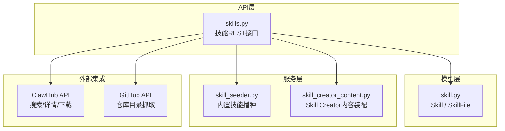
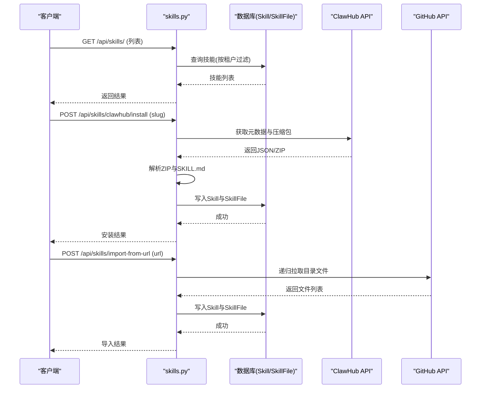
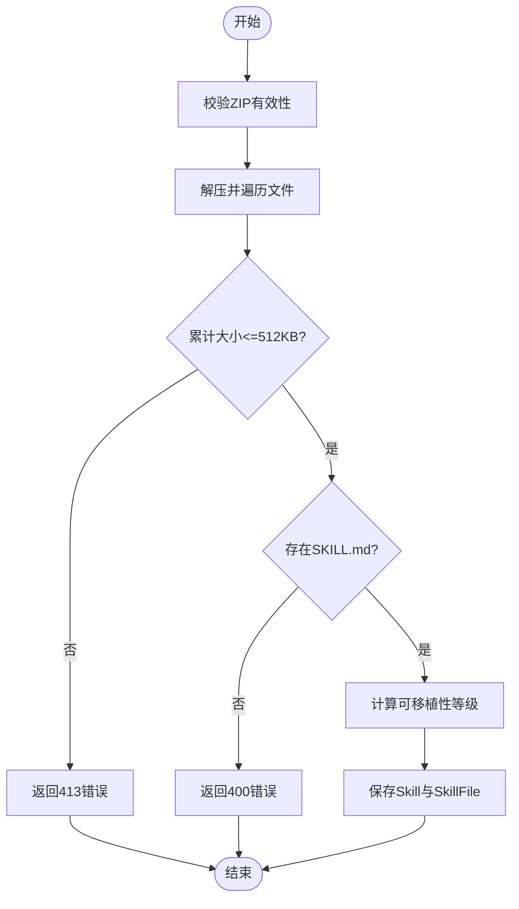
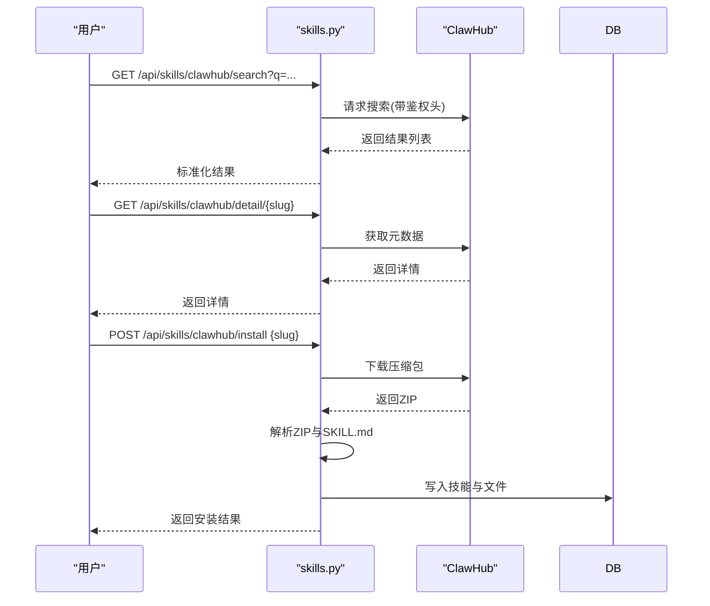
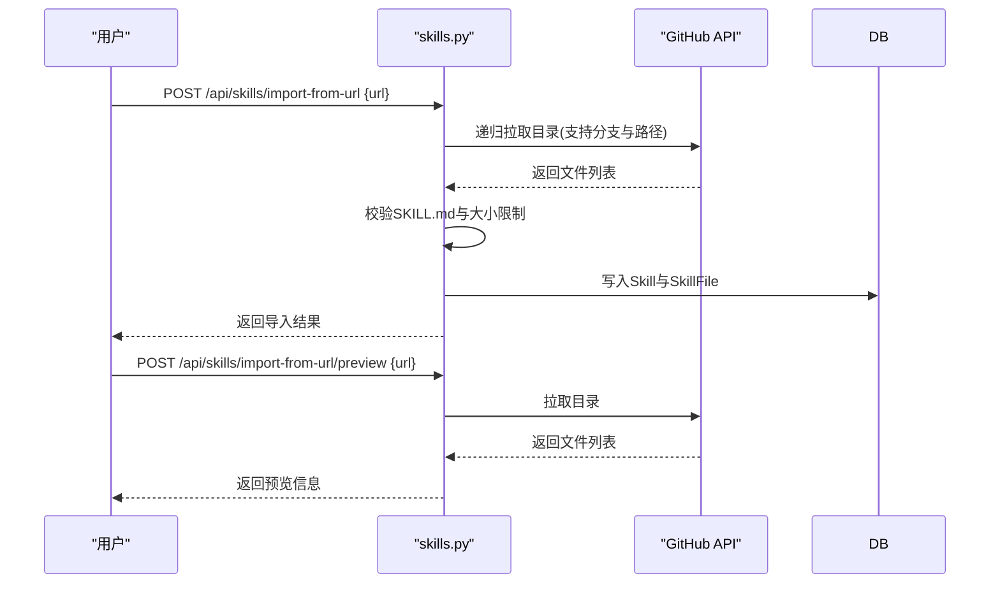
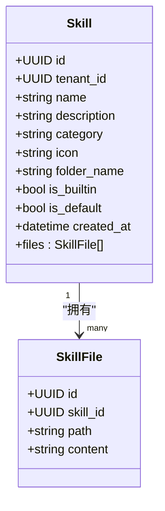
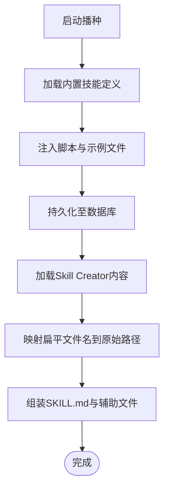
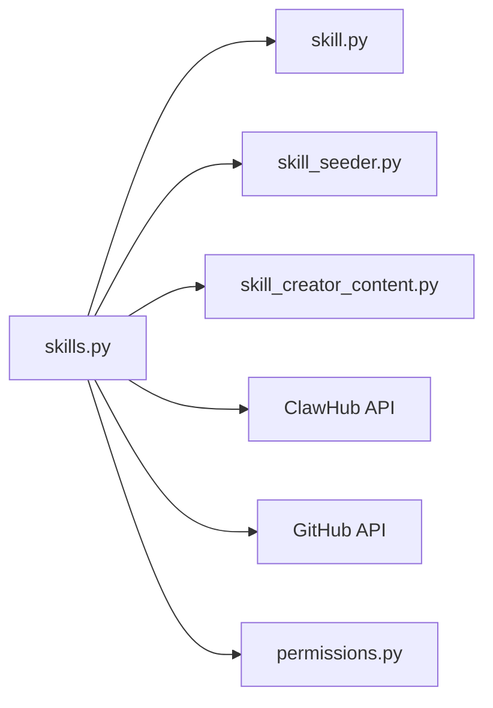

# Agent技能管理API

<cite>
**本文引用的文件**   
- [skills.py](file://backend/app/api/skills.py)
- [skill.py](file://backend/app/models/skill.py)
- [skill_seeder.py](file://backend/app/services/skill_seeder.py)
- [skill_creator_content.py](file://backend/app/services/skill_creator_content.py)
- [test_skills_api.py](file://backend/tests/test_skills_api.py)
- [permissions.py](file://backend/app/core/permissions.py)
- [SKILL.md（MCP安装器）](file://backend/agent_template/skills/mcp-installer/SKILL.md)
</cite>

## 目录
1. [简介](#简介)
2. [项目结构](#项目结构)
3. [核心组件](#核心组件)
4. [架构总览](#架构总览)
5. [详细组件分析](#详细组件分析)
6. [依赖关系分析](#依赖关系分析)
7. [性能考量](#性能考量)
8. [故障排查指南](#故障排查指南)
9. [结论](#结论)
10. [附录](#附录)

## 简介
本文件为Clawith平台的Agent技能管理系统提供完整的API文档与实现说明，覆盖技能的创建、发布、安装、卸载、搜索、分类浏览、版本管理等能力；同时给出技能包结构规范（元数据、文件组织、依赖声明）、权限控制与租户隔离策略、使用统计与企业级特性建议，以及开发指南、测试方法与部署流程。

## 项目结构
后端通过FastAPI暴露技能相关接口，模型层定义技能与文件持久化结构，服务层负责内置技能初始化与内容组装，测试覆盖关键路径与权限边界。

**图表来源** 
- [skills.py:1-120](file://backend/app/api/skills.py#L1-L120)
- [skill.py:1-44](file://backend/app/models/skill.py#L1-L44)
- [skill_seeder.py:1-120](file://backend/app/services/skill_seeder.py#L1-L120)
- [skill_creator_content.py:1-60](file://backend/app/services/skill_creator_content.py#L1-L60)

**章节来源**
- [skills.py:1-120](file://backend/app/api/skills.py#L1-L120)
- [skill.py:1-44](file://backend/app/models/skill.py#L1-L44)

## 核心组件
- 技能API路由：提供全局技能注册表的CRUD、ClawHub集成、URL导入等能力。
- 技能模型：Skill与SkillFile两个实体，支持多文件存储与租户隔离。
- 内置技能播种：启动时注入系统预置技能，包含示例脚本与模板。
- Skill Creator内容：动态拼装Skill Creator所需的全部辅助文件。

**章节来源**
- [skills.py:240-330](file://backend/app/api/skills.py#L240-L330)
- [skill.py:13-44](file://backend/app/models/skill.py#L13-L44)
- [skill_seeder.py:9-120](file://backend/app/services/skill_seeder.py#L9-L120)
- [skill_creator_content.py:1-60](file://backend/app/services/skill_creator_content.py#L1-L60)

## 架构总览
技能管理涉及“平台-租户-用户”三层权限与隔离，对外暴露统一的技能市场与安装入口，内部通过数据库持久化技能与文件，并支持与ClawHub和GitHub的集成。

**图表来源** 
- [skills.py:465-577](file://backend/app/api/skills.py#L465-L577)
- [skills.py:579-657](file://backend/app/api/skills.py#L579-L657)
- [skill.py:13-44](file://backend/app/models/skill.py#L13-L44)

## 详细组件分析

### 技能包结构与规范
- 根文件必须包含 SKILL.md，采用YAML frontmatter定义name、description等元数据。
- 可选资源目录：scripts（可执行脚本）、references（参考文档）、assets（输出模板/图标等）。
- 大小限制：单个技能包总大小不超过512KB，防止滥用。
- 可移植性分级：根据内容特征自动判定为纯提示词、CLI/API调用或OpenClaw原生三类。

**图表来源** 
- [skills.py:111-155](file://backend/app/api/skills.py#L111-L155)
- [skills.py:271-289](file://backend/app/api/skills.py#L271-L289)

**章节来源**
- [skills.py:111-155](file://backend/app/api/skills.py#L111-L155)
- [skills.py:271-289](file://backend/app/api/skills.py#L271-L289)

### 技能市场与搜索
- 搜索接口：代理到ClawHub搜索端点，支持官方与镜像回退，按q参数检索。
- 详情接口：获取指定slug的技能完整元数据。
- 安装接口：从ClawHub下载压缩包，解析SKILL.md与文件集合后入库。

**图表来源** 
- [skills.py:465-577](file://backend/app/api/skills.py#L465-L577)

**章节来源**
- [skills.py:465-577](file://backend/app/api/skills.py#L465-L577)

### URL导入与预览
- 支持从任意GitHub URL导入技能，自动递归拉取目录并校验SKILL.md存在。
- 提供预览接口，在不落库的情况下展示即将导入的文件清单与大小。

**图表来源** 
- [skills.py:579-657](file://backend/app/api/skills.py#L579-L657)

**章节来源**
- [skills.py:579-657](file://backend/app/api/skills.py#L579-L657)

### 标准CRUD与权限控制
- 列表：按租户范围返回内置与租户专属技能。
- 详情：加载技能及其文件集合。
- 创建：管理员可创建自定义技能，未提供文件时自动生成SKILL.md模板。
- 更新：支持替换元数据与文件集合。
- 删除：仅允许删除非内置技能，且受租户与角色约束。

**图表来源** 
- [skill.py:13-44](file://backend/app/models/skill.py#L13-L44)

**章节来源**
- [skills.py:662-799](file://backend/app/api/skills.py#L662-L799)
- [skill.py:13-44](file://backend/app/models/skill.py#L13-L44)

### 内置技能与内容装配
- 内置技能在启动时由seeder注入，包含Web Research、Data Analysis、Content Writing等常用能力。
- Skill Creator通过动态读取skill_creator_files目录下的文件，拼装出完整的技能包内容。

**图表来源** 
- [skill_seeder.py:9-120](file://backend/app/services/skill_seeder.py#L9-L120)
- [skill_creator_content.py:1-60](file://backend/app/services/skill_creator_content.py#L1-L60)

**章节来源**
- [skill_seeder.py:9-120](file://backend/app/services/skill_seeder.py#L9-L120)
- [skill_creator_content.py:1-60](file://backend/app/services/skill_creator_content.py#L1-L60)

### MCP工具安装器技能
- 该技能指导用户通过Smithery或直接URL方式安装MCP工具，处理OAuth授权与配置。
- 强调不直接索取第三方密钥，优先尝试已有公司/管理员级别配置。

**章节来源**
- [SKILL.md（MCP安装器）:1-111](file://backend/agent_template/skills/mcp-installer/SKILL.md#L1-L111)

## 依赖关系分析
- API层依赖模型层进行数据持久化，依赖服务层进行内置内容与种子数据装配。
- 外部依赖包括ClawHub与GitHub API，具备重试与镜像回退机制。
- 权限控制基于RBAC与租户隔离，确保跨租户不可见与越权访问拦截。

**图表来源** 
- [skills.py:1-120](file://backend/app/api/skills.py#L1-L120)
- [skill.py:1-44](file://backend/app/models/skill.py#L1-L44)
- [skill_seeder.py:1-120](file://backend/app/services/skill_seeder.py#L1-L120)
- [skill_creator_content.py:1-60](file://backend/app/services/skill_creator_content.py#L1-L60)
- [permissions.py:1-120](file://backend/app/core/permissions.py#L1-L120)

**章节来源**
- [skills.py:1-120](file://backend/app/api/skills.py#L1-L120)
- [permissions.py:1-120](file://backend/app/core/permissions.py#L1-L120)

## 性能考量
- 网络请求超时与重试：ClawHub与GitHub调用设置合理超时，失败时回退镜像或重试。
- 大小限制：对ZIP与GitHub目录总大小进行限制，避免内存与存储压力。
- 懒加载与分页：建议在大规模技能列表场景引入分页与按需加载文件内容。
- 缓存策略：对搜索结果与热门技能元数据增加缓存层以降低外部依赖延迟。

[本节为通用性能建议，不直接分析具体文件]

## 故障排查指南
- 常见错误码：
  - 400：缺少SKILL.md或URL格式无效。
  - 403：跨租户访问或无权限修改技能。
  - 404：技能不存在或远程资源缺失。
  - 413：技能包超过大小限制。
  - 429：外部API限流。
  - 502：外部服务连接失败或响应异常。
- 调试建议：
  - 检查环境变量CLAWHUB_BASE与CLAWHUB_MIRROR_BASE是否正确。
  - 确认GitHub token与ClawHub key是否配置于租户设置。
  - 查看日志中关于ZIP解析与SKILL.md前缀剥离的信息。

**章节来源**
- [skills.py:157-190](file://backend/app/api/skills.py#L157-L190)
- [skills.py:204-244](file://backend/app/api/skills.py#L204-L244)
- [skills.py:320-343](file://backend/app/api/skills.py#L320-L343)

## 结论
Clawith技能管理系统以清晰的API设计、严格的权限与租户隔离、完善的技能包规范与丰富的外部集成为基础，提供了企业级的技能生命周期管理能力。通过内置技能播种与Skill Creator内容装配，平台能够快速扩展与迭代技能生态。

[本节为总结性内容，不直接分析具体文件]

## 附录

### API清单与行为说明
- 列表技能：GET /api/skills/，按租户范围返回内置与租户专属技能。
- 获取详情：GET /api/skills/{skill_id}，返回技能与文件集合。
- 创建技能：POST /api/skills/，管理员可创建自定义技能。
- 更新技能：PUT /api/skills/{skill_id}，支持元数据与文件替换。
- 删除技能：DELETE /api/skills/{skill_id}，仅允许删除非内置技能。
- ClawHub搜索：GET /api/skills/clawhub/search?q=...
- ClawHub详情：GET /api/skills/clawhub/detail/{slug}
- ClawHub安装：POST /api/skills/clawhub/install {slug}
- URL导入：POST /api/skills/import-from-url {url}
- URL预览：POST /api/skills/import-from-url/preview {url}

**章节来源**
- [skills.py:465-799](file://backend/app/api/skills.py#L465-L799)

### 技能包示例与最佳实践
- 最小包：仅包含SKILL.md，使用YAML frontmatter定义name与description。
- 推荐结构：scripts用于可执行脚本，references存放参考文档，assets存放模板与图标。
- 命名规范：folder_name需唯一，避免冲突；category建议使用语义化分类。
- 安全建议：避免在SKILL.md中硬编码敏感信息，使用环境变量或平台密钥管理。

**章节来源**
- [skill_seeder.py:9-120](file://backend/app/services/skill_seeder.py#L9-L120)
- [skill_creator_content.py:1-60](file://backend/app/services/skill_creator_content.py#L1-L60)

### 测试方法
- 单元测试覆盖权限边界与写入路径，验证租户隔离与角色控制。
- 使用ASGI传输模拟HTTP请求，断言数据库操作与返回状态。
- 重点用例：组织管理员删除自定义技能、平台管理员写入租户技能且不触发懒加载文件迭代。

**章节来源**
- [test_skills_api.py:1-209](file://backend/tests/test_skills_api.py#L1-L209)

### 部署流程建议
- 环境准备：配置PostgreSQL、Redis、ClawHub与GitHub凭据。
- 启动服务：运行后端容器，确保seed任务执行以注入内置技能。
- 监控告警：关注外部API限流与错误率，设置合理的重试与熔断策略。

[本节为通用部署建议，不直接分析具体文件]