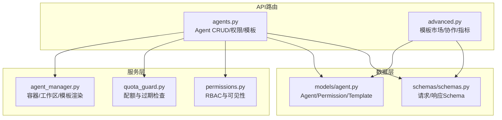
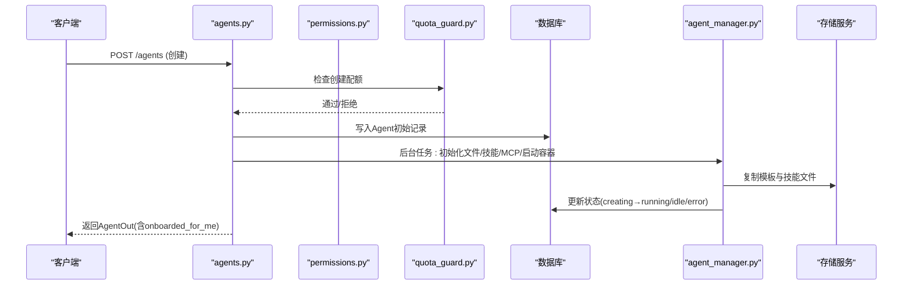
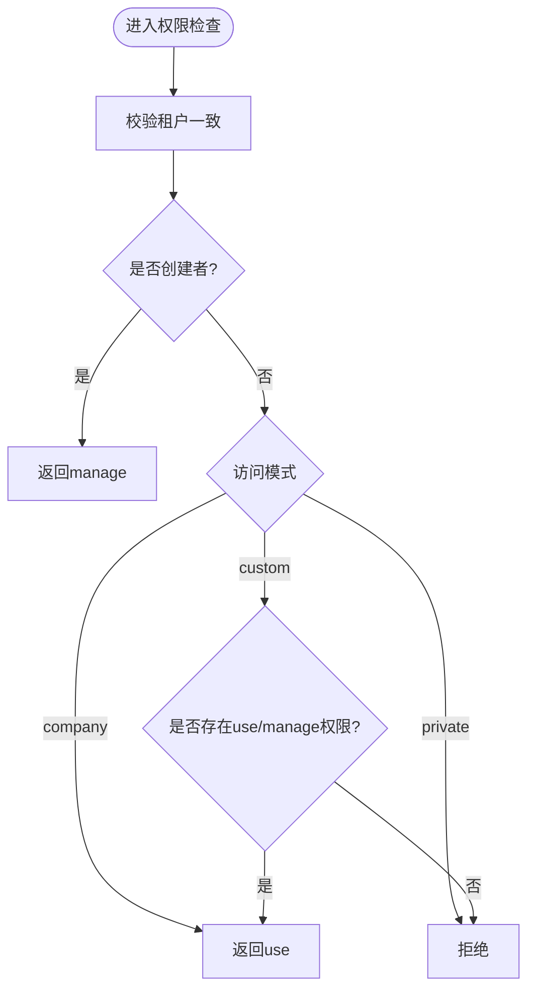
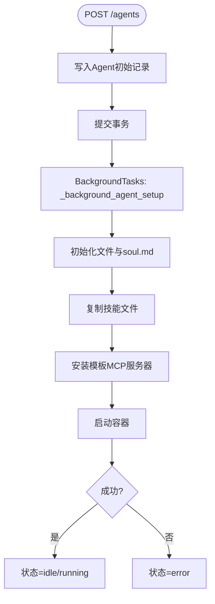
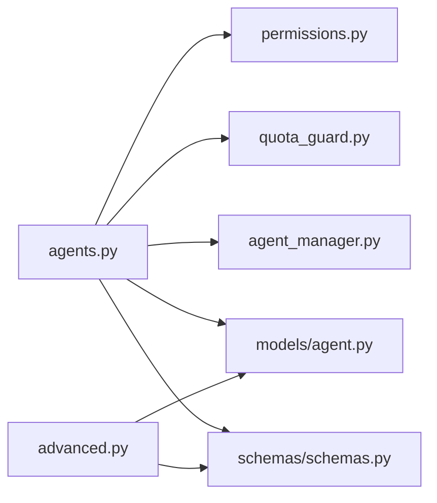

# Agent核心管理API

<cite>
**本文引用的文件**   
- [backend/app/api/agents.py](file://backend/app/api/agents.py)
- [backend/app/api/advanced.py](file://backend/app/api/advanced.py)
- [backend/app/services/agent_manager.py](file://backend/app/services/agent_manager.py)
- [backend/app/models/agent.py](file://backend/app/models/agent.py)
- [backend/app/schemas/schemas.py](file://backend/app/schemas/schemas.py)
- [backend/app/core/permissions.py](file://backend/app/core/permissions.py)
- [backend/app/services/quota_guard.py](file://backend/app/services/quota_guard.py)
</cite>

## 目录
1. [简介](#简介)
2. [项目结构](#项目结构)
3. [核心组件](#核心组件)
4. [架构总览](#架构总览)
5. [详细组件分析](#详细组件分析)
6. [依赖关系分析](#依赖关系分析)
7. [性能考虑](#性能考虑)
8. [故障排查指南](#故障排查指南)
9. [结论](#结论)
10. [附录：API参考与示例](#附录api参考与示例)

## 简介
本文件为Clawith平台Agent（数字员工）核心管理的API文档，覆盖完整的生命周期接口（创建、查询、更新、删除）、模板系统（模板列表、应用、自定义配置）、权限控制（访问级别、用户权限、公司级权限）、配额限制（创建限额、LLM调用限额、心跳下限等）、模型配置（主/备模型、激活校验）、环境变量与容器化运行（OpenClaw Gateway），以及错误处理与状态流转。

## 项目结构
Agent相关能力由以下模块协作实现：
- API路由层：定义REST接口，鉴权、参数校验、业务编排
- 服务层：Agent生命周期管理、存储、配额守卫、权限判定
- 数据模型层：Agent、AgentPermission、AgentTemplate等ORM模型
- Schema层：请求/响应数据结构定义

图表来源
- [backend/app/api/agents.py:1-40](file://backend/app/api/agents.py#L1-L40)
- [backend/app/api/advanced.py:1-30](file://backend/app/api/advanced.py#L1-L30)
- [backend/app/services/agent_manager.py:1-30](file://backend/app/services/agent_manager.py#L1-L30)
- [backend/app/core/permissions.py:1-30](file://backend/app/core/permissions.py#L1-L30)
- [backend/app/models/agent.py:1-40](file://backend/app/models/agent.py#L1-L40)
- [backend/app/schemas/schemas.py:1-40](file://backend/app/schemas/schemas.py#L1-L40)

章节来源
- [backend/app/api/agents.py:1-40](file://backend/app/api/agents.py#L1-L40)
- [backend/app/api/advanced.py:1-30](file://backend/app/api/advanced.py#L1-L30)

## 核心组件
- Agent模型与权限
  - Agent：数字员工实例，包含类型（native/openclaw）、状态、模型、配额、心跳、时区、过期等字段
  - AgentPermission：按公司/用户维度的访问控制（use/manage）
  - AgentTemplate：模板元数据与默认技能/MCP服务器/自主策略
- 生命周期管理
  - 创建：校验配额、租户默认值、模型有效性、写入初始状态、后台初始化文件系统与容器
  - 查询：按权限过滤、未读计数、Onboarding标记
  - 更新：字段校验、租户下限约束、同步Participant信息
  - 删除：软删除、清理锁、停止/移除容器、取消进行中的Run
- 模板系统
  - 模板列表：内置优先排序，返回能力要点、默认技能、MCP服务器
  - 模板应用：创建时自动复制技能、安装MCP、生成soul.md并注入Personality/Boundaries
- 权限控制
  - 访问模式：company/private/custom；管理员与创建者特权；显式用户授权
  - 可见性：build_visible_agents_query统一过滤
- 配额与限制
  - 创建配额：按用户非过期Agent数量限制
  - LLM调用配额：按日重置与上限
  - 心跳下限：租户级最小间隔强制
- 模型与环境变量
  - 主/备模型：创建/更新时校验活跃模型
  - OpenClaw容器：动态生成openclaw.json，注入Provider API Key环境变量

章节来源
- [backend/app/models/agent.py:1-235](file://backend/app/models/agent.py#L1-L235)
- [backend/app/schemas/schemas.py:214-325](file://backend/app/schemas/schemas.py#L214-L325)
- [backend/app/core/permissions.py:213-250](file://backend/app/core/permissions.py#L213-L250)
- [backend/app/services/quota_guard.py:176-206](file://backend/app/services/quota_guard.py#L176-L206)
- [backend/app/services/agent_manager.py:230-316](file://backend/app/services/agent_manager.py#L230-L316)

## 架构总览
Agent API通过FastAPI路由暴露，结合权限与配额守卫，调用AgentManager完成容器与工作区初始化，持久化到数据库并通过事件/钩子联动其他子系统（如OKR）。

图表来源
- [backend/app/api/agents.py:409-591](file://backend/app/api/agents.py#L409-L591)
- [backend/app/services/agent_manager.py:94-229](file://backend/app/services/agent_manager.py#L94-L229)
- [backend/app/services/quota_guard.py:176-206](file://backend/app/services/quota_guard.py#L176-L206)

## 详细组件分析

### Agent生命周期API
- GET /agents
  - 功能：列出当前用户可访问的Agent，附带未读消息计数与Onboarding标记
  - 权限：同租户可见性过滤（公司/私有/自定义）
  - 输出：AgentOut数组
- GET /agents/{agent_id}
  - 功能：获取Agent详情，包括creator用户名、有效时区、access_level
  - 权限：check_agent_access
- PATCH /agents/{agent_id}
  - 功能：更新Agent设置，支持模型、上下文窗口、触发器限制、心跳、时区、过期时间（仅管理员）
  - 约束：心跳与触发器限制受租户下限/上限钳制，返回_clamped_fields
- DELETE /agents/{agent_id}
  - 功能：逻辑删除，记录审计日志，取消进行中的Run，清理编辑锁，停止/移除容器
  - 权限：创建者或管理员；系统Agent不可删除
- POST /agents/{agent_id}/start, /stop
  - 功能：启停Agent容器，返回最新AgentOut
- POST /agents/{agent_id}/api-key
  - 功能：为OpenClaw类型Agent生成或重置API Key（仅创建者或管理员）
- GET /agents/{agent_id}/gateway-messages
  - 功能：拉取最近网关消息（OpenClaw）

章节来源
- [backend/app/api/agents.py:201-239](file://backend/app/api/agents.py#L201-L239)
- [backend/app/api/agents.py:593-633](file://backend/app/api/agents.py#L593-L633)
- [backend/app/api/agents.py:913-1027](file://backend/app/api/agents.py#L913-L1027)
- [backend/app/api/agents.py:1030-1119](file://backend/app/api/agents.py#L1030-L1119)
- [backend/app/api/agents.py:1121-1155](file://backend/app/api/agents.py#L1121-L1155)
- [backend/app/api/agents.py:1228-1246](file://backend/app/api/agents.py#L1228-L1246)
- [backend/app/api/agents.py:1248-1286](file://backend/app/api/agents.py#L1248-L1286)

### 模板系统API
- GET /agents/templates
  - 功能：列出所有可用模板（内置优先），返回名称、描述、图标、分类、能力要点、默认技能、默认MCP服务器、默认自主策略
- GET /templates（高级接口）
  - 功能：模板市场列表（可按category过滤）
- GET /templates/{template_id}
  - 功能：获取模板详情
- POST /templates
  - 功能：创建模板（分享至模板市场）
- DELETE /templates/{template_id}
  - 功能：删除模板（管理员或创建者）

章节来源
- [backend/app/api/agents.py:142-168](file://backend/app/api/agents.py#L142-L168)
- [backend/app/api/advanced.py:104-161](file://backend/app/api/advanced.py#L104-L161)

### 权限控制机制
- 访问模式
  - company：公司内所有活跃用户可用；Plaza启用
  - private：仅创建者可管理/使用；隐藏于Plaza
  - custom：所有人可用，但显式用户行授予管理权限；Plaza禁用
- 权限粒度
  - use：任务/聊天/工具/技能/工作区
  - manage：完整访问（修改设置、权限、启停、删除等）
- 可见性与访问判定
  - build_visible_agents_query：按租户+创建者/公司/自定义权限过滤
  - check_agent_access：返回(access_level='manage'|'use')或抛出403/404
  - can_use_agent/can_manage_agent：细粒度判断

图表来源
- [backend/app/core/permissions.py:213-250](file://backend/app/core/permissions.py#L213-L250)
- [backend/app/core/permissions.py:481-518](file://backend/app/core/permissions.py#L481-L518)
- [backend/app/core/permissions.py:65-93](file://backend/app/core/permissions.py#L65-L93)
- [backend/app/core/permissions.py:95-129](file://backend/app/core/permissions.py#L95-L129)

章节来源
- [backend/app/core/permissions.py:26-63](file://backend/app/core/permissions.py#L26-L63)
- [backend/app/core/permissions.py:481-518](file://backend/app/core/permissions.py#L481-L518)

### 配额与限制
- 创建配额
  - check_agent_creation_quota：统计用户非过期Agent数量，超过配额抛出QuotaExceeded
- LLM调用配额
  - check_agent_llm_quota/increment_agent_llm_usage：按日重置与上限
- 心跳下限
  - enforce_heartbeat_floor：将低于租户最小值的Agent心跳间隔提升到下限
- 过期控制
  - check_agent_expired：若expires_at到期则标记is_expired并停止

章节来源
- [backend/app/services/quota_guard.py:176-206](file://backend/app/services/quota_guard.py#L176-L206)
- [backend/app/services/quota_guard.py:121-174](file://backend/app/services/quota_guard.py#L121-L174)
- [backend/app/services/quota_guard.py:211-254](file://backend/app/services/quota_guard.py#L211-L254)
- [backend/app/services/quota_guard.py:87-116](file://backend/app/services/quota_guard.py#L87-L116)

### 模型配置与环境变量
- 模型选择
  - 创建/更新时校验primary_model_id/fallback_model_id是否为活跃模型
  - 若未指定，回退租户默认模型（需活跃）
- OpenClaw容器配置
  - _generate_openclaw_config：生成openclaw.json，注入{PROVIDER}_API_KEY环境变量
  - start_container：挂载工作区、分配端口、启动容器、更新状态

章节来源
- [backend/app/api/agents.py:56-70](file://backend/app/api/agents.py#L56-L70)
- [backend/app/api/agents.py:457-477](file://backend/app/api/agents.py#L457-L477)
- [backend/app/services/agent_manager.py:230-316](file://backend/app/services/agent_manager.py#L230-L316)

### 背景任务与状态管理
- 创建流程
  - 立即提交初始状态（creating/idle），随后后台执行：
    - 初始化工作区与soul.md（注入Personality/Boundaries）
    - 解析并复制技能文件
    - 预装模板指定的MCP服务器
    - 启动容器并挂钩OKR
- 状态机
  - creating → running/idle（成功）
  - error（任一阶段异常）
  - stopped（手动停止或删除）

图表来源
- [backend/app/api/agents.py:409-591](file://backend/app/api/agents.py#L409-L591)
- [backend/app/api/agents.py:242-407](file://backend/app/api/agents.py#L242-L407)
- [backend/app/services/agent_manager.py:94-229](file://backend/app/services/agent_manager.py#L94-L229)

章节来源
- [backend/app/api/agents.py:242-407](file://backend/app/api/agents.py#L242-L407)

## 依赖关系分析
- API路由依赖
  - agents.py依赖：权限、安全、数据库会话、模型、Schema、配额守卫、AgentManager、资源发现、模型解析
  - advanced.py依赖：权限、安全、数据库会话、模型、协作服务
- 服务层依赖
  - agent_manager.py依赖：Docker、存储后端、模型解析、LLM密钥获取
  - quota_guard.py依赖：数据库会话、模型
  - permissions.py依赖：模型、SQLAlchemy查询构建
- 数据层依赖
  - models/agent.py定义Agent、AgentPermission、AgentTemplate等实体及关系
  - schemas/schemas.py定义AgentCreate/AgentUpdate/AgentOut等结构

图表来源
- [backend/app/api/agents.py:1-38](file://backend/app/api/agents.py#L1-L38)
- [backend/app/api/advanced.py:1-16](file://backend/app/api/advanced.py#L1-L16)
- [backend/app/services/agent_manager.py:1-21](file://backend/app/services/agent_manager.py#L1-L21)
- [backend/app/core/permissions.py:1-15](file://backend/app/core/permissions.py#L1-L15)
- [backend/app/models/agent.py:1-20](file://backend/app/models/agent.py#L1-L20)
- [backend/app/schemas/schemas.py:1-20](file://backend/app/schemas/schemas.py#L1-L20)

章节来源
- [backend/app/api/agents.py:1-38](file://backend/app/api/agents.py#L1-L38)
- [backend/app/api/advanced.py:1-16](file://backend/app/api/advanced.py#L1-L16)

## 性能考虑
- 批量查询与懒加载
  - 列表接口一次性加载onboarded状态与未读计数，避免N+1查询
- 异步与短事务
  - 背景任务分步执行，每步独立短事务，降低锁竞争
- 并发I/O
  - 技能文件复制使用并发写入，提升初始化速度
- 索引优化
  - Agent表按tenant_id+created_at建立索引，加速可见性查询

[本节为通用指导，不直接分析具体文件]

## 故障排查指南
- 常见错误
  - 403 Forbidden：租户不一致、无访问权限、非创建者/管理员操作受限字段
  - 400 Bad Request：模型ID无效、scope_type不支持、字段越界
  - 404 Not Found：Agent不存在
  - 409 Conflict：系统Agent不可删除
- 定位步骤
  - 检查check_agent_access返回值与权限记录
  - 查看配额守卫抛出的QuotaExceeded/AgentExpired
  - 确认Docker可用性、容器端口冲突、镜像配置
  - 核对租户默认模型是否活跃
- 恢复建议
  - 调整租户心跳下限/触发器限制
  - 重新生成OpenClaw API Key
  - 重启/删除并重建容器

章节来源
- [backend/app/core/permissions.py:481-518](file://backend/app/core/permissions.py#L481-L518)
- [backend/app/services/quota_guard.py:11-26](file://backend/app/services/quota_guard.py#L11-L26)
- [backend/app/api/agents.py:1030-1119](file://backend/app/api/agents.py#L1030-L1119)

## 结论
Agent核心管理API围绕“权限-配额-模型-容器”四大维度构建，提供完善的CRUD、模板应用、权限控制与运行时管理能力。通过清晰的职责分层与健壮的错误处理，确保在多租户环境下稳定扩展。

[本节为总结，不直接分析具体文件]

## 附录：API参考与示例

### 请求/响应结构（摘要）
- AgentCreate
  - 字段：name、agent_type、role_description、bio、welcome_message、avatar_url、personality、boundaries、primary_model_id、fallback_model_id、permission_scope_type、permission_scope_ids、permission_access_level、tenant_id、template_id、autonomy_policy、max_tokens_per_day、max_tokens_per_month、skill_ids
- AgentUpdate
  - 字段：name、role_description、bio、welcome_message、avatar_url、autonomy_policy、primary_model_id、fallback_model_id、context_window_size、max_tokens_per_day、max_tokens_per_month、max_tool_rounds、max_triggers、min_poll_interval_min、webhook_rate_limit、heartbeat_enabled、heartbeat_interval_minutes、heartbeat_active_hours、timezone、expires_at
- AgentOut
  - 字段：id、name、avatar_url、role_description、bio、welcome_message、status、creator_id、creator_username、primary_model_id、fallback_model_id、autonomy_policy、tokens_used_today/month/total、cache_read/creation tokens、limits、context_window_size、max_tool_rounds、max_triggers、min_poll_interval_min、webhook_rate_limit、heartbeat_*、timezone、expires_at、is_expired、is_system、access_mode、company_access_level、llm_calls_today/max_llm_calls_per_day、agent_type、openclaw_last_seen、unread_count、has_api_key、api_key_hash、onboarded_for_me、created_at、last_active_at、deleted_at

章节来源
- [backend/app/schemas/schemas.py:214-325](file://backend/app/schemas/schemas.py#L214-L325)
- [backend/app/schemas/schemas.py:245-301](file://backend/app/schemas/schemas.py#L245-L301)

### 典型流程示例（文字说明）
- 创建Agent（native）
  - 请求：POST /agents，携带AgentCreate
  - 处理：校验配额→确定租户默认值→校验模型→写入Agent→创建Participant→设置权限→提交事务→后台初始化文件/技能/MCP→启动容器
  - 响应：AgentOut（不含api_key）
- 创建Agent（openclaw）
  - 请求：POST /agents，agent_type=openclaw
  - 处理：跳过文件/容器初始化→生成API Key→可选挂钩OKR
  - 响应：AgentOut + api_key（首次返回）
- 更新Agent
  - 请求：PATCH /agents/{agent_id}，携带AgentUpdate
  - 处理：权限校验→模型校验→租户下限钳制→同步Participant→返回AgentOut（可能含_clamped_fields）
- 删除Agent
  - 请求：DELETE /agents/{agent_id}
  - 处理：权限校验→软删除→审计日志→取消Run→清理锁→停止/移除容器
  - 响应：204 No Content

[本节为概念性示例，不直接分析具体文件]