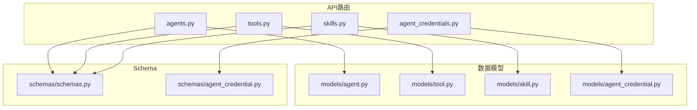
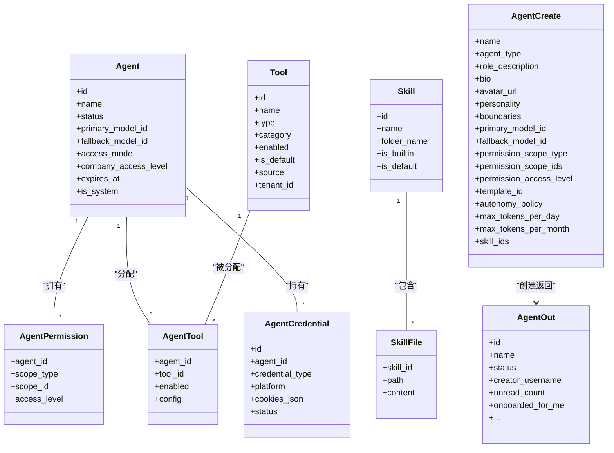
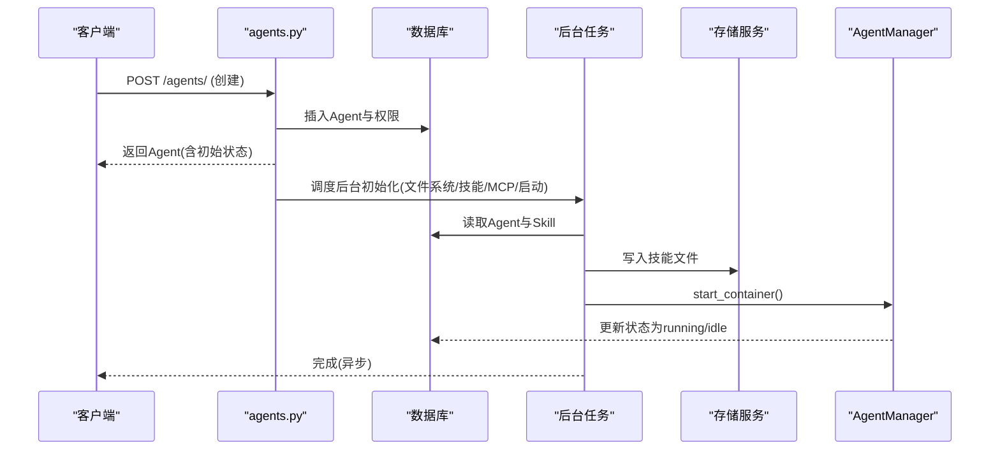
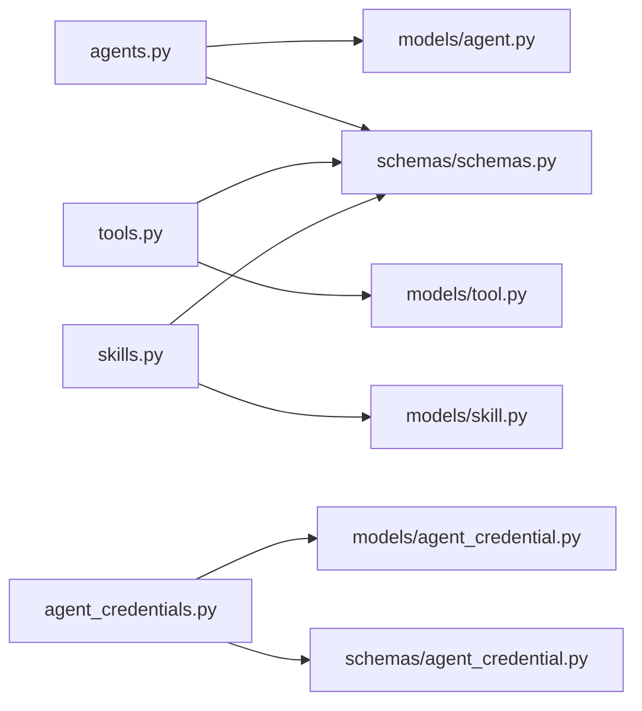

# Agent管理API

<cite>
**本文引用的文件**   
- [backend/app/api/agents.py](file://backend/app/api/agents.py)
- [backend/app/api/agent_credentials.py](file://backend/app/api/agent_credentials.py)
- [backend/app/api/skills.py](file://backend/app/api/skills.py)
- [backend/app/api/tools.py](file://backend/app/api/tools.py)
- [backend/app/models/agent.py](file://backend/app/models/agent.py)
- [backend/app/models/tool.py](file://backend/app/models/tool.py)
- [backend/app/models/skill.py](file://backend/app/models/skill.py)
- [backend/app/models/agent_credential.py](file://backend/app/models/agent_credential.py)
- [backend/app/schemas/schemas.py](file://backend/app/schemas/schemas.py)
- [backend/app/schemas/agent_credential.py](file://backend/app/schemas/agent_credential.py)
</cite>

## 目录
1. [简介](#简介)
2. [项目结构](#项目结构)
3. [核心组件](#核心组件)
4. [架构总览](#架构总览)
5. [详细组件分析](#详细组件分析)
6. [依赖关系分析](#依赖关系分析)
7. [性能考量](#性能考量)
8. [故障排查指南](#故障排查指南)
9. [结论](#结论)
10. [附录：接口清单与示例](#附录接口清单与示例)

## 简介
本文件为Clawith平台Agent管理系统的完整API文档，覆盖以下能力：
- Agent的CRUD、生命周期（创建、启动、停止、删除）、权限与访问控制、运行状态监控
- 模板管理（列出可用模板）
- 技能包管理（全局技能注册、导入、安装、预览）
- 工具配置（工具列表、按Agent分配、MCP服务器级配置、Smithery授权状态）
- Agent凭据管理（加密存储浏览器Cookie等敏感信息）
- 高级功能：配额限制、模型选择校验、心跳与触发器限制、OpenClaw API Key管理、网关消息查询

## 项目结构
后端采用FastAPI路由+SQLAlchemy ORM+Pydantic校验的分层设计。关键模块：
- API路由：按功能划分在app/api下（agents、tools、skills、agent_credentials等）
- 数据模型：app/models（Agent、Tool、Skill、AgentCredential等）
- 请求/响应Schema：app/schemas（AgentCreate/Update/Out、AgentCredential相关等）
- 服务层：app/services（agent_manager、tool_config、resource_discovery等）

图表来源
- [backend/app/api/agents.py:1-40](file://backend/app/api/agents.py#L1-L40)
- [backend/app/api/tools.py:1-30](file://backend/app/api/tools.py#L1-L30)
- [backend/app/api/skills.py:1-25](file://backend/app/api/skills.py#L1-L25)
- [backend/app/api/agent_credentials.py:1-28](file://backend/app/api/agent_credentials.py#L1-L28)
- [backend/app/models/agent.py:1-35](file://backend/app/models/agent.py#L1-L35)
- [backend/app/models/tool.py:1-20](file://backend/app/models/tool.py#L1-L20)
- [backend/app/models/skill.py:1-15](file://backend/app/models/skill.py#L1-L15)
- [backend/app/models/agent_credential.py:1-20](file://backend/app/models/agent_credential.py#L1-L20)
- [backend/app/schemas/schemas.py:1-20](file://backend/app/schemas/schemas.py#L1-L20)
- [backend/app/schemas/agent_credential.py:1-20](file://backend/app/schemas/agent_credential.py#L1-L20)

章节来源
- [backend/app/api/agents.py:1-40](file://backend/app/api/agents.py#L1-L40)
- [backend/app/api/tools.py:1-30](file://backend/app/api/tools.py#L1-L30)
- [backend/app/api/skills.py:1-25](file://backend/app/api/skills.py#L1-L25)
- [backend/app/api/agent_credentials.py:1-28](file://backend/app/api/agent_credentials.py#L1-L28)

## 核心组件
- Agent实体与权限：包含基础信息、运行时状态、模型配置、配额与心跳、访问模式与权限表
- 工具与分配：全局工具定义与按Agent启用/禁用及配置覆盖
- 技能包：全局技能注册、从ClawHub/GitHub导入、文件内容管理
- 凭据：Agent对第三方平台的会话Cookie等敏感凭据加密存储与更新

章节来源
- [backend/app/models/agent.py:1-235](file://backend/app/models/agent.py#L1-L235)
- [backend/app/models/tool.py:1-63](file://backend/app/models/tool.py#L1-L63)
- [backend/app/models/skill.py:1-44](file://backend/app/models/skill.py#L1-L44)
- [backend/app/models/agent_credential.py:1-78](file://backend/app/models/agent_credential.py#L1-L78)

## 架构总览
下图展示Agent管理相关API与其依赖的数据模型和Schema的关系。

图表来源
- [backend/app/models/agent.py:1-235](file://backend/app/models/agent.py#L1-L235)
- [backend/app/models/tool.py:1-63](file://backend/app/models/tool.py#L1-L63)
- [backend/app/models/skill.py:1-44](file://backend/app/models/skill.py#L1-L44)
- [backend/app/models/agent_credential.py:1-78](file://backend/app/models/agent_credential.py#L1-L78)
- [backend/app/schemas/schemas.py:215-301](file://backend/app/schemas/schemas.py#L215-L301)

## 详细组件分析

### Agent管理API
- 模板列表：GET /agents/templates
  - 描述：列出所有可用的Agent模板（内置/自定义），包含名称、描述、图标、分类、默认技能、默认MCP服务器等
  - 权限：已认证用户
  - 响应：模板数组
  - 参考实现路径：[list_templates:142-168](file://backend/app/api/agents.py#L142-L168)

- 列出Agent：GET /agents/
  - 描述：列出当前用户可访问的Agent，附带未读消息计数与是否已完成引导
  - 权限：已认证用户；支持按租户过滤（仅允许自身租户）
  - 行为：懒重置Token计数器；计算未读数；填充onboarded_for_me
  - 参考实现路径：[list_agents:201-239](file://backend/app/api/agents.py#L201-L239)

- 创建Agent：POST /agents/
  - 描述：创建新的数字员工（native或openclaw）。支持模板、技能、权限、模型、配额、心跳策略等
  - 权限：已认证用户；受配额限制
  - 流程要点：
    - 校验并解析目标租户与默认限额
    - 校验主/备模型有效性
    - 设置权限范围（公司/用户/自定义）
    - OpenClaw类型直接生成API Key并返回一次
    - native类型异步后台初始化文件系统、复制技能、预装MCP、启动容器
  - 参考实现路径：[create_agent:409-590](file://backend/app/api/agents.py#L409-L590)、[_background_agent_setup:242-407](file://backend/app/api/agents.py#L242-L407)

- 获取Agent详情：GET /agents/{agent_id}
  - 描述：返回Agent详情，包括有效时区、创建者用户名、访问级别等
  - 权限：具备访问权限的用户
  - 参考实现路径：[get_agent:593-633](file://backend/app/api/agents.py#L593-L633)

- 更新Agent：PATCH /agents/{agent_id}
  - 描述：更新Agent设置（名称、角色描述、模型、上下文窗口、触发器限制、心跳策略、过期时间等）
  - 权限：创建者或管理员；过期时间修改仅限管理员
  - 行为：强制租户下限（心跳间隔、最小轮询间隔、Webhook速率上限）；同步Participant显示信息
  - 参考实现路径：[update_agent:913-1027](file://backend/app/api/agents.py#L913-L1027)

- 删除Agent：DELETE /agents/{agent_id}
  - 描述：逻辑删除，保留历史与Workspace；系统Agent不可删除
  - 权限：创建者或管理员
  - 行为：记录审计日志；取消进行中的运行；清理编辑锁；尝试移除容器
  - 参考实现路径：[delete_agent:1030-1119](file://backend/app/api/agents.py#L1030-L1119)

- 启动Agent：POST /agents/{agent_id}/start
  - 描述：启动Agent容器
  - 权限：具备manage权限
  - 参考实现路径：[start_agent:1121-1136](file://backend/app/api/agents.py#L1121-L1136)

- 停止Agent：POST /agents/{agent_id}/stop
  - 描述：停止Agent容器
  - 权限：具备manage权限
  - 参考实现路径：[stop_agent:1139-1154](file://backend/app/api/agents.py#L1139-L1154)

- 权限管理：
  - GET /agents/{agent_id}/permissions：查看权限范围与有效访问级别
  - PUT /agents/{agent_id}/permissions：更新权限范围（公司/私有/自定义）
  - GET /agents/{agent_id}/permissions/candidates：获取可授予权限的组织成员候选
  - 参考实现路径：[get_agent_permissions:636-731](file://backend/app/api/agents.py#L636-L731)、[update_agent_permissions:734-829](file://backend/app/api/agents.py#L734-L829)、[get_agent_permission_candidates:832-910](file://backend/app/api/agents.py#L832-L910)

- 审批流：
  - GET /agents/{agent_id}/approvals：列出某Agent的审批请求
  - POST /agents/{agent_id}/approvals/{approval_id}/resolve：通过或拒绝审批
  - 参考实现路径：[list_agent_approvals:1160-1195](file://backend/app/api/agents.py#L1160-L1195)、[resolve_agent_approval:1198-1222](file://backend/app/api/agents.py#L1198-L1222)

- OpenClaw API Key管理：
  - POST /agents/{agent_id}/api-key：生成或重置API Key（仅OpenClaw类型）
  - GET /agents/{agent_id}/gateway-messages：查看最近网关消息
  - 参考实现路径：[generate_or_reset_api_key:1228-1245](file://backend/app/api/agents.py#L1228-L1245)、[list_gateway_messages:1248-1285](file://backend/app/api/agents.py#L1248-L1285)

章节来源
- [backend/app/api/agents.py:142-168](file://backend/app/api/agents.py#L142-L168)
- [backend/app/api/agents.py:201-239](file://backend/app/api/agents.py#L201-L239)
- [backend/app/api/agents.py:242-407](file://backend/app/api/agents.py#L242-L407)
- [backend/app/api/agents.py:409-590](file://backend/app/api/agents.py#L409-L590)
- [backend/app/api/agents.py:593-633](file://backend/app/api/agents.py#L593-L633)
- [backend/app/api/agents.py:734-829](file://backend/app/api/agents.py#L734-L829)
- [backend/app/api/agents.py:832-910](file://backend/app/api/agents.py#L832-L910)
- [backend/app/api/agents.py:913-1027](file://backend/app/api/agents.py#L913-L1027)
- [backend/app/api/agents.py:1030-1119](file://backend/app/api/agents.py#L1030-L1119)
- [backend/app/api/agents.py:1121-1154](file://backend/app/api/agents.py#L1121-L1154)
- [backend/app/api/agents.py:1160-1222](file://backend/app/api/agents.py#L1160-L1222)
- [backend/app/api/agents.py:1228-1285](file://backend/app/api/agents.py#L1228-L1285)

### 工具管理API
- 工具列表：GET /tools
  - 描述：列出平台工具（builtin/admin），按租户作用域过滤
  - 权限：已认证用户
  - 行为：合并公司级配置；返回config_schema用于前端渲染
  - 参考实现路径：[list_tools:195-236](file://backend/app/api/tools.py#L195-L236)

- 创建工具：POST /tools
  - 描述：创建新工具（通常为MCP），支持指定target tenant（平台管理员跨租户导入）
  - 权限：已认证用户
  - 参考实现路径：[create_tool:239-280](file://backend/app/api/tools.py#L239-L280)

- 批量更新工具：PUT /tools/bulk
  - 描述：批量更新多个工具的enabled状态
  - 参考实现路径：[update_tools_bulk:291-307](file://backend/app/api/tools.py#L291-L307)

- 更新工具：PUT /tools/{tool_id}
  - 描述：更新工具元数据与配置；builtin工具需tenant_id并通过set_tenant_tool_config写入
  - 参考实现路径：[update_tool:310-338](file://backend/app/api/tools.py#L310-L338)

- 删除工具：DELETE /tools/{tool_id}
  - 描述：删除非builtin工具；同时清理关联的AgentTool
  - 参考实现路径：[delete_tool:341-358](file://backend/app/api/tools.py#L341-L358)

- 按Agent获取工具：GET /tools/agents/{agent_id}
  - 描述：返回该Agent可见且启用的工具列表（含is_default与显式分配）
  - 行为：自动回填缺失的AgentTool记录；隐藏Feishu工具（无频道）；隐藏OKR专用工具（非系统Agent）
  - 参考实现路径：[get_agent_tools:362-448](file://backend/app/api/tools.py#L362-L448)

- 更新Agent工具分配：PUT /tools/agents/{agent_id}
  - 描述：批量启用/禁用工具；系统类工具不可禁用
  - 参考实现路径：[update_agent_tools:451-488](file://backend/app/api/tools.py#L451-L488)

- Smithery MCP授权状态：GET /tools/agents/{agent_id}/mcp-tools/{tool_id}/authorization-status
  - 描述：读取Smithery连接授权状态（connected/auth_required/unavailable）
  - 参考实现路径：[get_mcp_authorization_status:492-570](file://backend/app/api/tools.py#L492-L570)

- MCP服务器测试：POST /tools/test-mcp
  - 描述：测试MCP服务器连接并列出可用工具；支持URL内嵌Key或Bearer Key
  - 参考实现路径：[test_mcp_connection:581-599](file://backend/app/api/tools.py#L581-L599)

- MCP服务器级凭据更新：PUT /tools/mcp-server
  - 描述：批量更新同一MCP服务器的URL与API Key（加密存储）
  - 参考实现路径：[update_mcp_server:611-663](file://backend/app/api/tools.py#L611-L663)

- 管理员视角的工具安装记录：
  - GET /tools/agent-installed：列出用户安装的工具（按租户作用域）
  - DELETE /tools/agent-tool/{agent_tool_id}：删除Agent工具分配，若无人使用则清理工具记录
  - 参考实现路径：[list_agent_installed_tools:670-717](file://backend/app/api/tools.py#L670-L717)、[delete_agent_tool:720-742](file://backend/app/api/tools.py#L720-L742)

- 按Agent工具配置：
  - GET /tools/agents/{agent_id}/tool-config/{tool_id}：获取合并后的配置（全局+Agent覆盖），敏感字段脱敏
  - PUT /tools/agents/{agent_id}/tool-config/{tool_id}：更新Agent级别的工具配置（加密存储）
  - 参考实现路径：[get_agent_tool_config:751-790](file://backend/app/api/tools.py#L751-L790)、[update_agent_tool_config:793-800](file://backend/app/api/tools.py#L793-L800)

章节来源
- [backend/app/api/tools.py:195-358](file://backend/app/api/tools.py#L195-L358)
- [backend/app/api/tools.py:362-488](file://backend/app/api/tools.py#L362-L488)
- [backend/app/api/tools.py:492-570](file://backend/app/api/tools.py#L492-L570)
- [backend/app/api/tools.py:581-663](file://backend/app/api/tools.py#L581-L663)
- [backend/app/api/tools.py:670-742](file://backend/app/api/tools.py#L670-L742)
- [backend/app/api/tools.py:751-800](file://backend/app/api/tools.py#L751-L800)

### 技能包管理API
- ClawHub集成：
  - GET /skills/clawhub/search：搜索ClawHub技能（支持多基址回退）
  - GET /skills/clawhub/detail/{slug}：获取技能元数据
  - POST /skills/clawhub/install：从ClawHub安装技能到全局注册表（ZIP解压、SKILL.md校验、大小限制、分类）
  - 参考实现路径：[search_clawhub:465-486](file://backend/app/api/skills.py#L465-L486)、[clawhub_detail:489-500](file://backend/app/api/skills.py#L489-L500)、[install_from_clawhub:503-576](file://backend/app/api/skills.py#L503-L576)

- GitHub导入：
  - POST /skills/import-from-url：从GitHub URL导入技能（递归拉取、SKILL.md校验、大小限制）
  - POST /skills/import-from-url/preview：预览导入结果（不保存）
  - 参考实现路径：[import_from_url:579-624](file://backend/app/api/skills.py#L579-L624)、[preview_url_import:627-656](file://backend/app/api/skills.py#L627-L656)

- 标准CRUD：
  - GET /skills/：列出全局技能（按租户作用域）
  - GET /skills/{skill_id}：获取技能及其文件
  - POST /skills/：创建自定义技能（自动生成SKILL.md模板）
  - PUT /skills/{skill_id}：更新技能元数据与文件
  - DELETE /skills/{skill_id}：删除非builtin技能
  - 参考实现路径：[list_skills:662-688](file://backend/app/api/skills.py#L662-L688)、[get_skill:691-712](file://backend/app/api/skills.py#L691-L712)、[create_skill:715-743](file://backend/app/api/skills.py#L715-L743)、[update_skill:754-783](file://backend/app/api/skills.py#L754-L783)、[delete_skill:786-798](file://backend/app/api/skills.py#L786-L798)

章节来源
- [backend/app/api/skills.py:465-576](file://backend/app/api/skills.py#L465-L576)
- [backend/app/api/skills.py:579-656](file://backend/app/api/skills.py#L579-L656)
- [backend/app/api/skills.py:662-798](file://backend/app/api/skills.py#L662-L798)

### Agent凭据管理API
- 列出凭据：GET /agents/{agent_id}/credentials/
  - 描述：列出某Agent的所有凭据（不包含敏感cookies_json）
  - 权限：manage权限或平台/组织管理员
  - 参考实现路径：[list_credentials:52-73](file://backend/app/api/agent_credentials.py#L52-L73)

- 创建凭据：POST /agents/{agent_id}/credentials/
  - 描述：创建新凭据；cookies_json会被AES加密存储
  - 参考实现路径：[create_credential:76-125](file://backend/app/api/agent_credentials.py#L76-L125)

- 更新凭据：PUT /agents/{agent_id}/credentials/{credential_id}
  - 描述：部分更新；cookies_json更新后重置状态为active并加密
  - 参考实现路径：[update_credential:128-189](file://backend/app/api/agent_credentials.py#L128-L189)

- 删除凭据：DELETE /agents/{agent_id}/credentials/{credential_id}
  - 描述：删除凭据
  - 参考实现路径：[delete_credential:192-219](file://backend/app/api/agent_credentials.py#L192-L219)

章节来源
- [backend/app/api/agent_credentials.py:52-219](file://backend/app/api/agent_credentials.py#L52-L219)

### Agent生命周期序列图

图表来源
- [backend/app/api/agents.py:409-590](file://backend/app/api/agents.py#L409-L590)
- [backend/app/api/agents.py:242-407](file://backend/app/api/agents.py#L242-L407)

## 依赖关系分析
- API层依赖：
  - agents.py依赖：权限检查、配额守卫、模型校验、资源发现（Smithery）、持久化（AgentRun事件取消）
  - tools.py依赖：工具配置加解密、Smithery授权状态、MCP客户端测试
  - skills.py依赖：外部服务（ClawHub、GitHub）、Zip解析、YAML frontmatter解析
  - agent_credentials.py依赖：敏感数据加密、访问控制

- 数据模型关系：
  - Agent与AgentPermission一对多
  - Tool与AgentTool多对多（通过AgentTool关联）
  - Skill与SkillFile一对多
  - Agent与AgentCredential一对多

图表来源
- [backend/app/api/agents.py:1-40](file://backend/app/api/agents.py#L1-L40)
- [backend/app/api/tools.py:1-30](file://backend/app/api/tools.py#L1-L30)
- [backend/app/api/skills.py:1-25](file://backend/app/api/skills.py#L1-L25)
- [backend/app/api/agent_credentials.py:1-28](file://backend/app/api/agent_credentials.py#L1-L28)
- [backend/app/models/agent.py:1-35](file://backend/app/models/agent.py#L1-L35)
- [backend/app/models/tool.py:1-20](file://backend/app/models/tool.py#L1-L20)
- [backend/app/models/skill.py:1-15](file://backend/app/models/skill.py#L1-L15)
- [backend/app/models/agent_credential.py:1-20](file://backend/app/models/agent_credential.py#L1-L20)
- [backend/app/schemas/schemas.py:1-20](file://backend/app/schemas/schemas.py#L1-L20)
- [backend/app/schemas/agent_credential.py:1-20](file://backend/app/schemas/agent_credential.py#L1-L20)

章节来源
- [backend/app/api/agents.py:1-40](file://backend/app/api/agents.py#L1-L40)
- [backend/app/api/tools.py:1-30](file://backend/app/api/tools.py#L1-L30)
- [backend/app/api/skills.py:1-25](file://backend/app/api/skills.py#L1-L25)
- [backend/app/api/agent_credentials.py:1-28](file://backend/app/api/agent_credentials.py#L1-L28)

## 性能考量
- 懒重置Token计数器：在列表与详情接口中按需重置日/月计数器，避免每次写放大
- 批量操作：工具批量更新、技能批量写入（并发IO）减少往返
- 外网调用重试与回退：ClawHub/GitHub调用具备重试与镜像回退机制
- 后台任务：Agent创建后的文件系统初始化、技能复制、MCP预装、容器启动均异步执行，降低请求延迟
- 缓存控制：MCP授权状态接口设置no-store，避免敏感状态被缓存

章节来源
- [backend/app/api/agents.py:72-98](file://backend/app/api/agents.py#L72-L98)
- [backend/app/api/skills.py:157-189](file://backend/app/api/skills.py#L157-L189)
- [backend/app/api/tools.py:492-570](file://backend/app/api/tools.py#L492-L570)

## 故障排查指南
- 常见错误码与处理：
  - 400 Bad Request：参数校验失败（如模型ID无效、cookies_json格式错误、不支持的scope_type）
  - 403 Forbidden：权限不足（非创建者/管理员、非manage权限、租户越权）
  - 404 Not Found：资源不存在（Agent/Tool/Skill/Credential）
  - 409 Conflict：重复资源（同名工具、同folder_name技能）
  - 413 Payload Too Large：技能包超过大小限制（512KB）
  - 429 Rate Limit：ClawHub/GitHub限流
  - 502/503：外部服务不可用或内部异常

- 排查建议：
  - 检查租户作用域与权限（check_agent_access/can_manage_agent）
  - 确认模型有效性（load_active_model）
  - 查看后台任务日志（初始化/技能复制/MCP安装/容器启动）
  - 验证MCP服务器连通性与鉴权（test-mcp、authorization-status）
  - 审查凭据加密与cookies更新状态

章节来源
- [backend/app/api/agents.py:56-69](file://backend/app/api/agents.py#L56-L69)
- [backend/app/api/agent_credentials.py:96-106](file://backend/app/api/agent_credentials.py#L96-L106)
- [backend/app/api/skills.py:146-154](file://backend/app/api/skills.py#L146-L154)
- [backend/app/api/tools.py:581-599](file://backend/app/api/tools.py#L581-L599)

## 结论
本API体系围绕Agent全生命周期展开，提供完善的CRUD、权限控制、模板与技能管理、工具配置与MCP集成、凭据安全存储等能力。通过分层设计与严格的权限校验、租户隔离、配额与限流保障，满足企业级Agent管理与运行需求。

## 附录：接口清单与示例

### Agent模板
- GET /agents/templates
  - 请求头：Authorization: Bearer <token>
  - 响应：模板数组（id、name、description、icon、category、is_builtin、soul_template、default_skills、default_autonomy_policy、capability_bullets）
  - 参考路径：[list_templates:142-168](file://backend/app/api/agents.py#L142-L168)

### Agent CRUD
- GET /agents/
  - 响应：Agent数组（含unread_count、onboarded_for_me）
  - 参考路径：[list_agents:201-239](file://backend/app/api/agents.py#L201-L239)

- POST /agents/
  - 请求体：AgentCreate（name、agent_type、role_description、bio、avatar_url、personality、boundaries、primary_model_id、fallback_model_id、permission_scope_type、permission_scope_ids、permission_access_level、template_id、autonomy_policy、max_tokens_per_day、max_tokens_per_month、skill_ids）
  - 响应：AgentOut（首次创建OpenClaw会返回api_key）
  - 参考路径：[create_agent:409-590](file://backend/app/api/agents.py#L409-L590)

- GET /agents/{agent_id}
  - 响应：AgentOut（含effective_timezone、creator_username、access_level）
  - 参考路径：[get_agent:593-633](file://backend/app/api/agents.py#L593-L633)

- PATCH /agents/{agent_id}
  - 请求体：AgentUpdate（可选字段）
  - 响应：AgentOut（可能包含_clamped_fields说明租户下限调整）
  - 参考路径：[update_agent:913-1027](file://backend/app/api/agents.py#L913-L1027)

- DELETE /agents/{agent_id}
  - 响应：204 No Content
  - 参考路径：[delete_agent:1030-1119](file://backend/app/api/agents.py#L1030-L1119)

- POST /agents/{agent_id}/start
  - 响应：AgentOut
  - 参考路径：[start_agent:1121-1136](file://backend/app/api/agents.py#L1121-L1136)

- POST /agents/{agent_id}/stop
  - 响应：AgentOut
  - 参考路径：[stop_agent:1139-1154](file://backend/app/api/agents.py#L1139-L1154)

### 权限管理
- GET /agents/{agent_id}/permissions
  - 响应：scope_type、scope_ids、scope_names、user_access、access_level、effective_access_level、can_manage、is_owner、creator_id
  - 参考路径：[get_agent_permissions:636-731](file://backend/app/api/agents.py#L636-L731)

- PUT /agents/{agent_id}/permissions
  - 请求体：{scope_type, scope_ids, user_access, access_level}
  - 响应：{status: ok}
  - 参考路径：[update_agent_permissions:734-829](file://backend/app/api/agents.py#L734-L829)

- GET /agents/{agent_id}/permissions/candidates
  - 响应：{users, agents}
  - 参考路径：[get_agent_permission_candidates:832-910](file://backend/app/api/agents.py#L832-L910)

### 审批与OpenClaw
- GET /agents/{agent_id}/approvals
  - 响应：审批列表
  - 参考路径：[list_agent_approvals:1160-1195](file://backend/app/api/agents.py#L1160-L1195)

- POST /agents/{agent_id}/approvals/{approval_id}/resolve
  - 请求体：{action: approve|reject}
  - 响应：{id, status, resolved_at}
  - 参考路径：[resolve_agent_approval:1198-1222](file://backend/app/api/agents.py#L1198-L1222)

- POST /agents/{agent_id}/api-key
  - 响应：{api_key, message}
  - 参考路径：[generate_or_reset_api_key:1228-1245](file://backend/app/api/agents.py#L1228-L1245)

- GET /agents/{agent_id}/gateway-messages
  - 响应：网关消息列表
  - 参考路径：[list_gateway_messages:1248-1285](file://backend/app/api/agents.py#L1248-L1285)

### 工具管理
- GET /tools
  - 响应：工具列表（含config、config_schema）
  - 参考路径：[list_tools:195-236](file://backend/app/api/tools.py#L195-L236)

- POST /tools
  - 请求体：ToolCreate（name、display_name、description、type、category、icon、parameters_schema、mcp_server_url、mcp_server_name、mcp_tool_name、is_default、tenant_id）
  - 响应：{id, name}
  - 参考路径：[create_tool:239-280](file://backend/app/api/tools.py#L239-L280)

- PUT /tools/bulk
  - 请求体：[{tool_id, enabled}]
  - 响应：{ok: true}
  - 参考路径：[update_tools_bulk:291-307](file://backend/app/api/tools.py#L291-L307)

- PUT /tools/{tool_id}
  - 请求体：ToolUpdate（display_name、description、icon、enabled、mcp_*、parameters_schema、is_default、config、tenant_id）
  - 响应：{ok: true}
  - 参考路径：[update_tool:310-338](file://backend/app/api/tools.py#L310-L338)

- DELETE /tools/{tool_id}
  - 响应：{ok: true}
  - 参考路径：[delete_tool:341-358](file://backend/app/api/tools.py#L341-L358)

- GET /tools/agents/{agent_id}
  - 响应：工具列表（含enabled、is_default、mcp_*、source）
  - 参考路径：[get_agent_tools:362-448](file://backend/app/api/tools.py#L362-L448)

- PUT /tools/agents/{agent_id}
  - 请求体：[{tool_id, enabled}]
  - 响应：{ok: true}
  - 参考路径：[update_agent_tools:451-488](file://backend/app/api/tools.py#L451-L488)

- GET /tools/agents/{agent_id}/mcp-tools/{tool_id}/authorization-status
  - 响应：{provider, state, connected[, authorization_url]}
  - 参考路径：[get_mcp_authorization_status:492-570](file://backend/app/api/tools.py#L492-L570)

- POST /tools/test-mcp
  - 请求体：{server_url, api_key?}
  - 响应：{ok, tools|error}
  - 参考路径：[test_mcp_connection:581-599](file://backend/app/api/tools.py#L581-L599)

- PUT /tools/mcp-server
  - 请求体：{server_name, server_url, api_key?, tenant_id?}
  - 响应：{ok, updated}
  - 参考路径：[update_mcp_server:611-663](file://backend/app/api/tools.py#L611-L663)

- GET /tools/agent-installed
  - 响应：已安装工具列表（含installed_by_agent_name、configured等）
  - 参考路径：[list_agent_installed_tools:670-717](file://backend/app/api/tools.py#L670-L717)

- DELETE /tools/agent-tool/{agent_tool_id}
  - 响应：{ok: true}
  - 参考路径：[delete_agent_tool:720-742](file://backend/app/api/tools.py#L720-L742)

- GET /tools/agents/{agent_id}/tool-config/{tool_id}
  - 响应：{global_config, agent_config, merged_config, config_schema}
  - 参考路径：[get_agent_tool_config:751-790](file://backend/app/api/tools.py#L751-L790)

- PUT /tools/agents/{agent_id}/tool-config/{tool_id}
  - 请求体：{config}
  - 响应：{ok: true}
  - 参考路径：[update_agent_tool_config:793-800](file://backend/app/api/tools.py#L793-L800)

### 技能包管理
- GET /skills/clawhub/search?q=...
  - 响应：搜索结果（slug、displayName、summary、score、version、updatedAt）
  - 参考路径：[search_clawhub:465-486](file://backend/app/api/skills.py#L465-L486)

- GET /skills/clawhub/detail/{slug}
  - 响应：技能元数据
  - 参考路径：[clawhub_detail:489-500](file://backend/app/api/skills.py#L489-L500)

- POST /skills/clawhub/install
  - 请求体：{slug}
  - 响应：安装结果（id、name、folder_name、tier、is_suspicious、moderation_summary、has_scripts、file_count、source、archive_source）
  - 参考路径：[install_from_clawhub:503-576](file://backend/app/api/skills.py#L503-L576)

- POST /skills/import-from-url
  - 请求体：{url}
  - 响应：导入结果（name、description、tier、files、total_size、has_scripts、file_count、source）
  - 参考路径：[import_from_url:579-624](file://backend/app/api/skills.py#L579-L624)

- POST /skills/import-from-url/preview
  - 请求体：{url}
  - 响应：预览结果（name、description、tier、files、total_size、has_scripts）
  - 参考路径：[preview_url_import:627-656](file://backend/app/api/skills.py#L627-L656)

- GET /skills/
  - 响应：技能列表（id、name、description、category、icon、folder_name、is_builtin、is_default、created_at）
  - 参考路径：[list_skills:662-688](file://backend/app/api/skills.py#L662-L688)

- GET /skills/{skill_id}
  - 响应：技能详情（含files）
  - 参考路径：[get_skill:691-712](file://backend/app/api/skills.py#L691-L712)

- POST /skills/
  - 请求体：{name、description、category、icon、folder_name、files?}
  - 响应：{id、name}
  - 参考路径：[create_skill:715-743](file://backend/app/api/skills.py#L715-L743)

- PUT /skills/{skill_id}
  - 请求体：{name?、description?、category?、icon?、files?}
  - 响应：{id、name}
  - 参考路径：[update_skill:754-783](file://backend/app/api/skills.py#L754-L783)

- DELETE /skills/{skill_id}
  - 响应：{ok: true}
  - 参考路径：[delete_skill:786-798](file://backend/app/api/skills.py#L786-L798)

### Agent凭据管理
- GET /agents/{agent_id}/credentials/
  - 响应：凭据列表（不含cookies_json，含has_cookies）
  - 参考路径：[list_credentials:52-73](file://backend/app/api/agent_credentials.py#L52-L73)

- POST /agents/{agent_id}/credentials/
  - 请求体：{credential_type、platform、display_name、cookies_json?}
  - 响应：凭据对象（不含cookies_json）
  - 参考路径：[create_credential:76-125](file://backend/app/api/agent_credentials.py#L76-L125)

- PUT /agents/{agent_id}/credentials/{credential_id}
  - 请求体：{credential_type?、platform?、display_name?、cookies_json?、status?}
  - 响应：凭据对象（不含cookies_json）
  - 参考路径：[update_credential:128-189](file://backend/app/api/agent_credentials.py#L128-L189)

- DELETE /agents/{agent_id}/credentials/{credential_id}
  - 响应：204 No Content
  - 参考路径：[delete_credential:192-219](file://backend/app/api/agent_credentials.py#L192-L219)