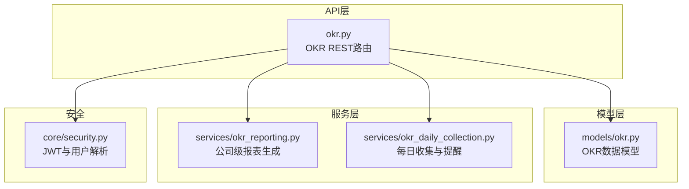
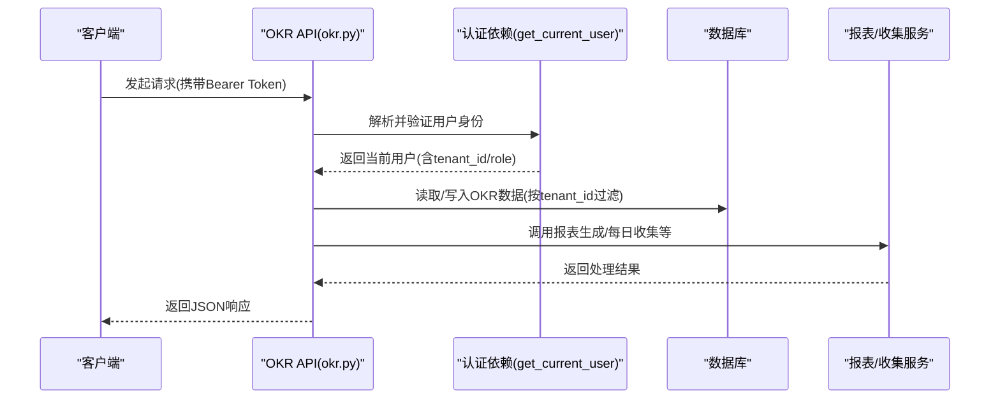
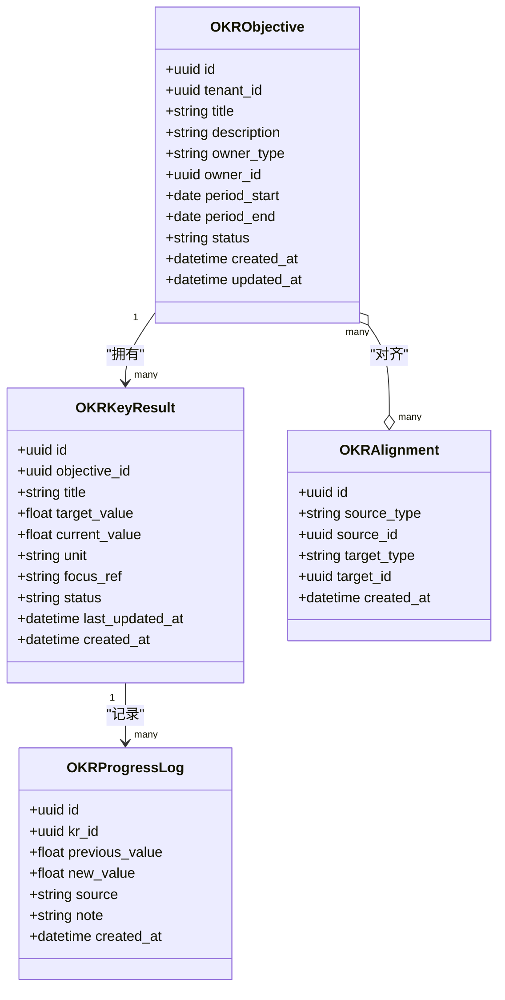

# OKR目标管理API

<cite>
**本文引用的文件**   
- [backend/app/api/okr.py](file://backend/app/api/okr.py)
- [backend/app/models/okr.py](file://backend/app/models/okr.py)
- [backend/app/services/okr_reporting.py](file://backend/app/services/okr_reporting.py)
- [backend/app/services/okr_daily_collection.py](file://backend/app/services/okr_daily_collection.py)
- [backend/app/core/security.py](file://backend/app/core/security.py)
- [backend/alembic/versions/021_add_okr_tables.py](file://backend/alembic/versions/021_add_okr_tables.py)
</cite>

## 目录
1. [简介](#简介)
2. [项目结构](#项目结构)
3. [核心组件](#核心组件)
4. [架构总览](#架构总览)
5. [详细组件分析](#详细组件分析)
6. [依赖关系分析](#依赖关系分析)
7. [性能考量](#性能考量)
8. [故障排查指南](#故障排查指南)
9. [结论](#结论)
10. [附录：RESTful API规范](#附录restful-api规范)

## 简介
本文件为Clawith平台的OKR目标管理系统提供完整的API文档，覆盖目标（Objective）与关键结果（Key Result, KR）的创建、更新、删除、查询，KR进度跟踪与评估打分，以及团队协作、权限控制、数据导出等企业级特性。所有接口遵循RESTful风格，使用JWT Bearer认证，按租户隔离数据。

## 项目结构
OKR功能由以下模块组成：
- API路由层：定义REST端点与请求校验
- 模型层：定义数据库表结构与约束
- 服务层：实现报表生成、日报收集、周期计算等复杂逻辑
- 安全与认证：统一鉴权与角色判断

图表来源
- [backend/app/api/okr.py:1-2020](file://backend/app/api/okr.py#L1-L2020)
- [backend/app/models/okr.py:1-384](file://backend/app/models/okr.py#L1-L384)
- [backend/app/services/okr_reporting.py:1-943](file://backend/app/services/okr_reporting.py#L1-L943)
- [backend/app/services/okr_daily_collection.py:1-235](file://backend/app/services/okr_daily_collection.py#L1-L235)
- [backend/app/core/security.py:1-227](file://backend/app/core/security.py#L1-L227)

章节来源
- [backend/app/api/okr.py:1-2020](file://backend/app/api/okr.py#L1-L2020)
- [backend/app/models/okr.py:1-384](file://backend/app/models/okr.py#L1-L384)

## 核心组件
- OKR设置（Settings）：开关、日报时间、周期频率、首次启用锁定等
- 目标（Objectives）：公司/用户/Agent级别的目标，包含周期与状态
- 关键结果（Key Results）：可量化的KR，支持单位、焦点引用、状态
- 对齐（Alignments）：O/KR之间的多对多对齐关系
- 进度日志（Progress Logs）：不可变的KR进度变更记录
- 工作报表（Work Reports）：历史日报/周报记录
- 成员日报（Member Daily Reports）：成员最终日报汇总
- 公司报表（Company Reports）：日/周/月公司级汇总报告

章节来源
- [backend/app/models/okr.py:35-384](file://backend/app/models/okr.py#L35-L384)

## 架构总览
OKR系统采用“API路由 + 领域模型 + 业务服务”的分层架构。认证通过统一的JWT依赖注入，所有端点按当前用户的tenant_id进行数据隔离。报表与收集流程通过服务层调用LLM或外部通道完成。

图表来源
- [backend/app/api/okr.py:1-2020](file://backend/app/api/okr.py#L1-L2020)
- [backend/app/core/security.py:153-173](file://backend/app/core/security.py#L153-L173)
- [backend/app/services/okr_reporting.py:1-943](file://backend/app/services/okr_reporting.py#L1-L943)
- [backend/app/services/okr_daily_collection.py:1-235](file://backend/app/services/okr_daily_collection.py#L1-L235)

## 详细组件分析

### 认证与权限
- 认证方式：HTTP Bearer Token（JWT），通过get_current_user依赖注入获取当前用户
- 角色控制：仅org_admin或platform_admin可修改OKR设置、触发收集、重建报表等敏感操作
- 数据隔离：所有查询均按user.tenant_id过滤，防止跨租户泄露

章节来源
- [backend/app/core/security.py:128-173](file://backend/app/core/security.py#L128-L173)
- [backend/app/api/okr.py:48-56](file://backend/app/api/okr.py#L48-L56)

### 设置（Settings）
- GET /api/okr/settings：获取当前租户的OKR配置
- PUT /api/okr/settings：更新配置（需管理员），首次启用后周期频率与长度锁定

章节来源
- [backend/app/api/okr.py:484-586](file://backend/app/api/okr.py#L484-L586)

### 周期（Periods）
- GET /api/okr/periods：根据租户周期策略计算历史与未来周期列表

章节来源
- [backend/app/api/okr.py:622-688](file://backend/app/api/okr.py#L622-L688)

### 目标（Objectives）
- GET /api/okr/objectives：列出当前周期内的目标（默认按当前周期；可传period_start/end）
- POST /api/okr/objectives：创建目标（需管理员）
- PATCH /api/okr/objectives/{id}：更新标题/描述/状态（需管理员）
- DELETE /api/okr/objectives/{id}：软删除（标记archived，需管理员）

章节来源
- [backend/app/api/okr.py:728-960](file://backend/app/api/okr.py#L728-L960)

### 关键结果（Key Results）
- GET /api/okr/objectives/{objective_id}/key-results：列出某目标的KR
- POST /api/okr/objectives/{objective_id}/key-results：新增KR（需管理员）
- PATCH /api/okr/key-results/{kr_id}：更新KR字段（current_value变更自动记录进度日志，需管理员）
- POST /api/okr/key-results/{kr_id}/progress：便捷更新进度值（支持显式status或自动计算，需管理员）
- DELETE /api/okr/key-results/{kr_id}：硬删除（级联删除进度日志，需管理员）

章节来源
- [backend/app/api/okr.py:965-1175](file://backend/app/api/okr.py#L965-L1175)

### 进度与评估
- 进度记录：每次current_value变化都会写入OKRProgressLog，保留完整曲线
- 状态计算：当未显式指定status时，按value/target_value比率自动判定on_track/at_risk/behind/completed

章节来源
- [backend/app/models/okr.py:160-191](file://backend/app/models/okr.py#L160-L191)
- [backend/app/api/okr.py:1085-1142](file://backend/app/api/okr.py#L1085-L1142)

### 协作与关系同步
- POST /api/okr/sync-relationships：手动同步OKR Agent的关系网络（连接活跃成员与公司可见Agent，幂等）

章节来源
- [backend/app/api/okr.py:591-617](file://backend/app/api/okr.py#L591-L617)

### 成员日报与公司报表
- GET /api/okr/member-daily-reports：按日期列出成员日报及缺失情况
- POST /api/okr/member-daily-reports：提交/更新成员日报（普通成员只能编辑自己的；管理员可代填）
- GET /api/okr/company-reports：列出公司级报表（日/周/月）
- POST /api/okr/company-reports/regenerate：重建指定周期的公司报表（需管理员）

章节来源
- [backend/app/api/okr.py:1196-1317](file://backend/app/api/okr.py#L1196-L1317)
- [backend/app/services/okr_reporting.py:248-331](file://backend/app/services/okr_reporting.py#L248-L331)

### P4 Onboarding与外呼
- GET /api/okr/members-without-okr：返回当前周期内缺少OKR的被追踪成员（含渠道警告、最近失败通知）
- POST /api/okr/trigger-member-outreach：触发OKR Agent联系未设置OKR的成员（异步执行，立即返回accepted）

章节来源
- [backend/app/api/okr.py:1357-1657](file://backend/app/api/okr.py#L1357-L1657)
- [backend/app/api/okr.py:1660-1988](file://backend/app/api/okr.py#L1660-L1988)

### 每日收集（Legacy）
- POST /api/okr/trigger-daily-collection：触发基于旧版关系表的每日收集（需管理员）

章节来源
- [backend/app/api/okr.py:1991-2020](file://backend/app/api/okr.py#L1991-L2020)
- [backend/app/services/okr_daily_collection.py:107-235](file://backend/app/services/okr_daily_collection.py#L107-L235)

### 数据模型与迁移
- 表结构：okr_objectives、okr_key_results、okr_alignments、okr_progress_logs、work_reports、member_daily_reports、company_reports、okr_settings
- 迁移脚本：初始化上述表结构及约束

章节来源
- [backend/app/models/okr.py:35-384](file://backend/app/models/okr.py#L35-L384)
- [backend/alembic/versions/021_add_okr_tables.py:20-281](file://backend/alembic/versions/021_add_okr_tables.py#L20-L281)

## 依赖关系分析
- API路由依赖认证依赖get_current_user，确保每个请求都具备有效的用户上下文
- 报表与收集服务依赖数据库会话与LLM能力，必要时回退到确定性模板
- 模型间存在强关联：KR属于Objective，进度日志属于KR，对齐关系在O/KR之间

图表来源
- [backend/app/models/okr.py:35-191](file://backend/app/models/okr.py#L35-L191)

章节来源
- [backend/app/models/okr.py:35-191](file://backend/app/models/okr.py#L35-L191)

## 性能考量
- 批量查询：列举目标时一次性加载所有KR并按目标分组，减少N+1查询
- 名称解析批量化：批量拉取User/Agent名称映射，避免逐条查询
- 报表聚合：使用分桶（bucket）与去重策略降低LLM输入规模
- 异步任务：外呼与收集通过后台任务执行，避免阻塞请求线程
- 索引优化：常用查询字段（tenant_id、report_date、period_start/end）建立索引

章节来源
- [backend/app/api/okr.py:754-829](file://backend/app/api/okr.py#L754-L829)
- [backend/app/services/okr_reporting.py:333-361](file://backend/app/services/okr_reporting.py#L333-L361)

## 故障排查指南
- 401未授权：检查Bearer Token是否有效且未过期
- 403禁止访问：确认用户角色是否为org_admin或platform_admin
- 404未找到：检查Objective/KR是否存在且属于当前租户
- 400参数错误：检查period_start/end格式、report_type取值、必填字段
- 外呼失败：查看members-without-okr返回的last_outreach_error与channel_warnings
- 报表为空：确认成员已提交日报，或调用regenerate重建报表

章节来源
- [backend/app/api/okr.py:1357-1657](file://backend/app/api/okr.py#L1357-L1657)
- [backend/app/api/okr.py:1278-1317](file://backend/app/api/okr.py#L1278-L1317)

## 结论
OKR系统以清晰的REST接口、严格的权限与租户隔离、完善的进度与报表能力，为企业级目标管理提供了可靠支撑。通过服务层抽象与异步任务机制，系统在易用性与可扩展性之间取得平衡。建议在生产环境开启定期同步关系、合理配置周期策略，并结合渠道告警提升覆盖率。

## 附录：RESTful API规范

### 通用说明
- 基础路径：/api/okr
- 认证：HTTP Bearer Token（JWT），通过Authorization头传递
- 租户隔离：所有数据按当前用户的tenant_id过滤
- 成功响应：HTTP 200/201，返回JSON体
- 错误响应：HTTP 4xx/5xx，包含detail消息

### 认证与安全
- 依赖：get_current_user（security.py）
- 角色：org_admin/platform_admin用于写操作与敏感操作

章节来源
- [backend/app/core/security.py:128-173](file://backend/app/core/security.py#L128-L173)

### 设置（Settings）
- GET /api/okr/settings
  - 描述：获取租户OKR配置
  - 响应：OKRSettingsOut（enabled、daily_report_enabled、daily_report_time、period_frequency等）
- PUT /api/okr/settings
  - 描述：更新配置（需管理员）
  - 请求体：OKRSettingsUpdate（可选字段）
  - 注意：首次启用后period_frequency与period_length_days锁定

章节来源
- [backend/app/api/okr.py:484-586](file://backend/app/api/okr.py#L484-L586)

### 周期（Periods）
- GET /api/okr/periods
  - 描述：返回从首次启用到下一个周期的列表
  - 响应：list[PeriodOut]（start、end、label、is_current）

章节来源
- [backend/app/api/okr.py:622-688](file://backend/app/api/okr.py#L622-L688)

### 目标（Objectives）
- GET /api/okr/objectives
  - 描述：列出当前周期内的目标（可传period_start、period_end）
  - 响应：list[ObjectiveOut]（含owner_name、key_results）
- POST /api/okr/objectives
  - 描述：创建目标（需管理员）
  - 请求体：ObjectiveCreate（title、description、owner_type、owner_id、period_start、period_end）
- PATCH /api/okr/objectives/{objective_id}
  - 描述：更新标题/描述/状态（需管理员）
  - 请求体：ObjectiveUpdate（title、description、status）
- DELETE /api/okr/objectives/{objective_id}
  - 描述：软删除（标记archived，需管理员）

章节来源
- [backend/app/api/okr.py:728-960](file://backend/app/api/okr.py#L728-L960)

### 关键结果（Key Results）
- GET /api/okr/objectives/{objective_id}/key-results
  - 描述：列出某目标的所有KR
  - 响应：list[KeyResultOut]
- POST /api/okr/objectives/{objective_id}/key-results
  - 描述：新增KR（需管理员）
  - 请求体：KeyResultCreate（title、target_value、unit、focus_ref）
- PATCH /api/okr/key-results/{kr_id}
  - 描述：更新KR字段（current_value变更自动记录进度日志，需管理员）
  - 请求体：KeyResultUpdate（title、current_value、target_value、unit、focus_ref、status）
- POST /api/okr/key-results/{kr_id}/progress
  - 描述：便捷更新进度值（支持显式status或自动计算，需管理员）
  - 请求体：ProgressUpdate（value、note、status）
- DELETE /api/okr/key-results/{kr_id}
  - 描述：硬删除（级联删除进度日志，需管理员）

章节来源
- [backend/app/api/okr.py:965-1175](file://backend/app/api/okr.py#L965-L1175)

### 成员日报与公司报表
- GET /api/okr/member-daily-reports?report_date=YYYY-MM-DD
  - 描述：按日期列出成员日报及缺失情况
  - 响应：list[MemberDailyReportOut]
- POST /api/okr/member-daily-reports
  - 描述：提交/更新成员日报（普通成员仅限自己；管理员可代填）
  - 请求体：MemberDailyReportUpsert（report_date、content、member_type、member_id、source）
- GET /api/okr/company-reports?report_type=daily|weekly|monthly&limit=50
  - 描述：列出公司级报表
  - 响应：list[CompanyReportOut]
- POST /api/okr/company-reports/regenerate
  - 描述：重建指定周期的公司报表（需管理员）
  - 请求体：CompanyReportRegenerate（report_type、period_start）

章节来源
- [backend/app/api/okr.py:1196-1317](file://backend/app/api/okr.py#L1196-L1317)

### 协作与外呼
- POST /api/okr/sync-relationships
  - 描述：手动同步OKR Agent关系网络（幂等，需管理员）
  - 响应：{status, okr_agent_id}
- GET /api/okr/members-without-okr
  - 描述：返回当前周期缺少OKR的被追踪成员（含渠道警告、最近失败通知）
  - 响应：对象（period_start、period_end、company_okr_exists、okr_agent_id、members_without_okr、tracked_user_ids、tracked_agent_ids、total、last_outreach_error、channel_warnings）
- POST /api/okr/trigger-member-outreach
  - 描述：触发OKR Agent联系未设置OKR的成员（异步执行，立即返回accepted）
  - 响应：{status, message, okr_agent_id, members_count}

章节来源
- [backend/app/api/okr.py:591-617](file://backend/app/api/okr.py#L591-L617)
- [backend/app/api/okr.py:1357-1657](file://backend/app/api/okr.py#L1357-L1657)
- [backend/app/api/okr.py:1660-1988](file://backend/app/api/okr.py#L1660-L1988)

### 每日收集（Legacy）
- POST /api/okr/trigger-daily-collection
  - 描述：触发基于旧版关系表的每日收集（需管理员）
  - 响应：{status, message, okr_agent_id, member_count}

章节来源
- [backend/app/api/okr.py:1991-2020](file://backend/app/api/okr.py#L1991-L2020)

### 数据模型参考
- OKRObjective：公司/用户/Agent级别目标，包含周期与状态
- OKRKeyResult：可量化的KR，支持单位、焦点引用、状态
- OKRAlignment：O/KR之间的多对多对齐关系
- OKRProgressLog：不可变的KR进度变更记录
- WorkReport：历史日报/周报记录
- MemberDailyReport：成员最终日报汇总
- CompanyReport：日/周/月公司级汇总报告
- OKRSettings：租户级OKR配置（单行）

章节来源
- [backend/app/models/okr.py:35-384](file://backend/app/models/okr.py#L35-L384)
- [backend/alembic/versions/021_add_okr_tables.py:20-281](file://backend/alembic/versions/021_add_okr_tables.py#L20-L281)