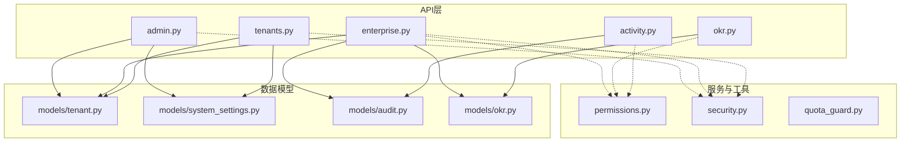
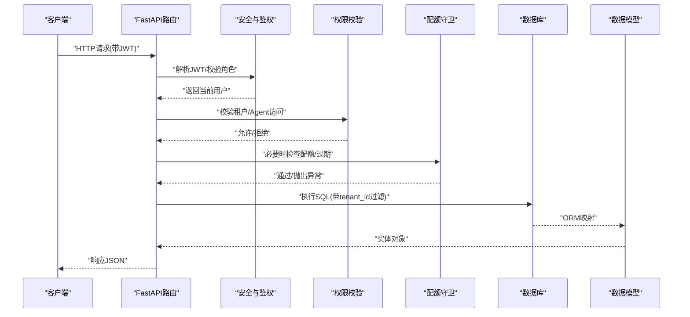
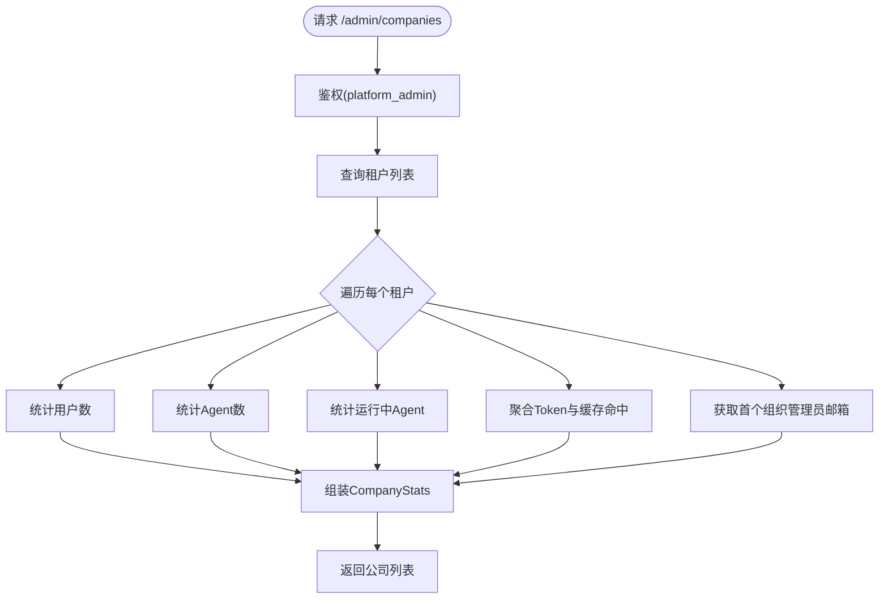
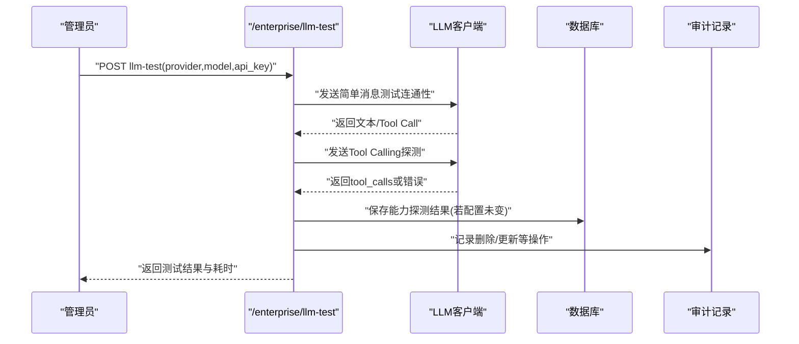
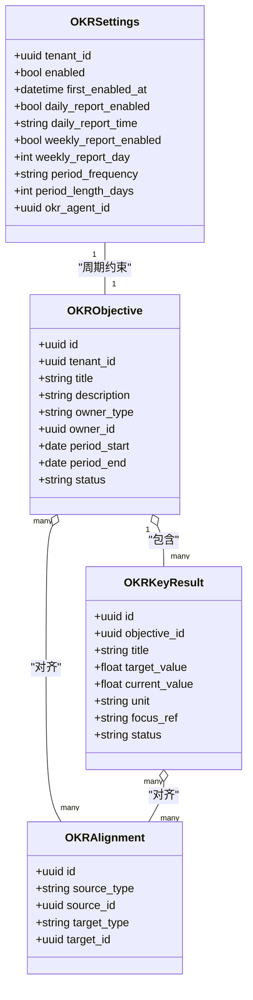
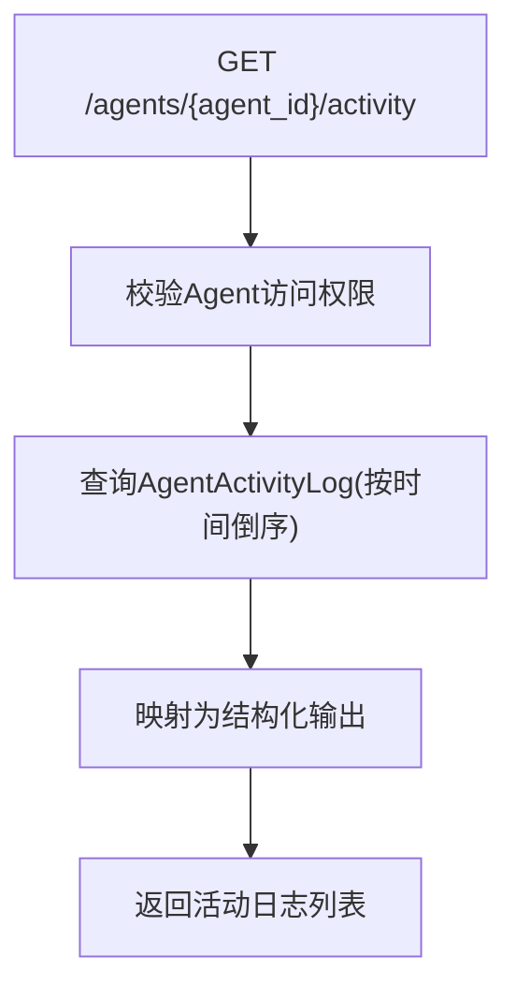
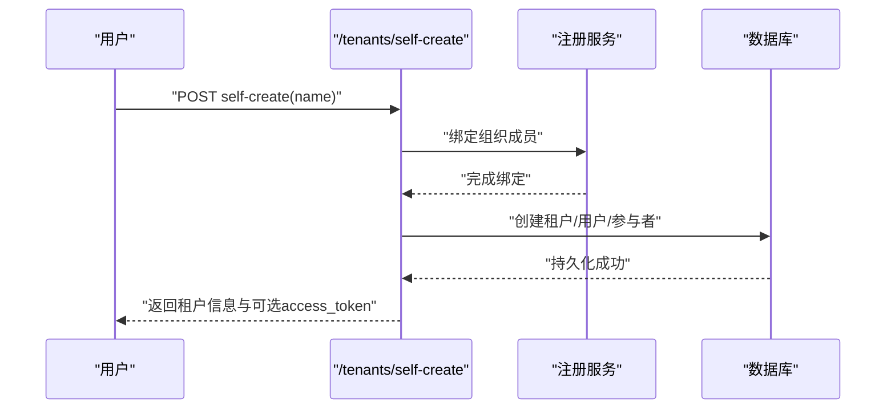
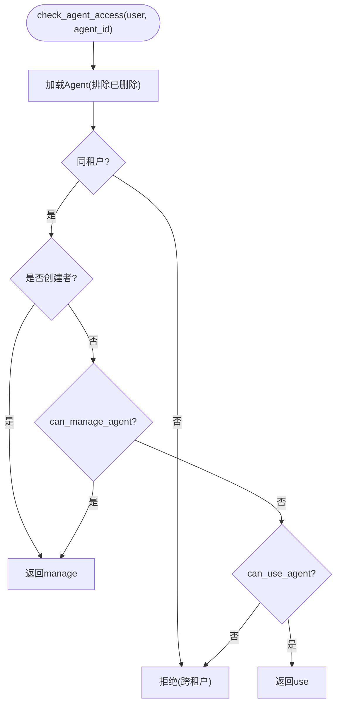
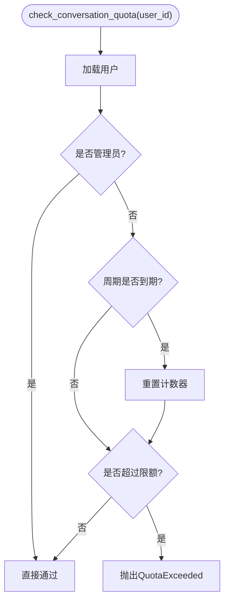
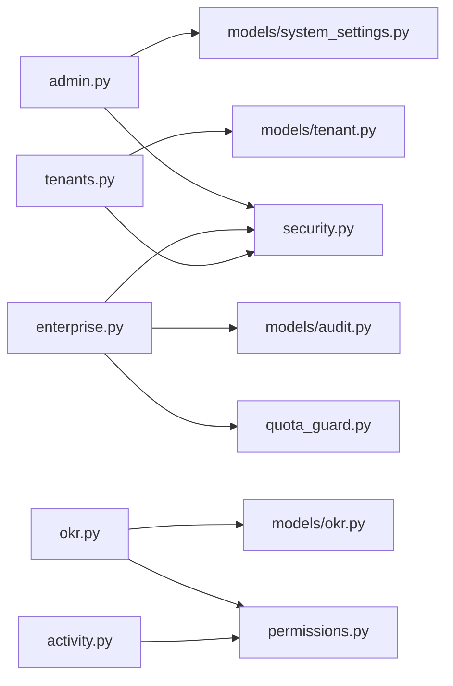

# 企业功能API

<cite>
**本文引用的文件**   
- [backend/app/api/admin.py](file://backend/app/api/admin.py)
- [backend/app/api/enterprise.py](file://backend/app/api/enterprise.py)
- [backend/app/api/okr.py](file://backend/app/api/okr.py)
- [backend/app/api/activity.py](file://backend/app/api/activity.py)
- [backend/app/api/tenants.py](file://backend/app/api/tenants.py)
- [backend/app/models/tenant.py](file://backend/app/models/tenant.py)
- [backend/app/models/system_settings.py](file://backend/app/models/system_settings.py)
- [backend/app/models/audit.py](file://backend/app/models/audit.py)
- [backend/app/models/okr.py](file://backend/app/models/okr.py)
- [backend/app/core/permissions.py](file://backend/app/core/permissions.py)
- [backend/app/services/quota_guard.py](file://backend/app/services/quota_guard.py)
- [backend/app/core/security.py](file://backend/app/core/security.py)
</cite>

## 目录
1. [简介](#简介)
2. [项目结构](#项目结构)
3. [核心组件](#核心组件)
4. [架构总览](#架构总览)
5. [详细组件分析](#详细组件分析)
6. [依赖关系分析](#依赖关系分析)
7. [性能考虑](#性能考虑)
8. [故障排查指南](#故障排查指南)
9. [结论](#结论)
10. [附录：API参考](#附录api参考)

## 简介
本文件为Clawith平台的企业级功能API文档，覆盖管理员接口、OKR目标管理、活动审计、系统设置、多租户与配额控制、工作流审批、合规检查、数据导出与企业部署配置监控等能力。文档面向技术与非技术读者，提供分层说明、可视化图示与可操作的排障建议。

## 项目结构
后端采用FastAPI模块化路由设计，企业级能力主要分布在以下模块：
- 管理员与平台指标：admin.py
- 企业级管理（LLM模型池、企业信息、审批、审计、租户配额）：enterprise.py
- OKR目标管理（目标、关键结果、周期、报告、成员日报）：okr.py
- 活动日志与会话历史：activity.py
- 多租户（公司）管理（注册、加入、Logo、Token用量、删除）：tenants.py
- 权限与RBAC：core/permissions.py
- 安全认证与加密：core/security.py
- 配额守卫（会话、Agent创建、LLM调用、心跳下限）：services/quota_guard.py
- 数据模型（租户、系统设置、审计、OKR）：models/*

图表来源 
- [backend/app/api/admin.py:1-626](file://backend/app/api/admin.py#L1-L626)
- [backend/app/api/enterprise.py:1-800](file://backend/app/api/enterprise.py#L1-L800)
- [backend/app/api/okr.py:1-800](file://backend/app/api/okr.py#L1-L800)
- [backend/app/api/activity.py:1-287](file://backend/app/api/activity.py#L1-L287)
- [backend/app/api/tenants.py:1-800](file://backend/app/api/tenants.py#L1-L800)
- [backend/app/models/tenant.py:1-73](file://backend/app/models/tenant.py#L1-L73)
- [backend/app/models/system_settings.py:1-21](file://backend/app/models/system_settings.py#L1-L21)
- [backend/app/models/audit.py:1-89](file://backend/app/models/audit.py#L1-L89)
- [backend/app/models/okr.py:1-384](file://backend/app/models/okr.py#L1-L384)
- [backend/app/core/permissions.py:1-554](file://backend/app/core/permissions.py#L1-L554)
- [backend/app/core/security.py:1-227](file://backend/app/core/security.py#L1-L227)

章节来源
- [backend/app/api/admin.py:1-626](file://backend/app/api/admin.py#L1-L626)
- [backend/app/api/enterprise.py:1-800](file://backend/app/api/enterprise.py#L1-L800)
- [backend/app/api/okr.py:1-800](file://backend/app/api/okr.py#L1-L800)
- [backend/app/api/activity.py:1-287](file://backend/app/api/activity.py#L1-L287)
- [backend/app/api/tenants.py:1-800](file://backend/app/api/tenants.py#L1-L800)

## 核心组件
- 管理员与平台指标
  - 公司列表与统计、创建公司并生成一次性管理员邀请码、启用/禁用公司（禁用时暂停运行中Agent）、平台时序指标（新增公司/用户/会话、DAU/WAU/MAU、缓存命中率）、Top榜单、增强指标（留存、渠道分布、工具类别、流失预警）、平台级系统设置读写。
- 企业级管理
  - LLM提供商清单与连通性测试（含原生Tool Calling探测与记录）、LLM模型CRUD与默认模型设置、企业信息集中管理与同步、审批请求查询与处理、审计日志查询、企业看板统计、租户配额默认值读取与更新（消息限制、Agent上限、TTL、LLM日调用、心跳下限、触发器限制、轮询/回调速率）。
- OKR目标管理
  - 设置开关与周期策略、周期计算与锁定、目标与关键结果CRUD、进度更新与状态自动计算、成员日报与公司级报告、关系网络同步（人与Agent）、定时任务触发器维护。
- 活动审计与会话历史
  - Agent活动日志、跨渠道对话历史（Web/飞书/Slack/Discord/Agent间），按会话聚合与分页。
- 多租户管理
  - 自助创建公司与加入（支持多租户切换）、域名解析到租户、Logo上传/删除、Token用量汇总、租户信息更新与删除（级联清理）。
- 权限与安全
  - RBAC角色校验、Agent访问控制（公司/私有/自定义）、组织成员可见性、JWT鉴权与密码/AES加密。
- 配额控制
  - 会话配额、Agent创建配额、LLM调用配额、心跳下限强制、过期Agent保护。

章节来源
- [backend/app/api/admin.py:1-626](file://backend/app/api/admin.py#L1-L626)
- [backend/app/api/enterprise.py:1-800](file://backend/app/api/enterprise.py#L1-L800)
- [backend/app/api/okr.py:1-800](file://backend/app/api/okr.py#L1-L800)
- [backend/app/api/activity.py:1-287](file://backend/app/api/activity.py#L1-L287)
- [backend/app/api/tenants.py:1-800](file://backend/app/api/tenants.py#L1-L800)
- [backend/app/core/permissions.py:1-554](file://backend/app/core/permissions.py#L1-L554)
- [backend/app/core/security.py:1-227](file://backend/app/core/security.py#L1-L227)
- [backend/app/services/quota_guard.py:1-266](file://backend/app/services/quota_guard.py#L1-L266)

## 架构总览
企业级API通过FastAPI路由暴露，统一由安全中间件进行身份与角色校验，业务逻辑调用DAO/Service层操作数据库模型，关键流程包括：
- 多租户隔离：所有查询均基于tenant_id过滤，确保跨租户数据不可见。
- 权限控制：RBAC + Agent访问模式（company/private/custom）+ 显式授权表。
- 配额守卫：在关键路径上拦截超限或过期行为。
- 审计与审批：敏感操作写入审计日志，高风险动作进入审批流。

图表来源 
- [backend/app/core/security.py:153-204](file://backend/app/core/security.py#L153-L204)
- [backend/app/core/permissions.py:481-518](file://backend/app/core/permissions.py#L481-L518)
- [backend/app/services/quota_guard.py:30-83](file://backend/app/services/quota_guard.py#L30-L83)
- [backend/app/api/admin.py:68-137](file://backend/app/api/admin.py#L68-L137)
- [backend/app/api/enterprise.py:364-431](file://backend/app/api/enterprise.py#L364-L431)
- [backend/app/api/tenants.py:460-486](file://backend/app/api/tenants.py#L460-L486)

## 详细组件分析

### 管理员与平台指标（admin.py）
- 公司管理
  - 列出公司及其统计（用户数、Agent数、运行中Agent、Token消耗、缓存命中、组织管理员邮箱）。
  - 创建公司并生成一次性管理员邀请码。
  - 启用/禁用公司；禁用时批量暂停运行中的Agent。
- 平台指标
  - 时序指标：新增公司/用户/会话、DAU/WAU/MAU、Token与缓存命中趋势。
  - Top榜单：Top 20公司与Agent的Token消耗。
  - 增强指标：近30天平均Token/会话、7日留存、渠道分布、工具类别Top10、流失预警（高消耗且长期不活跃）。
- 平台设置
  - 读取/更新系统级开关（是否允许自助创建公司、邀请码开关、SSO自定义域名重定向）。

图表来源 
- [backend/app/api/admin.py:68-137](file://backend/app/api/admin.py#L68-L137)

章节来源
- [backend/app/api/admin.py:68-137](file://backend/app/api/admin.py#L68-L137)
- [backend/app/api/admin.py:140-178](file://backend/app/api/admin.py#L140-L178)
- [backend/app/api/admin.py:181-209](file://backend/app/api/admin.py#L181-L209)
- [backend/app/api/admin.py:217-381](file://backend/app/api/admin.py#L217-L381)
- [backend/app/api/admin.py:384-433](file://backend/app/api/admin.py#L384-L433)
- [backend/app/api/admin.py:436-582](file://backend/app/api/admin.py#L436-L582)
- [backend/app/api/admin.py:587-626](file://backend/app/api/admin.py#L587-L626)

### 企业级管理（enterprise.py）
- LLM模型池
  - 提供商清单与连通性测试（含原生Tool Calling探测，记录能力与错误）。
  - 模型CRUD、默认模型设置（迁移跟随旧默认模型的Agent）。
- 企业信息
  - 集中存储与版本化，支持可见角色控制，变更触发向运行中Agent同步。
- 审批工作流
  - 按租户范围列出审批请求，支持批准/拒绝，关联Agent上下文恢复。
- 审计日志
  - 按租户/Agent维度查询审计记录。
- 企业看板
  - 统计Agent/用户/待审批数量。
- 租户配额
  - 读取/更新租户默认配额（消息限制、Agent上限/TTL、LLM日调用、心跳下限、触发器限制、轮询/回调速率）。

图表来源 
- [backend/app/api/enterprise.py:247-357](file://backend/app/api/enterprise.py#L247-L357)
- [backend/app/api/enterprise.py:395-431](file://backend/app/api/enterprise.py#L395-L431)
- [backend/app/api/enterprise.py:487-518](file://backend/app/api/enterprise.py#L487-L518)

章节来源
- [backend/app/api/enterprise.py:111-116](file://backend/app/api/enterprise.py#L111-L116)
- [backend/app/api/enterprise.py:247-357](file://backend/app/api/enterprise.py#L247-L357)
- [backend/app/api/enterprise.py:364-431](file://backend/app/api/enterprise.py#L364-L431)
- [backend/app/api/enterprise.py:433-484](file://backend/app/api/enterprise.py#L433-L484)
- [backend/app/api/enterprise.py:487-518](file://backend/app/api/enterprise.py#L487-L518)
- [backend/app/api/enterprise.py:582-605](file://backend/app/api/enterprise.py#L582-L605)
- [backend/app/api/enterprise.py:610-648](file://backend/app/api/enterprise.py#L610-L648)
- [backend/app/api/enterprise.py:651-666](file://backend/app/api/enterprise.py#L651-L666)
- [backend/app/api/enterprise.py:670-688](file://backend/app/api/enterprise.py#L670-L688)
- [backend/app/api/enterprise.py:693-734](file://backend/app/api/enterprise.py#L693-L734)
- [backend/app/api/enterprise.py:754-800](file://backend/app/api/enterprise.py#L754-L800)

### OKR目标管理（okr.py）
- 设置与周期
  - 开关、每日报告时间、跳过非工作日、周期频率（季度/月度/自定义）与长度，首次启用后锁定周期定义。
- 目标与关键结果
  - 目标（公司/用户/Agent级别）与关键结果CRUD，进度更新与状态自动计算，对齐关系。
- 报告与收集
  - 成员日报与公司级报告（日/周/月），定时触发器维护与同步。
- 关系同步
  - 将OKR Agent与活跃成员及公司可见Agent建立关系，幂等重建。

图表来源 
- [backend/app/models/okr.py:35-384](file://backend/app/models/okr.py#L35-L384)

章节来源
- [backend/app/api/okr.py:484-586](file://backend/app/api/okr.py#L484-L586)
- [backend/app/api/okr.py:591-617](file://backend/app/api/okr.py#L591-L617)
- [backend/app/api/okr.py:622-687](file://backend/app/api/okr.py#L622-L687)
- [backend/app/api/okr.py:728-800](file://backend/app/api/okr.py#L728-L800)
- [backend/app/models/okr.py:35-384](file://backend/app/models/okr.py#L35-L384)

### 活动审计与会话历史（activity.py）
- Agent活动日志：按Agent分页查询最近操作摘要。
- 聊天历史：聚合Web/飞书/Slack/Discord/Agent间会话，展示最后消息与计数，支持按会话拉取消息。

图表来源 
- [backend/app/api/activity.py:17-45](file://backend/app/api/activity.py#L17-L45)

章节来源
- [backend/app/api/activity.py:17-45](file://backend/app/api/activity.py#L17-L45)
- [backend/app/api/activity.py:50-220](file://backend/app/api/activity.py#L50-L220)
- [backend/app/api/activity.py:223-287](file://backend/app/api/activity.py#L223-L287)

### 多租户管理（tenants.py）
- 自助创建公司与加入：支持多租户切换、邀请码校验与使用次数限制、首管理员判定。
- 域名解析：根据SSO域名或子域名解析到租户。
- Logo管理：上传/删除Logo，限制格式与大小，回退默认头像。
- Token用量：按今日/本月/累计聚合Token与缓存命中。
- 租户信息更新与删除：严格权限控制，删除时按外键顺序级联清理。

图表来源 
- [backend/app/api/tenants.py:152-237](file://backend/app/api/tenants.py#L152-L237)

章节来源
- [backend/app/api/tenants.py:152-237](file://backend/app/api/tenants.py#L152-L237)
- [backend/app/api/tenants.py:253-373](file://backend/app/api/tenants.py#L253-L373)
- [backend/app/api/tenants.py:378-387](file://backend/app/api/tenants.py#L378-L387)
- [backend/app/api/tenants.py:392-456](file://backend/app/api/tenants.py#L392-L456)
- [backend/app/api/tenants.py:460-486](file://backend/app/api/tenants.py#L460-L486)
- [backend/app/api/tenants.py:488-525](file://backend/app/api/tenants.py#L488-L525)
- [backend/app/api/tenants.py:528-578](file://backend/app/api/tenants.py#L528-L578)
- [backend/app/api/tenants.py:581-653](file://backend/app/api/tenants.py#L581-L653)
- [backend/app/api/tenants.py:656-682](file://backend/app/api/tenants.py#L656-L682)
- [backend/app/api/tenants.py:687-800](file://backend/app/api/tenants.py#L687-L800)

### 权限与RBAC（permissions.py）
- 静态与动态Agent使用/管理权限判断（公司/私有/自定义）。
- 组织成员可见性与可用性评估。
- 构建可见Agent查询、计算关系有效性（Agent-Agent、Agent-Human）。
- 统一的Agent访问检查入口（含租户隔离与角色校验）。

图表来源 
- [backend/app/core/permissions.py:481-518](file://backend/app/core/permissions.py#L481-L518)

章节来源
- [backend/app/core/permissions.py:44-92](file://backend/app/core/permissions.py#L44-L92)
- [backend/app/core/permissions.py:95-129](file://backend/app/core/permissions.py#L95-L129)
- [backend/app/core/permissions.py:149-210](file://backend/app/core/permissions.py#L149-L210)
- [backend/app/core/permissions.py:213-250](file://backend/app/core/permissions.py#L213-L250)
- [backend/app/core/permissions.py:262-288](file://backend/app/core/permissions.py#L262-L288)
- [backend/app/core/permissions.py:352-429](file://backend/app/core/permissions.py#L352-L429)
- [backend/app/core/permissions.py:481-518](file://backend/app/core/permissions.py#L481-L518)

### 安全与认证（security.py）
- JWT签发与解码、密码哈希/验证、AES-256-CBC加解密。
- 当前用户与管理员依赖注入、角色层级与require_role工厂。

章节来源
- [backend/app/core/security.py:32-51](file://backend/app/core/security.py#L32-L51)
- [backend/app/core/security.py:54-123](file://backend/app/core/security.py#L54-L123)
- [backend/app/core/security.py:128-150](file://backend/app/core/security.py#L128-L150)
- [backend/app/core/security.py:153-204](file://backend/app/core/security.py#L153-L204)
- [backend/app/core/security.py:208-227](file://backend/app/core/security.py#L208-L227)

### 配额控制（quota_guard.py）
- 会话配额：按周期重置与计数，管理员豁免。
- Agent过期：到期自动标记停止并禁止交互。
- LLM调用配额：按日重置与计数。
- Agent创建配额：按用户计数限制。
- 心跳下限：强制调整低于租户阈值的Agent心跳间隔。

图表来源 
- [backend/app/services/quota_guard.py:30-83](file://backend/app/services/quota_guard.py#L30-L83)

章节来源
- [backend/app/services/quota_guard.py:30-83](file://backend/app/services/quota_guard.py#L30-L83)
- [backend/app/services/quota_guard.py:87-116](file://backend/app/services/quota_guard.py#L87-L116)
- [backend/app/services/quota_guard.py:121-174](file://backend/app/services/quota_guard.py#L121-L174)
- [backend/app/services/quota_guard.py:178-207](file://backend/app/services/quota_guard.py#L178-L207)
- [backend/app/services/quota_guard.py:211-254](file://backend/app/services/quota_guard.py#L211-L254)

## 依赖关系分析
- 路由层依赖安全与权限：所有企业级接口均通过get_current_user/get_current_admin/require_role进行鉴权。
- 数据模型边界清晰：Tenant/SystemSetting/Audit/OKR等模型被对应API直接操作。
- 配额守卫作为横切关注点：在会话、LLM调用、Agent创建等关键路径前置检查。
- 无循环依赖：API→Service/Model，权限与安全独立复用。

图表来源 
- [backend/app/api/admin.py:1-626](file://backend/app/api/admin.py#L1-L626)
- [backend/app/api/enterprise.py:1-800](file://backend/app/api/enterprise.py#L1-L800)
- [backend/app/api/okr.py:1-800](file://backend/app/api/okr.py#L1-L800)
- [backend/app/api/activity.py:1-287](file://backend/app/api/activity.py#L1-L287)
- [backend/app/api/tenants.py:1-800](file://backend/app/api/tenants.py#L1-L800)
- [backend/app/core/security.py:1-227](file://backend/app/core/security.py#L1-L227)
- [backend/app/core/permissions.py:1-554](file://backend/app/core/permissions.py#L1-L554)
- [backend/app/services/quota_guard.py:1-266](file://backend/app/services/quota_guard.py#L1-L266)
- [backend/app/models/tenant.py:1-73](file://backend/app/models/tenant.py#L1-L73)
- [backend/app/models/system_settings.py:1-21](file://backend/app/models/system_settings.py#L1-L21)
- [backend/app/models/audit.py:1-89](file://backend/app/models/audit.py#L1-L89)
- [backend/app/models/okr.py:1-384](file://backend/app/models/okr.py#L1-L384)

章节来源
- [backend/app/api/admin.py:1-626](file://backend/app/api/admin.py#L1-L626)
- [backend/app/api/enterprise.py:1-800](file://backend/app/api/enterprise.py#L1-L800)
- [backend/app/api/okr.py:1-800](file://backend/app/api/okr.py#L1-L800)
- [backend/app/api/activity.py:1-287](file://backend/app/api/activity.py#L1-L287)
- [backend/app/api/tenants.py:1-800](file://backend/app/api/tenants.py#L1-L800)

## 性能考虑
- 指标聚合使用窗口函数与分组聚合，避免N+1查询（如WAU/MAU、渠道分布、Top榜单）。
- 大表查询增加索引（created_at、tenant_id、agent_id等），减少全表扫描。
- 异步数据库会话与批量加载（如审批列表批量加载Agent名称）。
- 心跳下限批量调整，避免频繁小事务。
- LLM测试避免长事务持有I/O，使用轻量连接与快速失败。

[本节为通用指导，无需引用具体文件]

## 故障排查指南
- 鉴权失败（401/403）
  - 检查JWT是否有效、用户是否激活、角色是否符合要求。
  - 确认租户隔离是否正确（跨租户访问将被拒绝）。
- 配额超限（QuotaExceeded）
  - 查看会话配额周期与计数、Agent创建上限、LLM日调用上限。
  - 管理员豁免规则生效情况。
- Agent过期
  - 检查expires_at与is_expired标志，过期后将停止心跳并拒绝交互。
- 审批卡住
  - 确认审批状态与关联Agent上下文，必要时重新发起或恢复。
- 审计日志缺失
  - 确认敏感操作是否记录，检查租户/Agent过滤条件。

章节来源
- [backend/app/core/security.py:153-204](file://backend/app/core/security.py#L153-L204)
- [backend/app/services/quota_guard.py:30-83](file://backend/app/services/quota_guard.py#L30-L83)
- [backend/app/services/quota_guard.py:87-116](file://backend/app/services/quota_guard.py#L87-L116)
- [backend/app/api/enterprise.py:610-648](file://backend/app/api/enterprise.py#L610-L648)
- [backend/app/api/enterprise.py:670-688](file://backend/app/api/enterprise.py#L670-L688)

## 结论
Clawith企业级API以多租户为核心，结合严格的RBAC与配额控制，提供了完善的管理员能力、OKR目标管理、审计与审批、系统设置与平台指标等关键特性。通过清晰的权限边界与数据隔离，满足企业级安全与合规需求，并为部署与运维提供必要的监控与配置接口。

[本节为总结，无需引用具体文件]

## 附录：API参考
- 管理员与平台指标
  - GET /admin/companies：列出公司及其统计
  - POST /admin/companies：创建公司并生成管理员邀请码
  - PUT /admin/companies/{company_id}/toggle：启用/禁用公司
  - GET /admin/metrics/timeseries：平台时序指标
  - GET /admin/metrics/leaderboards：Top榜单
  - GET /admin/metrics/enhanced：增强指标
  - GET /admin/platform-settings：平台设置
  - PUT /admin/platform-settings：更新平台设置
- 企业级管理
  - GET /enterprise/llm-providers：LLM提供商清单
  - POST /enterprise/llm-test：连通性与Tool Calling测试
  - GET /enterprise/llm-models：模型列表
  - POST /enterprise/llm-models：新增模型
  - PATCH /enterprise/llm-models/{model_id}/set-default：设置默认模型
  - DELETE /enterprise/llm-models/{model_id}：删除模型
  - PUT /enterprise/llm-models/{model_id}：更新模型
  - GET /enterprise/info：企业信息
  - PUT /enterprise/info/{info_type}：更新企业信息
  - GET /enterprise/approvals：审批列表
  - POST /enterprise/approvals/{approval_id}/resolve：处理审批
  - GET /enterprise/audit-logs：审计日志
  - GET /enterprise/stats：企业看板
  - GET /enterprise/tenant-quotas：租户配额
  - PATCH /enterprise/tenant-quotas：更新租户配额
- OKR目标管理
  - GET /api/okr/settings：OKR设置
  - PUT /api/okr/settings：更新OKR设置
  - POST /api/okr/sync-relationships：同步关系
  - GET /api/okr/periods：周期列表
  - GET /api/okr/objectives：目标列表
  - POST /api/okr/objectives：创建目标
  - PATCH /api/okr/objectives/{id}：更新目标
  - GET /api/okr/objectives/{id}/key-results：关键结果列表
  - POST /api/okr/objectives/{id}/key-results：创建关键结果
  - PATCH /api/okr/key-results/{id}：更新关键结果
  - POST /api/okr/key-results/{id}/progress：进度更新
  - GET /api/okr/reports：公司报告
  - GET /api/okr/members-without-okr：成员未提交OKR
  - POST /api/okr/trigger-member-outreach：触发成员外呼
- 活动审计与会话历史
  - GET /agents/{agent_id}/activity：活动日志
  - GET /agents/{agent_id}/chat-history/conversations：对话列表
  - GET /agents/{agent_id}/chat-history/{conv_id}：对话消息
- 多租户管理
  - POST /tenants/self-create：自助创建公司
  - POST /tenants/join：邀请码加入
  - GET /tenants/registration-config：注册配置
  - GET /tenants/resolve-by-domain：域名解析
  - GET /tenants/：列出租户（平台管理员）
  - GET /tenants/me：当前租户
  - GET /tenants/me/token-usage：Token用量
  - GET /tenants/{tenant_id}：租户详情
  - PUT /tenants/{tenant_id}：更新租户
  - GET /tenants/{tenant_id}/logo：获取Logo
  - POST /tenants/{tenant_id}/logo：上传Logo
  - DELETE /tenants/{tenant_id}/logo：删除Logo
  - PUT /tenants/{tenant_id}/assign-user/{user_id}：分配用户角色
  - DELETE /tenants/{tenant_id}：删除租户（级联清理）

章节来源
- [backend/app/api/admin.py:68-626](file://backend/app/api/admin.py#L68-L626)
- [backend/app/api/enterprise.py:111-800](file://backend/app/api/enterprise.py#L111-L800)
- [backend/app/api/okr.py:484-800](file://backend/app/api/okr.py#L484-L800)
- [backend/app/api/activity.py:17-287](file://backend/app/api/activity.py#L17-L287)
- [backend/app/api/tenants.py:152-800](file://backend/app/api/tenants.py#L152-L800)