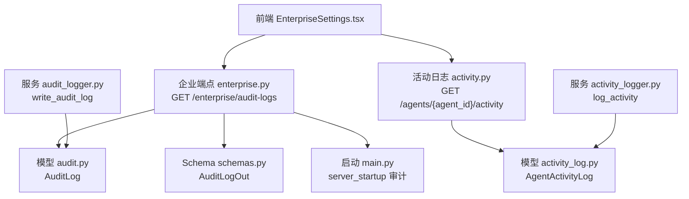
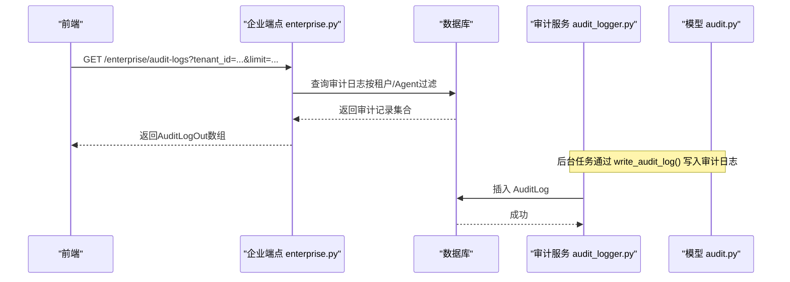
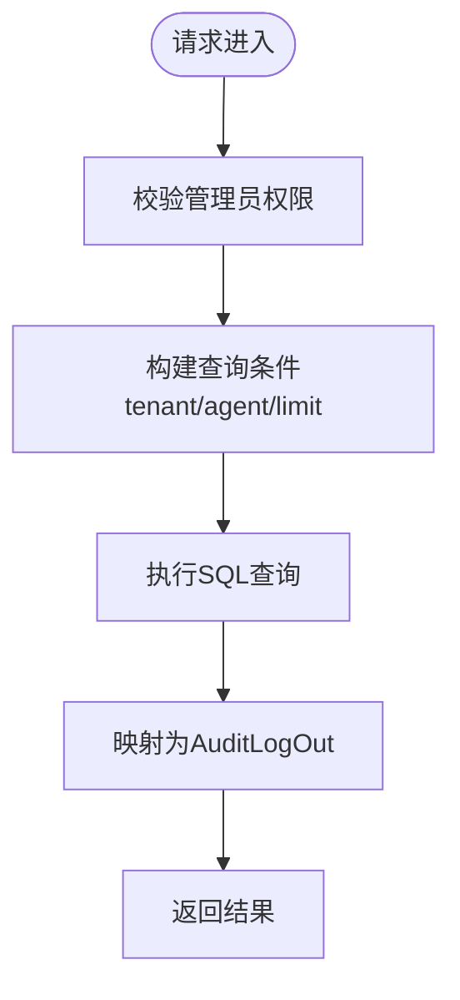
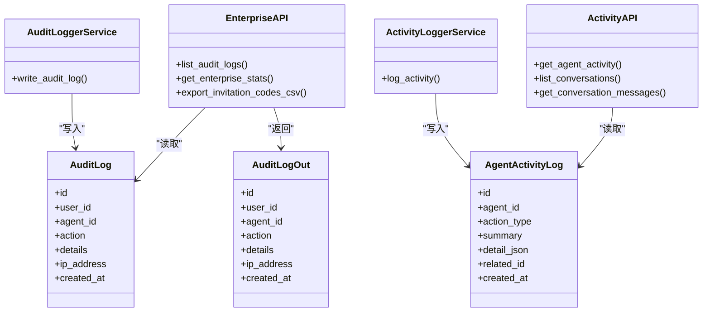

# 活动审计API

<cite>
**本文引用的文件**   
- [backend/app/api/activity.py](file://backend/app/api/activity.py)
- [backend/app/api/enterprise.py](file://backend/app/api/enterprise.py)
- [backend/app/models/activity_log.py](file://backend/app/models/activity_log.py)
- [backend/app/models/audit.py](file://backend/app/models/audit.py)
- [backend/app/services/activity_logger.py](file://backend/app/services/activity_logger.py)
- [backend/app/services/audit_logger.py](file://backend/app/services/audit_logger.py)
- [backend/app/schemas/schemas.py](file://backend/app/schemas/schemas.py)
- [backend/app/main.py](file://backend/app/main.py)
- [frontend/src/pages/EnterpriseSettings.tsx](file://frontend/src/pages/EnterpriseSettings.tsx)
</cite>

## 目录
1. [简介](#简介)
2. [项目结构](#项目结构)
3. [核心组件](#核心组件)
4. [架构总览](#架构总览)
5. [详细组件分析](#详细组件分析)
6. [依赖关系分析](#依赖关系分析)
7. [性能考虑](#性能考虑)
8. [故障排查指南](#故障排查指南)
9. [结论](#结论)
10. [附录：API规范与集成示例](#附录api规范与集成示例)

## 简介
本文件为Clawith平台“活动审计系统”的API文档，聚焦以下能力：
- 用户行为追踪与操作日志记录（认证、身份、租户、角色、组织同步、Agent生命周期等）
- 合规审计数据导出与报表生成（企业级统计、邀请码CSV导出、OKR报告相关接口）
- 时间范围查询与分页（按租户/Agent维度过滤、限制条数）
- 告警与异常记录（心跳、调度、监督等后台任务错误）
- 统一聊天消息审计（Web/飞书/Slack/Discord/A2A会话消息）

该文档同时提供架构图、调用时序图、数据模型说明以及前端集成示例路径，便于快速对接。

## 项目结构
后端采用FastAPI路由+SQLAlchemy ORM分层设计：
- API层：enterprise.py、activity.py 暴露REST接口
- 模型层：audit.py、activity_log.py 定义审计与活动日志表结构
- 服务层：audit_logger.py、activity_logger.py 封装写入逻辑
- Schema层：schemas.py 定义响应体结构（如AuditLogOut）
- 启动钩子：main.py 在服务启动时写入审计日志
- 前端：EnterpriseSettings.tsx 展示审计日志并调用企业端点

图表来源
- [backend/app/api/enterprise.py:670-688](file://backend/app/api/enterprise.py#L670-L688)
- [backend/app/api/activity.py:17-45](file://backend/app/api/activity.py#L17-L45)
- [backend/app/models/audit.py:13-25](file://backend/app/models/audit.py#L13-L25)
- [backend/app/models/activity_log.py:13-34](file://backend/app/models/activity_log.py#L13-L34)
- [backend/app/schemas/schemas.py:538-560](file://backend/app/schemas/schemas.py#L538-L560)
- [backend/app/main.py:293-294](file://backend/app/main.py#L293-L294)
- [backend/app/services/audit_logger.py:68-86](file://backend/app/services/audit_logger.py#L68-L86)
- [backend/app/services/activity_logger.py:12-32](file://backend/app/services/activity_logger.py#L12-L32)

章节来源
- [backend/app/api/enterprise.py:1-800](file://backend/app/api/enterprise.py#L1-L800)
- [backend/app/api/activity.py:1-287](file://backend/app/api/activity.py#L1-L287)
- [backend/app/models/audit.py:1-89](file://backend/app/models/audit.py#L1-L89)
- [backend/app/models/activity_log.py:1-57](file://backend/app/models/activity_log.py#L1-L57)
- [backend/app/services/audit_logger.py:1-132](file://backend/app/services/audit_logger.py#L1-L132)
- [backend/app/services/activity_logger.py:1-32](file://backend/app/services/activity_logger.py#L1-L32)
- [backend/app/schemas/schemas.py:538-560](file://backend/app/schemas/schemas.py#L538-L560)
- [backend/app/main.py:293-294](file://backend/app/main.py#L293-L294)
- [frontend/src/pages/EnterpriseSettings.tsx:427-454](file://frontend/src/pages/EnterpriseSettings.tsx#L427-L454)

## 核心组件
- 审计日志模型（AuditLog）：记录所有关键操作的审计轨迹，包含用户、Agent、动作、详情、IP、时间戳等字段。
- 活动日志模型（AgentActivityLog）：记录数字员工的行为历史，支持动作类型枚举、摘要、详情JSON、关联ID、时间戳。
- 审计写入服务（audit_logger）：提供通用写审计接口，支持身份、用户、租户、角色、组织同步、Agent生命周期等动作。
- 活动写入服务（activity_logger）：轻量异步写入Agent活动日志，失败不抛错，仅记录日志。
- 企业端点（enterprise.py）：提供审计日志列表、审批请求、企业统计、邀请码CSV导出等管理接口。
- 活动端点（activity.py）：提供Agent活动历史、对话历史（Web/飞书/Slack/Discord/A2A）查询。
- Schema（schemas.py）：定义AuditLogOut等响应结构，确保前后端契约一致。

章节来源
- [backend/app/models/audit.py:13-25](file://backend/app/models/audit.py#L13-L25)
- [backend/app/models/activity_log.py:13-34](file://backend/app/models/activity_log.py#L13-L34)
- [backend/app/services/audit_logger.py:16-97](file://backend/app/services/audit_logger.py#L16-L97)
- [backend/app/services/activity_logger.py:12-32](file://backend/app/services/activity_logger.py#L12-L32)
- [backend/app/api/enterprise.py:670-688](file://backend/app/api/enterprise.py#L670-L688)
- [backend/app/api/activity.py:17-45](file://backend/app/api/activity.py#L17-L45)
- [backend/app/schemas/schemas.py:538-560](file://backend/app/schemas/schemas.py#L538-L560)

## 架构总览
下图展示了从前端到后端、再到数据库的完整调用链路，包括审计日志与活动日志的写入与读取。

图表来源
- [backend/app/api/enterprise.py:670-688](file://backend/app/api/enterprise.py#L670-L688)
- [backend/app/services/audit_logger.py:68-86](file://backend/app/services/audit_logger.py#L68-L86)
- [backend/app/models/audit.py:13-25](file://backend/app/models/audit.py#L13-L25)

## 详细组件分析

### 企业审计日志接口（GET /enterprise/audit-logs）
- 功能：按租户或Agent维度列出审计日志，限管理员访问；支持limit参数控制返回数量。
- 权限：需要管理员身份（get_current_admin）。
- 过滤：可指定tenant_id或agent_id；未指定时默认使用当前用户的租户。
- 返回：AuditLogOut数组，包含id、user_id、agent_id、action、details、ip_address、created_at等。

图表来源
- [backend/app/api/enterprise.py:670-688](file://backend/app/api/enterprise.py#L670-L688)
- [backend/app/schemas/schemas.py:538-560](file://backend/app/schemas/schemas.py#L538-L560)

章节来源
- [backend/app/api/enterprise.py:670-688](file://backend/app/api/enterprise.py#L670-L688)
- [backend/app/schemas/schemas.py:538-560](file://backend/app/schemas/schemas.py#L538-L560)

### Agent活动历史接口（GET /agents/{agent_id}/activity）
- 功能：获取某Agent最近的活动日志，支持limit参数（最大200）。
- 权限：需具备该Agent访问权限（check_agent_access）。
- 返回：活动记录数组，包含id、action_type、summary、detail、related_id、created_at。

章节来源
- [backend/app/api/activity.py:17-45](file://backend/app/api/activity.py#L17-L45)
- [backend/app/models/activity_log.py:13-34](file://backend/app/models/activity_log.py#L13-L34)

### 对话历史接口（GET /agents/{agent_id}/chat-history/conversations 与 GET /agents/{agent_id}/chat-history/{conv_id}）
- 功能：列出某Agent的所有对话伙伴（Web用户、飞书、Slack、Discord、Agent间），并支持按conversation_id拉取消息。
- 权限：需具备该Agent访问权限。
- 返回：对话列表或消息列表，包含角色、内容、时间戳、发送者名称等。

章节来源
- [backend/app/api/activity.py:50-220](file://backend/app/api/activity.py#L50-L220)
- [backend/app/api/activity.py:223-287](file://backend/app/api/activity.py#L223-L287)
- [backend/app/models/audit.py:46-72](file://backend/app/models/audit.py#L46-L72)

### 审计写入服务（write_audit_log）
- 功能：后台任务写入审计日志，使用原始SQL避免ORM外键解析问题。
- 支持动作：登录/失败、SSO登录/失败、身份绑定/解绑、用户增删改、租户变更、角色分配/撤销、组织同步、Agent生命周期等。
- 参数：action、details、agent_id、user_id。

章节来源
- [backend/app/services/audit_logger.py:68-97](file://backend/app/services/audit_logger.py#L68-L97)
- [backend/app/services/audit_logger.py:16-58](file://backend/app/services/audit_logger.py#L16-L58)

### 活动写入服务（log_activity）
- 功能：记录Agent活动日志，失败不抛错，仅记录日志。
- 参数：agent_id、action_type、summary、detail、related_id。

章节来源
- [backend/app/services/activity_logger.py:12-32](file://backend/app/services/activity_logger.py#L12-L32)

### 启动审计（server_startup）
- 功能：服务启动时写入一条审计日志，包含进程ID等信息。

章节来源
- [backend/app/main.py:293-294](file://backend/app/main.py#L293-L294)

### 企业统计与导出（/enterprise/stats 与 /enterprise/invitation-codes/export）
- 企业统计：返回Agent总数、运行中Agent数、活跃用户数、待审批数等。
- 邀请码CSV导出：以流式响应返回CSV文件，包含代码、最大使用次数、已用次数、是否激活、创建时间。

章节来源
- [backend/app/api/enterprise.py:693-734](file://backend/app/api/enterprise.py#L693-L734)
- [backend/app/api/enterprise.py:2107-2141](file://backend/app/api/enterprise.py#L2107-L2141)

## 依赖关系分析
- API层依赖模型层进行数据读写，依赖Schema层进行响应体校验。
- 服务层封装审计与活动写入逻辑，避免在API层重复实现。
- 前端通过EnterpriseSettings.tsx调用企业端点，展示审计日志并按动作类型筛选。

图表来源
- [backend/app/api/enterprise.py:670-688](file://backend/app/api/enterprise.py#L670-L688)
- [backend/app/api/activity.py:17-45](file://backend/app/api/activity.py#L17-L45)
- [backend/app/models/audit.py:13-25](file://backend/app/models/audit.py#L13-L25)
- [backend/app/models/activity_log.py:13-34](file://backend/app/models/activity_log.py#L13-L34)
- [backend/app/services/audit_logger.py:68-86](file://backend/app/services/audit_logger.py#L68-L86)
- [backend/app/services/activity_logger.py:12-32](file://backend/app/services/activity_logger.py#L12-L32)
- [backend/app/schemas/schemas.py:538-560](file://backend/app/schemas/schemas.py#L538-L560)

章节来源
- [backend/app/api/enterprise.py:670-688](file://backend/app/api/enterprise.py#L670-L688)
- [backend/app/api/activity.py:17-45](file://backend/app/api/activity.py#L17-L45)
- [backend/app/models/audit.py:13-25](file://backend/app/models/audit.py#L13-L25)
- [backend/app/models/activity_log.py:13-34](file://backend/app/models/activity_log.py#L13-L34)
- [backend/app/services/audit_logger.py:68-86](file://backend/app/services/audit_logger.py#L68-L86)
- [backend/app/services/activity_logger.py:12-32](file://backend/app/services/activity_logger.py#L12-L32)
- [backend/app/schemas/schemas.py:538-560](file://backend/app/schemas/schemas.py#L538-L560)

## 性能考虑
- 审计日志写入使用原始SQL，避免ORM外键解析开销，适合高并发后台任务。
- 活动日志写入采用“fire-and-forget”模式，失败不阻塞主流程，仅记录日志。
- 查询接口支持limit参数，防止一次性返回过多数据；建议前端分页或增量加载。
- 对话历史查询按conversation_id分组聚合，减少多次往返；对大会话建议限制limit。

## 故障排查指南
- 审计日志缺失：检查后台任务是否正确调用write_audit_log；确认数据库连接与权限。
- 活动日志缺失：检查log_activity是否被调用；查看服务日志中的错误信息。
- 权限错误：确认调用方具备相应权限（管理员或Agent访问权限）。
- 前端显示异常：检查EnterpriseSettings.tsx中对动作类型的过滤逻辑是否符合预期。

章节来源
- [backend/app/services/audit_logger.py:68-86](file://backend/app/services/audit_logger.py#L68-L86)
- [backend/app/services/activity_logger.py:12-32](file://backend/app/services/activity_logger.py#L12-L32)
- [frontend/src/pages/EnterpriseSettings.tsx:427-454](file://frontend/src/pages/EnterpriseSettings.tsx#L427-L454)

## 结论
Clawith活动审计系统提供了完整的用户行为追踪、操作日志记录与合规审计能力。通过标准化的API与模型设计，结合后台服务的稳健写入机制，能够满足企业级审计需求。前端集成简单，支持按租户与Agent维度灵活查询与展示。

## 附录：API规范与集成示例

### 企业审计日志接口
- 方法：GET
- 路径：/enterprise/audit-logs
- 查询参数：
  - tenant_id: 可选，租户ID
  - agent_id: 可选，Agent ID
  - limit: 可选，默认50，最大无明确限制（建议合理设置）
- 权限：管理员
- 返回：AuditLogOut数组

章节来源
- [backend/app/api/enterprise.py:670-688](file://backend/app/api/enterprise.py#L670-L688)
- [backend/app/schemas/schemas.py:538-560](file://backend/app/schemas/schemas.py#L538-L560)

### Agent活动历史接口
- 方法：GET
- 路径：/agents/{agent_id}/activity
- 查询参数：
  - limit: 可选，默认50，最大200
- 权限：具备Agent访问权限
- 返回：活动记录数组

章节来源
- [backend/app/api/activity.py:17-45](file://backend/app/api/activity.py#L17-L45)

### 对话历史接口
- 方法：GET
- 路径：/agents/{agent_id}/chat-history/conversations
- 权限：具备Agent访问权限
- 返回：对话伙伴列表

- 方法：GET
- 路径：/agents/{agent_id}/chat-history/{conv_id}
- 查询参数：
  - limit: 可选，默认100，最大500
- 权限：具备Agent访问权限
- 返回：消息列表

章节来源
- [backend/app/api/activity.py:50-220](file://backend/app/api/activity.py#L50-L220)
- [backend/app/api/activity.py:223-287](file://backend/app/api/activity.py#L223-L287)

### 企业统计接口
- 方法：GET
- 路径：/enterprise/stats
- 查询参数：
  - tenant_id: 可选，租户ID
- 权限：管理员
- 返回：统计对象（total_agents、running_agents、total_users、pending_approvals）

章节来源
- [backend/app/api/enterprise.py:693-734](file://backend/app/api/enterprise.py#L693-L734)

### 邀请码CSV导出接口
- 方法：GET
- 路径：/enterprise/invitation-codes/export
- 权限：租户管理员
- 返回：CSV文件流

章节来源
- [backend/app/api/enterprise.py:2107-2141](file://backend/app/api/enterprise.py#L2107-L2141)

### 前端集成示例
- 前端页面EnterpriseSettings.tsx调用/enterprise/audit-logs接口，支持按动作类型筛选（背景任务 vs 用户操作）。

章节来源
- [frontend/src/pages/EnterpriseSettings.tsx:427-454](file://frontend/src/pages/EnterpriseSettings.tsx#L427-L454)