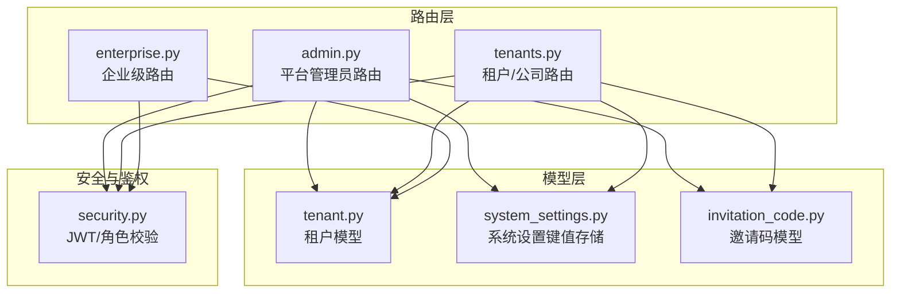
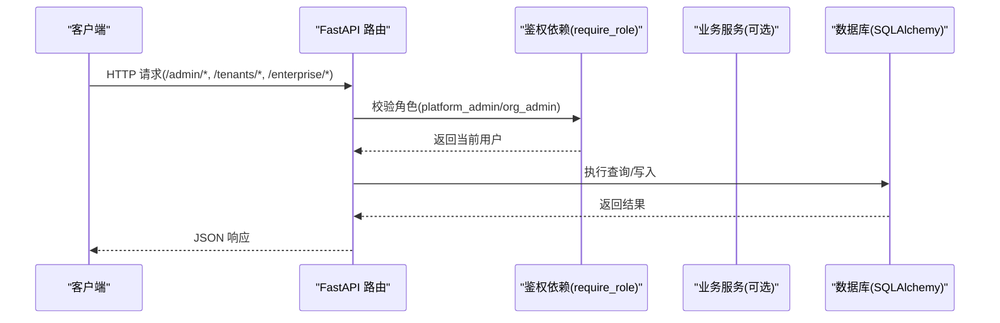
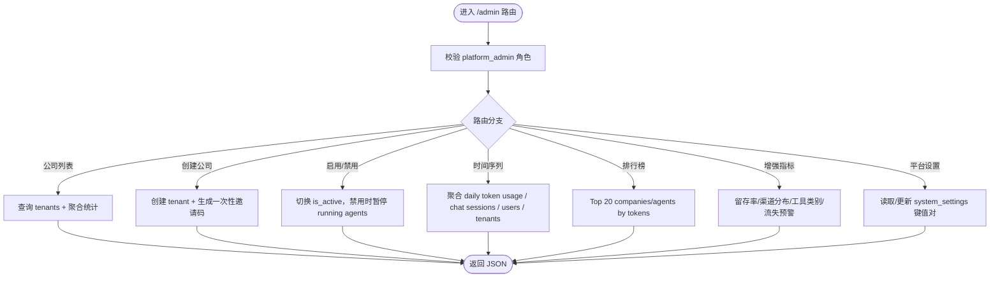
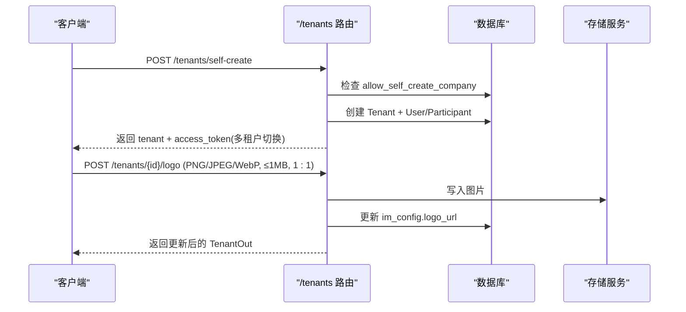
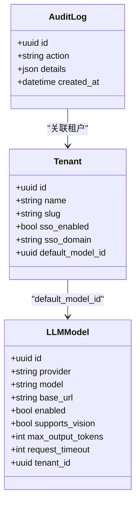
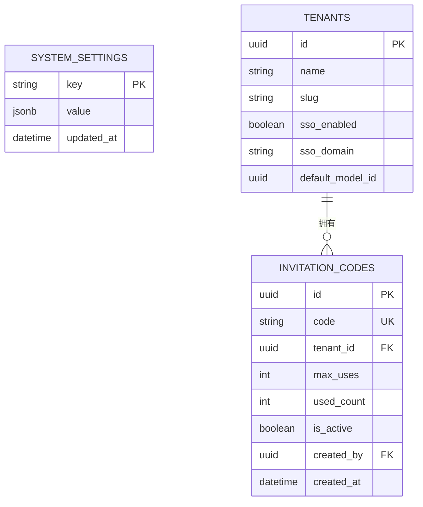
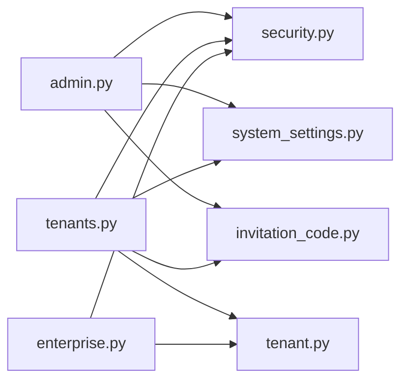

# 管理员管理API

<cite>
**本文引用的文件**   
- [admin.py](file://backend/app/api/admin.py)
- [tenants.py](file://backend/app/api/tenants.py)
- [enterprise.py](file://backend/app/api/enterprise.py)
- [system_settings.py](file://backend/app/models/system_settings.py)
- [invitation_code.py](file://backend/app/models/invitation_code.py)
- [tenant.py](file://backend/app/models/tenant.py)
- [security.py](file://backend/app/core/security.py)
</cite>

## 目录
1. [简介](#简介)
2. [项目结构](#项目结构)
3. [核心组件](#核心组件)
4. [架构总览](#架构总览)
5. [详细组件分析](#详细组件分析)
6. [依赖关系分析](#依赖关系分析)
7. [性能考量](#性能考量)
8. [故障排查指南](#故障排查指南)
9. [结论](#结论)
10. [附录：接口清单与示例](#附录接口清单与示例)

## 简介
本文件为 Clawith 平台“管理员管理”功能的 API 文档，覆盖以下能力：
- 多租户公司（Tenant）的创建、启用/禁用、统计信息获取
- 平台级配置管理：自注册开关、邀请码机制、SSO 域名重定向等
- 平台监控指标：时间序列、排行榜、增强指标（留存、渠道分布、工具类别、流失预警）
- 企业级功能：LLM 模型池、企业信息、审批流、审计日志、配额设置等

所有接口均基于 FastAPI 实现，使用角色鉴权（platform_admin / org_admin），数据持久化通过 SQLAlchemy + PostgreSQL。

## 项目结构
与管理员管理相关的后端代码主要分布在以下模块：
- 路由层：admin.py（平台管理员）、tenants.py（租户与公司）、enterprise.py（企业级能力）
- 模型层：tenant.py、system_settings.py、invitation_code.py
- 安全与鉴权：security.py（JWT、角色校验）

**图表来源** 
- [admin.py:1-626](file://backend/app/api/admin.py#L1-L626)
- [tenants.py:1-821](file://backend/app/api/tenants.py#L1-L821)
- [enterprise.py:1-800](file://backend/app/api/enterprise.py#L1-L800)
- [tenant.py:1-73](file://backend/app/models/tenant.py#L1-L73)
- [system_settings.py:1-21](file://backend/app/models/system_settings.py#L1-L21)
- [invitation_code.py:1-26](file://backend/app/models/invitation_code.py#L1-L26)
- [security.py:1-227](file://backend/app/core/security.py#L1-L227)

**章节来源**
- [admin.py:1-626](file://backend/app/api/admin.py#L1-L626)
- [tenants.py:1-821](file://backend/app/api/tenants.py#L1-L821)
- [enterprise.py:1-800](file://backend/app/api/enterprise.py#L1-L800)

## 核心组件
- 平台管理员路由（/admin）
  - 公司列表与统计、公司创建、公司启用/禁用
  - 平台指标：时间序列、排行榜、增强指标
  - 平台设置：读取/更新（自注册、邀请码、SSO 域名重定向）
- 租户路由（/tenants）
  - 自注册创建公司、邀请码加入公司
  - 按域名解析租户（SSO 重定向）
  - 公司详情、Logo 上传/删除、用户分配、删除公司
- 企业路由（/enterprise）
  - LLM 模型管理（增删改查、默认模型、连通性测试）
  - 企业信息、审批流、审计日志、企业统计
  - 租户配额设置

**章节来源**
- [admin.py:1-626](file://backend/app/api/admin.py#L1-L626)
- [tenants.py:1-821](file://backend/app/api/tenants.py#L1-L821)
- [enterprise.py:1-800](file://backend/app/api/enterprise.py#L1-L800)

## 架构总览
管理员接口采用分层设计：
- 路由层：FastAPI 路由定义请求/响应模型与权限控制
- 服务层：业务逻辑（如注册服务、SSO 服务、企业同步服务等）
- 数据访问层：SQLAlchemy ORM 查询与事务
- 鉴权层：JWT 解码与角色校验（require_role/get_current_user）

**图表来源** 
- [admin.py:1-626](file://backend/app/api/admin.py#L1-L626)
- [tenants.py:1-821](file://backend/app/api/tenants.py#L1-L821)
- [enterprise.py:1-800](file://backend/app/api/enterprise.py#L1-L800)
- [security.py:1-227](file://backend/app/core/security.py#L1-L227)

## 详细组件分析

### 平台管理员路由（/admin）
- 公司管理
  - GET /admin/companies：列出所有公司及其统计（用户数、Agent 数、运行中 Agent、Token 用量、缓存命中、组织管理员邮箱）
  - POST /admin/companies：创建新公司并生成一次性管理员邀请码
  - PUT /admin/companies/{company_id}/toggle：启用/禁用公司；禁用时自动暂停运行中的 Agent
- 平台指标
  - GET /admin/metrics/timeseries：日期范围聚合（新增公司/用户、Token 消耗、会话、DAU/WAU/MAU）
  - GET /admin/metrics/leaderboards：Top 20 公司/Agent Token 消耗排行
  - GET /admin/metrics/enhanced：增强指标（平均 Token/会话、7日留存、渠道分布、工具类别 Top10、流失预警）
- 平台设置
  - GET /admin/platform-settings：读取平台级开关（allow_self_create_company、invitation_code_enabled、sso_custom_domain_redirect_enabled）
  - PUT /admin/platform-settings：更新平台级开关

**图表来源** 
- [admin.py:1-626](file://backend/app/api/admin.py#L1-L626)

**章节来源**
- [admin.py:1-626](file://backend/app/api/admin.py#L1-L626)

### 租户与公司路由（/tenants）
- 自注册与加入
  - POST /tenants/self-create：自注册创建公司（受 allow_self_create_company 控制）
  - POST /tenants/join：使用邀请码加入公司（支持专用链接 target_tenant_id 校验）
  - GET /tenants/registration-config：公开接口，返回是否允许自注册
- 域名解析（SSO）
  - GET /tenants/resolve-by-domain：根据 sso_domain 或子域名 slug 解析租户（受 sso_custom_domain_redirect_enabled 控制）
- 公司管理（认证用户）
  - GET /tenants/me：当前用户的公司
  - GET /tenants/{tenant_id}：查看公司详情（平台管理员可查任意，组织管理员仅能查自己的）
  - PUT /tenants/{tenant_id}：更新公司设置（平台管理员不可直接修改 SSO 配置）
  - GET/POST/DELETE /tenants/{tenant_id}/logo：上传/获取/删除公司 Logo
  - PUT /tenants/{tenant_id}/assign-user/{user_id}：平台管理员为用户分配公司与角色
  - DELETE /tenants/{tenant_id}：彻底删除公司及其全部数据（严格外键顺序）

**图表来源** 
- [tenants.py:1-821](file://backend/app/api/tenants.py#L1-L821)

**章节来源**
- [tenants.py:1-821](file://backend/app/api/tenants.py#L1-L821)

### 企业级路由（/enterprise）
- LLM 模型管理
  - GET /enterprise/llm-models：按租户维度列出模型（非平台管理员仅可见自身租户）
  - POST /enterprise/llm-models：添加模型（首次启用的模型自动设为租户默认）
  - PATCH /enterprise/llm-models/{model_id}/set-default：设置默认模型（迁移跟随旧默认值的 Agent）
  - PUT /enterprise/llm-models/{model_id}：更新模型（变更会清空工具调用探测状态）
  - DELETE /enterprise/llm-models/{model_id}：软删除（记录审计日志）
  - POST /enterprise/llm-test：连通性与原生结构化 Tool Calling 测试（记录探测结果）
- 企业信息
  - GET /enterprise/info：列出企业信息条目
  - PUT /enterprise/info/{info_type}：创建/更新企业信息并同步至运行中的 Agent
- 审批流
  - GET /enterprise/approvals：按租户过滤的审批请求列表
  - POST /enterprise/approvals/{approval_id}/resolve：批准/拒绝
- 审计日志
  - GET /enterprise/audit-logs：按租户/Agent 过滤的审计日志
- 企业统计
  - GET /enterprise/stats：Agent/用户/待审批数量（可按租户过滤）
- 租户配额
  - GET /enterprise/tenant-quotas：获取租户配额默认值与心跳下限
  - PATCH /enterprise/tenant-quotas：更新租户配额（强制心跳下限）

**图表来源** 
- [enterprise.py:1-800](file://backend/app/api/enterprise.py#L1-L800)
- [tenant.py:1-73](file://backend/app/models/tenant.py#L1-L73)

**章节来源**
- [enterprise.py:1-800](file://backend/app/api/enterprise.py#L1-L800)

### 系统设置与邀请码模型
- SystemSetting（系统设置键值存储）
  - key：主键（字符串）
  - value：JSONB（布尔开关等）
  - updated_at：更新时间
- InvitationCode（邀请码）
  - code：唯一邀请码
  - tenant_id：所属租户
  - max_uses/used_count：最大使用次数与已用次数
  - is_active：是否激活
  - created_by：创建者

**图表来源** 
- [system_settings.py:1-21](file://backend/app/models/system_settings.py#L1-L21)
- [invitation_code.py:1-26](file://backend/app/models/invitation_code.py#L1-L26)
- [tenant.py:1-73](file://backend/app/models/tenant.py#L1-L73)

**章节来源**
- [system_settings.py:1-21](file://backend/app/models/system_settings.py#L1-L21)
- [invitation_code.py:1-26](file://backend/app/models/invitation_code.py#L1-L26)

## 依赖关系分析
- 路由依赖
  - admin.py、tenants.py、enterprise.py 均依赖 security.py 的角色校验（require_role/get_current_user）
  - admin.py 与 tenants.py 依赖 system_settings.py 与 invitation_code.py 进行平台设置与邀请码流程
  - enterprise.py 依赖 tenant.py 与 LLM 模型相关表，以及审计与审批模型
- 数据依赖
  - Tenant 作为多租户边界，被多个路由与模型引用
  - SystemSetting 用于平台级开关（自注册、邀请码、SSO 重定向）
  - InvitationCode 与 Tenant 关联，支撑邀请码加入流程

**图表来源** 
- [admin.py:1-626](file://backend/app/api/admin.py#L1-L626)
- [tenants.py:1-821](file://backend/app/api/tenants.py#L1-L821)
- [enterprise.py:1-800](file://backend/app/api/enterprise.py#L1-L800)
- [security.py:1-227](file://backend/app/core/security.py#L1-L227)
- [system_settings.py:1-21](file://backend/app/models/system_settings.py#L1-L21)
- [invitation_code.py:1-26](file://backend/app/models/invitation_code.py#L1-L26)
- [tenant.py:1-73](file://backend/app/models/tenant.py#L1-L73)

**章节来源**
- [admin.py:1-626](file://backend/app/api/admin.py#L1-L626)
- [tenants.py:1-821](file://backend/app/api/tenants.py#L1-L821)
- [enterprise.py:1-800](file://backend/app/api/enterprise.py#L1-L800)
- [security.py:1-227](file://backend/app/core/security.py#L1-L227)

## 性能考量
- 指标聚合查询
  - 时间序列接口使用窗口函数与分组聚合，注意日期范围过大时的性能开销
  - WAU/MAU 计算使用 SQL 窗口函数，建议合理限制 start_date/end_date
- 公司统计
  - 公司列表接口对每个租户执行多次计数查询，数据量大时可考虑物化视图或异步预计算
- 删除公司
  - 删除操作按外键顺序批量删除，避免约束冲突；建议在业务低峰期执行
- 存储
  - Logo 上传限制大小与格式，减少大文件处理开销

[本节为通用指导，不直接分析具体文件]

## 故障排查指南
- 鉴权失败
  - 401：令牌无效或过期
  - 403：角色不足（需要 platform_admin 或 org_admin）
- 资源不存在
  - 404：公司/用户/模型未找到
- 参数错误
  - 400：邀请码无效、已达使用上限、Logo 格式/大小不符、角色值非法
- 常见错误定位
  - 检查 JWT 是否正确传递
  - 确认 SystemSetting 键值是否存在且格式正确
  - 检查 InvitationCode 的 is_active 与 used_count/max_uses
  - 查看企业审计日志与审批记录

**章节来源**
- [security.py:1-227](file://backend/app/core/security.py#L1-L227)
- [tenants.py:1-821](file://backend/app/api/tenants.py#L1-L821)
- [admin.py:1-626](file://backend/app/api/admin.py#L1-L626)

## 结论
本 API 文档覆盖了 Clawith 平台管理员的核心管理能力：多租户公司生命周期、平台级配置、监控指标与企业级功能。通过严格的角色鉴权与健壮的异常处理，确保平台的安全与稳定。建议在生产环境结合监控与审计日志进行持续优化与问题定位。

[本节为总结，不直接分析具体文件]

## 附录：接口清单与示例

### 平台管理员接口（/admin）
- GET /admin/companies
  - 描述：列出所有公司及其统计信息
  - 权限：platform_admin
  - 响应字段：id、name、slug、is_active、sso_enabled、sso_domain、created_at、user_count、agent_count、agent_running_count、total_tokens、cache_read_tokens_total、org_admin_email
- POST /admin/companies
  - 描述：创建新公司并返回管理员邀请码
  - 权限：platform_admin
  - 请求体：name
  - 响应字段：company、admin_invitation_code
- PUT /admin/companies/{company_id}/toggle
  - 描述：启用/禁用公司；禁用时暂停运行中的 Agent
  - 权限：platform_admin
  - 响应字段：ok、is_active
- GET /admin/metrics/timeseries
  - 描述：日期范围内平台指标（公司/用户/Token/会话/DAU/WAU/MAU）
  - 权限：platform_admin
  - 查询参数：start_date、end_date
- GET /admin/metrics/leaderboards
  - 描述：Top 20 公司/Agent Token 消耗排行
  - 权限：platform_admin
- GET /admin/metrics/enhanced
  - 描述：增强指标（平均 Token/会话、7日留存、渠道分布、工具类别 Top10、流失预警）
  - 权限：platform_admin
- GET /admin/platform-settings
  - 描述：读取平台设置（allow_self_create_company、invitation_code_enabled、sso_custom_domain_redirect_enabled）
  - 权限：platform_admin
- PUT /admin/platform-settings
  - 描述：更新平台设置
  - 权限：platform_admin
  - 请求体：允许部分字段更新

**章节来源**
- [admin.py:1-626](file://backend/app/api/admin.py#L1-L626)

### 租户与公司接口（/tenants）
- POST /tenants/self-create
  - 描述：自注册创建公司（受 allow_self_create_company 控制）
  - 权限：已认证用户（受平台设置限制）
  - 请求体：name、target_tenant_id（可选）
  - 响应字段：tenant、access_token（多租户切换时返回）
- POST /tenants/join
  - 描述：使用邀请码加入公司（支持专用链接 target_tenant_id 校验）
  - 权限：已认证用户
  - 请求体：invitation_code、target_tenant_id（可选）
  - 响应字段：tenant、role、access_token
- GET /tenants/registration-config
  - 描述：公开接口，返回是否允许自注册
- GET /tenants/resolve-by-domain
  - 描述：根据 sso_domain 或子域名 slug 解析租户（受 sso_custom_domain_redirect_enabled 控制）
  - 查询参数：domain
- GET /tenants/me
  - 描述：当前用户的公司
  - 权限：已认证用户
- GET /tenants/{tenant_id}
  - 描述：查看公司详情（平台管理员可查任意，组织管理员仅能查自己的）
  - 权限：已认证用户（平台管理员/组织管理员）
- PUT /tenants/{tenant_id}
  - 描述：更新公司设置（平台管理员不可直接修改 SSO 配置）
  - 权限：平台管理员/组织管理员
- GET /tenants/{tenant_id}/logo
  - 描述：获取公司 Logo
- POST /tenants/{tenant_id}/logo
  - 描述：上传公司 Logo（PNG/JPEG/WebP，≤1MB，1:1）
  - 权限：平台管理员/组织管理员
- DELETE /tenants/{tenant_id}/logo
  - 描述：删除公司 Logo
  - 权限：平台管理员/组织管理员
- PUT /tenants/{tenant_id}/assign-user/{user_id}
  - 描述：平台管理员为用户分配公司与角色
  - 权限：platform_admin
  - 查询参数：role（org_admin/agent_admin/member）
- DELETE /tenants/{tenant_id}
  - 描述：彻底删除公司及其全部数据
  - 权限：平台管理员/组织管理员（仅自己公司）

**章节来源**
- [tenants.py:1-821](file://backend/app/api/tenants.py#L1-L821)

### 企业级接口（/enterprise）
- GET /enterprise/llm-models
  - 描述：按租户维度列出模型
  - 权限：已认证用户（非平台管理员仅可见自身租户）
- POST /enterprise/llm-models
  - 描述：添加模型（首次启用的模型自动设为租户默认）
  - 权限：管理员
- PATCH /enterprise/llm-models/{model_id}/set-default
  - 描述：设置默认模型（迁移跟随旧默认值的 Agent）
  - 权限：管理员
- PUT /enterprise/llm-models/{model_id}
  - 描述：更新模型（变更会清空工具调用探测状态）
  - 权限：管理员
- DELETE /enterprise/llm-models/{model_id}
  - 描述：软删除模型（记录审计日志）
  - 权限：管理员
- POST /enterprise/llm-test
  - 描述：连通性与原生结构化 Tool Calling 测试（记录探测结果）
  - 权限：管理员
- GET /enterprise/info
  - 描述：列出企业信息条目
  - 权限：已认证用户
- PUT /enterprise/info/{info_type}
  - 描述：创建/更新企业信息并同步至运行中的 Agent
  - 权限：管理员
- GET /enterprise/approvals
  - 描述：按租户过滤的审批请求列表
  - 权限：已认证用户
- POST /enterprise/approvals/{approval_id}/resolve
  - 描述：批准/拒绝
  - 权限：已认证用户
- GET /enterprise/audit-logs
  - 描述：按租户/Agent 过滤的审计日志
  - 权限：管理员
- GET /enterprise/stats
  - 描述：企业统计（Agent/用户/待审批数量，可按租户过滤）
  - 权限：管理员
- GET /enterprise/tenant-quotas
  - 描述：获取租户配额默认值与心跳下限
  - 权限：已认证用户
- PATCH /enterprise/tenant-quotas
  - 描述：更新租户配额（强制心跳下限）
  - 权限：管理员

**章节来源**
- [enterprise.py:1-800](file://backend/app/api/enterprise.py#L1-L800)