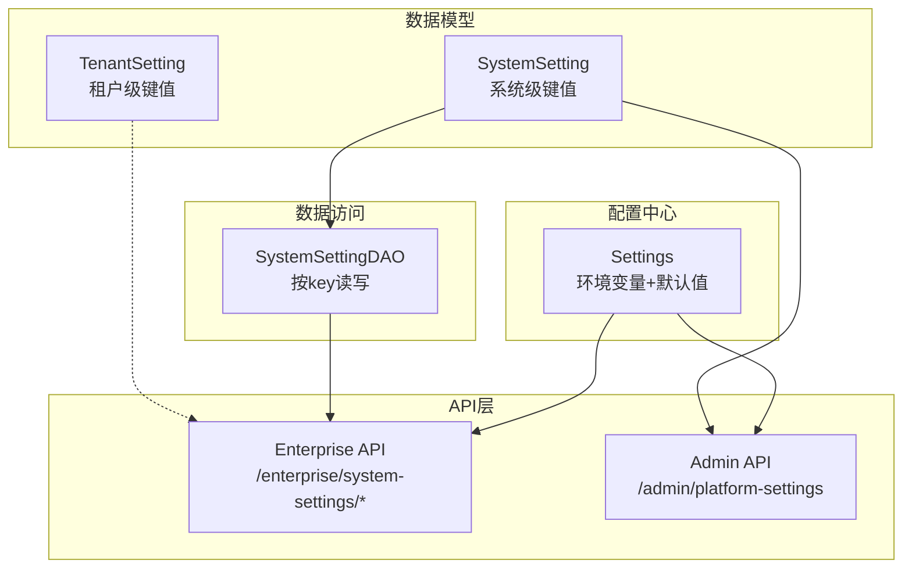
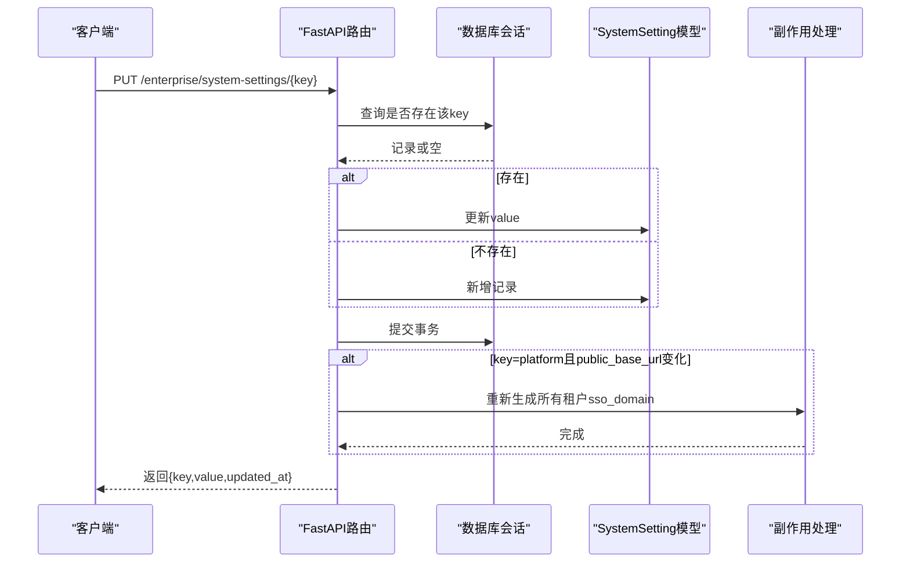
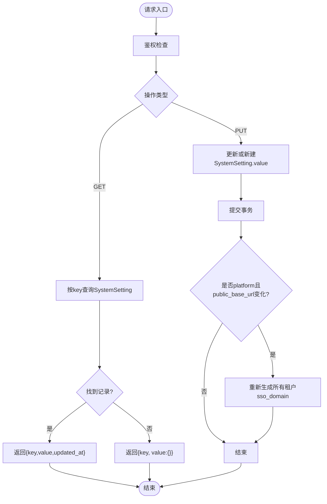
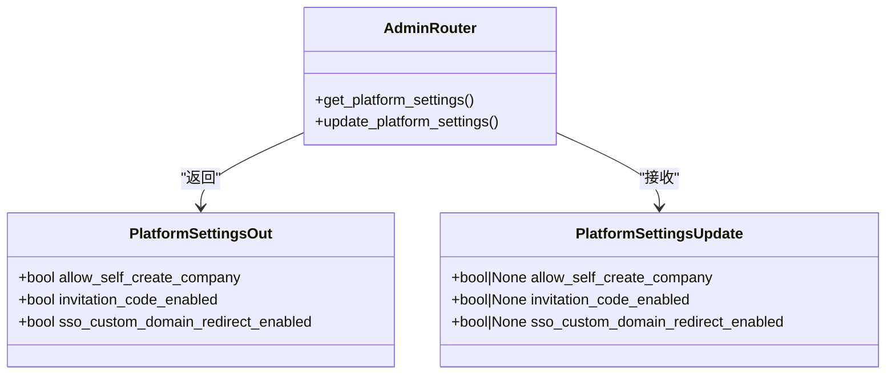
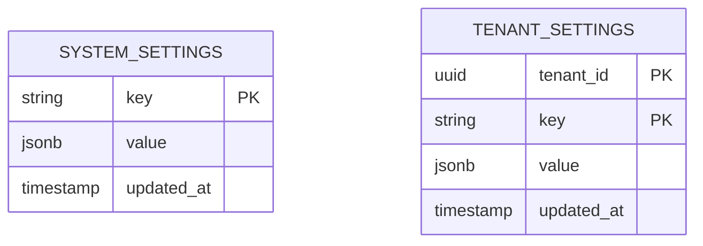
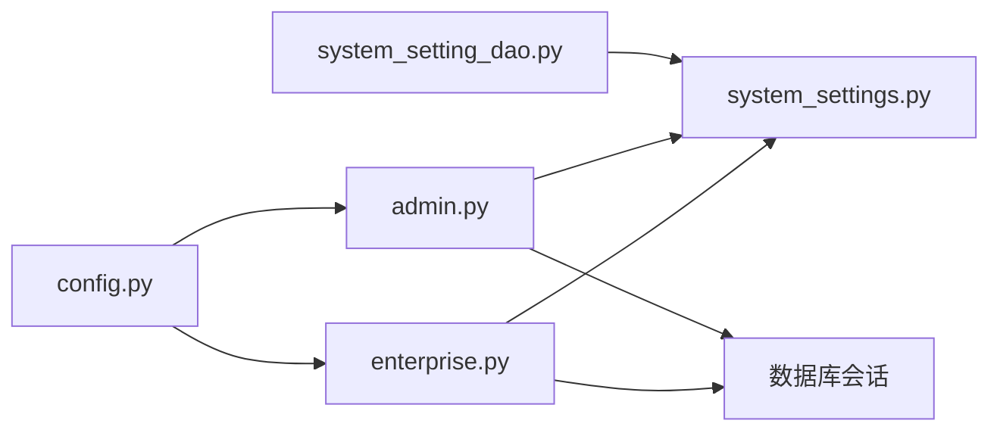

# 系统设置API

<cite>
**本文引用的文件**   
- [backend/app/models/system_settings.py](file://backend/app/models/system_settings.py)
- [backend/app/dao/system_setting_dao.py](file://backend/app/dao/system_setting_dao.py)
- [backend/app/api/enterprise.py](file://backend/app/api/enterprise.py)
- [backend/app/api/admin.py](file://backend/app/api/admin.py)
- [backend/app/config.py](file://backend/app/config.py)
- [backend/app/models/tenant_setting.py](file://backend/app/models/tenant_setting.py)
</cite>

## 目录
1. [简介](#简介)
2. [项目结构](#项目结构)
3. [核心组件](#核心组件)
4. [架构总览](#架构总览)
5. [详细组件分析](#详细组件分析)
6. [依赖关系分析](#依赖关系分析)
7. [性能考量](#性能考量)
8. [故障排查指南](#故障排查指南)
9. [结论](#结论)
10. [附录](#附录)

## 简介
本文件为 Clawith 平台的“系统设置管理”API 文档，聚焦全局配置项的读取、更新与验证机制。内容涵盖：
- 系统级键值配置（SystemSetting）与租户级键值配置（TenantSetting）的数据模型
- 平台级开关（Platform Settings）与企业安全策略（如邀请码、SSO 自定义域名重定向）
- 第三方服务配置（如 Jina、Exa、S3、代理等）与环境变量默认值管理
- 配置热更新与副作用处理（例如修改 public_base_url 后重新生成 SSO 子域）
- 配置校验规则与错误处理说明

## 项目结构
系统设置相关代码主要分布在以下模块：
- 数据模型层：system_settings.py、tenant_setting.py
- 数据访问层：system_setting_dao.py
- API 层：enterprise.py（通用系统设置）、admin.py（平台级开关）
- 应用配置：config.py（环境变量与默认值、运行时参数）

图表来源 
- [backend/app/models/system_settings.py:1-21](file://backend/app/models/system_settings.py#L1-L21)
- [backend/app/models/tenant_setting.py:1-31](file://backend/app/models/tenant_setting.py#L1-L31)
- [backend/app/dao/system_setting_dao.py:1-44](file://backend/app/dao/system_setting_dao.py#L1-L44)
- [backend/app/api/enterprise.py:1049-1111](file://backend/app/api/enterprise.py#L1049-L1111)
- [backend/app/api/admin.py:580-626](file://backend/app/api/admin.py#L580-L626)
- [backend/app/config.py:79-268](file://backend/app/config.py#L79-L268)

章节来源
- [backend/app/models/system_settings.py:1-21](file://backend/app/models/system_settings.py#L1-L21)
- [backend/app/models/tenant_setting.py:1-31](file://backend/app/models/tenant_setting.py#L1-L31)
- [backend/app/dao/system_setting_dao.py:1-44](file://backend/app/dao/system_setting_dao.py#L1-L44)
- [backend/app/api/enterprise.py:1049-1111](file://backend/app/api/enterprise.py#L1049-L1111)
- [backend/app/api/admin.py:580-626](file://backend/app/api/admin.py#L580-L626)
- [backend/app/config.py:79-268](file://backend/app/config.py#L79-L268)

## 核心组件
- SystemSetting（系统级键值存储）
  - key：主键，字符串
  - value：JSONB，任意结构化配置
  - updated_at：自动更新时间戳
- TenantSetting（租户级键值存储）
  - tenant_id + key：复合主键
  - value：JSONB
  - updated_at：自动更新时间戳
- SystemSettingDAO（系统设置DAO）
  - get_by_key/get_value：按key获取配置或默认值
  - is_invitation_code_enabled/is_sso_custom_domain_redirect_enabled：便捷布尔开关查询
- Platform Settings（平台级开关）
  - allow_self_create_company、invitation_code_enabled、sso_custom_domain_redirect_enabled
  - 通过 admin 路由提供统一读/写接口
- Settings（应用配置）
  - 从环境变量加载，包含数据库、Redis、JWT、存储、代理、Jina/Exa、沙箱、Agent Runtime 等大量参数
  - 内置字段校验与约束（范围、非空、互斥关系）

章节来源
- [backend/app/models/system_settings.py:1-21](file://backend/app/models/system_settings.py#L1-L21)
- [backend/app/models/tenant_setting.py:1-31](file://backend/app/models/tenant_setting.py#L1-L31)
- [backend/app/dao/system_setting_dao.py:1-44](file://backend/app/dao/system_setting_dao.py#L1-L44)
- [backend/app/api/admin.py:54-64](file://backend/app/api/admin.py#L54-L64)
- [backend/app/config.py:79-268](file://backend/app/config.py#L79-L268)

## 架构总览
系统设置API的整体调用链如下：
- 客户端请求进入 FastAPI 路由
- 鉴权与权限检查（管理员/平台管理员）
- 通过 SQLAlchemy 异步会话读写 system_settings/tenant_settings
- 部分写入触发副作用（如更新 platform.public_base_url 后重新计算各租户 sso_domain）
- 返回标准化响应体

图表来源 
- [backend/app/api/enterprise.py:1081-1111](file://backend/app/api/enterprise.py#L1081-L1111)
- [backend/app/models/system_settings.py:13-21](file://backend/app/models/system_settings.py#L13-L21)

章节来源
- [backend/app/api/enterprise.py:1049-1111](file://backend/app/api/enterprise.py#L1049-L1111)

## 详细组件分析

### 系统设置API（企业级）
- GET /enterprise/system-settings/notification_bar/public
  - 公开读取通知栏配置（无需认证）
  - 返回 enabled、text、updated_at
- GET /enterprise/system-settings/{key}
  - 需要登录用户
  - 返回 {key, value, updated_at}；若不存在则返回空value
- PUT /enterprise/system-settings/{key}
  - 需要管理员
  - 支持创建或更新任意key的配置
  - 特殊逻辑：当 key="platform" 且 value.public_base_url 变更时，触发全量租户 sso_domain 再生成

图表来源 
- [backend/app/api/enterprise.py:1049-1111](file://backend/app/api/enterprise.py#L1049-L1111)

章节来源
- [backend/app/api/enterprise.py:1049-1111](file://backend/app/api/enterprise.py#L1049-L1111)

### 平台级设置API（管理员）
- GET /admin/platform-settings
  - 仅平台管理员可访问
  - 返回 allow_self_create_company、invitation_code_enabled、sso_custom_domain_redirect_enabled
- PUT /admin/platform-settings
  - 仅平台管理员可访问
  - 支持增量更新上述三个布尔开关
  - 内部将每个开关以 {"enabled": bool} 形式持久化到 system_settings

图表来源 
- [backend/app/api/admin.py:54-64](file://backend/app/api/admin.py#L54-L64)
- [backend/app/api/admin.py:580-626](file://backend/app/api/admin.py#L580-L626)

章节来源
- [backend/app/api/admin.py:580-626](file://backend/app/api/admin.py#L580-L626)

### 数据模型与DAO
- SystemSetting
  - 表名：system_settings
  - 字段：key（主键）、value（JSONB）、updated_at（自动时间戳）
- TenantSetting
  - 表名：tenant_settings
  - 字段：tenant_id（外键+主键）、key（主键）、value（JSONB）、updated_at（自动时间戳）
- SystemSettingDAO
  - get_by_key(key)：精确查找
  - get_value(key, default)：返回value或默认值
  - is_invitation_code_enabled()：读取 invitation_code_enabled 开关
  - is_sso_custom_domain_redirect_enabled()：读取 sso_custom_domain_redirect_enabled 开关

图表来源 
- [backend/app/models/system_settings.py:13-21](file://backend/app/models/system_settings.py#L13-L21)
- [backend/app/models/tenant_setting.py:13-31](file://backend/app/models/tenant_setting.py#L13-L31)
- [backend/app/dao/system_setting_dao.py:19-41](file://backend/app/dao/system_setting_dao.py#L19-L41)

章节来源
- [backend/app/models/system_settings.py:1-21](file://backend/app/models/system_settings.py#L1-L21)
- [backend/app/models/tenant_setting.py:1-31](file://backend/app/models/tenant_setting.py#L1-L31)
- [backend/app/dao/system_setting_dao.py:1-44](file://backend/app/dao/system_setting_dao.py#L1-L44)

### 应用配置与默认值管理（Settings）
- 环境变量加载与默认值
  - 数据库连接、Redis、实例ID、JWT、存储后端、代理、Jina/Exa、沙箱、Agent Runtime 等
- 字段校验与约束
  - 非空校验（如 AGENT_RUNTIME_GRAPH_NAME/VERSION）
  - 数值范围（如并发数、TTL、阈值等）
  - 互斥校验（如 claim_renew_seconds < claim_ttl_seconds）
- 运行时配置派生
  - get_sandbox_config() 基于 Settings 构建沙箱配置对象

章节来源
- [backend/app/config.py:79-268](file://backend/app/config.py#L79-L268)

## 依赖关系分析
- API 层依赖
  - enterprise.py 依赖 SystemSetting 模型与数据库会话，用于通用系统设置CRUD
  - admin.py 依赖 SystemSetting 模型，用于平台级开关的统一读写
- DAO 层依赖
  - system_setting_dao.py 封装对 system_settings 表的常用查询
- 配置层依赖
  - config.py 提供 Settings 单例缓存，供各模块读取运行期参数

图表来源 
- [backend/app/api/enterprise.py:1049-1111](file://backend/app/api/enterprise.py#L1049-L1111)
- [backend/app/api/admin.py:580-626](file://backend/app/api/admin.py#L580-L626)
- [backend/app/dao/system_setting_dao.py:1-44](file://backend/app/dao/system_setting_dao.py#L1-L44)
- [backend/app/models/system_settings.py:1-21](file://backend/app/models/system_settings.py#L1-L21)
- [backend/app/config.py:79-268](file://backend/app/config.py#L79-L268)

章节来源
- [backend/app/api/enterprise.py:1049-1111](file://backend/app/api/enterprise.py#L1049-L1111)
- [backend/app/api/admin.py:580-626](file://backend/app/api/admin.py#L580-L626)
- [backend/app/dao/system_setting_dao.py:1-44](file://backend/app/dao/system_setting_dao.py#L1-L44)
- [backend/app/models/system_settings.py:1-21](file://backend/app/models/system_settings.py#L1-L21)
- [backend/app/config.py:79-268](file://backend/app/config.py#L79-L268)

## 性能考量
- 数据库访问
  - 使用异步会话与索引键（key为主键）进行快速查找
  - 批量更新场景建议合并事务以减少IO次数
- 配置读取
  - Settings 使用 lru_cache 缓存，避免重复解析环境变量
- 副作用处理
  - 修改 platform.public_base_url 会触发全量租户 sso_domain 重建，建议在低峰时段执行并监控耗时

[本节为通用指导，不直接分析具体文件]

## 故障排查指南
- 常见错误
  - 权限不足：非管理员调用 /enterprise/system-settings/{key} 或非平台管理员调用 /admin/platform-settings
  - 参数校验失败：Settings 字段范围/非空校验失败导致启动或请求失败
  - 副作用异常：public_base_url 变更后 SSO 子域重建失败需检查租户状态与唯一性约束
- 定位方法
  - 查看对应路由的异常抛出位置与HTTP状态码
  - 检查数据库记录是否存在、value 结构是否符合预期
  - 核对环境变量与默认值是否正确加载

章节来源
- [backend/app/api/enterprise.py:1081-1111](file://backend/app/api/enterprise.py#L1081-L1111)
- [backend/app/api/admin.py:580-626](file://backend/app/api/admin.py#L580-L626)
- [backend/app/config.py:201-234](file://backend/app/config.py#L201-L234)

## 结论
Clawith 的系统设置管理采用“系统级键值 + 租户级键值 + 平台级开关 + 环境变量默认值”的分层设计。通过统一的API暴露读取与更新能力，并在关键配置变更时触发必要的副作用（如SSO子域重建），既保证了灵活性，也兼顾了安全性与一致性。结合严格的字段校验与权限控制，可有效支撑企业级部署与多租户场景下的配置治理。

[本节为总结，不直接分析具体文件]

## 附录

### 端点清单与行为摘要
- GET /enterprise/system-settings/notification_bar/public
  - 公开读取通知栏配置
- GET /enterprise/system-settings/{key}
  - 登录用户读取指定key的系统设置
- PUT /enterprise/system-settings/{key}
  - 管理员创建或更新系统设置；key=platform且public_base_url变化时触发SSO子域重建
- GET /admin/platform-settings
  - 平台管理员读取平台级开关
- PUT /admin/platform-settings
  - 平台管理员更新平台级开关

章节来源
- [backend/app/api/enterprise.py:1049-1111](file://backend/app/api/enterprise.py#L1049-L1111)
- [backend/app/api/admin.py:580-626](file://backend/app/api/admin.py#L580-L626)

### 配置项分类与示例
- 企业安全策略
  - invitation_code_enabled：是否启用邀请码注册
  - sso_custom_domain_redirect_enabled：是否启用SSO自定义域名重定向
- 性能调优参数（来自 Settings）
  - AGENT_RUNTIME_COMMAND_CONCURRENCY、AGENT_RUNTIME_COMMAND_CLAIM_TTL_SECONDS、AGENT_RUNTIME_SESSION_COMPACT_MESSAGE_THRESHOLD 等
- 第三方服务配置（来自 Settings）
  - JINA_API_KEY、EXA_API_KEY、S3_*、HTTP_PROXY/HTTPS_PROXY/NO_PROXY 等

章节来源
- [backend/app/dao/system_setting_dao.py:32-41](file://backend/app/dao/system_setting_dao.py#L32-L41)
- [backend/app/config.py:168-185](file://backend/app/config.py#L168-L185)
- [backend/app/config.py:124-162](file://backend/app/config.py#L124-L162)