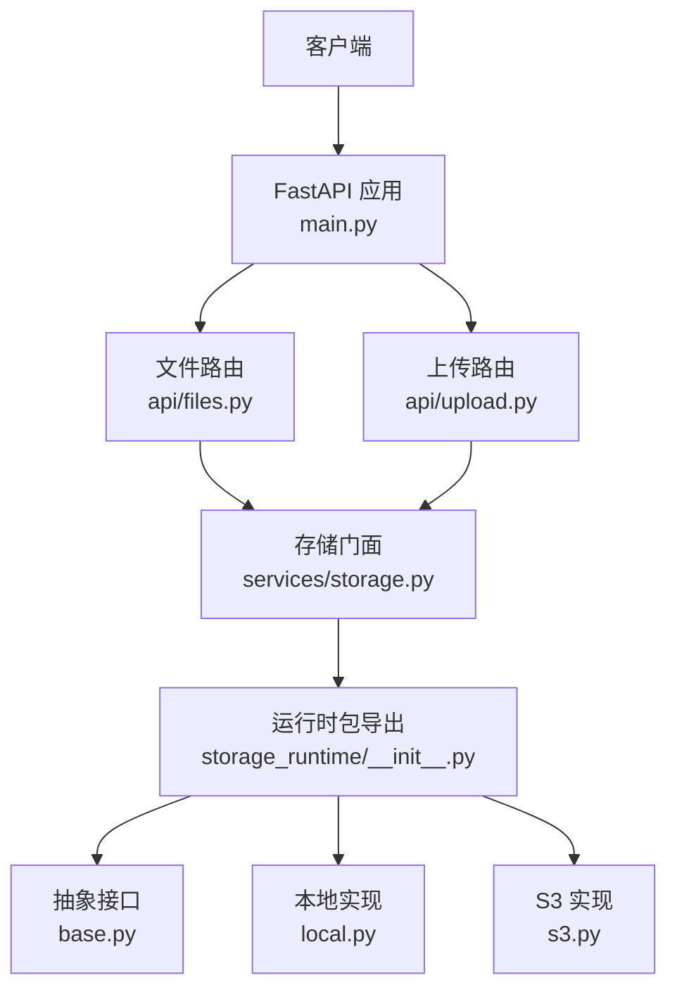
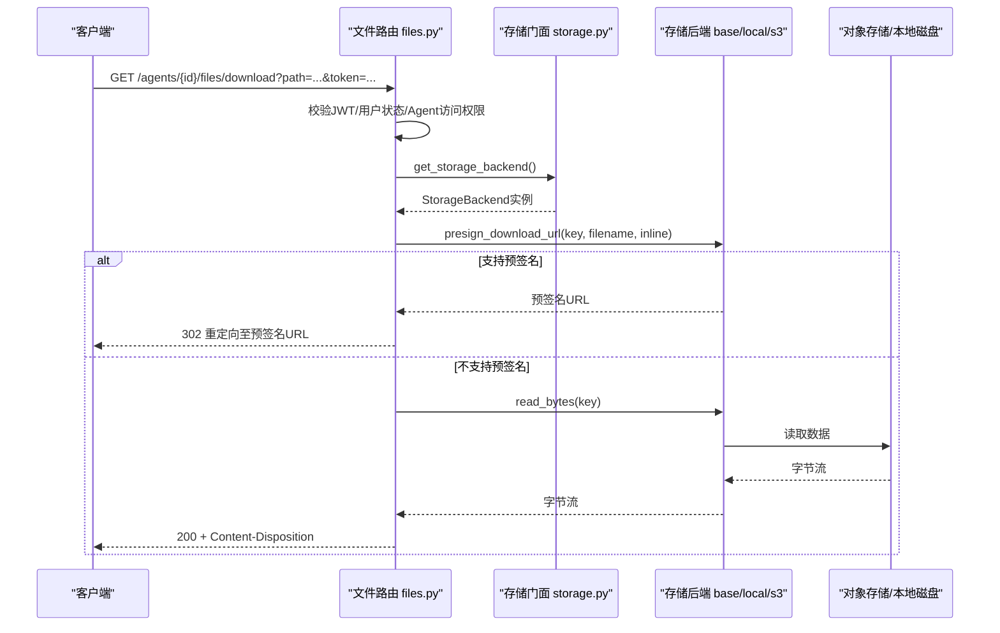
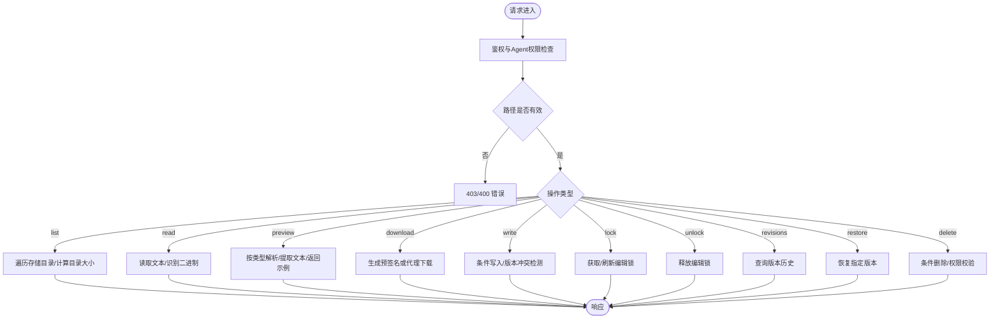
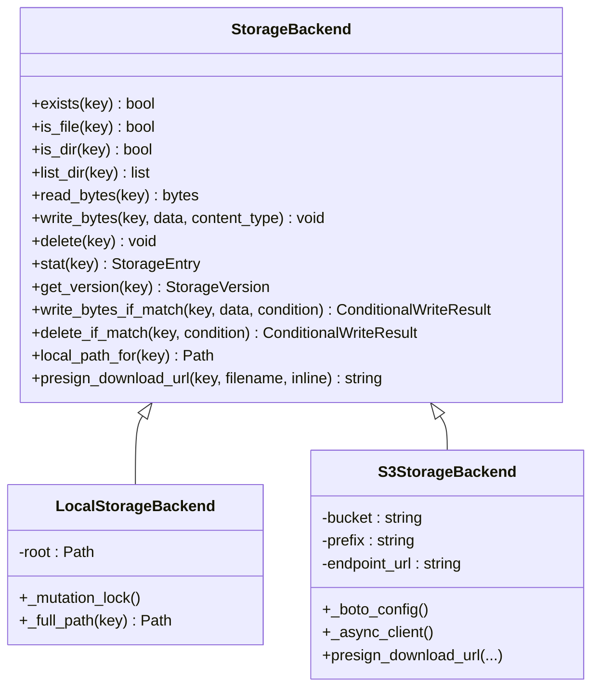
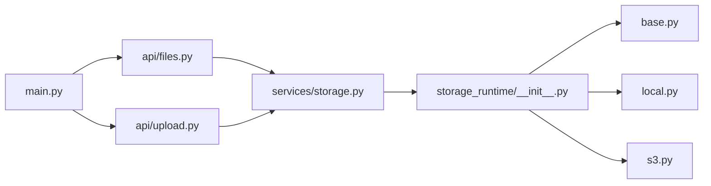

# 文件存储API

<cite>
**本文引用的文件**   
- [backend/app/api/files.py](file://backend/app/api/files.py)
- [backend/app/api/upload.py](file://backend/app/api/upload.py)
- [backend/app/services/storage.py](file://backend/app/services/storage.py)
- [backend/app/services/storage_runtime/__init__.py](file://backend/app/services/storage_runtime/__init__.py)
- [backend/app/services/storage_runtime/base.py](file://backend/app/services/storage_runtime/base.py)
- [backend/app/services/storage_runtime/local.py](file://backend/app/services/storage_runtime/local.py)
- [backend/app/services/storage_runtime/s3.py](file://backend/app/services/storage_runtime/s3.py)
- [backend/app/main.py](file://backend/app/main.py)
</cite>

## 目录
1. [简介](#简介)
2. [项目结构](#项目结构)
3. [核心组件](#核心组件)
4. [架构总览](#架构总览)
5. [详细组件分析](#详细组件分析)
6. [依赖关系分析](#依赖关系分析)
7. [性能与扩展性](#性能与扩展性)
8. [故障排查指南](#故障排查指南)
9. [结论](#结论)
10. [附录：REST API 规范](#附录rest-api-规范)

## 简介
本文件为 Clawith 平台文件存储系统的完整 API 文档，覆盖 Agent 工作区内的文件上传、下载、删除、预览、版本与元数据操作等能力。系统提供统一的后端抽象接口，支持本地文件系统与 S3 兼容对象存储（含 MinIO、GCS S3 兼容模式）等多种后端。文档同时说明权限控制、并发写保护、条件写入、预签名直链下载、文本/表格/文档预览等特性，并给出配置项与错误处理建议。

## 项目结构
- API 路由层
  - 文件管理路由：位于 backend/app/api/files.py，定义 /agents/{agent_id}/files/* 系列接口
  - 聊天上传路由：位于 backend/app/api/upload.py，定义 /chat/upload 用于聊天上下文上传
- 存储抽象与实现
  - 统一门面：backend/app/services/storage.py 暴露稳定导入路径
  - 运行时包：backend/app/services/storage_runtime/* 包含 StorageBackend 接口与 Local/S3 实现
- 应用入口
  - 路由注册：backend/app/main.py 中统一 include_router

**图示来源** 
- [backend/app/main.py:373-470](file://backend/app/main.py#L373-L470)
- [backend/app/api/files.py:1-45](file://backend/app/api/files.py#L1-L45)
- [backend/app/api/upload.py:1-14](file://backend/app/api/upload.py#L1-L14)
- [backend/app/services/storage.py:1-46](file://backend/app/services/storage.py#L1-L46)
- [backend/app/services/storage_runtime/__init__.py:1-54](file://backend/app/services/storage_runtime/__init__.py#L1-L54)
- [backend/app/services/storage_runtime/base.py:51-146](file://backend/app/services/storage_runtime/base.py#L51-L146)
- [backend/app/services/storage_runtime/local.py:28-211](file://backend/app/services/storage_runtime/local.py#L28-L211)
- [backend/app/services/storage_runtime/s3.py:21-410](file://backend/app/services/storage_runtime/s3.py#L21-L410)

**章节来源**
- [backend/app/main.py:373-470](file://backend/app/main.py#L373-L470)
- [backend/app/api/files.py:1-45](file://backend/app/api/files.py#L1-L45)
- [backend/app/api/upload.py:1-14](file://backend/app/api/upload.py#L1-L14)
- [backend/app/services/storage.py:1-46](file://backend/app/services/storage.py#L1-L46)
- [backend/app/services/storage_runtime/__init__.py:1-54](file://backend/app/services/storage_runtime/__init__.py#L1-L54)

## 核心组件
- 存储抽象接口 StorageBackend
  - 定义 exists/is_file/is_dir/list_dir/read_bytes/write_bytes/delete/stat/get_version 等异步方法
  - 提供条件写入 write_bytes_if_match 与条件删除 delete_if_match，以及 local_path_for/presign_download_url 扩展点
- 本地存储后端 LocalStorageBackend
  - 原子写入、进程级互斥锁、版本 token 基于 mtime+size+hash
  - 支持 local_path_for 直接返回本地路径供浏览器或下游服务读取
- S3 兼容存储后端 S3StorageBackend
  - 支持 presigned URL 直链下载、Conditional Put/Delete（ETag/VersionId）、批量删除
  - 适配 GCS S3 兼容与 MinIO 的 endpoint 重写
- 统一门面 storage.py
  - 向后兼容的稳定导入路径，对外暴露 get_storage_backend、normalize_storage_key、guess_content_type 等工具

**章节来源**
- [backend/app/services/storage_runtime/base.py:51-146](file://backend/app/services/storage_runtime/base.py#L51-L146)
- [backend/app/services/storage_runtime/local.py:28-211](file://backend/app/services/storage_runtime/local.py#L28-L211)
- [backend/app/services/storage_runtime/s3.py:21-410](file://backend/app/services/storage_runtime/s3.py#L21-L410)
- [backend/app/services/storage.py:1-46](file://backend/app/services/storage.py#L1-L46)

## 架构总览
文件 API 通过 FastAPI 路由暴露，统一调用 storage_runtime 提供的 StorageBackend 抽象。根据部署配置选择 Local 或 S3 后端；下载时优先使用预签名直链，否则回退到服务端代理或本地路径直出。

**图示来源** 
- [backend/app/api/files.py:557-616](file://backend/app/api/files.py#L557-L616)
- [backend/app/services/storage_runtime/s3.py:388-409](file://backend/app/services/storage_runtime/s3.py#L388-L409)
- [backend/app/services/storage_runtime/local.py:209-211](file://backend/app/services/storage_runtime/local.py#L209-L211)

## 详细组件分析

### 文件管理 API（/agents/{agent_id}/files/*）
- 列出目录
  - GET /agents/{agent_id}/files/?path=...
  - 行为：按可见路径列出条目，自动过滤 .gitkeep、focus.md/agenda.md 等；企业知识库 enterprise_info 对租户隔离
  - 权限：需要 Agent 访问权限
- 读取内容
  - GET /agents/{agent_id}/files/content?path=...
  - 行为：以 UTF-8 文本读取；二进制文件返回占位提示；返回 version_token
  - 权限：需要 Agent 访问权限
- 预览
  - GET /agents/{agent_id}/files/preview?path=...
  - 行为：按类型返回文本/CSV行/Excel多表/DOCX/PPTX文本提取结果或 base64 样本；返回 download_url
  - 权限：需要 Agent 访问权限
- 下载
  - GET /agents/{agent_id}/files/download?path=...&token=...|inline=...
  - 行为：支持 Bearer 或 query token；优先返回预签名直链，否则服务端代理或本地路径直出
  - 权限：鉴权后需具备 Agent 访问权限
- 写入
  - PUT /agents/{agent_id}/files/content
  - 行为：创建或覆盖；enterprise_info 仅管理员可写；支持 autosave 与 expected_version_token 条件写
  - 权限：普通用户可写自身 Agent 文件；enterprise_info 仅限管理员
- 锁定/解锁
  - POST /agents/{agent_id}/files/locks
  - DELETE /agents/{agent_id}/files/locks
  - 行为：短生命周期编辑锁，避免多人冲突
- 版本历史
  - GET /agents/{agent_id}/files/revisions?path=...
  - 行为：返回操作记录、前后内容快照、时间戳
- 恢复版本
  - POST /agents/{agent_id}/files/restore
  - 行为：将 after_content 恢复到当前文件；支持 expected_version_token
- 删除
  - DELETE /agents/{agent_id}/files/content?expected_version_token=...
  - 行为：仅管理者/管理员可删除；enterprise_info 根不可删；支持条件删除

**图示来源** 
- [backend/app/api/files.py:223-800](file://backend/app/api/files.py#L223-L800)

**章节来源**
- [backend/app/api/files.py:223-800](file://backend/app/api/files.py#L223-L800)

### 聊天上传 API（/chat/upload）
- 功能：上传文件到 Agent 工作区 uploads 目录，返回提取的文本或图片 data URL（视觉模型用）
- 限制：图片最大 10MB；支持文本/Office/PDF 文本提取（依赖外部库）
- 返回：文件名、保存名、大小、提取文本、workspace_path、是否图片、data URL

**章节来源**
- [backend/app/api/upload.py:108-175](file://backend/app/api/upload.py#L108-L175)

### 存储后端抽象与实现
- StorageBackend 接口
  - 读写、统计、列表、版本信息、条件写入/删除、预签名、本地路径映射
- LocalStorageBackend
  - 原子写入、进程级互斥锁、版本 token 由 mtime+size+hash 构成
- S3StorageBackend
  - 预签名直链、Conditional Put/Delete（ETag/VersionId）、批量删除、endpoint 适配（MinIO/GCS）

**图示来源** 
- [backend/app/services/storage_runtime/base.py:51-146](file://backend/app/services/storage_runtime/base.py#L51-L146)
- [backend/app/services/storage_runtime/local.py:28-211](file://backend/app/services/storage_runtime/local.py#L28-L211)
- [backend/app/services/storage_runtime/s3.py:21-410](file://backend/app/services/storage_runtime/s3.py#L21-L410)

**章节来源**
- [backend/app/services/storage_runtime/base.py:51-146](file://backend/app/services/storage_runtime/base.py#L51-L146)
- [backend/app/services/storage_runtime/local.py:28-211](file://backend/app/services/storage_runtime/local.py#L28-L211)
- [backend/app/services/storage_runtime/s3.py:21-410](file://backend/app/services/storage_runtime/s3.py#L21-L410)

## 依赖关系分析
- 路由注册
  - main.py 统一引入 files.py、upload.py 等路由，挂载到 API_PREFIX
- 存储门面
  - storage.py 重新导出 storage_runtime 包中的类与工具函数，保持向后兼容
- 运行时包
  - __init__.py 集中导出 StorageBackend、LocalStorageBackend、S3StorageBackend 及 key 构造工具

**图示来源** 
- [backend/app/main.py:373-470](file://backend/app/main.py#L373-L470)
- [backend/app/services/storage.py:1-46](file://backend/app/services/storage.py#L1-L46)
- [backend/app/services/storage_runtime/__init__.py:1-54](file://backend/app/services/storage_runtime/__init__.py#L1-L54)

**章节来源**
- [backend/app/main.py:373-470](file://backend/app/main.py#L373-L470)
- [backend/app/services/storage.py:1-46](file://backend/app/services/storage.py#L1-L46)
- [backend/app/services/storage_runtime/__init__.py:1-54](file://backend/app/services/storage_runtime/__init__.py#L1-L54)

## 性能与扩展性
- 大文件下载
  - 优先使用 S3 预签名直链减少服务器带宽占用与延迟
- 并发写保护
  - 本地后端使用进程级互斥锁保证原子写入，避免竞争态
- 条件写入/删除
  - 基于 version_token/ETag/VersionId 的乐观锁，降低冲突概率
- 预览优化
  - 文本/CSV/Office 采用轻量解析与行数限制，避免大文件解析开销
- 可扩展性
  - 新增存储后端只需实现 StorageBackend 接口并通过 facade 注入

[本节为通用指导，不直接分析具体文件]

## 故障排查指南
- 401 未授权
  - 检查 JWT token 是否有效、用户是否激活
- 403 禁止访问
  - 检查 Agent 访问权限、enterprise_info 管理员权限、路径穿越防护
- 404 未找到
  - 确认 path 是否存在且为文件；enterprise_info 租户隔离
- 409 冲突
  - 条件写入/删除失败，检查 expected_version_token 或 ETag
- 预览失败
  - 缺失第三方库（如 openpyxl/docx），或服务端无法解析格式

**章节来源**
- [backend/app/api/files.py:557-616](file://backend/app/api/files.py#L557-L616)
- [backend/app/api/files.py:619-700](file://backend/app/api/files.py#L619-L700)
- [backend/app/api/files.py:701-800](file://backend/app/api/files.py#L701-L800)

## 结论
Clawith 文件存储系统通过统一的 StorageBackend 抽象，为 Agent 工作区提供了健壮的上传、下载、预览、版本与权限控制能力。本地与 S3 双后端支持满足不同部署场景，条件写入与预签名直链提升了并发安全与性能。建议在大规模部署中启用 S3 后端与预签名下载，并结合条件写入策略保障一致性。

[本节为总结，不直接分析具体文件]

## 附录：REST API 规范

### 文件管理（/agents/{agent_id}/files）
- GET /agents/{agent_id}/files/
  - 描述：列出目录内容
  - 参数：path（可选）
  - 权限：Agent 访问权限
  - 返回：FileInfo[]
- GET /agents/{agent_id}/files/content
  - 描述：读取文件内容
  - 参数：path
  - 权限：Agent 访问权限
  - 返回：FileContent（含 version_token）
- GET /agents/{agent_id}/files/preview
  - 描述：浏览器友好预览
  - 参数：path
  - 权限：Agent 访问权限
  - 返回：预览载荷（kind/mime_type/content或rows/text/base64_sample/download_url）
- GET /agents/{agent_id}/files/download
  - 描述：下载/内联展示
  - 参数：path、token（Bearer 或 query）、inline（布尔）
  - 权限：鉴权后需 Agent 访问权限
  - 返回：302 预签名或文件流
- PUT /agents/{agent_id}/files/content
  - 描述：写入/覆盖
  - 参数：content、autosave（布尔）、session_id（可选）、expected_version_token（可选）
  - 权限：普通用户可写自身 Agent 文件；enterprise_info 仅管理员
  - 返回：{status, path, revision_id}
- POST /agents/{agent_id}/files/locks
  - 描述：获取/刷新编辑锁
  - 参数：path、session_id（可选）
  - 权限：Agent 访问权限
  - 返回：{status, path, expires_at}
- DELETE /agents/{agent_id}/files/locks
  - 描述：释放编辑锁
  - 参数：path
  - 权限：Agent 访问权限
  - 返回：{status, path}
- GET /agents/{agent_id}/files/revisions
  - 描述：版本历史
  - 参数：path
  - 权限：Agent 访问权限
  - 返回：Revision[]
- POST /agents/{agent_id}/files/restore
  - 描述：恢复版本
  - 参数：revision_id、expected_version_token（可选）
  - 权限：Agent 访问权限
  - 返回：{status, path, revision_id}
- DELETE /agents/{agent_id}/files/content
  - 描述：删除文件
  - 参数：expected_version_token（可选）
  - 权限：仅管理者/管理员；enterprise_info 根不可删
  - 返回：{status, ...}

### 聊天上传（/chat）
- POST /chat/upload
  - 描述：上传文件到 Agent 工作区 uploads，并尝试提取文本
  - 表单：file、agent_id（可选）
  - 限制：图片最大 10MB；文本/Office/PDF 提取依赖外部库
  - 返回：{filename, saved_filename, size, extracted_text, workspace_path, is_image, image_data_url}

### 存储后端配置要点
- LocalStorageBackend
  - root：本地根目录
  - 原子写入与进程锁确保一致性
- S3StorageBackend
  - bucket、prefix、region、endpoint_url、access_key_id、secret_access_key
  - presign_ttl_seconds：预签名有效期
  - max_pool_connections：连接池大小
  - write_workers：写入并发度（按需调整）

[本节为规范汇总，不直接分析具体文件]