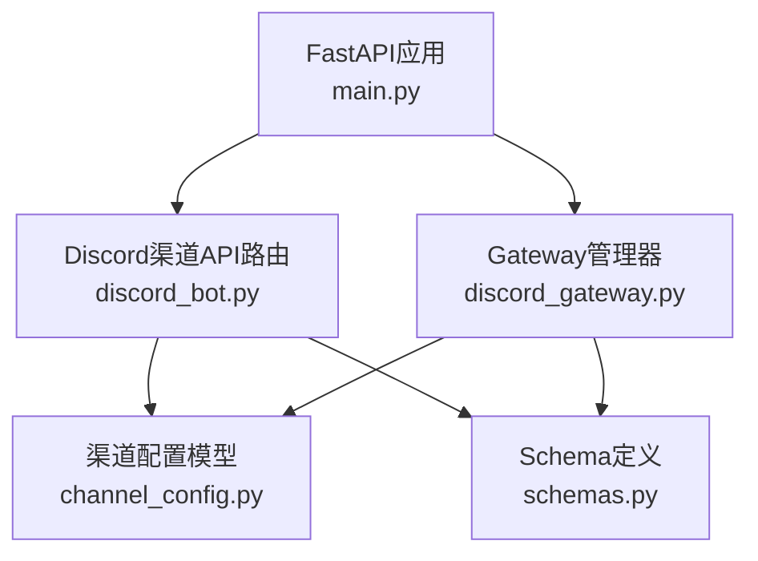
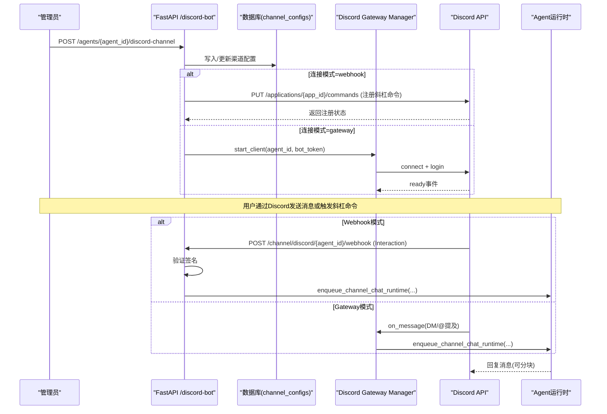
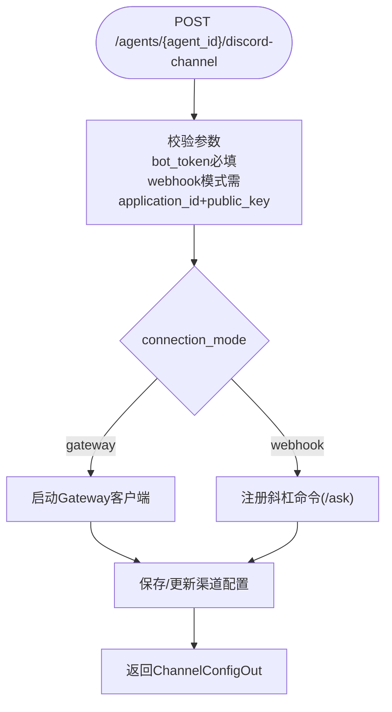
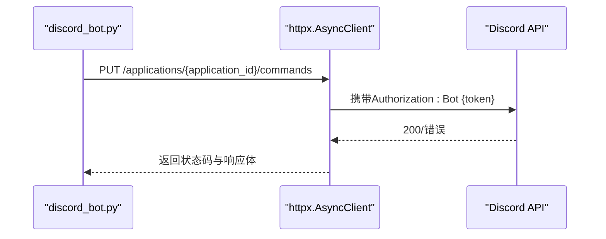
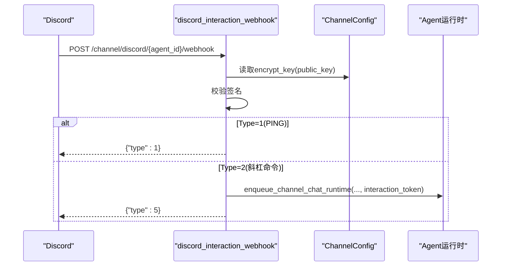
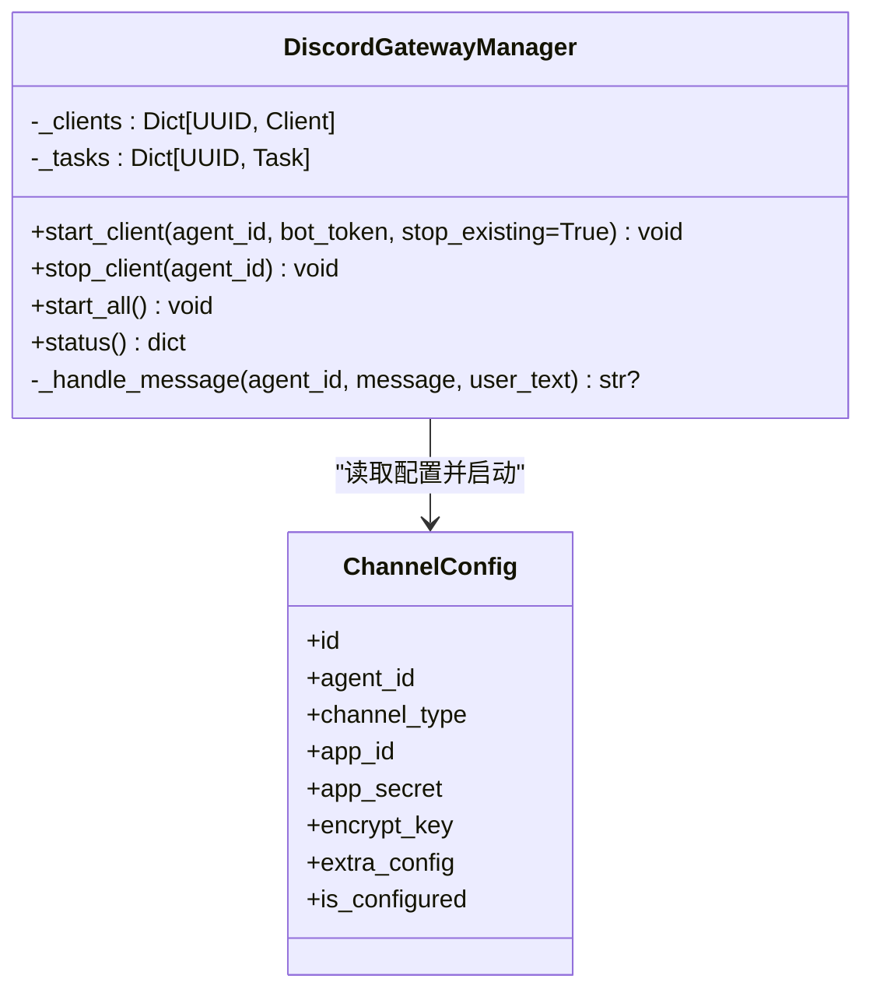
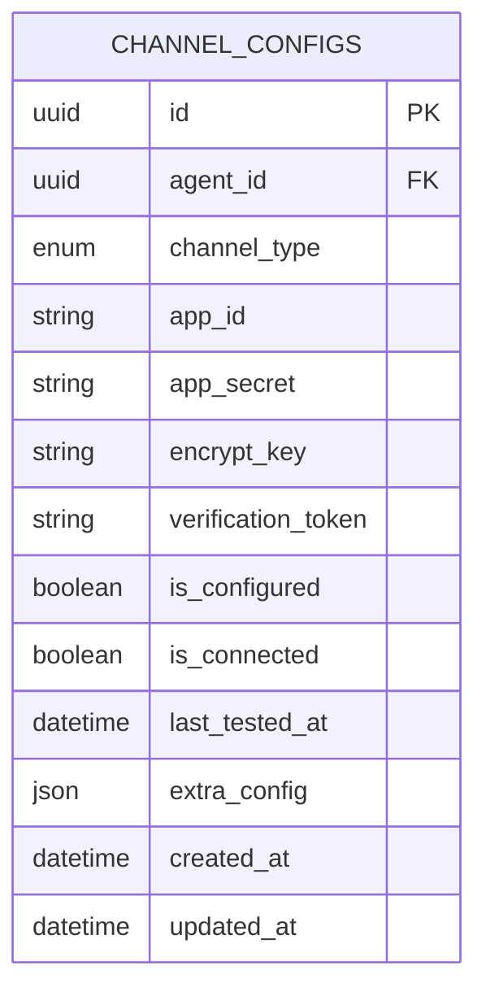
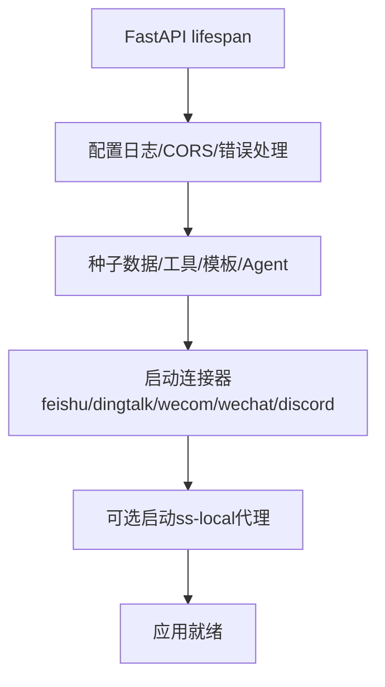
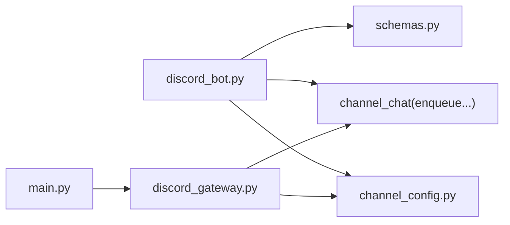

# Discord集成API

<cite>
**本文引用的文件**   
- [backend/app/api/discord_bot.py](file://backend/app/api/discord_bot.py)
- [backend/app/services/discord_gateway.py](file://backend/app/services/discord_gateway.py)
- [backend/app/models/channel_config.py](file://backend/app/models/channel_config.py)
- [backend/app/schemas/schemas.py](file://backend/app/schemas/schemas.py)
- [backend/app/main.py](file://backend/app/main.py)
</cite>

## 目录
1. [简介](#简介)
2. [项目结构](#项目结构)
3. [核心组件](#核心组件)
4. [架构总览](#架构总览)
5. [详细组件分析](#详细组件分析)
6. [依赖关系分析](#依赖关系分析)
7. [性能与可靠性](#性能与可靠性)
8. [故障排查指南](#故障排查指南)
9. [结论](#结论)
10. [附录：配置与部署要点](#附录配置与部署要点)

## 简介
本文件为Clawith平台的Discord渠道集成提供完整的API文档，覆盖以下能力：
- Discord Bot OAuth与应用配置（Webhook模式与Gateway模式）
- Slash命令交互与签名校验
- Gateway事件处理（DM与@提及消息）
- REST API调用（斜杠命令注册、Webhook回调）
- 服务器配置、Bot权限管理、角色系统基础说明
- Discord高级特性：Embed消息、Reaction反应、Thread线程的扩展建议
- 开发者门户配置指引、事件监听与错误处理方法

## 项目结构
Discord相关代码主要分布在后端模块中：
- API路由层：处理Discord渠道配置与Webhook回调
- 服务层：维护Gateway长连接与消息处理
- 数据模型：渠道配置持久化
- Schema：统一的配置输出结构
- 应用入口：启动时初始化并拉起Gateway任务

**图表来源** 
- [backend/app/main.py:121-350](file://backend/app/main.py#L121-L350)
- [backend/app/api/discord_bot.py:1-320](file://backend/app/api/discord_bot.py#L1-L320)
- [backend/app/services/discord_gateway.py:1-282](file://backend/app/services/discord_gateway.py#L1-L282)
- [backend/app/models/channel_config.py:1-52](file://backend/app/models/channel_config.py#L1-L52)
- [backend/app/schemas/schemas.py:450-475](file://backend/app/schemas/schemas.py#L450-L475)

**章节来源**
- [backend/app/main.py:121-350](file://backend/app/main.py#L121-L350)
- [backend/app/api/discord_bot.py:1-320](file://backend/app/api/discord_bot.py#L1-L320)
- [backend/app/services/discord_gateway.py:1-282](file://backend/app/services/discord_gateway.py#L1-L282)
- [backend/app/models/channel_config.py:1-52](file://backend/app/models/channel_config.py#L1-L52)
- [backend/app/schemas/schemas.py:450-475](file://backend/app/schemas/schemas.py#L450-L475)

## 核心组件
- Discord渠道配置API：提供创建、查询、删除渠道配置，支持Webhook与Gateway两种连接模式
- Slash命令注册：通过Discord REST API注册全局斜杠命令
- Webhook回调处理器：接收Discord Interaction请求，进行签名校验并路由到Agent运行时
- Gateway管理器：维护每个Agent的discord.Client实例，处理DM与@提及消息，转发至Agent运行时
- 渠道配置模型：存储App ID、Bot Token、公钥等凭证及连接模式
- Schema：统一ChannelConfigOut结构用于响应

**章节来源**
- [backend/app/api/discord_bot.py:25-93](file://backend/app/api/discord_bot.py#L25-L93)
- [backend/app/api/discord_bot.py:151-176](file://backend/app/api/discord_bot.py#L151-L176)
- [backend/app/api/discord_bot.py:197-320](file://backend/app/api/discord_bot.py#L197-L320)
- [backend/app/services/discord_gateway.py:38-134](file://backend/app/services/discord_gateway.py#L38-L134)
- [backend/app/models/channel_config.py:13-52](file://backend/app/models/channel_config.py#L13-L52)
- [backend/app/schemas/schemas.py:460-475](file://backend/app/schemas/schemas.py#L460-L475)

## 架构总览
下图展示Discord渠道在Clawith中的整体交互流程：前端/管理员通过REST配置渠道；Webhook模式下由Discord将Interaction回调到平台；Gateway模式下平台主动建立WebSocket连接并监听事件。两者最终都进入统一的Agent运行时通道。

**图表来源** 
- [backend/app/api/discord_bot.py:25-93](file://backend/app/api/discord_bot.py#L25-L93)
- [backend/app/api/discord_bot.py:151-176](file://backend/app/api/discord_bot.py#L151-L176)
- [backend/app/api/discord_bot.py:197-320](file://backend/app/api/discord_bot.py#L197-L320)
- [backend/app/services/discord_gateway.py:45-134](file://backend/app/services/discord_gateway.py#L45-L134)
- [backend/app/main.py:313-326](file://backend/app/main.py#L313-L326)

## 详细组件分析

### Discord渠道配置API
- 功能
  - 创建/更新渠道配置：支持connection_mode为gateway或webhook；webhook模式需要application_id与public_key
  - 查询渠道配置：返回ChannelConfigOut
  - 获取Webhook URL：根据平台公网地址生成回调URL
  - 删除渠道配置：停止对应Gateway客户端并清理配置
- 权限
  - 仅Agent创建者可配置或删除渠道
- 关键逻辑
  - gateway模式：启动discord.Client并运行
  - webhook模式：调用Discord REST注册全局斜杠命令

**图表来源** 
- [backend/app/api/discord_bot.py:25-93](file://backend/app/api/discord_bot.py#L25-L93)
- [backend/app/api/discord_bot.py:151-176](file://backend/app/api/discord_bot.py#L151-L176)

**章节来源**
- [backend/app/api/discord_bot.py:25-93](file://backend/app/api/discord_bot.py#L25-L93)
- [backend/app/api/discord_bot.py:96-112](file://backend/app/api/discord_bot.py#L96-L112)
- [backend/app/api/discord_bot.py:115-119](file://backend/app/api/discord_bot.py#L115-L119)
- [backend/app/api/discord_bot.py:122-147](file://backend/app/api/discord_bot.py#L122-L147)

### Slash命令注册
- 端点：PUT https://discord.com/api/v10/applications/{application_id}/commands
- 命令定义：/ask，包含message选项（STRING，必填）
- 代理支持：可通过环境变量DISCORD_PROXY或HTTPS_PROXY设置httpx代理

**图表来源** 
- [backend/app/api/discord_bot.py:151-176](file://backend/app/api/discord_bot.py#L151-L176)

**章节来源**
- [backend/app/api/discord_bot.py:151-176](file://backend/app/api/discord_bot.py#L151-L176)

### Webhook回调处理器（Interaction）
- 端点：POST /api/channel/discord/{agent_id}/webhook
- 安全校验：使用nacl对x-signature-timestamp与x-signature-ed25519进行ed25519签名校验
- 交互类型
  - Type 1：PING（URL验证），直接返回type=1
  - Type 2：APPLICATION_COMMAND（斜杠命令），解析message参数并进入Agent运行时
- 会话与会话ID
  - 群聊：guild存在时使用channel_id构造会话ID
  - 私聊：使用sender_id构造会话ID
- 返回DEFERRED_CHANNEL_MESSAGE_WITH_SOURCE（type=5）以显示“思考中”

**图表来源** 
- [backend/app/api/discord_bot.py:197-320](file://backend/app/api/discord_bot.py#L197-L320)

**章节来源**
- [backend/app/api/discord_bot.py:180-195](file://backend/app/api/discord_bot.py#L180-L195)
- [backend/app/api/discord_bot.py:197-320](file://backend/app/api/discord_bot.py#L197-L320)

### Gateway事件处理（DM与@提及）
- 启动方式：应用启动时扫描已配置的discord渠道，若connection_mode=gateway则启动对应client
- 事件监听
  - on_ready：记录连接成功信息
  - on_message：忽略自身消息；仅响应DM或@提及；自动去除@mention文本
- 消息处理
  - 显示typing指示器
  - 解析用户与频道上下文，构建或查找会话
  - 调用Agent运行时enqueue_channel_chat_runtime，附带reply_to_message_id
  - 回复消息按2000字符分块发送

**图表来源** 
- [backend/app/services/discord_gateway.py:38-134](file://backend/app/services/discord_gateway.py#L38-L134)
- [backend/app/services/discord_gateway.py:135-227](file://backend/app/services/discord_gateway.py#L135-L227)
- [backend/app/models/channel_config.py:13-52](file://backend/app/models/channel_config.py#L13-L52)

**章节来源**
- [backend/app/services/discord_gateway.py:45-134](file://backend/app/services/discord_gateway.py#L45-L134)
- [backend/app/services/discord_gateway.py:135-227](file://backend/app/services/discord_gateway.py#L135-L227)
- [backend/app/main.py:313-326](file://backend/app/main.py#L313-L326)

### 渠道配置模型与Schema
- ChannelConfig模型字段
  - agent_id、channel_type（含discord）、app_id、app_secret、encrypt_key、verification_token
  - is_configured、is_connected、last_tested_at、extra_config（JSON）
- ChannelConfigOut响应结构
  - id、agent_id、channel_type、app_id、app_secret、encrypt_key、verification_token
  - is_configured、is_connected、last_tested_at、extra_config、created_at

**图表来源** 
- [backend/app/models/channel_config.py:13-52](file://backend/app/models/channel_config.py#L13-L52)
- [backend/app/schemas/schemas.py:460-475](file://backend/app/schemas/schemas.py#L460-L475)

**章节来源**
- [backend/app/models/channel_config.py:13-52](file://backend/app/models/channel_config.py#L13-L52)
- [backend/app/schemas/schemas.py:460-475](file://backend/app/schemas/schemas.py#L460-L475)

### 应用启动与生命周期
- 启动阶段
  - 初始化日志、CORS、错误处理
  - 导入并启动各连接器（包括discord_gateway_manager.start_all）
  - 可选启动ss-local SOCKS5代理以支持Discord API访问
- 背景任务
  - 通过AsyncExitStack统一管理后台任务与资源关闭

**图表来源** 
- [backend/app/main.py:121-350](file://backend/app/main.py#L121-L350)

**章节来源**
- [backend/app/main.py:121-350](file://backend/app/main.py#L121-L350)

## 依赖关系分析
- API路由依赖
  - discord_bot.py依赖ChannelConfig模型、ChannelConfigOut Schema、Agent运行时通道函数
- Gateway依赖
  - discord_gateway.py依赖discord.py库、ChannelConfig模型、Agent运行时通道函数
- 应用入口依赖
  - main.py在connector角色下启动discord_gateway_manager.start_all

**图表来源** 
- [backend/app/api/discord_bot.py:1-320](file://backend/app/api/discord_bot.py#L1-L320)
- [backend/app/services/discord_gateway.py:1-282](file://backend/app/services/discord_gateway.py#L1-L282)
- [backend/app/main.py:121-350](file://backend/app/main.py#L121-L350)

**章节来源**
- [backend/app/api/discord_bot.py:1-320](file://backend/app/api/discord_bot.py#L1-L320)
- [backend/app/services/discord_gateway.py:1-282](file://backend/app/services/discord_gateway.py#L1-L282)
- [backend/app/main.py:121-350](file://backend/app/main.py#L121-L350)

## 性能与可靠性
- 消息长度限制
  - Discord单条消息最大2000字符，Gateway回复会分块发送
- 重连机制
  - discord.Client.start(reconnect=True)保证网络异常自动重连
- 代理支持
  - httpx与discord.Client均支持代理，便于跨网络访问Discord API
- 错误处理
  - 登录失败、令牌无效、异常捕获与日志记录
  - 签名校验失败返回401
- 并发与任务管理
  - 每个Agent一个独立Task与Client，避免相互干扰

**章节来源**
- [backend/app/services/discord_gateway.py:111-134](file://backend/app/services/discord_gateway.py#L111-L134)
- [backend/app/services/discord_gateway.py:122-126](file://backend/app/services/discord_gateway.py#L122-L126)
- [backend/app/api/discord_bot.py:168-175](file://backend/app/api/discord_bot.py#L168-L175)
- [backend/app/api/discord_bot.py:218-221](file://backend/app/api/discord_bot.py#L218-L221)

## 故障排查指南
- 常见问题
  - 未安装discord.py：Gateway功能不可用，需安装依赖
  - 缺少bot_token：无法启动Gateway或注册命令
  - 签名校验失败：检查public_key与x-signature-*头是否匹配
  - 代理不可用：检查DISCORD_PROXY或ss-local配置
- 定位方法
  - 查看日志中的[Discord GW]与[Discord]前缀
  - 确认ChannelConfig.is_configured与extra_config.connection_mode
  - 验证斜杠命令是否成功注册

**章节来源**
- [backend/app/services/discord_gateway.py:28-34](file://backend/app/services/discord_gateway.py#L28-L34)
- [backend/app/services/discord_gateway.py:56-58](file://backend/app/services/discord_gateway.py#L56-L58)
- [backend/app/api/discord_bot.py:218-221](file://backend/app/api/discord_bot.py#L218-L221)
- [backend/app/main.py:72-118](file://backend/app/main.py#L72-L118)

## 结论
Clawith的Discord渠道集成提供了双模式接入：Webhook模式适合无公网IP或希望被动回调的场景；Gateway模式适合实时互动与低延迟场景。两者均能无缝对接Agent运行时，实现一致的对话体验。通过完善的签名校验、代理支持与错误处理，系统在可用性、安全性与可扩展性方面具备良好基础。

## 附录：配置与部署要点
- Discord开发者门户配置
  - 创建Application并启用Bot
  - 授予必要权限（如读取消息内容、发送消息、使用斜杠命令）
  - 记录Bot Token与Public Key（用于Webhook签名校验）
  - 配置Webhook回调URL（Webhook模式）
- 平台侧配置
  - 通过POST /agents/{agent_id}/discord-channel设置connection_mode与凭证
  - Webhook模式需提供application_id与public_key
  - Gateway模式仅需bot_token
- 环境变量与代理
  - DISCORD_PROXY或HTTPS_PROXY用于httpx代理
  - ss-local代理可在启动时自动拉起并设置socks5代理
- 高级特性扩展建议
  - Embed消息：在回复阶段构造Embed对象并通过Discord API发送
  - Reaction反应：在收到消息后添加Emoji反应，增强交互反馈
  - Thread线程：在群组中为每条消息创建Thread，提升讨论组织性

[本节为通用指导，不直接分析具体文件]