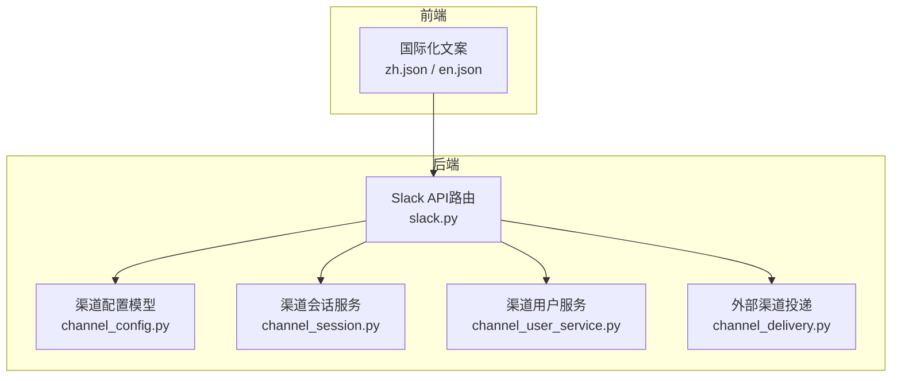
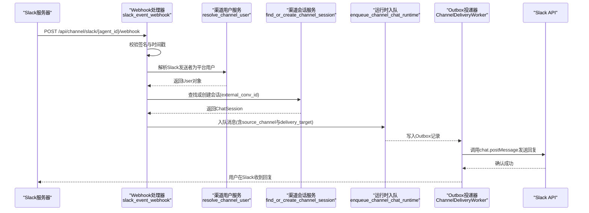
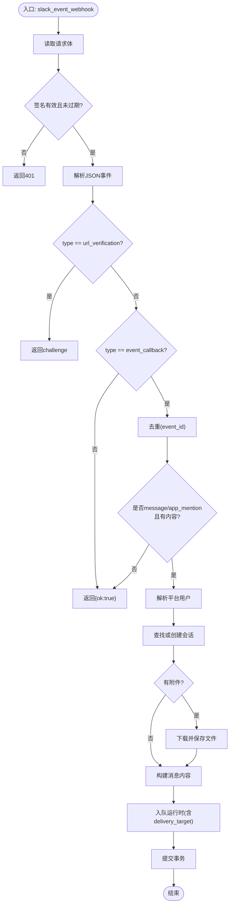
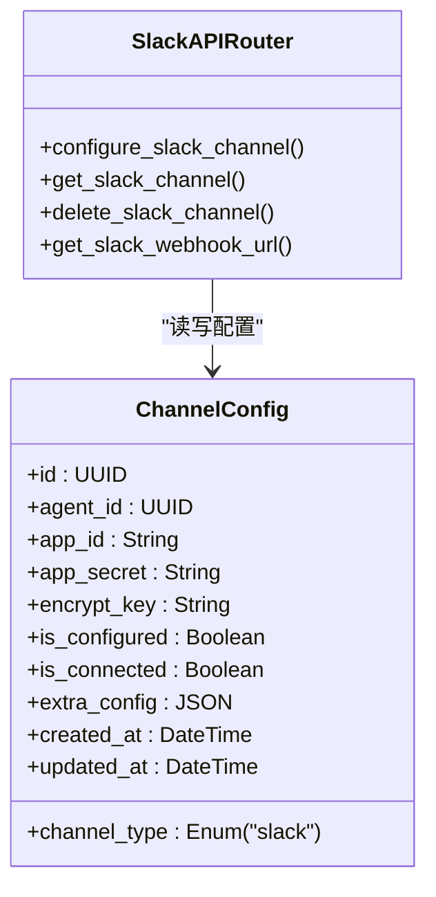
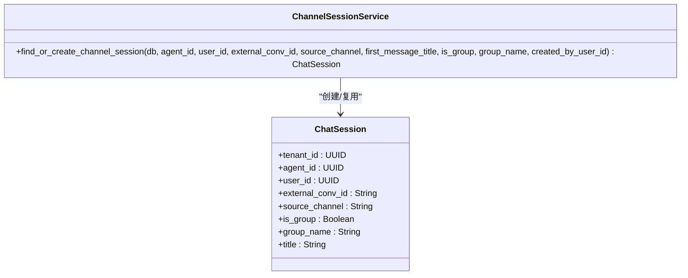
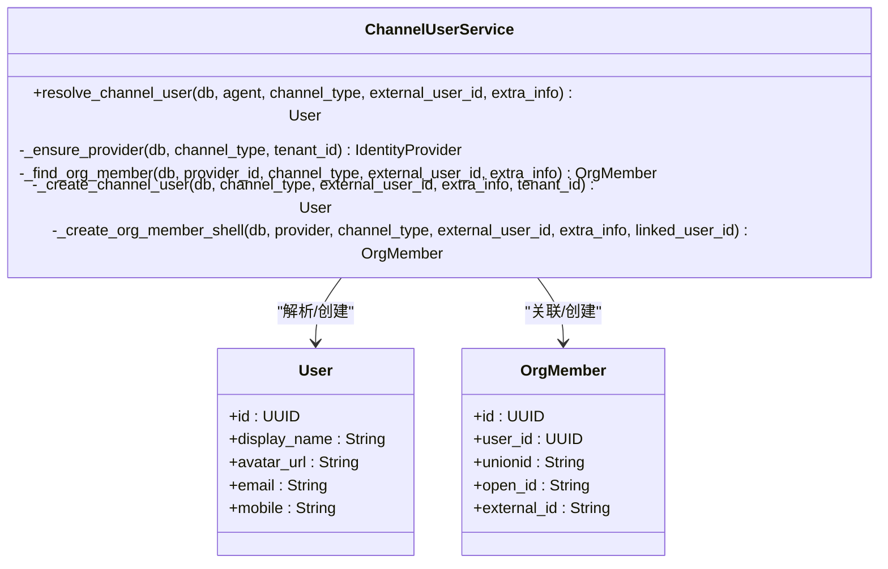
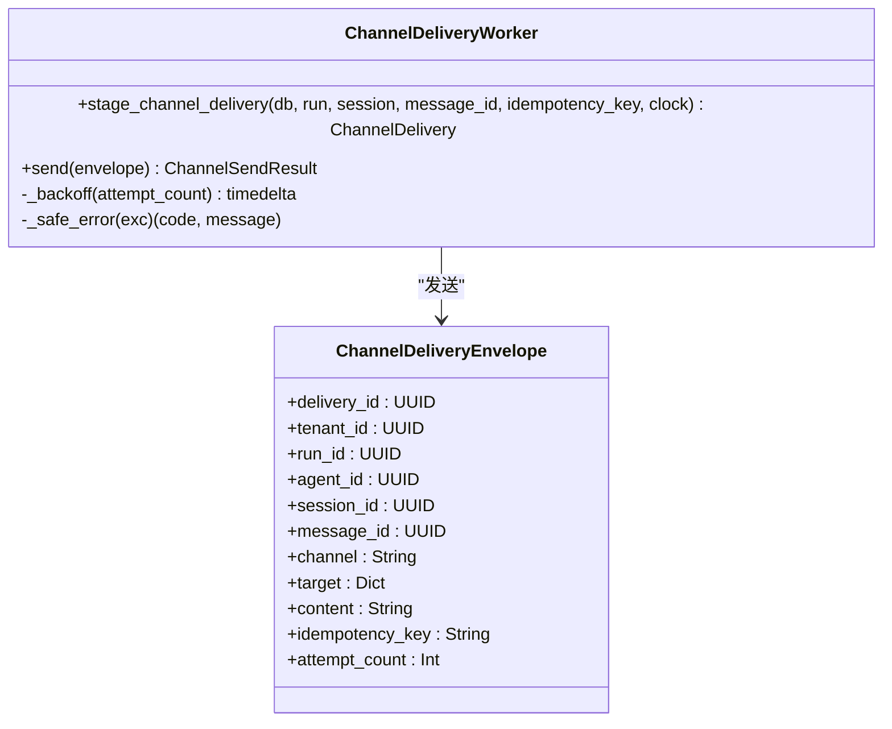
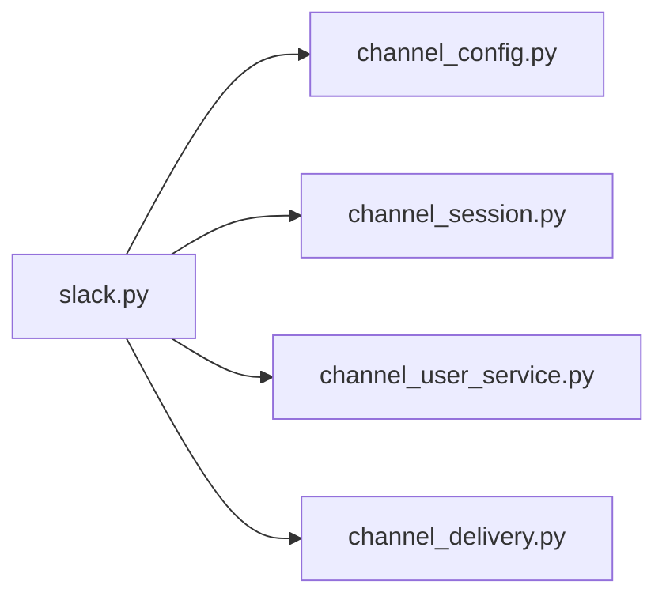

# Slack集成API

<cite>
**本文引用的文件**   
- [backend/app/api/slack.py](file://backend/app/api/slack.py)
- [backend/app/models/channel_config.py](file://backend/app/models/channel_config.py)
- [backend/app/services/channel_session.py](file://backend/app/services/channel_session.py)
- [backend/app/services/channel_user_service.py](file://backend/app/services/channel_user_service.py)
- [backend/app/services/agent_runtime/channel_delivery.py](file://backend/app/services/agent_runtime/channel_delivery.py)
- [frontend/src/i18n/zh.json](file://frontend/src/i18n/zh.json)
- [frontend/src/i18n/en.json](file://frontend/src/i18n/en.json)
</cite>

## 目录
1. [简介](#简介)
2. [项目结构](#项目结构)
3. [核心组件](#核心组件)
4. [架构总览](#架构总览)
5. [详细组件分析](#详细组件分析)
6. [依赖关系分析](#依赖关系分析)
7. [性能考虑](#性能考虑)
8. [故障排查指南](#故障排查指南)
9. [结论](#结论)
10. [附录](#附录)

## 简介
本文件为Clawith平台的Slack渠道集成提供完整的API与实现说明，覆盖：
- Slack OAuth认证、事件订阅（Events API）消息处理
- Webhook回调、签名校验、去重与幂等
- 用户身份解析、会话映射与持久化
- 文件下载与上传到工作区存储
- 外部渠道投递（Outbox模式）与重试机制
- Slack应用配置、Bot权限、频道管理与调试方法

## 项目结构
Slack相关能力主要分布在以下模块：
- API路由：Slack事件Webhook与渠道配置接口
- 数据模型：渠道配置表（ChannelConfig）
- 服务层：渠道会话创建、渠道用户解析、外部渠道投递
- 前端国际化：Slack应用配置步骤指引

**图表来源** 
- [backend/app/api/slack.py](file://backend/app/api/slack.py)
- [backend/app/models/channel_config.py](file://backend/app/models/channel_config.py)
- [backend/app/services/channel_session.py](file://backend/app/services/channel_session.py)
- [backend/app/services/channel_user_service.py](file://backend/app/services/channel_user_service.py)
- [backend/app/services/agent_runtime/channel_delivery.py](file://backend/app/services/agent_runtime/channel_delivery.py)
- [frontend/src/i18n/zh.json](file://frontend/src/i18n/zh.json)
- [frontend/src/i18n/en.json](file://frontend/src/i18n/en.json)

**章节来源**
- [backend/app/api/slack.py](file://backend/app/api/slack.py)
- [backend/app/models/channel_config.py](file://backend/app/models/channel_config.py)
- [backend/app/services/channel_session.py](file://backend/app/services/channel_session.py)
- [backend/app/services/channel_user_service.py](file://backend/app/services/channel_user_service.py)
- [backend/app/services/agent_runtime/channel_delivery.py](file://backend/app/services/agent_runtime/channel_delivery.py)
- [frontend/src/i18n/zh.json](file://frontend/src/i18n/zh.json)
- [frontend/src/i18n/en.json](file://frontend/src/i18n/en.json)

## 核心组件
- Slack事件Webhook处理器：接收并验证Slack事件，解析消息与附件，入队至运行时通道。
- 渠道配置管理：保存Bot Token与Signing Secret，生成Webhook URL。
- 渠道会话服务：按外部会话ID查找或创建统一会话，支持群组与私聊。
- 渠道用户服务：将Slack用户映射到平台用户，支持邮箱/手机号匹配与懒注册。
- 外部渠道投递：基于Outbox模式的可靠投递与重试，确保消息最终送达。

**章节来源**
- [backend/app/api/slack.py](file://backend/app/api/slack.py)
- [backend/app/models/channel_config.py](file://backend/app/models/channel_config.py)
- [backend/app/services/channel_session.py](file://backend/app/services/channel_session.py)
- [backend/app/services/channel_user_service.py](file://backend/app/services/channel_user_service.py)
- [backend/app/services/agent_runtime/channel_delivery.py](file://backend/app/services/agent_runtime/channel_delivery.py)

## 架构总览
Slack事件从Slack服务器推送到后端Webhook，经签名校验后进入消息处理流水线，最终通过Outbox投递回Slack。

**图表来源** 
- [backend/app/api/slack.py](file://backend/app/api/slack.py)
- [backend/app/services/channel_user_service.py](file://backend/app/services/channel_user_service.py)
- [backend/app/services/channel_session.py](file://backend/app/services/channel_session.py)
- [backend/app/services/agent_runtime/channel_delivery.py](file://backend/app/services/agent_runtime/channel_delivery.py)

## 详细组件分析

### Slack事件Webhook与消息处理
- 功能要点
  - 接收Slack事件回调，支持URL验证挑战与event_callback类型
  - HMAC-SHA256签名校验，拒绝超过5分钟的请求
  - 事件去重（event_id），避免重复处理
  - 过滤机器人消息与子类型，仅处理message与app_mention
  - 解析文本与附件，自动剥离@提及前缀
  - 根据channel_id判断群组或私聊，构造external_conv_id
  - 调用渠道用户服务解析平台用户，调用渠道会话服务创建或复用会话
  - 下载Slack私有文件，保存到工作区存储，附加到消息上下文
  - 入队至运行时，设置source_channel与channel_delivery_target以便回发

**图表来源** 
- [backend/app/api/slack.py](file://backend/app/api/slack.py)

**章节来源**
- [backend/app/api/slack.py](file://backend/app/api/slack.py)

### 渠道配置管理（OAuth与Webhook）
- 功能要点
  - 配置接口：POST /agents/{agent_id}/slack-channel，保存bot_token与signing_secret
  - 查询接口：GET /agents/{agent_id}/slack-channel，返回已配置信息
  - 删除接口：DELETE /agents/{agent_id}/slack-channel
  - 获取Webhook URL：GET /agents/{agent_id}/slack-channel/webhook-url，拼接公网基础地址
  - 权限控制：仅Agent创建者可配置或删除

**图表来源** 
- [backend/app/models/channel_config.py](file://backend/app/models/channel_config.py)
- [backend/app/api/slack.py](file://backend/app/api/slack.py)

**章节来源**
- [backend/app/api/slack.py](file://backend/app/api/slack.py)
- [backend/app/models/channel_config.py](file://backend/app/models/channel_config.py)

### 渠道会话服务（跨渠道会话映射）
- 功能要点
  - 根据tenant_id、agent_id与external_conv_id查找或创建ChatSession
  - 支持群组会话（is_group=true）与私聊会话
  - 使用数据库行级锁保证并发安全
  - 修正历史会话归属（P2P会话重新归因到正确用户）
  - 更新群组名称与标题

**图表来源** 
- [backend/app/services/channel_session.py](file://backend/app/services/channel_session.py)

**章节来源**
- [backend/app/services/channel_session.py](file://backend/app/services/channel_session.py)

### 渠道用户服务（Slack用户解析）
- 功能要点
  - 优先通过OrgMember关联找到平台用户
  - 其次尝试邮箱/手机号匹配
  - 若无匹配则懒注册新用户并建立OrgMember壳记录
  - 对特定渠道（如Feishu）进行严格约束，防止重复用户
  - 支持unionid/open_id/external_id等多标识字段

**图表来源** 
- [backend/app/services/channel_user_service.py](file://backend/app/services/channel_user_service.py)

**章节来源**
- [backend/app/services/channel_user_service.py](file://backend/app/services/channel_user_service.py)

### 外部渠道投递（Outbox模式）
- 功能要点
  - 在运行时阶段写入Outbox记录（ChannelDelivery），包含channel与target
  - Worker进程负责认领并发送，失败时指数退避重试
  - 错误信息脱敏（隐藏Bearer令牌与URL）
  - 支持多通道（包括slack）的通用投递协议

**图表来源** 
- [backend/app/services/agent_runtime/channel_delivery.py](file://backend/app/services/agent_runtime/channel_delivery.py)

**章节来源**
- [backend/app/services/agent_runtime/channel_delivery.py](file://backend/app/services/agent_runtime/channel_delivery.py)

### Slack应用配置与权限（开发者控制台）
- 关键步骤（中文界面指引）
  - 在“OAuth & Permissions”添加Bot Token Scopes：chat:write、im:history、app_mentions:read
  - 安装应用到工作区，复制Bot User OAuth Token（xoxb-开头）
  - 在“Basic Information”复制Signing Secret
  - 在“Event Subscriptions”启用Events，粘贴Webhook URL，订阅app_mention与message.im
  - 在“App Home”开启Messages Tab，允许用户从该Tab发送Slash命令与消息
  - 重新安装授权后，在DM中测试Bot

- 英文界面指引（参考）
  - 对应步骤与中文一致，详见en.json中的step1-step8

**章节来源**
- [frontend/src/i18n/zh.json](file://frontend/src/i18n/zh.json)
- [frontend/src/i18n/en.json](file://frontend/src/i18n/en.json)

## 依赖关系分析
- 模块耦合
  - slack.py依赖channel_config模型、channel_session服务、channel_user_service服务、channel_delivery服务
  - channel_session.py依赖Agent、User、ChatSession模型与会话创建服务
  - channel_user_service.py依赖IdentityProvider、OrgMember、User及SSO服务
  - channel_delivery.py依赖AgentRun、ChatMessage、ChannelDelivery模型与运行时工厂

**图表来源** 
- [backend/app/api/slack.py](file://backend/app/api/slack.py)
- [backend/app/models/channel_config.py](file://backend/app/models/channel_config.py)
- [backend/app/services/channel_session.py](file://backend/app/services/channel_session.py)
- [backend/app/services/channel_user_service.py](file://backend/app/services/channel_user_service.py)
- [backend/app/services/agent_runtime/channel_delivery.py](file://backend/app/services/agent_runtime/channel_delivery.py)

**章节来源**
- [backend/app/api/slack.py](file://backend/app/api/slack.py)
- [backend/app/models/channel_config.py](file://backend/app/models/channel_config.py)
- [backend/app/services/channel_session.py](file://backend/app/services/channel_session.py)
- [backend/app/services/channel_user_service.py](file://backend/app/services/channel_user_service.py)
- [backend/app/services/agent_runtime/channel_delivery.py](file://backend/app/services/agent_runtime/channel_delivery.py)

## 性能考虑
- 事件去重与限流
  - 内存集合缓存event_id，限制大小避免无限增长
  - 忽略机器人消息与子类型减少无效处理
- 长文本拆分
  - 按Slack字符限制分段发送，避免单条消息过长
- 异步IO
  - 使用httpx异步客户端进行Slack API调用与文件下载
- Outbox重试
  - 指数退避策略降低瞬时压力，提升可靠性

[本节为通用指导，不直接分析具体文件]

## 故障排查指南
- 签名校验失败
  - 检查Signing Secret是否正确配置
  - 确认请求时间戳在5分钟内
- 无法下载文件
  - 确认Slack App已授权files:read权限
  - 若返回HTML响应，通常为SSO重定向，需调整权限
- 事件重复处理
  - 检查event_id去重逻辑是否生效
- 会话冲突
  - 检查external_conv_id与source_channel一致性
  - 群组会话与私聊会话类型不匹配会抛出异常
- 投递失败
  - 查看Outbox状态与重试次数
  - 关注错误信息脱敏后的日志定位问题

**章节来源**
- [backend/app/api/slack.py](file://backend/app/api/slack.py)
- [backend/app/services/channel_session.py](file://backend/app/services/channel_session.py)
- [backend/app/services/agent_runtime/channel_delivery.py](file://backend/app/services/agent_runtime/channel_delivery.py)

## 结论
本集成实现了Slack事件驱动的端到端消息处理链路，涵盖认证、事件校验、用户解析、会话映射、文件处理与可靠投递。通过Outbox模式与严格的权限控制，确保了在高并发与不稳定网络环境下的稳定性与安全性。结合前端提供的配置指引，可快速完成Slack应用的部署与调试。

[本节为总结性内容，不直接分析具体文件]

## 附录
- API端点概览
  - 配置Slack渠道：POST /agents/{agent_id}/slack-channel
  - 查询Slack渠道：GET /agents/{agent_id}/slack-channel
  - 删除Slack渠道：DELETE /agents/{agent_id}/slack-channel
  - 获取Webhook URL：GET /agents/{agent_id}/slack-channel/webhook-url
  - 接收Slack事件：POST /api/channel/slack/{agent_id}/webhook

- 关键权限与范围
  - chat:write：发送消息
  - im:history：读取私聊历史（如需）
  - app_mentions:read：读取@提及
  - files:read：下载私有文件

- 调试建议
  - 使用Slack开发者控制台的事件订阅日志定位问题
  - 在后端日志中搜索“[Slack]”关键字
  - 检查Outbox投递状态与重试计数

[本节为补充信息，不直接分析具体文件]