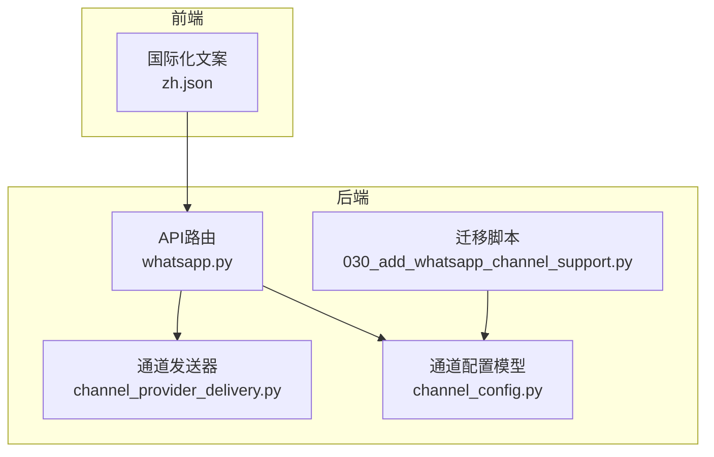
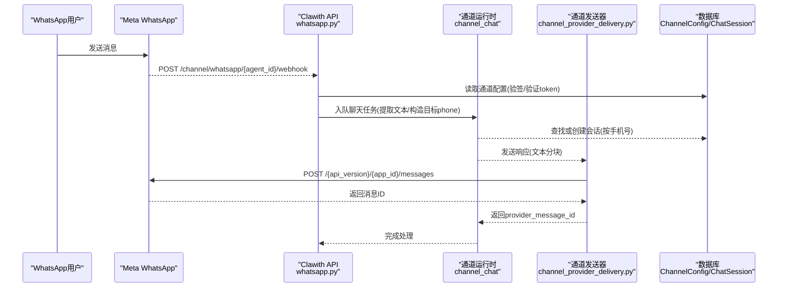
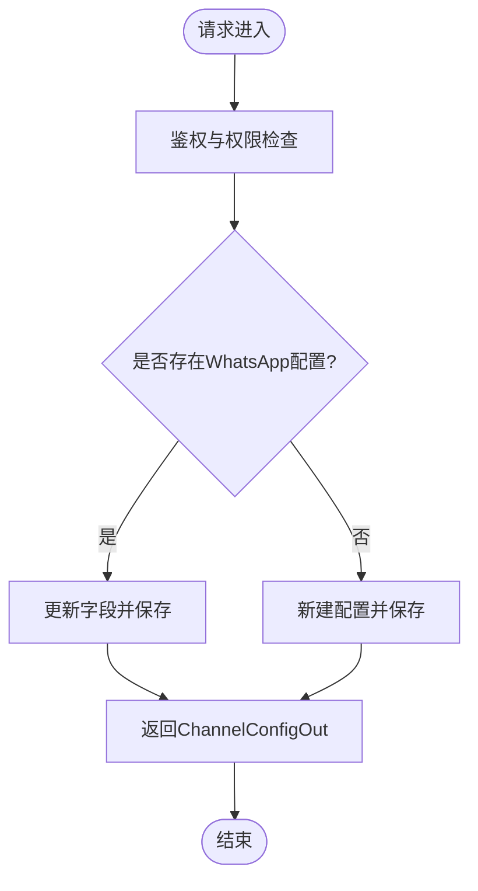
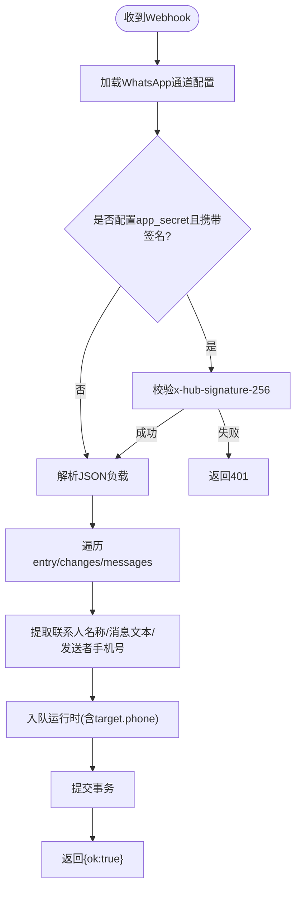
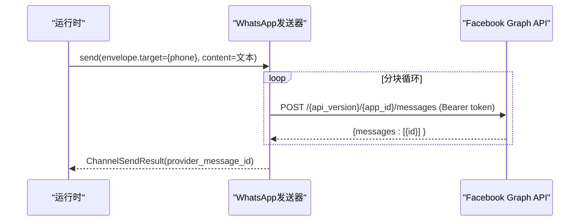
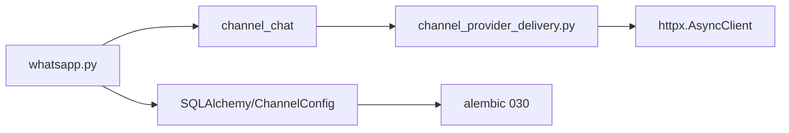

# WhatsApp集成API

<cite>
**本文引用的文件**   
- [backend/app/api/whatsapp.py](file://backend/app/api/whatsapp.py)
- [backend/app/services/agent_runtime/channel_provider_delivery.py](file://backend/app/services/agent_runtime/channel_provider_delivery.py)
- [backend/app/models/channel_config.py](file://backend/app/models/channel_config.py)
- [backend/alembic/versions/030_add_whatsapp_channel_support.py](file://backend/alembic/versions/030_add_whatsapp_channel_support.py)
- [backend/tests/test_http_channel_runtime.py](file://backend/tests/test_http_channel_runtime.py)
- [frontend/src/i18n/zh.json](file://frontend/src/i18n/zh.json)
</cite>

## 目录
1. [简介](#简介)
2. [项目结构](#项目结构)
3. [核心组件](#核心组件)
4. [架构总览](#架构总览)
5. [详细组件分析](#详细组件分析)
6. [依赖关系分析](#依赖关系分析)
7. [性能与可靠性](#性能与可靠性)
8. [故障排查指南](#故障排查指南)
9. [结论](#结论)
10. [附录：配置与合规清单](#附录配置与合规清单)

## 简介
本文件为Clawith平台的WhatsApp渠道集成提供面向开发与运维的API文档，覆盖以下能力：
- WhatsApp Business Cloud API认证与Webhook配置
- 入站消息接收与处理（文本、按钮、交互式回复）
- 出站消息发送（文本分块发送）
- 会话与会话持久化（按手机号映射会话）
- 平台侧配置项与前端引导文案
- 合规与安全建议（签名校验、版本控制、错误处理）

说明：当前实现聚焦于“文本”类型的收发与基础Webhook验证。模板消息、多媒体、位置分享、联系人管理等企业特性在现有代码中未直接实现，但可通过扩展通道发送器与Webhook解析进行增强。

## 项目结构
WhatsApp相关能力主要分布在后端API路由、通道发送器、数据模型与迁移脚本中，前端提供多语言引导文案。

图表来源
- [backend/app/api/whatsapp.py:1-264](file://backend/app/api/whatsapp.py#L1-L264)
- [backend/app/services/agent_runtime/channel_provider_delivery.py:320-359](file://backend/app/services/agent_runtime/channel_provider_delivery.py#L320-L359)
- [backend/app/models/channel_config.py:1-52](file://backend/app/models/channel_config.py#L1-L52)
- [backend/alembic/versions/030_add_whatsapp_channel_support.py:1-23](file://backend/alembic/versions/030_add_whatsapp_channel_support.py#L1-L23)
- [frontend/src/i18n/zh.json:2004-2007](file://frontend/src/i18n/zh.json#L2004-L2007)

章节来源
- [backend/app/api/whatsapp.py:1-264](file://backend/app/api/whatsapp.py#L1-L264)
- [backend/app/services/agent_runtime/channel_provider_delivery.py:320-359](file://backend/app/services/agent_runtime/channel_provider_delivery.py#L320-L359)
- [backend/app/models/channel_config.py:1-52](file://backend/app/models/channel_config.py#L1-L52)
- [backend/alembic/versions/030_add_whatsapp_channel_support.py:1-23](file://backend/alembic/versions/030_add_whatsapp_channel_support.py#L1-L23)
- [frontend/src/i18n/zh.json:2004-2007](file://frontend/src/i18n/zh.json#L2004-L2007)

## 核心组件
- WhatsApp通道配置API
  - 创建/更新通道配置：POST /agents/{agent_id}/whatsapp-channel
  - 查询通道配置：GET /agents/{agent_id}/whatsapp-channel
  - 删除通道配置：DELETE /agents/{agent_id}/whatsapp-channel
  - 获取Webhook URL：GET /agents/{agent_id}/whatsapp-channel/webhook-url
- Webhook事件处理
  - 订阅验证：GET /channel/whatsapp/{agent_id}/webhook?hub.mode=subscribe&...
  - 事件回调：POST /channel/whatsapp/{agent_id}/webhook
- 出站消息发送
  - 通过通道发送器调用WhatsApp Graph API发送文本消息（自动分块）

章节来源
- [backend/app/api/whatsapp.py:51-101](file://backend/app/api/whatsapp.py#L51-L101)
- [backend/app/api/whatsapp.py:104-128](file://backend/app/api/whatsapp.py#L104-L128)
- [backend/app/api/whatsapp.py:131-151](file://backend/app/api/whatsapp.py#L131-L151)
- [backend/app/api/whatsapp.py:153-173](file://backend/app/api/whatsapp.py#L153-L173)
- [backend/app/api/whatsapp.py:176-263](file://backend/app/api/whatsapp.py#L176-L263)
- [backend/app/services/agent_runtime/channel_provider_delivery.py:320-359](file://backend/app/services/agent_runtime/channel_provider_delivery.py#L320-L359)

## 架构总览
下图展示从用户到WhatsApp的端到端流程：入站消息经Meta Webhook到达平台，平台校验并转换为内部会话后进入运行时；出站消息由运行时通过通道发送器调用Graph API。

图表来源
- [backend/app/api/whatsapp.py:176-263](file://backend/app/api/whatsapp.py#L176-L263)
- [backend/app/services/agent_runtime/channel_provider_delivery.py:320-359](file://backend/app/services/agent_runtime/channel_provider_delivery.py#L320-L359)
- [backend/app/models/channel_config.py:13-52](file://backend/app/models/channel_config.py#L13-L52)

## 详细组件分析

### 通道配置API
- 功能要点
  - 支持设置access_token、phone_number_id、verify_token、可选app_secret用于X-Hub-Signature-256签名校验
  - 支持自定义api_version，默认v23.0
  - 唯一约束保证每个智能体仅一个WhatsApp通道配置
- 关键行为
  - 创建/更新：若已存在则覆盖敏感字段并标记is_configured=true
  - 查询：不存在时返回404
  - 删除：仅创建者可删除
  - 获取Webhook URL：基于平台公开基址拼接

图表来源
- [backend/app/api/whatsapp.py:51-101](file://backend/app/api/whatsapp.py#L51-L101)
- [backend/app/models/channel_config.py:13-52](file://backend/app/models/channel_config.py#L13-L52)

章节来源
- [backend/app/api/whatsapp.py:51-101](file://backend/app/api/whatsapp.py#L51-L101)
- [backend/app/models/channel_config.py:13-52](file://backend/app/models/channel_config.py#L13-L52)

### Webhook订阅验证与事件处理
- 订阅验证
  - GET /channel/whatsapp/{agent_id}/webhook
  - 校验hub.verify_token与存储的verification_token一致后返回challenge
- 事件处理
  - POST /channel/whatsapp/{agent_id}/webhook
  - 可选X-Hub-Signature-256签名校验（当配置了app_secret时启用）
  - 解析entry/changes/value中的contacts与messages
  - 提取文本内容（支持text/button/interactive类型）
  - 构建channel_delivery_target={"phone": sender_phone}
  - 入队运行时处理，生成或复用会话

图表来源
- [backend/app/api/whatsapp.py:153-173](file://backend/app/api/whatsapp.py#L153-L173)
- [backend/app/api/whatsapp.py:176-263](file://backend/app/api/whatsapp.py#L176-L263)

章节来源
- [backend/app/api/whatsapp.py:153-173](file://backend/app/api/whatsapp.py#L153-L173)
- [backend/app/api/whatsapp.py:176-263](file://backend/app/api/whatsapp.py#L176-L263)

### 出站消息发送（文本）
- 实现方式
  - 通过HTTP客户端调用WhatsApp Graph API
  - 对长文本进行分块（约4096字节），逐块发送
  - 使用Bearer Token鉴权，messaging_product="whatsapp"
  - 收集provider消息ID并返回
- 错误处理
  - 非2xx状态码触发统一错误处理逻辑

图表来源
- [backend/app/services/agent_runtime/channel_provider_delivery.py:320-359](file://backend/app/services/agent_runtime/channel_provider_delivery.py#L320-L359)

章节来源
- [backend/app/services/agent_runtime/channel_provider_delivery.py:320-359](file://backend/app/services/agent_runtime/channel_provider_delivery.py#L320-L359)

### 会话与会话持久化
- 会话键：source_channel="whatsapp" + external_conv_id="whatsapp_{phone}"
- 行为：首次入站消息创建会话，后续复用；支持群聊与私聊区分（当前为私聊）
- 安全：租户隔离、参与者身份绑定、并发锁避免重复创建

章节来源
- [backend/app/api/whatsapp.py:225-242](file://backend/app/api/whatsapp.py#L225-L242)
- [backend/app/services/channel_session.py:24-184](file://backend/app/services/channel_session.py#L24-L184)

### 数据模型与迁移
- ChannelConfig
  - 关键字段：agent_id、channel_type、app_id(phone_number_id)、app_secret(access_token)、verification_token、encrypt_key(app_secret)、extra_config(api_version)
  - 唯一约束：(agent_id, channel_type)
- 迁移
  - 将channel_type_enum新增值'whatsapp'

章节来源
- [backend/app/models/channel_config.py:13-52](file://backend/app/models/channel_config.py#L13-L52)
- [backend/alembic/versions/030_add_whatsapp_channel_support.py:17-18](file://backend/alembic/versions/030_add_whatsapp_channel_support.py#L17-L18)

### 前端引导与多语言
- 中文引导步骤包含：填写Verify Token、可选App Secret、粘贴Webhook URL、订阅message webhook等

章节来源
- [frontend/src/i18n/zh.json:2004-2007](file://frontend/src/i18n/zh.json#L2004-L2007)

## 依赖关系分析
- API层依赖
  - 权限与用户：get_current_user、check_agent_access、is_agent_creator
  - 数据库：AsyncSession、select、ChannelConfig
  - 运行时：enqueue_channel_chat_runtime、channel_message_id
- 发送器依赖
  - HTTP客户端：httpx.AsyncClient
  - 错误处理：_provider_error
- 模型与迁移
  - ChannelConfig枚举扩展、唯一约束

图表来源
- [backend/app/api/whatsapp.py:1-264](file://backend/app/api/whatsapp.py#L1-L264)
- [backend/app/services/agent_runtime/channel_provider_delivery.py:320-359](file://backend/app/services/agent_runtime/channel_provider_delivery.py#L320-L359)
- [backend/alembic/versions/030_add_whatsapp_channel_support.py:1-23](file://backend/alembic/versions/030_add_whatsapp_channel_support.py#L1-L23)

章节来源
- [backend/app/api/whatsapp.py:1-264](file://backend/app/api/whatsapp.py#L1-L264)
- [backend/app/services/agent_runtime/channel_provider_delivery.py:320-359](file://backend/app/services/agent_runtime/channel_provider_delivery.py#L320-L359)
- [backend/alembic/versions/030_add_whatsapp_channel_support.py:1-23](file://backend/alembic/versions/030_add_whatsapp_channel_support.py#L1-L23)

## 性能与可靠性
- 文本分块发送
  - 按约4096字节切分，避免单次过大payload导致超时或被限流
- 超时与重试
  - 当前HTTP客户端超时20秒；建议在外部队列层增加幂等与重试策略
- 并发与会话
  - 使用数据库级锁避免重复创建会话；确保高并发下一致性
- 速率限制
  - 遵循WhatsApp Business Platform配额；必要时引入令牌桶或背压机制
- 日志与可观测性
  - 记录provider_message_id、错误码与响应摘要，便于追踪

[本节为通用指导，不直接分析具体文件]

## 故障排查指南
- Webhook验证失败
  - 检查hub.verify_token是否与配置的verification_token一致
  - 确认Webhook URL正确且可达
- 签名校验失败
  - 如启用X-Hub-Signature-256，需确保配置了app_secret且Meta发送的请求头包含正确签名
- 配置缺失
  - access_token、phone_number_id、verify_token为必填；缺少任一将返回422
- 会话创建异常
  - 检查租户与用户有效性、external_conv_id长度与格式
- 发送失败
  - 检查Graph API返回码与错误信息；确认app_id与app_secret有效

章节来源
- [backend/app/api/whatsapp.py:68-70](file://backend/app/api/whatsapp.py#L68-L70)
- [backend/app/api/whatsapp.py:171-173](file://backend/app/api/whatsapp.py#L171-L173)
- [backend/app/api/whatsapp.py:193-196](file://backend/app/api/whatsapp.py#L193-L196)
- [backend/app/services/channel_session.py:45-56](file://backend/app/services/channel_session.py#L45-L56)
- [backend/app/services/agent_runtime/channel_provider_delivery.py:327-331](file://backend/app/services/agent_runtime/channel_provider_delivery.py#L327-L331)

## 结论
当前WhatsApp渠道集成实现了基础的认证、Webhook验证与文本收发能力，并通过统一的会话模型与运行时接入平台。未来可扩展模板消息、多媒体、位置与联系人管理等功能，同时完善错误处理与监控告警，提升稳定性与可观测性。

[本节为总结，不直接分析具体文件]

## 附录：配置与合规清单
- 必要配置项
  - access_token：WhatsApp Business Access Token
  - phone_number_id：WhatsApp电话号码ID
  - verify_token：Webhook验证Token
  - app_secret（可选）：用于X-Hub-Signature-256签名校验
  - api_version（可选）：Graph API版本，默认v23.0
- 合规与安全
  - 启用签名校验以保障Webhook来源可信
  - 遵守WhatsApp业务政策与消息模板审核要求（模板能力待扩展）
  - 最小权限原则：仅授予必要的API访问范围
- 部署与网络
  - 确保平台对外暴露的Webhook URL可达
  - 合理设置超时与重试策略，避免雪崩

章节来源
- [backend/app/api/whatsapp.py:62-71](file://backend/app/api/whatsapp.py#L62-L71)
- [backend/app/api/whatsapp.py:193-196](file://backend/app/api/whatsapp.py#L193-L196)
- [frontend/src/i18n/zh.json:2004-2007](file://frontend/src/i18n/zh.json#L2004-L2007)