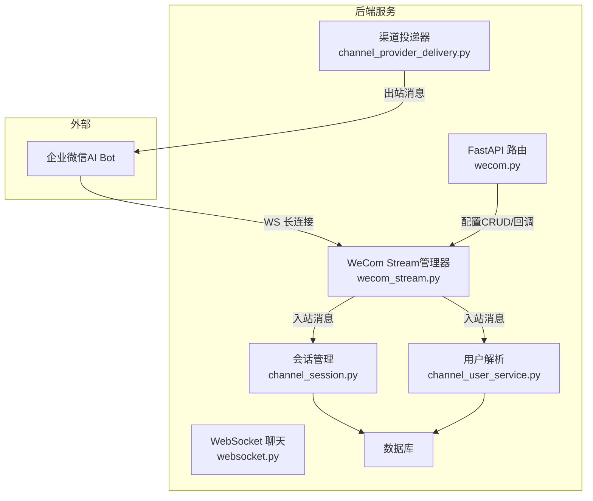
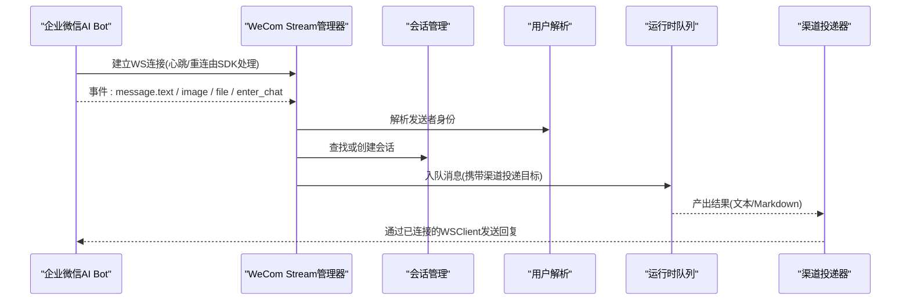
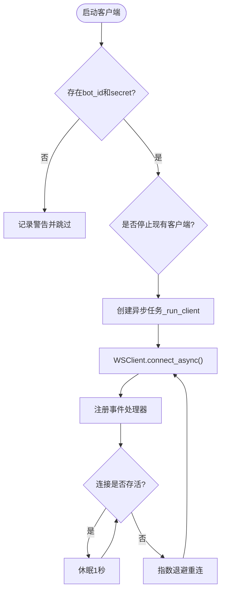
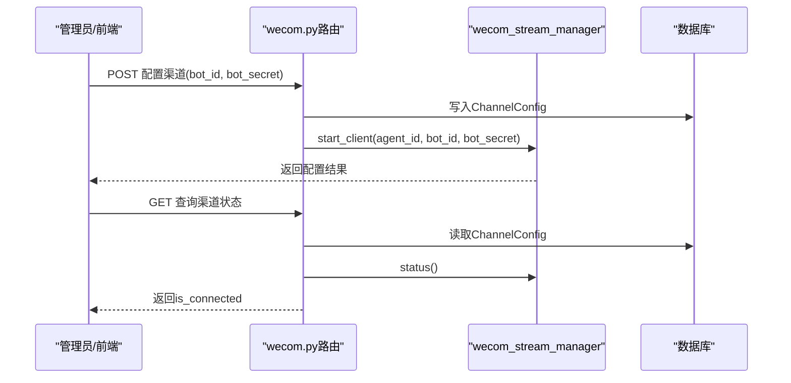
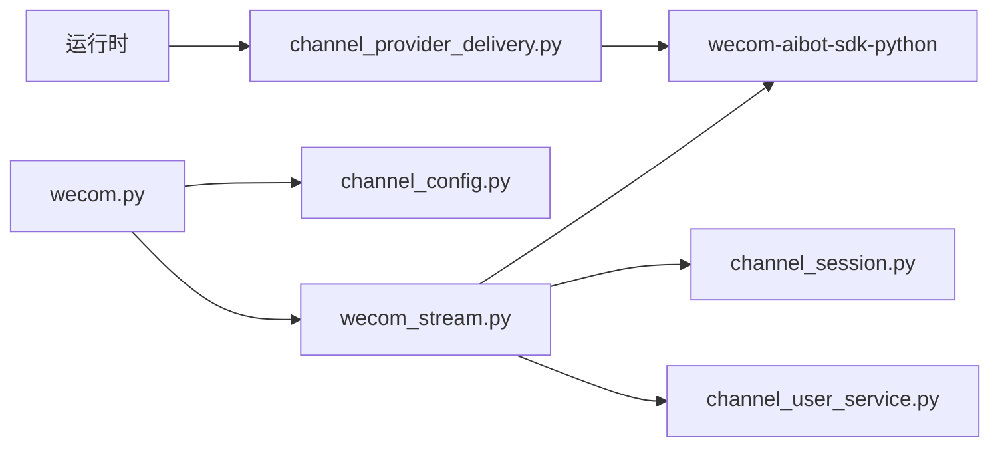

# Stream实时通信API

<cite>
**本文引用的文件**
- [backend/app/services/wecom_stream.py](file://backend/app/services/wecom_stream.py)
- [backend/app/api/wecom.py](file://backend/app/api/wecom.py)
- [backend/app/services/channel_session.py](file://backend/app/services/channel_session.py)
- [backend/app/services/channel_user_service.py](file://backend/app/services/channel_user_service.py)
- [backend/app/models/channel_config.py](file://backend/app/models/channel_config.py)
- [backend/app/api/websocket.py](file://backend/app/api/websocket.py)
- [backend/app/services/agent_runtime/channel_provider_delivery.py](file://backend/app/services/agent_runtime/channel_provider_delivery.py)
- [backend/app/core/error_contract.py](file://backend/app/core/error_contract.py)
</cite>

## 目录
1. [简介](#简介)
2. [项目结构](#项目结构)
3. [核心组件](#核心组件)
4. [架构总览](#架构总览)
5. [详细组件分析](#详细组件分析)
6. [依赖关系分析](#依赖关系分析)
7. [性能考量](#性能考量)
8. [故障排查指南](#故障排查指南)
9. [结论](#结论)
10. [附录](#附录)

## 简介
本文件为企业微信（WeCom）Stream 实时通信的 API 与实现文档，聚焦以下目标：
- WebSocket 连接建立、消息推送、心跳保持等核心流程
- Stream 模式的优势、连接管理与错误恢复机制
- 客户端 SDK 使用指南（基于 wecom-aibot-sdk-python）
- 消息格式定义与投递约定
- 性能优化建议、实时监控与调试工具
- 常见问题解决方案

## 项目结构
本项目在后端通过 FastAPI 暴露 WeCom 渠道配置与回调接口，并通过独立的 Stream Manager 维护企业微信 AI Bot 的 WebSocket 长连接。消息入站经统一通道解析后进入运行时队列，结果通过持久化投递器回写到企业微信。

图表来源
- [backend/app/api/wecom.py](file://backend/app/api/wecom.py)
- [backend/app/services/wecom_stream.py](file://backend/app/services/wecom_stream.py)
- [backend/app/services/channel_session.py](file://backend/app/services/channel_session.py)
- [backend/app/services/channel_user_service.py](file://backend/app/services/channel_user_service.py)
- [backend/app/services/agent_runtime/channel_provider_delivery.py](file://backend/app/services/agent_runtime/channel_provider_delivery.py)

章节来源
- [backend/app/api/wecom.py](file://backend/app/api/wecom.py)
- [backend/app/services/wecom_stream.py](file://backend/app/services/wecom_stream.py)
- [backend/app/models/channel_config.py](file://backend/app/models/channel_config.py)

## 核心组件
- WeCom Stream 管理器：负责为每个 Agent 启动并维护一个 WSClient，处理文本/图片/文件事件与进群欢迎事件，内置重连与心跳。
- WeCom API 路由：提供渠道配置 CRUD、Webhook 验证与回调（兼容旧版）、以及域名校验文件托管。
- 会话与用户解析：将外部对话映射到内部 ChatSession，并将外部用户解析为平台用户。
- 渠道投递器：将运行时的回复结果按渠道类型投递到企业微信。
- WebSocket 聊天：用于前端实时交互，非企业微信 Stream 的直接入口，但体现系统内统一的流式能力。

章节来源
- [backend/app/services/wecom_stream.py](file://backend/app/services/wecom_stream.py)
- [backend/app/api/wecom.py](file://backend/app/api/wecom.py)
- [backend/app/services/channel_session.py](file://backend/app/services/channel_session.py)
- [backend/app/services/channel_user_service.py](file://backend/app/services/channel_user_service.py)
- [backend/app/services/agent_runtime/channel_provider_delivery.py](file://backend/app/services/agent_runtime/channel_provider_delivery.py)
- [backend/app/api/websocket.py](file://backend/app/api/websocket.py)

## 架构总览
企业微信 Stream 采用“长连接 + 事件驱动”的架构：
- 连接层：WSClient 维持与企业的长连接，SDK 负责心跳与自动重连。
- 事件层：文本、图片、文件、进群事件分别由独立处理器接收。
- 业务层：消息被标准化后入队至运行时，生成会话与用户上下文。
- 投递层：运行结果通过持久化投递器回写企业微信。

图表来源
- [backend/app/services/wecom_stream.py](file://backend/app/services/wecom_stream.py)
- [backend/app/services/channel_session.py](file://backend/app/services/channel_session.py)
- [backend/app/services/channel_user_service.py](file://backend/app/services/channel_user_service.py)
- [backend/app/services/agent_runtime/channel_provider_delivery.py](file://backend/app/services/agent_runtime/channel_provider_delivery.py)

## 详细组件分析

### WeCom Stream 管理器（wecom_stream.py）
职责
- 为每个 Agent 启动 WSClient，注册事件处理器（文本、图片、文件、进群）。
- 处理消息体字段差异，提取 sender_id、chat_type、chat_id、message_id。
- 调用运行时入队，等待结果并通过同一 WSClient 回复。
- 管理连接状态、任务生命周期、异常捕获与指数退避重连。

关键行为
- 连接参数：bot_id、secret、max_reconnect_attempts=-1（无限重连）、heartbeat_interval=30s。
- 事件处理：文本消息走 _process_wecom_stream_message；图片/文件暂返回不支持提示；进群事件发送欢迎语。
- 主动推送：send_message 通过当前已连接的 WSClient 发送 Markdown 消息。
- 批量启动：start_all 扫描已配置的 WeCom 渠道并启动对应 WSClient。

图表来源
- [backend/app/services/wecom_stream.py](file://backend/app/services/wecom_stream.py)

章节来源
- [backend/app/services/wecom_stream.py](file://backend/app/services/wecom_stream.py)

### WeCom API 路由（wecom.py）
职责
- 渠道配置 CRUD：支持 WebSocket 模式（AI Bot）与 Webhook 模式（兼容旧版）。
- Webhook 验证与回调：GET 验证签名与解密 echostr；POST 解密 XML 并分发事件。
- 域名校验文件托管：多租户场景下按 token 返回校验文件内容。
- OAuth 回调：企业微信 SSO 登录流程。

关键接口
- POST /agents/{agent_id}/wecom-channel：配置渠道（WebSocket 或 Webhook），成功后触发 WSClient 启动/停止。
- GET /agents/{agent_id}/wecom-channel：查询渠道配置与连接状态。
- GET /agents/{agent_id}/wecom-channel/webhook-url：获取 Webhook 回调地址。
- DELETE /agents/{agent_id}/wecom-channel：删除渠道配置并停止 WSClient。
- GET /wecom-verify/{filename}：返回域名校验文件内容。
- GET /channel/wecom/{agent_id}/webhook：Webhook 验证。
- POST /channel/wecom/{agent_id}/webhook：接收加密 XML 事件，解析并入队。

图表来源
- [backend/app/api/wecom.py](file://backend/app/api/wecom.py)
- [backend/app/services/wecom_stream.py](file://backend/app/services/wecom_stream.py)
- [backend/app/models/channel_config.py](file://backend/app/models/channel_config.py)

章节来源
- [backend/app/api/wecom.py](file://backend/app/api/wecom.py)
- [backend/app/models/channel_config.py](file://backend/app/models/channel_config.py)

### 会话与用户解析（channel_session.py, channel_user_service.py）
职责
- find_or_create_channel_session：根据 (agent_id, external_conv_id) 查找或创建 ChatSession，区分群聊与私聊，保证租户隔离与幂等。
- resolve_channel_user：将外部用户标识解析为平台用户，支持 OrgMember 关联、邮箱/手机号匹配、懒注册新用户。

关键点
- 群聊会话 user_id 指向 Agent 创建者占位，避免混入用户列表。
- 使用 advisory lock 保证并发安全。
- WeCom 以 external_id（userid）为主键进行 OrgMember 匹配。

章节来源
- [backend/app/services/channel_session.py](file://backend/app/services/channel_session.py)
- [backend/app/services/channel_user_service.py](file://backend/app/services/channel_user_service.py)

### 渠道投递器（channel_provider_delivery.py）
职责
- 根据 Run 的 delivery_target 选择对应渠道处理器（feishu/dingtalk/wecom/wechat/whatsapp/slack/discord/microsoft_teams）。
- 对 WeCom 的投递封装在 _wecom 处理器中，结合配置与目标参数完成发送。
- 失败重试与幂等性控制，确保最终一致性。

章节来源
- [backend/app/services/agent_runtime/channel_provider_delivery.py](file://backend/app/services/agent_runtime/channel_provider_delivery.py)

### WebSocket 聊天（websocket.py）
说明
- 该模块提供前端与 Agent 的实时聊天能力，体现系统的流式处理能力与跨实例路由。
- 与企业微信 Stream 不同，它是平台内 Web 端的实时通道，不直接用于企业微信消息收发。

章节来源
- [backend/app/api/websocket.py](file://backend/app/api/websocket.py)

## 依赖关系分析
- WeCom Stream 管理器依赖 wecom-aibot-sdk-python 提供的 WSClient，负责底层连接与心跳。
- API 路由依赖 ChannelConfig 模型存储渠道配置，并在配置变更后触发 Stream 管理器动作。
- 会话与用户解析依赖数据库模型与 SSO 服务，确保租户隔离与身份一致。
- 渠道投递器依赖运行时产物与配置，按渠道类型分派发送逻辑。

图表来源
- [backend/app/services/wecom_stream.py](file://backend/app/services/wecom_stream.py)
- [backend/app/api/wecom.py](file://backend/app/api/wecom.py)
- [backend/app/models/channel_config.py](file://backend/app/models/channel_config.py)
- [backend/app/services/channel_session.py](file://backend/app/services/channel_session.py)
- [backend/app/services/channel_user_service.py](file://backend/app/services/channel_user_service.py)
- [backend/app/services/agent_runtime/channel_provider_delivery.py](file://backend/app/services/agent_runtime/channel_provider_delivery.py)

章节来源
- [backend/app/services/wecom_stream.py](file://backend/app/services/wecom_stream.py)
- [backend/app/api/wecom.py](file://backend/app/api/wecom.py)
- [backend/app/models/channel_config.py](file://backend/app/models/channel_config.py)
- [backend/app/services/channel_session.py](file://backend/app/services/channel_session.py)
- [backend/app/services/channel_user_service.py](file://backend/app/services/channel_user_service.py)
- [backend/app/services/agent_runtime/channel_provider_delivery.py](file://backend/app/services/agent_runtime/channel_provider_delivery.py)

## 性能考量
- 连接复用：每个 Agent 仅维护一个 WSClient，减少连接开销。
- 心跳与重连：SDK 默认 30s 心跳，断线指数退避重连，最大间隔 120s。
- 事件处理解耦：入站事件快速入队，避免阻塞 WS 事件循环。
- 会话与用户解析：使用 advisory lock 与唯一约束避免重复创建与冲突。
- 投递幂等：投递器使用 idempotency_key 与重试策略，保障最终一致。
- 日志与追踪：统一错误对象包含 trace_id、run_id、agent_id、stage，便于定位问题。

[本节为通用指导，无需引用具体文件]

## 故障排查指南
常见症状与处理
- 无法建立连接
  - 检查 bot_id 与 bot_secret 是否正确配置。
  - 确认网络代理设置，SDK 已强制绕过系统代理。
  - 查看日志中的连接错误与重退避信息。
- 消息未收到或未回复
  - 确认事件处理器是否注册成功（text/image/file/enter_chat）。
  - 检查会话与用户解析是否成功，是否存在租户范围不匹配。
  - 查看运行时队列是否入队成功，投递器是否成功发送。
- 频繁断线
  - 关注 SDK 心跳与重连日志，确认服务端资源与网络稳定性。
  - 检查是否有异常导致 WSClient 断开。
- 错误响应
  - 统一错误对象包含 code、message、trace_id、run_id、agent_id、stage，便于检索。
  - 对于 HTTP 异常，错误处理器会注入 X-Trace-Id 头。

章节来源
- [backend/app/core/error_contract.py](file://backend/app/core/error_contract.py)
- [backend/app/services/wecom_stream.py](file://backend/app/services/wecom_stream.py)
- [backend/app/api/wecom.py](file://backend/app/api/wecom.py)

## 结论
企业微信 Stream 实时通信通过长连接与事件驱动实现了低延迟、高可靠的即时消息能力。系统在连接管理、消息解析、会话与用户映射、运行时入队与渠道投递等方面形成了完整闭环。配合统一错误对象与日志追踪，可高效定位与解决问题。建议在部署时关注网络代理、心跳与重连策略，以及投递器的幂等性与重试配置，以获得最佳性能与稳定性。

[本节为总结，无需引用具体文件]

## 附录

### 客户端 SDK 使用指南（wecom-aibot-sdk-python）
- 安装：pip install wecom-aibot-sdk-python
- 初始化 WSClient：传入 bot_id、secret、max_reconnect_attempts=-1、heartbeat_interval=30000。
- 事件监听：注册 message.text、message.image、message.file、event.enter_chat 处理器。
- 回复消息：使用 reply_stream 或 send_message 通过已连接客户端发送。
- 连接状态：通过 is_connected 判断连接状态，异常时自动重连。

章节来源
- [backend/app/services/wecom_stream.py](file://backend/app/services/wecom_stream.py)

### 消息格式定义
- 入站文本消息体关键字段：from/userid/from_userid、chattype/chat_type、chatid/chat_id、msgid/msg_id/message_id、text.content。
- 出站回复：通过 reply_stream 或 send_message 发送 Markdown 或文本。
- 进群事件：event.enter_chat，发送欢迎语。

章节来源
- [backend/app/services/wecom_stream.py](file://backend/app/services/wecom_stream.py)

### 监控与调试
- 日志级别：启用 loguru 详细日志，关注 “[WeCom Stream]” 前缀。
- 追踪ID：统一错误对象包含 trace_id，HTTP 响应头 X-Trace-Id。
- 连接状态：通过 wecom_stream_manager.status() 获取各 Agent 连接状态。
- 渠道配置：通过 API 查询渠道配置与 is_connected 标志。

章节来源
- [backend/app/api/wecom.py](file://backend/app/api/wecom.py)
- [backend/app/services/wecom_stream.py](file://backend/app/services/wecom_stream.py)
- [backend/app/core/error_contract.py](file://backend/app/core/error_contract.py)