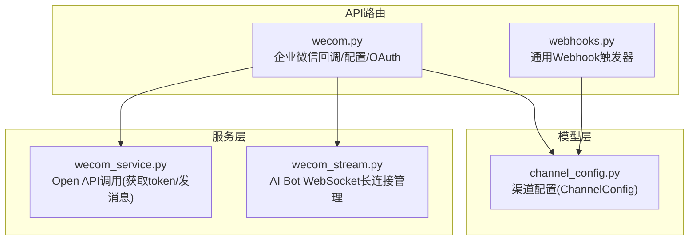
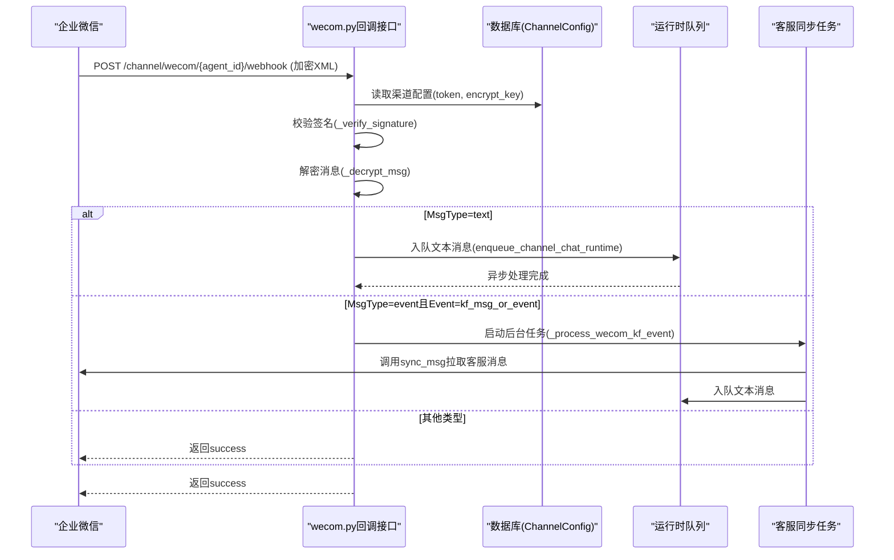
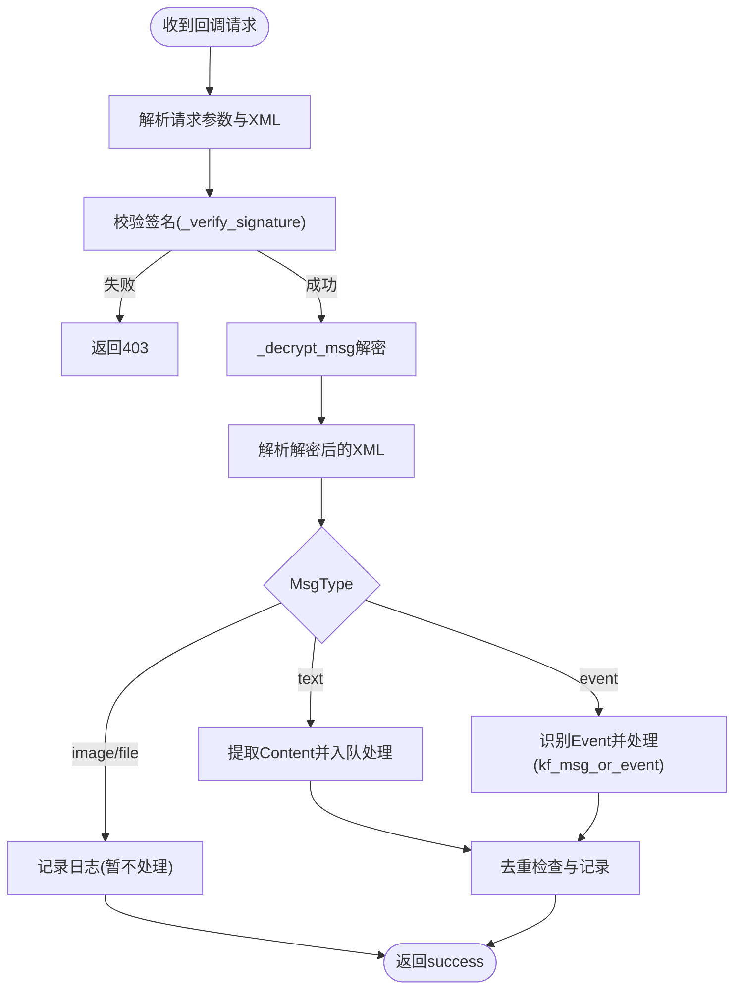
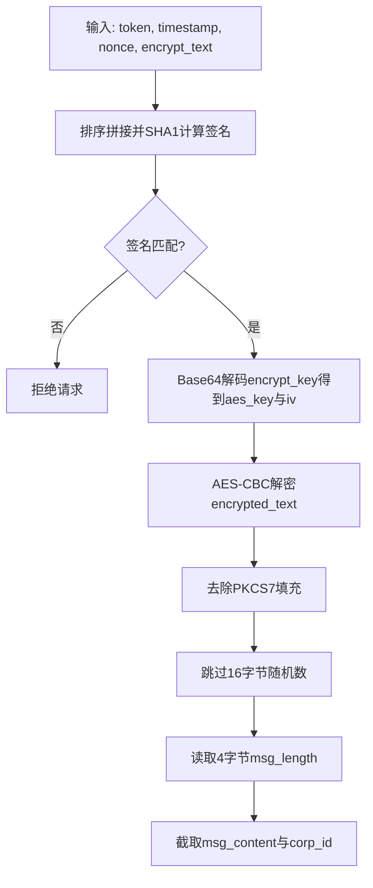
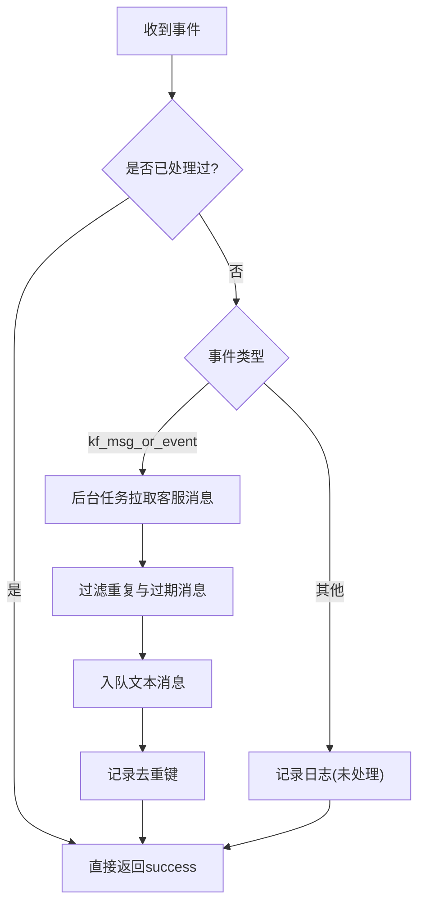
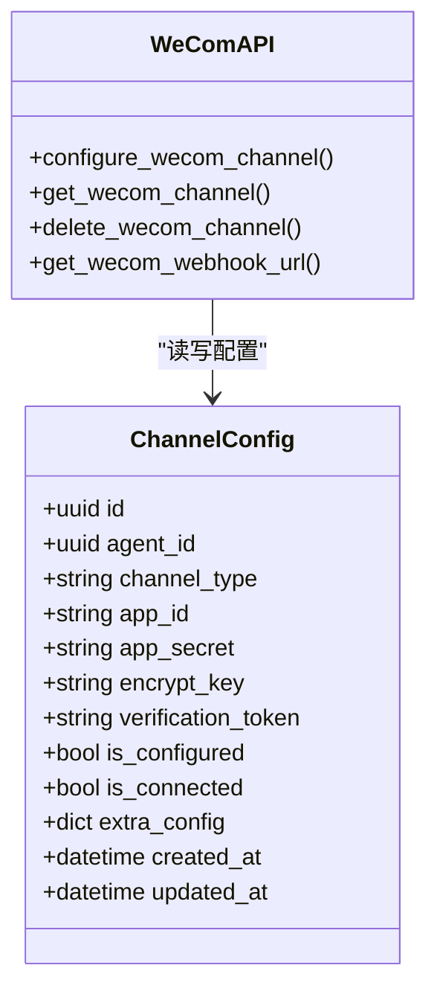
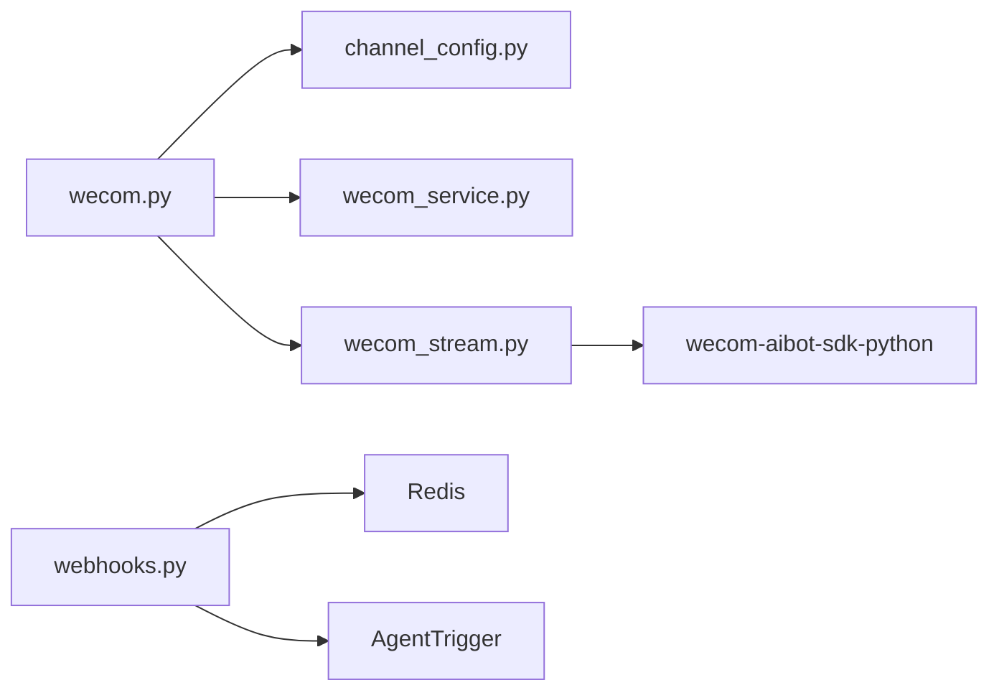

# Webhook消息回调API

<cite>
**本文引用的文件**   
- [wecom.py](file://backend/app/api/wecom.py)
- [wecom_service.py](file://backend/app/services/wecom_service.py)
- [wecom_stream.py](file://backend/app/services/wecom_stream.py)
- [channel_config.py](file://backend/app/models/channel_config.py)
- [webhooks.py](file://backend/app/api/webhooks.py)
</cite>

## 目录
1. [简介](#简介)
2. [项目结构](#项目结构)
3. [核心组件](#核心组件)
4. [架构总览](#架构总览)
5. [详细组件分析](#详细组件分析)
6. [依赖关系分析](#依赖关系分析)
7. [性能考虑](#性能考虑)
8. [故障排查指南](#故障排查指南)
9. [结论](#结论)
10. [附录](#附录)

## 简介
本文件为企业微信（WeCom）Webhook消息回调的API文档，覆盖以下关键能力：
- 消息接收与解密验证（AES-CBC、签名校验）
- 事件处理（文本、事件、客服消息）
- 安全设置（回调URL配置、域名校验、签名机制）
- 消息去重策略（内存集合+限流清理）
- WebSocket长连接模式（AI Bot）作为补充通道
- 通用Webhook触发器接口（非企业微信）

## 项目结构
与企业微信Webhook相关的后端代码主要分布在以下模块：
- API路由层：定义Webhook回调、配置管理、OAuth回调等接口
- 服务层：封装企业微信Open API调用、WebSocket长连接管理
- 模型层：渠道配置持久化（ChannelConfig）
- 通用Webhook：面向外部系统的触发器入口（非企业微信）

图表来源
- [wecom.py:1-691](file://backend/app/api/wecom.py#L1-L691)
- [wecom_service.py:1-87](file://backend/app/services/wecom_service.py#L1-L87)
- [wecom_stream.py:1-430](file://backend/app/services/wecom_stream.py#L1-L430)
- [channel_config.py:1-52](file://backend/app/models/channel_config.py#L1-L52)
- [webhooks.py:1-183](file://backend/app/api/webhooks.py#L1-L183)

章节来源
- [wecom.py:1-691](file://backend/app/api/wecom.py#L1-L691)
- [wecom_service.py:1-87](file://backend/app/services/wecom_service.py#L1-L87)
- [wecom_stream.py:1-430](file://backend/app/services/wecom_stream.py#L1-L430)
- [channel_config.py:1-52](file://backend/app/models/channel_config.py#L1-L52)
- [webhooks.py:1-183](file://backend/app/api/webhooks.py#L1-L183)

## 核心组件
- 企业微信Webhook回调接口
  - GET /api/channel/wecom/{agent_id}/webhook：回调URL验证（echostr解密返回）
  - POST /api/channel/wecom/{agent_id}/webhook：加密XML消息接收与处理
- AES加解密与签名校验
  - AES-CBC解密/加密（PKCS7填充），SHA1签名校验
- 事件处理
  - 文本消息：解析Content并进入运行时队列
  - 事件消息：kf_msg_or_event触发客服消息同步
  - 图片/文件：预留扩展点
- 渠道配置管理
  - 支持两种模式：WebSocket（AI Bot）与Webhook（传统回调）
  - 提供查询/创建/删除渠道配置的REST接口
- OAuth回调（SSO）
  - /api/auth/wecom/callback：企业微信授权登录流程

章节来源
- [wecom.py:309-451](file://backend/app/api/wecom.py#L309-L451)
- [wecom.py:453-518](file://backend/app/api/wecom.py#L453-L518)
- [wecom.py:520-602](file://backend/app/api/wecom.py#L520-L602)
- [wecom.py:153-242](file://backend/app/api/wecom.py#L153-L242)
- [wecom.py:606-691](file://backend/app/api/wecom.py#L606-L691)

## 架构总览
企业微信消息回调的整体流程如下：
- 企业微信将加密XML POST到回调URL
- 服务端校验签名、解密消息体
- 根据MsgType分发处理（文本/事件/媒体）
- 文本消息入队至运行时，异步生成回复并通过渠道投递
- 客服事件通过后台任务拉取并处理

图表来源
- [wecom.py:347-451](file://backend/app/api/wecom.py#L347-L451)
- [wecom.py:453-518](file://backend/app/api/wecom.py#L453-L518)

## 详细组件分析

### 企业微信Webhook回调接口
- 回调URL验证（GET）
  - 参数：msg_signature、timestamp、nonce、echostr
  - 逻辑：校验签名后解密echostr并返回明文
- 消息接收（POST）
  - 参数：msg_signature、timestamp、nonce；请求体为加密XML
  - 逻辑：解析Encrypt字段→校验签名→解密XML→按MsgType分发

图表来源
- [wecom.py:347-451](file://backend/app/api/wecom.py#L347-L451)

章节来源
- [wecom.py:309-345](file://backend/app/api/wecom.py#L309-L345)
- [wecom.py:347-451](file://backend/app/api/wecom.py#L347-L451)

### AES加解密与签名校验
- 签名校验
  - 使用token、timestamp、nonce、encrypt_text排序拼接后SHA1计算签名
- 解密流程
  - Base64解码encrypt_key得到AES密钥与IV
  - AES-CBC解密，去除PKCS7填充
  - 跳过16字节随机数，读取4字节网络序长度，截取消息体与corp_id
- 加密流程
  - 构造buf=随机16字节+长度+消息体+corp_id
  - PKCS7填充后AES-CBC加密，Base64编码

图表来源
- [wecom.py:87-91](file://backend/app/api/wecom.py#L87-L91)
- [wecom.py:60-74](file://backend/app/api/wecom.py#L60-L74)
- [wecom.py:76-85](file://backend/app/api/wecom.py#L76-L85)

章节来源
- [wecom.py:87-91](file://backend/app/api/wecom.py#L87-L91)
- [wecom.py:60-74](file://backend/app/api/wecom.py#L60-L74)
- [wecom.py:76-85](file://backend/app/api/wecom.py#L76-L85)

### 事件处理与消息去重
- 文本消息处理
  - 解析FromUserName、MsgId、ChatId等字段
  - 构建会话上下文并入队运行时处理
- 事件消息处理
  - kf_msg_or_event触发后台任务，循环调用sync_msg拉取客服消息
  - 过滤历史与过期消息，仅处理最近24小时文本消息
- 去重策略
  - 使用内存集合存储已处理的msg_id或token
  - 超过阈值时自动清理集合，防止内存增长

图表来源
- [wecom.py:410-451](file://backend/app/api/wecom.py#L410-L451)
- [wecom.py:453-518](file://backend/app/api/wecom.py#L453-L518)

章节来源
- [wecom.py:410-451](file://backend/app/api/wecom.py#L410-L451)
- [wecom.py:453-518](file://backend/app/api/wecom.py#L453-L518)

### 渠道配置管理
- 支持两种接入模式：
  - WebSocket（AI Bot）：仅需bot_id与bot_secret，无需回调URL
  - Webhook（传统）：需要corp_id、secret、token、encoding_aes_key
- 配置CRUD接口：
  - POST /agents/{agent_id}/wecom-channel：创建或更新配置
  - GET /agents/{agent_id}/wecom-channel：查询配置与连接状态
  - DELETE /agents/{agent_id}/wecom-channel：删除配置
- 回调URL生成：
  - GET /agents/{agent_id}/wecom-channel/webhook-url：动态生成回调地址

图表来源
- [channel_config.py:13-52](file://backend/app/models/channel_config.py#L13-L52)
- [wecom.py:153-242](file://backend/app/api/wecom.py#L153-L242)

章节来源
- [wecom.py:153-242](file://backend/app/api/wecom.py#L153-L242)
- [channel_config.py:13-52](file://backend/app/models/channel_config.py#L13-L52)

### OAuth回调（SSO）
- 回调路径：/api/auth/wecom/callback
- 流程：
  - 根据state解析租户上下文
  - 获取企业微信provider配置
  - 交换code为access_token并获取用户信息
  - 查找或创建用户，生成访问令牌
  - 支持SSO跳转完成流程

章节来源
- [wecom.py:606-691](file://backend/app/api/wecom.py#L606-L691)

### 通用Webhook触发器（非企业微信）
- 路径：/api/webhooks/t/{token}
- 功能：接收外部系统事件，触发对应Agent执行
- 安全机制：
  - 唯一不可猜测的token
  - 可选HMAC签名验证（x-hub-signature-256）
  - 速率限制（每分钟5次/令牌，硬上限60次）
  - 负载大小限制（64KB）

章节来源
- [webhooks.py:1-183](file://backend/app/api/webhooks.py#L1-L183)

## 依赖关系分析
- wecom.py依赖：
  - channel_config.py：读取渠道配置
  - wecom_service.py：获取access_token、发送消息
  - wecom_stream.py：WebSocket长连接管理
- wecom_stream.py依赖：
  - wecom-aibot-sdk-python：WebSocket客户端库
- webhooks.py依赖：
  - Redis：速率限制计数
  - AgentTrigger模型：触发器配置

图表来源
- [wecom.py:1-691](file://backend/app/api/wecom.py#L1-L691)
- [wecom_stream.py:1-430](file://backend/app/services/wecom_stream.py#L1-L430)
- [webhooks.py:1-183](file://backend/app/api/webhooks.py#L1-L183)

章节来源
- [wecom.py:1-691](file://backend/app/api/wecom.py#L1-L691)
- [wecom_stream.py:1-430](file://backend/app/services/wecom_stream.py#L1-L430)
- [webhooks.py:1-183](file://backend/app/api/webhooks.py#L1-L183)

## 性能考虑
- 内存去重集合：
  - 使用全局set存储已处理消息ID，超过1000条时自动清理
  - 建议在生产环境替换为分布式缓存（如Redis）以支持多实例部署
- 异步处理：
  - 文本消息入队异步处理，避免阻塞回调响应
  - 客服消息同步在后台任务中执行，减少主线程压力
- 连接管理：
  - WebSocket连接采用指数退避重试，最大延迟120秒
  - 心跳间隔30秒，确保连接存活

## 故障排查指南
- 签名验证失败
  - 检查token、timestamp、nonce、encrypt_text是否正确
  - 确认时间戳与服务端时间同步
- 解密失败
  - 验证encoding_aes_key是否正确
  - 检查Base64编码与AES-CBC参数
- 回调URL验证失败
  - 确认Nginx配置正确转发WW_verify_*.txt请求
  - 检查域名校验文件内容是否为纯文本token
- 消息未处理
  - 查看日志中的MsgType与事件类型
  - 检查运行时队列是否正常消费
- WebSocket连接问题
  - 确认bot_id与bot_secret正确
  - 检查网络代理设置（SDK已禁用代理）

章节来源
- [wecom.py:309-345](file://backend/app/api/wecom.py#L309-L345)
- [wecom.py:347-451](file://backend/app/api/wecom.py#L347-L451)
- [wecom.py:453-518](file://backend/app/api/wecom.py#L453-L518)
- [wecom_stream.py:98-283](file://backend/app/services/wecom_stream.py#L98-L283)

## 结论
企业微信Webhook回调实现提供了完整的安全机制（签名验证、AES加密）、灵活的事件处理能力（文本、事件、客服消息）以及双通道支持（Webhook与WebSocket）。通过合理的去重策略与异步处理，确保了系统的稳定性与可扩展性。建议在生产环境中进一步优化去重机制与监控告警，以提升可靠性与可观测性。

## 附录
- 回调URL配置示例：
  - 基础路径：/api/channel/wecom/{agent_id}/webhook
  - 动态获取：GET /agents/{agent_id}/wecom-channel/webhook-url
- 安全设置清单：
  - 启用签名验证（token）
  - 配置encoding_aes_key进行消息加密
  - 设置域名校验文件（WW_verify_*.txt）
  - 限制回调IP白名单（建议在网关层实现）
- 支持的MsgType：
  - text：文本消息（已实现）
  - event：事件消息（kf_msg_or_event已实现）
  - image/file：媒体消息（预留扩展）