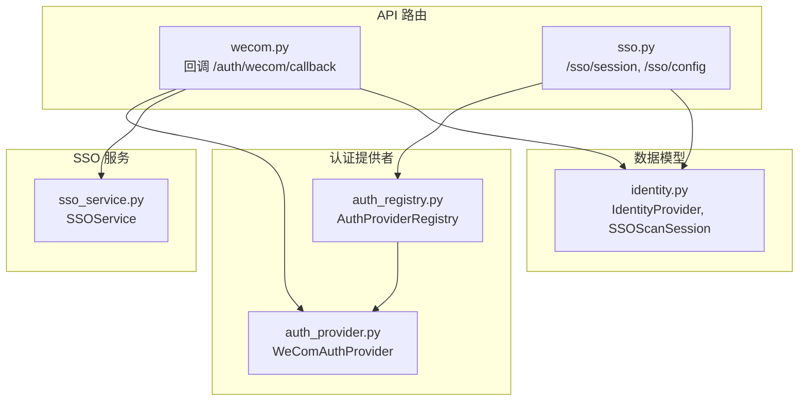
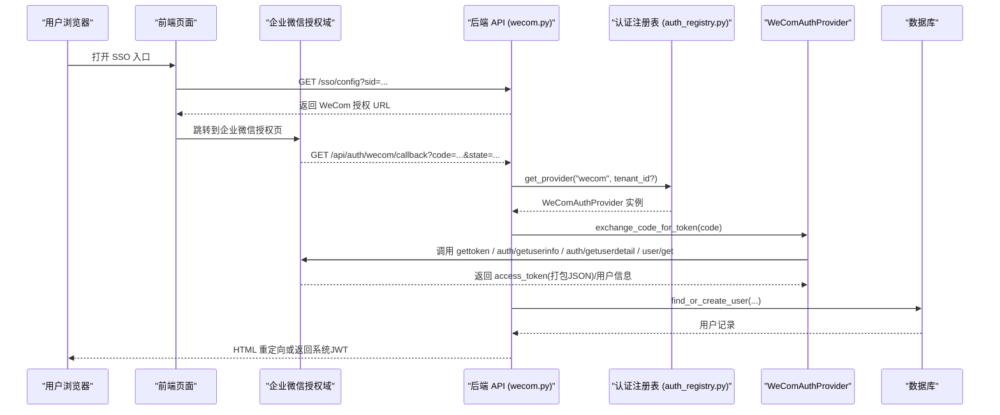
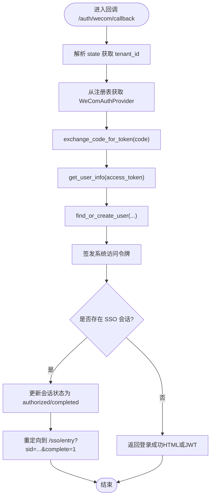
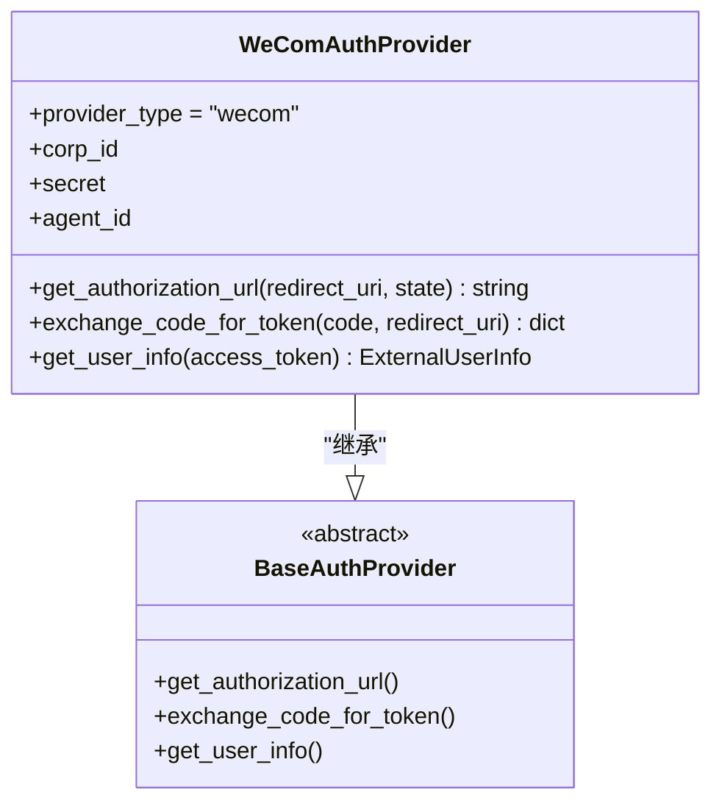
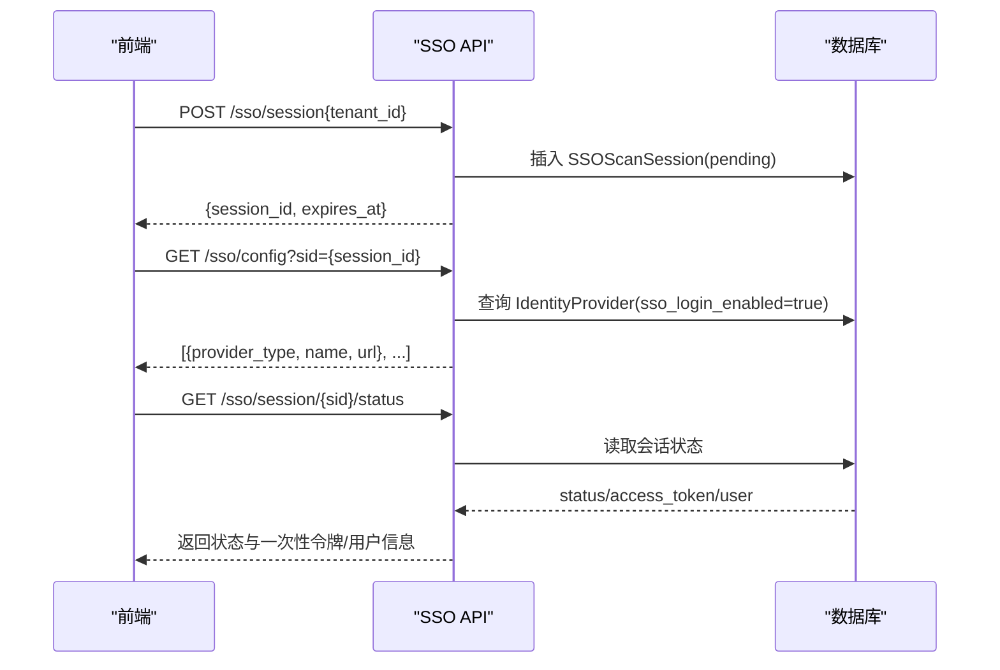
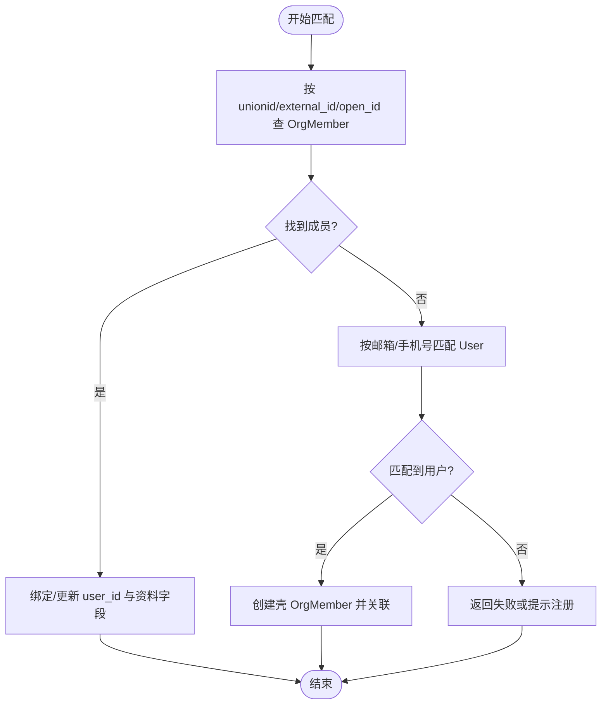
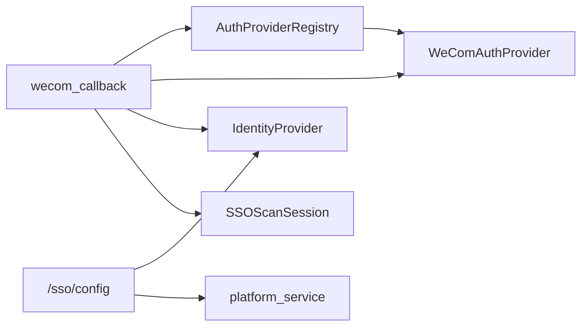

# 企业微信认证API

<cite>
**本文引用的文件**   
- [backend/app/api/wecom.py](file://backend/app/api/wecom.py)
- [backend/app/services/auth_provider.py](file://backend/app/services/auth_provider.py)
- [backend/app/api/sso.py](file://backend/app/api/sso.py)
- [backend/app/services/sso_service.py](file://backend/app/services/sso_service.py)
- [backend/app/services/auth_registry.py](file://backend/app/services/auth_registry.py)
- [backend/app/models/identity.py](file://backend/app/models/identity.py)
</cite>

## 目录
1. [简介](#简介)
2. [项目结构](#项目结构)
3. [核心组件](#核心组件)
4. [架构总览](#架构总览)
5. [详细组件分析](#详细组件分析)
6. [依赖关系分析](#依赖关系分析)
7. [性能与安全考虑](#性能与安全考虑)
8. [故障排查指南](#故障排查指南)
9. [结论](#结论)
10. [附录：接口清单与示例](#附录接口清单与示例)

## 简介
本文件为企业微信（WeCom）OAuth 单点登录（SSO）的完整 API 文档，覆盖以下主题：
- SSO 登录流程（扫码/网页授权）、授权码交换、用户信息获取
- 企业微信应用配置项与权限范围设置
- OAuth2.0 标准流程在本项目的实现方式
- 多租户支持、会话管理与错误处理策略
- 请求/响应示例与集成步骤

## 项目结构
与企业微信 OAuth 相关的后端代码主要分布在以下模块：
- API 路由层：wecom.py、sso.py
- 认证提供者实现：auth_provider.py（WeComAuthProvider）
- 认证注册表：auth_registry.py
- SSO 服务：sso_service.py
- 身份模型：identity.py（IdentityProvider、SSOScanSession）

图表来源
- [backend/app/api/wecom.py:606-691](file://backend/app/api/wecom.py#L606-L691)
- [backend/app/api/sso.py:16-160](file://backend/app/api/sso.py#L16-L160)
- [backend/app/services/auth_provider.py:450-649](file://backend/app/services/auth_provider.py#L450-L649)
- [backend/app/services/auth_registry.py:37-88](file://backend/app/services/auth_registry.py#L37-L88)
- [backend/app/services/sso_service.py:22-84](file://backend/app/services/sso_service.py#L22-L84)
- [backend/app/models/identity.py:26-67](file://backend/app/models/identity.py#L26-L67)

章节来源
- [backend/app/api/wecom.py:1-691](file://backend/app/api/wecom.py#L1-L691)
- [backend/app/api/sso.py:1-160](file://backend/app/api/sso.py#L1-L160)
- [backend/app/services/auth_provider.py:450-649](file://backend/app/services/auth_provider.py#L450-L649)
- [backend/app/services/auth_registry.py:1-230](file://backend/app/services/auth_registry.py#L1-L230)
- [backend/app/services/sso_service.py:1-576](file://backend/app/services/sso_service.py#L1-L576)
- [backend/app/models/identity.py:1-67](file://backend/app/models/identity.py#L1-L67)

## 核心组件
- WeComAuthProvider：实现企业微信 OAuth 授权链接生成、授权码换令牌、用户信息聚合。
- wecom_callback：接收企业微信回调，完成鉴权、用户查找/创建、签发系统访问令牌。
- sso_session/config：创建 SSO 扫描会话、查询可用 SSO 提供商及跳转地址。
- AuthProviderRegistry：按租户维度解析并缓存认证提供者实例。
- SSOService：基于邮箱/手机号/外部 ID 进行用户匹配与身份关联。
- IdentityProvider/SSOScanSession：存储企业微信应用配置与 SSO 会话状态。

章节来源
- [backend/app/services/auth_provider.py:450-649](file://backend/app/services/auth_provider.py#L450-L649)
- [backend/app/api/wecom.py:606-691](file://backend/app/api/wecom.py#L606-L691)
- [backend/app/api/sso.py:16-160](file://backend/app/api/sso.py#L16-L160)
- [backend/app/services/auth_registry.py:37-88](file://backend/app/services/auth_registry.py#L37-L88)
- [backend/app/services/sso_service.py:22-84](file://backend/app/services/sso_service.py#L22-L84)
- [backend/app/models/identity.py:26-67](file://backend/app/models/identity.py#L26-L67)

## 架构总览
下图展示企业微信 SSO 登录的整体调用链：前端引导至企业微信授权页，回调到后端 wecom_callback，通过 WeComAuthProvider 换取令牌并拉取用户信息，最终返回系统 JWT。

图表来源
- [backend/app/api/sso.py:83-160](file://backend/app/api/sso.py#L83-L160)
- [backend/app/api/wecom.py:606-691](file://backend/app/api/wecom.py#L606-L691)
- [backend/app/services/auth_registry.py:37-88](file://backend/app/services/auth_registry.py#L37-L88)
- [backend/app/services/auth_provider.py:486-629](file://backend/app/services/auth_provider.py#L486-L629)

## 详细组件分析

### WeCom 授权与回调流程
- 授权链接构造：使用 corp_id、agent_id、redirect_uri、state 拼接企业微信授权 URL。
- 回调处理：
  - 根据 state 解析 SSOScanSession，确定租户上下文
  - 通过注册表获取 WeComAuthProvider
  - 调用 exchange_code_for_token 获取打包令牌
  - 调用 get_user_info 解析标准化用户信息
  - 查找或创建用户，生成系统访问令牌
  - 若存在 SSO 会话，更新状态并重定向完成

图表来源
- [backend/app/api/wecom.py:606-691](file://backend/app/api/wecom.py#L606-L691)
- [backend/app/services/auth_provider.py:486-629](file://backend/app/services/auth_provider.py#L486-L629)
- [backend/app/services/auth_registry.py:37-88](file://backend/app/services/auth_registry.py#L37-L88)

章节来源
- [backend/app/api/wecom.py:606-691](file://backend/app/api/wecom.py#L606-L691)
- [backend/app/services/auth_provider.py:486-629](file://backend/app/services/auth_provider.py#L486-L629)
- [backend/app/services/auth_registry.py:37-88](file://backend/app/services/auth_registry.py#L37-L88)

### WeCom 授权码交换与用户信息获取
- 三步调用：
  1) gettoken：用 corp_id + secret 获取应用级 access_token
  2) auth/getuserinfo：用 code 换取 userid + user_ticket
  3a) auth/getuserdetail：用 user_ticket 拉取敏感字段（头像、邮箱、手机等）
  3b) user/get：用 userid 拉取非敏感字段（姓名、职位等）
- 将上述结果打包为 JSON 字符串作为“access_token”供上层统一消费
- get_user_info：解析打包数据，优先级规则：
  - email：敏感数据 > biz_mail > basic_data
  - avatar：敏感数据优先
  - mobile：仅敏感数据可用
  - name：basic_data

图表来源
- [backend/app/services/auth_provider.py:450-649](file://backend/app/services/auth_provider.py#L450-L649)

章节来源
- [backend/app/services/auth_provider.py:450-649](file://backend/app/services/auth_provider.py#L450-L649)

### SSO 会话与配置接口
- 创建会话：POST /sso/session，返回 session_id 与过期时间
- 查询状态：GET /sso/session/{sid}/status，当状态为 authorized 时返回 access_token 与用户信息，并标记 completed
- 可选扫描标记：PUT /sso/session/{sid}/scan
- 获取配置：GET /sso/config?sid=...，列出当前租户可用的 SSO 提供商及其跳转 URL（含 WeCom）

图表来源
- [backend/app/api/sso.py:16-160](file://backend/app/api/sso.py#L16-L160)
- [backend/app/models/identity.py:50-67](file://backend/app/models/identity.py#L50-L67)

章节来源
- [backend/app/api/sso.py:16-160](file://backend/app/api/sso.py#L16-L160)
- [backend/app/models/identity.py:50-67](file://backend/app/models/identity.py#L50-L67)

### 多租户支持与用户匹配
- 多租户：回调中通过 state 解析 SSOScanSession.tenant_id，限定 IdentityProvider 查询范围；未指定则回退到全局 provider
- 用户匹配：
  - 优先通过 OrgMember 的外部标识（unionid/external_id/open_id）定位用户
  - 如不存在，可基于邮箱/手机号匹配现有用户
  - 首次登录可自动关联或创建组织成员记录，并被动填充资料字段

图表来源
- [backend/app/services/sso_service.py:183-446](file://backend/app/services/sso_service.py#L183-L446)

章节来源
- [backend/app/services/sso_service.py:183-446](file://backend/app/services/sso_service.py#L183-L446)

## 依赖关系分析
- wecom_callback 依赖：
  - auth_provider_registry.get_provider("wecom", tenant_id?)
  - WeComAuthProvider.exchange_code_for_token / get_user_info
  - IdentityProvider 查询（按租户过滤）
  - SSOScanSession 读写
- sso.config 依赖：
  - IdentityProvider 列表（is_active=true, sso_login_enabled=true）
  - platform_service 计算公共基础 URL
- auth_registry 提供按租户维度的 Provider 实例缓存

图表来源
- [backend/app/api/wecom.py:606-691](file://backend/app/api/wecom.py#L606-L691)
- [backend/app/api/sso.py:83-160](file://backend/app/api/sso.py#L83-L160)
- [backend/app/services/auth_registry.py:37-88](file://backend/app/services/auth_registry.py#L37-L88)

章节来源
- [backend/app/api/wecom.py:606-691](file://backend/app/api/wecom.py#L606-L691)
- [backend/app/api/sso.py:83-160](file://backend/app/api/sso.py#L83-L160)
- [backend/app/services/auth_registry.py:37-88](file://backend/app/services/auth_registry.py#L37-L88)

## 性能与安全考虑
- 网络超时与重试：
  - WeCom 各接口调用设置了合理超时（如 10s），避免阻塞回调处理
- 敏感字段限制：
  - 自 2022 年 6 月起，部分敏感字段需通过 user_ticket 获取；缺少 scope 时将降级返回
- IP 白名单：
  - 企业微信自建应用对多数 API 强制要求 IP 白名单，影响 user/get 等非敏感字段获取
- 签名与加密：
  - Webhook 模式需校验消息签名与 AES 解密；SSO 回调使用 state 防 CSRF
- 会话安全：
  - SSOScanSession 设置过期时间，且一次性的 access_token 在读取后标记 completed，防止重用

[本节为通用指导，不直接分析具体文件]

## 故障排查指南
常见错误与定位要点：
- 回调返回“Auth failed: Token error”
  - 检查 corp_id/secret 是否正确，gettoken 是否成功
  - 确认回调域名已配置可信域名并通过 ICP 备案（中国大陆 .ai 域名不可备案）
- “No UserId returned”
  - 检查 code 是否有效、是否被重复使用；确认 auth/getuserinfo 返回字段名（userid vs UserId）
- 无法获取头像/邮箱/手机
  - 确认应用具备 snsapi_privateinfo 权限；确保 user_ticket 可用
- user/get 失败
  - 服务器 IP 是否在企微“企业可信IP”白名单内
- SSO 配置不可用
  - 检查 IdentityProvider.is_active 与 sso_login_enabled 标志位
  - 租户隔离下，确认 sid 对应的 tenant_id 与 provider 匹配

章节来源
- [backend/app/api/wecom.py:606-691](file://backend/app/api/wecom.py#L606-L691)
- [backend/app/services/auth_provider.py:486-629](file://backend/app/services/auth_provider.py#L486-L629)
- [backend/app/api/sso.py:83-160](file://backend/app/api/sso.py#L83-L160)

## 结论
本项目在企业微信 OAuth 方面实现了完整的 SSO 登录流程：从授权链接生成、回调处理、授权码交换、用户信息聚合到系统令牌签发，均遵循 OAuth2.0 标准并结合企业微信特定约束（user_ticket、IP 白名单、敏感字段限制）。同时通过多租户隔离、SSO 会话机制与健壮的错误处理，保障生产环境的安全与稳定性。

[本节为总结性内容，不直接分析具体文件]

## 附录：接口清单与示例

### 企业微信应用配置
- 必填字段：
  - corp_id：企业 ID
  - secret：自建应用密钥（AgentSecret）
  - agent_id：应用 ID（用于授权跳转）
- 可选字段：
  - bot_id/bot_secret：WebSocket 模式（智能机器人）
  - token/encoding_aes_key：Webhook 模式（传统回调）

章节来源
- [backend/app/api/wecom.py:153-242](file://backend/app/api/wecom.py#L153-L242)
- [backend/app/services/auth_provider.py:460-466](file://backend/app/services/auth_provider.py#L460-L466)

### SSO 登录流程接口
- 创建 SSO 会话
  - 方法：POST
  - 路径：/sso/session
  - 参数：tenant_id（可选）
  - 响应：{ session_id, expires_at }
- 获取 SSO 配置（含 WeCom 授权 URL）
  - 方法：GET
  - 路径：/sso/config
  - 参数：sid
  - 响应：[{ provider_type, name, url }, ...]
- 查询 SSO 会话状态
  - 方法：GET
  - 路径：/sso/session/{sid}/status
  - 响应：{ status, provider_type, error_msg, access_token?, user? }
- 可选：标记已扫描
  - 方法：PUT
  - 路径：/sso/session/{sid}/scan
  - 响应：{ status: "ok" }

章节来源
- [backend/app/api/sso.py:16-160](file://backend/app/api/sso.py#L16-L160)

### 企业微信回调接口
- 回调路径
  - 方法：GET
  - 路径：/api/auth/wecom/callback
  - 参数：code, state
  - 行为：
    - 解析 state 获取 tenant_id
    - 获取 WeComAuthProvider
    - 交换授权码并获取用户信息
    - 查找/创建用户并签发系统访问令牌
    - 若有 SSO 会话，更新状态并重定向完成

章节来源
- [backend/app/api/wecom.py:606-691](file://backend/app/api/wecom.py#L606-L691)

### 授权码交换与用户信息（内部实现）
- 授权链接构造
  - 路径：WeComAuthProvider.get_authorization_url(redirect_uri, state)
  - 返回：企业微信授权 URL
- 授权码换令牌
  - 路径：WeComAuthProvider.exchange_code_for_token(code, redirect_uri?)
  - 返回：包含 userid、sensitive、basic 的打包 JSON（伪装为 access_token）
- 用户信息解析
  - 路径：WeComAuthProvider.get_user_info(access_token)
  - 返回：ExternalUserInfo（name/email/avatar/mobile/raw_data）

章节来源
- [backend/app/services/auth_provider.py:468-629](file://backend/app/services/auth_provider.py#L468-L629)

### 典型请求/响应示例（描述性）
- 创建 SSO 会话
  - 请求：POST /sso/session?tenant_id=<uuid>
  - 响应：{ "session_id": "<uuid>", "expires_at": "<iso8601>" }
- 获取 SSO 配置
  - 请求：GET /sso/config?sid=<uuid>
  - 响应：[{ "provider_type": "wecom", "name": "企业微信", "url": "https://open.work.weixin.qq.com/wwopen/sso/qrConnect?appid=...&agentid=...&redirect_uri=...&state=..." }]
- 查询会话状态
  - 请求：GET /sso/session/<sid>/status
  - 响应：{ "status": "authorized", "access_token": "<jwt>", "user": { ... } }
- 企业微信回调
  - 请求：GET /api/auth/wecom/callback?code=<code>&state=<sid>
  - 响应：HTML 重定向或包含系统 JWT 的文本

[以上为描述性示例，不包含具体代码片段]

### 集成步骤（前端/客户端）
- 在企业管理后台启用企业微信 SSO 登录，并填写 corp_id、secret、agent_id
- 前端调用 /sso/session 创建会话，再调用 /sso/config 获取 WeCom 授权 URL
- 引导用户跳转企业微信授权页，等待回调到 /api/auth/wecom/callback
- 轮询 /sso/session/{sid}/status，获取 access_token 与用户信息
- 使用 access_token 访问受保护资源

章节来源
- [backend/app/api/sso.py:16-160](file://backend/app/api/sso.py#L16-L160)
- [backend/app/api/wecom.py:606-691](file://backend/app/api/wecom.py#L606-L691)