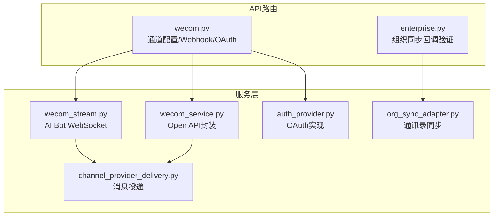
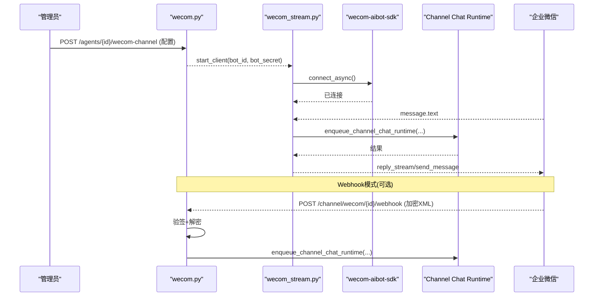
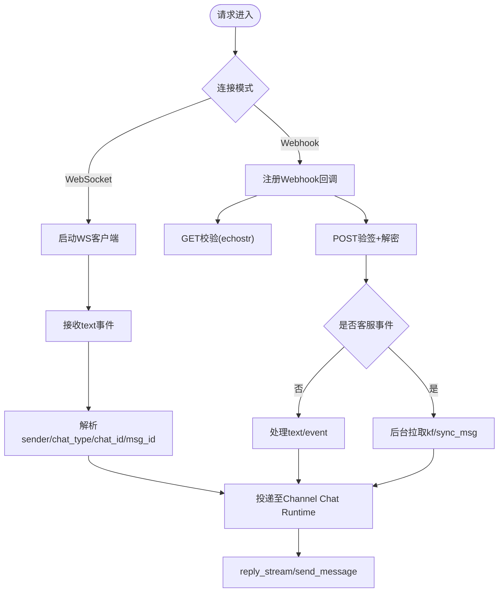
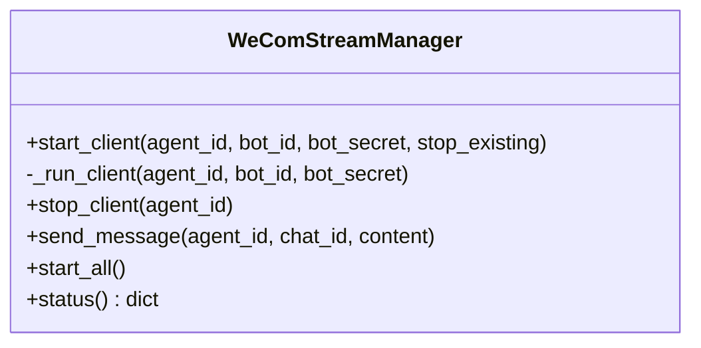
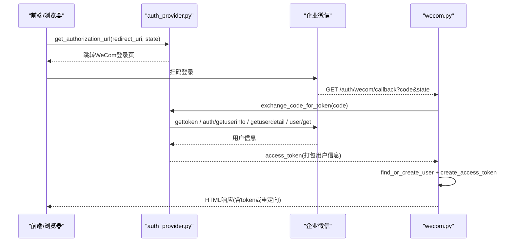
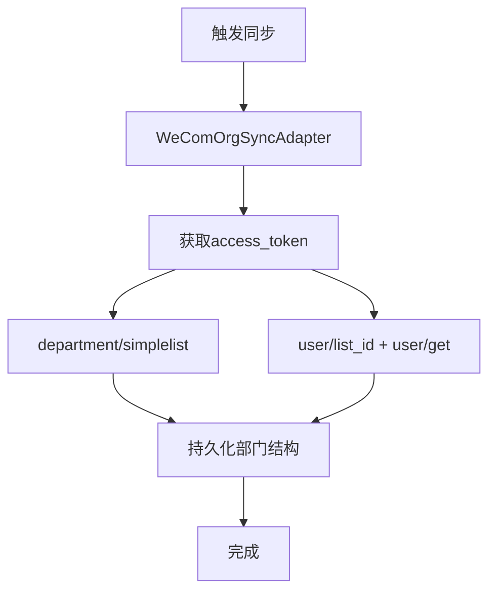
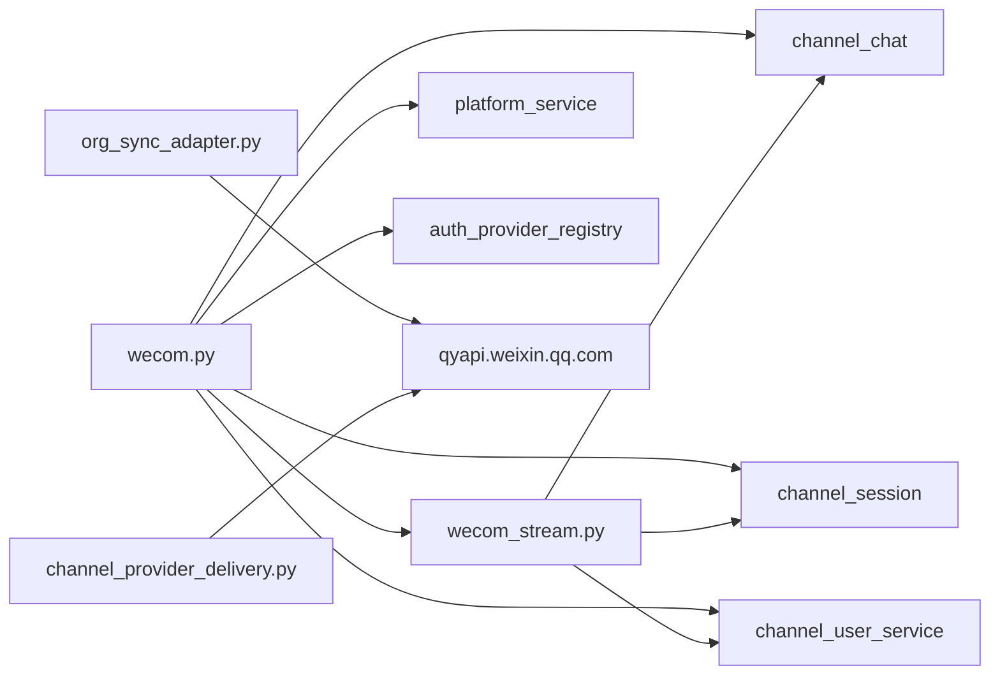

# 企业微信集成API

<cite>
**本文引用的文件**   
- [backend/app/api/wecom.py](file://backend/app/api/wecom.py)
- [backend/app/services/wecom_stream.py](file://backend/app/services/wecom_stream.py)
- [backend/app/services/wecom_service.py](file://backend/app/services/wecom_service.py)
- [backend/app/services/auth_provider.py](file://backend/app/services/auth_provider.py)
- [backend/app/api/enterprise.py](file://backend/app/api/enterprise.py)
- [backend/app/services/org_sync_adapter.py](file://backend/app/services/org_sync_adapter.py)
- [backend/app/services/org_sync_service.py](file://backend/app/services/org_sync_service.py)
- [backend/app/services/agent_runtime/channel_provider_delivery.py](file://backend/app/services/agent_runtime/channel_provider_delivery.py)
- [backend/tests/test_wecom_channel_api.py](file://backend/tests/test_wecom_channel_api.py)
- [backend/tests/test_wecom_stream.py](file://backend/tests/test_wecom_stream.py)
</cite>

## 目录
1. [简介](#简介)
2. [项目结构](#项目结构)
3. [核心组件](#核心组件)
4. [架构总览](#架构总览)
5. [详细组件分析](#详细组件分析)
6. [依赖关系分析](#依赖关系分析)
7. [性能考虑](#性能考虑)
8. [故障排查指南](#故障排查指南)
9. [结论](#结论)
10. [附录](#附录)

## 简介
本文件为Clawith平台的企业微信渠道集成提供完整的API文档，覆盖以下能力：
- 企业微信OAuth认证（SSO）与回调处理
- Stream模式（AI Bot WebSocket）消息接收与回复
- Webhook回调（加密XML）消息处理与企业微信客服（KF）消息拉取
- 应用配置、Webhook URL获取、域名校验文件托管
- 通讯录同步（部门、用户）与企业功能扩展
- 应用消息发送（文本）、群机器人、微盘文件等扩展能力的接入点说明
- 开放平台配置指南、权限管理与安全最佳实践

## 项目结构
企业微信相关代码主要分布在后端模块中：
- API路由层：wecom.py（通道配置、Webhook回调、OAuth回调）
- 服务层：wecom_stream.py（WebSocket长连接管理）、wecom_service.py（Open API封装）、auth_provider.py（OAuth实现）、org_sync_adapter.py（通讯录同步适配器）、channel_provider_delivery.py（消息投递）
- 企业级接口：enterprise.py（组织同步回调验证）
- 测试用例：test_wecom_channel_api.py、test_wecom_stream.py

图表来源
- [backend/app/api/wecom.py:153-300](file://backend/app/api/wecom.py#L153-L300)
- [backend/app/services/wecom_stream.py:65-120](file://backend/app/services/wecom_stream.py#L65-L120)
- [backend/app/services/wecom_service.py:7-30](file://backend/app/services/wecom_service.py#L7-L30)
- [backend/app/services/auth_provider.py:435-485](file://backend/app/services/auth_provider.py#L435-L485)
- [backend/app/api/enterprise.py:1818-1875](file://backend/app/api/enterprise.py#L1818-L1875)
- [backend/app/services/org_sync_adapter.py:1180-1224](file://backend/app/services/org_sync_adapter.py#L1180-L1224)
- [backend/app/services/agent_runtime/channel_provider_delivery.py:255-278](file://backend/app/services/agent_runtime/channel_provider_delivery.py#L255-L278)

章节来源
- [backend/app/api/wecom.py:153-300](file://backend/app/api/wecom.py#L153-L300)
- [backend/app/services/wecom_stream.py:65-120](file://backend/app/services/wecom_stream.py#L65-L120)

## 核心组件
- WeCom通道配置与Webhook回调
  - 支持两种模式：WebSocket（AI Bot）与Webhook（传统回调）
  - 提供域名校验文件托管、Webhook签名校验与AES加解密
  - 支持企业微信客服（KF）消息拉取与去重
- WeCom Stream管理器
  - 基于wecom-aibot-sdk-python的WebSocket客户端管理
  - 自动重连、心跳、欢迎语、消息分发到运行时
- OAuth认证提供者
  - 扫码登录流程，获取access_token、user_ticket，拉取用户详情
- 通讯录同步适配器
  - 使用simplelist与list_id/user/get等API进行部门与用户同步
- 消息投递
  - 通过Open API发送文本消息，或经由WebSocket主动推送

章节来源
- [backend/app/api/wecom.py:153-300](file://backend/app/api/wecom.py#L153-L300)
- [backend/app/services/wecom_stream.py:65-120](file://backend/app/services/wecom_stream.py#L65-L120)
- [backend/app/services/auth_provider.py:435-485](file://backend/app/services/auth_provider.py#L435-L485)
- [backend/app/services/org_sync_adapter.py:1180-1224](file://backend/app/services/org_sync_adapter.py#L1180-L1224)
- [backend/app/services/agent_runtime/channel_provider_delivery.py:255-278](file://backend/app/services/agent_runtime/channel_provider_delivery.py#L255-L278)

## 架构总览
企业微信集成的整体数据流如下：
- 配置阶段：管理员在平台配置WeCom通道（WebSocket或Webhook），系统保存配置并启动相应客户端
- 入站消息：
  - WebSocket模式：SDK建立长连接，收到消息后解析上下文并投递至运行时
  - Webhook模式：企业微信回调加密XML，服务端验签解密后投递至运行时
- 出站消息：
  - WebSocket模式：通过WSClient.reply_stream或send_message主动推送
  - Open API模式：调用qyapi.weixin.qq.com发送文本消息

图表来源
- [backend/app/api/wecom.py:153-300](file://backend/app/api/wecom.py#L153-L300)
- [backend/app/services/wecom_stream.py:98-170](file://backend/app/services/wecom_stream.py#L98-L170)
- [backend/app/services/agent_runtime/channel_provider_delivery.py:255-278](file://backend/app/services/agent_runtime/channel_provider_delivery.py#L255-L278)

## 详细组件分析

### WeCom通道配置与Webhook回调
- 配置接口
  - POST /agents/{agent_id}/wecom-channel：支持WebSocket（bot_id+bot_secret）与Webhook（corp_id+secret+token+encoding_aes_key）两种模式
  - GET /agents/{agent_id}/wecom-channel：查询配置状态，WebSocket模式下返回is_connected
  - GET /agents/{agent_id}/wecom-channel/webhook-url：生成Webhook回调URL
  - DELETE /agents/{agent_id}/wecom-channel：删除配置并停止客户端
- 域名校验
  - GET /wecom-verify/{filename}：按租户查找并返回WW_verify_*.txt内容
- Webhook回调
  - GET /channel/wecom/{agent_id}/webhook：回调URL校验（echostr解密返回）
  - POST /channel/wecom/{agent_id}/webhook：接收加密XML，验签、解密、解析消息类型，处理text/event/image/file
  - 客服消息拉取：异步后台任务调用kf/sync_msg，按cursor分页拉取并投递

图表来源
- [backend/app/api/wecom.py:153-300](file://backend/app/api/wecom.py#L153-L300)
- [backend/app/api/wecom.py:309-450](file://backend/app/api/wecom.py#L309-L450)
- [backend/app/api/wecom.py:453-518](file://backend/app/api/wecom.py#L453-L518)

章节来源
- [backend/app/api/wecom.py:153-300](file://backend/app/api/wecom.py#L153-L300)
- [backend/app/api/wecom.py:309-450](file://backend/app/api/wecom.py#L309-L450)
- [backend/app/api/wecom.py:453-518](file://backend/app/api/wecom.py#L453-L518)

### WeCom Stream管理器（AI Bot WebSocket）
- 功能要点
  - 管理每个Agent的WS客户端生命周期（start/stop/status）
  - 自动重连、心跳、欢迎语、错误恢复
  - 解析消息体兼容官方SDK与旧版嵌套结构
  - 将消息投递至Channel Chat Runtime，并通过WS主动回复
- 关键方法
  - start_client(agent_id, bot_id, bot_secret)
  - _run_client(agent_id, bot_id, bot_secret)
  - send_message(agent_id, chat_id, content)
  - status() -> dict

图表来源
- [backend/app/services/wecom_stream.py:65-120](file://backend/app/services/wecom_stream.py#L65-L120)
- [backend/app/services/wecom_stream.py:284-347](file://backend/app/services/wecom_stream.py#L284-L347)

章节来源
- [backend/app/services/wecom_stream.py:65-120](file://backend/app/services/wecom_stream.py#L65-L120)
- [backend/app/services/wecom_stream.py:284-347](file://backend/app/services/wecom_stream.py#L284-L347)
- [backend/tests/test_wecom_stream.py:13-45](file://backend/tests/test_wecom_stream.py#L13-L45)

### OAuth认证（SSO）
- 流程概述
  - 构建授权URL（CorpPinCorp扫码登录）
  - 回调端点交换code为access_token
  - 使用user_ticket获取敏感字段（头像、邮箱、手机）
  - 非敏感字段（姓名、职位）通过user/get补充
- 回调处理
  - GET /auth/wecom/callback：根据state解析tenant_id，创建或查找用户，签发访问令牌

图表来源
- [backend/app/services/auth_provider.py:468-526](file://backend/app/services/auth_provider.py#L468-L526)
- [backend/app/api/wecom.py:606-691](file://backend/app/api/wecom.py#L606-L691)

章节来源
- [backend/app/services/auth_provider.py:435-526](file://backend/app/services/auth_provider.py#L435-L526)
- [backend/app/api/wecom.py:606-691](file://backend/app/api/wecom.py#L606-L691)

### 通讯录同步（部门与用户）
- 适配器能力
  - 使用department/simplelist与user/list_id/user/get进行同步
  - 支持通讯录同步Secret（无需App级IP白名单）
- 同步服务
  - org_sync_service.sync_provider(provider_id)触发同步
- 回调验证
  - enterprise.py提供通用回调验证接口，用于解锁企业可信IP配置

图表来源
- [backend/app/services/org_sync_adapter.py:1180-1224](file://backend/app/services/org_sync_adapter.py#L1180-L1224)
- [backend/app/services/org_sync_service.py:14-49](file://backend/app/services/org_sync_service.py#L14-L49)
- [backend/app/api/enterprise.py:1818-1875](file://backend/app/api/enterprise.py#L1818-L1875)

章节来源
- [backend/app/services/org_sync_adapter.py:1180-1224](file://backend/app/services/org_sync_adapter.py#L1180-L1224)
- [backend/app/services/org_sync_service.py:14-49](file://backend/app/services/org_sync_service.py#L14-L49)
- [backend/app/api/enterprise.py:1818-1875](file://backend/app/api/enterprise.py#L1818-L1875)

### 消息投递（应用消息、群机器人、微盘文件）
- 应用消息
  - 通过Open API发送文本消息（需要wecom_agent_id）
  - 若未配置wecom_agent_id则抛出错误
- 群机器人
  - 可通过群会话chat_id进行消息投递（WebSocket模式优先）
- 微盘文件
  - 当前代码未实现文件类消息处理，预留扩展点（TODO）

章节来源
- [backend/app/services/agent_runtime/channel_provider_delivery.py:255-278](file://backend/app/services/agent_runtime/channel_provider_delivery.py#L255-L278)
- [backend/app/api/wecom.py:446-450](file://backend/app/api/wecom.py#L446-L450)

## 依赖关系分析
- wecom.py依赖：
  - wecom_stream_manager（WS客户端管理）
  - channel_chat runtime（消息入队）
  - channel_session与channel_user_service（会话与用户解析）
  - platform_service（公共基础URL）
  - auth_provider_registry（OAuth提供者）
- wecom_stream.py依赖：
  - wecom-aibot-sdk-python（WS客户端）
  - channel_chat runtime（消息入队）
  - channel_session与channel_user_service（会话与用户解析）
- org_sync_adapter依赖：
  - qyapi.weixin.qq.com（通讯录API）
- channel_provider_delivery依赖：
  - qyapi.weixin.qq.com（消息发送）

图表来源
- [backend/app/api/wecom.py:153-300](file://backend/app/api/wecom.py#L153-L300)
- [backend/app/services/wecom_stream.py:352-426](file://backend/app/services/wecom_stream.py#L352-L426)
- [backend/app/services/org_sync_adapter.py:1180-1224](file://backend/app/services/org_sync_adapter.py#L1180-L1224)
- [backend/app/services/agent_runtime/channel_provider_delivery.py:255-278](file://backend/app/services/agent_runtime/channel_provider_delivery.py#L255-L278)

章节来源
- [backend/app/api/wecom.py:153-300](file://backend/app/api/wecom.py#L153-L300)
- [backend/app/services/wecom_stream.py:352-426](file://backend/app/services/wecom_stream.py#L352-L426)

## 性能考虑
- WebSocket长连接
  - 自动重连与指数退避，避免频繁重试导致雪崩
  - 心跳间隔30秒，保持连接活跃
- 消息去重
  - 内存集合缓存最近处理的msg_id/kf_msg_id，超过阈值后清理
- 异步处理
  - 客服消息拉取与消息投递均使用异步任务，降低阻塞
- 外部API超时
  - httpx客户端设置合理超时，避免长时间占用资源

[本节为通用指导，不直接分析具体文件]

## 故障排查指南
- 常见错误
  - 签名不匹配：检查verification_token与EncodingAESKey是否正确
  - 解密失败：确认AES密钥与填充方式一致
  - 无wecom_agent_id：确保通道配置中包含agent_id
  - 会话过期：WeChat iLink场景下需重新获取context_token
- 日志定位
  - WeCom Stream日志包含连接、断线、重连与消息处理异常
  - Webhook回调日志记录验签与解密过程
- 测试用例参考
  - test_wecom_channel_api.py：通道配置与状态查询
  - test_wecom_stream.py：消息上下文提取与状态报告

章节来源
- [backend/tests/test_wecom_channel_api.py:71-140](file://backend/tests/test_wecom_channel_api.py#L71-L140)
- [backend/tests/test_wecom_stream.py:13-64](file://backend/tests/test_wecom_stream.py#L13-L64)

## 结论
Clawith平台的企业微信集成提供了完善的通道配置、双向消息收发、OAuth认证与企业功能扩展。通过WebSocket与Webhook双模式适配，既满足低延迟实时交互，也兼容传统回调场景。结合通讯录同步与消息投递能力，可快速搭建企业级智能助手与服务台。建议在生产环境严格管理密钥、启用签名校验与限流策略，并持续监控连接状态与错误日志。

[本节为总结性内容，不直接分析具体文件]

## 附录

### API清单与行为说明
- 通道配置
  - POST /agents/{agent_id}/wecom-channel：创建或更新通道配置（WebSocket或Webhook）
  - GET /agents/{agent_id}/wecom-channel：查询配置与连接状态
  - GET /agents/{agent_id}/wecom-channel/webhook-url：获取Webhook回调URL
  - DELETE /agents/{agent_id}/wecom-channel：删除配置并停止客户端
- 域名校验
  - GET /wecom-verify/{filename}：返回WW_verify_*.txt内容
- Webhook回调
  - GET /channel/wecom/{agent_id}/webhook：回调URL校验
  - POST /channel/wecom/{agent_id}/webhook：接收加密XML消息
- OAuth回调
  - GET /auth/wecom/callback：处理授权码并签发令牌
- 组织同步回调
  - GET /api/enterprise/org/wecom-verify/{provider_id}：验证接收消息服务器URL
  - GET /api/enterprise/org/wecom-callback/{token}：通用回调验证（无需数据库）

章节来源
- [backend/app/api/wecom.py:153-300](file://backend/app/api/wecom.py#L153-L300)
- [backend/app/api/wecom.py:309-450](file://backend/app/api/wecom.py#L309-L450)
- [backend/app/api/wecom.py:606-691](file://backend/app/api/wecom.py#L606-L691)
- [backend/app/api/enterprise.py:1818-1875](file://backend/app/api/enterprise.py#L1818-L1875)

### 企业微信开放平台配置指南
- 自建应用
  - 启用“接收消息”服务器URL，填写平台提供的回调地址
  - 配置Token、EncodingAESKey，并确保签名校验成功
  - 如需调用user/get等接口，需在企业可信IP白名单中添加服务器IP
- AI Bot（WebSocket）
  - 配置BotID与BotSecret，无需回调URL
  - 确保网络可达且无代理干扰（SDK已禁用代理）
- 通讯录同步
  - 使用通讯录同步Secret，调用department/simplelist与user/list_id
  - 首次保存接收消息服务器URL后，可配置企业可信IP以启用更多权限

章节来源
- [backend/app/services/auth_provider.py:468-526](file://backend/app/services/auth_provider.py#L468-L526)
- [backend/app/services/org_sync_adapter.py:1180-1224](file://backend/app/services/org_sync_adapter.py#L1180-L1224)
- [backend/app/api/enterprise.py:1818-1875](file://backend/app/api/enterprise.py#L1818-L1875)

### 权限管理与安全最佳实践
- 最小权限原则：仅授予必要的通讯录与消息权限
- 密钥管理：妥善保管corp_id、secret、token、EncodingAESKey
- 签名校验：所有回调必须验签，防止伪造请求
- 输入校验：对回调参数进行严格白名单校验，防止注入
- 日志脱敏：避免在日志中输出敏感信息
- 监控告警：对连接状态、错误率、延迟进行监控与告警

[本节为通用指导，不直接分析具体文件]