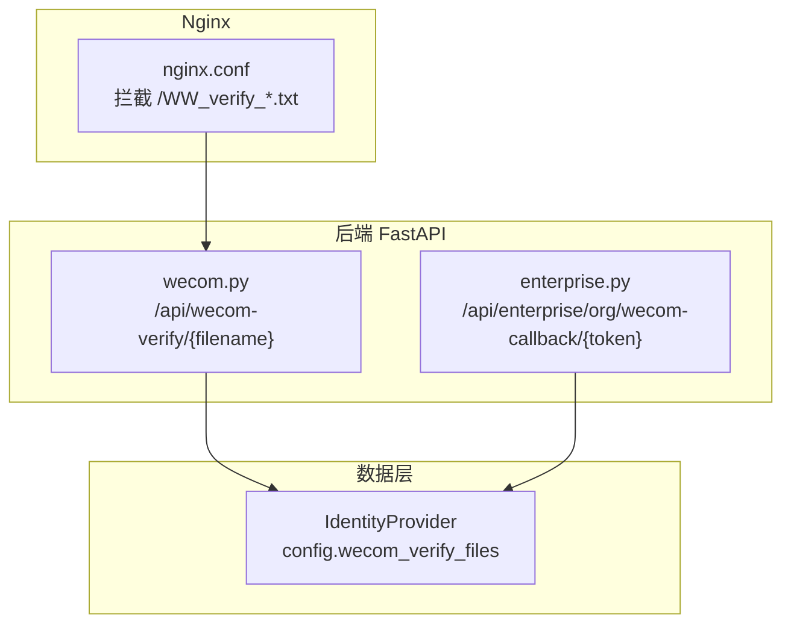
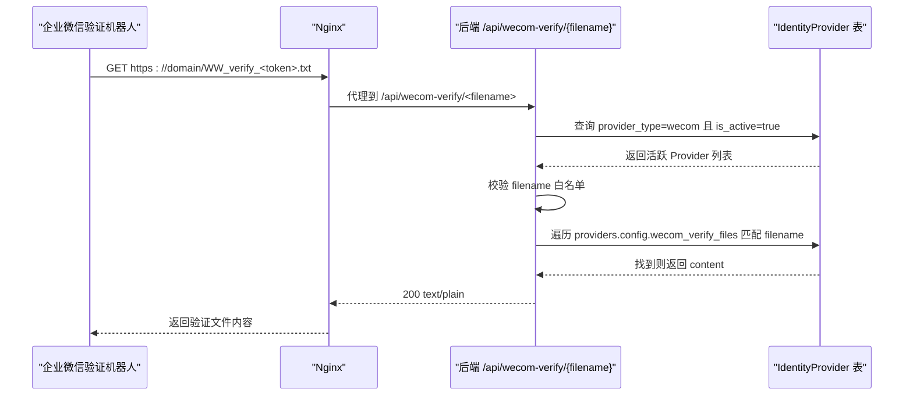
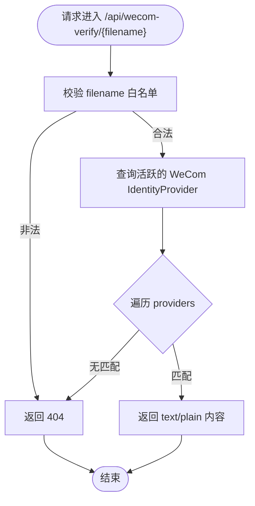
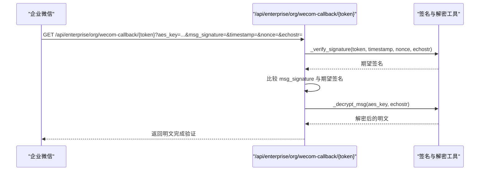
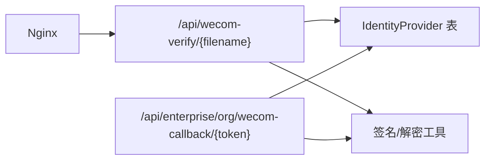

# 域名验证API

<cite>
**本文引用的文件**   
- [backend/app/api/wecom.py](file://backend/app/api/wecom.py)
- [deploy/nginx/nginx.conf](file://deploy/nginx/nginx.conf)
- [frontend/nginx.conf.template](file://frontend/nginx.conf.template)
- [backend/app/models/identity.py](file://backend/app/models/identity.py)
- [backend/app/api/enterprise.py](file://backend/app/api/enterprise.py)
</cite>

## 目录
1. [简介](#简介)
2. [项目结构](#项目结构)
3. [核心组件](#核心组件)
4. [架构总览](#架构总览)
5. [详细组件分析](#详细组件分析)
6. [依赖关系分析](#依赖关系分析)
7. [性能考量](#性能考量)
8. [故障排查指南](#故障排查指南)
9. [结论](#结论)
10. [附录：配置与部署示例](#附录配置与部署示例)

## 简介
本文件面向企业微信域名验证的API文档，覆盖以下要点：
- WW_verify 文件托管机制（多租户）
- Nginx 路由与访问控制策略
- 安全校验流程（签名、AES加解密）
- 完整验证流程说明
- 常见问题排查方法
- 最佳实践与部署指南

该能力用于在企业微信自建应用可信域名下，通过根路径返回 WW_verify_<token>.txt 文件内容，以完成域名所有权验证。系统采用统一后端接口按文件名动态匹配并返回对应租户的配置内容，避免为每个租户单独部署服务。

## 项目结构
与企业微信域名验证相关的代码主要分布在：
- 后端 API：提供 /api/wecom-verify/{filename} 等接口
- Nginx 配置：将域名根路径下的 WW_verify_*.txt 请求转发到后端
- 身份提供者模型：存储各租户的 wecom_verify_files 映射
- 通用回调验证：支持无需数据库查询的通用回调验证

图表来源
- [deploy/nginx/nginx.conf:45-53](file://deploy/nginx/nginx.conf#L45-L53)
- [backend/app/api/wecom.py:111-148](file://backend/app/api/wecom.py#L111-L148)
- [backend/app/models/identity.py:26-47](file://backend/app/models/identity.py#L26-L47)
- [backend/app/api/enterprise.py:1878-1928](file://backend/app/api/enterprise.py#L1878-L1928)

章节来源
- [deploy/nginx/nginx.conf:45-53](file://deploy/nginx/nginx.conf#L45-L53)
- [frontend/nginx.conf.template:45-53](file://frontend/nginx.conf.template#L45-L53)
- [backend/app/api/wecom.py:111-148](file://backend/app/api/wecom.py#L111-L148)
- [backend/app/models/identity.py:26-47](file://backend/app/models/identity.py#L26-L47)
- [backend/app/api/enterprise.py:1878-1928](file://backend/app/api/enterprise.py#L1878-L1928)

## 核心组件
- WeCom 域名验证文件托管接口
  - 路径：GET /api/wecom-verify/{filename}
  - 功能：根据 filename 在活跃的 WeCom IdentityProvider 中查找对应的 wecom_verify_files 映射，返回文本内容
  - 安全：对 filename 进行严格白名单正则校验，防止路径穿越或注入
- Nginx 拦截规则
  - 路径模式：^/WW_verify_[A-Za-z0-9]+\.txt$
  - 行为：将请求代理到后端 /api/wecom-verify/$request_uri
- 通用回调验证接口（可选）
  - 路径：GET /api/enterprise/org/wecom-callback/{token}?aes_key=...
  - 用途：在不查库的情况下完成企业微信回调URL验证，便于解锁企业可信IP白名单配置

章节来源
- [backend/app/api/wecom.py:111-148](file://backend/app/api/wecom.py#L111-L148)
- [deploy/nginx/nginx.conf:45-53](file://deploy/nginx/nginx.conf#L45-L53)
- [backend/app/api/enterprise.py:1878-1928](file://backend/app/api/enterprise.py#L1878-L1928)

## 架构总览
下图展示了企业微信域名验证的整体调用链：企业微信所有权检查机器人访问域名根路径的 WW_verify_*.txt，Nginx 拦截并转发至后端，后端基于文件名在多租户配置中查找并返回内容。

图表来源
- [deploy/nginx/nginx.conf:45-53](file://deploy/nginx/nginx.conf#L45-L53)
- [backend/app/api/wecom.py:111-148](file://backend/app/api/wecom.py#L111-L148)
- [backend/app/models/identity.py:26-47](file://backend/app/models/identity.py#L26-L47)

## 详细组件分析

### 组件A：WeCom 域名验证文件托管接口
- 接口定义
  - 方法：GET
  - 路径：/api/wecom-verify/{filename}
  - 参数：filename（由 Nginx 从 URL 路径传入）
  - 响应：text/plain 文件内容；未命中时返回 404
- 安全策略
  - 使用严格正则限制 filename 格式，仅允许 WW_verify_*.txt
  - 仅在内存中比对文件名，不拼接文件系统路径，避免路径穿越
- 多租户支持
  - 扫描所有 provider_type="wecom" 且 is_active=true 的 IdentityProvider
  - 在每个 provider.config.wecom_verify_files 字典中查找匹配的 filename
  - 命中后直接返回对应 content，无需鉴权（因为文件名本身即标识）
- 日志与可观测性
  - 成功返回时记录 filename 与 tenant_id，便于审计与排障

图表来源
- [backend/app/api/wecom.py:111-148](file://backend/app/api/wecom.py#L111-L148)

章节来源
- [backend/app/api/wecom.py:111-148](file://backend/app/api/wecom.py#L111-L148)
- [backend/app/models/identity.py:26-47](file://backend/app/models/identity.py#L26-L47)

### 组件B：Nginx 拦截与转发
- 规则位置
  - deploy/nginx/nginx.conf 与 frontend/nginx.conf.template 均包含相同规则
- 行为说明
  - 匹配 ^/WW_verify_[A-Za-z0-9]+\.txt$ 的请求
  - 在 SPA fallback 之前拦截，避免被前端路由吞掉
  - 将请求代理到 $api_upstream/api/wecom-verify$request_uri
  - 设置 Host 和 X-Real-IP 头，确保后端能获取真实客户端信息
- 注意事项
  - 若生产环境使用反向代理（如云厂商网关），需保证该路径不被缓存或改写
  - 建议开启访问日志以便追踪验证失败原因

章节来源
- [deploy/nginx/nginx.conf:45-53](file://deploy/nginx/nginx.conf#L45-L53)
- [frontend/nginx.conf.template:45-53](file://frontend/nginx.conf.template#L45-L53)

### 组件C：通用回调验证接口（可选）
- 接口定义
  - 方法：GET
  - 路径：/api/enterprise/org/wecom-callback/{token}
  - 查询参数：aes_key（EncodingAESKey）
  - 企业微信自动附加：msg_signature, timestamp, nonce, echostr
- 用途
  - 用于在企业微信管理后台完成“接收消息服务器URL”验证，从而解锁“企业可信IP”白名单配置
  - 无需数据库查询，适合公共入口场景
- 安全校验
  - 使用 _verify_signature(token, timestamp, nonce, echostr) 校验签名
  - 使用 _decrypt_msg(aes_key, echostr) 解密 echostr 并返回明文

图表来源
- [backend/app/api/enterprise.py:1878-1928](file://backend/app/api/enterprise.py#L1878-L1928)
- [backend/app/api/wecom.py:87-90](file://backend/app/api/wecom.py#L87-L90)
- [backend/app/api/wecom.py:60-73](file://backend/app/api/wecom.py#L60-L73)

章节来源
- [backend/app/api/enterprise.py:1878-1928](file://backend/app/api/enterprise.py#L1878-L1928)
- [backend/app/api/wecom.py:87-90](file://backend/app/api/wecom.py#L87-L90)
- [backend/app/api/wecom.py:60-73](file://backend/app/api/wecom.py#L60-L73)

### 组件D：多租户数据模型
- IdentityProvider
  - provider_type：固定值 "wecom"
  - is_active：是否启用
  - config：JSON 字段，其中 wecom_verify_files 为 {filename: content} 映射
  - tenant_id：可选，表示所属租户
- 多租户策略
  - 域名验证接口不区分租户，只要 filename 存在于任意活跃 provider 的 wecom_verify_files 即可返回
  - 这简化了 SaaS 部署，多个租户共用同一域名与后端实例

章节来源
- [backend/app/models/identity.py:26-47](file://backend/app/models/identity.py#L26-L47)
- [backend/app/api/wecom.py:138-146](file://backend/app/api/wecom.py#L138-L146)

## 依赖关系分析
- Nginx 依赖后端 API 可用，且路径必须未被其他规则拦截
- 后端 API 依赖数据库连接与 IdentityProvider 表
- 通用回调接口依赖加密工具函数（_verify_signature、_decrypt_msg）

图表来源
- [deploy/nginx/nginx.conf:45-53](file://deploy/nginx/nginx.conf#L45-L53)
- [backend/app/api/wecom.py:111-148](file://backend/app/api/wecom.py#L111-L148)
- [backend/app/api/enterprise.py:1878-1928](file://backend/app/api/enterprise.py#L1878-L1928)

章节来源
- [deploy/nginx/nginx.conf:45-53](file://deploy/nginx/nginx.conf#L45-L53)
- [backend/app/api/wecom.py:111-148](file://backend/app/api/wecom.py#L111-L148)
- [backend/app/api/enterprise.py:1878-1928](file://backend/app/api/enterprise.py#L1878-L1928)

## 性能考量
- 文件名白名单校验为 O(1)，无额外开销
- 数据库查询仅筛选 is_active=true 的 WeCom IdentityProvider，结果集通常较小
- 建议在 IdentityProvider.provider_type 与 is_active 上建立索引以提升查询效率
- 对于高频验证场景，可在 Nginx 层对静态 .txt 响应开启短期缓存（需谨慎，避免缓存过期导致验证失败）

[本节为通用指导，不直接分析具体文件]

## 故障排查指南
- 现象：企业微信提示无法访问 WW_verify_*.txt
  - 检查 Nginx 规则是否生效，确认请求未被 SPA fallback 拦截
  - 查看 Nginx 访问日志，确认请求已转发到后端
  - 检查后端日志，确认 filename 白名单校验与数据库查询是否正常
- 现象：返回 404
  - 确认 IdentityProvider 中存在该 filename 且 is_active=true
  - 确认 wecom_verify_files 映射键名与请求 filename 完全一致
- 现象：通用回调验证失败
  - 核对 aes_key 是否正确
  - 检查 msg_signature 与 _verify_signature 计算结果是否一致
  - 确认 echostr 解密逻辑正常

章节来源
- [deploy/nginx/nginx.conf:45-53](file://deploy/nginx/nginx.conf#L45-L53)
- [backend/app/api/wecom.py:111-148](file://backend/app/api/wecom.py#L111-L148)
- [backend/app/api/enterprise.py:1878-1928](file://backend/app/api/enterprise.py#L1878-L1928)

## 结论
本方案通过统一的后端接口集中托管企业微信域名验证文件，结合 Nginx 的路径拦截与严格的文件名白名单校验，实现了安全、可扩展的多租户支持。配合通用回调验证接口，可快速完成企业微信管理后台的回调URL验证，解锁企业可信IP白名单，提升整体部署灵活性。

[本节为总结，不直接分析具体文件]

## 附录：配置与部署示例

### Nginx 配置要求
- 在 server 块中添加如下 location 规则，确保在 SPA fallback 之前拦截域名验证请求：
  - 匹配模式：^/WW_verify_[A-Za-z0-9]+\.txt$
  - 代理目标：$api_upstream/api/wecom-verify$request_uri
  - 必要头部：Host、X-Real-IP
- 参考路径：
  - [deploy/nginx/nginx.conf:45-53](file://deploy/nginx/nginx.conf#L45-L53)
  - [frontend/nginx.conf.template:45-53](file://frontend/nginx.conf.template#L45-L53)

### 文件路径规范
- 企业微信所有权检查机器人访问域名根路径：https://domain/WW_verify_<token>.txt
- 后端接口路径：/api/wecom-verify/{filename}
- 文件名格式：WW_verify_[A-Za-z0-9_]{1,64}.txt（后端白名单校验）

章节来源
- [backend/app/api/wecom.py:108-108](file://backend/app/api/wecom.py#L108-L108)
- [deploy/nginx/nginx.conf:45-53](file://deploy/nginx/nginx.conf#L45-L53)

### 访问控制策略
- 域名验证接口无需鉴权，但文件名受严格白名单保护
- 通用回调接口需通过签名校验与 AES 解密，确保请求来自企业微信服务器
- 建议在网关层限制来源 IP 为企业微信官方地址（可选增强）

章节来源
- [backend/app/api/wecom.py:111-148](file://backend/app/api/wecom.py#L111-L148)
- [backend/app/api/enterprise.py:1878-1928](file://backend/app/api/enterprise.py#L1878-L1928)

### 验证流程说明
- 域名验证流程
  - 企业微信机器人访问 https://domain/WW_verify_<token>.txt
  - Nginx 拦截并转发到后端 /api/wecom-verify/<filename>
  - 后端校验 filename，查询 IdentityProvider 的 wecom_verify_files，返回 content
- 回调验证流程（可选）
  - 在企业微信管理后台配置接收消息服务器URL
  - 后端通过 _verify_signature 与 _decrypt_msg 完成验证

章节来源
- [backend/app/api/wecom.py:111-148](file://backend/app/api/wecom.py#L111-L148)
- [backend/app/api/enterprise.py:1878-1928](file://backend/app/api/enterprise.py#L1878-L1928)

### 安全最佳实践
- 保持 filename 白名单严格，禁止任何路径穿越字符
- 定期审查 IdentityProvider 的 is_active 状态，移除不再使用的配置
- 在生产环境启用 HTTPS，并确保证书有效
- 对敏感密钥（如 EncodingAESKey）进行最小权限访问控制

[本节为通用指导，不直接分析具体文件]

### 部署步骤概览
- 准备域名与 HTTPS 证书
- 配置 Nginx 拦截规则（见上文）
- 在后端数据库中创建或更新 IdentityProvider 的 wecom_verify_files 映射
- 在企业微信管理后台完成域名验证与回调URL验证
- 验证通过后，按需配置企业可信IP白名单

章节来源
- [deploy/nginx/nginx.conf:45-53](file://deploy/nginx/nginx.conf#L45-L53)
- [backend/app/models/identity.py:26-47](file://backend/app/models/identity.py#L26-L47)
- [backend/app/api/enterprise.py:1878-1928](file://backend/app/api/enterprise.py#L1878-L1928)