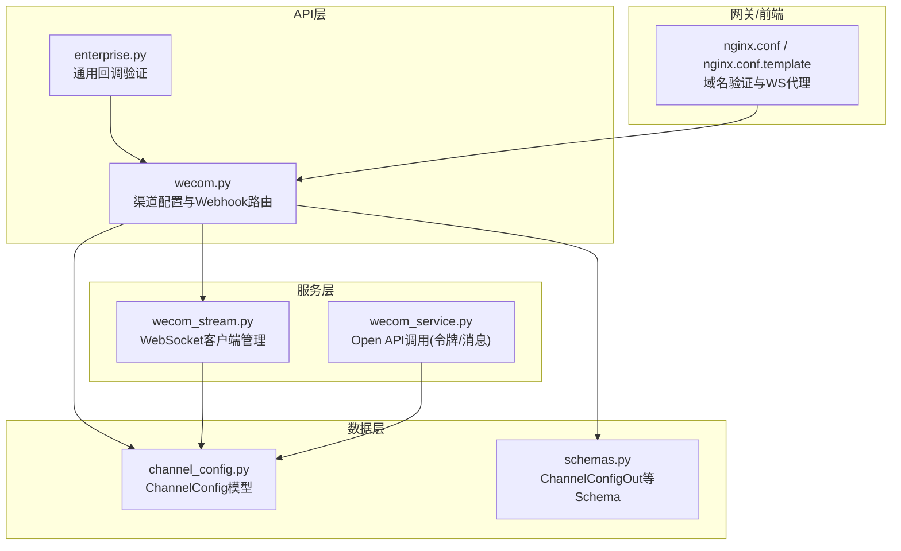
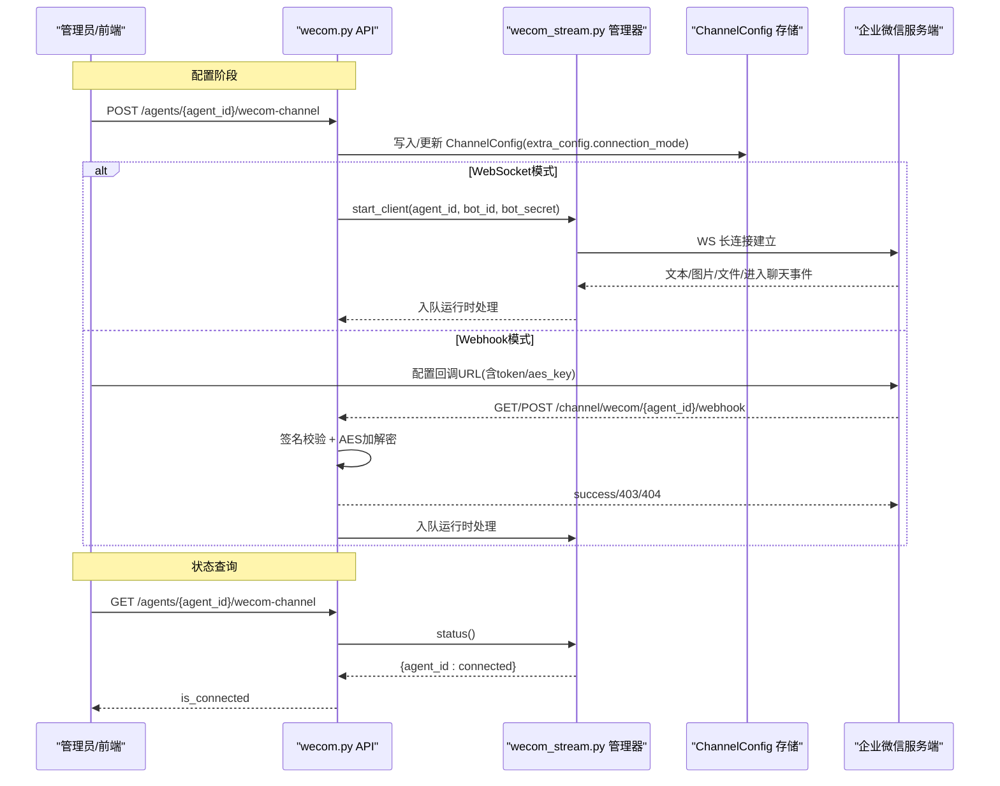
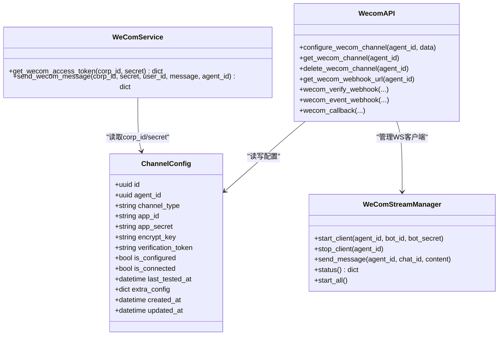

# 渠道配置管理API

<cite>
**本文引用的文件**   
- [backend/app/api/wecom.py](file://backend/app/api/wecom.py)
- [backend/app/services/wecom_stream.py](file://backend/app/services/wecom_stream.py)
- [backend/app/services/wecom_service.py](file://backend/app/services/wecom_service.py)
- [backend/app/models/channel_config.py](file://backend/app/models/channel_config.py)
- [backend/app/schemas/schemas.py](file://backend/app/schemas/schemas.py)
- [backend/app/api/enterprise.py](file://backend/app/api/enterprise.py)
- [frontend/nginx.conf.template](file://frontend/nginx.conf.template)
- [deploy/nginx/nginx.conf](file://deploy/nginx/nginx.conf)
- [backend/tests/test_wecom_channel_api.py](file://backend/tests/test_wecom_channel_api.py)
- [backend/tests/test_wecom_stream.py](file://backend/tests/test_wecom_stream.py)
</cite>

## 目录
1. [简介](#简介)
2. [项目结构](#项目结构)
3. [核心组件](#核心组件)
4. [架构总览](#架构总览)
5. [详细组件分析](#详细组件分析)
6. [依赖关系分析](#依赖关系分析)
7. [性能与可靠性](#性能与可靠性)
8. [故障排查指南](#故障排查指南)
9. [结论](#结论)
10. [附录：部署场景与最佳实践](#附录部署场景与最佳实践)

## 简介
本文件为企业微信（WeCom）渠道配置的完整API文档，覆盖两种连接模式：
- WebSocket模式（AI Bot长连接）：仅需bot_id与bot_secret，无需回调URL。
- Webhook模式（传统回调）：需要corp_id、secret、token、encoding_aes_key等参数，并需公网可访问的回调地址。

文档包含：
- 配置CRUD接口定义与字段说明
- 连接模式差异、配置校验逻辑与状态管理
- 连接状态查询与错误处理机制
- 不同部署场景的配置示例与最佳实践

## 项目结构
企业微信渠道相关代码主要分布在以下模块：
- API路由层：负责HTTP请求解析、鉴权、参数校验、响应封装
- 服务层：WebSocket客户端管理、消息收发、OAuth与Token获取
- 数据模型与Schema：持久化结构与API输入输出契约
- 前端与Nginx：域名验证文件托管、WebSocket代理、回调路由

图表来源
- [backend/app/api/wecom.py:153-242](file://backend/app/api/wecom.py#L153-L242)
- [backend/app/services/wecom_stream.py:65-147](file://backend/app/services/wecom_stream.py#L65-L147)
- [backend/app/services/wecom_service.py:7-30](file://backend/app/services/wecom_service.py#L7-L30)
- [backend/app/models/channel_config.py:13-48](file://backend/app/models/channel_config.py#L13-L48)
- [backend/app/schemas/schemas.py:460-474](file://backend/app/schemas/schemas.py#L460-L474)
- [frontend/nginx.conf.template:45-53](file://frontend/nginx.conf.template#L45-L53)
- [deploy/nginx/nginx.conf:45-53](file://deploy/nginx/nginx.conf#L45-L53)

章节来源
- [backend/app/api/wecom.py:1-42](file://backend/app/api/wecom.py#L1-L42)
- [backend/app/services/wecom_stream.py:1-16](file://backend/app/services/wecom_stream.py#L1-L16)
- [backend/app/models/channel_config.py:1-26](file://backend/app/models/channel_config.py#L1-L26)
- [backend/app/schemas/schemas.py:450-474](file://backend/app/schemas/schemas.py#L450-L474)

## 核心组件
- WeCom渠道配置CRUD：创建、读取、删除渠道配置，支持WebSocket与Webhook双模式
- Webhook事件接收：签名校验、AES加解密、消息去重、会话建立与运行时入队
- WebSocket长连接管理：自动连接、心跳、断线重连、消息分发与回复
- OAuth/SSO回调：企业微信登录授权流程
- 域名验证文件托管：多租户共享域名下按token返回验证文件内容

章节来源
- [backend/app/api/wecom.py:153-242](file://backend/app/api/wecom.py#L153-L242)
- [backend/app/api/wecom.py:309-450](file://backend/app/api/wecom.py#L309-L450)
- [backend/app/services/wecom_stream.py:65-147](file://backend/app/services/wecom_stream.py#L65-L147)
- [backend/app/api/wecom.py:111-148](file://backend/app/api/wecom.py#L111-L148)
- [backend/app/api/wecom.py:606-691](file://backend/app/api/wecom.py#L606-L691)

## 架构总览
下图展示了企业微信渠道在两种模式下的整体交互流程与关键组件。

图表来源
- [backend/app/api/wecom.py:153-242](file://backend/app/api/wecom.py#L153-L242)
- [backend/app/api/wecom.py:245-278](file://backend/app/api/wecom.py#L245-L278)
- [backend/app/api/wecom.py:309-450](file://backend/app/api/wecom.py#L309-L450)
- [backend/app/services/wecom_stream.py:65-147](file://backend/app/services/wecom_stream.py#L65-L147)

## 详细组件分析

### 配置CRUD接口
- 创建/更新渠道配置
  - 方法：POST /agents/{agent_id}/wecom-channel
  - 请求体字段：
    - WebSocket模式：bot_id、bot_secret
    - Webhook模式：corp_id、secret、token、encoding_aes_key、wecom_agent_id（可选）
  - 校验逻辑：至少一种模式必须完整；若已存在记录则更新，否则新建
  - 行为：WebSocket模式下异步启动客户端；Webhook模式停止WS客户端
  - 返回：ChannelConfigOut（含is_configured、is_connected、extra_config等）
- 读取渠道配置
  - 方法：GET /agents/{agent_id}/wecom-channel
  - 返回：ChannelConfigOut；WebSocket模式下is_connected由wecom_stream_manager.status()决定
- 删除渠道配置
  - 方法：DELETE /agents/{agent_id}/wecom-channel
  - 行为：停止WS客户端并删除记录
- 获取Webhook回调URL
  - 方法：GET /agents/{agent_id}/wecom-channel/webhook-url
  - 返回：{webhook_url}，用于在企业微信后台配置“接收消息服务器URL”

章节来源
- [backend/app/api/wecom.py:153-242](file://backend/app/api/wecom.py#L153-L242)
- [backend/app/api/wecom.py:245-278](file://backend/app/api/wecom.py#L245-L278)
- [backend/app/api/wecom.py:280-300](file://backend/app/api/wecom.py#L280-L300)
- [backend/app/schemas/schemas.py:460-474](file://backend/app/schemas/schemas.py#L460-L474)

### Webhook事件接收与处理
- 回调验证（GET）
  - 路径：/channel/wecom/{agent_id}/webhook
  - 参数：msg_signature、timestamp、nonce、echostr
  - 流程：签名校验 -> AES解密 -> 返回明文
- 事件接收（POST）
  - 路径：/channel/wecom/{agent_id}/webhook
  - 流程：解析XML -> 签名校验 -> AES解密 -> 解析MsgType -> 文本消息入队 -> 客服事件异步拉取
  - 去重：基于msg_id或token的去重集合，避免重复处理
  - 错误处理：解析失败或签名不匹配时返回相应状态码或success

章节来源
- [backend/app/api/wecom.py:309-345](file://backend/app/api/wecom.py#L309-L345)
- [backend/app/api/wecom.py:347-450](file://backend/app/api/wecom.py#L347-L450)

### WebSocket长连接管理
- 客户端生命周期
  - 启动：start_client(agent_id, bot_id, bot_secret)，内部创建任务运行_run_client
  - 连接：使用wecom-aibot-sdk-python的WSClient，无限重连、心跳间隔30s
  - 断开：stop_client取消任务并断开连接
- 消息处理
  - 文本：提取sender_id、chat_type、chat_id，构建会话，入队运行时处理，支持群聊/私聊
  - 图片/文件：暂不支持，返回提示
  - 进入聊天：发送欢迎语（来自Agent.welcome_message）
- 状态查询
  - status()返回各agent的连接布尔值，供GET接口填充is_connected

章节来源
- [backend/app/services/wecom_stream.py:65-147](file://backend/app/services/wecom_stream.py#L65-L147)
- [backend/app/services/wecom_stream.py:148-283](file://backend/app/services/wecom_stream.py#L148-L283)
- [backend/app/services/wecom_stream.py:284-347](file://backend/app/services/wecom_stream.py#L284-L347)
- [backend/app/services/wecom_stream.py:352-427](file://backend/app/services/wecom_stream.py#L352-L427)

### 域名验证文件托管
- 目的：企业微信要求自建应用可信域名根路径提供WW_verify_<token>.txt文件
- 实现：/api/wecom-verify/{filename}，根据IdentityProvider配置中的wecom_verify_files返回对应内容
- 安全：文件名严格正则白名单校验，防止路径穿越

章节来源
- [backend/app/api/wecom.py:111-148](file://backend/app/api/wecom.py#L111-L148)

### OAuth/SSO回调
- 路径：/api/auth/wecom/callback
- 流程：code换access_token -> 获取用户信息 -> 查找或创建用户 -> 生成平台JWT -> 更新SSO会话或直接返回登录结果

章节来源
- [backend/app/api/wecom.py:606-691](file://backend/app/api/wecom.py#L606-L691)

### 通用回调验证（企业级）
- 路径：/api/enterprise/org/wecom-callback/{token}?aes_key=...
- 用途：解锁企业可信IP配置，允许后续将API服务器IP加入白名单

章节来源
- [backend/app/api/enterprise.py:1878-1906](file://backend/app/api/enterprise.py#L1878-L1906)

## 依赖关系分析
- API层依赖：
  - wecom.py依赖wecom_stream_manager进行WS状态管理与消息入队
  - enterprise.py复用wecom.py中的AES与签名函数
- 服务层依赖：
  - wecom_stream.py依赖数据库读取ChannelConfig以启动所有WS客户端
  - wecom_service.py通过httpx调用企业微信Open API获取access_token与发消息
- 数据层依赖：
  - channel_config.py定义ChannelConfig表结构及唯一约束
  - schemas.py定义ChannelConfigOut等响应契约

图表来源
- [backend/app/models/channel_config.py:13-48](file://backend/app/models/channel_config.py#L13-L48)
- [backend/app/services/wecom_stream.py:65-147](file://backend/app/services/wecom_stream.py#L65-L147)
- [backend/app/services/wecom_service.py:7-30](file://backend/app/services/wecom_service.py#L7-L30)
- [backend/app/api/wecom.py:153-242](file://backend/app/api/wecom.py#L153-L242)

章节来源
- [backend/app/models/channel_config.py:1-52](file://backend/app/models/channel_config.py#L1-L52)
- [backend/app/services/wecom_stream.py:1-430](file://backend/app/services/wecom_stream.py#L1-L430)
- [backend/app/services/wecom_service.py:1-87](file://backend/app/services/wecom_service.py#L1-L87)
- [backend/app/api/wecom.py:1-691](file://backend/app/api/wecom.py#L1-L691)

## 性能与可靠性
- WebSocket连接
  - 无限重连策略，指数退避上限2分钟，心跳30秒
  - 代理层需保持长连接（如Nginx proxy_read_timeout 3600s）
- 消息处理
  - 文本消息入队异步处理，避免阻塞回调响应
  - 去重集合限制大小，定期清理，降低内存占用
- 错误处理
  - 签名不匹配返回403
  - XML解析失败返回success或500，避免误判
  - WS客户端异常捕获并记录堆栈，保障稳定性

章节来源
- [backend/app/services/wecom_stream.py:242-283](file://backend/app/services/wecom_stream.py#L242-L283)
- [backend/app/api/wecom.py:347-450](file://backend/app/api/wecom.py#L347-L450)
- [frontend/nginx.conf.template:69-81](file://frontend/nginx.conf.template#L69-L81)

## 故障排查指南
- 无法建立WS连接
  - 检查bot_id与bot_secret是否正确
  - 确认网络无代理干扰（SDK已禁用系统代理）
  - 查看日志中“Starting client”“Connection error”“reconnecting”
- Webhook回调失败
  - 确认回调URL公网可达且路径正确
  - 检查token与encoding_aes_key是否与后台一致
  - 查看签名校验失败日志与AES解密异常
- 域名验证失败
  - 确保Nginx规则拦截根路径WW_verify_*.txt并转发到后端
  - 确认IdentityProvider配置中包含对应filename与content
- 状态查询为未连接
  - WebSocket模式下is_connected取决于wecom_stream_manager.status()
  - Webhook模式下is_connected始终为False

章节来源
- [backend/app/services/wecom_stream.py:242-283](file://backend/app/services/wecom_stream.py#L242-L283)
- [backend/app/api/wecom.py:309-345](file://backend/app/api/wecom.py#L309-L345)
- [backend/app/api/wecom.py:111-148](file://backend/app/api/wecom.py#L111-L148)
- [frontend/nginx.conf.template:45-53](file://frontend/nginx.conf.template#L45-L53)

## 结论
企业微信渠道配置提供了灵活的WebSocket与Webhook双模式接入方案。WebSocket模式适合无公网回调的场景，具备自动重连与长连接优势；Webhook模式兼容传统回调流程，适用于已有回调基础设施的环境。通过统一的CRUD接口与状态查询，结合严格的签名校验与AES加解密，保障了安全性与稳定性。部署时需关注域名验证与代理超时配置，以确保端到端连通性。

## 附录：部署场景与最佳实践

### 部署场景一：纯内网/无公网回调（推荐WebSocket）
- 配置步骤
  - 在Agent设置中填写bot_id与bot_secret
  - 保存后系统自动启动WS客户端并连接企业微信
- Nginx配置要点
  - 无需配置回调URL
  - 如需其他WS通道，确保proxy_http_version与Upgrade头正确
- 优点
  - 无需公网域名与回调URL
  - 自动重连与心跳，稳定性高

章节来源
- [backend/app/api/wecom.py:153-242](file://backend/app/api/wecom.py#L153-L242)
- [frontend/nginx.conf.template:69-81](file://frontend/nginx.conf.template#L69-L81)

### 部署场景二：有公网回调（Webhook）
- 配置步骤
  - 在企业微信后台配置“接收消息服务器URL”为/api/channel/wecom/{agent_id}/webhook
  - 填写token与EncodingAESKey
  - 完成域名验证（上传WW_verify_*.txt）
- Nginx配置要点
  - 根路径拦截WW_verify_*.txt并转发到后端
  - 确保回调URL可被企业微信访问
- 优点
  - 兼容现有回调基础设施
  - 便于审计与中间件集成

章节来源
- [backend/app/api/wecom.py:309-450](file://backend/app/api/wecom.py#L309-L450)
- [frontend/nginx.conf.template:45-53](file://frontend/nginx.conf.template#L45-L53)

### 部署场景三：多租户SaaS（域名验证文件托管）
- 配置步骤
  - 在各租户IdentityProvider配置中设置wecom_verify_files映射
  - 通过/api/wecom-verify/{filename}统一返回验证文件内容
- 优点
  - 单域名多租户共享，简化运维
  - 严格白名单校验，防止注入

章节来源
- [backend/app/api/wecom.py:111-148](file://backend/app/api/wecom.py#L111-L148)

### 最佳实践
- 密钥管理
  - bot_secret、encoding_aes_key等敏感字段应加密存储
  - 定期轮换密钥并更新配置
- 监控与告警
  - 监控WS连接状态与重连次数
  - 监控回调签名失败率与解密异常
- 扩展性
  - 使用extra_config存储扩展字段，避免破坏Schema
  - 对图片/文件消息预留处理入口

章节来源
- [backend/app/models/channel_config.py:39-41](file://backend/app/models/channel_config.py#L39-L41)
- [backend/app/services/wecom_stream.py:189-218](file://backend/app/services/wecom_stream.py#L189-L218)