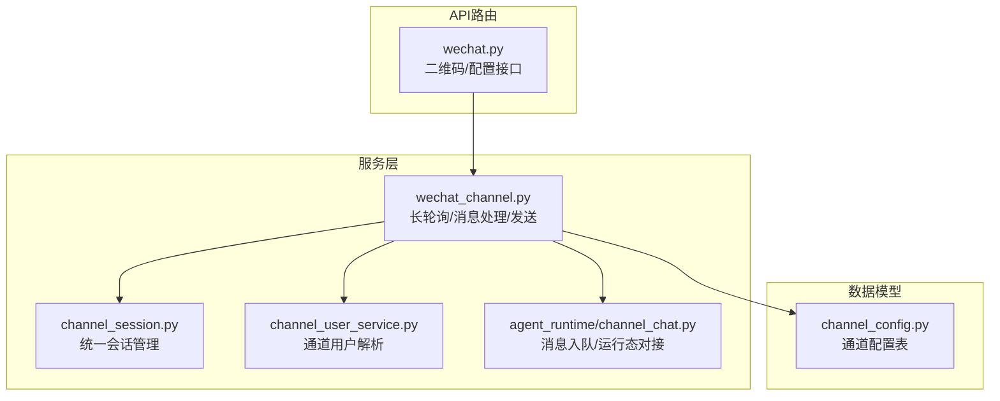
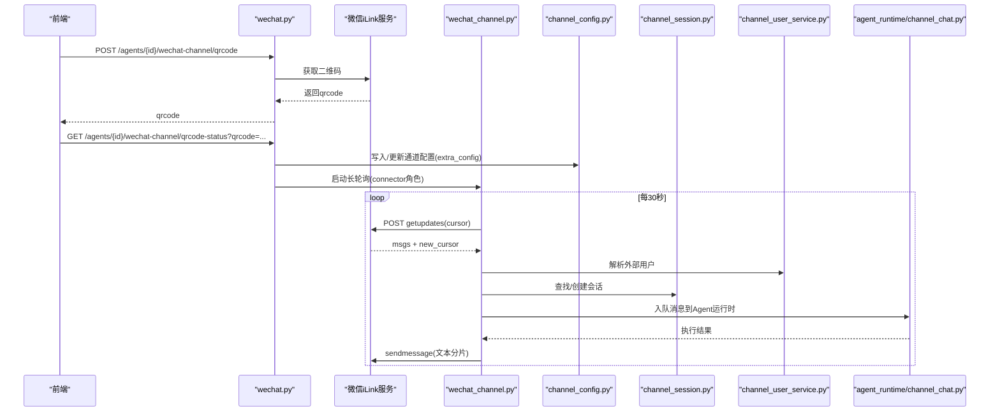
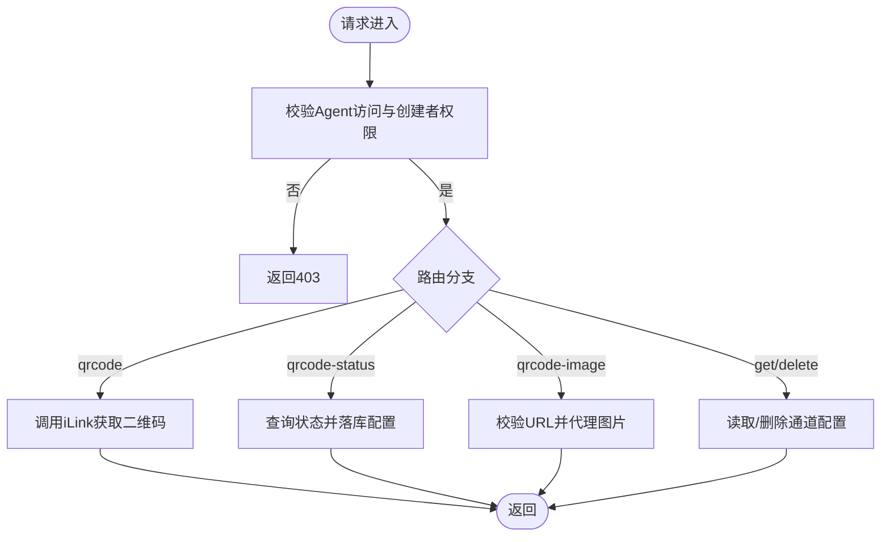
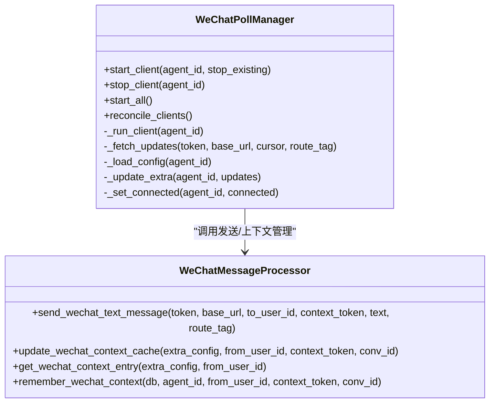
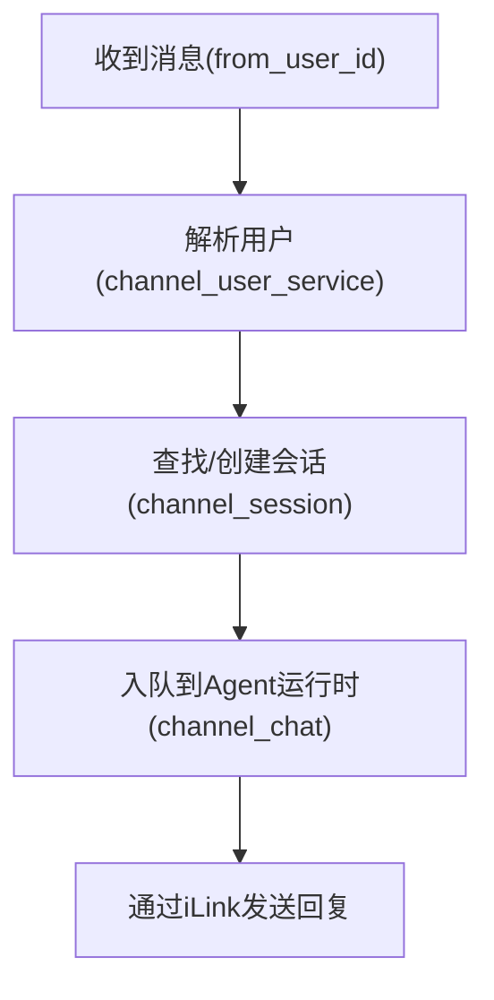
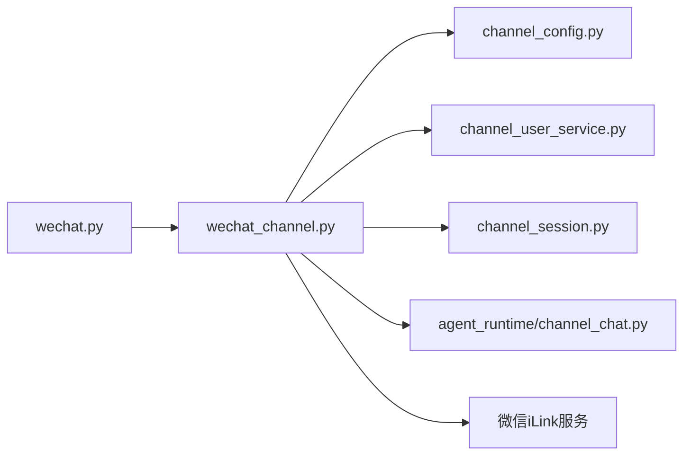

# 微信集成API

<cite>
**本文引用的文件**   
- [backend/app/api/wechat.py](file://backend/app/api/wechat.py)
- [backend/app/services/wechat_channel.py](file://backend/app/services/wechat_channel.py)
- [backend/app/models/channel_config.py](file://backend/app/models/channel_config.py)
- [backend/alembic/versions/029_add_wechat_channel_support.py](file://backend/alembic/versions/029_add_wechat_channel_support.py)
- [backend/app/services/channel_session.py](file://backend/app/services/channel_session.py)
- [backend/app/services/channel_user_service.py](file://backend/app/services/channel_user_service.py)
- [backend/app/services/agent_runtime/channel_chat.py](file://backend/app/services/agent_runtime/channel_chat.py)
</cite>

## 目录
1. [简介](#简介)
2. [项目结构](#项目结构)
3. [核心组件](#核心组件)
4. [架构总览](#架构总览)
5. [详细组件分析](#详细组件分析)
6. [依赖关系分析](#依赖关系分析)
7. [性能考虑](#性能考虑)
8. [故障排查指南](#故障排查指南)
9. [结论](#结论)
10. [附录](#附录)

## 简介
本文件为Clawith平台的“微信渠道”集成API文档，聚焦以下能力：
- 微信公众号/iLink机器人接入与二维码授权流程
- 消息接收、上下文关联与回复（长轮询拉取）
- 用户身份解析与会话管理（跨平台统一会话）
- 文本消息发送（含超长文本拆分）
- 配置管理与连接状态维护

说明：当前仓库实现基于微信iLink协议进行长轮询与消息收发，未包含传统公众号OAuth网页授权、模板消息、菜单定制等能力。若需企业级功能扩展，可在现有通道层基础上叠加。

## 项目结构
微信渠道相关代码主要分布在后端FastAPI路由与服务层：
- API路由：提供二维码生成、状态查询、图片代理、通道配置读取与删除
- 服务层：长轮询客户端、消息处理、上下文缓存、文本发送
- 数据模型：通道配置持久化（channel_configs表）
- 运行时集成：统一会话创建、用户解析、消息入队到Agent运行时

**图表来源** 
- [backend/app/api/wechat.py:54-172](file://backend/app/api/wechat.py#L54-L172)
- [backend/app/services/wechat_channel.py:275-449](file://backend/app/services/wechat_channel.py#L275-L449)
- [backend/app/models/channel_config.py:13-51](file://backend/app/models/channel_config.py#L13-L51)

**章节来源**
- [backend/app/api/wechat.py:1-217](file://backend/app/api/wechat.py#L1-L217)
- [backend/app/services/wechat_channel.py:1-450](file://backend/app/services/wechat_channel.py#L1-L450)
- [backend/app/models/channel_config.py:1-52](file://backend/app/models/channel_config.py#L1-L52)

## 核心组件
- 微信iLink通道API路由
  - 二维码获取、状态轮询、图片代理、通道配置查询与删除
- 长轮询管理器
  - 按Agent维度启动/停止拉取任务，维护连接状态与游标
- 消息处理流水线
  - 提取文本、解析用户、创建或复用会话、入队到Agent运行时
- 文本发送器
  - 按协议限制拆分超长文本并逐条发送
- 通道配置与迁移
  - channel_type枚举扩展、extra_config存储上下文缓存与连接信息

**章节来源**
- [backend/app/api/wechat.py:54-217](file://backend/app/api/wechat.py#L54-L217)
- [backend/app/services/wechat_channel.py:74-118](file://backend/app/services/wechat_channel.py#L74-L118)
- [backend/app/services/wechat_channel.py:275-449](file://backend/app/services/wechat_channel.py#L275-L449)
- [backend/alembic/versions/029_add_wechat_channel_support.py:20-22](file://backend/alembic/versions/029_add_wechat_channel_support.py#L20-L22)

## 架构总览
微信渠道整体流程：前端调用后端API完成二维码授权；后端通过iLink长轮询拉取消息；消息经用户解析与会话管理后进入Agent运行时；结果通过iLink发送回微信。

**图表来源** 
- [backend/app/api/wechat.py:54-151](file://backend/app/api/wechat.py#L54-L151)
- [backend/app/services/wechat_channel.py:330-406](file://backend/app/services/wechat_channel.py#L330-L406)
- [backend/app/services/channel_session.py:24-184](file://backend/app/services/channel_session.py#L24-L184)
- [backend/app/services/channel_user_service.py:73-200](file://backend/app/services/channel_user_service.py#L73-L200)
- [backend/app/services/agent_runtime/channel_chat.py:104-154](file://backend/app/services/agent_runtime/channel_chat.py#L104-L154)

## 详细组件分析

### 微信通道API路由（wechat.py）
- 功能要点
  - 生成二维码：调用iLink获取二维码，支持route_tag透传
  - 查询二维码状态：成功后持久化通道配置（app_id、bot_token、baseurl、context缓存键等），并按角色触发连接器启动
  - 二维码图片代理：校验URL白名单，转发图片响应
  - 通道配置查询与删除：读取ChannelConfig，删除时停止对应长轮询任务
- 权限控制
  - 仅Agent创建者可配置或删除通道
- 错误处理
  - HTTP异常直接透传上游状态码与错误信息

**图表来源** 
- [backend/app/api/wechat.py:54-172](file://backend/app/api/wechat.py#L54-L172)

**章节来源**
- [backend/app/api/wechat.py:54-217](file://backend/app/api/wechat.py#L54-L217)

### 长轮询与消息处理（wechat_channel.py）
- 长轮询管理器
  - 按Agent维度维护任务与连接状态，周期性reconcile
  - 失败指数退避重试，会话过期标记并清理cursor
- 消息处理
  - 过滤自身消息、提取文本、确保context_token存在
  - 解析用户、创建/复用会话、记录上下文缓存（最近会话token与conv_id）
  - 入队至Agent运行时，携带channel_delivery_target用于定向回复
- 文本发送
  - 按2000字符限制保守切分（优先换行/空格断点），逐条发送

**图表来源** 
- [backend/app/services/wechat_channel.py:275-449](file://backend/app/services/wechat_channel.py#L275-L449)
- [backend/app/services/wechat_channel.py:74-118](file://backend/app/services/wechat_channel.py#L74-L118)
- [backend/app/services/wechat_channel.py:120-178](file://backend/app/services/wechat_channel.py#L120-L178)

**章节来源**
- [backend/app/services/wechat_channel.py:74-118](file://backend/app/services/wechat_channel.py#L74-L118)
- [backend/app/services/wechat_channel.py:120-178](file://backend/app/services/wechat_channel.py#L120-L178)
- [backend/app/services/wechat_channel.py:275-449](file://backend/app/services/wechat_channel.py#L275-L449)

### 统一会话与用户解析（channel_session.py、channel_user_service.py）
- 统一会话
  - 根据tenant+agent+external_conv_id唯一性保证会话复用
  - 支持群聊与会话类型校验，修复历史归属问题
- 用户解析
  - 优先级：已绑定User的OrgMember → 邮箱/手机号匹配 → 懒注册新用户
  - 兼容不同通道的unionid/open_id/external_id策略

**图表来源** 
- [backend/app/services/channel_user_service.py:73-200](file://backend/app/services/channel_user_service.py#L73-L200)
- [backend/app/services/channel_session.py:24-184](file://backend/app/services/channel_session.py#L24-L184)
- [backend/app/services/agent_runtime/channel_chat.py:104-154](file://backend/app/services/agent_runtime/channel_chat.py#L104-L154)

**章节来源**
- [backend/app/services/channel_session.py:24-184](file://backend/app/services/channel_session.py#L24-L184)
- [backend/app/services/channel_user_service.py:73-200](file://backend/app/services/channel_user_service.py#L73-L200)

### 通道配置模型与迁移（channel_config.py、029_add_wechat_channel_support.py）
- ChannelConfig
  - 字段：agent_id、channel_type、app_id、app_secret、is_configured、is_connected、extra_config(JSON)
  - 唯一约束：(agent_id, channel_type)
- 迁移
  - 向channel_type_enum追加wechat值

**章节来源**
- [backend/app/models/channel_config.py:13-51](file://backend/app/models/channel_config.py#L13-L51)
- [backend/alembic/versions/029_add_wechat_channel_support.py:20-22](file://backend/alembic/versions/029_add_wechat_channel_support.py#L20-L22)

## 依赖关系分析
- API路由依赖服务层：二维码与配置操作委托给wechat_channel.py
- 服务层依赖：
  - 数据库：ChannelConfig读写、Agent/LLM模型加载
  - 通道用户与会话：channel_user_service.py、channel_session.py
  - Agent运行时：enqueue_channel_chat_runtime将消息入队
- 外部依赖：微信iLink服务（HTTPS）

**图表来源** 
- [backend/app/api/wechat.py:54-217](file://backend/app/api/wechat.py#L54-L217)
- [backend/app/services/wechat_channel.py:275-449](file://backend/app/services/wechat_channel.py#L275-L449)

**章节来源**
- [backend/app/api/wechat.py:54-217](file://backend/app/api/wechat.py#L54-L217)
- [backend/app/services/wechat_channel.py:275-449](file://backend/app/services/wechat_channel.py#L275-L449)

## 性能考虑
- 长轮询重试采用指数退避，避免雪崩
- 文本发送按2000字符切分，减少单次负载
- 上下文缓存限制条目数量，防止内存膨胀
- 数据库连接在慢调用前释放，降低阻塞风险

[本节为通用指导，不直接分析具体文件]

## 故障排查指南
- 二维码无法获取
  - 检查iLink基础URL与网络可达性
  - 确认route_tag透传是否正确
- 二维码状态一直未确认
  - 确认扫码流程是否完成
  - 检查extra_config中bot_token/baseurl是否写入成功
- 长轮询频繁断开
  - 关注session_expired标志与cursor重置
  - 查看日志中的WeChatSessionExpiredError与HTTP状态码
- 消息未入队
  - 检查context_token是否存在
  - 确认Agent与模型可用、租户范围正确
- 回复未送达
  - 核对to_user_id与context_token
  - 检查文本长度与分片逻辑

**章节来源**
- [backend/app/services/wechat_channel.py:330-406](file://backend/app/services/wechat_channel.py#L330-L406)
- [backend/app/services/agent_runtime/channel_chat.py:104-154](file://backend/app/services/agent_runtime/channel_chat.py#L104-L154)

## 结论
当前微信渠道以iLink为核心，实现了二维码授权、长轮询消息接收、统一会话与用户解析、文本回复等关键能力。该实现具备良好的可扩展性与稳定性，便于后续叠加更多媒体与企业级能力。

[本节为总结，不直接分析具体文件]

## 附录

### API定义（微信通道）
- 生成二维码
  - 方法：POST
  - 路径：/agents/{agent_id}/wechat-channel/qrcode
  - 鉴权：当前登录用户需具备Agent访问权限且为创建者
  - 请求体：可选data.route_tag
  - 响应：二维码相关信息
- 查询二维码状态
  - 方法：GET
  - 路径：/agents/{agent_id}/wechat-channel/qrcode-status
  - 参数：qrcode、可选route_tag
  - 行为：确认后写入通道配置，必要时启动连接器
- 获取二维码图片
  - 方法：GET
  - 路径：/agents/{agent_id}/wechat-channel/qrcode-image
  - 参数：url（需为微信官方域名）
  - 响应：图片流
- 获取通道配置
  - 方法：GET
  - 路径：/agents/{agent_id}/wechat-channel
  - 响应：ChannelConfigOut
- 删除通道配置
  - 方法：DELETE
  - 路径：/agents/{agent_id}/wechat-channel
  - 行为：停止长轮询并删除配置

**章节来源**
- [backend/app/api/wechat.py:54-217](file://backend/app/api/wechat.py#L54-L217)

### 开发者配置与安全注意事项
- 微信公众平台/iLink配置
  - 在微信侧启用iLink机器人，获取bot_token与baseurl
  - 将baseurl与bot_token写入ChannelConfig.extra_config
- 签名与验证
  - 当前实现使用AuthorizationType与Bearer Token鉴权
  - 二维码图片URL需严格白名单校验
- 安全建议
  - 保护bot_token与baseurl，避免泄露
  - 合理设置超时与重试策略
  - 对来自外部的URL进行严格校验

[本节为通用指导，不直接分析具体文件]