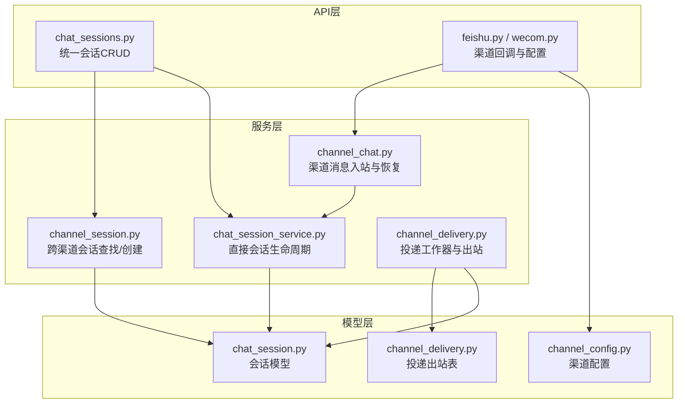
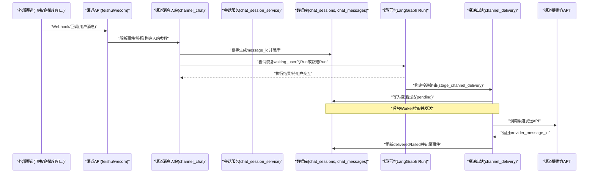
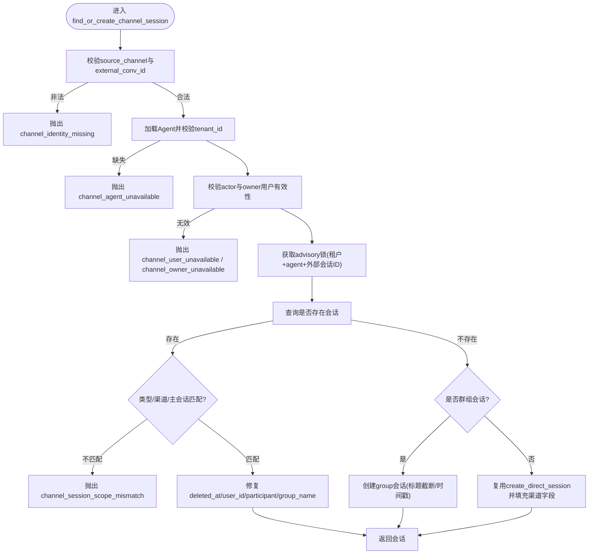
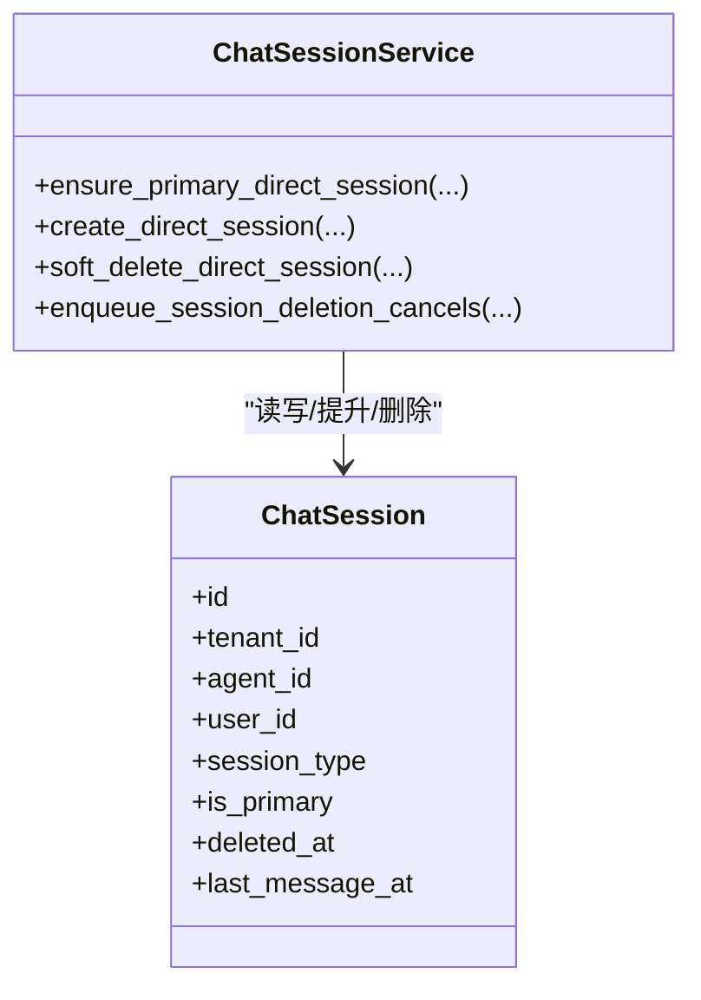
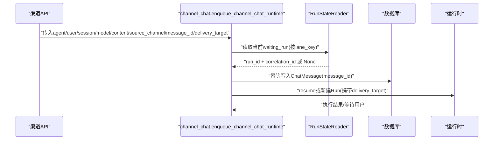
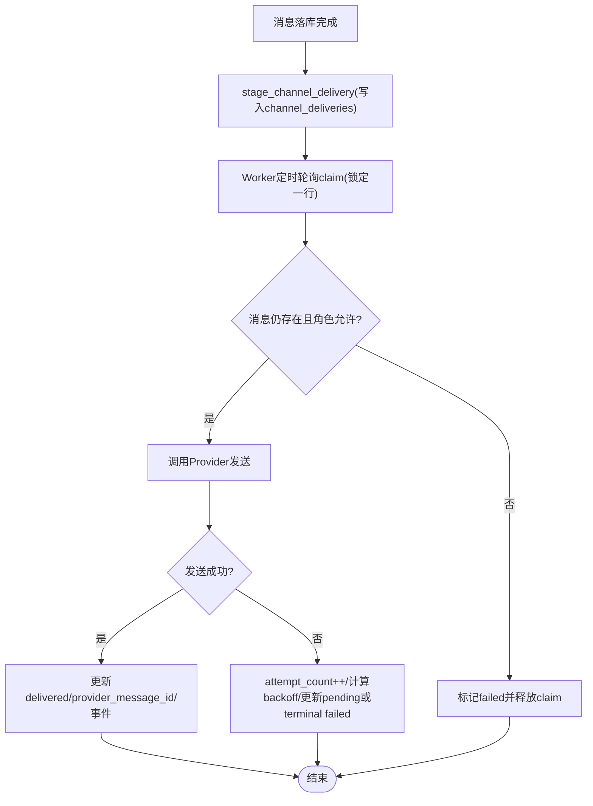
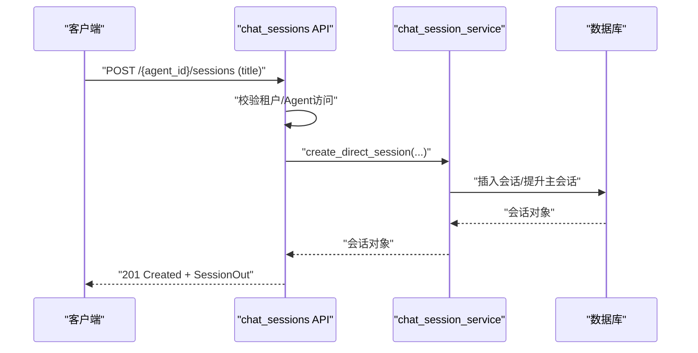
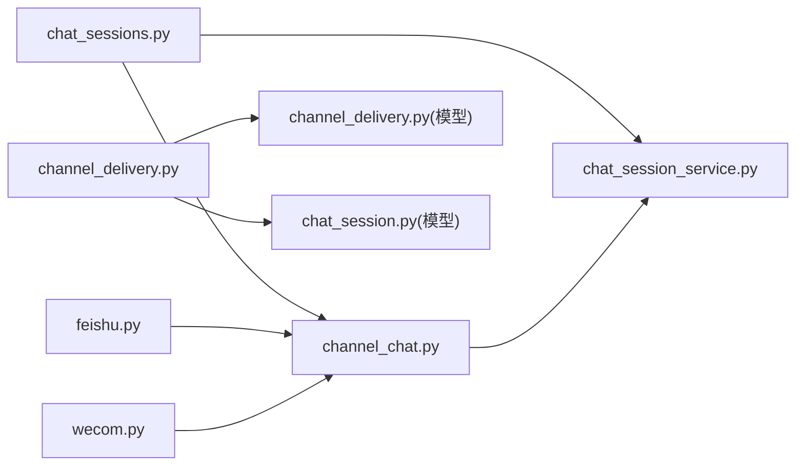

# 渠道会话API

<cite>
**本文引用的文件**
- [backend/app/services/channel_session.py](file://backend/app/services/channel_session.py)
- [backend/app/models/chat_session.py](file://backend/app/models/chat_session.py)
- [backend/app/api/chat_sessions.py](file://backend/app/api/chat_sessions.py)
- [backend/app/services/chat_session_service.py](file://backend/app/services/chat_session_service.py)
- [backend/app/models/channel_config.py](file://backend/app/models/channel_config.py)
- [backend/app/models/channel_delivery.py](file://backend/app/models/channel_delivery.py)
- [backend/app/services/agent_runtime/channel_chat.py](file://backend/app/services/agent_runtime/channel_chat.py)
- [backend/app/services/agent_runtime/channel_delivery.py](file://backend/app/services/agent_runtime/channel_delivery.py)
- [backend/app/api/feishu.py](file://backend/app/api/feishu.py)
- [backend/app/api/wecom.py](file://backend/app/api/wecom.py)
</cite>

## 目录
1. [简介](#简介)
2. [项目结构](#项目结构)
3. [核心组件](#核心组件)
4. [架构总览](#架构总览)
5. [详细组件分析](#详细组件分析)
6. [依赖关系分析](#依赖关系分析)
7. [性能考量](#性能考量)
8. [故障排查指南](#故障排查指南)
9. [结论](#结论)
10. [附录](#附录)

## 简介
本文件为Clawith平台“渠道会话管理”的完整API与实现文档，聚焦ChannelSession的生命周期、消息路由、状态同步与多渠道关联。内容覆盖：
- 会话创建、更新、销毁流程（含软删除）
- 外部渠道消息接入与运行时恢复（等待用户态）
- 多渠道投递（Outbox模式）与重试幂等
- 会话持久化策略、内存与并发控制、性能优化
- 监控接口、调试工具与审计能力
- 企业级特性：租户隔离、权限控制、数据隔离

## 项目结构
围绕渠道会话的核心代码分布在以下模块：
- API层：统一会话管理与渠道回调入口
- 服务层：会话生命周期、渠道消息入站、投递工作器
- 模型层：会话、配置、投递出站表
- 运行时集成：通道消息入站与运行态读取



图表来源
- [backend/app/api/chat_sessions.py:1-800](file://backend/app/api/chat_sessions.py#L1-L800)
- [backend/app/api/feishu.py:1-200](file://backend/app/api/feishu.py#L1-L200)
- [backend/app/api/wecom.py:1-42](file://backend/app/api/wecom.py#L1-L42)
- [backend/app/services/channel_session.py:1-184](file://backend/app/services/channel_session.py#L1-L184)
- [backend/app/services/chat_session_service.py:1-424](file://backend/app/services/chat_session_service.py#L1-L424)
- [backend/app/services/agent_runtime/channel_chat.py:1-162](file://backend/app/services/agent_runtime/channel_chat.py#L1-L162)
- [backend/app/services/agent_runtime/channel_delivery.py:1-429](file://backend/app/services/agent_runtime/channel_delivery.py#L1-L429)
- [backend/app/models/chat_session.py:1-116](file://backend/app/models/chat_session.py#L1-L116)
- [backend/app/models/channel_config.py:1-52](file://backend/app/models/channel_config.py#L1-L52)
- [backend/app/models/channel_delivery.py:1-169](file://backend/app/models/channel_delivery.py#L1-L169)

章节来源
- [backend/app/api/chat_sessions.py:1-800](file://backend/app/api/chat_sessions.py#L1-L800)
- [backend/app/services/channel_session.py:1-184](file://backend/app/services/channel_session.py#L1-L184)
- [backend/app/services/chat_session_service.py:1-424](file://backend/app/services/chat_session_service.py#L1-L424)
- [backend/app/models/chat_session.py:1-116](file://backend/app/models/chat_session.py#L1-L116)

## 核心组件
- ChannelSession（跨渠道会话）：基于外部会话ID与Agent维度进行幂等查找或创建，支持P2P与群组会话，强制租户隔离与参与者身份绑定。
- ChatSession（统一会话模型）：承载direct/group/a2a/trigger类型，维护主会话标记、最后阅读时间、软删除等。
- 直接会话服务：保证同一租户+Agent+用户的“主会话”唯一性，提供创建、提升为主、软删除与协作取消队列。
- 渠道消息入站：将外部事件映射为幂等的ChatMessage ID，并尝试恢复处于waiting_user状态的Run。
- 渠道投递出站：以Outbox模式记录投递任务，支持幂等键、退避重试、失败回写与事件上报。

章节来源
- [backend/app/services/channel_session.py:1-184](file://backend/app/services/channel_session.py#L1-L184)
- [backend/app/models/chat_session.py:1-116](file://backend/app/models/chat_session.py#L1-L116)
- [backend/app/services/chat_session_service.py:1-424](file://backend/app/services/chat_session_service.py#L1-L424)
- [backend/app/services/agent_runtime/channel_chat.py:1-162](file://backend/app/services/agent_runtime/channel_chat.py#L1-L162)
- [backend/app/services/agent_runtime/channel_delivery.py:1-429](file://backend/app/services/agent_runtime/channel_delivery.py#L1-L429)

## 架构总览
下图展示从外部渠道到内部运行时与持久化的端到端路径，以及双向的消息流。



图表来源
- [backend/app/api/feishu.py:1-200](file://backend/app/api/feishu.py#L1-L200)
- [backend/app/api/wecom.py:1-42](file://backend/app/api/wecom.py#L1-L42)
- [backend/app/services/agent_runtime/channel_chat.py:1-162](file://backend/app/services/agent_runtime/channel_chat.py#L1-L162)
- [backend/app/services/agent_runtime/channel_delivery.py:1-429](file://backend/app/services/agent_runtime/channel_delivery.py#L1-L429)
- [backend/app/models/channel_delivery.py:1-169](file://backend/app/models/channel_delivery.py#L1-L169)

## 详细组件分析

### 组件A：跨渠道会话查找与创建（ChannelSession）
- 功能要点
  - 基于(agent_id, external_conv_id)幂等定位会话；不存在则按is_group分支创建P2P或群组会话
  - 校验Agent与User的租户一致性，确保数据隔离
  - 使用PostgreSQL advisory锁避免并发重复创建
  - 对已存在会话进行修复：软删除恢复、P2P归属修正、群名更新
- 关键约束
  - source_channel长度≤20，external_conv_id长度≤200
  - 群组会话user_id为空，仅出现在“全部会话”视图
- 错误码
  - channel_identity_missing、channel_agent_unavailable、channel_user_unavailable、channel_owner_unavailable、channel_session_scope_mismatch



图表来源
- [backend/app/services/channel_session.py:24-180](file://backend/app/services/channel_session.py#L24-L180)

章节来源
- [backend/app/services/channel_session.py:1-184](file://backend/app/services/channel_session.py#L1-L184)

### 组件B：直接会话生命周期（Direct Session Service）
- 功能要点
  - ensure_primary_direct_session：优先复用已有主会话，否则提升最近活跃会话为新主会话，否则新建
  - create_direct_session：创建新会话，首个活跃会话自动成为主会话
  - soft_delete_direct_session：软删除并重建主会话，同时为相关前台/编排Run入队取消任务
- 并发控制
  - 通过pg_advisory_xact_lock序列化同一租户+Agent+用户的会话变更
- 协作取消
  - 递归收集根Run及其委派子Run，统一入队cancel



图表来源
- [backend/app/services/chat_session_service.py:136-323](file://backend/app/services/chat_session_service.py#L136-L323)
- [backend/app/models/chat_session.py:23-116](file://backend/app/models/chat_session.py#L23-L116)

章节来源
- [backend/app/services/chat_session_service.py:1-424](file://backend/app/services/chat_session_service.py#L1-L424)

### 组件C：渠道消息入站与运行时恢复（Channel Chat Intake）
- 功能要点
  - channel_message_id：根据agent_id与外部事件ID生成稳定的ChatMessage UUID，保障幂等
  - enqueue_channel_chat_runtime：若存在waiting_user的Run则resume，否则新建Run；携带source_channel与投递目标
  - _waiting_resume：权威读取LangGraph checkpoint中的waiting状态与correlation_id
- 错误处理
  - 多持有者、缺少correlation_id、运行时未启用等异常均抛出结构化错误



图表来源
- [backend/app/services/agent_runtime/channel_chat.py:34-154](file://backend/app/services/agent_runtime/channel_chat.py#L34-L154)

章节来源
- [backend/app/services/agent_runtime/channel_chat.py:1-162](file://backend/app/services/agent_runtime/channel_chat.py#L1-L162)

### 组件D：渠道投递出站与工作器（Channel Delivery Outbox）
- 功能要点
  - stage_channel_delivery：在消息事务中追加投递出站行，包含幂等键、下次尝试时间
  - ChannelDeliveryWorker：claim-pick-one、调用Provider发送、成功/失败回写、指数退避重试、事件上报
  - build_channel_delivery_route：校验channel与target合法性，防止越界投递
- 幂等与可靠性
  - delivery_id由(run_id, idempotency_key)派生
  - 唯一约束保证重复提交安全
  - 失败时记录error_code/error并设置next_attempt_at



图表来源
- [backend/app/services/agent_runtime/channel_delivery.py:143-429](file://backend/app/services/agent_runtime/channel_delivery.py#L143-L429)
- [backend/app/models/channel_delivery.py:1-169](file://backend/app/models/channel_delivery.py#L1-L169)

章节来源
- [backend/app/services/agent_runtime/channel_delivery.py:1-429](file://backend/app/services/agent_runtime/channel_delivery.py#L1-L429)
- [backend/app/models/channel_delivery.py:1-169](file://backend/app/models/channel_delivery.py#L1-L169)

### 组件E：统一会话API（REST）
- 主要端点
  - GET /api/agents/{agent_id}/sessions?scope=mine|all：列出会话，附带消息计数与未读数
  - POST /api/agents/{agent_id}/sessions：创建直接会话
  - PATCH /api/agents/{agent_id}/sessions/{session_id}：重命名会话
  - DELETE /api/agents/{agent_id}/sessions/{session_id}：软删除并取消前台协作
  - GET /api/agents/{agent_id}/sessions/{session_id}/runtime-state：查看当前活跃Run与可操作项
  - POST .../tool-executions/{execution_id}/reconcile：对未知工具执行进行人工确认
- 权限与范围
  - 基于租户与Agent访问控制；仅会话所有者或管理员可查看所有会话
  - scope=all需具备相应角色或为Agent创建者



图表来源
- [backend/app/api/chat_sessions.py:358-394](file://backend/app/api/chat_sessions.py#L358-L394)
- [backend/app/services/chat_session_service.py:175-210](file://backend/app/services/chat_session_service.py#L175-L210)

章节来源
- [backend/app/api/chat_sessions.py:1-800](file://backend/app/api/chat_sessions.py#L1-L800)

### 组件F：渠道配置与会话关联
- ChannelConfig：存储各渠道凭据与连接模式（webhook/websocket），支持扩展JSON字段
- 渠道回调（如飞书/企微）：接收事件后走channel_chat入站，建立或恢复会话与Run

```mermaid
classDiagram
class ChannelConfig {
+id
+agent_id
+channel_type
+app_id
+app_secret
+extra_config
+is_configured
+is_connected
}
class FeishuAPI {
"+configure_channel()"
"+get_channel_config()"
}
FeishuAPI --> ChannelConfig : "CRUD"
```

图表来源
- [backend/app/models/channel_config.py:13-52](file://backend/app/models/channel_config.py#L13-L52)
- [backend/app/api/feishu.py:130-188](file://backend/app/api/feishu.py#L130-L188)

章节来源
- [backend/app/models/channel_config.py:1-52](file://backend/app/models/channel_config.py#L1-52)
- [backend/app/api/feishu.py:1-200](file://backend/app/api/feishu.py#L1-L200)
- [backend/app/api/wecom.py:1-42](file://backend/app/api/wecom.py#L1-L42)

## 依赖关系分析
- API层依赖服务层进行业务编排，服务层依赖模型层进行持久化
- 渠道回调依赖channel_chat入站与channel_session查找/创建
- 投递出站依赖channel_delivery工作器与channel_delivery模型
- 运行时状态读取依赖RunStateReader与AgentRun/LangGraph检查点



图表来源
- [backend/app/api/chat_sessions.py:1-800](file://backend/app/api/chat_sessions.py#L1-L800)
- [backend/app/api/feishu.py:1-200](file://backend/app/api/feishu.py#L1-L200)
- [backend/app/api/wecom.py:1-42](file://backend/app/api/wecom.py#L1-L42)
- [backend/app/services/agent_runtime/channel_chat.py:1-162](file://backend/app/services/agent_runtime/channel_chat.py#L1-L162)
- [backend/app/services/agent_runtime/channel_delivery.py:1-429](file://backend/app/services/agent_runtime/channel_delivery.py#L1-L429)
- [backend/app/models/channel_delivery.py:1-169](file://backend/app/models/channel_delivery.py#L1-L169)
- [backend/app/models/chat_session.py:1-116](file://backend/app/models/chat_session.py#L1-L116)

章节来源
- [backend/app/api/chat_sessions.py:1-800](file://backend/app/api/chat_sessions.py#L1-L800)
- [backend/app/services/agent_runtime/channel_chat.py:1-162](file://backend/app/services/agent_runtime/channel_chat.py#L1-L162)
- [backend/app/services/agent_runtime/channel_delivery.py:1-429](file://backend/app/services/agent_runtime/channel_delivery.py#L1-L429)

## 性能考量
- 并发与一致性
  - 使用pg_advisory_xact_lock串行化会话创建/主会话提升/软删除，避免竞态
  - 投递出站采用with_for_update(skip_locked=True)的claim机制，避免重复消费
- 索引与查询
  - chat_sessions针对tenant_id、agent_id、user_id、primary标记、group_id建索引
  - channel_deliveries针对status/next_attempt_at/created_at建复合索引加速claim
- 幂等与去重
  - channel_message_id与delivery_id基于UUIDv5派生，天然幂等
  - 唯一约束(uq_chat_sessions_agent_ext_conv, uq_channel_deliveries_run_idempotency)保障重复提交安全
- 资源占用
  - 会话列表聚合消息计数与未读计数采用批量JOIN与GROUP BY，减少N+1
  - 运行时状态读取限制只读reader，避免阻塞写入

[本节为通用指导，无需具体文件引用]

## 故障排查指南
- 常见问题定位
  - 会话找不到：检查tenant_id/agent_id/user_id过滤条件与deleted_at软删除标记
  - 多持有者冲突：检查是否存在多个lane_held=true的Run，清理异常Run
  - 投递失败：查看channel_deliveries.last_error_code与last_error，核对Provider返回
  - 无法恢复Run：确认waiting_correlation_id存在且一致
- 诊断接口
  - 会话运行时状态：GET /api/agents/{agent_id}/sessions/{session_id}/runtime-state
  - 工具执行对账：POST .../tool-executions/{execution_id}/reconcile
  - 审计日志：关注AuditLog中runtime_tool_execution_reconciled等动作
- 建议步骤
  - 先查会话是否存在且未被软删除
  - 再查对应Run是否存在且处于waiting_user
  - 检查投递出站是否有pending/claimed/failed记录
  - 核对渠道配置与凭据是否正确

章节来源
- [backend/app/api/chat_sessions.py:397-559](file://backend/app/api/chat_sessions.py#L397-L559)
- [backend/app/services/agent_runtime/channel_delivery.py:377-416](file://backend/app/services/agent_runtime/channel_delivery.py#L377-L416)

## 结论
本方案通过统一的会话模型与严格的租户隔离，结合幂等消息ID、Advisory锁与Outbox投递，实现了高可靠、可扩展的渠道会话管理。API层提供清晰的CRUD与运行时观测能力，服务层保证并发安全与一致性，模型层提供完善的索引与约束。整体设计兼顾性能与企业级需求，适合在生产环境大规模部署。

[本节为总结性内容，无需具体文件引用]

## 附录

### 会话模型字段说明（节选）
- session_type：direct/group/a2a/trigger
- is_primary：是否平台主会话
- last_read_at_by_user：用于计算未读数
- deleted_at：软删除标记
- last_message_at：最近消息时间

章节来源
- [backend/app/models/chat_session.py:23-116](file://backend/app/models/chat_session.py#L23-L116)

### 渠道配置模型字段说明（节选）
- channel_type：feishu/wecom/wechat/whatsapp/dingtalk/slack/discord/microsoft_teams/agentbay/atlassian
- extra_config：扩展配置(JSON)
- is_configured/is_connected：配置与连接状态

章节来源
- [backend/app/models/channel_config.py:13-52](file://backend/app/models/channel_config.py#L13-52)

### 投递出站模型字段说明（节选）
- status：pending/claimed/delivered/failed
- attempt_count/next_attempt_at：重试策略
- provider_message_id：渠道侧消息ID
- idempotency_key：幂等键

章节来源
- [backend/app/models/channel_delivery.py:26-169](file://backend/app/models/channel_delivery.py#L26-L169)