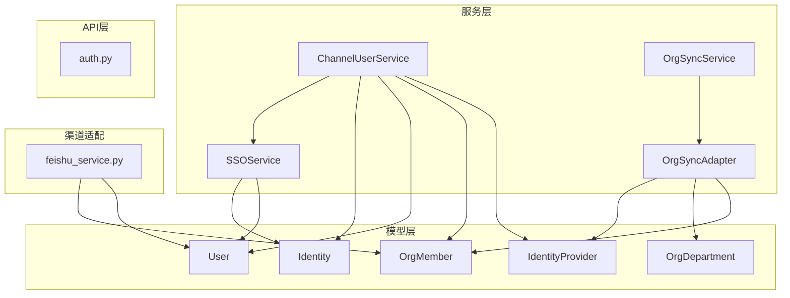
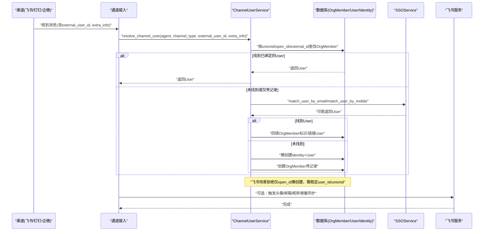
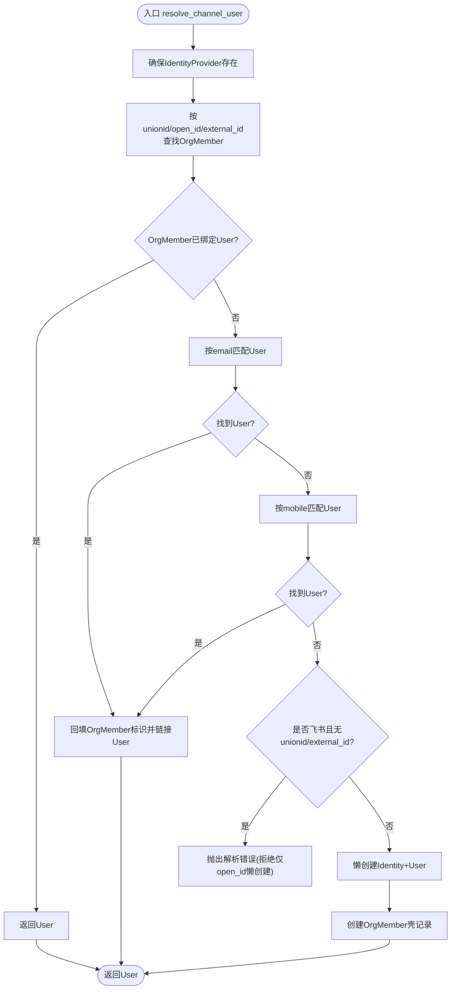
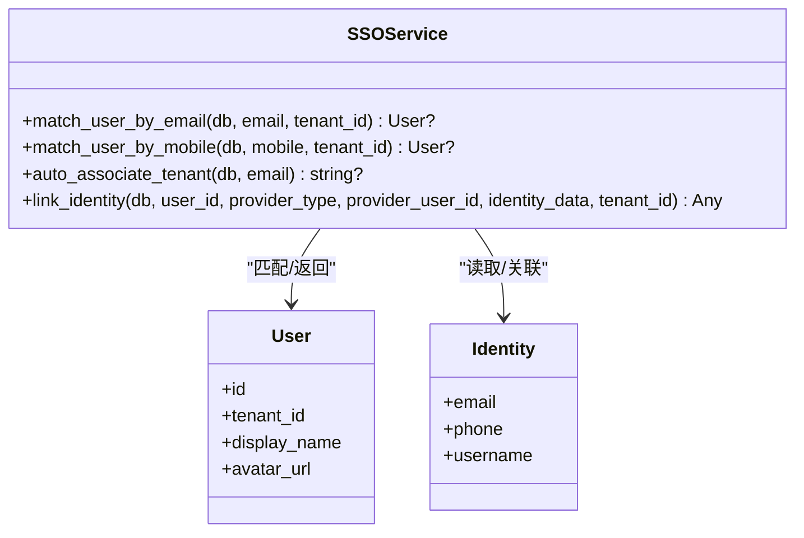
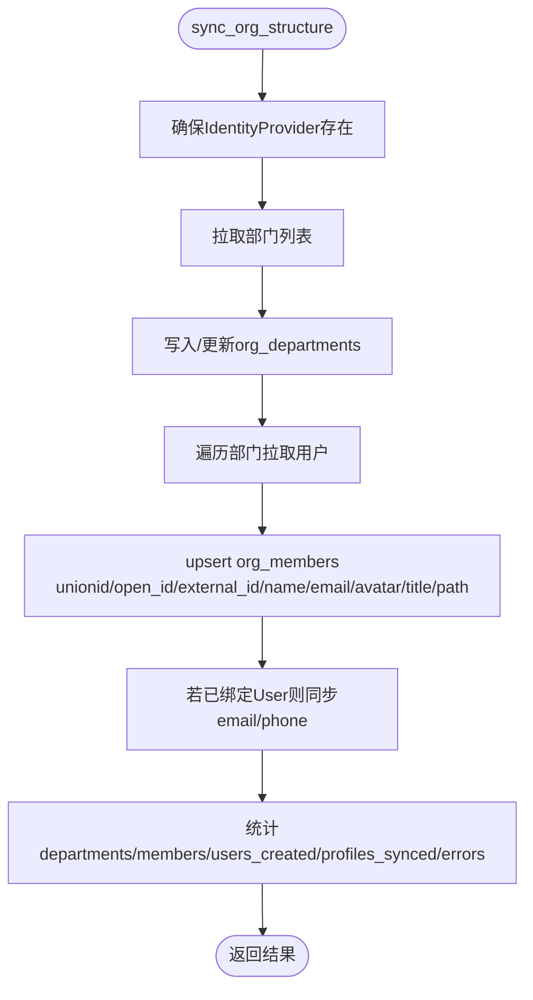
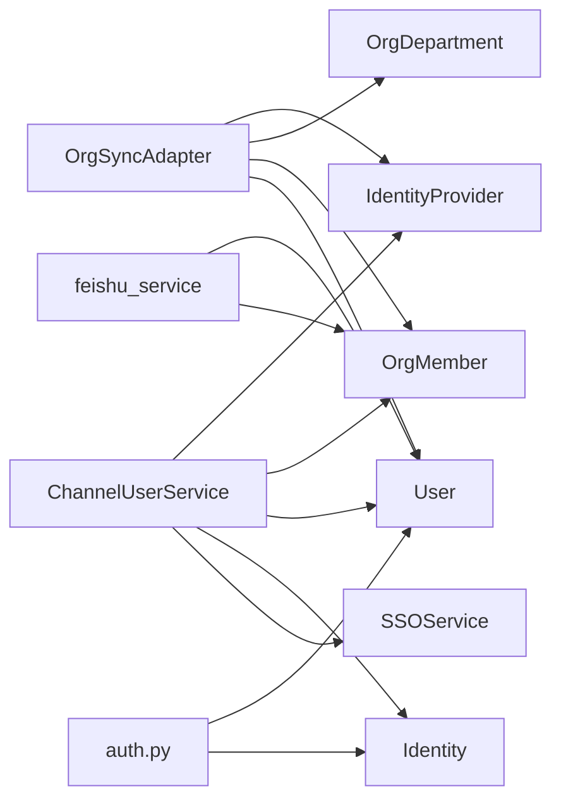

# 渠道用户映射API

<cite>
**本文引用的文件**   
- [backend/app/models/identity.py](file://backend/app/models/identity.py)
- [backend/app/models/user.py](file://backend/app/models/user.py)
- [backend/app/models/org.py](file://backend/app/models/org.py)
- [backend/app/services/channel_user_service.py](file://backend/app/services/channel_user_service.py)
- [backend/app/services/sso_service.py](file://backend/app/services/sso_service.py)
- [backend/app/services/org_sync_adapter.py](file://backend/app/services/org_sync_adapter.py)
- [backend/app/services/org_sync_service.py](file://backend/app/services/org_sync_service.py)
- [backend/app/api/auth.py](file://backend/app/api/auth.py)
- [backend/app/services/feishu_service.py](file://backend/app/services/feishu_service.py)
</cite>

## 目录
1. [简介](#简介)
2. [项目结构](#项目结构)
3. [核心组件](#核心组件)
4. [架构总览](#架构总览)
5. [详细组件分析](#详细组件分析)
6. [依赖关系分析](#依赖关系分析)
7. [性能考量](#性能考量)
8. [故障排查指南](#故障排查指南)
9. [结论](#结论)
10. [附录](#附录)

## 简介
本文件为Clawith平台的“渠道用户身份映射”提供系统化API与实现文档，覆盖跨平台用户识别、多源身份同步、用户属性映射与权限继承机制。重点说明不同渠道（飞书、钉钉、企业微信等）的用户标识转换、昵称处理、头像同步和组织结构映射；并给出身份冲突解决策略、增量同步算法、批量操作接口、配置模板、调试工具与常见问题解决方案。同时涵盖隐私保护、数据脱敏与合规性要求。

## 项目结构
围绕渠道用户映射的核心代码分布在以下模块：
- 模型层：IdentityProvider、User、Identity、OrgMember、OrgDepartment
- 服务层：ChannelUserService（渠道用户解析）、SSOService（SSO匹配与租户关联）、OrgSyncAdapter/OrgSyncService（组织同步）
- API层：认证与注册相关端点（用于SSO注册、登录、租户切换等）
- 渠道适配：Feishu服务（头像/邮箱/昵称更新等）

**图表来源** 
- [backend/app/models/identity.py:26-47](file://backend/app/models/identity.py#L26-L47)
- [backend/app/models/user.py:16-119](file://backend/app/models/user.py#L16-L119)
- [backend/app/models/org.py:13-63](file://backend/app/models/org.py#L13-L63)
- [backend/app/services/channel_user_service.py:27-213](file://backend/app/services/channel_user_service.py#L27-L213)
- [backend/app/services/sso_service.py:22-182](file://backend/app/services/sso_service.py#L22-L182)
- [backend/app/services/org_sync_adapter.py:174-250](file://backend/app/services/org_sync_adapter.py#L174-L250)
- [backend/app/services/org_sync_service.py:11-48](file://backend/app/services/org_sync_service.py#L11-L48)
- [backend/app/api/auth.py:43-800](file://backend/app/api/auth.py#L43-L800)
- [backend/app/services/feishu_service.py:276-308](file://backend/app/services/feishu_service.py#L276-L308)

**章节来源**
- [backend/app/models/identity.py:26-47](file://backend/app/models/identity.py#L26-L47)
- [backend/app/models/user.py:16-119](file://backend/app/models/user.py#L16-L119)
- [backend/app/models/org.py:13-63](file://backend/app/models/org.py#L13-L63)
- [backend/app/services/channel_user_service.py:27-213](file://backend/app/services/channel_user_service.py#L27-L213)
- [backend/app/services/sso_service.py:22-182](file://backend/app/services/sso_service.py#L22-L182)
- [backend/app/services/org_sync_adapter.py:174-250](file://backend/app/services/org_sync_adapter.py#L174-L250)
- [backend/app/services/org_sync_service.py:11-48](file://backend/app/services/org_sync_service.py#L11-L48)
- [backend/app/api/auth.py:43-800](file://backend/app/api/auth.py#L43-L800)
- [backend/app/services/feishu_service.py:276-308](file://backend/app/services/feishu_service.py#L276-L308)

## 核心组件
- IdentityProvider：外部身份提供方配置（如飞书、钉钉、企业微信），支持按租户隔离与SSO开关。
- Identity：全局唯一自然人身份（邮箱、手机号、用户名）。
- User：租户内成员身份，绑定到Identity，包含角色、头像、显示名等。
- OrgMember/OrgDepartment：从各渠道同步的组织结构与成员信息，承载unionid/open_id/external_id等跨平台标识。
- ChannelUserService：统一渠道用户解析，优先通过OrgMember定位，再回退到email/mobile匹配，最后懒创建新用户。
- SSOService：SSO登录流程中的用户匹配、租户自动关联与被动资料填充。
- OrgSyncAdapter/OrgSyncService：通用组织同步框架，拉取部门与成员，增量更新，生成拼音转写字段以支持搜索。
- Feishu服务：针对飞书的头像、邮箱、昵称与user_id的增量同步与占位符清理。

**章节来源**
- [backend/app/models/identity.py:26-47](file://backend/app/models/identity.py#L26-L47)
- [backend/app/models/user.py:16-119](file://backend/app/models/user.py#L16-L119)
- [backend/app/models/org.py:13-63](file://backend/app/models/org.py#L13-L63)
- [backend/app/services/channel_user_service.py:27-213](file://backend/app/services/channel_user_service.py#L27-L213)
- [backend/app/services/sso_service.py:22-182](file://backend/app/services/sso_service.py#L22-L182)
- [backend/app/services/org_sync_adapter.py:174-250](file://backend/app/services/org_sync_adapter.py#L174-L250)
- [backend/app/services/org_sync_service.py:11-48](file://backend/app/services/org_sync_service.py#L11-L48)
- [backend/app/services/feishu_service.py:276-308](file://backend/app/services/feishu_service.py#L276-L308)

## 架构总览
下图展示渠道消息进入后，如何解析发送者身份、匹配或创建用户、维护OrgMember与User的关系，以及SSO与组织同步的交互。

**图表来源** 
- [backend/app/services/channel_user_service.py:73-213](file://backend/app/services/channel_user_service.py#L73-L213)
- [backend/app/services/sso_service.py:28-141](file://backend/app/services/sso_service.py#L28-L141)
- [backend/app/services/feishu_service.py:276-308](file://backend/app/services/feishu_service.py#L276-L308)

## 详细组件分析

### 组件A：渠道用户解析（ChannelUserService）
职责：
- 标准化渠道类型别名（如microsoft_teams→teams）
- 提取unionid/open_id/external_id，并按渠道优先级匹配OrgMember
- 先尝试email/mobile匹配已有User，再懒创建新用户
- 防止飞书仅凭open_id懒创建导致重复用户

关键流程：

**图表来源** 
- [backend/app/services/channel_user_service.py:73-213](file://backend/app/services/channel_user_service.py#L73-L213)

**章节来源**
- [backend/app/services/channel_user_service.py:27-213](file://backend/app/services/channel_user_service.py#L27-L213)

### 组件B：SSO用户匹配与租户关联（SSOService）
职责：
- 通过email/mobile在租户范围内匹配User
- 基于邮箱域名自动关联租户
- 首次SSO登录时被动填充OrgMember占位资料（name/email/avatar）

关键能力：
- match_user_by_email / match_user_by_mobile
- auto_associate_tenant
- link_identity（被动资料填充）

**图表来源** 
- [backend/app/services/sso_service.py:22-182](file://backend/app/services/sso_service.py#L22-L182)
- [backend/app/services/sso_service.py:390-417](file://backend/app/services/sso_service.py#L390-L417)
- [backend/app/models/user.py:16-119](file://backend/app/models/user.py#L16-L119)
- [backend/app/models/identity.py:16-47](file://backend/app/models/identity.py#L16-L47)

**章节来源**
- [backend/app/services/sso_service.py:28-141](file://backend/app/services/sso_service.py#L28-L141)
- [backend/app/services/sso_service.py:390-417](file://backend/app/services/sso_service.py#L390-L417)

### 组件C：组织同步（OrgSyncAdapter/OrgSyncService）
职责：
- 抽象化各渠道组织同步（部门、成员）
- 增量同步：更新现有记录、去重、生成拼音转写字段
- 将OrgMember的email/phone反向同步至User（若已绑定）

同步主流程：

**图表来源** 
- [backend/app/services/org_sync_adapter.py:232-250](file://backend/app/services/org_sync_adapter.py#L232-L250)
- [backend/app/services/org_sync_adapter.py:631-680](file://backend/app/services/org_sync_adapter.py#L631-L680)
- [backend/app/services/org_sync_service.py:11-48](file://backend/app/services/org_sync_service.py#L11-L48)

**章节来源**
- [backend/app/services/org_sync_adapter.py:174-250](file://backend/app/services/org_sync_adapter.py#L174-L250)
- [backend/app/services/org_sync_adapter.py:631-680](file://backend/app/services/org_sync_adapter.py#L631-L680)
- [backend/app/services/org_sync_service.py:11-48](file://backend/app/services/org_sync_service.py#L11-L48)

### 组件D：飞书用户资料增量同步（feishu_service）
职责：
- 对已有User进行最新资料同步（头像、邮箱、昵称、user_id）
- 对新建User生成唯一username并避免冲突
- 若OrgMember未绑定User则建立绑定

关键点：
- 当邮箱为空或以feishu.local结尾时，用飞书邮箱覆盖
- 昵称使用飞书display_name
- user_id写入external_id与feishu_user_id

**章节来源**
- [backend/app/services/feishu_service.py:276-308](file://backend/app/services/feishu_service.py#L276-L308)

### 组件E：认证与注册API（auth.py）
相关端点（节选）：
- GET /auth/check-duplicate：检查邮箱/用户名冲突
- POST /auth/register/init：初始化注册（支持密码/SSO）
- POST /auth/register/sso：SSO注册/登录
- POST /auth/login：密码登录（支持多租户选择）
- GET /auth/me：获取当前用户
- PATCH /auth/me：更新用户资料（变更email/phone时同步OrgMember）
- POST /auth/forgot-password：重置密码
- POST /auth/reset-password：使用一次性token重置密码
- GET /auth/my-tenants：查询用户所属租户
- POST /auth/switch-tenant：切换租户并返回新token

这些端点支撑了用户注册、登录、租户切换与资料更新，配合SSO与渠道解析形成完整的身份生命周期管理。

**章节来源**
- [backend/app/api/auth.py:43-800](file://backend/app/api/auth.py#L43-L800)

## 依赖关系分析
- ChannelUserService依赖IdentityProvider、OrgMember、User、Identity，并通过SSOService进行email/mobile匹配。
- OrgSyncAdapter依赖IdentityProvider、OrgDepartment、OrgMember，并在同步完成后反向更新User。
- Feishu服务直接读写User与OrgMember，保证头像、邮箱、昵称与user_id一致性。
- auth.py作为API入口，调用注册/登录/资料更新等服务，间接影响Identity与User状态。

**图表来源** 
- [backend/app/services/channel_user_service.py:27-213](file://backend/app/services/channel_user_service.py#L27-L213)
- [backend/app/services/org_sync_adapter.py:174-250](file://backend/app/services/org_sync_adapter.py#L174-L250)
- [backend/app/services/feishu_service.py:276-308](file://backend/app/services/feishu_service.py#L276-L308)
- [backend/app/api/auth.py:43-800](file://backend/app/api/auth.py#L43-L800)

**章节来源**
- [backend/app/services/channel_user_service.py:27-213](file://backend/app/services/channel_user_service.py#L27-L213)
- [backend/app/services/org_sync_adapter.py:174-250](file://backend/app/services/org_sync_adapter.py#L174-L250)
- [backend/app/services/feishu_service.py:276-308](file://backend/app/services/feishu_service.py#L276-L308)
- [backend/app/api/auth.py:43-800](file://backend/app/api/auth.py#L43-L800)

## 性能考量
- OrgMember查询采用limit(1)+排序（优先已绑定User、按synced_at升序）避免重复壳记录导致的多次创建。
- 懒创建Identity+User在同一事务中flush，避免跨会话外键约束失败。
- 组织同步采用增量upsert与统计汇总，减少全量重建开销。
- 邮箱/手机号匹配使用规范化（去除空白与符号）提升命中率。
- 飞书头像/邮箱/昵称同步仅在必要时覆盖，避免不必要写入。

[本节为通用指导，不直接分析具体文件]

## 故障排查指南
常见问题与定位要点：
- 飞书消息无法解析稳定用户ID：检查extra_info是否包含unionid或external_id（user_id），仅open_id会被拒绝懒创建。
- 重复用户创建：确认OrgMember是否存在多条shell记录；查询时应优先user_id非空且按synced_at排序。
- email/mobile匹配不到用户：检查Identity中email/phone是否一致，注意手机号规范化。
- 组织同步后User资料未更新：确认OrgMember.user_id已绑定；检查同步逻辑是否执行email/phone反写。
- 昵称/头像未更新：检查飞书服务是否被调用；确认头像URL与邮箱后缀规则。

**章节来源**
- [backend/app/services/channel_user_service.py:178-213](file://backend/app/services/channel_user_service.py#L178-L213)
- [backend/app/services/channel_user_service.py:251-338](file://backend/app/services/channel_user_service.py#L251-L338)
- [backend/app/services/feishu_service.py:276-308](file://backend/app/services/feishu_service.py#L276-L308)

## 结论
通过ChannelUserService、SSOService与OrgSyncAdapter/OrgSyncService的协同，Clawith实现了多渠道用户身份的统一映射与同步。以OrgMember为核心枢纽，结合Identity与User的分层设计，既保证了跨平台标识的稳定匹配，又提供了灵活的懒创建与增量同步能力。配合认证API与飞书服务，形成了完整的用户生命周期管理与资料一致性保障。

[本节为总结，不直接分析具体文件]

## 附录

### A. 用户映射配置模板（示例）
- IdentityProvider配置项：provider_type、name、is_active、sso_login_enabled、config（JSON）、tenant_id
- OrgMember关键字段：open_id、unionid、external_id、provider_id、name、email、avatar_url、title、department_path、phone、status、tenant_id、user_id、synced_at
- User关键字段：identity_id、tenant_id、display_name、avatar_url、role、registration_source、is_active

**章节来源**
- [backend/app/models/identity.py:26-47](file://backend/app/models/identity.py#L26-L47)
- [backend/app/models/org.py:34-63](file://backend/app/models/org.py#L34-L63)
- [backend/app/models/user.py:52-119](file://backend/app/models/user.py#L52-L119)

### B. 调试工具与建议
- 日志关键词：[channel_type] Created new user、[channel_type] Found user via linked OrgMember、[channel_type] Reusing org-synced OrgMember
- 断点建议：resolve_channel_user、_find_org_member、_create_channel_user、sync_org_structure
- 数据校验：检查OrgMember.unionid/open_id/external_id是否齐全；确认User.identity.email/phone与OrgMember.email/phone一致

**章节来源**
- [backend/app/services/channel_user_service.py:178-213](file://backend/app/services/channel_user_service.py#L178-L213)
- [backend/app/services/org_sync_adapter.py:232-250](file://backend/app/services/org_sync_adapter.py#L232-L250)

### C. 隐私保护与合规性
- 最小化采集：仅收集必要标识（unionid/open_id/external_id）与基本资料（name/email/avatar）
- 数据脱敏：邮箱提示接口对名称与域名进行脱敏处理
- 访问控制：SSO登录需启用sso_login_enabled；租户隔离通过tenant_id限定
- 审计与留存：记录synced_at、created_at、updated_at，便于追踪与回溯

**章节来源**
- [backend/app/api/auth.py:545-579](file://backend/app/api/auth.py#L545-L579)
- [backend/app/models/identity.py:26-47](file://backend/app/models/identity.py#L26-L47)
- [backend/app/models/org.py:34-63](file://backend/app/models/org.py#L34-L63)