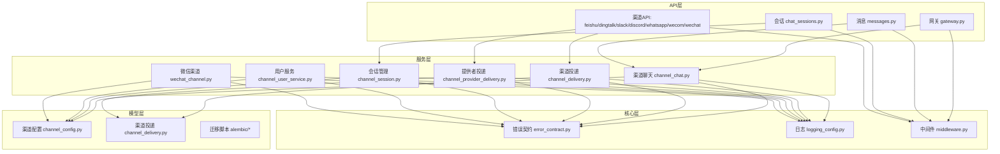
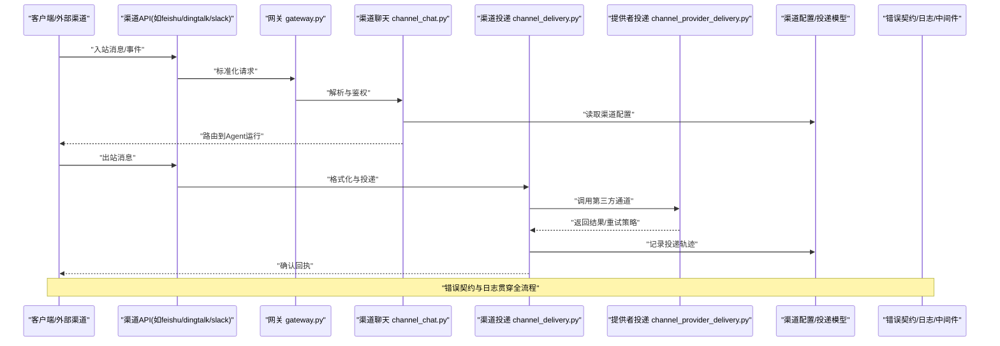
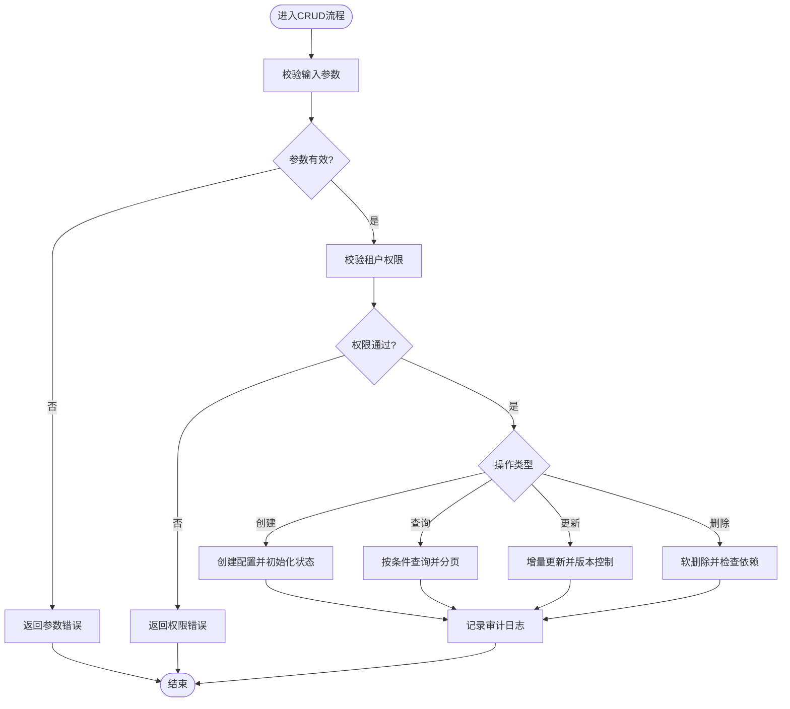
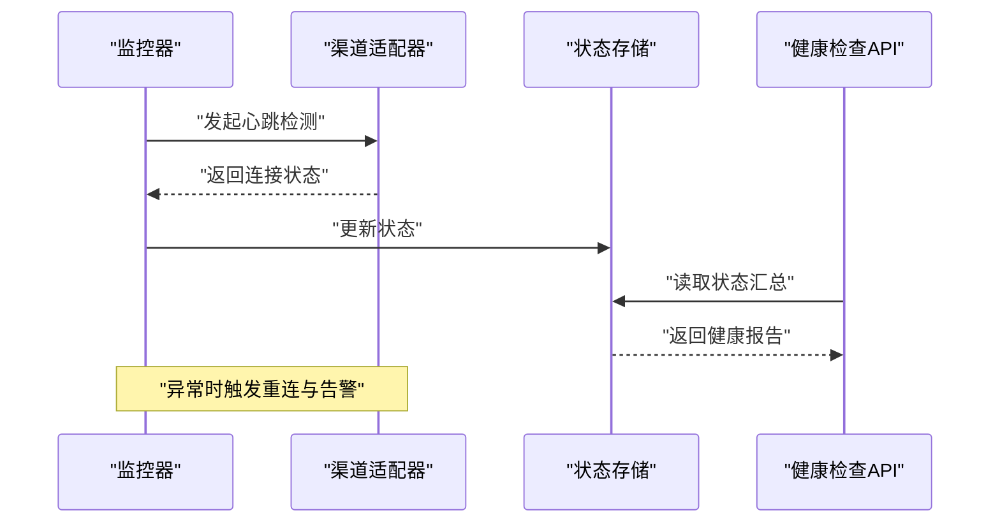
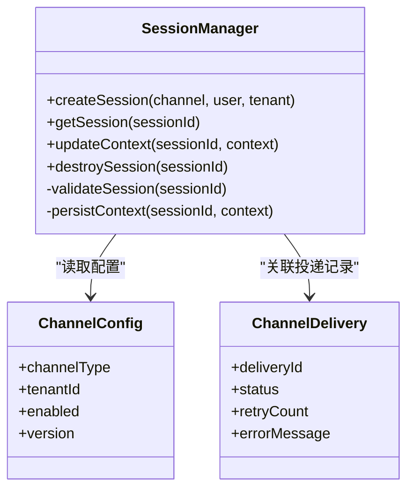
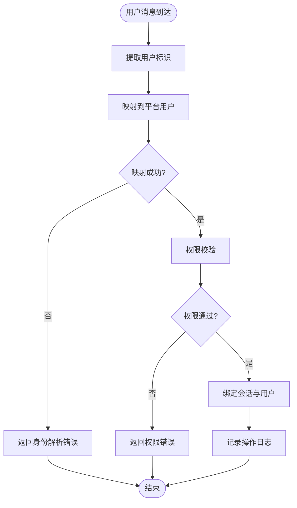
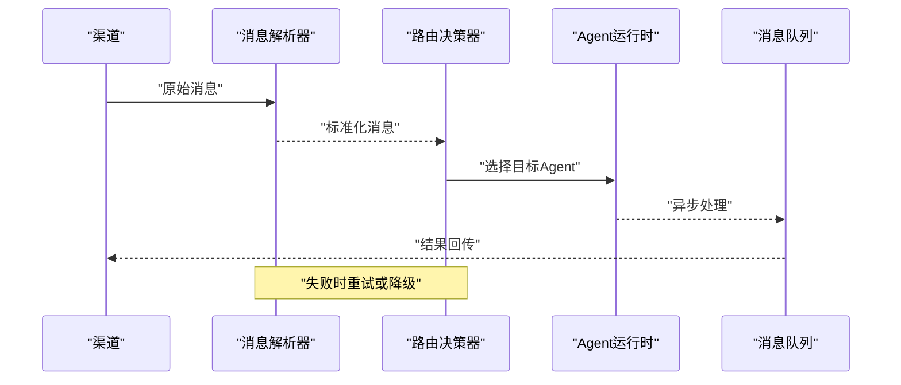
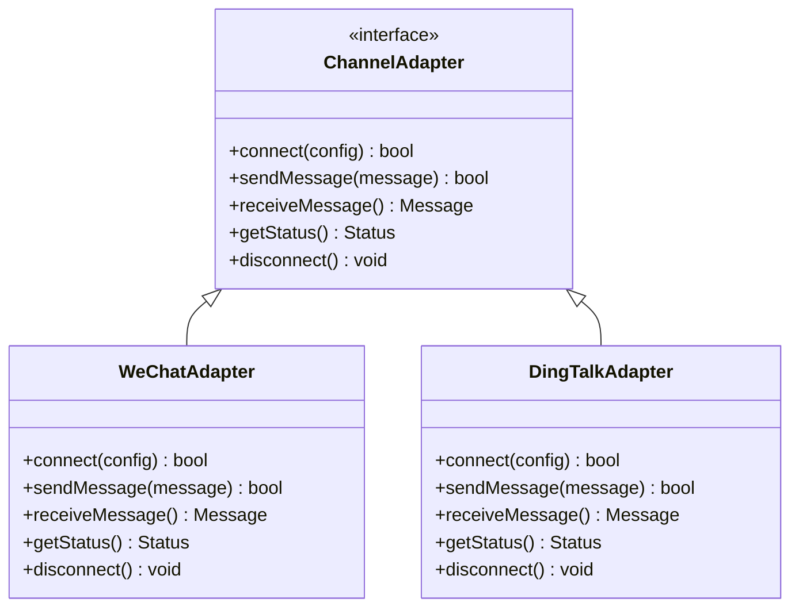
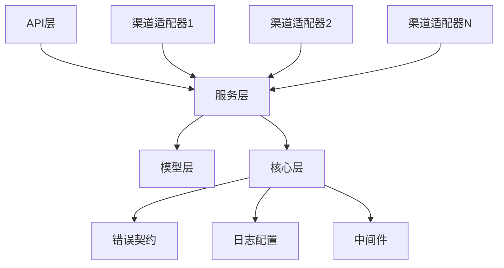

# 渠道管理API

<cite>
**本文引用的文件**   
- [channel_config.py](file://backend/app/models/channel_config.py)
- [channel_delivery.py](file://backend/app/models/channel_delivery.py)
- [channel_chat.py](file://backend/app/services/agent_runtime/channel_chat.py)
- [channel_delivery.py](file://backend/app/services/agent_runtime/channel_delivery.py)
- [channel_provider_delivery.py](file://backend/app/services/agent_runtime/channel_provider_delivery.py)
- [channel_session.py](file://backend/app/services/channel_session.py)
- [channel_user_service.py](file://backend/app/services/channel_user_service.py)
- [wechat_channel.py](file://backend/app/services/wechat_channel.py)
- [gateway.py](file://backend/app/api/gateway.py)
- [messages.py](file://backend/app/api/messages.py)
- [chat_sessions.py](file://backend/app/api/chat_sessions.py)
- [feishu.py](file://backend/app/api/feishu.py)
- [dingtalk.py](file://backend/app/api/dingtalk.py)
- [slack.py](file://backend/app/api/slack.py)
- [discord_bot.py](file://backend/app/api/discord_bot.py)
- [whatsapp.py](file://backend/app/api/whatsapp.py)
- [weixin.py](file://backend/app/api/wechat.py)
- [wecom.py](file://backend/app/api/wecom.py)
- [error_contract.py](file://backend/app/core/error_contract.py)
- [logging_config.py](file://backend/app/core/logging_config.py)
- [middleware.py](file://backend/app/core/middleware.py)
- [029_add_wechat_channel_support.py](file://backend/alembic/versions/029_add_wechat_channel_support.py)
- [030_add_whatsapp_channel_support.py](file://backend/alembic/versions/030_add_whatsapp_channel_support.py)
- [044_add_missing_channel_type_enum_values.py](file://backend/alembic/versions/044_add_missing_channel_type_enum_values.py)
</cite>

## 目录
1. [简介](#简介)
2. [项目结构](#项目结构)
3. [核心组件](#核心组件)
4. [架构总览](#架构总览)
5. [详细组件分析](#详细组件分析)
6. [依赖关系分析](#依赖关系分析)
7. [性能考量](#性能考量)
8. [故障排查指南](#故障排查指南)
9. [结论](#结论)
10. [附录](#附录)

## 简介
本文件为Clawith平台“渠道管理系统”的完整API文档，覆盖多渠道统一接入、渠道配置CRUD、连接状态监控、会话管理、消息路由、身份映射、健康检查、错误处理与日志记录等企业级特性。同时提供渠道扩展开发指南，说明适配器模式与插件化设计，帮助开发者快速接入新渠道并保证系统可扩展性与稳定性。

## 项目结构
后端采用分层架构：
- API层：按渠道或功能划分模块（如飞书、钉钉、Slack、Discord、WhatsApp、企业微信等），负责请求校验、鉴权、参数转换与响应封装。
- 服务层：包含渠道运行时（Agent Runtime）能力，如聊天接入、投递、提供者投递、会话与用户服务等。
- 模型层：定义渠道配置、投递记录等数据模型及迁移脚本。
- 核心层：错误契约、日志配置、中间件等横切关注点。

**图表来源** 
- [gateway.py](file://backend/app/api/gateway.py)
- [messages.py](file://backend/app/api/messages.py)
- [chat_sessions.py](file://backend/app/api/chat_sessions.py)
- [feishu.py](file://backend/app/api/feishu.py)
- [dingtalk.py](file://backend/app/api/dingtalk.py)
- [slack.py](file://backend/app/api/slack.py)
- [discord_bot.py](file://backend/app/api/discord_bot.py)
- [whatsapp.py](file://backend/app/api/whatsapp.py)
- [weixin.py](file://backend/app/api/wechat.py)
- [wecom.py](file://backend/app/api/wecom.py)
- [channel_chat.py](file://backend/app/services/agent_runtime/channel_chat.py)
- [channel_delivery.py](file://backend/app/services/agent_runtime/channel_delivery.py)
- [channel_provider_delivery.py](file://backend/app/services/agent_runtime/channel_provider_delivery.py)
- [channel_session.py](file://backend/app/services/channel_session.py)
- [channel_user_service.py](file://backend/app/services/channel_user_service.py)
- [wechat_channel.py](file://backend/app/services/wechat_channel.py)
- [channel_config.py](file://backend/app/models/channel_config.py)
- [channel_delivery.py](file://backend/app/models/channel_delivery.py)
- [error_contract.py](file://backend/app/core/error_contract.py)
- [logging_config.py](file://backend/app/core/logging_config.py)
- [middleware.py](file://backend/app/core/middleware.py)

**章节来源**
- [gateway.py](file://backend/app/api/gateway.py)
- [messages.py](file://backend/app/api/messages.py)
- [chat_sessions.py](file://backend/app/api/chat_sessions.py)
- [channel_chat.py](file://backend/app/services/agent_runtime/channel_chat.py)
- [channel_delivery.py](file://backend/app/services/agent_runtime/channel_delivery.py)
- [channel_provider_delivery.py](file://backend/app/services/agent_runtime/channel_provider_delivery.py)
- [channel_session.py](file://backend/app/services/channel_session.py)
- [channel_user_service.py](file://backend/app/services/channel_user_service.py)
- [wechat_channel.py](file://backend/app/services/wechat_channel.py)
- [channel_config.py](file://backend/app/models/channel_config.py)
- [channel_delivery.py](file://backend/app/models/channel_delivery.py)
- [error_contract.py](file://backend/app/core/error_contract.py)
- [logging_config.py](file://backend/app/core/logging_config.py)
- [middleware.py](file://backend/app/core/middleware.py)

## 核心组件
- 渠道配置模型：集中存储各渠道的连接参数、启用状态、租户隔离、版本控制等。
- 渠道投递模型：记录消息投递轨迹、重试策略、失败原因、时间戳等。
- 渠道聊天服务：统一接入不同渠道的消息接收、解析、鉴权、路由到Agent运行时。
- 渠道投递服务：将Agent输出转换为渠道可识别格式，执行发送与重试。
- 提供者投递服务：对接第三方平台（如Webhook、回调、长连接）的投递通道。
- 会话管理服务：维护多租户、多用户的会话上下文、状态与生命周期。
- 用户服务：实现跨渠道用户身份映射、权限与可见性控制。
- 微信渠道适配：针对微信生态的具体实现（包括企业微信与个人微信）。

**章节来源**
- [channel_config.py](file://backend/app/models/channel_config.py)
- [channel_delivery.py](file://backend/app/models/channel_delivery.py)
- [channel_chat.py](file://backend/app/services/agent_runtime/channel_chat.py)
- [channel_delivery.py](file://backend/app/services/agent_runtime/channel_delivery.py)
- [channel_provider_delivery.py](file://backend/app/services/agent_runtime/channel_provider_delivery.py)
- [channel_session.py](file://backend/app/services/channel_session.py)
- [channel_user_service.py](file://backend/app/services/channel_user_service.py)
- [wechat_channel.py](file://backend/app/services/wechat_channel.py)

## 架构总览
多渠道统一接入通过网关与API层聚合，服务层以适配器模式屏蔽差异，模型层持久化配置与投递记录，核心层提供错误契约、日志与中间件保障。

**图表来源** 
- [gateway.py](file://backend/app/api/gateway.py)
- [messages.py](file://backend/app/api/messages.py)
- [channel_chat.py](file://backend/app/services/agent_runtime/channel_chat.py)
- [channel_delivery.py](file://backend/app/services/agent_runtime/channel_delivery.py)
- [channel_provider_delivery.py](file://backend/app/services/agent_runtime/channel_provider_delivery.py)
- [channel_config.py](file://backend/app/models/channel_config.py)
- [channel_delivery.py](file://backend/app/models/channel_delivery.py)
- [error_contract.py](file://backend/app/core/error_contract.py)
- [logging_config.py](file://backend/app/core/logging_config.py)
- [middleware.py](file://backend/app/core/middleware.py)

## 详细组件分析

### 渠道配置CRUD
- 目标：提供渠道配置的创建、查询、更新、删除接口，支持多租户隔离与版本控制。
- 关键能力：
  - 创建：校验必填字段、生成唯一标识、初始化默认状态。
  - 查询：按租户、渠道类型、启用状态过滤；支持分页与排序。
  - 更新：增量更新、并发控制（版本号）、审计日志。
  - 删除：软删除、依赖检查（是否存在活跃会话或投递任务）。
- 数据模型：渠道配置表包含渠道类型、连接参数、密钥、启用标志、租户ID、创建/更新时间等。
- 错误处理：使用统一错误契约，区分参数错误、权限不足、资源不存在、重复创建等。
- 日志记录：操作前后记录关键信息，便于追踪与审计。

**图表来源** 
- [channel_config.py](file://backend/app/models/channel_config.py)
- [error_contract.py](file://backend/app/core/error_contract.py)
- [logging_config.py](file://backend/app/core/logging_config.py)

**章节来源**
- [channel_config.py](file://backend/app/models/channel_config.py)
- [error_contract.py](file://backend/app/core/error_contract.py)
- [logging_config.py](file://backend/app/core/logging_config.py)

### 连接状态监控与健康检查
- 目标：实时监控各渠道连接状态，提供健康检查接口，支持告警与自动恢复。
- 关键能力：
  - 心跳检测：定时探测渠道可用性（如WebSocket连接、Token有效性）。
  - 状态上报：将连接状态写入缓存或数据库，供前端展示与告警。
  - 健康检查：暴露统一的健康检查端点，返回各渠道状态汇总。
  - 自动恢复：在检测到异常时尝试重连或切换备用通道。
- 错误处理：捕获网络异常、认证失败、限流等，记录错误码与重试次数。
- 日志记录：连接建立、断开、重连、异常均记录详细日志。

**图表来源** 
- [channel_chat.py](file://backend/app/services/agent_runtime/channel_chat.py)
- [channel_delivery.py](file://backend/app/services/agent_runtime/channel_delivery.py)
- [channel_provider_delivery.py](file://backend/app/services/agent_runtime/channel_provider_delivery.py)
- [logging_config.py](file://backend/app/core/logging_config.py)
- [error_contract.py](file://backend/app/core/error_contract.py)

**章节来源**
- [channel_chat.py](file://backend/app/services/agent_runtime/channel_chat.py)
- [channel_delivery.py](file://backend/app/services/agent_runtime/channel_delivery.py)
- [channel_provider_delivery.py](file://backend/app/services/agent_runtime/channel_provider_delivery.py)
- [logging_config.py](file://backend/app/core/logging_config.py)
- [error_contract.py](file://backend/app/core/error_contract.py)

### 会话管理
- 目标：维护多租户、多用户的会话上下文，支持会话创建、查询、更新、销毁。
- 关键能力：
  - 会话创建：根据渠道与用户生成唯一会话ID，初始化上下文。
  - 上下文构建：合并用户历史、渠道元数据、Agent配置。
  - 生命周期管理：超时清理、状态同步、持久化。
  - 并发控制：防止同一会话的竞态条件。
- 数据模型：会话表包含会话ID、租户ID、用户ID、渠道类型、状态、上下文快照、创建/更新时间等。
- 错误处理：会话不存在、上下文损坏、并发冲突等。
- 日志记录：会话创建、更新、销毁、异常均记录。

**图表来源** 
- [channel_session.py](file://backend/app/services/channel_session.py)
- [channel_config.py](file://backend/app/models/channel_config.py)
- [channel_delivery.py](file://backend/app/models/channel_delivery.py)

**章节来源**
- [channel_session.py](file://backend/app/services/channel_session.py)
- [channel_config.py](file://backend/app/models/channel_config.py)
- [channel_delivery.py](file://backend/app/models/channel_delivery.py)

### 用户身份映射
- 目标：实现跨渠道用户身份的统一映射，支持SSO、OAuth、企业内部账号体系。
- 关键能力：
  - 身份解析：从渠道消息中提取用户标识，映射到平台用户。
  - 权限控制：基于租户与角色进行访问控制。
  - 会话绑定：将用户与会话关联，确保上下文隔离。
  - 变更同步：当用户信息变更时，同步到相关会话与渠道。
- 错误处理：身份解析失败、权限不足、映射冲突等。
- 日志记录：身份解析、权限校验、会话绑定等操作记录。

**图表来源** 
- [channel_user_service.py](file://backend/app/services/channel_user_service.py)
- [error_contract.py](file://backend/app/core/error_contract.py)
- [logging_config.py](file://backend/app/core/logging_config.py)

**章节来源**
- [channel_user_service.py](file://backend/app/services/channel_user_service.py)
- [error_contract.py](file://backend/app/core/error_contract.py)
- [logging_config.py](file://backend/app/core/logging_config.py)

### 消息路由机制
- 目标：将渠道消息路由到正确的Agent或工具，支持分组、优先级、负载均衡。
- 关键能力：
  - 消息解析：标准化不同渠道的消息格式。
  - 路由决策：根据渠道类型、用户意图、Agent能力选择目标。
  - 负载分发：支持队列、轮询、权重分配。
  - 失败重试：对路由失败的消息进行重试或降级。
- 错误处理：路由失败、目标不可用、消息格式错误等。
- 日志记录：消息解析、路由决策、分发结果均记录。

**图表来源** 
- [channel_chat.py](file://backend/app/services/agent_runtime/channel_chat.py)
- [messages.py](file://backend/app/api/messages.py)
- [logging_config.py](file://backend/app/core/logging_config.py)
- [error_contract.py](file://backend/app/core/error_contract.py)

**章节来源**
- [channel_chat.py](file://backend/app/services/agent_runtime/channel_chat.py)
- [messages.py](file://backend/app/api/messages.py)
- [logging_config.py](file://backend/app/core/logging_config.py)
- [error_contract.py](file://backend/app/core/error_contract.py)

### 渠道扩展开发指南
- 适配器模式：每个渠道实现统一的接口，屏蔽差异。
- 插件化设计：动态加载渠道适配器，支持热插拔。
- 开发步骤：
  1. 定义渠道适配器接口（连接、发送、接收、状态）。
  2. 实现具体渠道逻辑（如微信、钉钉、Slack）。
  3. 注册到插件管理器，支持配置与启停。
  4. 编写测试用例，覆盖正常与异常场景。
- 最佳实践：
  - 使用统一错误契约，避免硬编码错误码。
  - 记录详细日志，便于问题定位。
  - 支持重试与超时，提高鲁棒性。
  - 遵循多租户隔离，确保数据安全。

**图表来源** 
- [wechat_channel.py](file://backend/app/services/wechat_channel.py)
- [dingtalk.py](file://backend/app/api/dingtalk.py)
- [slack.py](file://backend/app/api/slack.py)
- [discord_bot.py](file://backend/app/api/discord_bot.py)
- [whatsapp.py](file://backend/app/api/whatsapp.py)
- [wecom.py](file://backend/app/api/wecom.py)
- [weixin.py](file://backend/app/api/wechat.py)

**章节来源**
- [wechat_channel.py](file://backend/app/services/wechat_channel.py)
- [dingtalk.py](file://backend/app/api/dingtalk.py)
- [slack.py](file://backend/app/api/slack.py)
- [discord_bot.py](file://backend/app/api/discord_bot.py)
- [whatsapp.py](file://backend/app/api/whatsapp.py)
- [wecom.py](file://backend/app/api/wecom.py)
- [weixin.py](file://backend/app/api/wechat.py)

## 依赖关系分析
渠道管理系统依赖以下核心模块：
- API层依赖服务层，服务层依赖模型层与核心层。
- 渠道适配器之间相互独立，通过统一接口解耦。
- 错误契约与日志配置被所有模块复用。
- 中间件提供通用功能（如鉴权、限流、审计）。

**图表来源** 
- [gateway.py](file://backend/app/api/gateway.py)
- [messages.py](file://backend/app/api/messages.py)
- [chat_sessions.py](file://backend/app/api/chat_sessions.py)
- [channel_chat.py](file://backend/app/services/agent_runtime/channel_chat.py)
- [channel_delivery.py](file://backend/app/services/agent_runtime/channel_delivery.py)
- [channel_provider_delivery.py](file://backend/app/services/agent_runtime/channel_provider_delivery.py)
- [channel_session.py](file://backend/app/services/channel_session.py)
- [channel_user_service.py](file://backend/app/services/channel_user_service.py)
- [wechat_channel.py](file://backend/app/services/wechat_channel.py)
- [channel_config.py](file://backend/app/models/channel_config.py)
- [channel_delivery.py](file://backend/app/models/channel_delivery.py)
- [error_contract.py](file://backend/app/core/error_contract.py)
- [logging_config.py](file://backend/app/core/logging_config.py)
- [middleware.py](file://backend/app/core/middleware.py)

**章节来源**
- [gateway.py](file://backend/app/api/gateway.py)
- [messages.py](file://backend/app/api/messages.py)
- [chat_sessions.py](file://backend/app/api/chat_sessions.py)
- [channel_chat.py](file://backend/app/services/agent_runtime/channel_chat.py)
- [channel_delivery.py](file://backend/app/services/agent_runtime/channel_delivery.py)
- [channel_provider_delivery.py](file://backend/app/services/agent_runtime/channel_provider_delivery.py)
- [channel_session.py](file://backend/app/services/channel_session.py)
- [channel_user_service.py](file://backend/app/services/channel_user_service.py)
- [wechat_channel.py](file://backend/app/services/wechat_channel.py)
- [channel_config.py](file://backend/app/models/channel_config.py)
- [channel_delivery.py](file://backend/app/models/channel_delivery.py)
- [error_contract.py](file://backend/app/core/error_contract.py)
- [logging_config.py](file://backend/app/core/logging_config.py)
- [middleware.py](file://backend/app/core/middleware.py)

## 性能考量
- 连接池：复用HTTP/WebSocket连接，减少握手开销。
- 异步处理：非阻塞I/O，提升吞吐量。
- 缓存：热点数据（如用户信息、渠道配置）缓存加速。
- 限流：防止突发流量冲击下游服务。
- 分片：按租户或渠道分片，降低单点压力。
- 监控：关键指标（延迟、错误率、QPS）实时采集与分析。

[本节为通用指导，无需特定文件引用]

## 故障排查指南
- 常见问题：
  - 渠道连接失败：检查配置参数、网络连通性、Token有效期。
  - 消息丢失：查看投递记录，确认重试策略与队列状态。
  - 会话异常：检查上下文快照、并发锁、超时设置。
  - 身份映射错误：核对用户标识映射规则与权限配置。
- 排查步骤：
  1. 查看错误日志，定位错误码与堆栈。
  2. 检查渠道健康状态与连接池。
  3. 验证配置与权限设置。
  4. 模拟请求复现问题。
  5. 逐步缩小范围，定位根因。
- 工具推荐：
  - 日志聚合：ELK、Splunk等。
  - 链路追踪：Jaeger、SkyWalking等。
  - 监控告警：Prometheus、Grafana等。

**章节来源**
- [error_contract.py](file://backend/app/core/error_contract.py)
- [logging_config.py](file://backend/app/core/logging_config.py)
- [middleware.py](file://backend/app/core/middleware.py)

## 结论
Clawith平台的渠道管理系统通过统一接入、适配器模式与插件化设计，实现了多渠道的高效集成与管理。系统具备完善的CRUD能力、连接状态监控、会话管理、消息路由、身份映射、健康检查、错误处理与日志记录等企业级特性。开发者可基于此框架快速扩展新渠道，确保系统的可扩展性与稳定性。

[本节为总结，无需特定文件引用]

## 附录
- 数据库迁移：新增渠道类型与字段，参考迁移脚本。
- 安全建议：敏感信息加密存储、最小权限原则、定期审计。
- 部署建议：容器化部署、水平扩展、灰度发布。

**章节来源**
- [029_add_wechat_channel_support.py](file://backend/alembic/versions/029_add_wechat_channel_support.py)
- [030_add_whatsapp_channel_support.py](file://backend/alembic/versions/030_add_whatsapp_channel_support.py)
- [044_add_missing_channel_type_enum_values.py](file://backend/alembic/versions/044_add_missing_channel_type_enum_values.py)