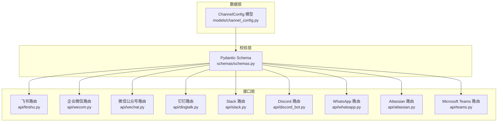
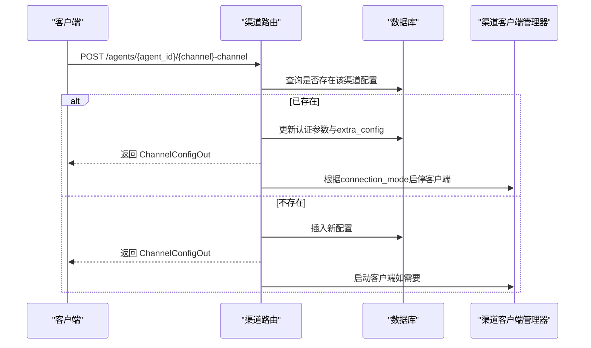
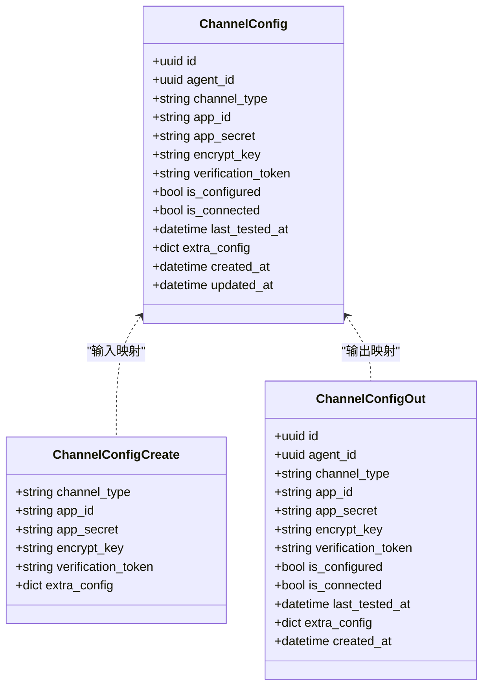

# 渠道配置API

<cite>
**本文引用的文件**   
- [channel_config.py](file://backend/app/models/channel_config.py)
- [schemas.py](file://backend/app/schemas/schemas.py)
- [feishu.py](file://backend/app/api/feishu.py)
- [wecom.py](file://backend/app/api/wecom.py)
- [wechat.py](file://backend/app/api/wechat.py)
- [dingtalk.py](file://backend/app/api/dingtalk.py)
- [slack.py](file://backend/app/api/slack.py)
- [discord_bot.py](file://backend/app/api/discord_bot.py)
- [whatsapp.py](file://backend/app/api/whatsapp.py)
- [atlassian.py](file://backend/app/api/atlassian.py)
- [teams.py](file://backend/app/api/teams.py)
</cite>

## 目录
1. [简介](#简介)
2. [项目结构](#项目结构)
3. [核心组件](#核心组件)
4. [架构总览](#架构总览)
5. [详细组件分析](#详细组件分析)
6. [依赖关系分析](#依赖关系分析)
7. [性能考虑](#性能考虑)
8. [故障排查指南](#故障排查指南)
9. [结论](#结论)
10. [附录：各渠道配置示例与最佳实践](#附录：各渠道配置示例与最佳实践)

## 简介
本文件为 Clawith 平台的“渠道配置管理”提供完整 API 文档，覆盖 ChannelConfig 模型的 CRUD 能力、多渠道统一配置架构、认证参数（app_id、app_secret、encrypt_key、verification_token）与连接状态管理。同时说明 JSON 扩展字段 extra_config 的使用方式、唯一约束机制与关联关系，并给出配置验证规则、错误处理策略与安全注意事项，以及各渠道类型的配置示例与最佳实践。

## 项目结构
- 数据模型定义位于 models/channel_config.py，定义了 ChannelConfig 表结构与字段。
- 请求/响应校验使用 schemas/schemas.py 中的 Pydantic Schema。
- 各渠道的 REST 路由分别实现于 backend/app/api 下的对应文件（如 feishu.py、wecom.py、wechat.py、dingtalk.py、slack.py、discord_bot.py、whatsapp.py、atlassian.py、teams.py）。
- 统一的 Agent 访问权限校验与当前用户鉴权在各路由中通过依赖注入完成。

**图表来源** 
- [channel_config.py:13-51](file://backend/app/models/channel_config.py#L13-L51)
- [schemas.py:451-474](file://backend/app/schemas/schemas.py#L451-L474)

**章节来源**
- [channel_config.py:13-51](file://backend/app/models/channel_config.py#L13-L51)
- [schemas.py:451-474](file://backend/app/schemas/schemas.py#L451-L474)

## 核心组件
- ChannelConfig 模型
  - 主键 id（UUID）、外键 agent_id（关联 Agent）
  - channel_type：枚举类型，支持 feishu、wecom、wechat、whatsapp、dingtalk、slack、discord、atlassian、microsoft_teams、agentbay
  - 认证参数：app_id、app_secret、encrypt_key、verification_token（可空）
  - 状态：is_configured、is_connected、last_tested_at
  - 扩展配置：extra_config（JSON）
  - 时间戳：created_at、updated_at
  - 唯一约束：(agent_id, channel_type) 唯一
  - 关联：与 Agent 双向关系

- Pydantic Schema
  - ChannelConfigCreate：创建/更新时使用的输入结构（包含 channel_type、app_id、app_secret、encrypt_key、verification_token、extra_config）
  - ChannelConfigOut：对外返回的结构（包含 id、agent_id、channel_type、认证字段、状态、extra_config、created_at）

**章节来源**
- [channel_config.py:13-51](file://backend/app/models/channel_config.py#L13-L51)
- [schemas.py:451-474](file://backend/app/schemas/schemas.py#L451-L474)

## 架构总览
- 统一入口：每个渠道在 /agents/{agent_id}/{channel}-channel 下提供 POST/GET/DELETE 等端点，用于配置、查询与删除。
- 权限控制：所有写操作均要求当前用户为 Agent 创建者；读操作需具备 Agent 访问权限。
- 存储与状态：配置写入 ChannelConfig，状态位 is_configured/is_connected 由路由逻辑维护；部分渠道会启动长连接客户端（WebSocket/Gateway/Stream），并在配置变更时启停。
- Webhook/回调：多数渠道提供 webhook-url 获取公共回调地址，用于平台接收事件。
- 扩展性：extra_config 承载各渠道特有参数（如 connection_mode、bot_id、application_id、public_key、api_version、cloud_id、tenant_id 等）。

**图表来源** 
- [feishu.py:130-188](file://backend/app/api/feishu.py#L130-L188)
- [wecom.py:153-242](file://backend/app/api/wecom.py#L153-L242)
- [dingtalk.py:29-95](file://backend/app/api/dingtalk.py#L29-L95)
- [slack.py:32-73](file://backend/app/api/slack.py#L32-L73)
- [discord_bot.py:25-93](file://backend/app/api/discord_bot.py#L25-L93)
- [whatsapp.py:51-101](file://backend/app/api/whatsapp.py#L51-L101)
- [atlassian.py:28-85](file://backend/app/api/atlassian.py#L28-L85)
- [teams.py:216-276](file://backend/app/api/teams.py#L216-L276)

## 详细组件分析

### 飞书（feishu）
- 配置端点
  - POST /agents/{agent_id}/channel：创建或更新飞书渠道配置（app_id、app_secret、encrypt_key、verification_token、extra_config）
  - GET /agents/{agent_id}/channel：查询配置
  - DELETE /agents/{agent_id}/channel：删除配置
  - GET /agents/{agent_id}/channel/webhook-url：获取回调地址
- 行为要点
  - 若已存在则更新；否则新建并标记 is_configured=True
  - 根据 extra_config.connection_mode 决定是否启动 WebSocket 客户端
- 安全与校验
  - 仅 Agent 创建者可配置或删除
  - 回调 URL 由平台服务生成，确保公网可达

**章节来源**
- [feishu.py:130-188](file://backend/app/api/feishu.py#L130-L188)
- [feishu.py:191-215](file://backend/app/api/feishu.py#L191-L215)
- [feishu.py:217-235](file://backend/app/api/feishu.py#L217-L235)

### 企业微信（wecom）
- 配置端点
  - POST /agents/{agent_id}/wecom-channel：支持两种模式
    - WebSocket（AI Bot）：bot_id + bot_secret
    - Webhook（传统）：corp_id、secret、token、encoding_aes_key
  - GET /agents/{agent_id}/wecom-channel：查询配置（WebSocket 模式下动态填充 is_connected）
  - DELETE /agents/{agent_id}/wecom-channel：删除配置
  - GET /agents/{agent_id}/wecom-channel/webhook-url：获取回调地址
- 行为要点
  - 将 corp_id/secret/token/encoding_aes_key 映射到 app_id/app_secret/encrypt_key/verification_token
  - 根据 connection_mode 启停 wecom_stream_manager 客户端
- 安全与校验
  - 签名校验与 AES 解密用于回调验证
  - 仅 Agent 创建者可配置或删除

**章节来源**
- [wecom.py:153-242](file://backend/app/api/wecom.py#L153-L242)
- [wecom.py:245-267](file://backend/app/api/wecom.py#L245-L267)
- [wecom.py:270-278](file://backend/app/api/wecom.py#L270-L278)
- [wecom.py:280-300](file://backend/app/api/wecom.py#L280-L300)

### 微信公众号（wechat）
- 配置端点
  - POST /agents/{agent_id}/wechat-channel/qrcode：生成二维码
  - GET /agents/{agent_id}/wechat-channel/qrcode-status：轮询确认状态后自动保存配置
  - GET /agents/{agent_id}/wechat-channel/qrcode-image：获取二维码图片
  - GET /agents/{agent_id}/wechat-channel：查询配置
  - DELETE /agents/{agent_id}/wechat-channel：删除配置
- 行为要点
  - 二维码确认后持久化 app_id（ilink_bot_id）、app_secret（bot_token）与 extra_config
  - connector 角色启用时启动 wechat_poll_manager 客户端

**章节来源**
- [wechat.py:54-77](file://backend/app/api/wechat.py#L54-L77)
- [wechat.py:80-151](file://backend/app/api/wechat.py#L80-L151)
- [wechat.py:154-172](file://backend/app/api/wechat.py#L154-L172)
- [wechat.py:175-191](file://backend/app/api/wechat.py#L175-L191)
- [wechat.py:194-216](file://backend/app/api/wechat.py#L194-L216)

### 钉钉（dingtalk）
- 配置端点
  - POST /agents/{agent_id}/dingtalk-channel：app_key、app_secret，可选 extra_config.agent_id
  - GET /agents/{agent_id}/dingtalk-channel：查询配置
  - DELETE /agents/{agent_id}/dingtalk-channel：删除配置
- 行为要点
  - 支持 connection_mode=websocket（默认）或 webhook；切换时启停 dingtalk_stream_manager
  - 消息处理通过 Stream 回调进入统一 Runtime 流程

**章节来源**
- [dingtalk.py:29-95](file://backend/app/api/dingtalk.py#L29-L95)
- [dingtalk.py:98-114](file://backend/app/api/dingtalk.py#L98-L114)
- [dingtalk.py:117-141](file://backend/app/api/dingtalk.py#L117-L141)

### Slack
- 配置端点
  - POST /agents/{agent_id}/slack-channel：bot_token、signing_secret
  - GET /agents/{agent_id}/slack-channel：查询配置
  - DELETE /agents/{agent_id}/slack-channel：删除配置
  - GET /agents/{agent_id}/slack-channel/webhook-url：获取回调地址
- 行为要点
  - 回调事件进行 HMAC-SHA256 签名校验
  - 支持消息分片发送（字符限制）

**章节来源**
- [slack.py:32-73](file://backend/app/api/slack.py#L32-L73)
- [slack.py:76-92](file://backend/app/api/slack.py#L76-L92)
- [slack.py:95-99](file://backend/app/api/slack.py#L95-L99)
- [slack.py:102-120](file://backend/app/api/slack.py#L102-L120)

### Discord
- 配置端点
  - POST /agents/{agent_id}/discord-channel：bot_token；webhook 模式需 application_id、public_key
  - GET /agents/{agent_id}/discord-channel：查询配置
  - DELETE /agents/{agent_id}/discord-channel：删除配置
  - GET /agents/{agent_id}/discord-channel/webhook-url：获取回调地址
- 行为要点
  - gateway 模式启动 discord_gateway_manager；webhook 模式注册 slash commands
  - 回调事件进行 ed25519 签名校验

**章节来源**
- [discord_bot.py:25-93](file://backend/app/api/discord_bot.py#L25-L93)
- [discord_bot.py:96-112](file://backend/app/api/discord_bot.py#L96-L112)
- [discord_bot.py:115-119](file://backend/app/api/discord_bot.py#L115-L119)
- [discord_bot.py:122-146](file://backend/app/api/discord_bot.py#L122-L146)

### WhatsApp
- 配置端点
  - POST /agents/{agent_id}/whatsapp-channel：access_token、phone_number_id、verify_token、app_secret、api_version
  - GET /agents/{agent_id}/whatsapp-channel：查询配置
  - DELETE /agents/{agent_id}/whatsapp-channel：删除配置
  - GET /agents/{agent_id}/whatsapp-channel/webhook-url：获取回调地址
- 行为要点
  - 回调验证使用 x-hub-signature-256 与 verify_token
  - 支持多种消息类型文本提取

**章节来源**
- [whatsapp.py:51-101](file://backend/app/api/whatsapp.py#L51-L101)
- [whatsapp.py:104-120](file://backend/app/api/whatsapp.py#L104-L120)
- [whatsapp.py:123-128](file://backend/app/api/whatsapp.py#L123-L128)
- [whatsapp.py:131-150](file://backend/app/api/whatsapp.py#L131-L150)

### Atlassian（Rovo MCP）
- 配置端点
  - POST /agents/{agent_id}/atlassian-channel：api_key（Bearer 或 Basic base64(email:token)）、cloud_id（可选）
  - GET /agents/{agent_id}/atlassian-channel：查询配置（自定义序列化）
  - DELETE /agents/{agent_id}/atlassian-channel：删除配置
  - POST /agents/{agent_id}/atlassian-channel/test：测试连通性与工具列表
- 行为要点
  - api_key 加密存储；后台异步同步工具并分配给 Agent
  - 非消息通道，属于工具接入型渠道

**章节来源**
- [atlassian.py:28-85](file://backend/app/api/atlassian.py#L28-L85)
- [atlassian.py:88-104](file://backend/app/api/atlassian.py#L88-L104)
- [atlassian.py:107-126](file://backend/app/api/atlassian.py#L107-L126)
- [atlassian.py:129-158](file://backend/app/api/atlassian.py#L129-L158)

### Microsoft Teams
- 配置端点
  - POST /agents/{agent_id}/teams-channel：app_id、app_secret；支持 use_managed_identity、tenant_id
  - GET /agents/{agent_id}/teams-channel：查询配置
  - DELETE /agents/{agent_id}/teams-channel：删除配置
  - GET /agents/{agent_id}/teams-channel/webhook-url：获取回调地址
- 行为要点
  - 支持托管身份或应用凭据；extra_config 记录 tenant_id 与 use_managed_identity
  - 消息发送封装为 Activity，支持回复场景

**章节来源**
- [teams.py:216-276](file://backend/app/api/teams.py#L216-L276)
- [teams.py:279-296](file://backend/app/api/teams.py#L279-L296)
- [teams.py:299-310](file://backend/app/api/teams.py#L299-L310)
- [teams.py:313-333](file://backend/app/api/teams.py#L313-L333)

## 依赖关系分析
- 模型与 Schema
  - ChannelConfig 模型定义字段与约束；Schema 定义输入输出结构
- 路由与模型
  - 各渠道路由通过 SQLAlchemy select 查询 ChannelConfig，按 channel_type 区分
- 权限与鉴权
  - check_agent_access 与 is_agent_creator 保证只有 Agent 创建者可修改配置
- 外部集成
  - 各渠道回调签名校验（HMAC、ed25519、AES、verify_token）
  - 长连接客户端（WebSocket/Gateway/Stream）启停由路由触发

**图表来源** 
- [channel_config.py:13-51](file://backend/app/models/channel_config.py#L13-L51)
- [schemas.py:451-474](file://backend/app/schemas/schemas.py#L451-L474)

**章节来源**
- [channel_config.py:13-51](file://backend/app/models/channel_config.py#L13-L51)
- [schemas.py:451-474](file://backend/app/schemas/schemas.py#L451-L474)

## 性能考虑
- 长连接客户端按需启停：避免不必要的资源占用；切换 connection_mode 时立即停止旧客户端
- 回调去重：各渠道在内存集合中进行事件去重，防止重复处理
- 批量与分片：如 Slack 消息长度限制，服务端自动分片发送
- 异步任务：工具同步（Atlassian）、客户端启停等采用异步任务，降低请求延迟

[本节为通用指导，不直接分析具体文件]

## 故障排查指南
- 常见错误码与提示
  - 403：权限不足（非 Agent 创建者）
  - 404：渠道未配置
  - 422：必填参数缺失（如 bot_token、signing_secret、app_key 等）
  - 401：回调签名校验失败（Slack HMAC、Discord ed25519、WhatsApp signature）
- 调试建议
  - 检查 extra_config 是否包含正确的 connection_mode 与渠道特定字段
  - 确认回调 URL 已正确配置到第三方平台
  - 查看日志中渠道前缀（如 [Feishu]、[WeCom]、[Slack]）定位问题

**章节来源**
- [slack.py:128-139](file://backend/app/api/slack.py#L128-L139)
- [discord_bot.py:180-194](file://backend/app/api/discord_bot.py#L180-L194)
- [whatsapp.py:30-34](file://backend/app/api/whatsapp.py#L30-L34)

## 结论
Clawith 的渠道配置管理以 ChannelConfig 为核心，结合统一的权限校验与灵活的 extra_config 扩展，实现了多渠道路由的一致化配置与生命周期管理。各渠道通过各自的回调签名与客户端管理，保障安全与稳定性。建议在新增渠道时遵循现有模式，保持字段映射与校验一致性，并确保回调与长连接的正确配置。

[本节为总结，不直接分析具体文件]

## 附录：各渠道配置示例与最佳实践
- 飞书
  - 必填：app_id、app_secret
  - 可选：encrypt_key、verification_token、extra_config.connection_mode（websocket/webhook）
  - 最佳实践：优先使用 websocket 模式以获得更稳定的连接；回调 URL 使用平台提供的 webhook-url
- 企业微信
  - 必填（WebSocket）：bot_id、bot_secret
  - 必填（Webhook）：corp_id、secret、token、encoding_aes_key
  - 最佳实践：WebSocket 模式减少回调复杂度；确保签名与 AES 配置一致
- 微信公众号
  - 通过二维码授权流程自动保存 app_id、app_secret 与 extra_config
  - 最佳实践：connector 角色启用以自动拉取更新；注意二维码有效期
- 钉钉
  - 必填：app_key、app_secret
  - 可选：extra_config.agent_id（用于 API 消息）
  - 最佳实践：默认使用 websocket（Stream）模式；如需回退 webhook，请明确设置 connection_mode
- Slack
  - 必填：bot_token、signing_secret
  - 最佳实践：确保 signing_secret 与回调签名校验一致；长消息自动分片
- Discord
  - 必填：bot_token；webhook 模式需 application_id、public_key
  - 最佳实践：gateway 模式适合长期运行；webhook 模式需注册 slash commands
- WhatsApp
  - 必填：access_token、phone_number_id、verify_token；可选 app_secret、api_version
  - 最佳实践：确保 x-hub-signature-256 与 verify_token 配置正确；支持多种消息类型
- Atlassian
  - 必填：api_key（Bearer 或 Basic base64(email:token)）；可选 cloud_id
  - 最佳实践：使用加密存储；后台同步工具后检查 AgentTool 分配情况
- Microsoft Teams
  - 必填：use_managed_identity 或 app_id+app_secret；可选 tenant_id
  - 最佳实践：托管身份更安全；Activity 回复需设置 replyToId

[本节为概念性内容，不直接分析具体文件]