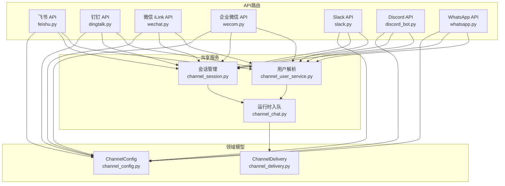
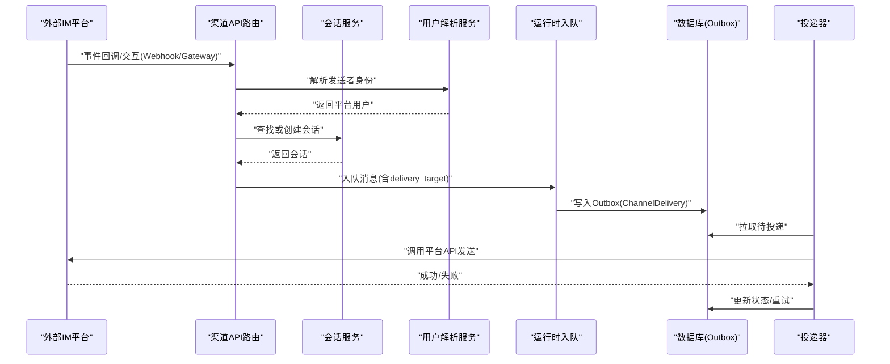
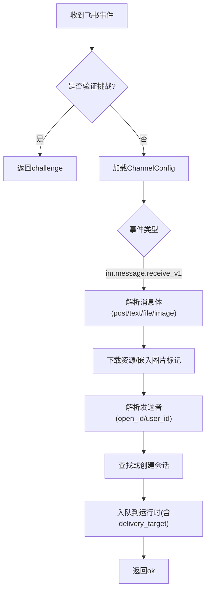
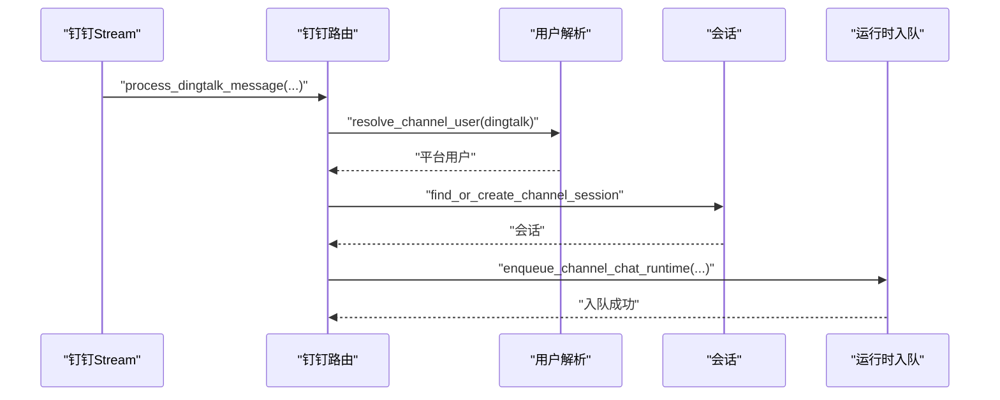
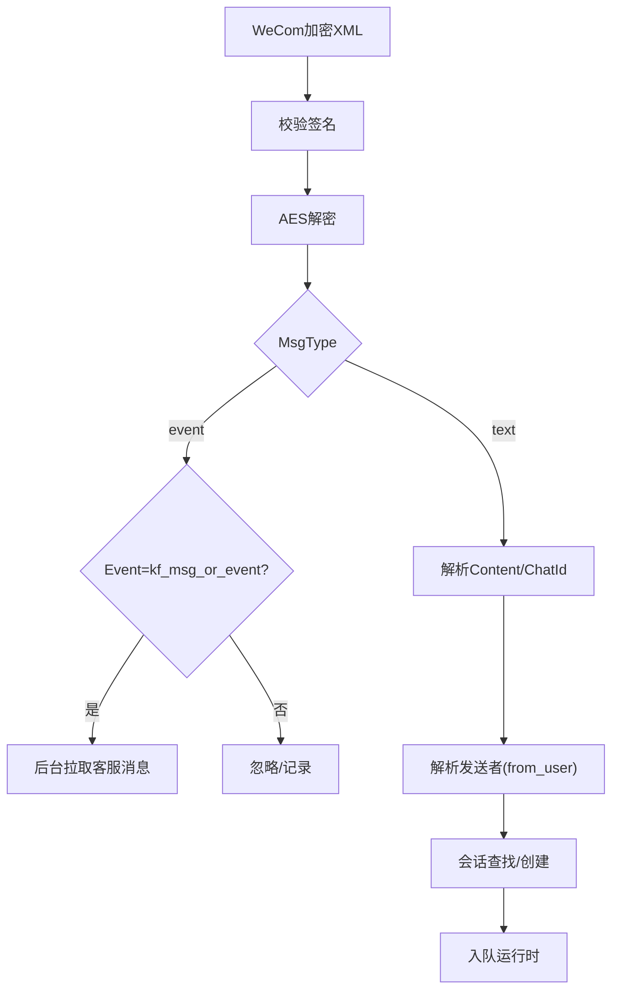
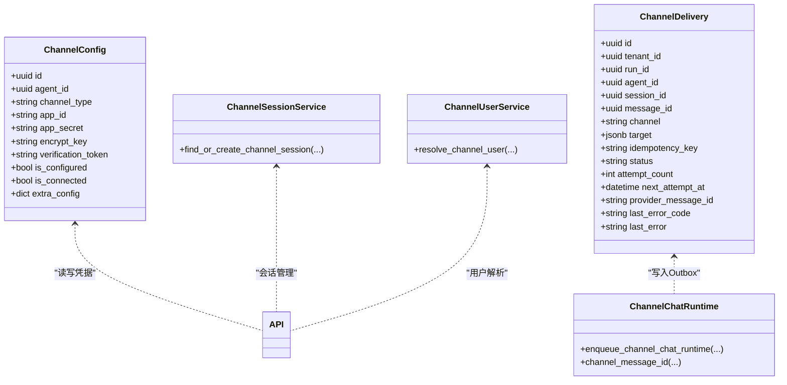
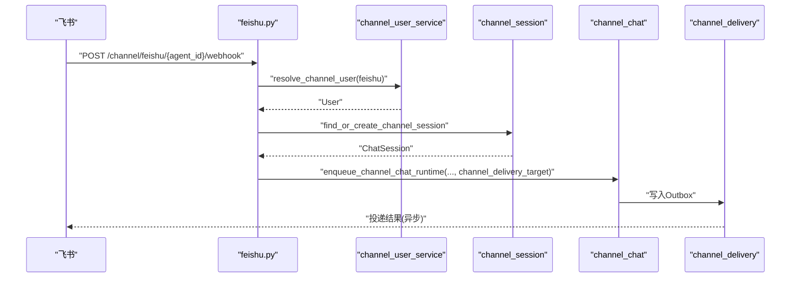

# 渠道集成API

<cite>
**本文引用的文件**   
- [channel_config.py](file://backend/app/models/channel_config.py)
- [channel_delivery.py](file://backend/app/models/channel_delivery.py)
- [feishu.py](file://backend/app/api/feishu.py)
- [dingtalk.py](file://backend/app/api/dingtalk.py)
- [wechat.py](file://backend/app/api/wechat.py)
- [wecom.py](file://backend/app/api/wecom.py)
- [slack.py](file://backend/app/api/slack.py)
- [discord_bot.py](file://backend/app/api/discord_bot.py)
- [whatsapp.py](file://backend/app/api/whatsapp.py)
- [channel_session.py](file://backend/app/services/channel_session.py)
- [channel_user_service.py](file://backend/app/services/channel_user_service.py)
- [channel_chat.py](file://backend/app/services/agent_runtime/channel_chat.py)
</cite>

## 目录
1. [简介](#简介)
2. [项目结构](#项目结构)
3. [核心组件](#核心组件)
4. [架构总览](#架构总览)
5. [详细组件分析](#详细组件分析)
6. [依赖关系分析](#依赖关系分析)
7. [性能考虑](#性能考虑)
8. [故障排查指南](#故障排查指南)
9. [结论](#结论)
10. [附录](#附录)

## 简介
本文件为Clawith平台“渠道集成系统”的完整API文档，覆盖飞书、钉钉、微信（企业微信iLink）、企业微信（WeCom）、Slack、Discord、WhatsApp等IM平台的接入方式。文档重点说明：
- 各渠道的消息格式转换与适配层实现
- 身份映射与会话隔离策略
- 权限同步与组织成员关联
- 渠道配置管理、连接状态监控、消息路由与投递
- 各渠道特有功能支持与限制
- 故障排查与性能优化建议

## 项目结构
后端采用FastAPI路由按渠道拆分，统一通过模型与共享服务完成会话、用户解析与运行时入队；持久化投递使用Outbox模式保障可靠性。

图表来源 
- [feishu.py](file://backend/app/api/feishu.py)
- [dingtalk.py](file://backend/app/api/dingtalk.py)
- [wechat.py](file://backend/app/api/wechat.py)
- [wecom.py](file://backend/app/api/wecom.py)
- [slack.py](file://backend/app/api/slack.py)
- [discord_bot.py](file://backend/app/api/discord_bot.py)
- [whatsapp.py](file://backend/app/api/whatsapp.py)
- [channel_config.py](file://backend/app/models/channel_config.py)
- [channel_delivery.py](file://backend/app/models/channel_delivery.py)
- [channel_session.py](file://backend/app/services/channel_session.py)
- [channel_user_service.py](file://backend/app/services/channel_user_service.py)
- [channel_chat.py](file://backend/app/services/agent_runtime/channel_chat.py)

章节来源
- [channel_config.py:1-52](file://backend/app/models/channel_config.py#L1-L52)
- [channel_delivery.py:1-169](file://backend/app/models/channel_delivery.py#L1-L169)

## 核心组件
- ChannelConfig：存储各渠道凭据与连接模式（WebSocket/Webhook），维护is_configured/is_connected状态与扩展字段extra_config。
- ChannelDelivery：Outbox表，记录每条消息的投递重试、幂等键、目标与错误信息，确保最终一致。
- channel_session：跨租户安全的会话创建与复用，支持群聊/单聊区分与名称更新。
- channel_user_service：统一的用户解析与组织成员关联，支持邮箱/手机号匹配与懒注册。
- channel_chat：将渠道消息原子性地入队到统一Agent Runtime，并支持等待恢复场景。

章节来源
- [channel_config.py:13-52](file://backend/app/models/channel_config.py#L13-L52)
- [channel_delivery.py:26-169](file://backend/app/models/channel_delivery.py#L26-L169)
- [channel_session.py:24-184](file://backend/app/services/channel_session.py#L24-L184)
- [channel_user_service.py:27-208](file://backend/app/services/channel_user_service.py#L27-L208)
- [channel_chat.py:104-162](file://backend/app/services/agent_runtime/channel_chat.py#L104-L162)

## 架构总览
下图展示从外部IM事件到内部运行时处理的端到端流程，以及Outbox投递机制。

图表来源 
- [feishu.py](file://backend/app/api/feishu.py)
- [dingtalk.py](file://backend/app/api/dingtalk.py)
- [wechat.py](file://backend/app/api/wechat.py)
- [wecom.py](file://backend/app/api/wecom.py)
- [slack.py](file://backend/app/api/slack.py)
- [discord_bot.py](file://backend/app/api/discord_bot.py)
- [whatsapp.py](file://backend/app/api/whatsapp.py)
- [channel_session.py](file://backend/app/services/channel_session.py)
- [channel_user_service.py](file://backend/app/services/channel_user_service.py)
- [channel_chat.py](file://backend/app/services/agent_runtime/channel_chat.py)
- [channel_delivery.py](file://backend/app/models/channel_delivery.py)

## 详细组件分析

### 飞书（Feishu）
- 配置接口
  - POST /api/agents/{agent_id}/channel：配置飞书机器人凭据与连接模式（webhook/websocket）。
  - GET /api/agents/{agent_id}/channel：获取配置。
  - DELETE /api/agents/{agent_id}/channel：删除配置。
  - GET /api/agents/{agent_id}/channel/webhook-url：获取Webhook地址。
- Webhook事件处理
  - POST /api/channel/feishu/{agent_id}/webhook：接收im.message.receive_v1等事件，去重、富文本解析、图片下载与附件处理，统一入队。
- OAuth回调
  - GET/POST /api/auth/feishu/callback：SSO登录回调，生成JWT并可选完成SSO流程。
- 关键特性
  - post类型消息自动提取文本与图片，图片以base64标记注入上下文。
  - 支持open_id/user_id双标识解析，优先稳定user_id。
  - 群聊/私聊会话隔离，group_name自动生成。

图表来源 
- [feishu.py](file://backend/app/api/feishu.py)

章节来源
- [feishu.py:130-235](file://backend/app/api/feishu.py#L130-L235)
- [feishu.py:388-577](file://backend/app/api/feishu.py#L388-L577)
- [feishu.py:580-689](file://backend/app/api/feishu.py#L580-L689)
- [feishu.py:36-126](file://backend/app/api/feishu.py#L36-L126)

### 钉钉（DingTalk）
- 配置接口
  - POST /api/agents/{agent_id}/dingtalk-channel：配置app_key/app_secret与连接模式（websocket/webhook）。
  - GET /api/agents/{agent_id}/dingtalk-channel：获取配置。
  - DELETE /api/agents/{agent_id}/dingtalk-channel：删除配置。
- 消息处理
  - process_dingtalk_message：由Stream回调触发，支持图片base64与文件路径传递，统一入队。
- OAuth回调
  - GET /api/auth/dingtalk/callback：SSO登录回调。

图表来源 
- [dingtalk.py](file://backend/app/api/dingtalk.py)
- [channel_user_service.py](file://backend/app/services/channel_user_service.py)
- [channel_session.py](file://backend/app/services/channel_session.py)
- [channel_chat.py](file://backend/app/services/agent_runtime/channel_chat.py)

章节来源
- [dingtalk.py:29-141](file://backend/app/api/dingtalk.py#L29-L141)
- [dingtalk.py:145-266](file://backend/app/api/dingtalk.py#L145-L266)
- [dingtalk.py:270-351](file://backend/app/api/dingtalk.py#L270-L351)

### 微信（企业微信iLink）
- 配置接口
  - POST /api/agents/{agent_id}/wechat-channel/qrcode：生成二维码。
  - GET /api/agents/{agent_id}/wechat-channel/qrcode-status：轮询扫码状态，成功后保存bot_token等。
  - GET /api/agents/{agent_id}/wechat-channel/qrcode-image：获取二维码图片。
  - GET /api/agents/{agent_id}/wechat-channel：获取配置。
  - DELETE /api/agents/{agent_id}/wechat-channel：删除配置。
- 特点
  - 基于iLink协议，扫码授权后启动轮询客户端。
  - 支持route_tag透传。

章节来源
- [wechat.py:54-173](file://backend/app/api/wechat.py#L54-L173)
- [wechat.py:175-217](file://backend/app/api/wechat.py#L175-L217)

### 企业微信（WeCom）
- 配置接口
  - POST /api/agents/{agent_id}/wecom-channel：支持WebSocket(AI Bot)与Webhook两种模式。
  - GET /api/agents/{agent_id}/wecom-channel：获取配置，WebSocket模式下可返回连接状态。
  - GET /api/agents/{agent_id}/wecom-channel/webhook-url：获取Webhook地址。
  - DELETE /api/agents/{agent_id}/wecom-channel：删除配置。
- Webhook事件
  - GET /api/channel/wecom/{agent_id}/webhook：回调URL校验。
  - POST /api/channel/wecom/{agent_id}/webhook：解密XML、签名校验、消息分发。
- 其他
  - 域名验证文件托管：/api/wecom-verify/{filename}。
  - 客服消息后台同步：kf_msg_or_event事件异步拉取。

图表来源 
- [wecom.py](file://backend/app/api/wecom.py)

章节来源
- [wecom.py:153-243](file://backend/app/api/wecom.py#L153-L243)
- [wecom.py:309-451](file://backend/app/api/wecom.py#L309-L451)
- [wecom.py:453-518](file://backend/app/api/wecom.py#L453-L518)
- [wecom.py:520-602](file://backend/app/api/wecom.py#L520-L602)
- [wecom.py:606-691](file://backend/app/api/wecom.py#L606-L691)

### Slack
- 配置接口
  - POST /api/agents/{agent_id}/slack-channel：配置bot_token与signing_secret。
  - GET /api/agents/{agent_id}/slack-channel：获取配置。
  - GET /api/agents/{agent_id}/slack-channel/webhook-url：获取Webhook地址。
  - DELETE /api/agents/{agent_id}/slack-channel：删除配置。
- Webhook事件
  - POST /api/channel/slack/{agent_id}/webhook：HMAC-SHA256签名校验、URL验证、事件过滤、文件下载与附件处理。

章节来源
- [slack.py:32-121](file://backend/app/api/slack.py#L32-L121)
- [slack.py:155-368](file://backend/app/api/slack.py#L155-L368)

### Discord
- 配置接口
  - POST /api/agents/{agent_id}/discord-channel：支持Gateway与Webhook两种模式。
  - GET /api/agents/{agent_id}/discord-channel：获取配置。
  - GET /api/agents/{agent_id}/discord-channel/webhook-url：获取Webhook地址。
  - DELETE /api/agents/{agent_id}/discord-channel：删除配置。
- 交互Webhook
  - POST /api/channel/discord/{agent_id}/webhook：ed25519签名校验、/ask命令处理、思考态响应。

章节来源
- [discord_bot.py:25-94](file://backend/app/api/discord_bot.py#L25-L94)
- [discord_bot.py:197-320](file://backend/app/api/discord_bot.py#L197-L320)

### WhatsApp
- 配置接口
  - POST /api/agents/{agent_id}/whatsapp-channel：配置access_token、phone_number_id、verify_token、app_secret、api_version。
  - GET /api/agents/{agent_id}/whatsapp-channel：获取配置。
  - GET /api/agents/{agent_id}/whatsapp-channel/webhook-url：获取Webhook地址。
  - DELETE /api/agents/{agent_id}/whatsapp-channel：删除配置。
- Webhook事件
  - GET /api/channel/whatsapp/{agent_id}/webhook：订阅验证。
  - POST /api/channel/whatsapp/{agent_id}/webhook：HMAC签名校验、消息提取与入队。

章节来源
- [whatsapp.py:51-151](file://backend/app/api/whatsapp.py#L51-L151)
- [whatsapp.py:153-264](file://backend/app/api/whatsapp.py#L153-L264)

## 依赖关系分析
- 路由层依赖ChannelConfig进行凭据读取与状态管理。
- 所有渠道均通过channel_user_service统一解析用户身份，避免重复创建与数据不一致。
- 会话通过channel_session保证租户安全与唯一性约束。
- 运行时入队通过channel_chat统一封装，支持等待恢复与幂等消息ID。
- Outbox表channel_delivery提供可靠投递与重试能力。

图表来源 
- [channel_config.py](file://backend/app/models/channel_config.py)
- [channel_delivery.py](file://backend/app/models/channel_delivery.py)
- [channel_session.py](file://backend/app/services/channel_session.py)
- [channel_user_service.py](file://backend/app/services/channel_user_service.py)
- [channel_chat.py](file://backend/app/services/agent_runtime/channel_chat.py)

章节来源
- [channel_config.py:13-52](file://backend/app/models/channel_config.py#L13-L52)
- [channel_delivery.py:26-169](file://backend/app/models/channel_delivery.py#L26-L169)

## 性能考虑
- 事件去重：各渠道在内存中维护已处理事件集合，防止重复处理（如飞书、Slack、WeCom）。
- 长连接模式：钉钉、企业微信、Discord支持WebSocket/Gateway模式，减少HTTP开销与延迟。
- 文件处理：Slack/飞书在入队前下载文件并落盘，避免大对象进入消息体；注意网络超时与权限范围（如files:read）。
- 会话锁：channel_session使用 advisory lock 避免并发冲突。
- Outbox重试：channel_delivery支持attempt_count与next_attempt_at，便于批量拉取与退避重试。

[本节为通用指导，不直接分析具体文件]

## 故障排查指南
- 飞书
  - 富文本post解析失败：检查content结构与locale键；确认im:resource权限用于下载图片。
  - 用户解析失败：当仅存在open_id无法映射到稳定user_id时，会拒绝创建重复用户。
- 钉钉
  - Stream模式未启动：确认connection_mode=websocket且已调用start_client。
  - 图片/文件路径：确保image_base64_list或saved_file_paths正确传入。
- 企业微信
  - AES解密失败：核对encoding_aes_key与token；检查XML结构。
  - 客服消息同步：关注errcode与cursor推进；超过24小时消息将被丢弃。
- Slack
  - 签名校验失败：检查x-slack-signature与时间戳；确保files:read权限。
  - HTML响应：表示触发了SSO重定向，需调整应用权限。
- Discord
  - ed25519签名失败：核对public_key与请求头；/ask命令参数缺失将返回提示。
- WhatsApp
  - HMAC签名失败：核对app_secret与x-hub-signature-256；验证hub.verify_token。

章节来源
- [feishu.py:440-504](file://backend/app/api/feishu.py#L440-L504)
- [feishu.py:555-571](file://backend/app/api/feishu.py#L555-L571)
- [dingtalk.py:145-266](file://backend/app/api/dingtalk.py#L145-L266)
- [wecom.py:373-451](file://backend/app/api/wecom.py#L373-L451)
- [slack.py:128-140](file://backend/app/api/slack.py#L128-L140)
- [slack.py:316-330](file://backend/app/api/slack.py#L316-L330)
- [discord_bot.py:180-195](file://backend/app/api/discord_bot.py#L180-L195)
- [whatsapp.py:30-35](file://backend/app/api/whatsapp.py#L30-L35)

## 结论
本渠道集成系统通过统一的API路由、共享服务与Outbox模型，实现了多IM平台的一致接入与可靠投递。借助会话与用户解析服务，确保了租户隔离、身份一致性与幂等处理。后续可在更多渠道扩展相同模式，并保持性能与稳定性。

[本节为总结性内容，不直接分析具体文件]

## 附录

### 渠道配置字段说明
- ChannelConfig
  - channel_type：枚举值包含 feishu、wecom、wechat、whatsapp、dingtalk、slack、discord、atlassian、microsoft_teams、agentbay。
  - app_id/app_secret：各渠道凭据（不同渠道含义不同，见各路由实现）。
  - encrypt_key/verification_token：加密密钥与验证令牌（依渠道需要）。
  - is_configured/is_connected：配置完成与连接状态。
  - extra_config：扩展配置（如connection_mode、agent_id、api_version等）。

章节来源
- [channel_config.py:20-41](file://backend/app/models/channel_config.py#L20-L41)

### 消息投递Outbox字段说明
- ChannelDelivery
  - channel/target：目标渠道与投递目标（如chat_id、session_webhook、phone等）。
  - idempotency_key/message_id：幂等与消息标识，保证去重。
  - status/attempt_count/next_attempt_at：重试控制。
  - last_error_code/last_error：错误追踪。

章节来源
- [channel_delivery.py:33-77](file://backend/app/models/channel_delivery.py#L33-L77)
- [channel_delivery.py:121-169](file://backend/app/models/channel_delivery.py#L121-L169)

### 典型调用序列（以飞书为例）

图表来源 
- [feishu.py](file://backend/app/api/feishu.py)
- [channel_user_service.py](file://backend/app/services/channel_user_service.py)
- [channel_session.py](file://backend/app/services/channel_session.py)
- [channel_chat.py](file://backend/app/services/agent_runtime/channel_chat.py)
- [channel_delivery.py](file://backend/app/models/channel_delivery.py)