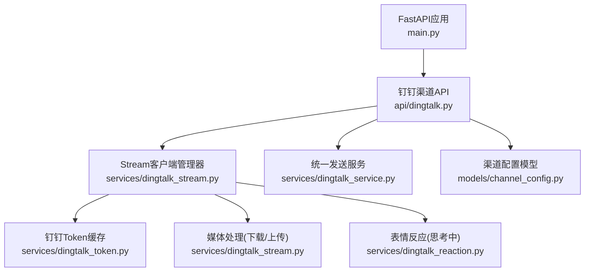
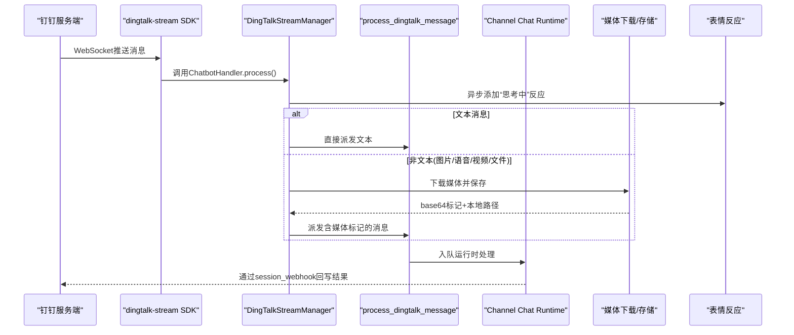
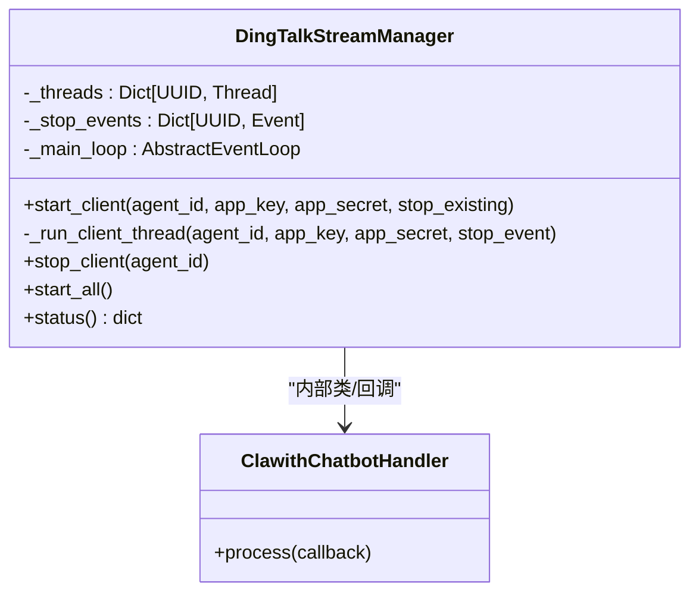
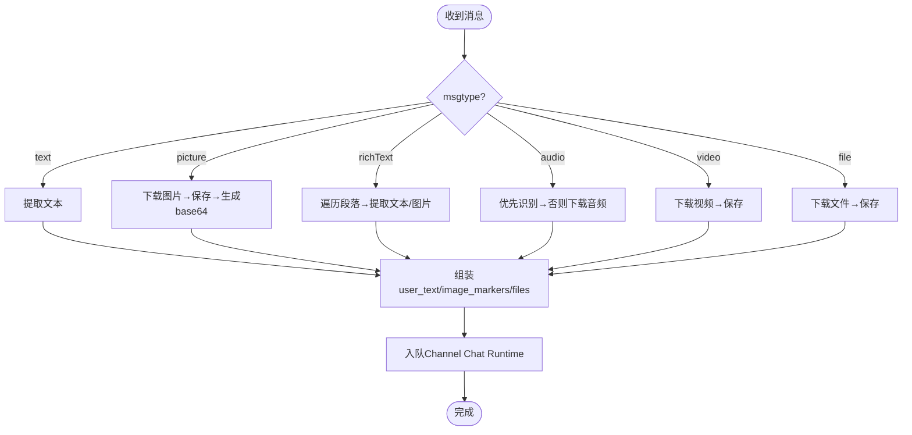
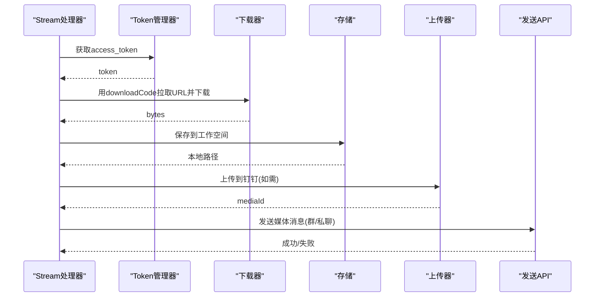
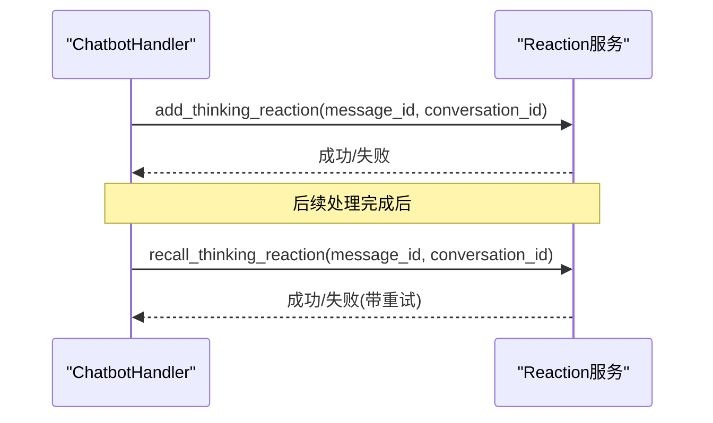
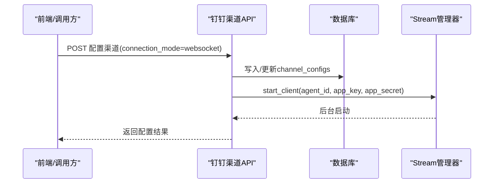
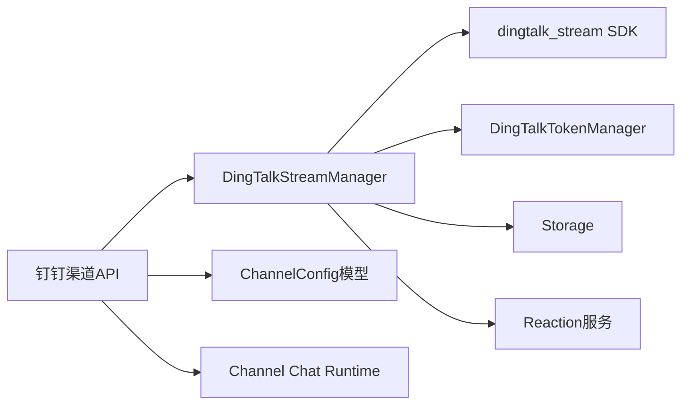

# Stream模式消息处理

<cite>
**本文引用的文件**   
- [backend/app/services/dingtalk_stream.py](file://backend/app/services/dingtalk_stream.py)
- [backend/app/api/dingtalk.py](file://backend/app/api/dingtalk.py)
- [backend/app/services/dingtalk_service.py](file://backend/app/services/dingtalk_service.py)
- [backend/app/services/dingtalk_token.py](file://backend/app/services/dingtalk_token.py)
- [backend/app/models/channel_config.py](file://backend/app/models/channel_config.py)
- [backend/app/main.py](file://backend/app/main.py)
- [backend/app/services/dingtalk_reaction.py](file://backend/app/services/dingtalk_reaction.py)
</cite>

## 目录
1. [简介](#简介)
2. [项目结构](#项目结构)
3. [核心组件](#核心组件)
4. [架构总览](#架构总览)
5. [详细组件分析](#详细组件分析)
6. [依赖关系分析](#依赖关系分析)
7. [性能与可靠性](#性能与可靠性)
8. [故障排查指南](#故障排查指南)
9. [结论](#结论)
10. [附录：配置与使用](#附录配置与使用)

## 简介
本文件为Clawith平台“钉钉Stream模式”消息处理的完整API与实现文档。内容覆盖WebSocket长连接建立、消息接收回调、实时通信机制、Stream客户端管理、连接状态监控、断线重连策略，以及群组/私聊、图片/语音/视频/文件等多类型消息的处理流程。同时提供Stream模式的配置指南与性能优化建议，帮助开发者快速集成与稳定运行。

## 项目结构
钉钉Stream相关代码主要分布在以下模块：
- API路由层：负责渠道配置CRUD、触发Stream客户端启停、消息入队处理
- 服务层：Stream客户端管理、媒体下载/上传、Token缓存、表情反应（思考中）
- 模型层：渠道配置持久化
- 应用入口：启动时初始化并拉起所有已配置的Stream客户端

**图表来源** 
- [backend/app/main.py:121-200](file://backend/app/main.py#L121-L200)
- [backend/app/api/dingtalk.py:29-95](file://backend/app/api/dingtalk.py#L29-L95)
- [backend/app/services/dingtalk_stream.py:397-695](file://backend/app/services/dingtalk_stream.py#L397-L695)
- [backend/app/services/dingtalk_token.py:14-78](file://backend/app/services/dingtalk_token.py#L14-L78)
- [backend/app/models/channel_config.py:13-52](file://backend/app/models/channel_config.py#L13-L52)

**章节来源**
- [backend/app/main.py:121-200](file://backend/app/main.py#L121-L200)
- [backend/app/api/dingtalk.py:29-95](file://backend/app/api/dingtalk.py#L29-L95)
- [backend/app/services/dingtalk_stream.py:397-695](file://backend/app/services/dingtalk_stream.py#L397-L695)
- [backend/app/services/dingtalk_token.py:14-78](file://backend/app/services/dingtalk_token.py#L14-L78)
- [backend/app/models/channel_config.py:13-52](file://backend/app/models/channel_config.py#L13-L52)

## 核心组件
- 钉钉Stream客户端管理器：按Agent维度维护独立线程与事件循环桥接，负责连接、回调分发、断线重连
- 消息处理管道：将文本/多媒体消息解析后，统一入队到运行时通道，通过session webhook回写结果
- Token缓存管理器：全局缓存access_token并按需刷新，避免频繁请求
- 媒体处理：下载用户附件、保存至工作空间、生成base64标记供多模态LLM消费；支持图片/语音/视频/文件
- 表情反应：在收到消息后立即添加“🤔思考中”反应，提升交互体验

**章节来源**
- [backend/app/services/dingtalk_stream.py:397-695](file://backend/app/services/dingtalk_stream.py#L397-L695)
- [backend/app/api/dingtalk.py:145-266](file://backend/app/api/dingtalk.py#L145-L266)
- [backend/app/services/dingtalk_token.py:14-78](file://backend/app/services/dingtalk_token.py#L14-L78)
- [backend/app/services/dingtalk_reaction.py:8-56](file://backend/app/services/dingtalk_reaction.py#L8-L56)

## 架构总览
下图展示从钉钉Stream接入到后端处理与回复的端到端流程。

**图表来源** 
- [backend/app/services/dingtalk_stream.py:468-556](file://backend/app/services/dingtalk_stream.py#L468-L556)
- [backend/app/api/dingtalk.py:145-266](file://backend/app/api/dingtalk.py#L145-L266)
- [backend/app/services/dingtalk_reaction.py:8-56](file://backend/app/services/dingtalk_reaction.py#L8-L56)

## 详细组件分析

### 钉钉Stream客户端管理（DingTalkStreamManager）
- 职责：
  - 为每个Agent创建独立线程运行SDK事件循环
  - 捕获主事件循环，跨线程安全调度协程
  - 自动重连与退避策略，支持优雅停止
  - 批量启动所有已配置渠道
- 关键方法：
  - start_client(agent_id, app_key, app_secret, stop_existing=True)
  - _run_client_thread(...) 内部定义ChatbotHandler并注册回调
  - stop_client(agent_id) 设置停止事件并等待线程退出
  - start_all() 扫描数据库并启动所有渠道
  - status() 返回各Agent线程存活状态

**图表来源** 
- [backend/app/services/dingtalk_stream.py:397-695](file://backend/app/services/dingtalk_stream.py#L397-L695)

**章节来源**
- [backend/app/services/dingtalk_stream.py:397-695](file://backend/app/services/dingtalk_stream.py#L397-L695)

### 消息接收与处理（Text/Media）
- 文本消息：提取纯文本，立即添加“思考中”反应，随后入队运行时
- 非文本消息：
  - 图片：下载→保存→生成data URI→拼接标记→入队
  - 富文本：遍历段落，提取文本与图片，分别处理
  - 语音：优先使用识别结果，否则下载音频并保存
  - 视频/文件：下载并保存，记录文件名与大小信息
- 统一处理函数_process_media_message返回(user_text, image_base64_list, saved_file_paths)

**图表来源** 
- [backend/app/services/dingtalk_stream.py:80-233](file://backend/app/services/dingtalk_stream.py#L80-L233)
- [backend/app/api/dingtalk.py:145-266](file://backend/app/api/dingtalk.py#L145-L266)

**章节来源**
- [backend/app/services/dingtalk_stream.py:80-233](file://backend/app/services/dingtalk_stream.py#L80-L233)
- [backend/app/api/dingtalk.py:145-266](file://backend/app/api/dingtalk.py#L145-L266)

### 媒体下载与上传
- 下载：通过downloadCode获取临时URL，再下载字节流；失败则返回None并记录日志
- 上传：使用legacy oapi接口上传media，兼容新旧字段名；成功后返回mediaId
- 发送媒体消息：根据media_type构造msgKey/msgParam，区分群聊/私聊发送

**图表来源** 
- [backend/app/services/dingtalk_stream.py:28-78](file://backend/app/services/dingtalk_stream.py#L28-L78)
- [backend/app/services/dingtalk_stream.py:237-386](file://backend/app/services/dingtalk_stream.py#L237-L386)
- [backend/app/services/dingtalk_token.py:31-64](file://backend/app/services/dingtalk_token.py#L31-L64)

**章节来源**
- [backend/app/services/dingtalk_stream.py:28-78](file://backend/app/services/dingtalk_stream.py#L28-L78)
- [backend/app/services/dingtalk_stream.py:237-386](file://backend/app/services/dingtalk_stream.py#L237-L386)
- [backend/app/services/dingtalk_token.py:31-64](file://backend/app/services/dingtalk_token.py#L31-L64)

### 表情反应（思考中）
- 收到消息后立即异步添加“🤔思考中”反应，提升用户体验
- 完成后尝试撤回该反应，具备重试机制

**图表来源** 
- [backend/app/services/dingtalk_reaction.py:8-56](file://backend/app/services/dingtalk_reaction.py#L8-L56)
- [backend/app/services/dingtalk_reaction.py:58-111](file://backend/app/services/dingtalk_reaction.py#L58-L111)

**章节来源**
- [backend/app/services/dingtalk_reaction.py:8-56](file://backend/app/services/dingtalk_reaction.py#L8-L56)
- [backend/app/services/dingtalk_reaction.py:58-111](file://backend/app/services/dingtalk_reaction.py#L58-L111)

### API路由与配置管理
- POST /agents/{agent_id}/dingtalk-channel：配置或更新钉钉渠道，支持connection_mode切换（websocket/webhook），并在websocket模式下自动启动/重启Stream客户端
- GET /agents/{agent_id}/dingtalk-channel：查询渠道配置
- DELETE /agents/{agent_id}/dingtalk-channel：删除渠道并停止Stream客户端
- process_dingtalk_message：内部消息处理入口，负责会话隔离、用户解析、运行时入队与结果回写

**图表来源** 
- [backend/app/api/dingtalk.py:29-95](file://backend/app/api/dingtalk.py#L29-L95)

**章节来源**
- [backend/app/api/dingtalk.py:29-95](file://backend/app/api/dingtalk.py#L29-L95)
- [backend/app/api/dingtalk.py:145-266](file://backend/app/api/dingtalk.py#L145-L266)

### 应用启动与初始化
- 应用生命周期内导入并调用dingtalk_stream_manager.start_all()，扫描已配置渠道并启动对应Stream客户端
- 确保数据库表存在、日志配置、角色开关等前置条件就绪

**章节来源**
- [backend/app/main.py:121-200](file://backend/app/main.py#L121-L200)

## 依赖关系分析
- dingtalk_stream_manager依赖：
  - dingtalk_stream SDK（外部库）
  - dingtalk_token_manager（Token缓存）
  - storage（媒体存储）
  - channel_session/channel_user_service（会话与用户解析）
  - dingtalk_reaction（表情反应）
- API路由依赖：
  - ChannelConfig模型（渠道配置）
  - agent_runtime.channel_chat（运行时入队）
- 服务层依赖：
  - httpx（HTTP客户端）
  - loguru（日志）
  - sqlalchemy（数据库访问）

**图表来源** 
- [backend/app/services/dingtalk_stream.py:397-695](file://backend/app/services/dingtalk_stream.py#L397-L695)
- [backend/app/api/dingtalk.py:29-95](file://backend/app/api/dingtalk.py#L29-L95)
- [backend/app/services/dingtalk_token.py:14-78](file://backend/app/services/dingtalk_token.py#L14-L78)

**章节来源**
- [backend/app/services/dingtalk_stream.py:397-695](file://backend/app/services/dingtalk_stream.py#L397-L695)
- [backend/app/api/dingtalk.py:29-95](file://backend/app/api/dingtalk.py#L29-L95)
- [backend/app/services/dingtalk_token.py:14-78](file://backend/app/services/dingtalk_token.py#L14-L78)

## 性能与可靠性
- 连接与重连
  - 指数退避重连策略（固定延迟序列），最大重试次数限制，避免雪崩
  - 每Agent独立线程隔离，单点异常不影响其他Agent
- 并发与调度
  - 跨线程使用run_coroutine_threadsafe将回调调度到主事件循环，保证DB/LLM调用安全
  - “思考中”反应采用fire-and-forget，不阻塞主流程
- 资源与I/O
  - 媒体下载/上传使用httpx异步客户端，合理超时与重定向跟随
  - 本地存储避免大对象在内存中堆积，仅保留必要元数据与路径
- 可观测性
  - 全链路loguru日志，便于定位问题与监控健康度
- 建议
  - 生产环境启用连接池与限流，控制并发下载/上传
  - 对超大文件进行分片或限速，避免占用过多带宽
  - 定期清理过期媒体文件与工作空间残留

[本节为通用指导，无需引用具体文件]

## 故障排查指南
- 无法连接Stream
  - 检查app_key/app_secret是否正确
  - 查看日志中是否提示缺少dingtalk-stream包
  - 确认start_all是否被调用且数据库中存在is_configured=true的记录
- 消息未处理
  - 确认process_dingtalk_message是否被调用
  - 检查sender_staff_id是否为空导致跳过
  - 查看运行时入队是否成功（队列/任务系统）
- 媒体下载失败
  - 检查downloadCode是否存在与有效
  - 确认网络可达与权限正确
  - 查看存储路径是否可写
- 表情反应失败
  - 检查token获取是否成功
  - 确认message_id与conversation_id有效
  - 查看重试逻辑与错误码

**章节来源**
- [backend/app/services/dingtalk_stream.py:449-458](file://backend/app/services/dingtalk_stream.py#L449-L458)
- [backend/app/api/dingtalk.py:174-184](file://backend/app/api/dingtalk.py#L174-L184)
- [backend/app/services/dingtalk_reaction.py:8-56](file://backend/app/services/dingtalk_reaction.py#L8-L56)

## 结论
Clawith平台的钉钉Stream模式以“每Agent独立线程+SDK事件循环+主循环调度”的架构实现了高可靠、可扩展的实时消息处理。通过统一的媒体处理与Token缓存，结合表情反应与重连策略，提供了良好的用户体验与稳定性。配合完善的API路由与配置管理，开发者可快速集成并运维。

[本节为总结，无需引用具体文件]

## 附录：配置与使用
- 配置步骤
  - 调用POST /agents/{agent_id}/dingtalk-channel，传入app_key、app_secret与extra_config.connection_mode=websocket
  - 系统将自动启动对应Agent的Stream客户端
- 查询与删除
  - GET /agents/{agent_id}/dingtalk-channel 查询配置
  - DELETE /agents/{agent_id}/dingtalk-channel 删除配置并停止Stream客户端
- 消息类型支持
  - 文本、图片、富文本、语音、视频、文件
- 实时通信机制
  - 基于钉钉Stream WebSocket长连接
  - 通过session_webhook回写结果，无需公网回调地址
- 性能优化建议
  - 合理设置超时与重试参数
  - 控制并发下载/上传数量
  - 定期清理无用媒体文件

**章节来源**
- [backend/app/api/dingtalk.py:29-95](file://backend/app/api/dingtalk.py#L29-L95)
- [backend/app/services/dingtalk_stream.py:662-695](file://backend/app/services/dingtalk_stream.py#L662-L695)
- [backend/app/services/dingtalk_stream.py:80-233](file://backend/app/services/dingtalk_stream.py#L80-L233)