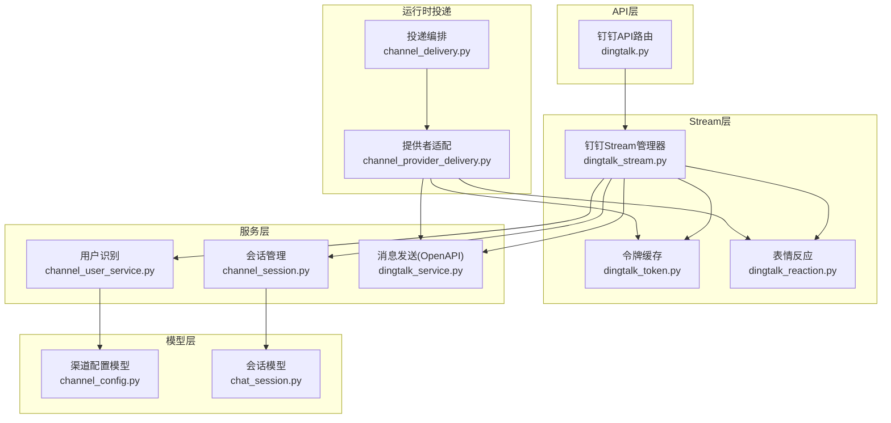
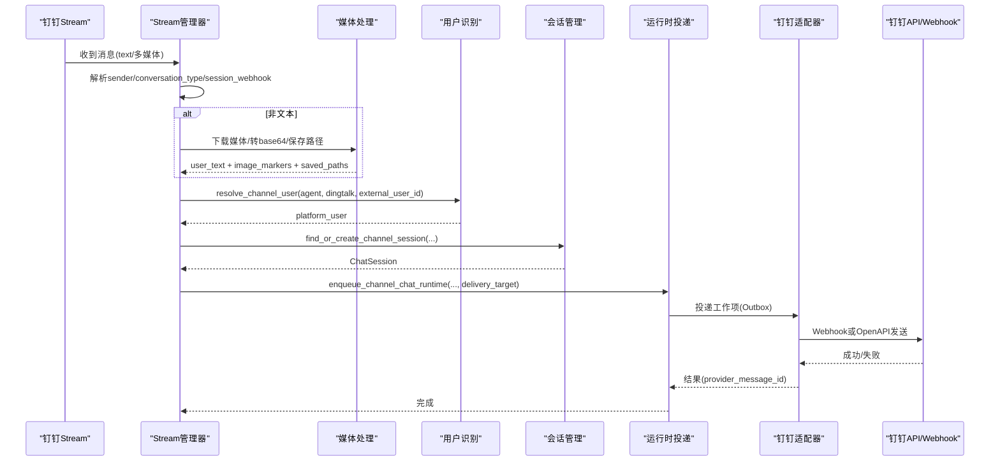
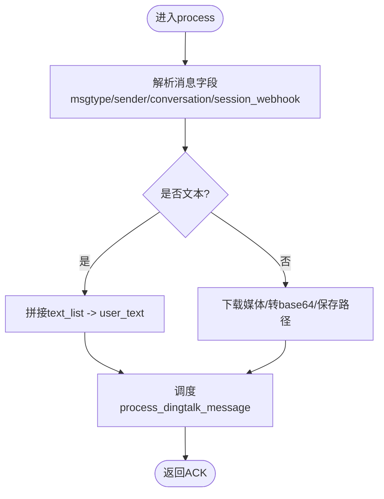
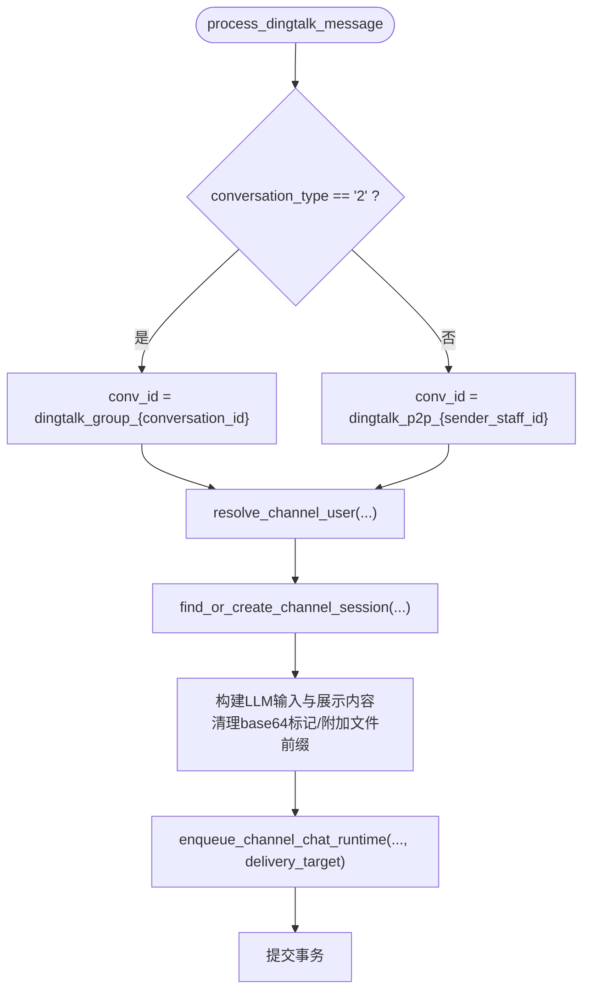
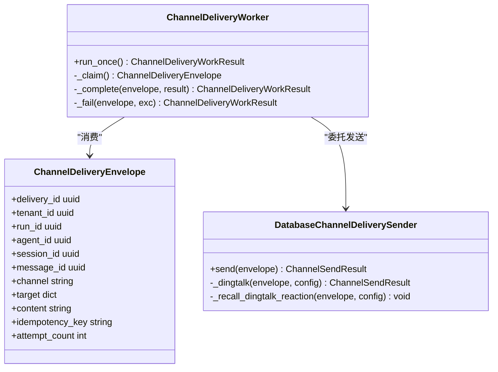
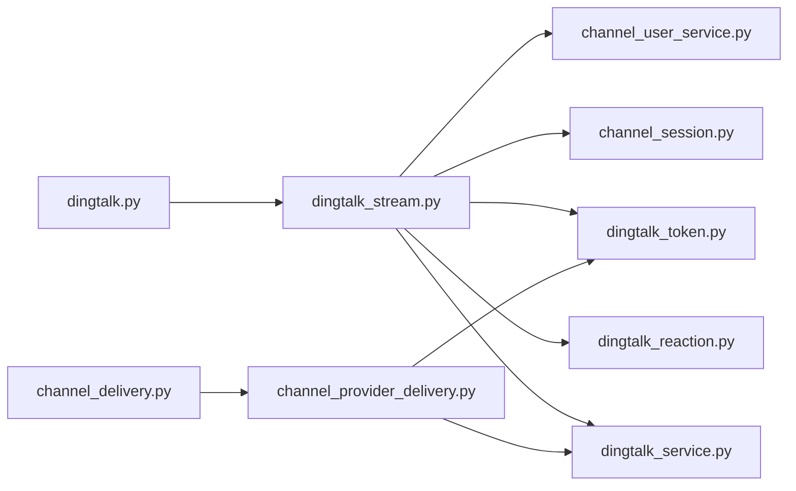

# 消息处理与路由

<cite>
**本文引用的文件**   
- [backend/app/api/dingtalk.py](file://backend/app/api/dingtalk.py)
- [backend/app/services/dingtalk_stream.py](file://backend/app/services/dingtalk_stream.py)
- [backend/app/services/dingtalk_service.py](file://backend/app/services/dingtalk_service.py)
- [backend/app/services/dingtalk_token.py](file://backend/app/services/dingtalk_token.py)
- [backend/app/services/dingtalk_reaction.py](file://backend/app/services/dingtalk_reaction.py)
- [backend/app/services/channel_session.py](file://backend/app/services/channel_session.py)
- [backend/app/services/channel_user_service.py](file://backend/app/services/channel_user_service.py)
- [backend/app/models/channel_config.py](file://backend/app/models/channel_config.py)
- [backend/app/models/chat_session.py](file://backend/app/models/chat_session.py)
- [backend/app/services/agent_runtime/channel_delivery.py](file://backend/app/services/agent_runtime/channel_delivery.py)
- [backend/app/services/agent_runtime/channel_provider_delivery.py](file://backend/app/services/agent_runtime/channel_provider_delivery.py)
</cite>

## 目录
1. [简介](#简介)
2. [项目结构](#项目结构)
3. [核心组件](#核心组件)
4. [架构总览](#架构总览)
5. [详细组件分析](#详细组件分析)
6. [依赖关系分析](#依赖关系分析)
7. [性能考虑](#性能考虑)
8. [故障排查指南](#故障排查指南)
9. [结论](#结论)
10. [附录：API定义与调试方法](#附录api定义与调试方法)

## 简介
本文件面向Clawith平台的钉钉消息处理与路由系统，覆盖从消息接入、解析、用户识别与会话隔离，到内容提取（文本、图片、语音、视频、文件）、回复投递与“思考中”表情反应等完整链路。文档同时给出关键流程图与调试方法，帮助开发者快速定位问题并优化性能。

## 项目结构
围绕钉钉通道的相关代码主要分布在以下模块：
- API层：钉钉渠道配置与回调入口
- Stream层：WebSocket长连接接收消息、媒体下载与分发
- 服务层：统一用户识别、会话管理、令牌缓存、消息发送
- 运行时投递：Outbox持久化与多通道适配发送
- 模型层：渠道配置与会话模型

图表来源 
- [backend/app/api/dingtalk.py](file://backend/app/api/dingtalk.py)
- [backend/app/services/dingtalk_stream.py](file://backend/app/services/dingtalk_stream.py)
- [backend/app/services/dingtalk_token.py](file://backend/app/services/dingtalk_token.py)
- [backend/app/services/dingtalk_reaction.py](file://backend/app/services/dingtalk_reaction.py)
- [backend/app/services/channel_user_service.py](file://backend/app/services/channel_user_service.py)
- [backend/app/services/channel_session.py](file://backend/app/services/channel_session.py)
- [backend/app/services/dingtalk_service.py](file://backend/app/services/dingtalk_service.py)
- [backend/app/services/agent_runtime/channel_delivery.py](file://backend/app/services/agent_runtime/channel_delivery.py)
- [backend/app/services/agent_runtime/channel_provider_delivery.py](file://backend/app/services/agent_provider_delivery.py)
- [backend/app/models/channel_config.py](file://backend/app/models/channel_config.py)
- [backend/app/models/chat_session.py](file://backend/app/models/chat_session.py)

章节来源
- [backend/app/api/dingtalk.py](file://backend/app/api/dingtalk.py)
- [backend/app/services/dingtalk_stream.py](file://backend/app/services/dingtalk_stream.py)
- [backend/app/services/dingtalk_service.py](file://backend/app/services/dingtalk_service.py)
- [backend/app/services/dingtalk_token.py](file://backend/app/services/dingtalk_token.py)
- [backend/app/services/dingtalk_reaction.py](file://backend/app/services/dingtalk_reaction.py)
- [backend/app/services/channel_session.py](file://backend/app/services/channel_session.py)
- [backend/app/services/channel_user_service.py](file://backend/app/services/channel_user_service.py)
- [backend/app/models/channel_config.py](file://backend/app/models/channel_config.py)
- [backend/app/models/chat_session.py](file://backend/app/models/chat_session.py)
- [backend/app/services/agent_runtime/channel_delivery.py](file://backend/app/services/agent_runtime/channel_delivery.py)
- [backend/app/services/agent_runtime/channel_provider_delivery.py](file://backend/app/services/agent_runtime/channel_provider_delivery.py)

## 核心组件
- 钉钉Stream管理器：维护每个Agent的独立线程与事件循环，自动重连，统一分发消息处理。
- 消息处理器：区分群聊与私聊，解析文本/富文本/图片/语音/视频/文件，生成LLM输入与展示内容。
- 用户识别服务：基于OrgMember/SSO模式，按优先级匹配或懒创建平台用户，保证跨渠道身份稳定。
- 会话管理服务：按tenant+agent+external_conv_id唯一约束，确保会话隔离与复用。
- 令牌缓存：全局缓存access_token，提前刷新避免过期。
- 表情反应：为原始消息添加“🤔思考中”，并在回复后撤回。
- 运行时投递：Outbox模式持久化投递任务，支持重试与幂等；提供钉钉适配器通过Webhook或OpenAPI发送。

章节来源
- [backend/app/services/dingtalk_stream.py](file://backend/app/services/dingtalk_stream.py)
- [backend/app/api/dingtalk.py](file://backend/app/api/dingtalk.py)
- [backend/app/services/channel_user_service.py](file://backend/app/services/channel_user_service.py)
- [backend/app/services/channel_session.py](file://backend/app/services/channel_session.py)
- [backend/app/services/dingtalk_token.py](file://backend/app/services/dingtalk_token.py)
- [backend/app/services/dingtalk_reaction.py](file://backend/app/services/dingtalk_reaction.py)
- [backend/app/services/agent_runtime/channel_delivery.py](file://backend/app/services/agent_runtime/channel_delivery.py)
- [backend/app/services/agent_runtime/channel_provider_delivery.py](file://backend/app/services/agent_runtime/channel_provider_delivery.py)

## 架构总览
下图展示了从钉钉消息入站到回复投递的端到端流程，包括群聊/私聊分流、用户识别、会话隔离、媒体处理与Outbox投递。

图表来源 
- [backend/app/services/dingtalk_stream.py](file://backend/app/services/dingtalk_stream.py)
- [backend/app/api/dingtalk.py](file://backend/app/api/dingtalk.py)
- [backend/app/services/channel_user_service.py](file://backend/app/services/channel_user_service.py)
- [backend/app/services/channel_session.py](file://backend/app/services/channel_session.py)
- [backend/app/services/agent_runtime/channel_delivery.py](file://backend/app/services/agent_runtime/channel_delivery.py)
- [backend/app/services/agent_runtime/channel_provider_delivery.py](file://backend/app/services/agent_runtime/channel_provider_delivery.py)

## 详细组件分析

### 钉钉Stream管理器与消息分发
- 职责：启动/停止Agent级Stream客户端；在独立线程运行SDK事件循环；将消息派发至主事件循环处理；对非文本消息进行媒体下载与预处理。
- 关键点：
  - 自动重连与指数退避，最大重试次数限制。
  - 立即添加“思考中”表情反应提升用户体验。
  - 文本与非文本分支处理，统一调用process_dingtalk_message。

图表来源 
- [backend/app/services/dingtalk_stream.py](file://backend/app/services/dingtalk_stream.py)

章节来源
- [backend/app/services/dingtalk_stream.py](file://backend/app/services/dingtalk_stream.py)

### 消息处理器：群聊/私聊区分与会话隔离
- 群聊与私聊判定：conversation_type="2"为群聊，否则为私聊。
- 会话隔离键：
  - 群聊：dingtalk_group_{conversation_id}
  - 私聊：dingtalk_p2p_{sender_staff_id}
- 用户识别：通过channel_user_service.resolve_channel_user，优先匹配已关联OrgMember的用户，其次按邮箱/手机号匹配，最后懒创建新用户。
- 会话创建：find_or_create_channel_session保证tenant+agent+external_conv_id唯一，避免重复会话。

图表来源 
- [backend/app/api/dingtalk.py](file://backend/app/api/dingtalk.py)
- [backend/app/services/channel_user_service.py](file://backend/app/services/channel_user_service.py)
- [backend/app/services/channel_session.py](file://backend/app/services/channel_session.py)

章节来源
- [backend/app/api/dingtalk.py](file://backend/app/api/dingtalk.py)
- [backend/app/services/channel_user_service.py](file://backend/app/services/channel_user_service.py)
- [backend/app/services/channel_session.py](file://backend/app/services/channel_session.py)

### 用户识别与身份映射
- 优先级：
  1) OrgMember已绑定User → 直接返回
  2) OrgMember存在未绑定 → 创建User并绑定
  3) 通过email/mobile匹配已有User → 绑定OrgMember
  4) 无匹配 → 懒创建User与OrgMember壳记录
- 渠道差异：DingTalk优先unionid，其次external_id；Feishu严格使用user_id作为external_id，拒绝仅open_id懒创建。
- 防重策略：查询时优先选择已绑定User的记录，避免重复创建。

章节来源
- [backend/app/services/channel_user_service.py](file://backend/app/services/channel_user_service.py)

### 会话模型与隔离
- ChatSession关键字段：source_channel、external_conv_id、is_group、group_name、is_primary等。
- 唯一性约束：(agent_id, external_conv_id)唯一，保障跨租户/Agent的会话隔离。
- 群聊会话：user_id为占位（创建者），不纳入用户“我的会话”列表。

章节来源
- [backend/app/models/chat_session.py](file://backend/app/models/chat_session.py)
- [backend/app/services/channel_session.py](file://backend/app/services/channel_session.py)

### 令牌管理与媒体下载
- DingTalkTokenManager：按app_key缓存access_token，提前300s刷新，并发安全。
- 媒体下载：根据downloadCode获取临时URL，再下载字节流；图片转为base64数据URI供视觉LLM使用；音视频/文件保存到工作区并返回路径。

章节来源
- [backend/app/services/dingtalk_token.py](file://backend/app/services/dingtalk_token.py)
- [backend/app/services/dingtalk_stream.py](file://backend/app/services/dingtalk_stream.py)

### 表情反应（思考中）
- 收到消息后立即添加“🤔思考中”反应，提升交互体验。
- 回复成功后撤回该反应，避免残留。

章节来源
- [backend/app/services/dingtalk_reaction.py](file://backend/app/services/dingtalk_reaction.py)

### 运行时投递与钉钉适配器
- Outbox模式：stage_channel_delivery写入投递表，Worker按幂等键与退避策略重试，失败不触发Graph重跑。
- 钉钉适配器：
  - 若存在session_webhook，则直接POST Markdown到Webhook。
  - 否则走OpenAPI v1.0机器人单聊接口发送。
  - 发送成功后撤回“思考中”反应。

图表来源 
- [backend/app/services/agent_runtime/channel_delivery.py](file://backend/app/services/agent_runtime/channel_delivery.py)
- [backend/app/services/agent_runtime/channel_provider_delivery.py](file://backend/app/services/agent_runtime/channel_provider_delivery.py)

章节来源
- [backend/app/services/agent_runtime/channel_delivery.py](file://backend/app/services/agent_runtime/channel_delivery.py)
- [backend/app/services/agent_runtime/channel_provider_delivery.py](file://backend/app/services/agent_runtime/channel_provider_delivery.py)

## 依赖关系分析
- API层依赖Stream管理器与用户识别/会话服务。
- Stream管理器依赖令牌缓存、媒体下载、表情反应与消息处理器。
- 运行时投递依赖数据库会话工厂与各通道适配器。
- 钉钉适配器依赖OpenAPI与Webhook两种发送方式。

图表来源 
- [backend/app/api/dingtalk.py](file://backend/app/api/dingtalk.py)
- [backend/app/services/dingtalk_stream.py](file://backend/app/services/dingtalk_stream.py)
- [backend/app/services/channel_user_service.py](file://backend/app/services/channel_user_service.py)
- [backend/app/services/channel_session.py](file://backend/app/services/channel_session.py)
- [backend/app/services/dingtalk_token.py](file://backend/app/services/dingtalk_token.py)
- [backend/app/services/dingtalk_reaction.py](file://backend/app/services/dingtalk_reaction.py)
- [backend/app/services/dingtalk_service.py](file://backend/app/services/dingtalk_service.py)
- [backend/app/services/agent_runtime/channel_delivery.py](file://backend/app/services/agent_runtime/channel_delivery.py)
- [backend/app/services/agent_runtime/channel_provider_delivery.py](file://backend/app/services/agent_runtime/channel_provider_delivery.py)

章节来源
- [backend/app/api/dingtalk.py](file://backend/app/api/dingtalk.py)
- [backend/app/services/dingtalk_stream.py](file://backend/app/services/dingtalk_stream.py)
- [backend/app/services/channel_user_service.py](file://backend/app/services/channel_user_service.py)
- [backend/app/services/channel_session.py](file://backend/app/services/channel_session.py)
- [backend/app/services/dingtalk_token.py](file://backend/app/services/dingtalk_token.py)
- [backend/app/services/dingtalk_reaction.py](file://backend/app/services/dingtalk_reaction.py)
- [backend/app/services/dingtalk_service.py](file://backend/app/services/dingtalk_service.py)
- [backend/app/services/agent_runtime/channel_delivery.py](file://backend/app/services/agent_runtime/channel_delivery.py)
- [backend/app/services/agent_runtime/channel_provider_delivery.py](file://backend/app/services/agent_runtime/channel_provider_delivery.py)

## 性能考虑
- Stream客户端线程隔离：每个Agent一个线程，避免阻塞主事件循环。
- 令牌缓存：减少频繁网络请求，降低延迟。
- Outbox重试：指数退避与最大尝试次数控制，避免雪崩。
- 媒体处理：图片转base64用于视觉LLM，文件落盘避免大对象内存占用。
- 会话查找：使用数据库唯一约束与锁机制，避免并发重复创建。

[本节为通用指导，无需引用具体文件]

## 故障排查指南
- 无法接收消息：检查Stream客户端是否启动、凭证是否正确、钉钉Stream SDK是否安装。
- 媒体下载失败：确认downloadCode有效、网络可达、存储权限正常。
- 用户识别失败：检查OrgMember是否存在、email/mobile是否一致、Feishu/DingTalk标识是否符合要求。
- 会话冲突：核对external_conv_id是否唯一、tenant与agent范围是否正确。
- 投递失败：查看Outbox状态、错误码与重试次数；确认Webhook或OpenAPI返回码。
- 表情反应异常：检查token有效性、消息ID与对话ID是否正确。

章节来源
- [backend/app/services/dingtalk_stream.py](file://backend/app/services/dingtalk_stream.py)
- [backend/app/services/dingtalk_token.py](file://backend/app/services/dingtalk_token.py)
- [backend/app/services/channel_user_service.py](file://backend/app/services/channel_user_service.py)
- [backend/app/services/channel_session.py](file://backend/app/services/channel_session.py)
- [backend/app/services/agent_runtime/channel_delivery.py](file://backend/app/services/agent_runtime/channel_delivery.py)
- [backend/app/services/agent_runtime/channel_provider_delivery.py](file://backend/app/services/agent_runtime/channel_provider_delivery.py)
- [backend/app/services/dingtalk_reaction.py](file://backend/app/services/dingtalk_reaction.py)

## 结论
本系统以Stream模式接入钉钉消息，结合统一用户识别与会话隔离，实现群聊/私聊的多模态消息处理与可靠投递。Outbox与适配器设计保证了跨通道的可扩展性与稳定性。建议在生产环境关注日志与指标，定期校验凭证与会话一致性，持续优化媒体处理与重试策略。

[本节为总结，无需引用具体文件]

## 附录：API定义与调试方法

### 渠道配置API
- POST /agents/{agent_id}/dingtalk-channel
  - 作用：配置钉钉机器人（app_key、app_secret、connection_mode、agent_id）
  - 行为：更新或新建ChannelConfig；websocket模式下启动Stream客户端
- GET /agents/{agent_id}/dingtalk-channel
  - 作用：查询已配置的钉钉渠道
- DELETE /agents/{agent_id}/dingtalk-channel
  - 作用：删除配置并停止Stream客户端

章节来源
- [backend/app/api/dingtalk.py](file://backend/app/api/dingtalk.py)
- [backend/app/models/channel_config.py](file://backend/app/models/channel_config.py)

### OAuth回调
- GET /auth/dingtalk/callback
  - 作用：钉钉OAuth2登录回调，交换code为token并创建/匹配用户

章节来源
- [backend/app/api/dingtalk.py](file://backend/app/api/dingtalk.py)

### 内部消息处理函数
- process_dingtalk_message(agent_id, sender_staff_id, user_text, conversation_id, conversation_type, session_webhook, image_base64_list, saved_file_paths, sender_nick, message_id)
  - 作用：解析消息、识别用户、创建/复用会话、构建LLM输入、排队投递

章节来源
- [backend/app/api/dingtalk.py](file://backend/app/api/dingtalk.py)

### 调试方法
- 启用详细日志：观察[DingTalk Stream]、[DingTalk Token]、[DingTalk Reaction]等日志前缀
- 验证Stream连接：查看start_all输出与status状态
- 检查Outbox：查询ChannelDelivery表状态与错误信息
- 模拟消息：构造不同msgtype（text/picture/richText/audio/video/file）测试媒体处理
- 断点位置：
  - Stream回调处理：process方法
  - 媒体处理：_process_media_message
  - 用户识别：resolve_channel_user
  - 会话创建：find_or_create_channel_session
  - 投递发送：_dingtalk适配器

章节来源
- [backend/app/services/dingtalk_stream.py](file://backend/app/services/dingtalk_stream.py)
- [backend/app/services/dingtalk_token.py](file://backend/app/services/dingtalk_token.py)
- [backend/app/services/dingtalk_reaction.py](file://backend/app/services/dingtalk_reaction.py)
- [backend/app/services/channel_user_service.py](file://backend/app/services/channel_user_service.py)
- [backend/app/services/channel_session.py](file://backend/app/services/channel_session.py)
- [backend/app/services/agent_runtime/channel_delivery.py](file://backend/app/services/agent_runtime/channel_delivery.py)
- [backend/app/services/agent_runtime/channel_provider_delivery.py](file://backend/app/services/agent_runtime/channel_provider_delivery.py)