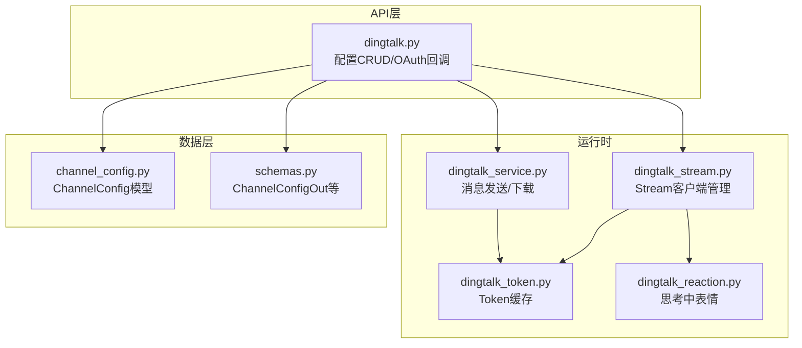
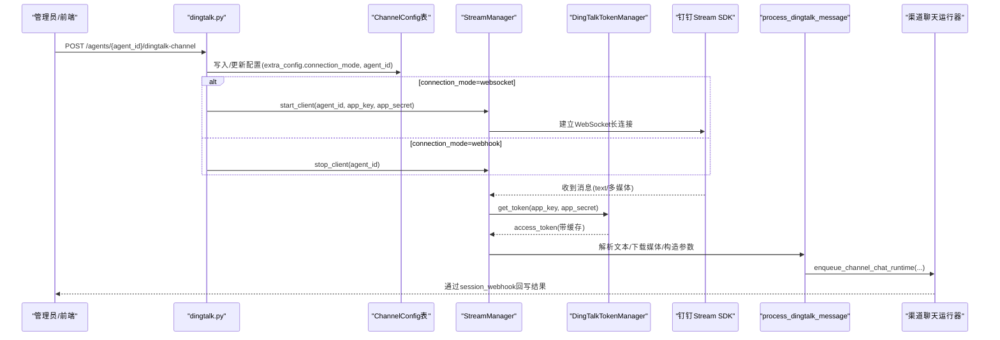
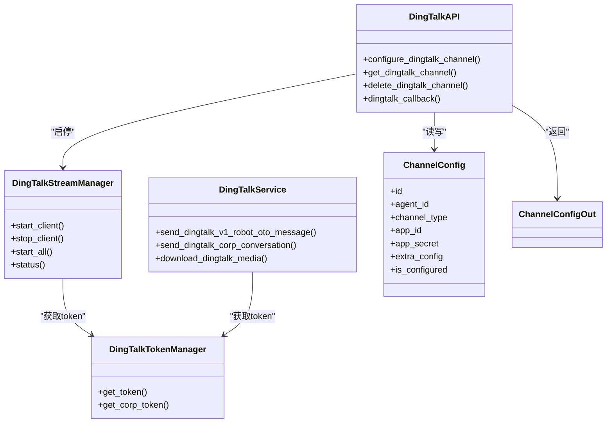

# 渠道配置管理

<cite>
**本文引用的文件**   
- [backend/app/api/dingtalk.py](file://backend/app/api/dingtalk.py)
- [backend/app/services/dingtalk_stream.py](file://backend/app/services/dingtalk_stream.py)
- [backend/app/services/dingtalk_service.py](file://backend/app/services/dingtalk_service.py)
- [backend/app/services/dingtalk_token.py](file://backend/app/services/dingtalk_token.py)
- [backend/app/services/dingtalk_reaction.py](file://backend/app/services/dingtalk_reaction.py)
- [backend/app/models/channel_config.py](file://backend/app/models/channel_config.py)
- [backend/app/schemas/schemas.py](file://backend/app/schemas/schemas.py)
</cite>

## 目录
1. [简介](#简介)
2. [项目结构](#项目结构)
3. [核心组件](#核心组件)
4. [架构总览](#架构总览)
5. [详细组件分析](#详细组件分析)
6. [依赖关系分析](#依赖关系分析)
7. [性能考虑](#性能考虑)
8. [故障排查指南](#故障排查指南)
9. [结论](#结论)
10. [附录：API定义与示例](#附录api定义与示例)

## 简介
本文件为Clawith平台“钉钉渠道配置管理”的完整API文档，覆盖机器人应用配置、连接模式切换（Webhook/Stream）、密钥管理与安全验证等核心能力。重点说明：
- Webhook与Stream两种连接模式的差异与适用场景
- AgentId设置与用途
- 访问令牌缓存与刷新策略
- 消息处理流程（含图片、语音、视频、文件等多媒体）
- 配置校验、动态切换、错误处理与可观测性

## 项目结构
钉钉相关能力主要分布在以下模块：
- API路由：提供配置CRUD与OAuth回调
- Stream管理器：维护WebSocket长连接与自动重连
- 服务层：统一发送消息、下载媒体、工作通知等
- 令牌管理：全局缓存access_token并自动刷新
- 反应增强：为用户消息添加“思考中”表情反馈
- 数据模型与Schema：持久化通道配置与响应结构

图表来源 
- [backend/app/api/dingtalk.py](file://backend/app/api/dingtalk.py)
- [backend/app/services/dingtalk_stream.py](file://backend/app/services/dingtalk_stream.py)
- [backend/app/services/dingtalk_service.py](file://backend/app/services/dingtalk_service.py)
- [backend/app/services/dingtalk_token.py](file://backend/app/services/dingtalk_token.py)
- [backend/app/services/dingtalk_reaction.py](file://backend/app/services/dingtalk_reaction.py)
- [backend/app/models/channel_config.py](file://backend/app/models/channel_config.py)
- [backend/app/schemas/schemas.py](file://backend/app/schemas/schemas.py)

章节来源
- [backend/app/api/dingtalk.py](file://backend/app/api/dingtalk.py)
- [backend/app/services/dingtalk_stream.py](file://backend/app/services/dingtalk_stream.py)
- [backend/app/services/dingtalk_service.py](file://backend/app/services/dingtalk_service.py)
- [backend/app/services/dingtalk_token.py](file://backend/app/services/dingtalk_token.py)
- [backend/app/services/dingtalk_reaction.py](file://backend/app/services/dingtalk_reaction.py)
- [backend/app/models/channel_config.py](file://backend/app/models/channel_config.py)
- [backend/app/schemas/schemas.py](file://backend/app/schemas/schemas.py)

## 核心组件
- 配置接口（POST/GET/DELETE）：用于创建、查询、删除钉钉渠道配置；支持connection_mode与agent_id扩展字段
- Stream管理器：按Agent维度启动/停止Stream客户端，具备自动重连与线程隔离
- 令牌管理器：按app_key缓存access_token，提前300秒刷新，并发安全
- 消息发送服务：封装v1.0机器人私聊与工作通知两类发送方式
- 媒体处理：下载图片/音视频/文件，落盘后生成base64标记供多模态LLM消费
- 反应增强：在用户消息上添加“🤔思考中”，并在回复完成后撤回

章节来源
- [backend/app/api/dingtalk.py](file://backend/app/api/dingtalk.py)
- [backend/app/services/dingtalk_stream.py](file://backend/app/services/dingtalk_stream.py)
- [backend/app/services/dingtalk_service.py](file://backend/app/services/dingtalk_service.py)
- [backend/app/services/dingtalk_token.py](file://backend/app/services/dingtalk_token.py)
- [backend/app/services/dingtalk_reaction.py](file://backend/app/services/dingtalk_reaction.py)

## 架构总览
下图展示从配置到消息处理的端到端流程，包括Stream连接、令牌获取、媒体下载与LLM运行队列入队。

图表来源 
- [backend/app/api/dingtalk.py](file://backend/app/api/dingtalk.py)
- [backend/app/services/dingtalk_stream.py](file://backend/app/services/dingtalk_stream.py)
- [backend/app/services/dingtalk_token.py](file://backend/app/services/dingtalk_token.py)

## 详细组件分析

### 配置管理API
- 创建/更新配置
  - 路径：POST /agents/{agent_id}/dingtalk-channel
  - 请求体关键字段：
    - app_key：必填
    - app_secret：必填
    - extra_config.connection_mode：可选，默认websocket；支持websocket/webhook
    - extra_config.agent_id：可选，用于API发消息时指定AgentId
  - 行为：
    - 若已存在则更新app_id/app_secret/is_configured与extra_config
    - 当connection_mode为websocket时，异步启动Stream客户端；否则停止现有Stream客户端
    - 返回ChannelConfigOut
- 查询配置
  - 路径：GET /agents/{agent_id}/dingtalk-channel
  - 返回ChannelConfigOut或404
- 删除配置
  - 路径：DELETE /agents/{agent_id}/dingtalk-channel
  - 行为：删除记录并停止Stream客户端

权限与校验
- 仅机器人创建者可配置/删除渠道
- 必填字段校验：app_key与app_secret不可为空

章节来源
- [backend/app/api/dingtalk.py](file://backend/app/api/dingtalk.py)
- [backend/app/schemas/schemas.py](file://backend/app/schemas/schemas.py)
- [backend/app/models/channel_config.py](file://backend/app/models/channel_config.py)

### Stream连接模式（WebSocket）
- 启动与生命周期
  - 每个Agent独立线程运行Stream客户端
  - 支持自动重连，指数退避重试
  - 主事件循环跨线程调度协程执行消息处理
- 消息处理
  - 文本：直接入队
  - 多媒体：下载至本地存储，生成base64标记与文件路径，供多模态LLM使用
  - 立即对用户消息添加“🤔思考中”表情，提升交互体验
- 停止与清理
  - 切换为webhook或删除配置时，触发stop_client并等待线程退出

章节来源
- [backend/app/services/dingtalk_stream.py](file://backend/app/services/dingtalk_stream.py)
- [backend/app/services/dingtalk_reaction.py](file://backend/app/services/dingtalk_reaction.py)

### Webhook连接模式
- 特点
  - 无需长连接，由外部网关将消息推送到后端
  - 适合受限网络环境或已有消息网关的场景
- 切换影响
  - 切换到webhook会停止Stream客户端
  - 需确保外部网关正确转发消息并携带必要字段（如conversation_type、session_webhook等）

章节来源
- [backend/app/api/dingtalk.py](file://backend/app/api/dingtalk.py)

### 密钥管理与安全
- 访问令牌缓存
  - 按app_key缓存，有效期前300秒主动刷新
  - 并发安全：每个app_key对应一个锁
  - 同时兼容老版oapi与企业级token
- OAuth回调（SSO）
  - 支持钉钉授权码换取用户信息并登录
  - 根据state恢复租户上下文，完成SSO会话状态更新

章节来源
- [backend/app/services/dingtalk_token.py](file://backend/app/services/dingtalk_token.py)
- [backend/app/api/dingtalk.py](file://backend/app/api/dingtalk.py)

### 消息发送与媒体处理
- 发送方式
  - v1.0机器人私聊（推荐）：适用于单聊批量发送
  - 工作通知：适用于企业内部通知
- 媒体处理
  - 下载：通过downloadCode获取下载URL并下载二进制
  - 上传：调用legacy oapi/media/upload获取mediaId
  - 发送：根据媒体类型选择合适msgKey/msgParam，区分群聊与单聊

章节来源
- [backend/app/services/dingtalk_service.py](file://backend/app/services/dingtalk_service.py)
- [backend/app/services/dingtalk_stream.py](file://backend/app/services/dingtalk_stream.py)

### 数据模型与Schema
- ChannelConfig
  - 唯一约束：agent_id + channel_type
  - 扩展字段：extra_config(JSON)，用于保存connection_mode、agent_id等
- ChannelConfigOut
  - 对外暴露的配置视图，包含基础信息与时间戳

章节来源
- [backend/app/models/channel_config.py](file://backend/app/models/channel_config.py)
- [backend/app/schemas/schemas.py](file://backend/app/schemas/schemas.py)

## 依赖关系分析
- API路由依赖：权限校验、数据库会话、ChannelConfig模型、ChannelConfigOut Schema
- Stream管理器依赖：dingtalk-stream SDK、令牌管理器、存储、反应服务
- 令牌管理器依赖：httpx、全局缓存与锁
- 消息服务依赖：令牌管理器、httpx、钉钉v1.0与oapi接口

图表来源 
- [backend/app/api/dingtalk.py](file://backend/app/api/dingtalk.py)
- [backend/app/services/dingtalk_stream.py](file://backend/app/services/dingtalk_stream.py)
- [backend/app/services/dingtalk_service.py](file://backend/app/services/dingtalk_service.py)
- [backend/app/services/dingtalk_token.py](file://backend/app/services/dingtalk_token.py)
- [backend/app/models/channel_config.py](file://backend/app/models/channel_config.py)
- [backend/app/schemas/schemas.py](file://backend/app/schemas/schemas.py)

## 性能考虑
- Stream连接
  - 单Agent单线程，避免阻塞主事件循环
  - 指数退避重连，降低抖动对系统的影响
- 令牌缓存
  - 减少频繁请求钉钉鉴权接口
  - 并发安全，避免重复刷新
- 媒体处理
  - 下载与存储异步化，避免阻塞消息处理链路
  - base64标记仅用于LLM输入，实际文件落盘节省内存

[本节为通用指导，不直接分析具体文件]

## 故障排查指南
- 无法建立Stream连接
  - 检查app_key与app_secret是否正确
  - 查看日志中是否提示未安装dingtalk-stream包
  - 确认网络可达与防火墙策略
- 消息无法下发
  - 确认connection_mode与外部网关配置一致
  - 检查session_webhook、conversation_type等字段是否齐全
  - 查看媒体下载与上传的errcode与errmsg
- 令牌失效或频繁刷新
  - 检查钉钉服务端返回的expireIn与缓存逻辑
  - 关注并发刷新是否被锁保护
- “思考中”表情未显示或无法撤回
  - 检查message_id与conversation_id是否为空
  - 观察HTTP状态码与错误信息

章节来源
- [backend/app/services/dingtalk_stream.py](file://backend/app/services/dingtalk_stream.py)
- [backend/app/services/dingtalk_token.py](file://backend/app/services/dingtalk_token.py)
- [backend/app/services/dingtalk_reaction.py](file://backend/app/services/dingtalk_reaction.py)

## 结论
本方案以Stream为主、Webhook为辅的双模式设计，结合统一的令牌缓存与完善的媒体处理能力，提供了稳定、可扩展的钉钉渠道接入能力。通过清晰的配置接口与健壮的错误处理，便于运维与开发者快速集成与排障。

[本节为总结性内容，不直接分析具体文件]

## 附录：API定义与示例

### 配置接口
- 创建/更新钉钉渠道配置
  - 方法：POST
  - 路径：/agents/{agent_id}/dingtalk-channel
  - 请求体关键字段：
    - app_key：字符串，必填
    - app_secret：字符串，必填
    - extra_config.connection_mode：字符串，可选，默认websocket；支持websocket/webhook
    - extra_config.agent_id：字符串，可选，用于API发消息时指定AgentId
  - 响应：ChannelConfigOut
- 查询钉钉渠道配置
  - 方法：GET
  - 路径：/agents/{agent_id}/dingtalk-channel
  - 响应：ChannelConfigOut或404
- 删除钉钉渠道配置
  - 方法：DELETE
  - 路径：/agents/{agent_id}/dingtalk-channel
  - 响应：204

章节来源
- [backend/app/api/dingtalk.py](file://backend/app/api/dingtalk.py)
- [backend/app/schemas/schemas.py](file://backend/app/schemas/schemas.py)

### OAuth回调（SSO）
- 路径：GET /auth/dingtalk/callback
- 参数：authCode、state（可选）
- 行为：交换授权码获取用户信息，完成登录并更新SSO会话状态

章节来源
- [backend/app/api/dingtalk.py](file://backend/app/api/dingtalk.py)

### 连接模式对比
- Stream（websocket）
  - 优点：低延迟、实时性强、自动重连
  - 适用：内网直连、无公网回调地址
- Webhook
  - 优点：无需长连接、易于部署在受限网络
  - 适用：已有消息网关、需要简化部署

章节来源
- [backend/app/api/dingtalk.py](file://backend/app/api/dingtalk.py)
- [backend/app/services/dingtalk_stream.py](file://backend/app/services/dingtalk_stream.py)

### AgentId设置与用途
- 在extra_config.agent_id中设置
- 用于工作通知或特定API调用时标识机器人身份
- 切换连接模式不影响该字段，但会影响消息收发路径

章节来源
- [backend/app/api/dingtalk.py](file://backend/app/api/dingtalk.py)
- [backend/app/services/dingtalk_service.py](file://backend/app/services/dingtalk_service.py)

### 安全验证要点
- 访问令牌缓存：按app_key缓存，提前300秒刷新
- 并发安全：每app_key一把锁，避免重复刷新
- OAuth回调：基于state恢复租户上下文，保证多租户隔离

章节来源
- [backend/app/services/dingtalk_token.py](file://backend/app/services/dingtalk_token.py)
- [backend/app/api/dingtalk.py](file://backend/app/api/dingtalk.py)

### 配置示例（JSON）
- 创建/更新配置示例
  - {
      "app_key": "你的AppKey",
      "app_secret": "你的AppSecret",
      "extra_config": {
        "connection_mode": "websocket",
        "agent_id": "可选的AgentId"
      }
    }
- 查询配置示例响应（字段见ChannelConfigOut）
  - {
      "id": "uuid",
      "agent_id": "uuid",
      "channel_type": "dingtalk",
      "app_id": "string",
      "app_secret": "string",
      "is_configured": true,
      "is_connected": false,
      "last_tested_at": null,
      "extra_config": {"connection_mode":"websocket","agent_id":""},
      "created_at": "timestamp"
    }

章节来源
- [backend/app/api/dingtalk.py](file://backend/app/api/dingtalk.py)
- [backend/app/schemas/schemas.py](file://backend/app/schemas/schemas.py)

### 错误码与处理建议
- 403：非创建者操作
- 404：渠道未配置
- 422：必填字段缺失
- 业务错误：参考钉钉返回的errcode与errmsg，定位网络、鉴权或参数问题

章节来源
- [backend/app/api/dingtalk.py](file://backend/app/api/dingtalk.py)
- [backend/app/services/dingtalk_service.py](file://backend/app/services/dingtalk_service.py)