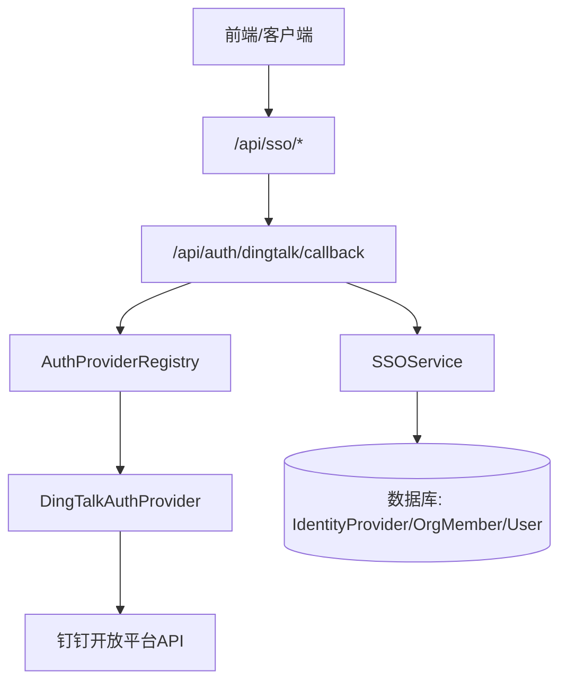
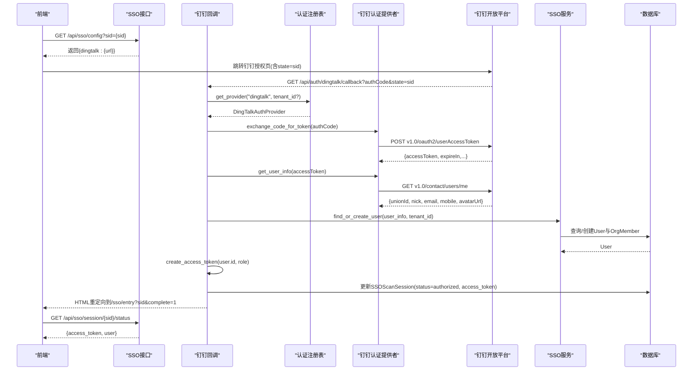
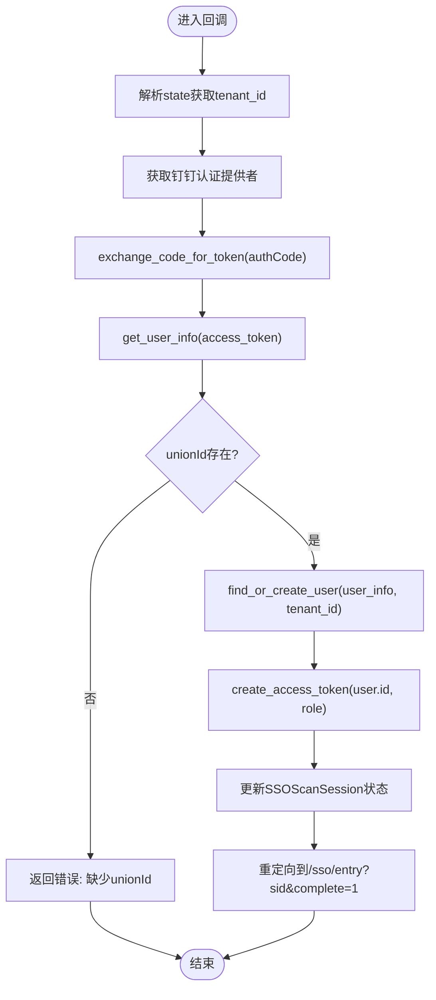
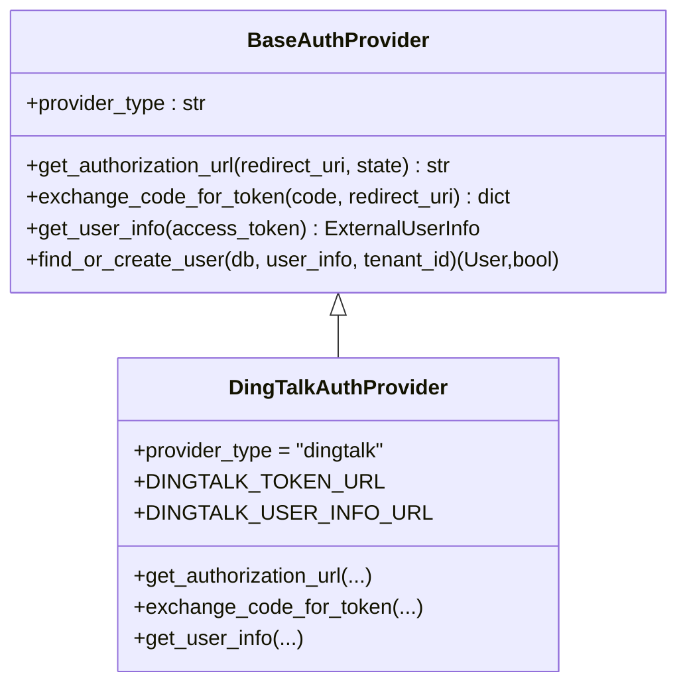
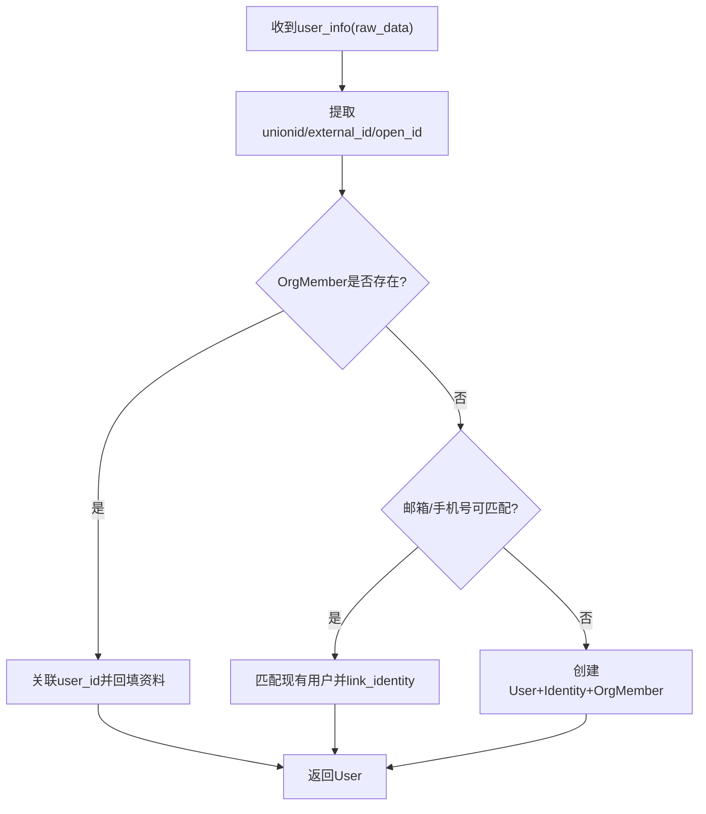
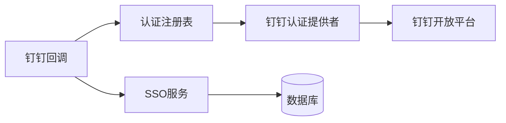

# 钉钉OAuth认证

<cite>
**本文引用的文件**   
- [backend/app/api/dingtalk.py](file://backend/app/api/dingtalk.py)
- [backend/app/services/auth_provider.py](file://backend/app/services/auth_provider.py)
- [backend/app/api/sso.py](file://backend/app/api/sso.py)
- [backend/app/services/auth_registry.py](file://backend/app/services/auth_registry.py)
- [backend/app/services/sso_service.py](file://backend/app/services/sso_service.py)
- [backend/app/models/identity.py](file://backend/app/models/identity.py)
- [backend/app/services/dingtalk_token.py](file://backend/app/services/dingtalk_token.py)
- [backend/app/services/dingtalk_service.py](file://backend/app/services/dingtalk_service.py)
</cite>

## 目录
1. [简介](#简介)
2. [项目结构](#项目结构)
3. [核心组件](#核心组件)
4. [架构总览](#架构总览)
5. [详细组件分析](#详细组件分析)
6. [依赖关系分析](#依赖关系分析)
7. [性能考虑](#性能考虑)
8. [故障排查指南](#故障排查指南)
9. [结论](#结论)
10. [附录：OAuth2.0集成示例与错误处理](#附录oauth20集成示例与错误处理)

## 简介
本文件为Clawith平台的钉钉OAuth认证功能提供完整的API文档，覆盖SSO登录流程、授权码交换、用户信息获取、企业租户隔离、用户身份映射、权限继承等企业级特性。文档同时给出前端/后端集成要点、回调URL配置与安全参数校验建议，以及常见错误的定位与修复方案。

## 项目结构
钉钉OAuth相关能力主要分布在以下模块：
- API路由层：钉钉回调入口、SSO会话管理
- 认证提供者抽象与实现：钉钉OAuth2.0的授权URL构造、授权码换令牌、用户信息拉取
- SSO服务：用户身份解析、邮箱/手机号匹配、OrgMember关联与资料回填
- 认证注册表：按租户维度加载并缓存认证提供者实例
- 模型定义：IdentityProvider（外部身份源配置）、SSOScanSession（扫码/跳转状态）
- 钉钉工具：access_token缓存与消息发送辅助

图表来源
- [backend/app/api/sso.py:1-160](file://backend/app/api/sso.py#L1-L160)
- [backend/app/api/dingtalk.py:268-351](file://backend/app/api/dingtalk.py#L268-L351)
- [backend/app/services/auth_registry.py:1-230](file://backend/app/services/auth_registry.py#L1-L230)
- [backend/app/services/auth_provider.py:350-433](file://backend/app/services/auth_provider.py#L350-L433)
- [backend/app/services/sso_service.py:183-446](file://backend/app/services/sso_service.py#L183-L446)

章节来源
- [backend/app/api/dingtalk.py:1-351](file://backend/app/api/dingtalk.py#L1-L351)
- [backend/app/api/sso.py:1-160](file://backend/app/api/sso.py#L1-L160)
- [backend/app/services/auth_provider.py:1-433](file://backend/app/services/auth_provider.py#L1-L433)
- [backend/app/services/auth_registry.py:1-230](file://backend/app/services/auth_registry.py#L1-L230)
- [backend/app/services/sso_service.py:1-576](file://backend/app/services/sso_service.py#L1-L576)
- [backend/app/models/identity.py:1-67](file://backend/app/models/identity.py#L1-L67)

## 核心组件
- 钉钉回调接口：接收钉钉返回的授权码，完成令牌交换、用户信息获取、用户查找或创建、生成平台访问令牌，并更新SSO会话状态。
- 钉钉认证提供者：封装钉钉OAuth2.0的授权URL构造、授权码换令牌、用户信息拉取；支持scope控制与企业租户隔离。
- SSO服务：基于OrgMember进行用户身份解析与关联，支持unionid/external_id/open_id多字段匹配，自动回填头像、邮箱、手机等。
- 认证注册表：按provider_type与tenant_id维度加载并缓存认证提供者实例，避免重复查询。
- 身份模型：IdentityProvider存储各身份源的配置（如app_key、app_secret、corp_id），SSOScanSession用于扫码/跳转状态流转。
- 钉钉Token缓存：全局单例缓存钉钉access_token，减少频繁请求。

章节来源
- [backend/app/api/dingtalk.py:268-351](file://backend/app/api/dingtalk.py#L268-L351)
- [backend/app/services/auth_provider.py:350-433](file://backend/app/services/auth_provider.py#L350-L433)
- [backend/app/services/sso_service.py:183-446](file://backend/app/services/sso_service.py#L183-L446)
- [backend/app/services/auth_registry.py:1-230](file://backend/app/services/auth_registry.py#L1-L230)
- [backend/app/models/identity.py:1-67](file://backend/app/models/identity.py#L1-L67)
- [backend/app/services/dingtalk_token.py:1-78](file://backend/app/services/dingtalk_token.py#L1-L78)

## 架构总览
钉钉OAuth2.0在Clawith中的端到端流程如下：
- 前端通过SSO配置接口获取钉钉授权URL（包含state=SSO会话ID）。
- 用户跳转至钉钉授权页，完成后回调到后端回调接口。
- 回调接口使用认证提供者交换授权码为access_token，再拉取用户信息。
- 通过SSO服务解析用户身份（优先unionid，其次external_id/open_id），若不存在则创建用户并关联OrgMember。
- 生成平台访问令牌，更新SSO会话状态，前端轮询获取结果并完成登录。

图表来源
- [backend/app/api/sso.py:83-159](file://backend/app/api/sso.py#L83-L159)
- [backend/app/api/dingtalk.py:268-351](file://backend/app/api/dingtalk.py#L268-L351)
- [backend/app/services/auth_registry.py:37-88](file://backend/app/services/auth_registry.py#L37-L88)
- [backend/app/services/auth_provider.py:382-433](file://backend/app/services/auth_provider.py#L382-L433)
- [backend/app/services/sso_service.py:183-446](file://backend/app/services/sso_service.py#L183-L446)

## 详细组件分析

### 钉钉回调接口（SSO登录）
- 路径：GET /api/auth/dingtalk/callback
- 参数：authCode（授权码）、state（SSO会话ID）
- 行为：
  - 从state解析tenant上下文（可选）
  - 通过认证注册表获取钉钉认证提供者
  - 调用提供者交换授权码为access_token
  - 拉取用户信息，校验unionId存在
  - 调用SSO服务解析或创建用户，并关联OrgMember
  - 生成平台访问令牌，更新SSO会话状态并重定向前端

图表来源
- [backend/app/api/dingtalk.py:268-351](file://backend/app/api/dingtalk.py#L268-L351)
- [backend/app/services/auth_provider.py:382-433](file://backend/app/services/auth_provider.py#L382-L433)
- [backend/app/services/sso_service.py:183-446](file://backend/app/services/sso_service.py#L183-L446)

章节来源
- [backend/app/api/dingtalk.py:268-351](file://backend/app/api/dingtalk.py#L268-L351)

### 钉钉认证提供者（OAuth2.0实现）
- 授权URL构造：
  - 基础地址：https://login.dingtalk.com/oauth2/auth
  - 必需参数：client_id、redirect_uri、state、response_type=code、scope
  - 推荐scope：openid corpid Contact.User.Read fieldEmail contact.user.mobile
  - 可选corp_id：限定企业范围（不配置时显示企业选择器）
- 授权码换令牌：
  - 接口：POST https://api.dingtalk.com/v1.0/oauth2/userAccessToken
  - 入参：clientId、clientSecret、code、grantType=authorization_code
  - 返回：accessToken、refreshToken、expireIn
- 用户信息拉取：
  - 接口：GET https://api.dingtalk.com/v1.0/contact/users/me
  - 头部：x-acs-dingtalk-access-token
  - 返回：unionId、nick、email、mobile、avatarUrl等

图表来源
- [backend/app/services/auth_provider.py:44-96](file://backend/app/services/auth_provider.py#L44-L96)
- [backend/app/services/auth_provider.py:350-433](file://backend/app/services/auth_provider.py#L350-L433)

章节来源
- [backend/app/services/auth_provider.py:350-433](file://backend/app/services/auth_provider.py#L350-L433)

### SSO服务（用户身份解析与关联）
- 用户解析优先级：
  - unionid（最稳定）
  - external_id（如staffId/userid）
  - open_id（openId）
- 匹配策略：
  - 先通过OrgMember记录匹配（provider_id + unionid/external_id/open_id）
  - 未找到则尝试邮箱/手机号匹配（需在同一租户范围内）
  - 仍无结果则创建新用户并建立OrgMember记录
- 资料回填：
  - 首次SSO登录时，将name/email/mobile/avatar等回填到OrgMember，避免占位数据

图表来源
- [backend/app/services/sso_service.py:235-326](file://backend/app/services/sso_service.py#L235-L326)
- [backend/app/services/sso_service.py:328-446](file://backend/app/services/sso_service.py#L328-L446)

章节来源
- [backend/app/services/sso_service.py:183-446](file://backend/app/services/sso_service.py#L183-L446)

### 认证注册表（Provider实例管理）
- 作用：根据provider_type与tenant_id获取或创建认证提供者实例，并进行缓存
- 关键方法：
  - get_provider(provider_type, tenant_id)：按租户维度加载配置并实例化
  - list_providers(tenant_id)：列出可用的身份源（区分全局与租户专属）
  - create/update/delete_provider：管理IdentityProvider记录

章节来源
- [backend/app/services/auth_registry.py:1-230](file://backend/app/services/auth_registry.py#L1-L230)

### 身份模型（IdentityProvider与SSOScanSession）
- IdentityProvider：存储外部身份源配置（如钉钉的app_key、app_secret、corp_id），支持sso_login_enabled开关与租户隔离
- SSOScanSession：记录扫码/跳转状态（pending/scanned/authorized/expired/completed），承载tenant_id、user_id、access_token等信息

章节来源
- [backend/app/models/identity.py:1-67](file://backend/app/models/identity.py#L1-L67)

### 钉钉Token缓存与消息发送
- DingTalkTokenManager：全局单例，按app_key缓存access_token，提前刷新避免过期
- dingtalk_service：统一的消息发送封装（机器人私聊、工作通知、媒体下载）

章节来源
- [backend/app/services/dingtalk_token.py:1-78](file://backend/app/services/dingtalk_token.py#L1-L78)
- [backend/app/services/dingtalk_service.py:1-175](file://backend/app/services/dingtalk_service.py#L1-L175)

## 依赖关系分析
- 回调接口依赖认证注册表以获取具体认证提供者实例
- 认证提供者依赖钉钉开放平台API进行令牌交换与用户信息拉取
- SSO服务依赖数据库中的IdentityProvider与OrgMember进行用户解析与关联
- 前端通过SSO配置接口获取授权URL，并通过轮询会话状态获取登录结果

图表来源
- [backend/app/api/dingtalk.py:268-351](file://backend/app/api/dingtalk.py#L268-L351)
- [backend/app/services/auth_registry.py:37-88](file://backend/app/services/auth_registry.py#L37-L88)
- [backend/app/services/auth_provider.py:382-433](file://backend/app/services/auth_provider.py#L382-L433)
- [backend/app/services/sso_service.py:183-446](file://backend/app/services/sso_service.py#L183-L446)

章节来源
- [backend/app/api/dingtalk.py:268-351](file://backend/app/api/dingtalk.py#L268-L351)
- [backend/app/services/auth_registry.py:1-230](file://backend/app/services/auth_registry.py#L1-L230)
- [backend/app/services/auth_provider.py:350-433](file://backend/app/services/auth_provider.py#L350-L433)
- [backend/app/services/sso_service.py:183-446](file://backend/app/services/sso_service.py#L183-L446)

## 性能考虑
- Token缓存：钉钉access_token采用全局缓存并按app_key隔离，避免频繁请求；建议在并发场景下确保锁机制有效
- 数据库查询：用户解析优先走OrgMember索引字段（unionid/external_id/open_id），减少全表扫描
- 网络超时：所有对外部API的请求均设置合理超时，避免阻塞主流程
- 会话轮询：前端轮询SSO会话状态应限制频率，避免对服务端造成压力

## 故障排查指南
- 回调失败：检查state是否有效、tenant_id是否正确、钉钉回调URL是否配置正确
- 令牌交换失败：确认app_key与app_secret正确、授权码未过期、网络可达
- 用户信息缺失：检查Contact.User.Read等scope是否授予、员工是否同意授权
- 用户解析失败：确认OrgMember中unionid/external_id/open_id是否正确、邮箱/手机号是否唯一
- 会话状态异常：检查SSOScanSession是否过期、是否被重复使用

章节来源
- [backend/app/api/dingtalk.py:268-351](file://backend/app/api/dingtalk.py#L268-L351)
- [backend/app/services/auth_provider.py:382-433](file://backend/app/services/auth_provider.py#L382-L433)
- [backend/app/services/sso_service.py:183-446](file://backend/app/services/sso_service.py#L183-L446)

## 结论
Clawith平台的钉钉OAuth认证功能通过标准化的认证提供者框架与SSO服务，实现了安全、可扩展的企业级单点登录。结合租户隔离、用户身份映射与OrgMember关联，既保证了安全性，又提升了用户体验。通过合理的缓存与错误处理机制，系统在高并发场景下仍能保持稳定。

## 附录：OAuth2.0集成示例与错误处理

### 前端集成步骤
- 调用SSO配置接口获取钉钉授权URL
- 跳转至钉钉授权页，等待回调
- 轮询SSO会话状态，获取access_token与用户信息
- 使用access_token访问受保护资源

### 后端回调处理要点
- 验证state有效性，防止CSRF攻击
- 严格校验授权码与回调URL一致性
- 捕获并记录钉钉API返回的错误码与消息
- 对用户信息进行必要校验（如unionId非空）

### 常见错误与解决方案
- 403权限不足：检查Contact.User.Read等scope是否授予
- 401未授权：确认app_key与app_secret正确
- 404会话不存在：检查state是否过期或被篡改
- 500内部错误：查看日志定位具体异常堆栈

章节来源
- [backend/app/api/sso.py:1-160](file://backend/app/api/sso.py#L1-L160)
- [backend/app/api/dingtalk.py:268-351](file://backend/app/api/dingtalk.py#L268-L351)
- [backend/app/services/auth_provider.py:382-433](file://backend/app/services/auth_provider.py#L382-L433)