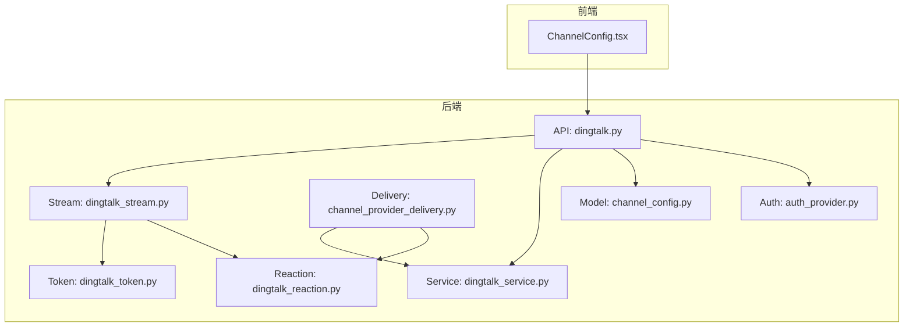
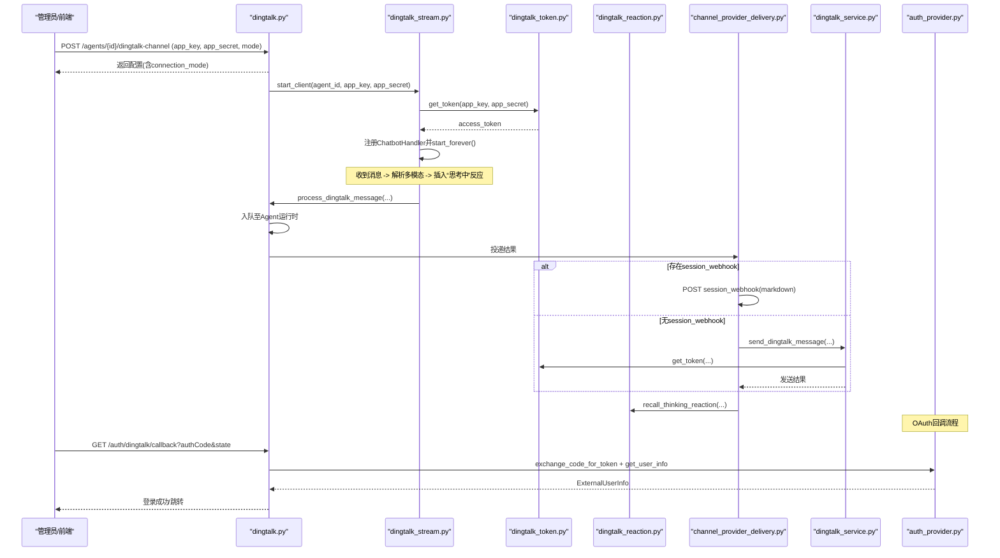
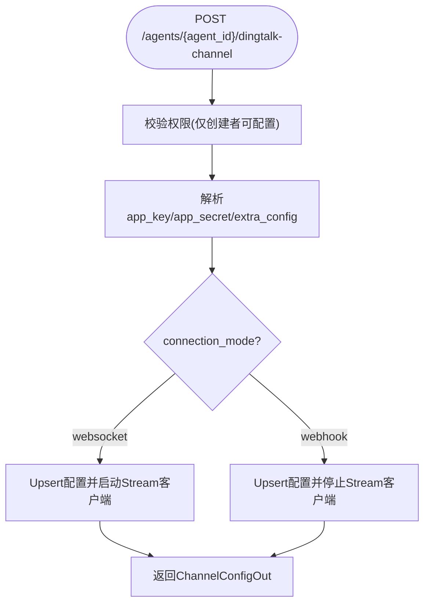
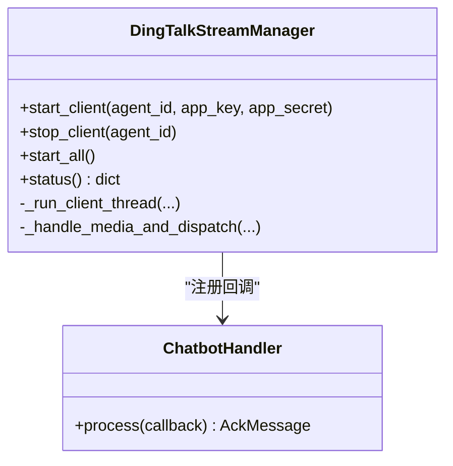
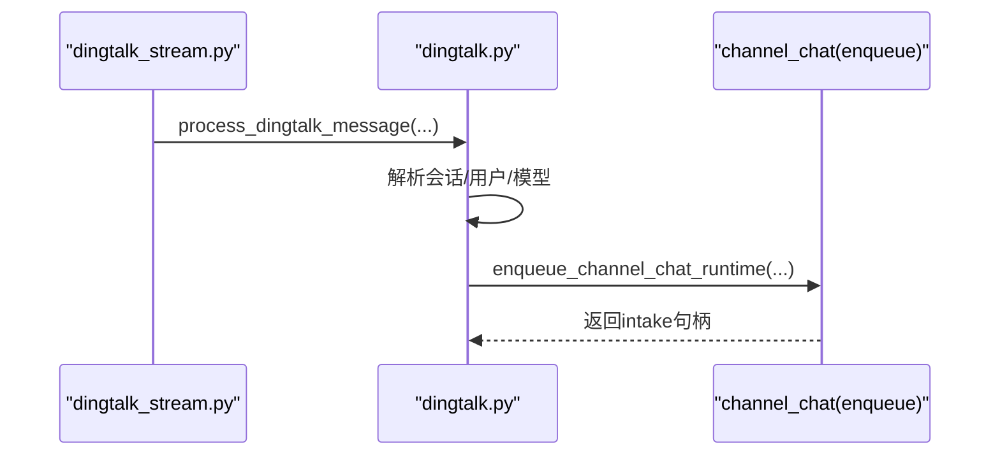
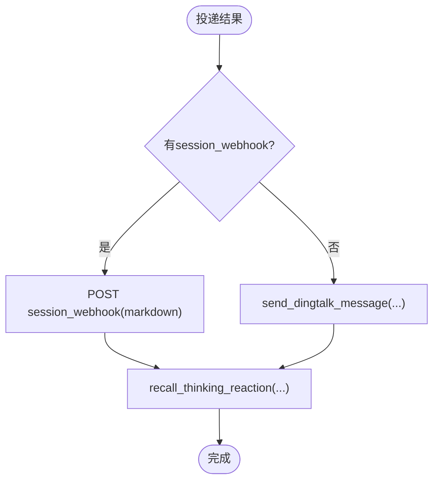
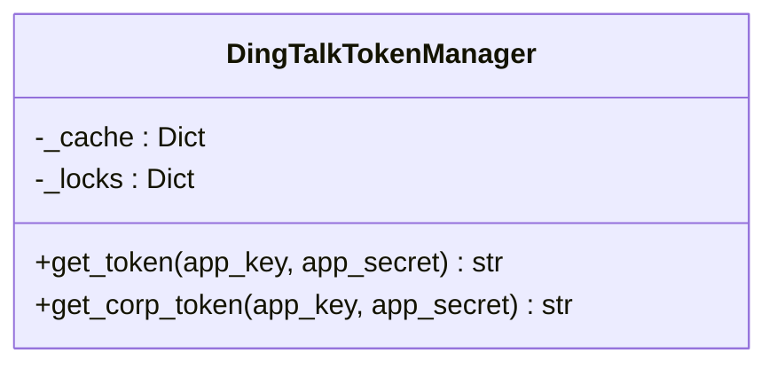
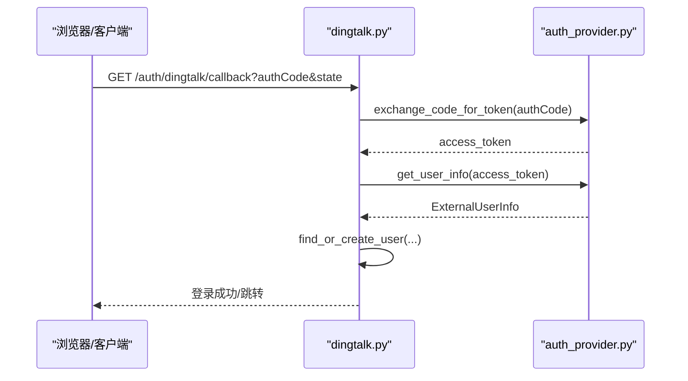
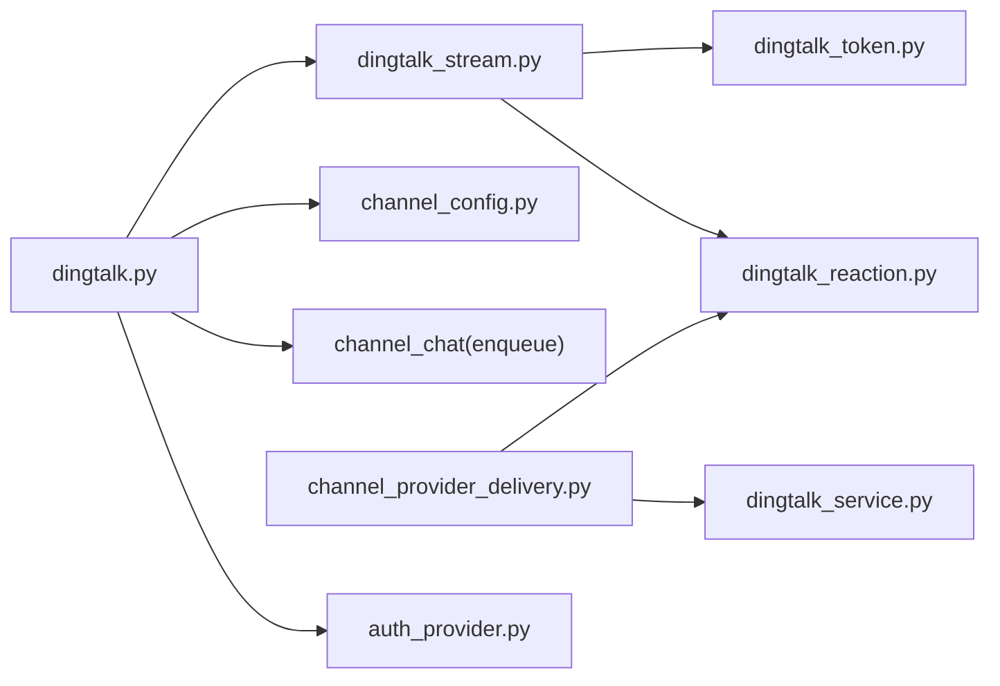

# 钉钉集成API

<cite>
**本文引用的文件**   
- [backend/app/api/dingtalk.py](file://backend/app/api/dingtalk.py)
- [backend/app/services/dingtalk_stream.py](file://backend/app/services/dingtalk_stream.py)
- [backend/app/services/dingtalk_service.py](file://backend/app/services/dingtalk_service.py)
- [backend/app/services/dingtalk_token.py](file://backend/app/services/dingtalk_token.py)
- [backend/app/services/dingtalk_reaction.py](file://backend/app/services/dingtalk_reaction.py)
- [backend/app/services/agent_runtime/channel_provider_delivery.py](file://backend/app/services/agent_runtime/channel_provider_delivery.py)
- [backend/app/models/channel_config.py](file://backend/app/models/channel_config.py)
- [backend/app/services/auth_provider.py](file://backend/app/services/auth_provider.py)
- [frontend/src/components/ChannelConfig.tsx](file://frontend/src/components/ChannelConfig.tsx)
</cite>

## 目录
1. [简介](#简介)
2. [项目结构](#项目结构)
3. [核心组件](#核心组件)
4. [架构总览](#架构总览)
5. [详细组件分析](#详细组件分析)
6. [依赖关系分析](#依赖关系分析)
7. [性能考虑](#性能考虑)
8. [故障排查指南](#故障排查指南)
9. [结论](#结论)
10. [附录](#附录)

## 简介
本文件为 Clawith 平台的钉钉渠道集成 API 文档，覆盖以下关键能力：
- 钉钉 OAuth 认证（SSO）与用户身份同步
- Stream 模式消息接收（WebSocket 长连接）
- Webhook 回调处理（会话级回推）
- 机器人配置、企业内部应用开发要点
- 卡片消息、工作通知、审批流等扩展支持说明
- 开放平台配置指南、安全设置与性能优化建议

## 项目结构
钉钉相关代码主要分布在后端 API、服务层与模型层，前端提供连接模式展示。

图表来源
- [backend/app/api/dingtalk.py:1-114](file://backend/app/api/dingtalk.py#L1-L114)
- [backend/app/services/dingtalk_stream.py:397-696](file://backend/app/services/dingtalk_stream.py#L397-L696)
- [backend/app/services/dingtalk_service.py:1-175](file://backend/app/services/dingtalk_service.py#L1-L175)
- [backend/app/services/dingtalk_token.py:1-78](file://backend/app/services/dingtalk_token.py#L1-L78)
- [backend/app/services/dingtalk_reaction.py:1-111](file://backend/app/services/dingtalk_reaction.py#L1-L111)
- [backend/app/services/agent_runtime/channel_provider_delivery.py:132-190](file://backend/app/services/agent_runtime/channel_provider_delivery.py#L132-L190)
- [backend/app/models/channel_config.py:1-52](file://backend/app/models/channel_config.py#L1-L52)
- [backend/app/services/auth_provider.py:400-450](file://backend/app/services/auth_provider.py#L400-L450)
- [frontend/src/components/ChannelConfig.tsx:995-1010](file://frontend/src/components/ChannelConfig.tsx#L995-L1010)

章节来源
- [backend/app/api/dingtalk.py:1-114](file://backend/app/api/dingtalk.py#L1-L114)
- [backend/app/models/channel_config.py:1-52](file://backend/app/models/channel_config.py#L1-L52)

## 核心组件
- 通道配置管理：创建、查询、删除钉钉通道配置，支持 Stream/Webhook 两种连接模式切换。
- Stream 客户端：基于 dingtalk-stream SDK 建立持久连接，自动重连，分发消息到主事件循环。
- 消息处理：解析文本、图片、语音、视频、富文本、文件等多类型消息，统一入队至 Agent 运行时。
- 令牌缓存：按 app_key 缓存 access_token，提前刷新，避免频繁请求。
- 反应提示：发送“思考中”表情并在回复后撤回，提升交互体验。
- 投递策略：优先通过 session_webhook 回推；否则走钉钉 v1.0 机器人 OTO 或工作通知。
- OAuth SSO：通过授权码换取 token，获取用户信息并创建/关联本地用户。

章节来源
- [backend/app/api/dingtalk.py:29-95](file://backend/app/api/dingtalk.py#L29-L95)
- [backend/app/services/dingtalk_stream.py:397-696](file://backend/app/services/dingtalk_stream.py#L397-L696)
- [backend/app/services/dingtalk_service.py:127-158](file://backend/app/services/dingtalk_service.py#L127-L158)
- [backend/app/services/dingtalk_token.py:14-78](file://backend/app/services/dingtalk_token.py#L14-L78)
- [backend/app/services/dingtalk_reaction.py:8-55](file://backend/app/services/dingtalk_reaction.py#L8-L55)
- [backend/app/services/agent_runtime/channel_provider_delivery.py:132-190](file://backend/app/services/agent_runtime/channel_provider_delivery.py#L132-L190)
- [backend/app/services/auth_provider.py:400-450](file://backend/app/services/auth_provider.py#L400-L450)

## 架构总览
钉钉集成的端到端流程如下：
- 配置阶段：通过 API 写入通道配置，选择 Stream/Webhook 模式。
- 接入阶段：Stream 模式启动独立线程运行 SDK 客户端，自动重连；Webhook 模式由外部回调触发。
- 消息阶段：Stream 收到消息后解析多模态内容，插入“思考中”反应，将消息入队至运行时。
- 回复阶段：运行时生成结果后，优先通过 session_webhook 推送；否则调用钉钉 v1.0 机器人接口或工作通知。
- 鉴权阶段：OAuth 回调完成授权码换 token、拉取用户信息、创建/绑定用户并签发系统 token。

图表来源
- [backend/app/api/dingtalk.py:29-95](file://backend/app/api/dingtalk.py#L29-L95)
- [backend/app/services/dingtalk_stream.py:468-557](file://backend/app/services/dingtalk_stream.py#L468-L557)
- [backend/app/services/dingtalk_token.py:31-64](file://backend/app/services/dingtalk_token.py#L31-L64)
- [backend/app/services/dingtalk_reaction.py:8-55](file://backend/app/services/dingtalk_reaction.py#L8-L55)
- [backend/app/services/agent_runtime/channel_provider_delivery.py:132-190](file://backend/app/services/agent_runtime/channel_provider_delivery.py#L132-L190)
- [backend/app/services/dingtalk_service.py:127-158](file://backend/app/services/dingtalk_service.py#L127-L158)
- [backend/app/services/auth_provider.py:400-450](file://backend/app/services/auth_provider.py#L400-L450)

## 详细组件分析

### 通道配置 API（Stream/Webhook 模式）
- 功能：为指定 Agent 配置钉钉通道，支持 connection_mode=websocket 或 webhook，以及可选 agent_id（用于 API 消息）。
- 行为：
  - 新增或更新 ChannelConfig，保存 app_id/app_secret 与 extra_config。
  - websocket 模式：异步启动 Stream 客户端；webhook 模式：停止已有 Stream 客户端。
  - 查询/删除通道配置，删除时停止 Stream 客户端。

图表来源
- [backend/app/api/dingtalk.py:29-95](file://backend/app/api/dingtalk.py#L29-L95)

章节来源
- [backend/app/api/dingtalk.py:29-95](file://backend/app/api/dingtalk.py#L29-L95)
- [backend/app/models/channel_config.py:13-41](file://backend/app/models/channel_config.py#L13-L41)

### Stream 客户端与消息处理
- 功能：维护每个 Agent 的 Stream 客户端线程，自动重连，解析多模态消息，派发至主事件循环。
- 关键点：
  - 使用 dingtalk-stream SDK，注册 ChatbotMessage 处理器。
  - 文本消息直接拼接；图片/语音/视频/文件通过 downloadCode 下载并转为 base64 标记或本地路径。
  - 立即添加“思考中”反应，随后进入运行时处理。
  - 非文本消息在 _handle_media_and_dispatch 中统一处理后再入队。

图表来源
- [backend/app/services/dingtalk_stream.py:397-696](file://backend/app/services/dingtalk_stream.py#L397-L696)

章节来源
- [backend/app/services/dingtalk_stream.py:468-557](file://backend/app/services/dingtalk_stream.py#L468-L557)
- [backend/app/services/dingtalk_stream.py:80-233](file://backend/app/services/dingtalk_stream.py#L80-L233)

### 消息入队与运行时对接
- 功能：将钉钉消息标准化后入队至 Agent 运行时，携带 source_channel、delivery_target、message_id 等元数据。
- 行为：
  - 根据 conversation_type 区分群聊/单聊，构造唯一 conv_id。
  - 通过 channel_user_service 解析平台用户，find_or_create_channel_session 创建会话。
  - 构建 llm_user_text（包含图片标记），enqueue_channel_chat_runtime 提交任务。

图表来源
- [backend/app/api/dingtalk.py:145-266](file://backend/app/api/dingtalk.py#L145-L266)

章节来源
- [backend/app/api/dingtalk.py:145-266](file://backend/app/api/dingtalk.py#L145-L266)

### 消息投递策略（session_webhook vs 钉钉API）
- 功能：优先通过 session_webhook 以 markdown 形式回推；若无则调用钉钉 v1.0 机器人 OTO 或工作通知。
- 行为：
  - 若 target.session_webhook 存在且非空，直接 POST markdown。
  - 否则调用 send_dingtalk_message，默认 use_robot=True（v1.0 OTO），可降级为 corpconversation。
  - 发送完成后撤回“思考中”反应。

图表来源
- [backend/app/services/agent_runtime/channel_provider_delivery.py:132-190](file://backend/app/services/agent_runtime/channel_provider_delivery.py#L132-L190)
- [backend/app/services/dingtalk_service.py:127-158](file://backend/app/services/dingtalk_service.py#L127-L158)

章节来源
- [backend/app/services/agent_runtime/channel_provider_delivery.py:132-190](file://backend/app/services/agent_runtime/channel_provider_delivery.py#L132-L190)
- [backend/app/services/dingtalk_service.py:127-158](file://backend/app/services/dingtalk_service.py#L127-L158)

### 令牌缓存与媒体下载
- 功能：全局缓存 access_token，按 app_key 维度管理，过期前 300s 主动刷新；提供下载媒体文件的便捷方法。
- 行为：
  - get_token：并发安全锁，双重检查缓存。
  - get_corp_token：复用 v1.0 令牌访问老版 corp API。
  - download_dingtalk_media：先获取下载 URL，再下载字节流。

图表来源
- [backend/app/services/dingtalk_token.py:14-78](file://backend/app/services/dingtalk_token.py#L14-L78)

章节来源
- [backend/app/services/dingtalk_token.py:14-78](file://backend/app/services/dingtalk_token.py#L14-L78)
- [backend/app/services/dingtalk_stream.py:62-78](file://backend/app/services/dingtalk_stream.py#L62-L78)

### “思考中”反应与撤回
- 功能：在用户消息上添加“🤔思考中”表情，在回复完成后撤回。
- 行为：
  - add_thinking_reaction：fire-and-forget，失败不抛异常。
  - recall_thinking_reaction：带重试（0ms、1.5s、5s）的撤回逻辑。

章节来源
- [backend/app/services/dingtalk_reaction.py:8-55](file://backend/app/services/dingtalk_reaction.py#L8-L55)
- [backend/app/services/dingtalk_reaction.py:58-111](file://backend/app/services/dingtalk_reaction.py#L58-L111)

### OAuth 认证与用户同步
- 功能：通过钉钉 OAuth2 完成 SSO，交换 code 获取 access_token，拉取用户信息并创建/绑定本地用户。
- 行为：
  - 回调接口 /auth/dingtalk/callback 解析 state 获取 tenant_id。
  - 通过 auth_provider_registry 获取 provider，exchange_code_for_token 与 get_user_info。
  - find_or_create_user 处理 OrgMember 关联，最终签发系统 token。

图表来源
- [backend/app/api/dingtalk.py:270-351](file://backend/app/api/dingtalk.py#L270-L351)
- [backend/app/services/auth_provider.py:400-450](file://backend/app/services/auth_provider.py#L400-L450)

章节来源
- [backend/app/api/dingtalk.py:270-351](file://backend/app/api/dingtalk.py#L270-L351)
- [backend/app/services/auth_provider.py:400-450](file://backend/app/services/auth_provider.py#L400-L450)

### 前端连接模式展示
- 功能：在通道配置页显示当前连接模式（Stream/Webhook），便于运维确认。
- 行为：当 ch.id === 'dingtalk' 且 configConnMode === 'websocket' 时，显示“Connected via Stream (No callback URL needed)”。

章节来源
- [frontend/src/components/ChannelConfig.tsx:995-1010](file://frontend/src/components/ChannelConfig.tsx#L995-L1010)

## 依赖关系分析
- API 层依赖 Stream 管理器、令牌缓存、反应服务、通道配置模型、运行时入队函数。
- Stream 层依赖令牌缓存、存储上传、消息处理工具。
- 投递层依赖服务层（v1.0 机器人/工作通知）与反应服务。
- OAuth 依赖认证提供者注册表与用户解析逻辑。

图表来源
- [backend/app/api/dingtalk.py:1-114](file://backend/app/api/dingtalk.py#L1-L114)
- [backend/app/services/dingtalk_stream.py:397-696](file://backend/app/services/dingtalk_stream.py#L397-L696)
- [backend/app/services/dingtalk_service.py:1-175](file://backend/app/services/dingtalk_service.py#L1-L175)
- [backend/app/services/dingtalk_token.py:1-78](file://backend/app/services/dingtalk_token.py#L1-L78)
- [backend/app/services/dingtalk_reaction.py:1-111](file://backend/app/services/dingtalk_reaction.py#L1-L111)
- [backend/app/services/agent_runtime/channel_provider_delivery.py:132-190](file://backend/app/services/agent_runtime/channel_provider_delivery.py#L132-L190)
- [backend/app/services/auth_provider.py:400-450](file://backend/app/services/auth_provider.py#L400-L450)

## 性能考虑
- 令牌缓存：按 app_key 维度缓存，减少重复请求，提前 300s 刷新避免过期抖动。
- Stream 重连：指数退避重试，最大重试次数限制，避免雪崩。
- 并发控制：Stream 客户端运行于独立线程，通过 fire-and-forget 调度到主事件循环，避免阻塞。
- 投递策略：优先使用 session_webhook 直推，降低第三方 API 调用开销。
- 媒体处理：下载后转 base64 标记，避免大对象在内存中长时间驻留。

[本节为通用指导，无需源码引用]

## 故障排查指南
- Stream 无法连接：
  - 检查 app_key/app_secret 是否正确，是否已安装 dingtalk-stream。
  - 查看日志中的重试与断开原因，必要时重启对应 Agent 的 Stream 客户端。
- 消息未入队：
  - 确认 conversation_type 与 sender_staff_id 有效。
  - 检查 channel_user_service 与 find_or_create_channel_session 是否成功。
- 投递失败：
  - 若使用 session_webhook，确认回调地址可达且返回 errcode=0。
  - 若使用钉钉 API，检查 access_token 有效性及权限范围。
- OAuth 失败：
  - 确认授权 URL 包含 Contact.User.Read 等必要 scope。
  - 检查回调状态 state 与租户上下文是否正确解析。

章节来源
- [backend/app/services/dingtalk_stream.py:468-557](file://backend/app/services/dingtalk_stream.py#L468-L557)
- [backend/app/api/dingtalk.py:145-266](file://backend/app/api/dingtalk.py#L145-L266)
- [backend/app/services/agent_runtime/channel_provider_delivery.py:132-190](file://backend/app/services/agent_runtime/channel_provider_delivery.py#L132-L190)
- [backend/app/services/auth_provider.py:400-450](file://backend/app/services/auth_provider.py#L400-L450)

## 结论
Clawith 的钉钉集成提供了完整的通道配置、Stream 接入、多模态消息处理、令牌缓存与反应提示、灵活投递策略以及 OAuth SSO 能力。通过合理的架构设计与错误处理机制，可在企业环境中稳定运行，并为后续扩展（如卡片消息、工作通知、审批流）奠定基础。

[本节为总结性内容，无需源码引用]

## 附录

### 钉钉开放平台配置指南（实施要点）
- 创建企业内部应用（机器人），记录 AppKey/AppSecret。
- 开启 Stream 模式（无需公网回调 URL），或在 Webhook 模式下配置回调地址。
- 如需通过 API 发送消息，确保具备相应权限（如机器人 OTO、工作通知）。
- OAuth 授权需包含 Contact.User.Read 等必要 scope，并在员工侧完成授权。

[本节为通用指导，无需源码引用]

### 安全设置建议
- 严格保管 AppKey/AppSecret，避免泄露。
- 限制回调域名/IP 白名单（如需要）。
- 对敏感字段（手机号、邮箱）按需申请权限，遵循最小权限原则。
- 生产环境启用 HTTPS，合理配置 CORS。

[本节为通用指导，无需源码引用]

### 性能优化建议
- 启用 Stream 模式以减少轮询与网络开销。
- 合理设置令牌缓存刷新策略与重试退避参数。
- 对大文件进行异步下载与本地缓存，避免阻塞主流程。
- 使用 session_webhook 直推以降低第三方 API 调用频率。

[本节为通用指导，无需源码引用]