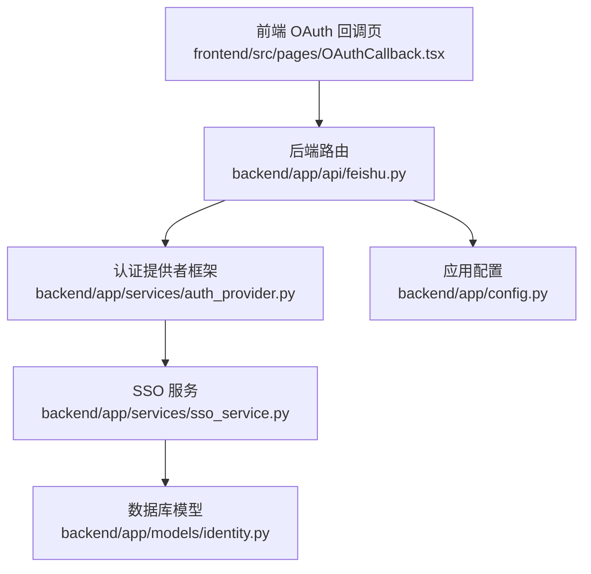
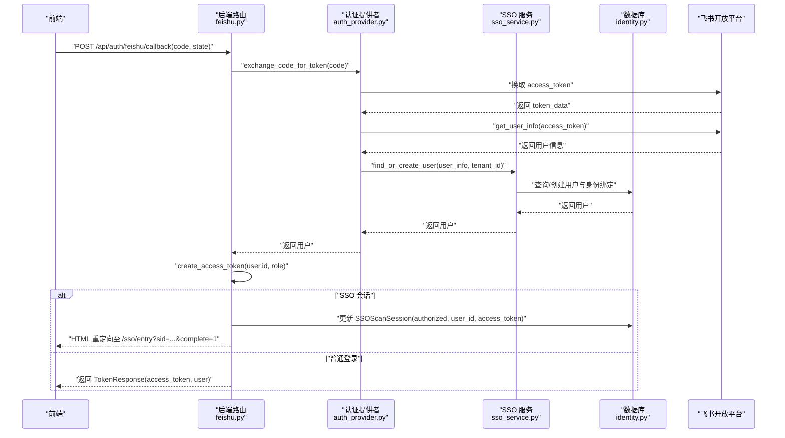
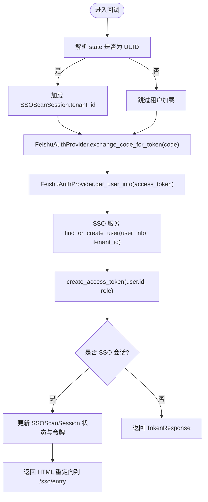
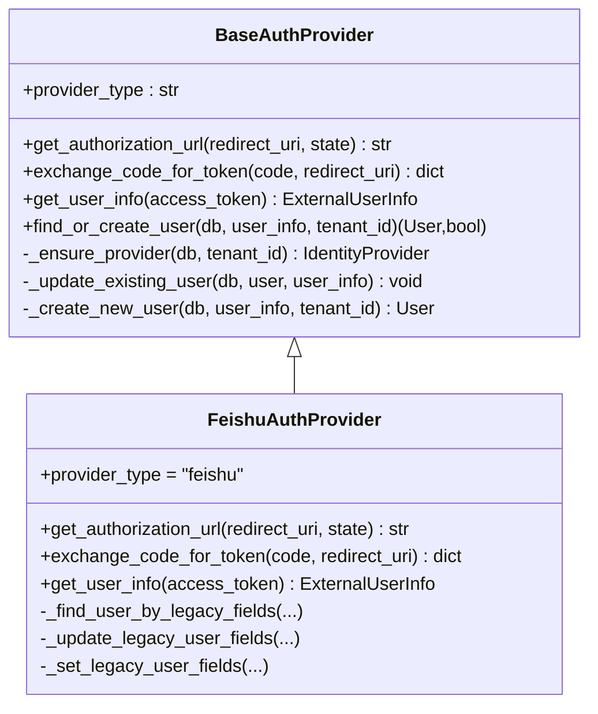
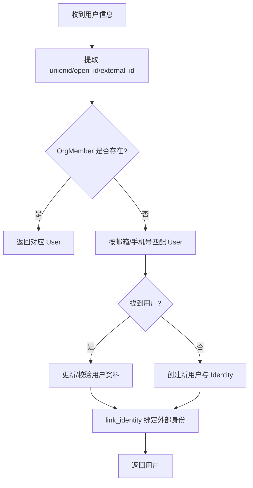
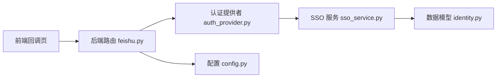

# 飞书OAuth认证

<cite>
**本文引用的文件**   
- [backend/app/api/feishu.py](file://backend/app/api/feishu.py)
- [backend/app/services/auth_provider.py](file://backend/app/services/auth_provider.py)
- [backend/app/services/sso_service.py](file://backend/app/services/sso_service.py)
- [backend/app/models/identity.py](file://backend/app/models/identity.py)
- [backend/app/config.py](file://backend/app/config.py)
- [frontend/src/pages/OAuthCallback.tsx](file://frontend/src/pages/OAuthCallback.tsx)
</cite>

## 目录
1. [简介](#简介)
2. [项目结构](#项目结构)
3. [核心组件](#核心组件)
4. [架构总览](#架构总览)
5. [详细组件分析](#详细组件分析)
6. [依赖关系分析](#依赖关系分析)
7. [性能考虑](#性能考虑)
8. [故障排查指南](#故障排查指南)
9. [结论](#结论)
10. [附录：配置与排错清单](#附录配置与排错清单)

## 简介
本文件为 Clawith 平台的飞书 OAuth 认证功能提供完整的 API 文档，重点覆盖以下方面：
- 回调接口 /api/auth/feishu/callback 的使用方法（code、state、用户信息交换、JWT 令牌生成）
- SSO 集成流程（租户隔离、用户身份映射）
- 飞书应用配置指南（App ID、App Secret、回调 URL）
- 错误处理策略与常见问题解决方案

## 项目结构
围绕飞书 OAuth 的核心代码分布在后端路由、认证提供者框架、SSO 服务、模型与配置以及前端回调页面中。整体组织方式如下：
- 后端路由：定义飞书 OAuth 回调与事件 Webhook
- 认证提供者：统一的 OAuth/SSO 抽象与飞书实现
- SSO 服务：企业级用户匹配、租户关联与身份绑定
- 数据模型：身份提供商与 SSO 会话记录
- 配置：环境变量与默认值
- 前端：OAuth 回调页，负责发起请求与多租户选择

**图表来源** 
- [backend/app/api/feishu.py](file://backend/app/api/feishu.py)
- [backend/app/services/auth_provider.py](file://backend/app/services/auth_provider.py)
- [backend/app/services/sso_service.py](file://backend/app/services/sso_service.py)
- [backend/app/models/identity.py](file://backend/app/models/identity.py)
- [backend/app/config.py](file://backend/app/config.py)
- [frontend/src/pages/OAuthCallback.tsx](file://frontend/src/pages/OAuthCallback.tsx)

**章节来源**
- [backend/app/api/feishu.py](file://backend/app/api/feishu.py)
- [backend/app/services/auth_provider.py](file://backend/app/services/auth_provider.py)
- [backend/app/services/sso_service.py](file://backend/app/services/sso_service.py)
- [backend/app/models/identity.py](file://backend/app/models/identity.py)
- [backend/app/config.py](file://backend/app/config.py)
- [frontend/src/pages/OAuthCallback.tsx](file://frontend/src/pages/OAuthCallback.tsx)

## 核心组件
- 飞书 OAuth 回调接口
  - 路径：GET/POST /api/auth/feishu/callback
  - 作用：接收飞书授权码 code 与状态 state，换取访问令牌并获取用户信息，查找或创建用户，签发 JWT 令牌；支持 SSO 会话完成跳转
- 认证提供者框架
  - 统一抽象 BaseAuthProvider 与具体实现 FeishuAuthProvider
  - 能力：生成授权链接、交换令牌、拉取用户信息、查找或创建用户、确保 IdentityProvider 存在
- SSO 服务
  - 能力：按 unionid/open_id/external_id 解析用户、按邮箱/手机号匹配用户、自动租户推断、绑定身份到 OrgMember
- 数据模型
  - IdentityProvider：存储各身份提供商配置（含 tenant_id 隔离）
  - SSOScanSession：临时 SSO 扫码/登录会话，用于跨端完成登录
- 配置
  - 环境变量：FEISHU_APP_ID、FEISHU_APP_SECRET、FEISHU_REDIRECT_URI、PUBLIC_BASE_URL 等

**章节来源**
- [backend/app/api/feishu.py](file://backend/app/api/feishu.py)
- [backend/app/services/auth_provider.py](file://backend/app/services/auth_provider.py)
- [backend/app/services/sso_service.py](file://backend/app/services/sso_service.py)
- [backend/app/models/identity.py](file://backend/app/models/identity.py)
- [backend/app/config.py](file://backend/app/config.py)

## 架构总览
下图展示了从前端触发到后端签发 JWT 的完整调用链，以及 SSO 场景下的会话回填与前端重定向流程。

**图表来源** 
- [backend/app/api/feishu.py](file://backend/app/api/feishu.py)
- [backend/app/services/auth_provider.py](file://backend/app/services/auth_provider.py)
- [backend/app/services/sso_service.py](file://backend/app/services/sso_service.py)
- [backend/app/models/identity.py](file://backend/app/models/identity.py)

## 详细组件分析

### 回调接口 /api/auth/feishu/callback
- 请求参数
  - GET/POST 均支持
  - code: 必填，来自飞书授权回调
  - state: 可选，若为 UUID 则视为 SSO 扫描会话 ID，用于租户隔离与会话回填
- 处理逻辑
  - 解析 state，若为 UUID 则读取 SSOScanSession.tenant_id 以限定租户范围
  - 使用 FeishuAuthProvider 进行 code 换 token、拉取用户信息
  - 通过 SSO 服务查找或创建用户，确保 IdentityProvider 存在并按租户隔离
  - 生成 JWT 令牌（基于用户 id 与角色）
  - 若为 SSO 会话，更新 SSOScanSession 并返回 HTML 重定向到前端完成页
  - 否则返回 TokenResponse（access_token 与用户信息）
- 响应
  - 成功：TokenResponse（包含 access_token 与用户对象）
  - SSO：HTML 页面，内嵌脚本重定向到 /sso/entry?sid=...&complete=1
  - 失败：HTTP 400，detail 包含错误信息

**图表来源** 
- [backend/app/api/feishu.py](file://backend/app/api/feishu.py)
- [backend/app/services/auth_provider.py](file://backend/app/services/auth_provider.py)
- [backend/app/services/sso_service.py](file://backend/app/services/sso_service.py)
- [backend/app/models/identity.py](file://backend/app/models/identity.py)

**章节来源**
- [backend/app/api/feishu.py](file://backend/app/api/feishu.py)

### 认证提供者框架与飞书实现
- BaseAuthProvider
  - 抽象方法：get_authorization_url、exchange_code_for_token、get_user_info
  - 通用流程：ensure provider、find_or_create_user（通过 SSO 服务）、更新/创建用户、绑定身份到 OrgMember
- FeishuAuthProvider
  - 授权链接：open-apis/authen/v1/authorize
  - 令牌交换：open-apis/authen/v1/oidc/access_token
  - 用户信息：open-apis/authen/v1/user_info
  - 用户查找策略：优先通过 SSO 服务按 unionid/open_id/external_id 解析，其次按邮箱/手机号匹配，最后创建新用户

**图表来源** 
- [backend/app/services/auth_provider.py](file://backend/app/services/auth_provider.py)

**章节来源**
- [backend/app/services/auth_provider.py](file://backend/app/services/auth_provider.py)

### SSO 服务与租户隔离
- 用户解析优先级
  - 通过 OrgMember 按 unionid/open_id/external_id 解析用户
  - 若无结果，按邮箱或手机号匹配用户（支持租户范围限制）
- 租户隔离
  - IdentityProvider 记录包含 tenant_id，所有查询与绑定均受其约束
  - auto_associate_tenant 可根据邮箱域名推断租户
- 身份绑定
  - link_identity 将外部身份与用户绑定，必要时创建 OrgMember 壳记录并被动填充资料字段

**图表来源** 
- [backend/app/services/sso_service.py](file://backend/app/services/sso_service.py)
- [backend/app/models/identity.py](file://backend/app/models/identity.py)

**章节来源**
- [backend/app/services/sso_service.py](file://backend/app/services/sso_service.py)
- [backend/app/models/identity.py](file://backend/app/models/identity.py)

### 前端 OAuth 回调页
- 行为
  - 从 URL 参数获取 code 与 state，调用 /auth/{provider}/callback
  - 若后端返回 requires_tenant_selection，展示多租户选择界面
  - 用户选择租户后，再次调用同一接口，传入 pending_token 与 tenant_id 完成登录
  - 成功后设置本地认证状态并导航到首页或公司设置页
- 错误处理
  - 捕获网络与业务错误，显示友好提示

**章节来源**
- [frontend/src/pages/OAuthCallback.tsx](file://frontend/src/pages/OAuthCallback.tsx)

## 依赖关系分析
- 路由层依赖认证提供者框架与 SSO 服务
- 认证提供者框架依赖 SSO 服务进行用户解析与绑定
- SSO 服务依赖数据库模型（IdentityProvider、SSOScanSession、User、Identity、OrgMember）
- 配置模块提供飞书 App 凭据与环境变量

**图表来源** 
- [backend/app/api/feishu.py](file://backend/app/api/feishu.py)
- [backend/app/services/auth_provider.py](file://backend/app/services/auth_provider.py)
- [backend/app/services/sso_service.py](file://backend/app/services/sso_service.py)
- [backend/app/models/identity.py](file://backend/app/models/identity.py)
- [backend/app/config.py](file://backend/app/config.py)

**章节来源**
- [backend/app/api/feishu.py](file://backend/app/api/feishu.py)
- [backend/app/services/auth_provider.py](file://backend/app/services/auth_provider.py)
- [backend/app/services/sso_service.py](file://backend/app/services/sso_service.py)
- [backend/app/models/identity.py](file://backend/app/models/identity.py)
- [backend/app/config.py](file://backend/app/config.py)

## 性能考虑
- 令牌缓存：认证提供者内部对 app_access_token 进行内存缓存，减少重复请求
- 数据库事务：回调与事件处理中使用短事务，避免长时间持有连接
- 去重机制：事件处理使用内存集合去重，防止飞书重试导致重复处理
- 资源下载：图片与文件下载采用异步客户端，超时控制合理

[本节为通用指导，不直接分析具体文件]

## 故障排查指南
- 常见错误
  - 缺少 code/state：前端未正确传递参数，检查回调 URL 与请求体
  - 飞书 API 失败：检查 FEISHU_APP_ID/FEISHU_APP_SECRET 是否正确，网络可达性与权限
  - 用户解析失败：确认 OrgMember 同步或邮箱/手机号匹配是否生效
  - SSO 会话未完成：检查 SSOScanSession 状态与前端重定向地址
- 定位步骤
  - 查看后端日志中的 Feishu 相关警告与错误
  - 核对 IdentityProvider 配置与租户隔离
  - 检查 SSOScanSession 记录的状态与过期时间
- 建议措施
  - 增加重试与降级策略（如仅用邮箱匹配）
  - 完善错误消息的用户可见性
  - 监控关键接口的耗时与失败率

**章节来源**
- [backend/app/api/feishu.py](file://backend/app/api/feishu.py)
- [backend/app/services/auth_provider.py](file://backend/app/services/auth_provider.py)
- [backend/app/services/sso_service.py](file://backend/app/services/sso_service.py)

## 结论
Clawith 的飞书 OAuth 认证通过统一的认证提供者框架与 SSO 服务实现了灵活的租户隔离与用户身份映射。回调接口简洁稳定，支持 SSO 会话回填与前端多租户选择。配合合理的配置与错误处理策略，可满足企业级集成需求。

[本节为总结，不直接分析具体文件]

## 附录：配置与排错清单
- 环境变量
  - FEISHU_APP_ID：飞书应用 App ID
  - FEISHU_APP_SECRET：飞书应用 App Secret
  - FEISHU_REDIRECT_URI：回调 URL（需与飞书应用配置一致）
  - PUBLIC_BASE_URL：公开基础 URL（用于生成 Webhook 地址等）
- 回调 URL 配置
  - 在飞书应用后台设置回调地址为后端提供的 /api/auth/feishu/callback
  - 确保 HTTPS 与域名白名单已配置
- 权限要求
  - 通讯录读取（用于解析用户信息）
  - 消息发送（用于机器人回复）
  - 资源下载（用于图片与文件处理）
- 常见问题
  - 无法获取用户信息：检查 scope 与权限
  - 多租户选择异常：确认 IdentityProvider.tenant_id 与邮箱域名映射
  - 文件下载失败：确认机器人具备 im:resource 权限

**章节来源**
- [backend/app/config.py](file://backend/app/config.py)
- [backend/app/api/feishu.py](file://backend/app/api/feishu.py)
- [backend/app/services/auth_provider.py](file://backend/app/services/auth_provider.py)
- [backend/app/services/sso_service.py](file://backend/app/services/sso_service.py)