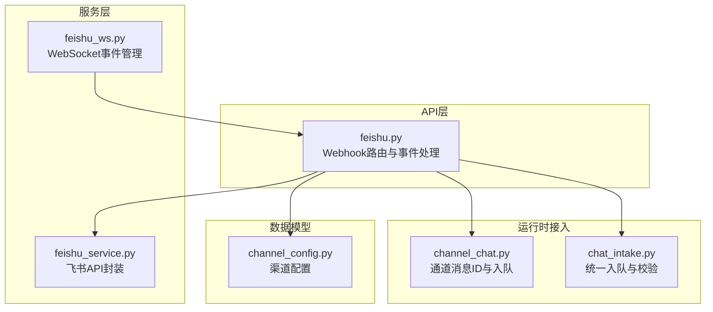
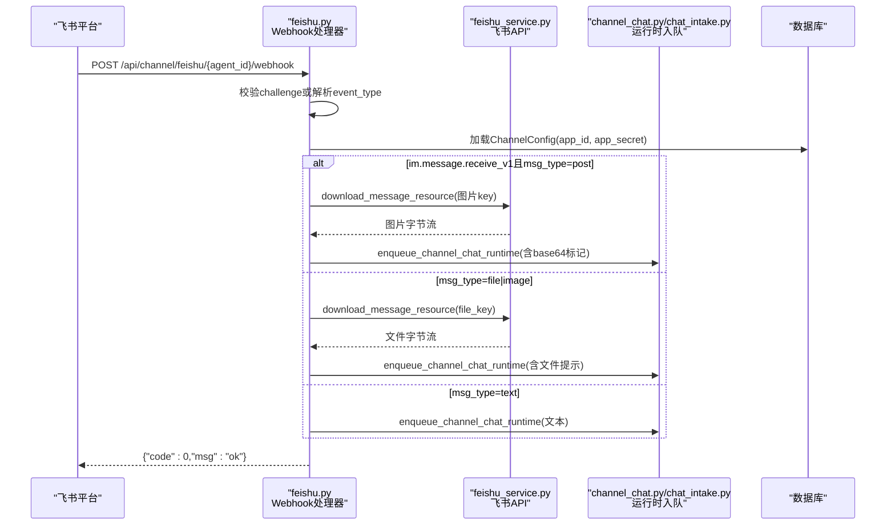
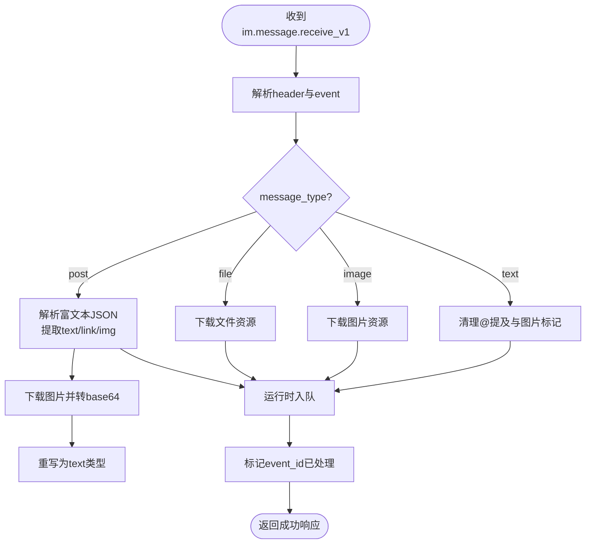
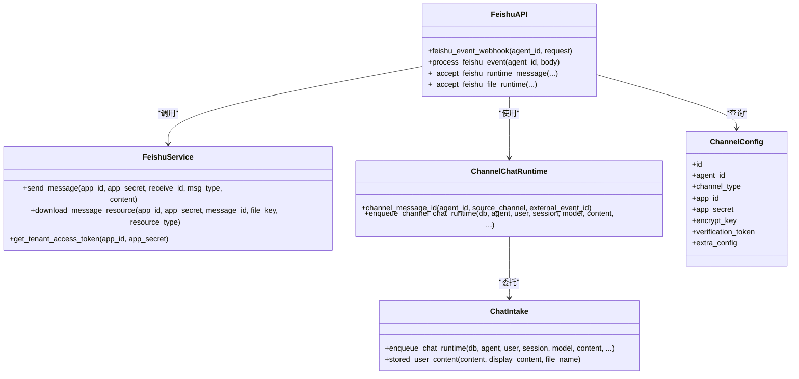

# 飞书Webhook事件处理

<cite>
**本文引用的文件**   
- [backend/app/api/feishu.py](file://backend/app/api/feishu.py)
- [backend/app/services/feishu_service.py](file://backend/app/services/feishu_service.py)
- [backend/app/services/feishu_ws.py](file://backend/app/services/feishu_ws.py)
- [backend/app/services/agent_runtime/channel_chat.py](file://backend/app/services/agent_runtime/channel_chat.py)
- [backend/app/services/agent_runtime/chat_intake.py](file://backend/app/services/agent_runtime/chat_intake.py)
- [backend/app/models/channel_config.py](file://backend/app/models/channel_config.py)
</cite>

## 目录
1. [简介](#简介)
2. [项目结构](#项目结构)
3. [核心组件](#核心组件)
4. [架构总览](#架构总览)
5. [详细组件分析](#详细组件分析)
6. [依赖关系分析](#依赖关系分析)
7. [性能考量](#性能考量)
8. [故障排查指南](#故障排查指南)
9. [结论](#结论)
10. [附录](#附录)

## 简介
本文件面向Clawith平台的“飞书Webhook事件处理”，重点说明POST /api/channel/feishu/{agent_id}/webhook接口的实现与行为，包括：
- 事件验证挑战（challenge）处理
- 消息接收与分发（im.message.receive_v1）
- 文本、富文本（post）、图片（image）、文件（file）等消息类型的解析与处理
- 附件下载与存储策略
- 去重机制、错误处理与日志记录策略
- WebSocket长连接模式下的事件路由复用

该接口是飞书机器人事件回调的入口，负责将飞书侧的事件可靠地接入到平台统一的Agent运行时通道。

## 项目结构
与飞书Webhook事件处理相关的后端代码主要分布在以下模块：
- API层：定义Webhook路由、请求解析、鉴权与响应
- 服务层：封装飞书API调用（令牌、消息发送、资源下载）
- 运行时接入：统一的消息入队、会话管理、模型选择与结果投递
- 配置模型：渠道配置持久化（app_id、app_secret、加密密钥等）
- WebSocket管理器：支持WebSocket长连接模式的事件接收与转发

图表来源
- [backend/app/api/feishu.py:388-401](file://backend/app/api/feishu.py#L388-L401)
- [backend/app/services/feishu_service.py:343-381](file://backend/app/services/feishu_service.py#L343-L381)
- [backend/app/services/feishu_ws.py:204-206](file://backend/app/services/feishu_ws.py#L204-L206)
- [backend/app/services/agent_runtime/channel_chat.py:34-46](file://backend/app/services/agent_runtime/channel_chat.py#L34-L46)
- [backend/app/services/agent_runtime/chat_intake.py:104-154](file://backend/app/services/agent_runtime/chat_intake.py#L104-L154)
- [backend/app/models/channel_config.py:13-41](file://backend/app/models/channel_config.py#L13-L41)

章节来源
- [backend/app/api/feishu.py:388-401](file://backend/app/api/feishu.py#L388-L401)
- [backend/app/services/feishu_service.py:343-381](file://backend/app/services/feishu_service.py#L343-L381)
- [backend/app/services/feishu_ws.py:204-206](file://backend/app/services/feishu_ws.py#L204-L206)
- [backend/app/services/agent_runtime/channel_chat.py:34-46](file://backend/app/services/agent_runtime/channel_chat.py#L34-L46)
- [backend/app/services/agent_runtime/chat_intake.py:104-154](file://backend/app/services/agent_runtime/chat_intake.py#L104-L154)
- [backend/app/models/channel_config.py:13-41](file://backend/app/models/channel_config.py#L13-L41)

## 核心组件
- Webhook路由处理器：接收飞书事件，处理challenge验证，分发消息类型，执行去重与持久化入队
- 飞书服务：封装飞书OpenAPI调用（应用令牌、消息发送、资源下载）
- WebSocket管理器：在WebSocket模式下接收事件并复用同一事件处理逻辑
- 通道消息ID生成器：基于外部事件ID生成稳定的内部消息ID，确保幂等
- 统一入队器：将消息原子性地挂接到运行时的等待队列或新运行中

章节来源
- [backend/app/api/feishu.py:388-401](file://backend/app/api/feishu.py#L388-L401)
- [backend/app/services/feishu_service.py:343-381](file://backend/app/services/feishu_service.py#L343-L381)
- [backend/app/services/feishu_ws.py:204-206](file://backend/app/services/feishu_ws.py#L204-L206)
- [backend/app/services/agent_runtime/channel_chat.py:34-46](file://backend/app/services/agent_runtime/channel_chat.py#L34-L46)
- [backend/app/services/agent_runtime/chat_intake.py:104-154](file://backend/app/services/agent_runtime/chat_intake.py#L104-L154)

## 架构总览
飞书Webhook事件处理的端到端流程如下：
- 飞书通过HTTP回调或WebSocket推送事件至平台
- Webhook处理器校验challenge或解析事件体
- 根据event_type路由到im.message.receive_v1处理分支
- 对post类型进行富文本解析与图片下载；对file/image类型进行资源下载
- 生成稳定消息ID，入队到统一运行时，返回快速成功响应
- 运行时消费消息，按会话上下文执行Agent任务，并通过飞书服务回复

图表来源
- [backend/app/api/feishu.py:388-401](file://backend/app/api/feishu.py#L388-L401)
- [backend/app/api/feishu.py:403-577](file://backend/app/api/feishu.py#L403-L577)
- [backend/app/services/feishu_service.py:512-533](file://backend/app/services/feishu_service.py#L512-L533)
- [backend/app/services/agent_runtime/channel_chat.py:104-154](file://backend/app/services/agent_runtime/channel_chat.py#L104-L154)
- [backend/app/services/agent_runtime/chat_intake.py:104-154](file://backend/app/services/agent_runtime/chat_intake.py#L104-L154)

## 详细组件分析

### Webhook路由与事件处理（POST /api/channel/feishu/{agent_id}/webhook）
- 路由定义：POST /api/channel/feishu/{agent_id}/webhook
- challenge验证：若请求体包含challenge字段，直接返回challenge值完成验证
- 事件处理：调用process_feishu_event进行事件解析与分发
- 去重机制：使用内存集合缓存已处理event_id，避免重复处理；当集合超过阈值时清理
- 配置加载：从数据库加载ChannelConfig以获取app_id与app_secret
- 事件类型：当前主要处理im.message.receive_v1消息事件

章节来源
- [backend/app/api/feishu.py:388-401](file://backend/app/api/feishu.py#L388-L401)
- [backend/app/api/feishu.py:403-423](file://backend/app/api/feishu.py#L403-L423)
- [backend/app/api/feishu.py:425-438](file://backend/app/api/feishu.py#L425-L438)

### im.message.receive_v1消息处理流程
- 提取sender信息：open_id与user_id（tenant级稳定ID）
- 提取message信息：message_type、chat_type、chat_id、content
- 富文本（post）处理：
  - 解析content JSON，提取text元素与link元素
  - 收集img元素的image_key，调用download_message_resource下载图片
  - 将图片转为base64标记嵌入文本，供视觉模型处理
  - 重写为text类型以便后续统一处理
- 文件与图片处理：
  - 根据message_type区分file与image
  - 下载资源后保存到工作区，生成display_content与executable_content
  - 调用_accept_feishu_file_runtime进行运行时入队
- 文本处理：
  - 去除@提及，保留用户文本
  - 剥离base64图片标记用于显示内容
  - 调用_accept_feishu_runtime_message进行运行时入队

图表来源
- [backend/app/api/feishu.py:429-504](file://backend/app/api/feishu.py#L429-L504)
- [backend/app/api/feishu.py:505-521](file://backend/app/api/feishu.py#L505-L521)
- [backend/app/api/feishu.py:523-576](file://backend/app/api/feishu.py#L523-L576)

章节来源
- [backend/app/api/feishu.py:429-504](file://backend/app/api/feishu.py#L429-L504)
- [backend/app/api/feishu.py:505-521](file://backend/app/api/feishu.py#L505-L521)
- [backend/app/api/feishu.py:523-576](file://backend/app/api/feishu.py#L523-L576)

### 附件下载与存储策略
- 下载接口：feishu_service.download_message_resource
  - 参数：app_id、app_secret、message_id、file_key、resource_type（file或image）
  - 返回：原始字节流
- 存储策略：store_agent_upload
  - 保存至Agent工作区，返回workspace_path与save_path
  - 图片消息附带base64标记供视觉模型处理
  - 文件消息附带系统提示，引导使用read_document工具读取内容
- 错误处理：下载失败时向用户发送友好提示，要求检查机器人权限

章节来源
- [backend/app/services/feishu_service.py:512-533](file://backend/app/services/feishu_service.py#L512-L533)
- [backend/app/api/feishu.py:610-643](file://backend/app/api/feishu.py#L610-L643)

### 去重机制与幂等性
- 内存去重：_processed_events集合缓存已处理的event_id
- 触发时机：仅在成功处理后添加event_id，确保崩溃后可重试
- 容量控制：当集合大小超过1000时自动清理，防止内存增长
- 消息ID稳定性：channel_message_id基于agent_id、source_channel、external_event_id生成UUID v5，保证幂等

章节来源
- [backend/app/api/feishu.py:384-385](file://backend/app/api/feishu.py#L384-L385)
- [backend/app/api/feishu.py:407-411](file://backend/app/api/feishu.py#L407-L411)
- [backend/app/api/feishu.py:517-521](file://backend/app/api/feishu.py#L517-L521)
- [backend/app/services/agent_runtime/channel_chat.py:34-46](file://backend/app/services/agent_runtime/channel_chat.py#L34-L46)

### 错误处理与日志记录
- 用户解析错误：捕获ChannelUserResolutionError，向用户发送友好提示
- 下载失败：记录错误日志并提示权限问题
- 空消息：过滤掉仅包含@提及的空消息
- 日志级别：使用loguru记录关键步骤与异常，便于问题定位

章节来源
- [backend/app/api/feishu.py:554-570](file://backend/app/api/feishu.py#L554-L570)
- [backend/app/api/feishu.py:624-643](file://backend/app/api/feishu.py#L624-L643)
- [backend/app/api/feishu.py:531-532](file://backend/app/api/feishu.py#L531-L532)

### WebSocket长连接模式
- 事件接收：FeishuWSManager通过lark-oapi SDK建立WebSocket连接
- 事件路由：接收到im.message.receive_v1事件后，调用process_feishu_event复用Webhook处理逻辑
- 代理绕过：针对macOS系统代理干扰，提供websockets.connect的临时替换
- 健康监控：定期检查连接状态，记录连接恢复与断开事件

章节来源
- [backend/app/services/feishu_ws.py:99-159](file://backend/app/services/feishu_ws.py#L99-L159)
- [backend/app/services/feishu_ws.py:204-206](file://backend/app/services/feishu_ws.py#L204-L206)
- [backend/app/services/feishu_ws.py:31-76](file://backend/app/services/feishu_ws.py#L31-L76)

## 依赖关系分析

图表来源
- [backend/app/api/feishu.py:388-401](file://backend/app/api/feishu.py#L388-L401)
- [backend/app/services/feishu_service.py:343-381](file://backend/app/services/feishu_service.py#L343-L381)
- [backend/app/services/agent_runtime/channel_chat.py:34-46](file://backend/app/services/agent_runtime/channel_chat.py#L34-L46)
- [backend/app/services/agent_runtime/chat_intake.py:104-154](file://backend/app/services/agent_runtime/chat_intake.py#L104-L154)
- [backend/app/models/channel_config.py:13-41](file://backend/app/models/channel_config.py#L13-L41)

章节来源
- [backend/app/api/feishu.py:388-401](file://backend/app/api/feishu.py#L388-L401)
- [backend/app/services/feishu_service.py:343-381](file://backend/app/services/feishu_service.py#L343-L381)
- [backend/app/services/agent_runtime/channel_chat.py:34-46](file://backend/app/services/agent_runtime/channel_chat.py#L34-L46)
- [backend/app/services/agent_runtime/chat_intake.py:104-154](file://backend/app/services/agent_runtime/chat_intake.py#L104-L154)
- [backend/app/models/channel_config.py:13-41](file://backend/app/models/channel_config.py#L13-L41)

## 性能考量
- 内存去重：使用固定容量的set缓存event_id，避免无限增长
- 异步处理：所有I/O操作均使用async/await，提高并发处理能力
- 连接池：httpx.AsyncClient复用连接，减少TCP握手开销
- 资源下载：设置合理的超时时间（30秒），避免长时间阻塞
- 日志优化：关键路径记录INFO级别日志，异常情况记录ERROR级别

[本节为通用性能指导，无需特定文件引用]

## 故障排查指南
- 事件未处理：检查event_id是否已在_processed_events中，确认去重逻辑
- 用户解析失败：查看ChannelUserResolutionError日志，确认飞书Contact API权限
- 文件下载失败：检查im:resource权限配置，确认app_id与app_secret正确
- WebSocket连接问题：查看feishu_ws.py中的连接状态日志，确认代理配置
- 消息类型不支持：确认message_type是否为text、post、image、file之一

章节来源
- [backend/app/api/feishu.py:554-570](file://backend/app/api/feishu.py#L554-L570)
- [backend/app/api/feishu.py:624-643](file://backend/app/api/feishu.py#L624-L643)
- [backend/app/services/feishu_ws.py:308-342](file://backend/app/services/feishu_ws.py#L308-L342)

## 结论
Clawith平台的飞书Webhook事件处理实现了完整的事件接收、解析、去重与运行时集成能力。通过统一的接口设计，支持多种消息类型与附件处理，确保了系统的可靠性与可扩展性。WebSocket模式的引入进一步提升了事件处理的实时性与稳定性。

[本节为总结性内容，无需特定文件引用]

## 附录

### API定义
- 接口路径：POST /api/channel/feishu/{agent_id}/webhook
- 请求体：飞书事件JSON对象
- 响应体：{"code": 0, "msg": "ok"} 或 {"challenge": "..."}
- 支持的event_type：im.message.receive_v1
- 支持的message_type：text、post、image、file

章节来源
- [backend/app/api/feishu.py:388-401](file://backend/app/api/feishu.py#L388-L401)
- [backend/app/api/feishu.py:429-576](file://backend/app/api/feishu.py#L429-L576)

### 配置项说明
- app_id：飞书应用的App ID
- app_secret：飞书应用的App Secret
- encrypt_key：消息加密密钥（可选）
- verification_token：事件验证令牌（可选）
- extra_config：扩展配置，包含connection_mode（webhook或websocket）

章节来源
- [backend/app/models/channel_config.py:28-41](file://backend/app/models/channel_config.py#L28-L41)