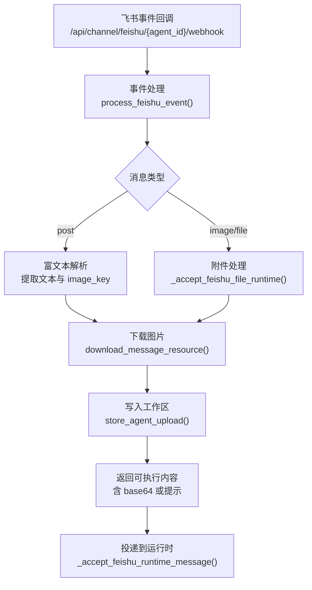
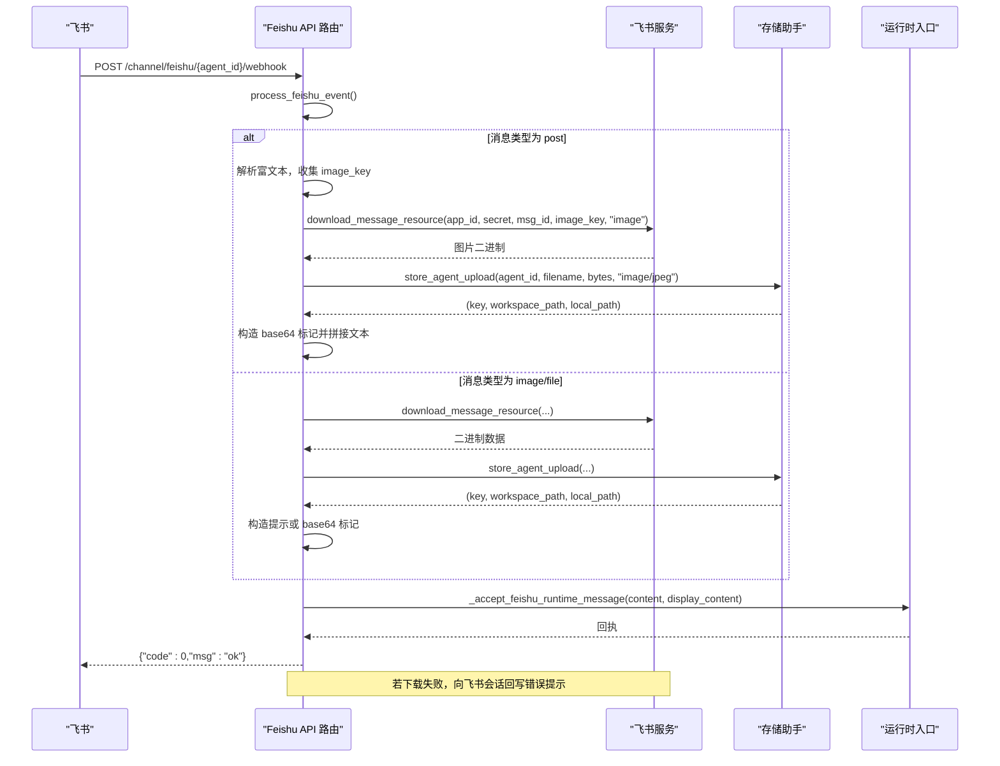
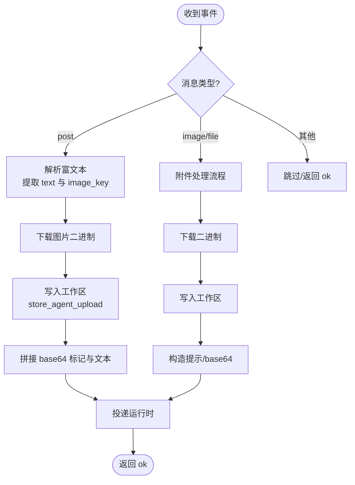
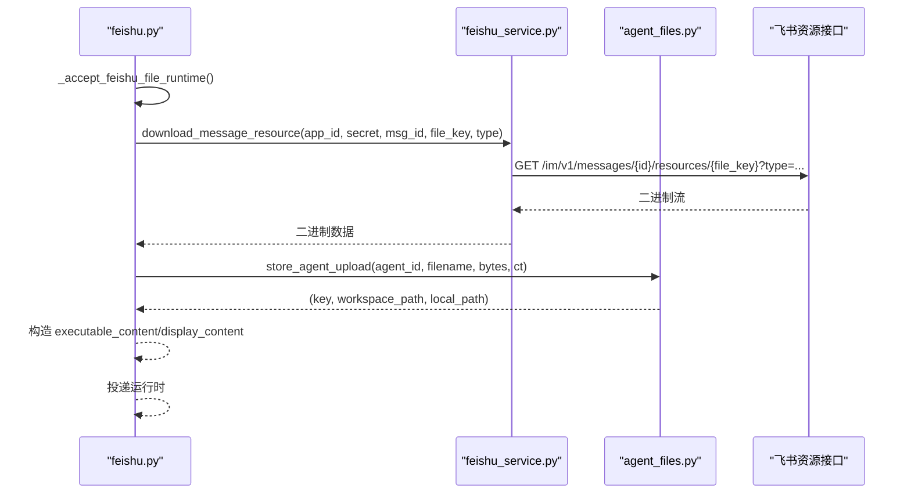
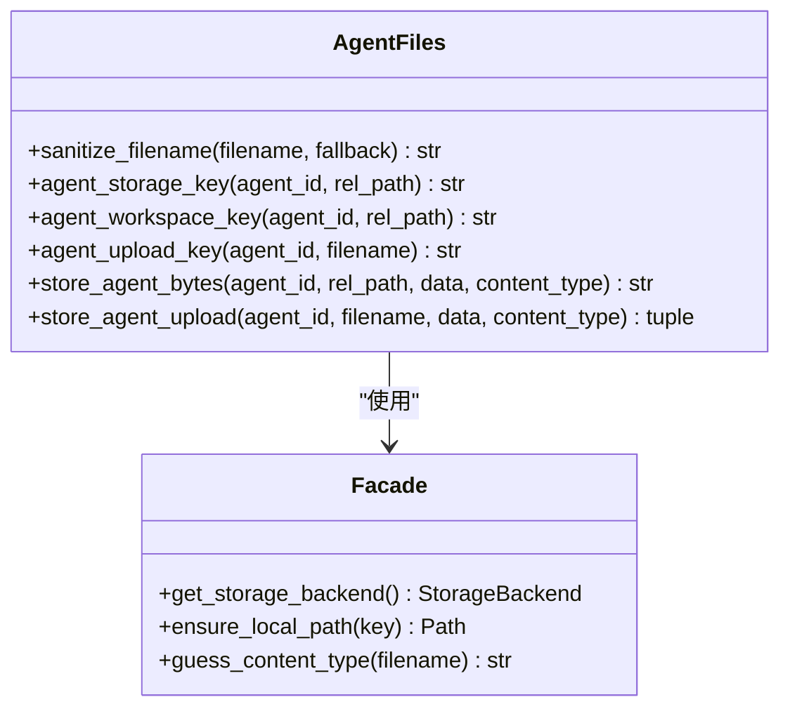
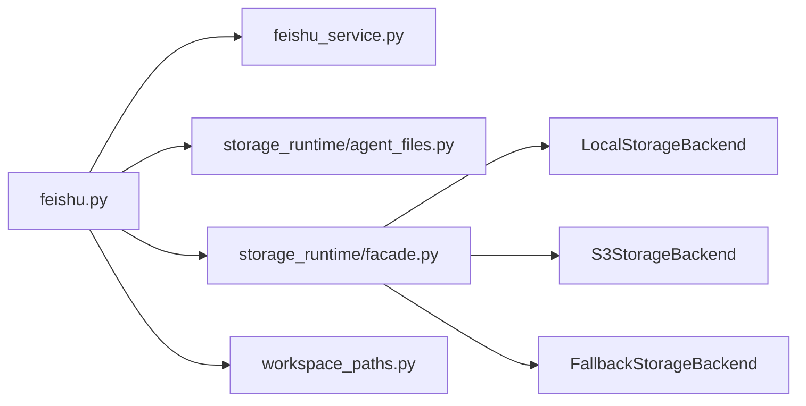

# 飞书文件附件处理

<cite>
**本文引用的文件**
- [backend/app/api/feishu.py](file://backend/app/api/feishu.py)
- [backend/app/services/feishu_service.py](file://backend/app/services/feishu_service.py)
- [backend/app/services/storage_runtime/agent_files.py](file://backend/app/services/storage_runtime/agent_files.py)
- [backend/app/services/storage_runtime/facade.py](file://backend/app/services/storage_runtime/facade.py)
- [backend/app/services/workspace_paths.py](file://backend/app/services/workspace_paths.py)
</cite>

## 目录
1. [简介](#简介)
2. [项目结构](#项目结构)
3. [核心组件](#核心组件)
4. [架构总览](#架构总览)
5. [详细组件分析](#详细组件分析)
6. [依赖关系分析](#依赖关系分析)
7. [性能考量](#性能考量)
8. [故障排查指南](#故障排查指南)
9. [结论](#结论)

## 简介
本文件为 Clawith 平台“飞书文件附件处理”功能的 API 与实现文档，聚焦以下目标：
- 图片与文件的下载处理流程：从事件回调中获取 file_key、调用飞书资源下载接口、生成工作区存储路径并持久化。
- 不同文件类型的处理方式：图片进行 base64 编码嵌入以支持视觉模型；普通文件保存后给出提示，引导后续读取操作。
- 工作区文件管理：命名规则、存储位置确定、内容类型识别。
- 下载失败的错误处理与用户反馈机制：统一错误日志、向飞书会话回写友好提示。

## 项目结构
与飞书文件附件处理相关的后端代码主要分布在以下模块：
- API 路由层：接收飞书事件回调，解析消息体，调度下载与存储。
- 飞书服务层：封装飞书 OpenAPI 调用（令牌、消息发送、资源下载）。
- 存储抽象层：按 Agent 维度组织工作区与上传目录，提供本地/S3 后端选择与内容类型推断。
- 工作区路径工具：校验与解析相对路径，防止越权访问。

图表来源
- [backend/app/api/feishu.py:388-577](file://backend/app/api/feishu.py#L388-L577)
- [backend/app/services/feishu_service.py:512-533](file://backend/app/services/feishu_service.py#L512-L533)
- [backend/app/services/storage_runtime/agent_files.py:67-84](file://backend/app/services/storage_runtime/agent_files.py#L67-L84)

章节来源
- [backend/app/api/feishu.py:388-577](file://backend/app/api/feishu.py#L388-L577)
- [backend/app/services/feishu_service.py:512-533](file://backend/app/services/feishu_service.py#L512-L533)
- [backend/app/services/storage_runtime/agent_files.py:67-84](file://backend/app/services/storage_runtime/agent_files.py#L67-L84)

## 核心组件
- 飞书事件回调处理器：负责鉴权、去重、解析消息体、分发不同类型消息的处理逻辑。
- 飞书资源下载器：基于 app_access_token 拉取 message 中的 image/file 资源。
- 工作区存储助手：按 agent_id 生成唯一 key，规范化文件名，推断 content_type，落盘并返回本地路径与工作区相对路径。
- 存储后端门面：根据配置选择 S3 或本地存储，并提供内容类型推断与本地路径保障。
- 工作区路径校验：确保所有相对路径在允许的根目录下，防止路径穿越。

章节来源
- [backend/app/api/feishu.py:388-577](file://backend/app/api/feishu.py#L388-L577)
- [backend/app/services/feishu_service.py:512-533](file://backend/app/services/feishu_service.py#L512-L533)
- [backend/app/services/storage_runtime/agent_files.py:22-84](file://backend/app/services/storage_runtime/agent_files.py#L22-L84)
- [backend/app/services/storage_runtime/facade.py:34-77](file://backend/app/services/storage_runtime/facade.py#L34-L77)
- [backend/app/services/workspace_paths.py:21-48](file://backend/app/services/workspace_paths.py#L21-L48)

## 架构总览
下图展示了从飞书事件到工作区落盘的完整链路，以及失败时的用户反馈路径。

图表来源
- [backend/app/api/feishu.py:388-577](file://backend/app/api/feishu.py#L388-L577)
- [backend/app/services/feishu_service.py:512-533](file://backend/app/services/feishu_service.py#L512-L533)
- [backend/app/services/storage_runtime/agent_files.py:67-84](file://backend/app/services/storage_runtime/agent_files.py#L67-L84)

## 详细组件分析

### 飞书事件回调与消息分发
- 入口路由：POST /api/channel/feishu/{agent_id}/webhook
- 事件去重：内存集合记录 event_id，避免重复处理。
- 消息类型分支：
  - post：解析富文本段落，提取 text 与 img 的 image_key；将图片下载并转为 base64 标记，合并为纯文本消息继续走通用处理。
  - image/file：进入附件处理流程，下载并存储，构造提示或 base64 标记。
  - 其他类型：忽略或返回不支持。

图表来源
- [backend/app/api/feishu.py:429-577](file://backend/app/api/feishu.py#L429-L577)

章节来源
- [backend/app/api/feishu.py:388-577](file://backend/app/api/feishu.py#L388-L577)

### 附件处理与下载
- 关键函数：_accept_feishu_file_runtime()
- 输入来源：message.content 中的 image_key 或 file_key。
- 下载接口：feishu_service.download_message_resource(app_id, app_secret, message_id, file_key, resource_type)
- 存储：store_agent_upload(agent_id, filename, bytes, content_type)
- 输出：
  - 图片：base64 标记 + 系统提示（已保存到工作区某路径，建议使用 read_document 读取）
  - 普通文件：显示文件名与保存提示

图表来源
- [backend/app/api/feishu.py:580-689](file://backend/app/api/feishu.py#L580-L689)
- [backend/app/services/feishu_service.py:512-533](file://backend/app/services/feishu_service.py#L512-L533)
- [backend/app/services/storage_runtime/agent_files.py:67-84](file://backend/app/services/storage_runtime/agent_files.py#L67-L84)

章节来源
- [backend/app/api/feishu.py:580-689](file://backend/app/api/feishu.py#L580-L689)
- [backend/app/services/feishu_service.py:512-533](file://backend/app/services/feishu_service.py#L512-L533)

### 工作区文件管理与命名规则
- 命名规则：
  - 图片：image_{file_key后8位}.jpg
  - 普通文件：使用原始 file_name，缺失时 fallback 为 file_{file_key后8位}.bin
  - 文件名清洗：sanitize_filename 替换反斜杠与斜杠，去除空名
- 存储位置：
  - 键前缀：workspace/uploads/{safe_name}
  - 最终 key：{agent_id}/workspace/uploads/{safe_name}
  - 返回 workspace_path：workspace/uploads/{safe_name}
  - 返回 local_path：实际本地路径（由存储后端决定）
- 内容类型识别：
  - 优先传入 content_type（图片为 image/jpeg）
  - 否则通过 guess_content_type 基于扩展名推断

图表来源
- [backend/app/services/storage_runtime/agent_files.py:22-84](file://backend/app/services/storage_runtime/agent_files.py#L22-L84)
- [backend/app/services/storage_runtime/facade.py:34-77](file://backend/app/services/storage_runtime/facade.py#L34-L77)

章节来源
- [backend/app/services/storage_runtime/agent_files.py:22-84](file://backend/app/services/storage_runtime/agent_files.py#L22-L84)
- [backend/app/services/storage_runtime/facade.py:34-77](file://backend/app/services/storage_runtime/facade.py#L34-L77)

### 路径安全与访问控制
- 工具方法：resolve_path_within_root、resolve_agent_visible_path
- 行为：拒绝绝对路径、拒绝跳出允许根目录、可选禁止直接访问根目录
- 用途：确保工作区相对路径合法，防止越权访问企业信息目录等敏感区域

章节来源
- [backend/app/services/workspace_paths.py:21-48](file://backend/app/services/workspace_paths.py#L21-L48)
- [backend/app/services/workspace_paths.py:51-88](file://backend/app/services/workspace_paths.py#L51-L88)

### 错误处理与用户反馈
- 下载失败：
  - 记录错误日志
  - 向飞书会话发送文本消息，提示检查机器人权限（im:resource）并重发
- 用户解析失败：
  - 捕获 ChannelUserResolutionError
  - 向飞书会话发送“账号识别不稳定”的提示，避免重复创建账号

章节来源
- [backend/app/api/feishu.py:505-577](file://backend/app/api/feishu.py#L505-L577)
- [backend/app/api/feishu.py:580-689](file://backend/app/api/feishu.py#L580-L689)

## 依赖关系分析
- feishu.py 依赖：
  - feishu_service：下载资源、发送消息
  - storage_runtime.agent_files：生成 key、写入工作区、推断内容类型
  - storage_runtime.facade：选择存储后端、本地路径保障
  - workspace_paths：路径校验（间接用于工作区访问）
- 存储后端选择：
  - 默认 LocalStorageBackend
  - 当 STORAGE_BACKEND=s3 时，使用 S3StorageBackend，并可启用本地回退

图表来源
- [backend/app/api/feishu.py:388-577](file://backend/app/api/feishu.py#L388-L577)
- [backend/app/services/feishu_service.py:512-533](file://backend/app/services/feishu_service.py#L512-L533)
- [backend/app/services/storage_runtime/agent_files.py:67-84](file://backend/app/services/storage_runtime/agent_files.py#L67-L84)
- [backend/app/services/storage_runtime/facade.py:34-77](file://backend/app/services/storage_runtime/facade.py#L34-L77)

章节来源
- [backend/app/api/feishu.py:388-577](file://backend/app/api/feishu.py#L388-L577)
- [backend/app/services/storage_runtime/facade.py:34-77](file://backend/app/services/storage_runtime/facade.py#L34-L77)

## 性能考量
- 事件去重：内存集合限制大小，避免无限增长。
- 下载超时：资源下载设置超时，避免阻塞。
- 存储后端：
  - S3 可配置连接池与并发写入参数，提升吞吐。
  - 本地回退模式保证高可用。
- 内容类型推断：基于扩展名快速判断，减少额外探测开销。

[本节为通用指导，不直接分析具体文件]

## 故障排查指南
- 无法下载图片/文件：
  - 检查飞书机器人是否具备 im:resource 权限
  - 确认 app_id/app_secret 正确且有效
  - 查看日志中的 Feishu API 错误码与消息
- 用户解析失败：
  - 检查 Contact API 权限与网络连通性
  - 观察是否出现 ChannelUserResolutionError
- 存储异常：
  - 确认 STORAGE_BACKEND 配置与凭据
  - 若启用本地回退，检查本地根目录权限与空间

章节来源
- [backend/app/api/feishu.py:505-577](file://backend/app/api/feishu.py#L505-L577)
- [backend/app/api/feishu.py:580-689](file://backend/app/api/feishu.py#L580-L689)
- [backend/app/services/storage_runtime/facade.py:34-77](file://backend/app/services/storage_runtime/facade.py#L34-L77)

## 结论
Clawith 平台的飞书文件附件处理通过清晰的分层设计实现了稳健的事件驱动流程：从事件回调解析、资源下载、工作区存储到运行时投递，并在失败场景下提供友好的用户反馈。通过统一的存储抽象与路径安全校验，系统在可扩展性与安全性之间取得平衡，便于在多租户与多 Agent 环境下稳定运行。