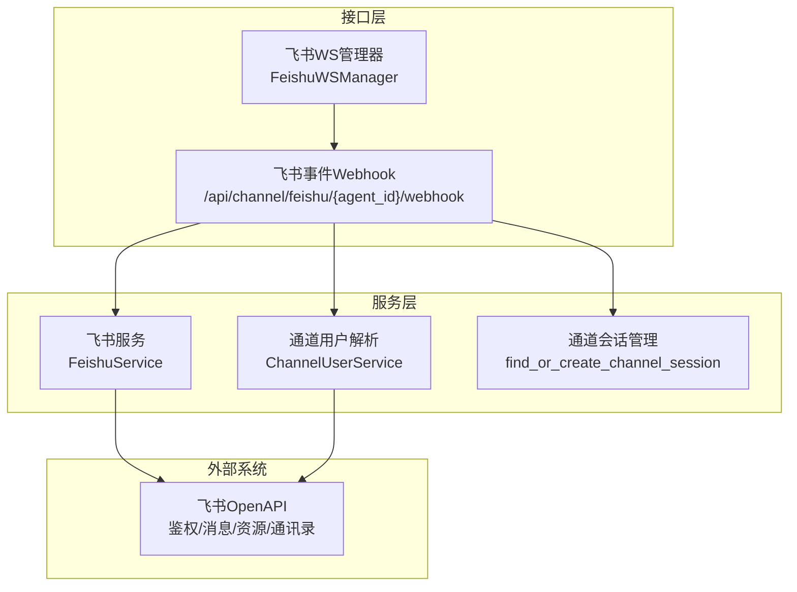
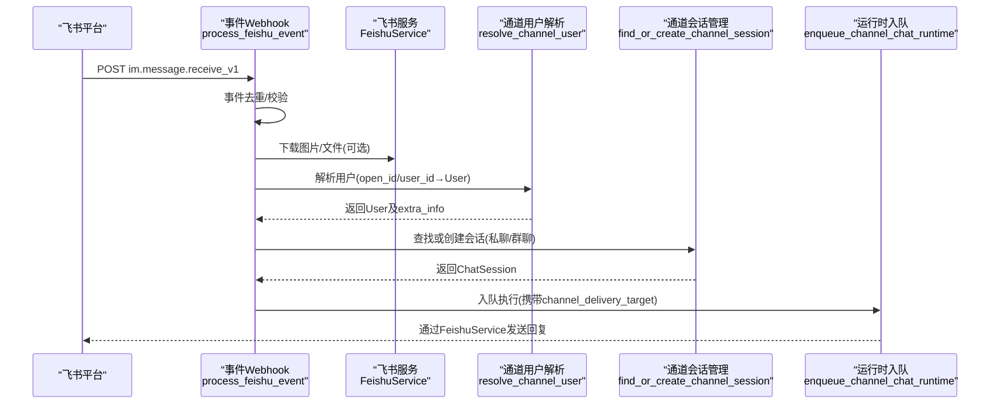
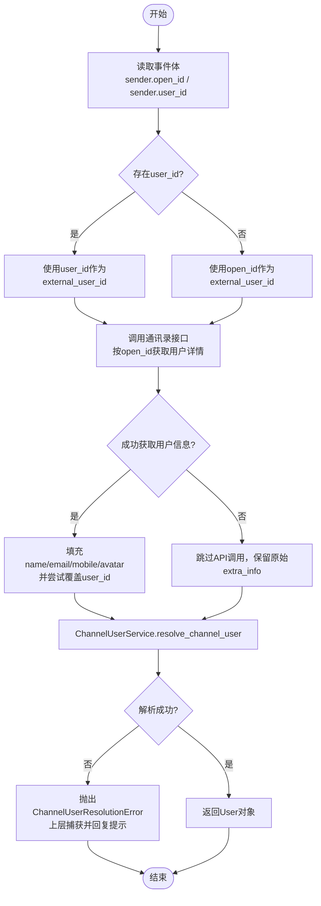
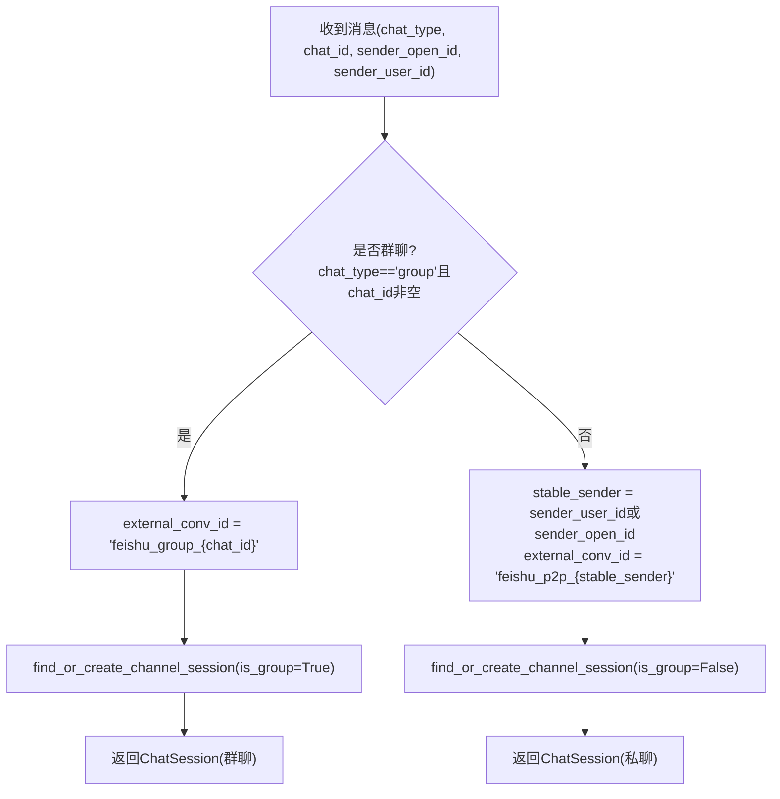
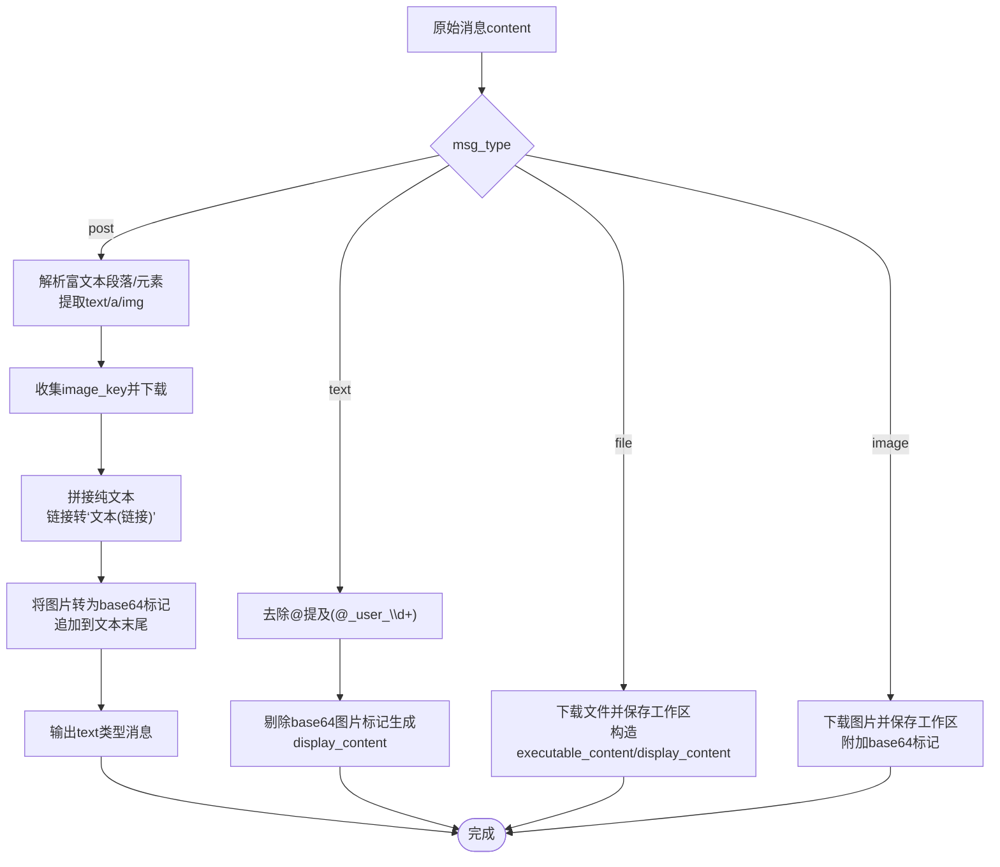
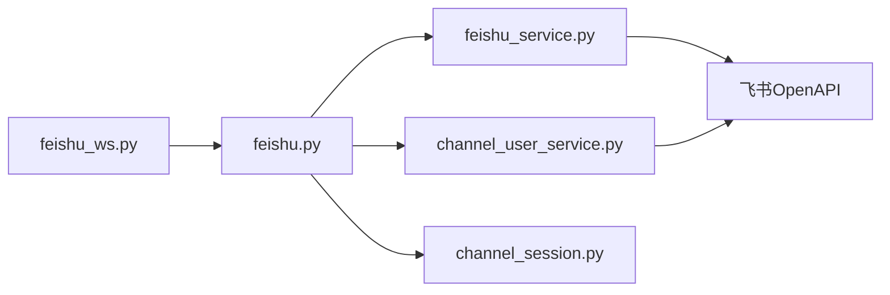

# 飞书消息处理

<cite>
**本文引用的文件**   
- [backend/app/api/feishu.py](file://backend/app/api/feishu.py)
- [backend/app/services/feishu_service.py](file://backend/app/services/feishu_service.py)
- [backend/app/services/feishu_ws.py](file://backend/app/services/feishu_ws.py)
- [backend/app/services/channel_session.py](file://backend/app/services/channel_session.py)
- [backend/app/services/channel_user_service.py](file://backend/app/services/channel_user_service.py)
</cite>

## 目录
1. [简介](#简介)
2. [项目结构](#项目结构)
3. [核心组件](#核心组件)
4. [架构总览](#架构总览)
5. [详细组件分析](#详细组件分析)
6. [依赖关系分析](#依赖关系分析)
7. [性能考量](#性能考量)
8. [故障排查指南](#故障排查指南)
9. [结论](#结论)
10. [附录](#附录)

## 简介
本文件为 Clawith 平台的“飞书消息处理”功能提供详细的 API 文档，聚焦以下方面：
- 发送者身份解析机制：open_id 与 user_id 的转换、用户信息获取与头像处理。
- 会话管理逻辑：私聊与群聊的区别处理、会话 ID 生成规则。
- 消息内容预处理：@提及符号清理、图片标记提取、富文本转纯文本等。
- 用户分辨率失败时的错误处理策略与回退机制。

## 项目结构
与飞书消息处理相关的后端代码主要分布在以下模块：
- API 路由层：接收 Webhook/WebSocket 事件，统一进入事件处理流程。
- 服务层：封装飞书 OpenAPI（鉴权、消息收发、资源下载）、WebSocket 长连接管理。
- 通道用户与会话：统一的通道用户解析与会话创建/复用。

图表来源
- [backend/app/api/feishu.py:388-577](file://backend/app/api/feishu.py#L388-L577)
- [backend/app/services/feishu_ws.py:91-397](file://backend/app/services/feishu_ws.py#L91-L397)
- [backend/app/services/feishu_service.py:77-1050](file://backend/app/services/feishu_service.py#L77-L1050)
- [backend/app/services/channel_user_service.py:27-108](file://backend/app/services/channel_user_service.py#L27-L108)
- [backend/app/services/channel_session.py:24-184](file://backend/app/services/channel_session.py#L24-L184)

章节来源
- [backend/app/api/feishu.py:388-577](file://backend/app/api/feishu.py#L388-L577)
- [backend/app/services/feishu_ws.py:91-397](file://backend/app/services/feishu_ws.py#L91-L397)
- [backend/app/services/feishu_service.py:77-1050](file://backend/app/services/feishu_service.py#L77-L1050)
- [backend/app/services/channel_user_service.py:27-108](file://backend/app/services/channel_user_service.py#L27-L108)
- [backend/app/services/channel_session.py:24-184](file://backend/app/services/channel_session.py#L24-L184)

## 核心组件
- 飞书事件入口与处理器：负责校验、去重、类型分发、富文本/附件归一化、用户解析与会话创建、入队运行。
- 飞书服务：封装鉴权、消息发送/更新、资源下载、CardKit 流式卡片等能力。
- WebSocket 管理器：维护长连接、事件分发到统一处理器。
- 通道用户解析：基于 OrgMember/Identity/User 的统一解析策略，支持 open_id/user_id 映射与头像/邮箱/手机等信息回填。
- 通道会话管理：按 agent+external_conv_id 唯一性保证会话复用，区分私聊/群聊并维护元数据。

章节来源
- [backend/app/api/feishu.py:388-577](file://backend/app/api/feishu.py#L388-L577)
- [backend/app/services/feishu_service.py:77-1050](file://backend/app/services/feishu_service.py#L77-L1050)
- [backend/app/services/feishu_ws.py:91-397](file://backend/app/services/feishu_ws.py#L91-L397)
- [backend/app/services/channel_user_service.py:27-108](file://backend/app/services/channel_user_service.py#L27-L108)
- [backend/app/services/channel_session.py:24-184](file://backend/app/services/channel_session.py#L24-L184)

## 架构总览
下图展示了从飞书事件到达至平台内部处理的完整链路，包括身份解析、会话管理与消息预处理。

图表来源
- [backend/app/api/feishu.py:388-577](file://backend/app/api/feishu.py#L388-L577)
- [backend/app/services/feishu_service.py:343-408](file://backend/app/services/feishu_service.py#L343-L408)
- [backend/app/services/channel_user_service.py:73-108](file://backend/app/services/channel_user_service.py#L73-L108)
- [backend/app/services/channel_session.py:24-184](file://backend/app/services/channel_session.py#L24-L184)

## 详细组件分析

### 发送者身份解析机制（open_id/user_id 转换、用户信息与头像）
- 事件体中同时包含 sender.open_id 与 sender.user_id（tenant 级稳定ID）。优先使用 user_id 作为 external_user_id；若缺失则回退到 open_id。
- 调用通讯录接口以 open_id 查询用户详情，补充 name/email/mobile/avatar 等 extra_info，并尝试将 user_id 覆盖为最新值。
- 通过 ChannelUserService.resolve_channel_user 进行统一解析：
  - 优先级：已绑定用户的OrgMember → 未绑定的OrgMember新建并绑定 → 按email/mobile匹配已有User并绑定 → 无匹配则懒注册创建User与OrgMember。
  - 头像处理：优先取 avatar_240/640/origin 等字段，兼容字典与字符串两种形态。
- 解析失败时抛出 ChannelUserResolutionError，上层捕获后向用户发送友好提示并跳过本次处理，避免重复创建账号。

图表来源
- [backend/app/api/feishu.py:241-304](file://backend/app/api/feishu.py#L241-L304)
- [backend/app/services/channel_user_service.py:73-108](file://backend/app/services/channel_user_service.py#L73-L108)

章节来源
- [backend/app/api/feishu.py:241-304](file://backend/app/api/feishu.py#L241-L304)
- [backend/app/services/channel_user_service.py:73-108](file://backend/app/services/channel_user_service.py#L73-L108)

### 会话管理逻辑（私聊与群聊、会话ID生成）
- 私聊会话：
  - external_conv_id 格式：feishu_p2p_{stable_sender}，其中 stable_sender 优先使用 user_id，否则用 open_id。
  - 会话类型为 direct，user_id 为发消息的平台用户。
- 群聊会话：
  - external_conv_id 格式：feishu_group_{chat_id}。
  - 会话类型为 group，user_id 通常指向 Agent 创建者（占位），is_group=True，group_name 可记录群组名片段。
- find_or_create_channel_session 保证 (agent_id, external_conv_id) 唯一性，跨租户隔离，并在冲突时抛出 ChannelSessionError。

图表来源
- [backend/app/api/feishu.py:340-355](file://backend/app/api/feishu.py#L340-L355)
- [backend/app/services/channel_session.py:24-184](file://backend/app/services/channel_session.py#L24-L184)

章节来源
- [backend/app/api/feishu.py:340-355](file://backend/app/api/feishu.py#L340-L355)
- [backend/app/services/channel_session.py:24-184](file://backend/app/services/channel_session.py#L24-L184)

### 消息内容预处理（@清理、图片标记、富文本转纯文本）
- 富文本 post：
  - 解析 content 段落与元素，提取 text/a/img 标签，链接转为“文本(链接)”形式，图片 key 收集后下载并转为 base64 内嵌标记。
  - 若无纯文本但有图片，则生成“[用户发送了图片，请看图片内容]”作为提示。
  - 最终将 post 重写为 text 类型消息，便于后续统一处理。
- 普通文本：
  - 使用正则移除 @_user_\d+ 形式的 @提及，得到 user_text。
  - display_content 会剔除 base64 图片标记，若仅含图片标记则显示“[图片]”。
- 文件/图片：
  - 根据 message_type(file/image) 下载资源，保存至工作区，并构造 executable_content 与 display_content，图片还会附带 base64 标记供视觉模型使用。

图表来源
- [backend/app/api/feishu.py:440-504](file://backend/app/api/feishu.py#L440-L504)
- [backend/app/api/feishu.py:526-541](file://backend/app/api/feishu.py#L526-L541)
- [backend/app/api/feishu.py:580-689](file://backend/app/api/feishu.py#L580-L689)

章节来源
- [backend/app/api/feishu.py:440-504](file://backend/app/api/feishu.py#L440-L504)
- [backend/app/api/feishu.py:526-541](file://backend/app/api/feishu.py#L526-L541)
- [backend/app/api/feishu.py:580-689](file://backend/app/api/feishu.py#L580-L689)

### 用户分辨率失败时的错误处理与回退
- 当 ChannelUserService.resolve_channel_user 抛出 ChannelUserResolutionError：
  - 上层捕获后不中断整体流程，而是向用户发送友好提示（告知无法稳定识别账号，建议重试或检查权限）。
  - 根据 chat_type 选择 reply_target（群聊用 chat_id，私聊用 open_id），并通过 FeishuService.send_message 回复。
  - 返回 code=0 的“已处理”响应，避免飞书重试风暴。
- 文件下载失败：
  - 同样回复用户提示，说明需要 im:resource 权限并重新发布应用版本。

章节来源
- [backend/app/api/feishu.py:554-576](file://backend/app/api/feishu.py#L554-L576)
- [backend/app/api/feishu.py:624-643](file://backend/app/api/feishu.py#L624-L643)
- [backend/app/services/channel_user_service.py:23-28](file://backend/app/services/channel_user_service.py#L23-L28)

### 事件入口与去重
- Webhook 入口：/api/channel/feishu/{agent_id}/webhook
- 验证挑战：直接返回 challenge。
- 事件去重：内存集合 _processed_events 记录 event_id，超过阈值自动清空，防止重复处理。

章节来源
- [backend/app/api/feishu.py:388-401](file://backend/app/api/feishu.py#L388-L401)
- [backend/app/api/feishu.py:403-424](file://backend/app/api/feishu.py#L403-L424)
- [backend/app/api/feishu.py:516-521](file://backend/app/api/feishu.py#L516-L521)
- [backend/app/api/feishu.py:572-576](file://backend/app/api/feishu.py#L572-L576)

### WebSocket 长连接模式
- 当配置 connection_mode=websocket 时，启动 FeishuWSManager 客户端，自动重连，事件回调统一转发到 process_feishu_event。
- 针对 websockets 代理问题，在连接握手阶段临时替换 connect 以强制 proxy=None，避免 macOS 系统代理干扰。

章节来源
- [backend/app/services/feishu_ws.py:91-397](file://backend/app/services/feishu_ws.py#L91-L397)
- [backend/app/api/feishu.py:158-188](file://backend/app/api/feishu.py#L158-L188)

## 依赖关系分析
- API 层依赖：
  - feishu_service：发送/更新消息、下载资源、CardKit 操作。
  - channel_user_service：统一用户解析。
  - channel_session：会话创建/复用。
- 外部依赖：
  - 飞书 OpenAPI：鉴权、消息、资源、通讯录、审批、多维表格、文档等。
  - lark-oapi SDK（可选）：用于 CardKit 与 WebSocket。

图表来源
- [backend/app/api/feishu.py:388-577](file://backend/app/api/feishu.py#L388-L577)
- [backend/app/services/feishu_service.py:77-1050](file://backend/app/services/feishu_service.py#L77-L1050)
- [backend/app/services/feishu_ws.py:91-397](file://backend/app/services/feishu_ws.py#L91-L397)
- [backend/app/services/channel_user_service.py:27-108](file://backend/app/services/channel_user_service.py#L27-L108)
- [backend/app/services/channel_session.py:24-184](file://backend/app/services/channel_session.py#L24-L184)

章节来源
- [backend/app/api/feishu.py:388-577](file://backend/app/api/feishu.py#L388-L577)
- [backend/app/services/feishu_service.py:77-1050](file://backend/app/services/feishu_service.py#L77-L1050)
- [backend/app/services/feishu_ws.py:91-397](file://backend/app/services/feishu_ws.py#L91-L397)
- [backend/app/services/channel_user_service.py:27-108](file://backend/app/services/channel_user_service.py#L27-L108)
- [backend/app/services/channel_session.py:24-184](file://backend/app/services/channel_session.py#L24-L184)

## 性能考量
- 事件去重：内存集合限制大小，避免无限增长。
- 资源下载：对图片/文件设置超时，失败快速回退并提示。
- 会话创建：使用数据库 advisory lock 保证并发安全。
- WebSocket：SDK 自动重连，健康监控仅记录状态变化，避免重复连接。

[本节为通用指导，无需引用具体文件]

## 故障排查指南
- 用户解析失败：
  - 检查 Contact API 权限与 app_token 有效性。
  - 确认外部 user_id/open_id 是否正确传递。
  - 查看日志中的 ChannelUserResolutionError 与提示消息。
- 文件/图片下载失败：
  - 确认机器人具备 im:resource 权限并已重新发布。
  - 检查 file_key 是否存在与有效。
- 会话冲突：
  - 检查 external_conv_id 是否符合规范，避免与其他通道或租户冲突。
  - 关注 ChannelSessionError 的 scope_mismatch 提示。

章节来源
- [backend/app/api/feishu.py:554-576](file://backend/app/api/feishu.py#L554-L576)
- [backend/app/api/feishu.py:624-643](file://backend/app/api/feishu.py#L624-L643)
- [backend/app/services/channel_session.py:152-180](file://backend/app/services/channel_session.py#L152-L180)

## 结论
Clawith 的飞书消息处理通过统一的事件入口、健壮的用户解析与会话管理、完善的消息预处理与错误回退机制，实现了高可用、可扩展的 IM 集成方案。建议在部署时确保必要的权限与网络环境，并根据业务需求调整去重与缓存策略。

[本节为总结，无需引用具体文件]

## 附录
- 关键 API 端点
  - Webhook：POST /api/channel/feishu/{agent_id}/webhook
  - 配置渠道：POST /api/agents/{agent_id}/channel
  - 获取 Webhook URL：GET /api/agents/{agent_id}/channel/webhook-url

章节来源
- [backend/app/api/feishu.py:130-215](file://backend/app/api/feishu.py#L130-L215)
- [backend/app/api/feishu.py:388-401](file://backend/app/api/feishu.py#L388-L401)