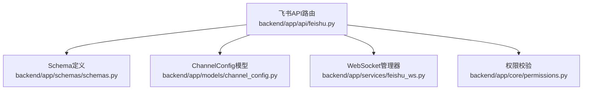
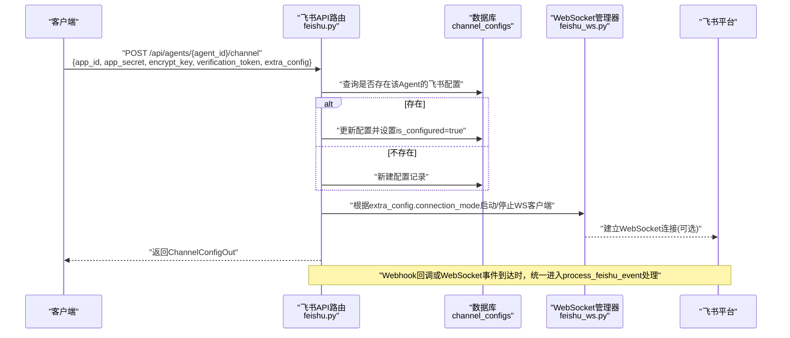
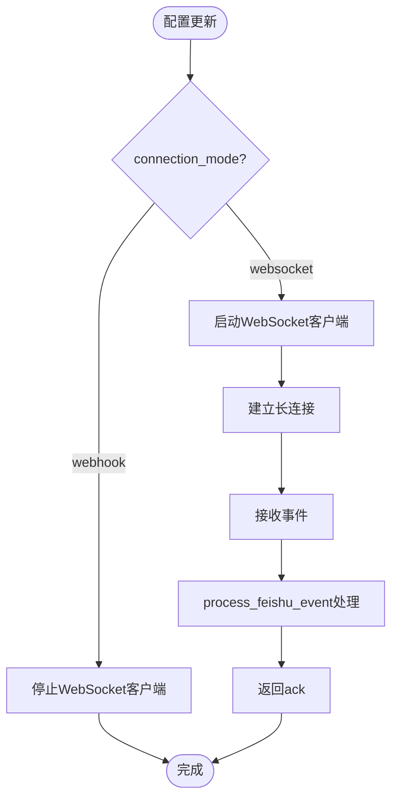
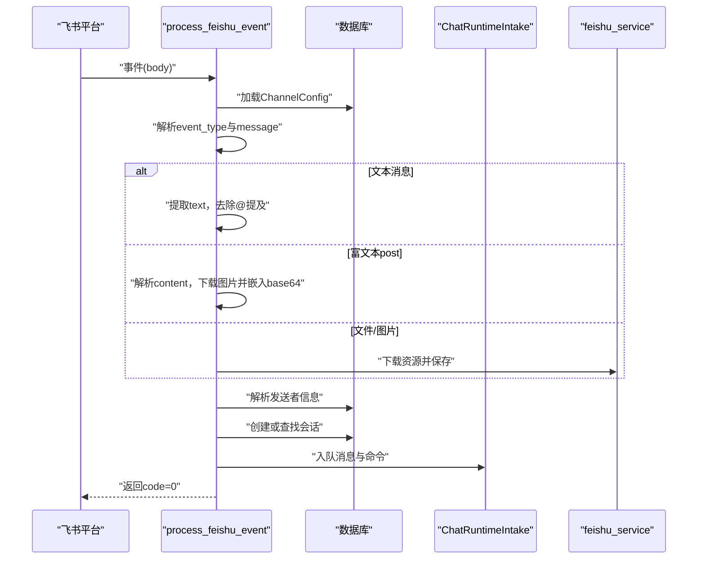
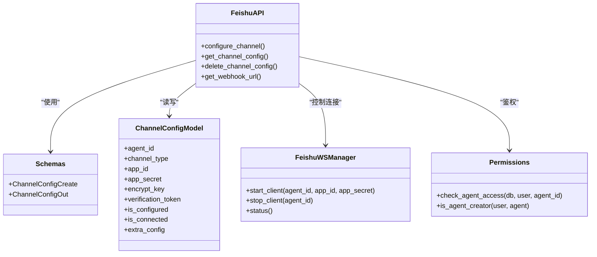

# 飞书渠道配置

<cite>
**本文引用的文件**   
- [backend/app/api/feishu.py](file://backend/app/api/feishu.py)
- [backend/app/models/channel_config.py](file://backend/app/models/channel_config.py)
- [backend/app/schemas/schemas.py](file://backend/app/schemas/schemas.py)
- [backend/app/services/feishu_ws.py](file://backend/app/services/feishu_ws.py)
- [backend/app/core/permissions.py](file://backend/app/core/permissions.py)
</cite>

## 目录
1. [简介](#简介)
2. [项目结构](#项目结构)
3. [核心组件](#核心组件)
4. [架构总览](#架构总览)
5. [详细组件分析](#详细组件分析)
6. [依赖关系分析](#依赖关系分析)
7. [性能考量](#性能考量)
8. [故障排查指南](#故障排查指南)
9. [结论](#结论)

## 简介
本文件为Clawith平台“Agent级别的飞书渠道配置”提供完整的API文档。涵盖以下接口：
- POST /api/agents/{agent_id}/channel：创建或更新Agent的飞书机器人配置
- GET /api/agents/{agent_id}/channel：查询Agent的飞书渠道配置
- DELETE /api/agents/{agent_id}/channel：删除Agent的飞书渠道配置

同时说明：
- 配置参数：app_id、app_secret、encrypt_key、verification_token等
- WebSocket连接模式与Webhook模式的切换机制
- 权限验证与错误处理逻辑

## 项目结构
与飞书渠道配置相关的后端实现集中在以下模块：
- API路由层：定义REST接口，负责鉴权、参数校验、调用服务层
- 数据模型层：ChannelConfig持久化存储
- Schema层：请求/响应数据结构定义
- 服务层：WebSocket长连接管理（可选）与事件处理

**图表来源**
- [backend/app/api/feishu.py:128-236](file://backend/app/api/feishu.py#L128-L236)
- [backend/app/schemas/schemas.py:449-474](file://backend/app/schemas/schemas.py#L449-L474)
- [backend/app/models/channel_config.py:13-51](file://backend/app/models/channel_config.py#L13-L51)
- [backend/app/services/feishu_ws.py:91-397](file://backend/app/services/feishu_ws.py#L91-L397)
- [backend/app/core/permissions.py:481-523](file://backend/app/core/permissions.py#L481-L523)

**章节来源**
- [backend/app/api/feishu.py:128-236](file://backend/app/api/feishu.py#L128-L236)
- [backend/app/schemas/schemas.py:449-474](file://backend/app/schemas/schemas.py#L449-L474)
- [backend/app/models/channel_config.py:13-51](file://backend/app/models/channel_config.py#L13-L51)
- [backend/app/services/feishu_ws.py:91-397](file://backend/app/services/feishu_ws.py#L91-L397)
- [backend/app/core/permissions.py:481-523](file://backend/app/core/permissions.py#L481-L523)

## 核心组件
- ChannelConfigCreate：用于POST请求体，包含channel_type、app_id、app_secret、encrypt_key、verification_token、extra_config
- ChannelConfigOut：用于GET/POST响应体，包含id、agent_id、channel_type、app_id、app_secret、encrypt_key、verification_token、is_configured、is_connected、last_tested_at、extra_config、created_at
- ChannelConfig模型：数据库表channel_configs，字段包括agent_id、channel_type、app_id、app_secret、encrypt_key、verification_token、is_configured、is_connected、last_tested_at、extra_config、时间戳等
- FeishuWSManager：管理飞书WebSocket客户端，支持按Agent启动/停止连接，自动重连与健康监控

**章节来源**
- [backend/app/schemas/schemas.py:449-474](file://backend/app/schemas/schemas.py#L449-L474)
- [backend/app/models/channel_config.py:13-51](file://backend/app/models/channel_config.py#L13-L51)
- [backend/app/services/feishu_ws.py:91-397](file://backend/app/services/feishu_ws.py#L91-L397)

## 架构总览
下图展示了Agent级别飞书渠道配置的端到端流程，包括配置管理、WebSocket/Webhook模式切换、事件接收与处理。

**图表来源**
- [backend/app/api/feishu.py:130-188](file://backend/app/api/feishu.py#L130-L188)
- [backend/app/services/feishu_ws.py:211-346](file://backend/app/services/feishu_ws.py#L211-L346)

## 详细组件分析

### 接口定义与行为

- POST /api/agents/{agent_id}/channel
  - 功能：创建或更新Agent的飞书渠道配置
  - 权限：仅Agent创建者可操作；需通过check_agent_access与is_agent_creator校验
  - 参数：ChannelConfigCreate（channel_type默认feishu，必填app_id、app_secret，可选encrypt_key、verification_token、extra_config）
  - 行为：若已存在同Agent同channel_type的配置则更新；否则新建；根据extra_config.connection_mode决定是否启动WebSocket客户端
  - 响应：ChannelConfigOut

- GET /api/agents/{agent_id}/channel
  - 功能：查询Agent的飞书渠道配置
  - 权限：需具备Agent访问权限（check_agent_access）
  - 响应：ChannelConfigOut；未配置返回404

- DELETE /api/agents/{agent_id}/channel
  - 功能：删除Agent的飞书渠道配置
  - 权限：仅Agent创建者可操作；需通过check_agent_access与is_agent_creator校验
  - 响应：204 No Content；未配置返回404

- GET /api/agents/{agent_id}/channel/webhook-url
  - 功能：获取当前Agent的飞书Webhook回调URL
  - 响应：{webhook_url: "{public_base}/api/channel/feishu/{agent_id}/webhook"}

**章节来源**
- [backend/app/api/feishu.py:130-188](file://backend/app/api/feishu.py#L130-L188)
- [backend/app/api/feishu.py:191-215](file://backend/app/api/feishu.py#L191-L215)
- [backend/app/api/feishu.py:217-235](file://backend/app/api/feishu.py#L217-L235)

### 权限验证与错误处理
- 权限校验
  - check_agent_access：校验用户是否对目标Agent有访问权限（公司租户隔离、创建者优先、管理员或显式授权）
  - is_agent_creator：判断当前用户是否为Agent创建者
- 错误处理
  - 无权限：返回403 Forbidden
  - Agent不存在：返回404 Not Found
  - 渠道未配置：返回404 Not Found
  - 其他异常：抛出HTTPException并附带错误详情

**章节来源**
- [backend/app/core/permissions.py:481-523](file://backend/app/core/permissions.py#L481-L523)
- [backend/app/api/feishu.py:130-188](file://backend/app/api/feishu.py#L130-L188)
- [backend/app/api/feishu.py:191-215](file://backend/app/api/feishu.py#L191-L215)
- [backend/app/api/feishu.py:217-235](file://backend/app/api/feishu.py#L217-L235)

### 数据模型与Schema
- ChannelConfig模型字段
  - agent_id：关联Agent主键
  - channel_type：枚举值包含feishu等
  - app_id、app_secret、encrypt_key、verification_token：飞书应用凭证
  - is_configured、is_connected、last_tested_at：状态字段
  - extra_config：扩展配置JSON（如connection_mode）
  - created_at、updated_at：时间戳
- ChannelConfigCreate/ChannelConfigOut
  - Create：channel_type、app_id、app_secret、encrypt_key、verification_token、extra_config
  - Out：id、agent_id、channel_type、app_id、app_secret、encrypt_key、verification_token、is_configured、is_connected、last_tested_at、extra_config、created_at

**章节来源**
- [backend/app/models/channel_config.py:13-51](file://backend/app/models/channel_config.py#L13-L51)
- [backend/app/schemas/schemas.py:449-474](file://backend/app/schemas/schemas.py#L449-L474)

### WebSocket连接模式与Webhook模式切换
- 切换机制
  - 在extra_config.connection_mode中指定模式："websocket"或"webhook"
  - POST配置时，若mode为"websocket"，后台异步启动WebSocket客户端；否则停止WS客户端
  - 启动WS客户端时，使用lark-oapi SDK建立长连接，自动重连与健康监控
- 事件处理
  - Webhook模式：飞书将事件推送到/api/channel/feishu/{agent_id}/webhook
  - WebSocket模式：SDK内部接收事件后，统一调用process_feishu_event处理
- 去重与可靠性
  - process_feishu_event维护内存级事件ID去重集合，避免重复处理
  - 先持久化到Runtime再返回ack，确保消息不丢失

**图表来源**
- [backend/app/api/feishu.py:130-188](file://backend/app/api/feishu.py#L130-L188)
- [backend/app/services/feishu_ws.py:211-346](file://backend/app/services/feishu_ws.py#L211-L346)
- [backend/app/api/feishu.py:388-577](file://backend/app/api/feishu.py#L388-L577)

**章节来源**
- [backend/app/api/feishu.py:130-188](file://backend/app/api/feishu.py#L130-L188)
- [backend/app/services/feishu_ws.py:211-346](file://backend/app/services/feishu_ws.py#L211-L346)
- [backend/app/api/feishu.py:388-577](file://backend/app/api/feishu.py#L388-L577)

### 事件处理流程（Webhook与WebSocket统一）
- 入口
  - Webhook：POST /api/channel/feishu/{agent_id}/webhook
  - WebSocket：SDK回调process_feishu_event
- 处理步骤
  - 解析header.event_type与event.message
  - 文本消息：提取text内容，去除@提及，构造可执行内容
  - 富文本post：解析content段落，提取文本与图片key，下载图片并嵌入base64标记
  - 文件/图片：下载资源并保存到工作区，生成提示语
  - 用户解析：通过飞书Contact API获取稳定user_id与头像等信息
  - 会话创建：find_or_create_channel_session创建或复用会话
  - Runtime入队：enqueue_channel_chat_runtime持久化命令与消息
  - 去重：记录event_id避免重复处理
  - 回复：失败时通过feishu_service.send_message回退回复

**图表来源**
- [backend/app/api/feishu.py:388-577](file://backend/app/api/feishu.py#L388-L577)

**章节来源**
- [backend/app/api/feishu.py:388-577](file://backend/app/api/feishu.py#L388-L577)

## 依赖关系分析
- API路由依赖
  - 权限模块：check_agent_access、is_agent_creator
  - Schema：ChannelConfigCreate、ChannelConfigOut
  - 模型：ChannelConfig
  - WebSocket管理器：feishu_ws_manager.start_client/stop_client
  - 平台服务：platform_service.get_public_base_url（用于生成webhook URL）
- WebSocket管理器依赖
  - lark-oapi SDK：建立与飞书的WebSocket连接
  - websockets库：底层连接（可通过代理补丁绕过系统代理干扰）
  - 数据库：启动时扫描已配置的Agent并恢复WS连接

**图表来源**
- [backend/app/api/feishu.py:130-235](file://backend/app/api/feishu.py#L130-L235)
- [backend/app/models/channel_config.py:13-51](file://backend/app/models/channel_config.py#L13-L51)
- [backend/app/schemas/schemas.py:449-474](file://backend/app/schemas/schemas.py#L449-L474)
- [backend/app/services/feishu_ws.py:91-397](file://backend/app/services/feishu_ws.py#L91-L397)
- [backend/app/core/permissions.py:481-523](file://backend/app/core/permissions.py#L481-L523)

**章节来源**
- [backend/app/api/feishu.py:130-235](file://backend/app/api/feishu.py#L130-L235)
- [backend/app/models/channel_config.py:13-51](file://backend/app/models/channel_config.py#L13-L51)
- [backend/app/schemas/schemas.py:449-474](file://backend/app/schemas/schemas.py#L449-L474)
- [backend/app/services/feishu_ws.py:91-397](file://backend/app/services/feishu_ws.py#L91-L397)
- [backend/app/core/permissions.py:481-523](file://backend/app/core/permissions.py#L481-L523)

## 性能考量
- 异步处理：所有数据库操作与外部调用均使用异步，提高并发处理能力
- 事件去重：内存集合维护event_id去重，避免重复处理导致负载放大
- 连接健康监控：WebSocket管理器定期检查连接状态，记录断连与恢复日志
- 资源下载：图片与文件下载采用流式处理并缓存至工作区，减少重复IO
- 可扩展性：extra_config支持扩展字段，便于未来新增配置项

[本节为通用指导，无需引用具体文件]

## 故障排查指南
- 常见问题
  - 权限不足：确认当前用户是否为Agent创建者或拥有管理权限
  - 渠道未配置：检查ChannelConfig是否存在且is_configured=true
  - WebSocket连接失败：确认lark-oapi已安装，app_id与app_secret正确，网络可达
  - Webhook回调失败：确认回调URL可被飞书访问，且服务器能正常接收POST请求
- 错误码与提示
  - 403：权限不足或租户隔离限制
  - 404：Agent或渠道未找到
  - 业务错误：飞书API返回非零code时，抛出运行时异常并记录错误详情
- 调试建议
  - 查看日志中的[Feishu]前缀，定位事件处理与连接状态
  - 检查内存去重集合大小，必要时清理以避免内存增长
  - 验证extra_config.connection_mode是否正确设置

**章节来源**
- [backend/app/api/feishu.py:388-577](file://backend/app/api/feishu.py#L388-L577)
- [backend/app/services/feishu_ws.py:211-346](file://backend/app/services/feishu_ws.py#L211-L346)

## 结论
本API文档完整描述了Clawith平台Agent级别飞书渠道配置的接口规范、数据模型、权限校验与错误处理，以及WebSocket与Webhook两种连接模式的切换机制。通过统一的process_feishu_event处理流程，确保了消息处理的可靠性和一致性。建议在生产环境中合理配置权限、监控连接状态，并根据业务需求选择合适的连接模式。

[本节为总结性内容，无需引用具体文件]