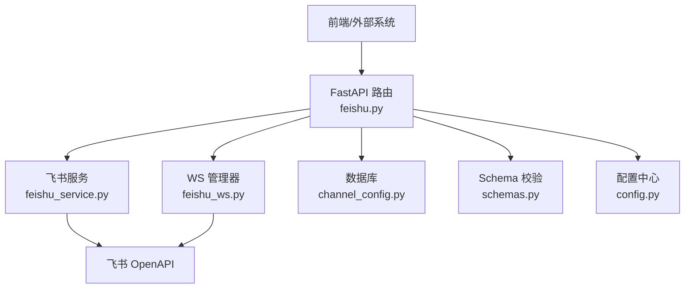
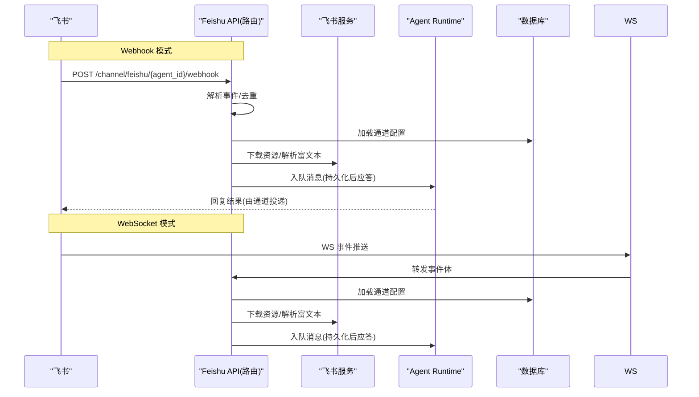
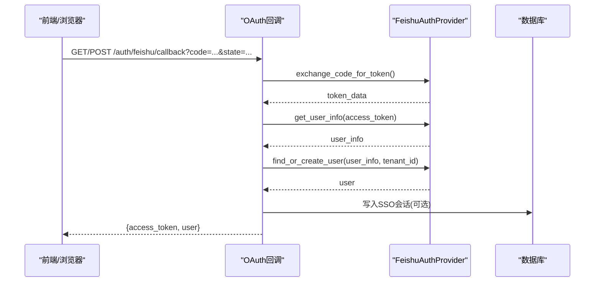
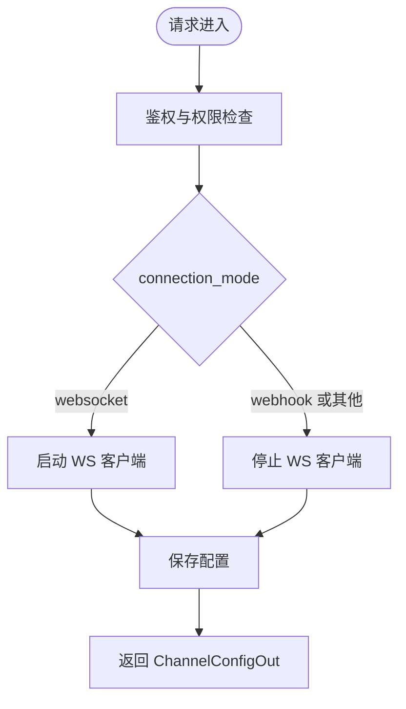
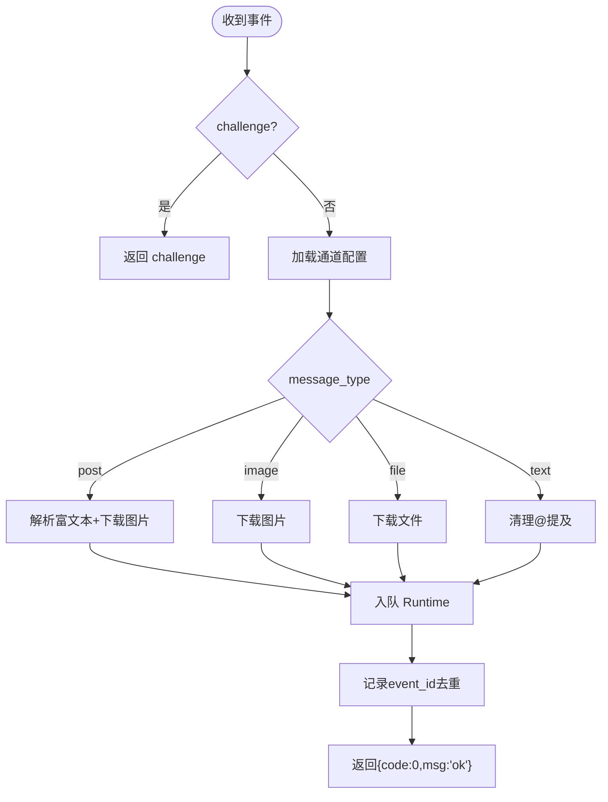
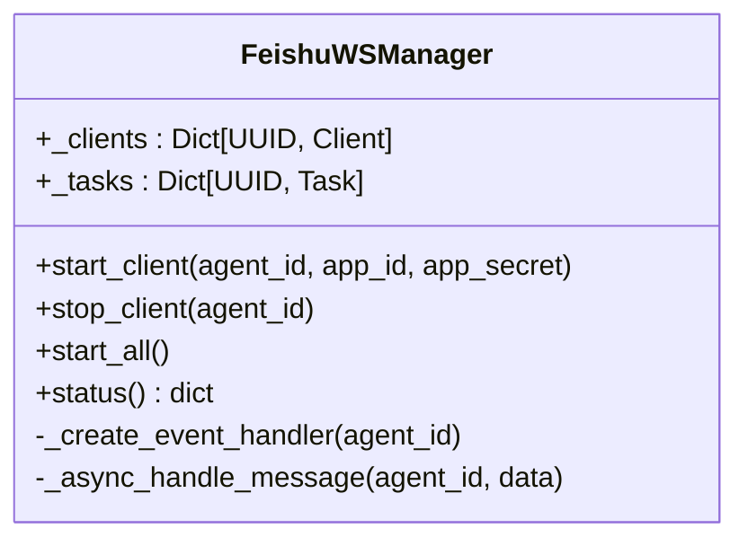
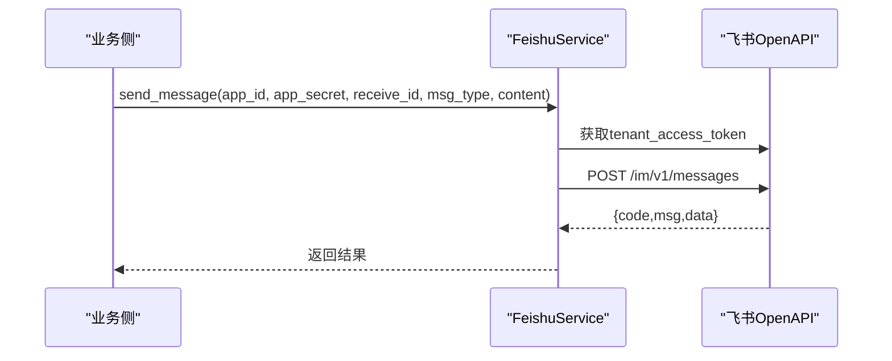
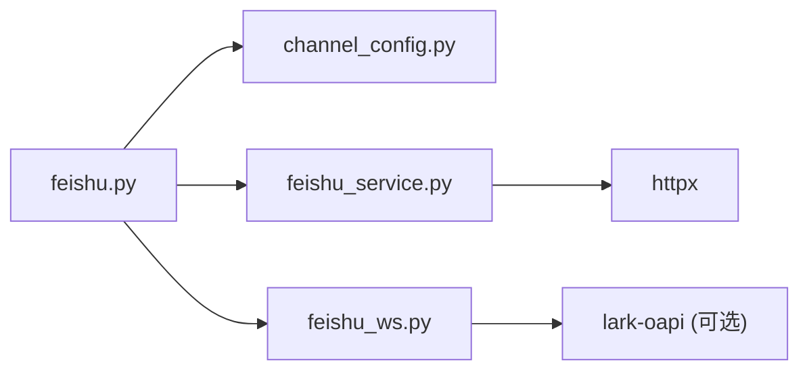

# 飞书集成API

<cite>
**本文引用的文件**   
- [backend/app/api/feishu.py](file://backend/app/api/feishu.py)
- [backend/app/services/feishu_service.py](file://backend/app/services/feishu_service.py)
- [backend/app/services/feishu_ws.py](file://backend/app/services/feishu_ws.py)
- [backend/app/models/channel_config.py](file://backend/app/models/channel_config.py)
- [backend/app/schemas/schemas.py](file://backend/app/schemas/schemas.py)
- [backend/app/config.py](file://backend/app/config.py)
- [backend/tests/test_feishu_channel_runtime.py](file://backend/tests/test_feishu_channel_runtime.py)
- [backend/tests/test_feishu_service_api.py](file://backend/tests/test_feishu_service_api.py)
</cite>

## 目录
1. [简介](#简介)
2. [项目结构](#项目结构)
3. [核心组件](#核心组件)
4. [架构总览](#架构总览)
5. [详细组件分析](#详细组件分析)
6. [依赖关系分析](#依赖关系分析)
7. [性能与可靠性](#性能与可靠性)
8. [故障排查指南](#故障排查指南)
9. [结论](#结论)
10. [附录：配置与权限清单](#附录配置与权限清单)

## 简介
本文件为 Clawith 平台的“飞书渠道”集成 API 文档，覆盖以下关键能力：
- 飞书 OAuth 认证流程（含 SSO 场景）
- Webhook 事件处理与 WebSocket 长连接两种接入模式
- 消息收发接口、富文本解析、图片识别与附件下载
- 机器人配置管理、用户身份映射、群组支持
- 应用配置指南、权限设置与常见问题排查

## 项目结构
围绕飞书集成的后端代码主要分布在以下模块：
- API 路由层：定义 OAuth 回调、通道配置、Webhook 入口等 HTTP 接口
- 服务层：封装飞书 OpenAPI 调用（令牌、消息、资源下载、多维表格、文档等）
- WebSocket 管理器：维护每个 Agent 的飞书 WS 客户端并转发事件
- 数据模型与 Schema：通道配置持久化、请求/响应结构体
- 配置中心：环境变量注入（App ID/Secret、重定向地址、代理等）
- 测试用例：验证事件入队、幂等去重、错误处理等行为

图表来源
- [backend/app/api/feishu.py:1-120](file://backend/app/api/feishu.py#L1-L120)
- [backend/app/services/feishu_service.py:150-210](file://backend/app/services/feishu_service.py#L150-L210)
- [backend/app/services/feishu_ws.py:210-260](file://backend/app/services/feishu_ws.py#L210-L260)
- [backend/app/models/channel_config.py:13-52](file://backend/app/models/channel_config.py#L13-L52)
- [backend/app/schemas/schemas.py:450-475](file://backend/app/schemas/schemas.py#L450-L475)
- [backend/app/config.py:168-176](file://backend/app/config.py#L168-L176)

章节来源
- [backend/app/api/feishu.py:1-120](file://backend/app/api/feishu.py#L1-L120)
- [backend/app/services/feishu_service.py:150-210](file://backend/app/services/feishu_service.py#L150-L210)
- [backend/app/services/feishu_ws.py:210-260](file://backend/app/services/feishu_ws.py#L210-L260)
- [backend/app/models/channel_config.py:13-52](file://backend/app/models/channel_config.py#L13-L52)
- [backend/app/schemas/schemas.py:450-475](file://backend/app/schemas/schemas.py#L450-L475)
- [backend/app/config.py:168-176](file://backend/app/config.py#L168-L176)

## 核心组件
- 飞书 OAuth 回调：统一通过 FeishuAuthProvider 完成授权码换令牌、获取用户信息、创建或查找用户、签发 JWT。支持 SSO 会话回填。
- 通道配置管理：按 Agent 维度存储飞书 App ID/Secret、加密密钥、验证码 Token 及扩展配置（如 connection_mode）。
- Webhook 事件处理：接收 im.message.receive_v1，解析文本/富文本/图片/文件，持久化到 Runtime 后再应答飞书，保证幂等与可靠。
- WebSocket 长连接：基于 lark-oapi 建立长连接，自动重连，事件转发至同一处理逻辑。
- 飞书服务封装：统一的令牌获取、消息发送/更新、资源下载、多维表格与文档操作等。

章节来源
- [backend/app/api/feishu.py:34-126](file://backend/app/api/feishu.py#L34-L126)
- [backend/app/api/feishu.py:128-235](file://backend/app/api/feishu.py#L128-L235)
- [backend/app/api/feishu.py:388-577](file://backend/app/api/feishu.py#L388-L577)
- [backend/app/services/feishu_ws.py:91-210](file://backend/app/services/feishu_ws.py#L91-L210)
- [backend/app/services/feishu_service.py:156-210](file://backend/app/services/feishu_service.py#L156-L210)

## 架构总览
下图展示从飞书事件到平台内部 Runtime 的端到端流程，以及两种接入模式的差异。

图表来源
- [backend/app/api/feishu.py:388-577](file://backend/app/api/feishu.py#L388-L577)
- [backend/app/services/feishu_ws.py:161-210](file://backend/app/services/feishu_ws.py#L161-L210)
- [backend/app/services/feishu_service.py:512-534](file://backend/app/services/feishu_service.py#L512-L534)

## 详细组件分析

### OAuth 认证流程
- 回调接口：GET/POST /auth/feishu/callback
- 步骤要点：
  - 解析 state（可选 SSO 会话 ID），定位租户上下文
  - 使用 FeishuAuthProvider 交换 code 为 access_token，拉取用户信息
  - 查找或创建用户，生成 JWT 返回；SSO 场景回填会话并跳转前端
- 错误处理：异常时返回 400 并附带失败原因

图表来源
- [backend/app/api/feishu.py:34-126](file://backend/app/api/feishu.py#L34-L126)

章节来源
- [backend/app/api/feishu.py:34-126](file://backend/app/api/feishu.py#L34-L126)

### 通道配置管理（按 Agent 维度）
- 配置项：app_id、app_secret、encrypt_key、verification_token、extra_config（含 connection_mode）
- 接口：
  - POST /agents/{agent_id}/channel：创建或更新配置
  - GET /agents/{agent_id}/channel：查询配置
  - DELETE /agents/{agent_id}/channel：删除配置
  - GET /agents/{agent_id}/channel/webhook-url：获取 Webhook 地址
- 行为：当 extra_config.connection_mode=websocket 时，后台启动 WS 客户端；否则停止 WS 客户端

图表来源
- [backend/app/api/feishu.py:128-188](file://backend/app/api/feishu.py#L128-L188)
- [backend/app/models/channel_config.py:13-52](file://backend/app/models/channel_config.py#L13-L52)
- [backend/app/schemas/schemas.py:450-475](file://backend/app/schemas/schemas.py#L450-L475)

章节来源
- [backend/app/api/feishu.py:128-235](file://backend/app/api/feishu.py#L128-L235)
- [backend/app/models/channel_config.py:13-52](file://backend/app/models/channel_config.py#L13-L52)
- [backend/app/schemas/schemas.py:450-475](file://backend/app/schemas/schemas.py#L450-L475)

### Webhook 事件处理（im.message.receive_v1）
- 入口：POST /channel/feishu/{agent_id}/webhook
- 处理要点：
  - 挑战验证 challenge：直接回显
  - 事件去重：内存集合 _processed_events，避免重复处理
  - 富文本 post：提取文本段落与链接，收集 image_key 并下载为 base64 嵌入
  - 文件/图片：下载资源并转为可执行内容提示，入队 Runtime
  - 文本消息：清理 @mention，保留图片标记用于显示
  - 用户解析失败：向飞书回复友好提示
- 幂等性：成功处理后记录 event_id，达到阈值后清理集合

图表来源
- [backend/app/api/feishu.py:388-577](file://backend/app/api/feishu.py#L388-L577)

章节来源
- [backend/app/api/feishu.py:388-577](file://backend/app/api/feishu.py#L388-L577)
- [backend/tests/test_feishu_channel_runtime.py:145-193](file://backend/tests/test_feishu_channel_runtime.py#L145-L193)

### WebSocket 长连接模式
- 管理器：FeishuWSManager，按 Agent 维护 Client 与 Task
- 特性：
  - 自动重连（SDK 内部实现）
  - 事件分发器将 im.message.receive_v1 转给 process_feishu_event
  - 在 macOS 环境下临时绕过系统代理对 websockets.connect 的影响
- 生命周期：start_client 启动连接与健康监控；stop_client 断开连接；start_all 启动所有已配置的 WS 客户端

图表来源
- [backend/app/services/feishu_ws.py:91-210](file://backend/app/services/feishu_ws.py#L91-L210)
- [backend/app/services/feishu_ws.py:211-346](file://backend/app/services/feishu_ws.py#L211-L346)

章节来源
- [backend/app/services/feishu_ws.py:91-210](file://backend/app/services/feishu_ws.py#L91-L210)
- [backend/app/services/feishu_ws.py:211-346](file://backend/app/services/feishu_ws.py#L211-L346)

### 消息收发与资源处理
- 发送消息：FeishuService.send_message，支持 open_id/chat_id 作为 receive_id
- 更新消息：FeishuService.patch_message，用于流式卡片更新
- 资源下载：download_message_resource，支持 file/image 类型
- 上传并发送文件：upload_and_send_file，先上传再发送文件消息，可附带文本说明

图表来源
- [backend/app/services/feishu_service.py:343-381](file://backend/app/services/feishu_service.py#L343-L381)
- [backend/app/services/feishu_service.py:383-407](file://backend/app/services/feishu_service.py#L383-L407)
- [backend/app/services/feishu_service.py:512-534](file://backend/app/services/feishu_service.py#L512-L534)
- [backend/app/services/feishu_service.py:535-602](file://backend/app/services/feishu_service.py#L535-L602)

章节来源
- [backend/app/services/feishu_service.py:343-407](file://backend/app/services/feishu_service.py#L343-L407)
- [backend/app/services/feishu_service.py:512-602](file://backend/app/services/feishu_service.py#L512-L602)

### 用户身份映射与群组支持
- 发送者解析：优先使用事件中的 user_id（租户稳定 ID），必要时通过 Contact API 以 open_id 反查 user_id，并补充头像、邮箱、手机号、unionid 等
- 会话与会话归属：
  - 群聊：external_conv_id 前缀 feishu_group_{chat_id}，created_by_user_id 使用 agent.creator_id
  - 私聊：external_conv_id 前缀 feishu_p2p_{stable_sender}
- 显示内容：去除图片 base64 标记，仅保留文本；若仅有图片则显示占位符

章节来源
- [backend/app/api/feishu.py:241-305](file://backend/app/api/feishu.py#L241-L305)
- [backend/app/api/feishu.py:307-381](file://backend/app/api/feishu.py#L307-L381)
- [backend/app/api/feishu.py:534-577](file://backend/app/api/feishu.py#L534-L577)

### 富文本与图片识别
- 富文本 post：遍历段落与元素，提取 text/a/img 标签，拼接文本；收集 image_key 并下载为 base64 嵌入
- 图片识别：将图片 base64 作为特殊标记插入内容，供具备视觉能力的模型消费
- 文件处理：下载后写入工作区，并在可执行内容中提示读取方式

章节来源
- [backend/app/api/feishu.py:440-504](file://backend/app/api/feishu.py#L440-L504)
- [backend/app/api/feishu.py:580-689](file://backend/app/api/feishu.py#L580-L689)

### WebSocket 与 Webhook 模式对比
- Webhook：
  - 优点：无需长连接，部署简单，适合无公网 IP 或 NAT 环境
  - 缺点：受网络抖动影响，需幂等与重试保障
- WebSocket：
  - 优点：实时性强，自动重连，减少延迟
  - 缺点：需要保持长连接，注意代理与防火墙策略

章节来源
- [backend/app/api/feishu.py:158-187](file://backend/app/api/feishu.py#L158-L187)
- [backend/app/services/feishu_ws.py:211-346](file://backend/app/services/feishu_ws.py#L211-L346)

## 依赖关系分析
- API 路由依赖：
  - 通道配置模型 ChannelConfig
  - 飞书服务 FeishuService
  - WebSocket 管理器 FeishuWSManager
  - 配置 Settings（FEISHU_APP_ID/SECRET/REDIRECT_URI）
- 服务层依赖：
  - httpx 异步客户端
  - lark-oapi（可选，用于 WS 模式）
- 测试依赖：
  - 模拟响应与客户端，验证错误路径与业务码非零时的异常抛出

图表来源
- [backend/app/api/feishu.py:1-30](file://backend/app/api/feishu.py#L1-L30)
- [backend/app/services/feishu_service.py:1-30](file://backend/app/services/feishu_service.py#L1-L30)
- [backend/app/services/feishu_ws.py:1-30](file://backend/app/services/feishu_ws.py#L1-L30)

章节来源
- [backend/app/api/feishu.py:1-30](file://backend/app/api/feishu.py#L1-L30)
- [backend/app/services/feishu_service.py:1-30](file://backend/app/services/feishu_service.py#L1-L30)
- [backend/app/services/feishu_ws.py:1-30](file://backend/app/services/feishu_ws.py#L1-L30)

## 性能与可靠性
- 事件去重：内存集合 _processed_events，超过阈值自动清理，防止无限增长
- 幂等处理：仅在成功后标记 event_id，崩溃后可重试
- 资源下载：超时控制（30s），失败时回写友好提示
- WS 健康监控：每 30s 检查连接状态，记录断连与恢复日志
- 并发与限流：HTTP 客户端复用连接，SDK 自动重连；建议结合网关限流保护

章节来源
- [backend/app/api/feishu.py:384-424](file://backend/app/api/feishu.py#L384-L424)
- [backend/app/services/feishu_service.py:512-534](file://backend/app/services/feishu_service.py#L512-L534)
- [backend/app/services/feishu_ws.py:299-343](file://backend/app/services/feishu_ws.py#L299-L343)

## 故障排查指南
- 常见错误与定位：
  - 业务码非零：send_message/patch_message 会抛出结构化异常，包含 code/msg/log_id/troubleshooter
  - 资源下载失败：检查机器人是否拥有 im:resource 权限，确认 message_id/file_key 有效
  - WS 连接失败：确认 lark-oapi 已安装，检查代理设置与网络连通性
  - 用户解析失败：检查 Contact API 权限与 open_id/user_id 映射
- 调试建议：
  - 开启日志级别 INFO，关注 [Feishu] 前缀日志
  - 使用单元测试样例快速验证错误路径

章节来源
- [backend/app/services/feishu_service.py:96-155](file://backend/app/services/feishu_service.py#L96-L155)
- [backend/tests/test_feishu_service_api.py:35-70](file://backend/tests/test_feishu_service_api.py#L35-L70)
- [backend/app/api/feishu.py:555-577](file://backend/app/api/feishu.py#L555-L577)

## 结论
Clawith 的飞书集成提供了完整的 OAuth、双模事件接入（Webhook/WS）、富文本与多媒体处理、以及稳定的消息投递与幂等保障。通过按 Agent 维度的通道配置与用户身份映射，可在企业环境中安全、灵活地扩展智能体交互能力。

## 附录：配置与权限清单
- 环境变量（Settings）
  - FEISHU_APP_ID、FEISHU_APP_SECRET、FEISHU_REDIRECT_URI、PUBLIC_BASE_URL、HTTP_PROXY/HTTPS_PROXY/NO_PROXY
- 通道配置字段（ChannelConfigCreate/Out）
  - channel_type、app_id、app_secret、encrypt_key、verification_token、extra_config（含 connection_mode）
- 飞书权限建议
  - im:message、im:resource（下载图片/文件）
  - contact:user.employee_id:readonly（user_id 解析）
  - 其他按需开放（多维表格、文档等）

章节来源
- [backend/app/config.py:168-176](file://backend/app/config.py#L168-L176)
- [backend/app/schemas/schemas.py:450-475](file://backend/app/schemas/schemas.py#L450-L475)
- [backend/app/services/feishu_service.py:449-487](file://backend/app/services/feishu_service.py#L449-L487)