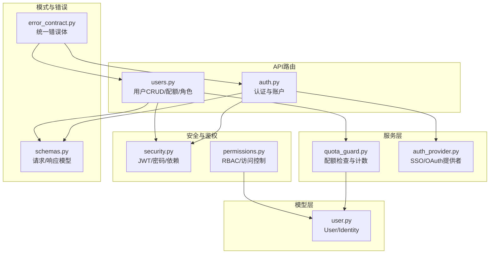
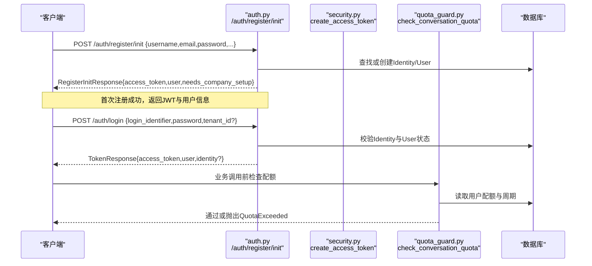
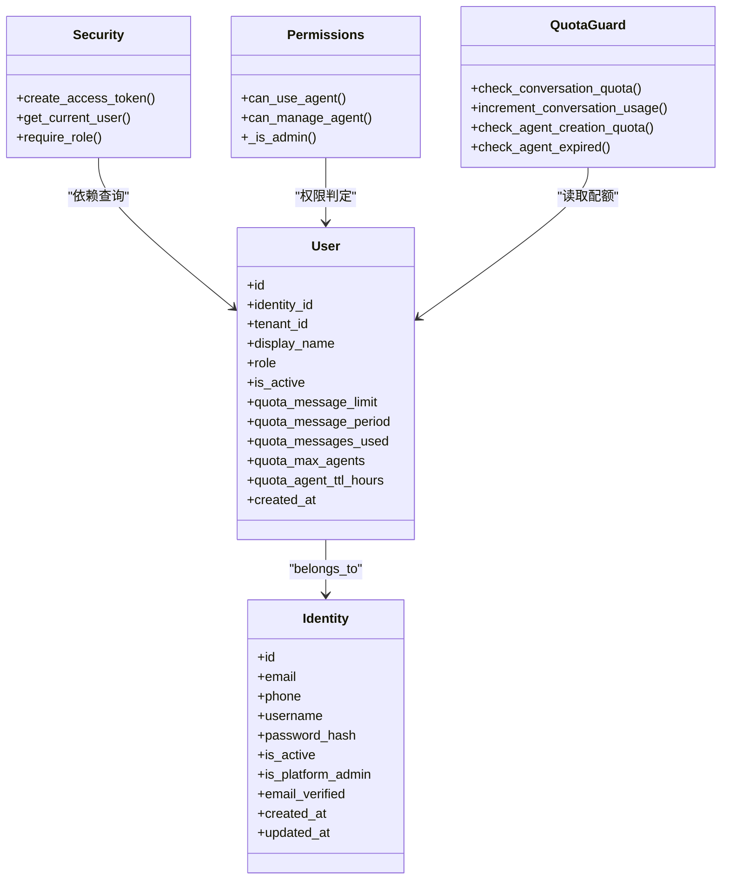

# 用户管理API

<cite>
**本文引用的文件**   
- [backend/app/api/users.py](file://backend/app/api/users.py)
- [backend/app/api/auth.py](file://backend/app/api/auth.py)
- [backend/app/core/permissions.py](file://backend/app/core/permissions.py)
- [backend/app/core/security.py](file://backend/app/core/security.py)
- [backend/app/models/user.py](file://backend/app/models/user.py)
- [backend/app/services/quota_guard.py](file://backend/app/services/quota_guard.py)
- [backend/app/schemas/schemas.py](file://backend/app/schemas/schemas.py)
- [backend/app/core/error_contract.py](file://backend/app/core/error_contract.py)
</cite>

## 目录
1. [简介](#简介)
2. [项目结构](#项目结构)
3. [核心组件](#核心组件)
4. [架构总览](#架构总览)
5. [详细组件分析](#详细组件分析)
6. [依赖关系分析](#依赖关系分析)
7. [性能考虑](#性能考虑)
8. [故障排查指南](#故障排查指南)
9. [结论](#结论)
10. [附录：接口清单与示例](#附录接口清单与示例)

## 简介
本文件为Clawith平台的用户管理API文档，覆盖以下能力：
- 用户注册、登录、邮箱验证、密码重置、个人信息更新、多租户切换
- 用户配额管理（消息限额、Agent数量限制、TTL）
- 角色权限控制（RBAC：platform_admin、org_admin、member）
- 统一错误响应规范与可观测性（trace_id）

## 项目结构
用户管理相关代码主要分布在以下模块：
- API路由层：auth.py（认证与账户）、users.py（用户CRUD与配额/角色）
- 模型层：user.py（User、Identity等数据模型）
- 服务层：quota_guard.py（配额校验与计数）、auth_provider.py（SSO/OAuth提供者）
- 安全与鉴权：security.py（JWT、密码哈希、依赖注入）、permissions.py（RBAC与访问控制）
- 请求/响应模式：schemas.py（Pydantic模型）
- 错误处理：error_contract.py（统一错误体与trace_id）

图表来源
- [backend/app/api/auth.py:1-1227](file://backend/app/api/auth.py#L1-L1227)
- [backend/app/api/users.py:1-227](file://backend/app/api/users.py#L1-L227)
- [backend/app/services/quota_guard.py:1-266](file://backend/app/services/quota_guard.py#L1-L266)
- [backend/app/core/security.py:1-227](file://backend/app/core/security.py#L1-L227)
- [backend/app/core/permissions.py:1-554](file://backend/app/core/permissions.py#L1-L554)
- [backend/app/models/user.py:1-119](file://backend/app/models/user.py#L1-L119)
- [backend/app/schemas/schemas.py:1-608](file://backend/app/schemas/schemas.py#L1-L608)
- [backend/app/core/error_contract.py:1-229](file://backend/app/core/error_contract.py#L1-L229)

章节来源
- [backend/app/api/auth.py:1-1227](file://backend/app/api/auth.py#L1-L1227)
- [backend/app/api/users.py:1-227](file://backend/app/api/users.py#L1-L227)
- [backend/app/core/security.py:1-227](file://backend/app/core/security.py#L1-L227)
- [backend/app/core/permissions.py:1-554](file://backend/app/core/permissions.py#L1-L554)
- [backend/app/models/user.py:1-119](file://backend/app/models/user.py#L1-L119)
- [backend/app/services/quota_guard.py:1-266](file://backend/app/services/quota_guard.py#L1-L266)
- [backend/app/schemas/schemas.py:1-608](file://backend/app/schemas/schemas.py#L1-L608)
- [backend/app/core/error_contract.py:1-229](file://backend/app/core/error_contract.py#L1-L229)

## 核心组件
- 认证与账户
  - 注册初始化、SSO注册、登录、邮箱验证、密码重置、修改密码、获取当前用户、更新当前用户、多租户列表与切换
- 用户管理
  - 列出用户（按租户）、更新用户配额、更新用户角色（含“唯一管理员保护”）
- 配额系统
  - 会话消息配额（周期重置、管理员豁免）、Agent创建上限、Agent TTL过期策略、Agent LLM调用配额
- RBAC权限
  - platform_admin、org_admin、member；基于角色的访问控制与组织边界隔离

章节来源
- [backend/app/api/auth.py:1-1227](file://backend/app/api/auth.py#L1-L1227)
- [backend/app/api/users.py:1-227](file://backend/app/api/users.py#L1-L227)
- [backend/app/services/quota_guard.py:1-266](file://backend/app/services/quota_guard.py#L1-L266)
- [backend/app/core/permissions.py:1-554](file://backend/app/core/permissions.py#L1-L554)

## 架构总览
下图展示一次典型的用户注册流程（邮箱+密码），以及后续登录与配额检查的交互。

图表来源
- [backend/app/api/auth.py:138-254](file://backend/app/api/auth.py#L138-L254)
- [backend/app/api/auth.py:422-543](file://backend/app/api/auth.py#L422-L543)
- [backend/app/core/security.py:128-151](file://backend/app/core/security.py#L128-L151)
- [backend/app/services/quota_guard.py:30-60](file://backend/app/services/quota_guard.py#L30-L60)

## 详细组件分析

### 认证与账户API（/auth）
- 注册配置
  - GET /auth/registration-config：返回是否需要邀请码
- 重复性检查
  - GET /auth/check-duplicate：检查email/username是否已存在
- 注册
  - POST /auth/register：兼容旧版（内部转发到新流程）
  - POST /auth/register/init：步骤1，创建Identity与User，返回JWT与用户信息
  - POST /auth/register/sso：SSO注册，支持外部提供商
- 登录
  - POST /auth/login：支持多租户选择，返回TokenResponse或MultiTenantResponse
- 邮箱验证
  - POST /auth/verify-email：使用验证码激活账号并返回TokenResponse
  - POST /auth/resend-verification：重发验证邮件
- 密码管理
  - POST /auth/forgot-password：发送重置链接
  - POST /auth/reset-password：使用一次性token重置密码
  - PUT /auth/me/password：修改当前用户密码
- 当前用户
  - GET /auth/me：获取当前用户信息
  - PATCH /auth/me：更新当前用户资料
- 多租户
  - GET /auth/my-tenants：获取当前身份关联的组织
  - POST /auth/switch-tenant：切换组织并返回新token与可选redirect_url
- SSO/OAuth
  - GET /auth/providers：列出可用身份提供商
  - GET /auth/{provider}/authorize：生成授权URL
  - POST /auth/{provider}/callback：两步式回调（code或pending_token+tenant_id）
  - POST /auth/{provider}/bind：绑定第三方身份到当前用户
  - POST /auth/{provider}/unbind：解绑第三方身份

章节来源
- [backend/app/api/auth.py:46-1227](file://backend/app/api/auth.py#L46-L1227)
- [backend/app/schemas/schemas.py:11-130](file://backend/app/schemas/schemas.py#L11-L130)

### 用户管理API（/users）
- 列出用户
  - GET /users：仅平台管理员或组织管理员可访问，按租户过滤，附带非过期Agent计数
- 更新用户配额
  - PATCH /users/{user_id}/quota：仅管理员可操作，支持设置消息限额、周期、最大Agent数、Agent TTL小时
- 更新用户角色
  - PATCH /users/{user_id}/role：仅管理员可操作，支持platform_admin/org_admin/member；包含“唯一管理员保护”逻辑

章节来源
- [backend/app/api/users.py:49-227](file://backend/app/api/users.py#L49-L227)

### 配额系统（quota_guard）
- 会话消息配额
  - check_conversation_quota：检查剩余配额，周期到期自动重置计数器
  - increment_conversation_usage：每次会话后递增计数
- Agent创建配额
  - check_agent_creation_quota：统计非过期Agent数量，超过上限则拒绝
- Agent过期策略
  - check_agent_expired：若到达expires_at或标记过期，则停止并返回不可用提示
- Agent LLM调用配额
  - check_agent_llm_quota/increment_agent_llm_usage：按日重置与计数

章节来源
- [backend/app/services/quota_guard.py:30-207](file://backend/app/services/quota_guard.py#L30-L207)

### RBAC权限模型（permissions）
- 角色层级
  - member < agent_admin < org_admin < platform_admin
- 访问控制要点
  - 同租户隔离：跨租户访问直接拒绝
  - 创建者优先：Agent creator拥有manage权限
  - 公司级可见：company模式下全组织可见；custom需显式授权
  - 管理员特权：org_admin/platform_admin在non-private下具备更强管理能力
- 常用判断
  - can_use_agent/can_manage_agent：动态权限判定
  - get_agent_access_level_for_user_id：返回use/manage/None

章节来源
- [backend/app/core/permissions.py:1-554](file://backend/app/core/permissions.py#L1-L554)
- [backend/app/core/security.py:208-227](file://backend/app/core/security.py#L208-L227)

### 数据模型（User/Identity）
- Identity：全局身份（email/phone/username、密码哈希、是否平台管理员、邮箱验证状态）
- User：租户内成员（display_name、avatar_url、title、role、is_active、配额字段、created_at/updated_at）
- 关联：User.identity双向关系，便于懒加载与代理字段

章节来源
- [backend/app/models/user.py:16-119](file://backend/app/models/user.py#L16-L119)

## 依赖关系分析

图表来源
- [backend/app/models/user.py:16-119](file://backend/app/models/user.py#L16-L119)
- [backend/app/core/security.py:128-227](file://backend/app/core/security.py#L128-L227)
- [backend/app/core/permissions.py:1-554](file://backend/app/core/permissions.py#L1-L554)
- [backend/app/services/quota_guard.py:1-266](file://backend/app/services/quota_guard.py#L1-L266)

## 性能考虑
- JWT与密码哈希采用线程池避免阻塞事件循环
- 注册/登录流程将CPU密集型操作（哈希）移出事务，减少锁竞争
- 配额检查与计数在独立会话中执行，避免长事务
- 多租户OAuth回调缓存使用Redis，降低数据库压力

[本节为通用指导，不直接分析具体文件]

## 故障排查指南
- 统一错误响应
  - 所有HTTP异常均被统一处理器包装为标准错误体，包含code、message、trace_id等
  - 请求校验失败返回422，包含details数组
- 常见错误
  - 401：无效或过期token、用户不存在或未激活
  - 403：无权限（跨租户、非管理员、组织外操作）
  - 404：资源不存在
  - 409：冲突（邮箱/用户名重复）
  - 500：内部错误（统一错误体）
- 追踪ID
  - 所有错误响应包含X-Trace-Id头，便于日志定位

章节来源
- [backend/app/core/error_contract.py:158-229](file://backend/app/core/error_contract.py#L158-L229)

## 结论
本API体系围绕“身份-租户-配额-权限”四大维度构建，提供完善的用户生命周期管理与企业级权限控制。通过统一的错误规范与可观测性设计，便于前后端协作与问题定位。建议在生产环境启用严格的配额策略与审计日志，并结合多租户隔离保障数据安全。

[本节为总结，不直接分析具体文件]

## 附录：接口清单与示例

### 认证与账户（/auth）
- GET /auth/registration-config
  - 描述：获取注册配置（是否需要邀请码）
  - 响应：{"invitation_code_required": boolean}
- GET /auth/check-duplicate
  - 描述：检查email/username是否已存在
  - 参数：email?, username?
  - 响应：{"email_exists": bool, "username_exists": bool, "has_conflict": bool, "conflicts": []}
- POST /auth/register/init
  - 描述：步骤1注册，创建Identity与User，返回JWT与用户信息
  - 请求体：RegisterInitRequest
  - 响应：RegisterInitResponse
- POST /auth/register/sso
  - 描述：SSO注册
  - 请求体：SSORegisterRequest
  - 响应：TokenResponse
- POST /auth/login
  - 描述：登录，支持多租户选择
  - 请求体：UserLogin
  - 响应：TokenResponse 或 MultiTenantResponse
- POST /auth/verify-email
  - 描述：邮箱验证并激活账号
  - 请求体：VerifyEmailRequest
  - 响应：TokenResponse
- POST /auth/resend-verification
  - 描述：重发验证邮件
  - 请求体：ResendVerificationRequest
  - 响应：{"ok": true, "message": "..."}
- POST /auth/forgot-password
  - 描述：发送密码重置链接
  - 请求体：ForgotPasswordRequest
  - 响应：{"ok": true, "message": "..."}
- POST /auth/reset-password
  - 描述：使用一次性token重置密码
  - 请求体：ResetPasswordRequest
  - 响应：{"ok": true}
- PUT /auth/me/password
  - 描述：修改当前用户密码
  - 请求体：{"old_password": string, "new_password": string}
  - 响应：{"ok": true}
- GET /auth/me
  - 描述：获取当前用户信息
  - 响应：UserOut
- PATCH /auth/me
  - 描述：更新当前用户资料
  - 请求体：UserUpdate
  - 响应：UserOut
- GET /auth/my-tenants
  - 描述：获取当前身份关联的组织列表
  - 响应：list[TenantChoice]
- POST /auth/switch-tenant
  - 描述：切换组织并返回新token与可选redirect_url
  - 请求体：TenantSwitchRequest
  - 响应：TenantSwitchResponse
- GET /auth/providers
  - 描述：列出可用身份提供商
  - 参数：tenant_id?
  - 响应：list[{id, provider_type, name, is_active}]
- GET /auth/{provider}/authorize
  - 描述：生成授权URL
  - 参数：redirect_uri, state
  - 响应：OAuthAuthorizeResponse
- POST /auth/{provider}/callback
  - 描述：OAuth回调（两步式）
  - 请求体：OAuthCallbackRequest
  - 响应：TokenResponse 或 MultiTenantResponse
- POST /auth/{provider}/bind
  - 描述：绑定第三方身份到当前用户
  - 请求体：IdentityBindRequest
  - 响应：UserOut
- POST /auth/{provider}/unbind
  - 描述：解绑第三方身份
  - 请求体：IdentityUnbindRequest
  - 响应：UserOut

章节来源
- [backend/app/api/auth.py:46-1227](file://backend/app/api/auth.py#L46-L1227)
- [backend/app/schemas/schemas.py:11-130](file://backend/app/schemas/schemas.py#L11-L130)

### 用户管理（/users）
- GET /users
  - 描述：列出指定租户下的用户（仅管理员）
  - 参数：tenant_id?（平台管理员可查任意租户，组织管理员仅限自身租户）
  - 响应：list[UserOut]（包含agents_count）
- PATCH /users/{user_id}/quota
  - 描述：更新用户配额（管理员）
  - 请求体：UserQuotaUpdate
  - 响应：UserOut
- PATCH /users/{user_id}/role
  - 描述：更新用户角色（管理员）
  - 请求体：RoleUpdate
  - 响应：{"status": "ok", "user_id": string, "role": string}

章节来源
- [backend/app/api/users.py:49-227](file://backend/app/api/users.py#L49-L227)

### 配额与权限关键点
- 会话消息配额
  - 周期：permanent/daily/weekly/monthly；period_start用于重置
  - 管理员豁免：platform_admin/org_admin不受限
- Agent创建配额
  - 统计非过期Agent数量，达到quota_max_agents时拒绝
- Agent TTL
  - expires_at到达后标记过期并停止服务
- Agent LLM配额
  - 每日重置，达到max_llm_calls_per_day时拒绝

章节来源
- [backend/app/services/quota_guard.py:30-207](file://backend/app/services/quota_guard.py#L30-L207)
- [backend/app/models/user.py:91-98](file://backend/app/models/user.py#L91-L98)

### 错误处理与响应规范
- 统一错误体结构
  - detail：原始错误详情
  - error.code：标准化错误码
  - error.message：人类可读消息
  - error.trace_id：请求追踪ID
  - 可选：run_id、agent_id、stage、details、retryable
- 常见错误码
  - validation_error：请求校验失败
  - internal_error：内部错误
  - http_*：HTTP异常映射

章节来源
- [backend/app/core/error_contract.py:57-111](file://backend/app/core/error_contract.py#L57-L111)
- [backend/app/core/error_contract.py:158-229](file://backend/app/core/error_contract.py#L158-L229)