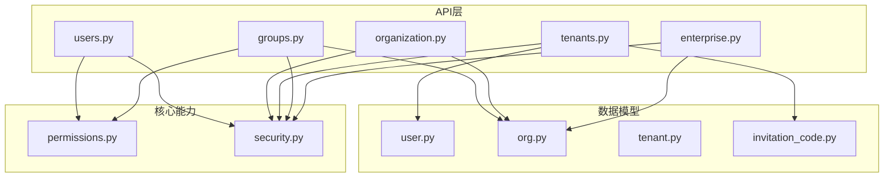
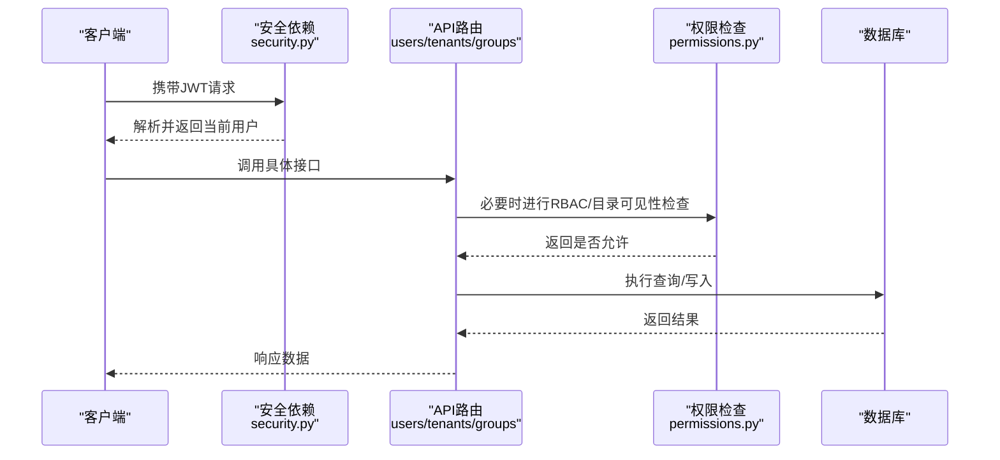
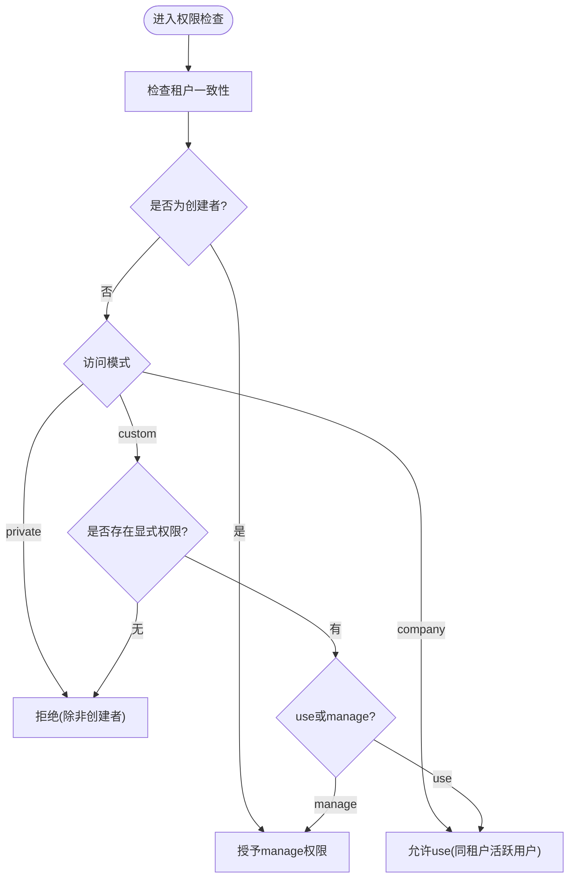
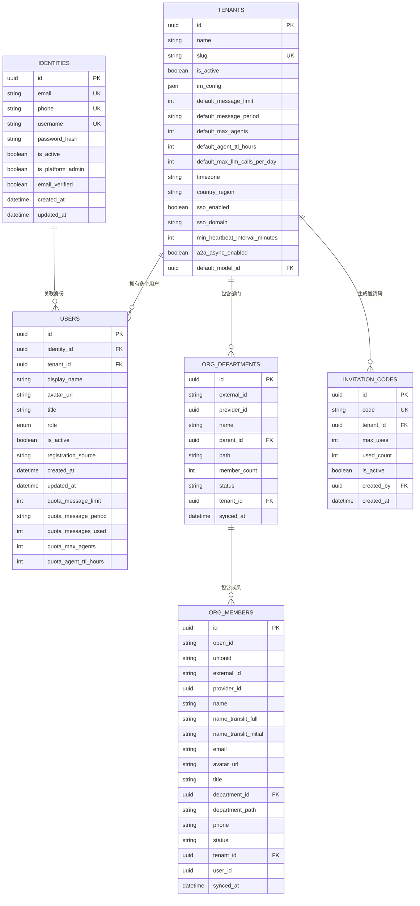
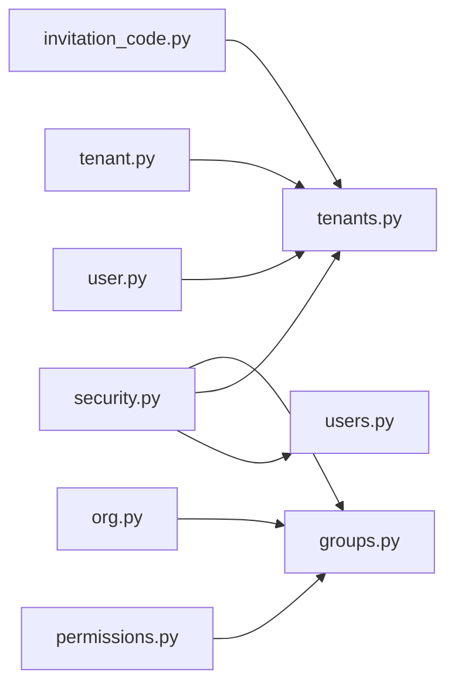

# 用户组织API

<cite>
**本文引用的文件**   
- [users.py](file://backend/app/api/users.py)
- [organization.py](file://backend/app/api/organization.py)
- [tenants.py](file://backend/app/api/tenants.py)
- [groups.py](file://backend/app/api/groups.py)
- [permissions.py](file://backend/app/core/permissions.py)
- [security.py](file://backend/app/core/security.py)
- [user.py](file://backend/app/models/user.py)
- [org.py](file://backend/app/models/org.py)
- [tenant.py](file://backend/app/models/tenant.py)
- [invitation_code.py](file://backend/app/models/invitation_code.py)
- [enterprise.py](file://backend/app/api/enterprise.py)
</cite>

## 目录
1. [简介](#简介)
2. [项目结构](#项目结构)
3. [核心组件](#核心组件)
4. [架构总览](#架构总览)
5. [详细组件分析](#详细组件分析)
6. [依赖关系分析](#依赖关系分析)
7. [性能考虑](#性能考虑)
8. [故障排查指南](#故障排查指南)
9. [结论](#结论)
10. [附录](#附录)

## 简介
本文件为 Clawith 平台的“用户与组织管理”RESTful API 文档，覆盖以下能力：
- 用户管理：用户列表、配额更新、角色变更
- 组织架构：部门与成员（同步自企业目录）、成员邀请与加入
- 租户隔离：多租户创建、加入、配置与资源隔离
- 群组协作：群组、会话、消息、成员邀请等
- RBAC 权限模型：平台管理员、组织管理员、普通成员及细粒度访问控制
- 企业级功能：部门层级、职位信息、权限继承与可见性策略

所有接口均基于 FastAPI 实现，采用 JWT 鉴权与 SQLAlchemy 异步 ORM。数据按租户隔离，支持 SSO 与企业目录同步。

## 项目结构
后端以模块化路由组织，关键模块如下：
- 用户与组织：users.py、organization.py
- 租户与邀请码：tenants.py、invitation_code.py
- 群组协作：groups.py
- 权限与安全：permissions.py、security.py
- 企业设置与审计：enterprise.py
- 数据模型：user.py、org.py、tenant.py

图表来源
- [users.py:1-227](file://backend/app/api/users.py#L1-L227)
- [organization.py:1-106](file://backend/app/api/organization.py#L1-L106)
- [tenants.py:1-821](file://backend/app/api/tenants.py#L1-L821)
- [groups.py:1-800](file://backend/app/api/groups.py#L1-L800)
- [permissions.py:1-554](file://backend/app/core/permissions.py#L1-L554)
- [security.py:1-227](file://backend/app/core/security.py#L1-L227)
- [user.py:1-119](file://backend/app/models/user.py#L1-L119)
- [org.py:1-98](file://backend/app/models/org.py#L1-L98)
- [tenant.py:1-73](file://backend/app/models/tenant.py#L1-L73)
- [invitation_code.py:1-26](file://backend/app/models/invitation_code.py#L1-L26)

章节来源
- [users.py:1-227](file://backend/app/api/users.py#L1-L227)
- [organization.py:1-106](file://backend/app/api/organization.py#L1-L106)
- [tenants.py:1-821](file://backend/app/api/tenants.py#L1-L821)
- [groups.py:1-800](file://backend/app/api/groups.py#L1-L800)
- [permissions.py:1-554](file://backend/app/core/permissions.py#L1-L554)
- [security.py:1-227](file://backend/app/core/security.py#L1-L227)
- [user.py:1-119](file://backend/app/models/user.py#L1-L119)
- [org.py:1-98](file://backend/app/models/org.py#L1-L98)
- [tenant.py:1-73](file://backend/app/models/tenant.py#L1-L73)
- [invitation_code.py:1-26](file://backend/app/models/invitation_code.py#L1-L26)

## 核心组件
- 鉴权与角色
  - JWT 令牌签发与校验、当前用户解析、管理员校验、角色白名单依赖
  - 角色层次：member < agent_admin < org_admin < platform_admin
- 用户与身份
  - Identity（全局唯一身份）与 User（租户内成员）分离，支持邮箱、手机号、用户名唯一性约束
- 租户与隔离
  - Tenant 作为隔离边界，包含默认配额、时区、SSO 域名、A2A 开关等
- 组织与部门
  - OrgDepartment/OrgMember 记录部门树与成员信息，支持路径与状态
- 群组协作
  - Group/Session/Message 的 CRUD 与成员邀请、读状态、工作区文件等
- 权限模型
  - 基于 Agent 的访问模式（company/private/custom）与 AgentPermission 细粒度授权
  - 目录可见性评估（RosterVisibility），支持人与数字员工的可见性与可联系性判断

章节来源
- [security.py:1-227](file://backend/app/core/security.py#L1-L227)
- [user.py:1-119](file://backend/app/models/user.py#L1-L119)
- [tenant.py:1-73](file://backend/app/models/tenant.py#L1-L73)
- [org.py:1-98](file://backend/app/models/org.py#L1-L98)
- [permissions.py:1-554](file://backend/app/core/permissions.py#L1-L554)

## 架构总览
下图展示认证、鉴权与业务路由的交互流程，以及多租户隔离点。

图表来源
- [security.py:153-227](file://backend/app/core/security.py#L153-L227)
- [permissions.py:45-130](file://backend/app/core/permissions.py#L45-L130)
- [users.py:49-101](file://backend/app/api/users.py#L49-L101)
- [tenants.py:152-237](file://backend/app/api/tenants.py#L152-L237)
- [groups.py:510-556](file://backend/app/api/groups.py#L510-L556)

## 详细组件分析

### 用户管理 API（/users）
- 列出用户
  - 方法/路径：GET /users
  - 鉴权：需平台管理员或组织管理员；平台管理员可查看任意租户，组织管理员仅查看自身租户
  - 行为：按租户过滤用户，附带非过期代理计数
- 更新用户配额
  - 方法/路径：PATCH /users/{user_id}/quota
  - 鉴权：平台管理员或组织管理员；跨租户禁止修改
  - 字段校验：周期值限定为 permanent/daily/weekly/monthly
- 更新用户角色
  - 方法/路径：PATCH /users/{user_id}/role
  - 鉴权：平台管理员或组织管理员；平台管理员可赋任何合法角色，组织管理员不可赋平台管理员
  - 保护：防止将唯一的管理员降级导致公司无管理员

章节来源
- [users.py:49-101](file://backend/app/api/users.py#L49-L101)
- [users.py:103-157](file://backend/app/api/users.py#L103-L157)
- [users.py:159-227](file://backend/app/api/users.py#L159-L227)

### 组织用户管理 API（/org）
- 列出用户
  - 方法/路径：GET /org/users
  - 鉴权：当前登录用户；可按 tenant_id 过滤（平台管理员或组织管理员）
- 管理员更新用户资料
  - 方法/路径：PATCH /org/users/{user_id}
  - 鉴权：管理员
  - 校验：邮箱与手机号在租户内唯一；变更后同步至组织成员

章节来源
- [organization.py:21-43](file://backend/app/api/organization.py#L21-L43)
- [organization.py:45-106](file://backend/app/api/organization.py#L45-L106)

### 租户与邀请码 API（/tenants）
- 自助创建公司
  - 方法/路径：POST /tenants/self-create
  - 鉴权：已认证用户；受系统设置控制是否允许自助创建
  - 行为：若用户已有租户则创建新 User 记录并返回切换令牌；否则直接分配租户并赋予组织管理员
- 通过邀请码加入公司
  - 方法/路径：POST /tenants/join
  - 鉴权：已认证用户
  - 行为：校验邀请码有效性、使用次数、租户锁定；为空公司首次加入者自动成为组织管理员；支持多租户切换并返回新令牌
- 注册配置
  - 方法/路径：GET /tenants/registration-config
  - 公开：返回是否允许自助创建公司
- 按域名解析租户
  - 方法/路径：GET /tenants/resolve-by-domain
  - 公开：根据 sso_domain 或子域 slug 解析租户
- 获取当前租户
  - 方法/路径：GET /tenants/me
  - 鉴权：已认证用户
- 获取租户详情
  - 方法/路径：GET /tenants/{tenant_id}
  - 鉴权：平台管理员或组织管理员（后者仅限自身租户）
- 更新租户设置
  - 方法/路径：PUT /tenants/{tenant_id}
  - 鉴权：平台管理员或组织管理员；平台管理员不可覆盖 SSO 配置
- 上传/删除租户Logo
  - 方法/路径：POST/DELETE /tenants/{tenant_id}/logo
  - 鉴权：平台管理员或组织管理员；限制图片格式与大小，要求正方形
- 分配用户到租户
  - 方法/路径：PUT /tenants/{tenant_id}/assign-user/{user_id}
  - 鉴权：平台管理员；角色限定为 org_admin/agent_admin/member
- 删除公司
  - 方法/路径：DELETE /tenants/{tenant_id}
  - 鉴权：公司组织管理员或平台管理员
  - 行为：按外键顺序级联删除各表数据，返回 fallback_tenant_id

章节来源
- [tenants.py:152-237](file://backend/app/api/tenants.py#L152-L237)
- [tenants.py:253-373](file://backend/app/api/tenants.py#L253-L373)
- [tenants.py:378-388](file://backend/app/api/tenants.py#L378-L388)
- [tenants.py:392-457](file://backend/app/api/tenants.py#L392-L457)
- [tenants.py:460-486](file://backend/app/api/tenants.py#L460-L486)
- [tenants.py:528-579](file://backend/app/api/tenants.py#L528-L579)
- [tenants.py:581-654](file://backend/app/api/tenants.py#L581-L654)
- [tenants.py:656-683](file://backend/app/api/tenants.py#L656-L683)
- [tenants.py:687-821](file://backend/app/api/tenants.py#L687-L821)
- [invitation_code.py:13-26](file://backend/app/models/invitation_code.py#L13-L26)

### 群组协作 API（/api/groups）
- 创建群组
  - 方法/路径：POST /api/groups
  - 鉴权：已认证用户；需要租户上下文
- 列出我的群组
  - 方法/路径：GET /api/groups
- 获取候选成员（创建前）
  - 方法/路径：GET /api/groups/member-candidates?participant_type=user|agent
- 获取/更新/删除群组
  - 方法/路径：GET/PATCH/DELETE /api/groups/{group_id}
- 成员管理
  - 方法/路径：GET /api/groups/{group_id}/members
  - 方法/路径：GET /api/groups/{group_id}/member-candidates
  - 方法/路径：POST /api/groups/{group_id}/members（邀请成员）
  - 方法/路径：DELETE /api/groups/{group_id}/members/{member_id}（移除成员）
- 会话与消息
  - 方法/路径：GET /api/groups/{group_id}/sessions（列出会话）
  - 其他：消息发送、标记已读、工作区文件读写等由服务层封装

错误映射：领域异常被统一转换为 HTTP 状态码（404/403/409/503等）。

章节来源
- [groups.py:510-556](file://backend/app/api/groups.py#L510-L556)
- [groups.py:559-582](file://backend/app/api/groups.py#L559-L582)
- [groups.py:584-635](file://backend/app/api/groups.py#L584-L635)
- [groups.py:637-662](file://backend/app/api/groups.py#L637-L662)
- [groups.py:664-780](file://backend/app/api/groups.py#L664-L780)
- [groups.py:782-800](file://backend/app/api/groups.py#L782-L800)

### 企业设置与审计（/enterprise）
- LLM 模型管理
  - 列表/新增/更新/删除/设为默认/测试连通性与工具调用能力
- 企业信息
  - 列表/更新企业信息，触发向运行中代理推送
- 审批流
  - 列表/解决审批请求
- 审计日志
  - 列表审计日志（按租户与代理过滤）
- 统计
  - 企业仪表盘统计（代理、用户、待审批数）
- 租户配额
  - 读取/更新租户默认配额与心跳下限

章节来源
- [enterprise.py:364-485](file://backend/app/api/enterprise.py#L364-L485)
- [enterprise.py:582-606](file://backend/app/api/enterprise.py#L582-L606)
- [enterprise.py:610-666](file://backend/app/api/enterprise.py#L610-L666)
- [enterprise.py:670-689](file://backend/app/api/enterprise.py#L670-L689)
- [enterprise.py:693-735](file://backend/app/api/enterprise.py#L693-L735)
- [enterprise.py:754-800](file://backend/app/api/enterprise.py#L754-L800)

### 权限模型与RBAC
- 角色体系
  - member、agent_admin、org_admin、platform_admin
- 访问控制
  - 静态规则：同租户、非私有、创建者拥有管理权
  - 动态规则：AgentPermission 支持 company/department/user 范围与 use/manage 级别
  - 目录可见性：evaluate_roster_* 函数决定数字员工与人成员的可见性与可联系性
- 典型场景
  - 用户能否使用某代理：can_use_agent/can_manage_agent
  - 代理间关系状态：evaluate_agent_relationship_status
  - 代理与人关系状态：evaluate_human_relationship_status

图表来源
- [permissions.py:44-93](file://backend/app/core/permissions.py#L44-L93)
- [permissions.py:95-130](file://backend/app/core/permissions.py#L95-L130)
- [permissions.py:149-211](file://backend/app/core/permissions.py#L149-L211)
- [permissions.py:262-338](file://backend/app/core/permissions.py#L262-L338)
- [permissions.py:352-478](file://backend/app/core/permissions.py#L352-L478)

章节来源
- [permissions.py:1-554](file://backend/app/core/permissions.py#L1-L554)
- [security.py:208-227](file://backend/app/core/security.py#L208-L227)

### 数据模型概览

图表来源
- [tenant.py:13-73](file://backend/app/models/tenant.py#L13-L73)
- [user.py:16-119](file://backend/app/models/user.py#L16-L119)
- [org.py:13-98](file://backend/app/models/org.py#L13-L98)
- [invitation_code.py:13-26](file://backend/app/models/invitation_code.py#L13-L26)

## 依赖关系分析
- 路由依赖
  - users.py、organization.py、tenants.py、groups.py、enterprise.py 均依赖 security.py 的鉴权依赖
  - groups.py 依赖 permissions.py 的目录可见性与访问控制逻辑
- 模型依赖
  - User 关联 Identity（全局身份）与 Tenant（租户）
  - OrgDepartment/OrgMember 通过 tenant_id 隔离，支持部门树与路径
  - InvitationCode 绑定租户，用于邀请与加入流程
- 权限依赖
  - AgentPermission 与 Agent 访问模式共同决定细粒度授权
  - Roster 可见性函数支撑目录查询与协作选择

图表来源
- [security.py:153-227](file://backend/app/core/security.py#L153-L227)
- [permissions.py:44-130](file://backend/app/core/permissions.py#L44-L130)
- [user.py:52-119](file://backend/app/models/user.py#L52-L119)
- [org.py:13-98](file://backend/app/models/org.py#L13-L98)
- [tenant.py:13-73](file://backend/app/models/tenant.py#L13-L73)
- [invitation_code.py:13-26](file://backend/app/models/invitation_code.py#L13-L26)

章节来源
- [security.py:153-227](file://backend/app/core/security.py#L153-L227)
- [permissions.py:44-130](file://backend/app/core/permissions.py#L44-L130)
- [user.py:52-119](file://backend/app/models/user.py#L52-L119)
- [org.py:13-98](file://backend/app/models/org.py#L13-L98)
- [tenant.py:13-73](file://backend/app/models/tenant.py#L13-L73)
- [invitation_code.py:13-26](file://backend/app/models/invitation_code.py#L13-L26)

## 性能考虑
- 批量加载与预加载：使用 selectinload 减少 N+1 查询（如用户列表加载 identity）
- 聚合查询：租户 Token 用量统计使用 SQL 聚合函数避免多次往返
- 并发与阻塞：bcrypt 操作使用线程池避免阻塞事件循环
- 存储与缓存：Logo 等静态资源通过对象存储后端，带版本参数防缓存污染
- 事务边界：删除公司按外键顺序执行原生 SQL 以避免约束冲突

[本节为通用指导，不直接分析具体文件]

## 故障排查指南
- 常见错误码
  - 401：令牌无效或过期、用户不存在或未激活
  - 403：角色不足、跨租户访问、组织管理员越权
  - 404：租户/用户/群组/会话等资源不存在
  - 409：邮箱/手机号重复、成员已存在、幂等冲突
  - 503：运行时不可用（如群聊规划阶段未启用）
- 定位建议
  - 检查 JWT 载荷中的 sub 与 role 是否正确
  - 确认当前用户的 tenant_id 与目标资源一致
  - 查看领域异常映射（groups 的错误代码集合）
  - 审计日志与审批记录辅助回溯

章节来源
- [security.py:141-204](file://backend/app/core/security.py#L141-L204)
- [groups.py:229-347](file://backend/app/api/groups.py#L229-L347)
- [enterprise.py:670-689](file://backend/app/api/enterprise.py#L670-L689)

## 结论
Clawith 的用户与组织管理 API 以清晰的 RBAC 与多租户隔离为核心，提供从用户、租户、组织到群组协作的完整能力。通过权限模型与目录可见性机制，既满足企业级管控需求，又保持扩展性与易用性。建议在集成时严格遵循租户隔离与角色校验，并结合审计与审批流程保障合规。

[本节为总结，不直接分析具体文件]

## 附录
- 常用角色说明
  - member：普通成员
  - agent_admin：代理管理员
  - org_admin：组织管理员（公司级）
  - platform_admin：平台管理员（全局）
- 关键流程示例
  - 自助创建公司：POST /tenants/self-create → 返回租户与可选切换令牌
  - 邀请码加入：POST /tenants/join → 校验邀请码 → 分配角色 → 返回租户与可选切换令牌
  - 群组邀请成员：POST /api/groups/{group_id}/members → 校验权限 → 添加成员

[本节为补充说明，不直接分析具体文件]