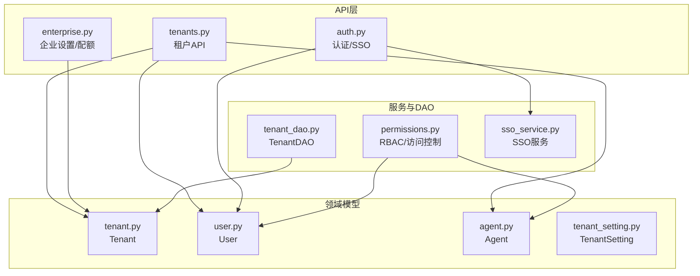
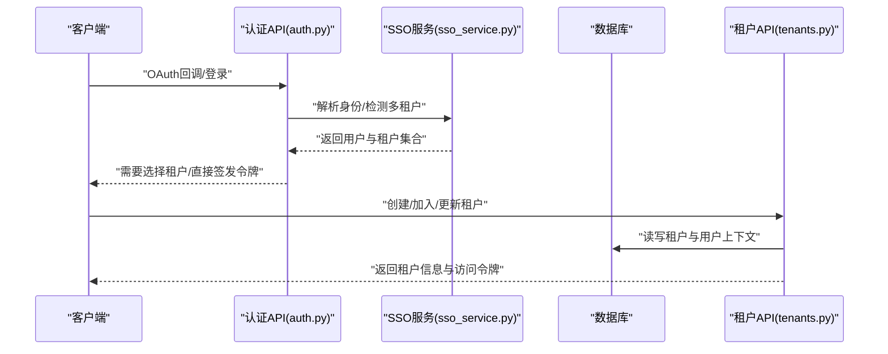
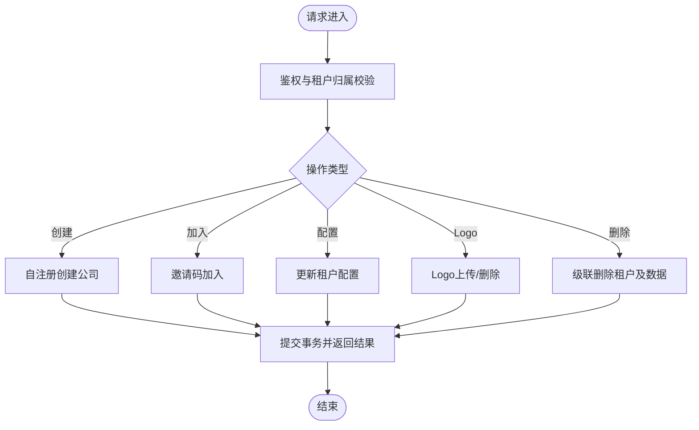
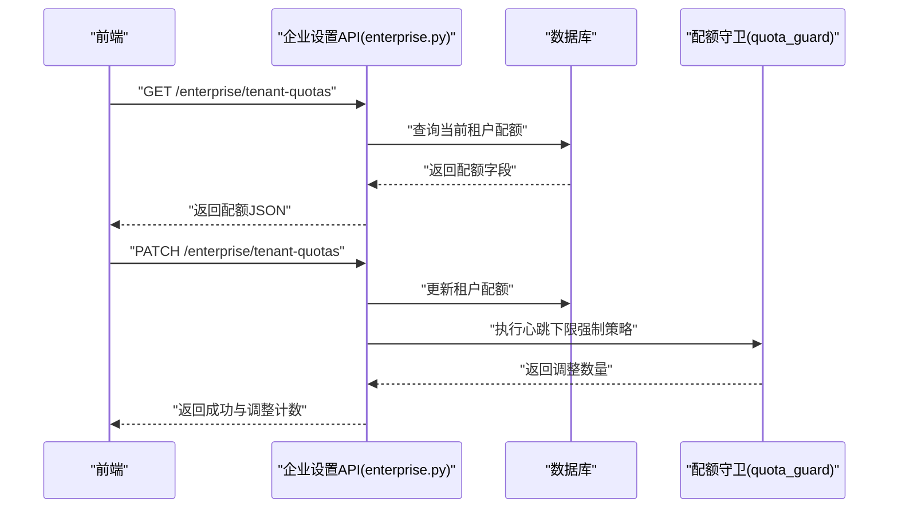
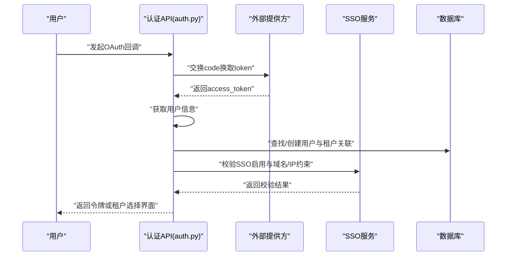
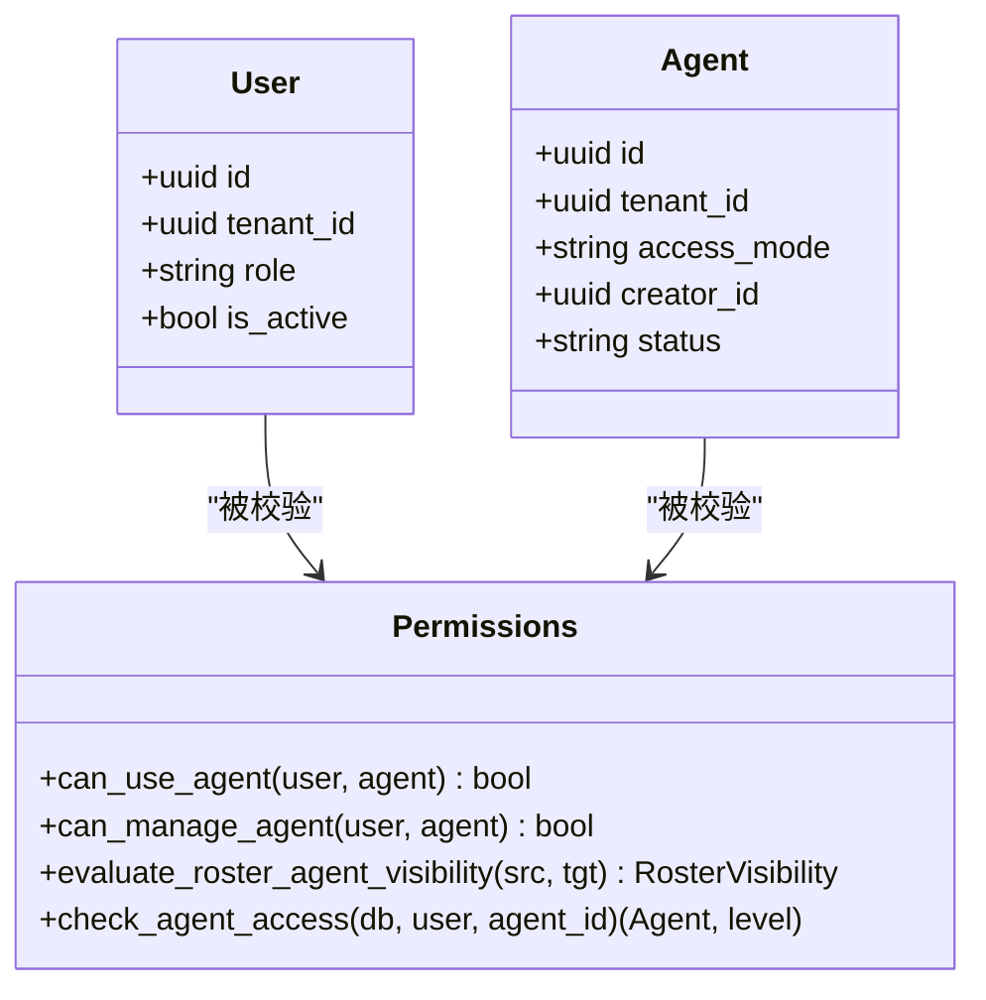
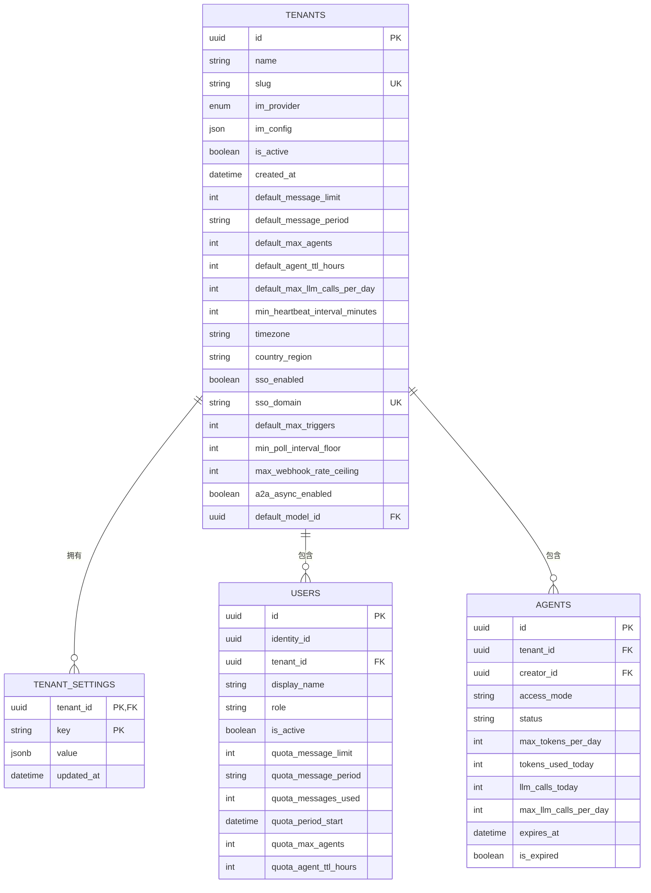
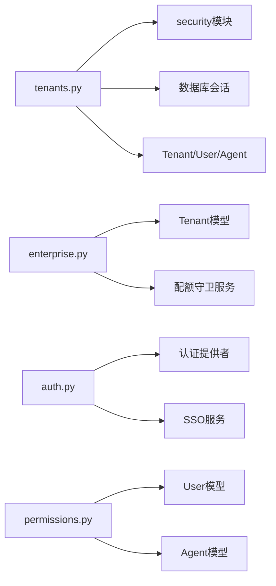

# 租户管理API

<cite>
**本文引用的文件**   
- [backend/app/api/tenants.py](file://backend/app/api/tenants.py)
- [backend/app/models/tenant.py](file://backend/app/models/tenant.py)
- [backend/app/dao/tenant_dao.py](file://backend/app/dao/tenant_dao.py)
- [backend/app/models/tenant_setting.py](file://backend/app/models/tenant_setting.py)
- [backend/app/core/permissions.py](file://backend/app/core/permissions.py)
- [backend/app/api/enterprise.py](file://backend/app/api/enterprise.py)
- [backend/app/models/user.py](file://backend/app/models/user.py)
- [backend/app/models/agent.py](file://backend/app/models/agent.py)
- [backend/app/services/sso_service.py](file://backend/app/services/sso_service.py)
- [backend/app/api/auth.py](file://backend/app/api/auth.py)
</cite>

## 目录
1. [简介](#简介)
2. [项目结构](#项目结构)
3. [核心组件](#核心组件)
4. [架构总览](#架构总览)
5. [详细组件分析](#详细组件分析)
6. [依赖关系分析](#依赖关系分析)
7. [性能考虑](#性能考虑)
8. [故障排查指南](#故障排查指南)
9. [结论](#结论)
10. [附录](#附录)

## 简介
本文件为Clawith平台的多租户管理功能提供完整的API文档，覆盖租户隔离、数据分区、资源配置、权限控制、资源配额与计费策略等企业级能力。重点说明：
- 租户的创建、加入、配置与生命周期管理接口
- 多租户环境下的权限控制与数据隔离保证
- 资源配额（消息、Agent数量、LLM调用等）与心跳频率下限等限制
- SSO与企业集成相关能力
- 最佳实践与常见问题排查

## 项目结构
后端采用FastAPI路由+模型+DAO的服务分层组织方式，多租户边界由Tenant模型贯穿，用户User通过tenant_id绑定到具体租户，Agent等资源均携带tenant_id实现数据隔离。

**图表来源** 
- [backend/app/api/tenants.py](file://backend/app/api/tenants.py)
- [backend/app/api/enterprise.py](file://backend/app/api/enterprise.py)
- [backend/app/api/auth.py](file://backend/app/api/auth.py)
- [backend/app/models/tenant.py](file://backend/app/models/tenant.py)
- [backend/app/models/user.py](file://backend/app/models/user.py)
- [backend/app/models/agent.py](file://backend/app/models/agent.py)
- [backend/app/dao/tenant_dao.py](file://backend/app/dao/tenant_dao.py)
- [backend/app/core/permissions.py](file://backend/app/core/permissions.py)
- [backend/app/services/sso_service.py](file://backend/app/services/sso_service.py)

**章节来源**
- [backend/app/api/tenants.py:1-800](file://backend/app/api/tenants.py#L1-L800)
- [backend/app/models/tenant.py:1-73](file://backend/app/models/tenant.py#L1-L73)
- [backend/app/dao/tenant_dao.py:1-44](file://backend/app/dao/tenant_dao.py#L1-L44)
- [backend/app/models/tenant_setting.py:1-31](file://backend/app/models/tenant_setting.py#L1-L31)
- [backend/app/core/permissions.py:1-554](file://backend/app/core/permissions.py#L1-L554)
- [backend/app/api/enterprise.py:737-936](file://backend/app/api/enterprise.py#L737-L936)
- [backend/app/models/user.py:1-119](file://backend/app/models/user.py#L1-L119)
- [backend/app/models/agent.py:1-200](file://backend/app/models/agent.py#L1-L200)
- [backend/app/services/sso_service.py:452-540](file://backend/app/services/sso_service.py#L452-L540)
- [backend/app/api/auth.py:952-1080](file://backend/app/api/auth.py#L952-L1080)

## 核心组件
- 租户模型与设置
  - Tenant：租户主实体，包含名称、slug、IM提供商、默认配额、时区、地区、SSO开关与域名、A2A异步开关、默认LLM模型等。
  - TenantSetting：租户级键值配置，用于存储如GitHub Token、ClawHub Key等敏感或可选配置。
- 用户与角色
  - User：租户内成员，含role（platform_admin/org_admin/agent_admin/member）、配额字段（消息限额、Agent上限、TTL等）。
- Agent与权限
  - Agent：数字员工，具备access_mode（company/private/custom），支持按公司/自定义范围授权；与User存在creator关系。
  - permissions模块：统一实现跨租户的访问控制与可见性判定。
- DAO与SSO
  - TenantDAO：按slug、ID列表、SSO域名查询租户。
  - SSO服务：校验IP模式、自动分配子域、启用/禁用SSO等。

**章节来源**
- [backend/app/models/tenant.py:1-73](file://backend/app/models/tenant.py#L1-L73)
- [backend/app/models/tenant_setting.py:1-31](file://backend/app/models/tenant_setting.py#L1-L31)
- [backend/app/models/user.py:1-119](file://backend/app/models/user.py#L1-L119)
- [backend/app/models/agent.py:1-200](file://backend/app/models/agent.py#L1-L200)
- [backend/app/dao/tenant_dao.py:1-44](file://backend/app/dao/tenant_dao.py#L1-L44)
- [backend/app/core/permissions.py:1-554](file://backend/app/core/permissions.py#L1-L554)
- [backend/app/services/sso_service.py:452-540](file://backend/app/services/sso_service.py#L452-L540)

## 架构总览
多租户架构以“租户”为隔离边界，所有业务数据（用户、Agent、会话、任务、工具等）均通过tenant_id进行过滤与隔离。认证流程支持多租户选择与切换，SSO可基于域名/IP策略自动识别租户。

**图表来源** 
- [backend/app/api/auth.py:952-1080](file://backend/app/api/auth.py#L952-L1080)
- [backend/app/services/sso_service.py:452-540](file://backend/app/services/sso_service.py#L452-L540)
- [backend/app/api/tenants.py:1-800](file://backend/app/api/tenants.py#L1-L800)

## 详细组件分析

### 租户API（创建、加入、配置、Logo、删除）
- 自注册创建公司：支持无租户注册与已有租户切换两种路径，首次创建者成为org_admin。
- 邀请码加入：校验邀请码有效性、使用次数、目标租户一致性；空公司首个加入者为org_admin。
- 注册配置：读取系统设置是否允许自创建公司。
- 域名解析：根据SSO域名或子域名slug解析租户，支持协议前缀与端口处理。
- 列出/获取当前租户：平台管理员可列全部；普通用户仅能查看自身租户。
- 获取租户Token用量：聚合统计今日/本月/累计tokens与缓存命中情况。
- 获取/更新租户信息：平台管理员可更新任意租户；org_admin仅能更新自身租户，且不可通过此接口修改SSO开关与域名。
- Logo上传/删除：限制图片类型与大小、要求正方形PNG，存储于对象存储并回写im_config中的logo_url。
- 分配用户到租户：平台管理员可将用户分配到指定租户并设定角色。
- 删除租户：严格FK顺序级联删除，确保数据完整性；返回fallback_tenant_id供前端切换。

**图表来源** 
- [backend/app/api/tenants.py:152-237](file://backend/app/api/tenants.py#L152-L237)
- [backend/app/api/tenants.py:253-373](file://backend/app/api/tenants.py#L253-L373)
- [backend/app/api/tenants.py:378-387](file://backend/app/api/tenants.py#L378-L387)
- [backend/app/api/tenants.py:392-456](file://backend/app/api/tenants.py#L392-L456)
- [backend/app/api/tenants.py:460-546](file://backend/app/api/tenants.py#L460-L546)
- [backend/app/api/tenants.py:549-578](file://backend/app/api/tenants.py#L549-L578)
- [backend/app/api/tenants.py:581-653](file://backend/app/api/tenants.py#L581-L653)
- [backend/app/api/tenants.py:656-682](file://backend/app/api/tenants.py#L656-L682)
- [backend/app/api/tenants.py:687-800](file://backend/app/api/tenants.py#L687-L800)

**章节来源**
- [backend/app/api/tenants.py:1-800](file://backend/app/api/tenants.py#L1-L800)

### 租户配额与企业设置
- 获取租户配额：返回消息限额、周期、最大Agent数、Agent TTL、每日LLM调用上限、心跳下限、触发器上限、轮询下限、Webhook上限等。
- 更新租户配额：仅管理员可用；当调整心跳下限时，会对现有Agent强制执行下限策略并返回调整数量。

**图表来源** 
- [backend/app/api/enterprise.py:754-826](file://backend/app/api/enterprise.py#L754-L826)

**章节来源**
- [backend/app/api/enterprise.py:737-936](file://backend/app/api/enterprise.py#L737-L936)

### 多租户认证与SSO
- OAuth回调：支持多租户选择，若用户属于多个租户则返回租户列表；否则直接签发令牌。
- SSO服务：校验IP模式下其他租户已占用SSO域名的冲突；在首次启用SSO时自动分配子域；维护租户SSO开关与域名。

**图表来源** 
- [backend/app/api/auth.py:952-1080](file://backend/app/api/auth.py#L952-L1080)
- [backend/app/services/sso_service.py:503-540](file://backend/app/services/sso_service.py#L503-L540)

**章节来源**
- [backend/app/api/auth.py:952-1080](file://backend/app/api/auth.py#L952-L1080)
- [backend/app/services/sso_service.py:452-540](file://backend/app/services/sso_service.py#L452-L540)

### 权限控制与数据隔离
- 访问控制原则：
  - 所有用户必须与Agent处于同一租户才能访问。
  - 创建者拥有manage权限；公司管理员在非private模式下可管理；custom模式需显式授权。
  - 目录可见性遵循公司/私有/自定义规则，结合状态与过期判断。
- 关键函数：
  - can_use_agent/can_manage_agent：判断用户能否使用/管理Agent。
  - evaluate_roster_*：评估Agent与人成员的可见性与可联系性。
  - check_agent_access：统一检查对特定Agent的访问级别。

**图表来源** 
- [backend/app/core/permissions.py:44-129](file://backend/app/core/permissions.py#L44-L129)
- [backend/app/core/permissions.py:149-211](file://backend/app/core/permissions.py#L149-L211)
- [backend/app/core/permissions.py:481-518](file://backend/app/core/permissions.py#L481-L518)
- [backend/app/models/user.py:52-119](file://backend/app/models/user.py#L52-L119)
- [backend/app/models/agent.py:19-146](file://backend/app/models/agent.py#L19-L146)

**章节来源**
- [backend/app/core/permissions.py:1-554](file://backend/app/core/permissions.py#L1-L554)
- [backend/app/models/user.py:1-119](file://backend/app/models/user.py#L1-L119)
- [backend/app/models/agent.py:1-200](file://backend/app/models/agent.py#L1-L200)

### 数据模型与隔离边界
- Tenant：租户主表，包含默认配额、时区、地区、SSO开关与域名、A2A异步开关、默认LLM模型等。
- TenantSetting：租户级键值配置，用于存储敏感或可选配置（如GitHub Token、ClawHub Key）。
- User：租户内成员，绑定tenant_id与role，继承租户默认配额。
- Agent：数字员工，携带tenant_id与access_mode，支持公司/私有/自定义访问模式。

**图表来源** 
- [backend/app/models/tenant.py:13-73](file://backend/app/models/tenant.py#L13-L73)
- [backend/app/models/tenant_setting.py:13-31](file://backend/app/models/tenant_setting.py#L13-L31)
- [backend/app/models/user.py:52-119](file://backend/app/models/user.py#L52-L119)
- [backend/app/models/agent.py:19-146](file://backend/app/models/agent.py#L19-L146)

**章节来源**
- [backend/app/models/tenant.py:1-73](file://backend/app/models/tenant.py#L1-L73)
- [backend/app/models/tenant_setting.py:1-31](file://backend/app/models/tenant_setting.py#L1-L31)
- [backend/app/models/user.py:1-119](file://backend/app/models/user.py#L1-L119)
- [backend/app/models/agent.py:1-200](file://backend/app/models/agent.py#L1-L200)

## 依赖关系分析
- API层依赖：
  - tenants.py依赖安全模块、数据库会话、模型与存储服务。
  - enterprise.py依赖租户模型与配额守卫服务。
  - auth.py依赖认证提供者与SSO服务。
- 模型层依赖：
  - User与Agent均依赖Tenant作为租户边界。
  - TenantSetting独立于租户主表，提供扩展配置。
- 服务层依赖：
  - permissions模块依赖User与Agent模型，实现跨租户访问控制。
  - sso_service依赖平台服务与租户模型，处理SSO启用与域名分配。

**图表来源** 
- [backend/app/api/tenants.py:1-800](file://backend/app/api/tenants.py#L1-L800)
- [backend/app/api/enterprise.py:737-936](file://backend/app/api/enterprise.py#L737-L936)
- [backend/app/api/auth.py:952-1080](file://backend/app/api/auth.py#L952-L1080)
- [backend/app/core/permissions.py:1-554](file://backend/app/core/permissions.py#L1-L554)
- [backend/app/services/sso_service.py:452-540](file://backend/app/services/sso_service.py#L452-L540)

**章节来源**
- [backend/app/api/tenants.py:1-800](file://backend/app/api/tenants.py#L1-L800)
- [backend/app/api/enterprise.py:737-936](file://backend/app/api/enterprise.py#L737-L936)
- [backend/app/api/auth.py:952-1080](file://backend/app/api/auth.py#L952-L1080)
- [backend/app/core/permissions.py:1-554](file://backend/app/core/permissions.py#L1-L554)
- [backend/app/services/sso_service.py:452-540](file://backend/app/services/sso_service.py#L452-L540)

## 性能考虑
- 数据库索引：
  - Tenant.slug与Tenant.sso_domain建立唯一索引，提升域名解析与slug查询效率。
  - Agent与ChatSessions等表对tenant_id建立索引，加速租户级数据过滤。
- 查询优化：
  - 使用聚合函数统计Token用量，避免多次往返。
  - 删除租户时按FK顺序批量删除，减少锁竞争与外键冲突。
- 存储与IO：
  - Logo上传限制大小与格式，服务端压缩后存储，降低带宽与存储压力。
- 并发与限流：
  - 心跳下限与触发器限制防止高频调用，保护系统稳定性。

[本节为通用指导，不直接分析具体文件]

## 故障排查指南
- 常见错误与定位：
  - 邀请码无效或已达使用上限：检查InvitationCode记录与used_count。
  - 租户未找到或禁用：确认Tenant.is_active与是否存在。
  - 权限不足：检查用户role与tenant_id匹配，以及Agent.access_mode与权限记录。
  - Logo上传失败：验证图片类型、大小与正方形要求。
  - 删除租户失败：检查外键约束与删除顺序。
- 建议步骤：
  - 使用日志追踪trace_id，定位请求链路。
  - 检查数据库记录一致性，必要时回滚事务。
  - 对于SSO问题，核对域名/IP约束与租户SSO开关。

**章节来源**
- [backend/app/api/tenants.py:253-373](file://backend/app/api/tenants.py#L253-L373)
- [backend/app/api/tenants.py:581-653](file://backend/app/api/tenants.py#L581-L653)
- [backend/app/api/tenants.py:687-800](file://backend/app/api/tenants.py#L687-L800)
- [backend/app/core/permissions.py:481-518](file://backend/app/core/permissions.py#L481-L518)

## 结论
Clawith的多租户管理以Tenant为核心隔离边界，通过严格的权限控制、配额管理与SSO集成，实现了企业级的数据安全与灵活配置。API设计清晰，覆盖租户全生命周期管理，并提供完善的错误处理与性能优化建议。建议在生产环境中严格遵循权限与配额策略，定期审计租户配置与访问记录，确保系统稳定与安全。

[本节为总结性内容，不直接分析具体文件]

## 附录
- 最佳实践：
  - 为新租户设置合理的默认配额与心跳下限，避免资源滥用。
  - 启用SSO并配置域名/IP约束，提升安全性与用户体验。
  - 定期清理无用Logo与配置，保持存储整洁。
  - 使用邀请码机制控制租户加入，避免未授权访问。
- 参考文件：
  - 租户模型与设置：[backend/app/models/tenant.py](file://backend/app/models/tenant.py), [backend/app/models/tenant_setting.py](file://backend/app/models/tenant_setting.py)
  - 用户与Agent模型：[backend/app/models/user.py](file://backend/app/models/user.py), [backend/app/models/agent.py](file://backend/app/models/agent.py)
  - 权限控制：[backend/app/core/permissions.py](file://backend/app/core/permissions.py)
  - 企业设置与配额：[backend/app/api/enterprise.py](file://backend/app/api/enterprise.py)
  - 认证与SSO：[backend/app/api/auth.py](file://backend/app/api/auth.py), [backend/app/services/sso_service.py](file://backend/app/services/sso_service.py)
  - 租户DAO：[backend/app/dao/tenant_dao.py](file://backend/app/dao/tenant_dao.py)

[本节为补充信息，不直接分析具体文件]