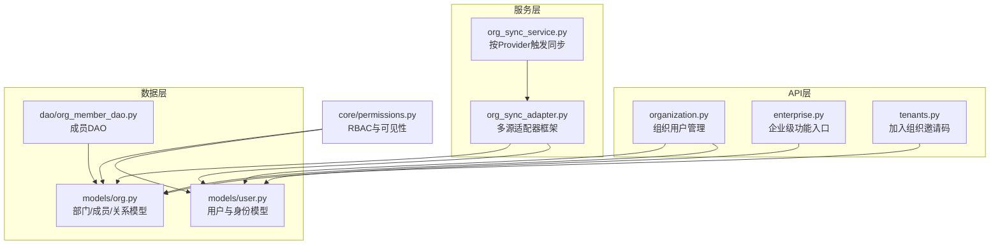
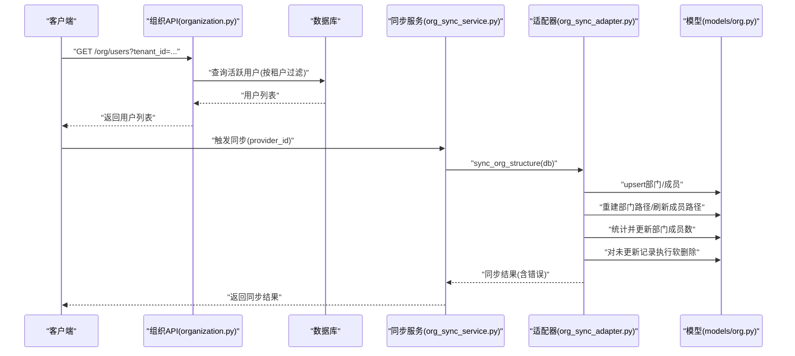
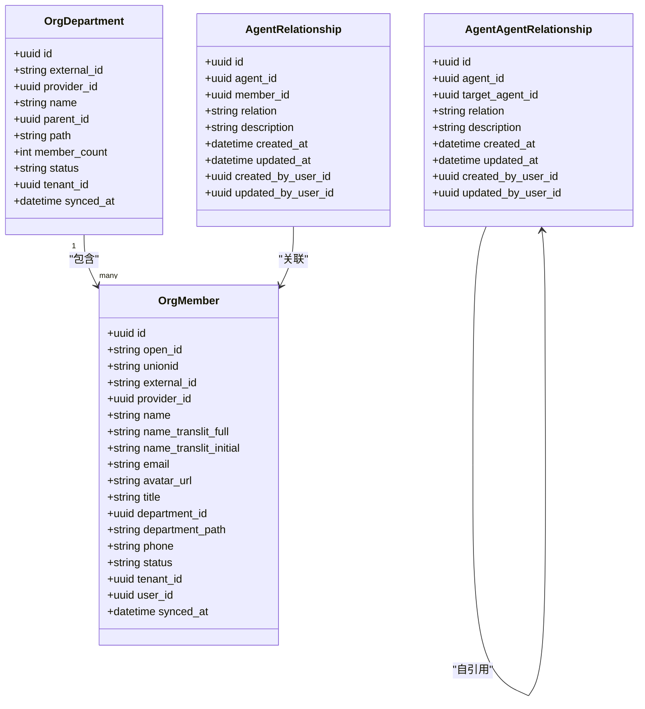
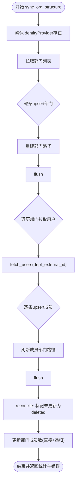
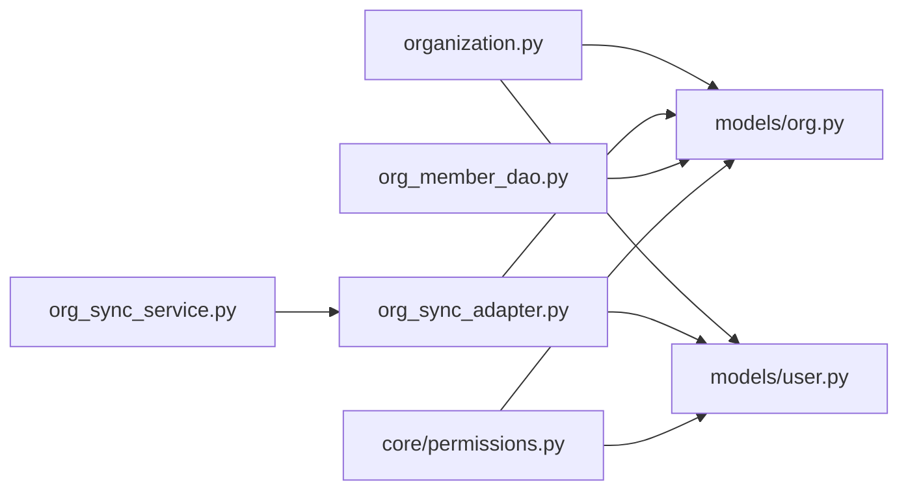

# 组织管理API

<cite>
**本文引用的文件**   
- [backend/app/api/organization.py](file://backend/app/api/organization.py)
- [backend/app/models/org.py](file://backend/app/models/org.py)
- [backend/app/dao/org_member_dao.py](file://backend/app/dao/org_member_dao.py)
- [backend/app/services/org_sync_service.py](file://backend/app/services/org_sync_service.py)
- [backend/app/services/org_sync_adapter.py](file://backend/app/services/org_sync_adapter.py)
- [backend/app/core/permissions.py](file://backend/app/core/permissions.py)
- [backend/app/models/user.py](file://backend/app/models/user.py)
- [backend/app/api/enterprise.py](file://backend/app/api/enterprise.py)
- [backend/app/api/tenants.py](file://backend/app/api/tenants.py)
</cite>

## 目录
1. [简介](#简介)
2. [项目结构](#项目结构)
3. [核心组件](#核心组件)
4. [架构总览](#架构总览)
5. [详细组件分析](#详细组件分析)
6. [依赖关系分析](#依赖关系分析)
7. [性能考虑](#性能考虑)
8. [故障排查指南](#故障排查指南)
9. [结论](#结论)
10. [附录](#附录)

## 简介
本文件为Clawith平台的“组织管理”能力提供完整的API与实现说明，覆盖组织架构（部门树）、成员管理、邀请入组、职位信息、同步机制、权限与访问控制等。重点包括：
- 组织级资源隔离（租户维度）
- 多身份源（飞书、钉钉、企业微信等）的组织结构同步
- 成员与平台用户的关联策略
- 基于角色的访问控制与可见性规则
- 部门路径计算与成员计数聚合

## 项目结构
后端围绕FastAPI路由、数据模型、DAO与同步服务分层组织：
- API层：暴露REST接口（如组织用户列表、管理员更新用户资料）
- 模型层：定义组织部门、成员及关系表结构
- DAO层：封装OrgMember的查询方法
- 同步服务：按身份源拉取并落库组织结构与成员
- 权限模块：统一RBAC与可见性判定

图表来源
- [backend/app/api/organization.py:1-106](file://backend/app/api/organization.py#L1-L106)
- [backend/app/services/org_sync_service.py:1-49](file://backend/app/services/org_sync_service.py#L1-L49)
- [backend/app/services/org_sync_adapter.py:1-800](file://backend/app/services/org_sync_adapter.py#L1-L800)
- [backend/app/models/org.py:1-98](file://backend/app/models/org.py#L1-L98)
- [backend/app/dao/org_member_dao.py:1-121](file://backend/app/dao/org_member_dao.py#L1-L121)
- [backend/app/models/user.py:1-119](file://backend/app/models/user.py#L1-L119)
- [backend/app/core/permissions.py:1-554](file://backend/app/core/permissions.py#L1-L554)

章节来源
- [backend/app/api/organization.py:1-106](file://backend/app/api/organization.py#L1-L106)
- [backend/app/models/org.py:1-98](file://backend/app/models/org.py#L1-L98)
- [backend/app/dao/org_member_dao.py:1-121](file://backend/app/dao/org_member_dao.py#L1-L121)
- [backend/app/services/org_sync_service.py:1-49](file://backend/app/services/org_sync_service.py#L1-L49)
- [backend/app/services/org_sync_adapter.py:1-800](file://backend/app/services/org_sync_adapter.py#L1-L800)
- [backend/app/models/user.py:1-119](file://backend/app/models/user.py#L1-L119)
- [backend/app/core/permissions.py:1-554](file://backend/app/core/permissions.py#L1-L554)

## 核心组件
- 组织用户管理API：列出当前租户下的活跃用户，支持按租户过滤；管理员可更新用户资料并同步邮箱/手机号到组织成员。
- 组织模型：部门树（含父级、路径、成员数）、成员（含外部ID、邮箱、手机、职位、部门路径、状态）、Agent与成员关系。
- 成员DAO：按邮箱/手机查找未绑定用户的成员记录，以及按用户+租户+身份源查询成员。
- 同步服务：根据IdentityProvider类型选择适配器，完成部门与成员的增量同步、路径重建、成员计数聚合与软删除对齐。
- 权限与可见性：基于租户、角色与Agent/成员关系的RBAC判断，决定谁能使用或管理资源。

章节来源
- [backend/app/api/organization.py:1-106](file://backend/app/api/organization.py#L1-L106)
- [backend/app/models/org.py:1-98](file://backend/app/models/org.py#L1-L98)
- [backend/app/dao/org_member_dao.py:1-121](file://backend/app/dao/org_member_dao.py#L1-L121)
- [backend/app/services/org_sync_service.py:1-49](file://backend/app/services/org_sync_service.py#L1-L49)
- [backend/app/services/org_sync_adapter.py:1-800](file://backend/app/services/org_sync_adapter.py#L1-L800)
- [backend/app/core/permissions.py:1-554](file://backend/app/core/permissions.py#L1-L554)

## 架构总览
组织管理的关键流程包括：
- 用户管理与资料变更：通过组织API进行用户查询与更新，必要时联动组织成员信息。
- 组织同步：由同步服务驱动适配器从外部身份源拉取部门与成员，构建部门路径，更新成员计数，并对未更新的记录做软删除标记。
- 权限控制：所有操作均受租户隔离与角色限制，部分接口需管理员权限。

图表来源
- [backend/app/api/organization.py:1-106](file://backend/app/api/organization.py#L1-L106)
- [backend/app/services/org_sync_service.py:1-49](file://backend/app/services/org_sync_service.py#L1-L49)
- [backend/app/services/org_sync_adapter.py:1-800](file://backend/app/services/org_sync_adapter.py#L1-L800)
- [backend/app/models/org.py:1-98](file://backend/app/models/org.py#L1-L98)

## 详细组件分析

### 组织用户管理API
- GET /org/users
  - 功能：列出活跃用户，可按租户过滤；平台管理员或组织管理员可切换目标租户。
  - 权限：普通用户仅能查看自身租户；管理员可指定其他租户。
  - 响应：用户列表（包含身份信息）。
- PATCH /org/users/{user_id}
  - 功能：管理员更新用户资料；若修改邮箱或手机号，会同步至对应的组织成员记录。
  - 校验：同一租户内邮箱/手机号唯一性校验。
  - 副作用：调用注册服务同步邮箱/手机号到组织成员。

章节来源
- [backend/app/api/organization.py:21-42](file://backend/app/api/organization.py#L21-L42)
- [backend/app/api/organization.py:45-106](file://backend/app/api/organization.py#L45-L106)

### 组织模型与数据结构
- 部门(OrgDepartment)
  - 字段：外部ID、提供者ID、名称、父ID、路径、成员数、状态、租户ID、同步时间
  - 关系：一对多成员
- 成员(OrgMember)
  - 字段：open_id/unionid/external_id、姓名（含拼音转写）、邮箱、头像、职位、部门ID、部门路径、手机、状态、租户ID、关联平台用户ID、同步时间
  - 关系：属于一个部门
- Agent与成员关系(AgentRelationship)
  - 字段：agent_id、member_id、关系类型、描述、创建/更新时间、操作人
- Agent间关系(AgentAgentRelationship)
  - 字段：agent_id、target_agent_id、关系类型、描述、创建/更新时间、操作人

图表来源
- [backend/app/models/org.py:13-62](file://backend/app/models/org.py#L13-L62)
- [backend/app/models/org.py:64-98](file://backend/app/models/org.py#L64-L98)

章节来源
- [backend/app/models/org.py:1-98](file://backend/app/models/org.py#L1-98)

### 成员DAO
- 按邮箱/手机查找未绑定用户的成员（支持按租户与身份源过滤）
- 按用户+租户+身份源查询成员记录
- 用于在注册/登录流程中匹配组织成员与平台用户

章节来源
- [backend/app/dao/org_member_dao.py:17-121](file://backend/app/dao/org_member_dao.py#L17-L121)

### 组织同步服务与适配器
- 同步服务
  - 根据provider_id解析身份源配置，构造对应适配器并执行同步
  - 捕获异常并返回结构化结果
- 适配器基类
  - 抽象接口：获取令牌、拉取部门、拉取部门下用户、主同步流程
  - 主流程：
    - upsert部门，重建部门路径
    - 遍历部门拉取用户，upsert成员并尝试关联平台用户（邮箱/手机）
    - 刷新成员部门路径
    - 软删除未更新记录（reconcile）
    - 统计并更新部门成员数（直接计数与递归汇总）
  - 特殊校验：某些提供商要求unionid且不能等于external_id
- 飞书适配器示例
  - 提供飞书Token获取、部门与用户拉取的具体实现

图表来源
- [backend/app/services/org_sync_adapter.py:232-329](file://backend/app/services/org_sync_adapter.py#L232-L329)
- [backend/app/services/org_sync_adapter.py:331-416](file://backend/app/services/org_sync_adapter.py#L331-L416)
- [backend/app/services/org_sync_adapter.py:507-538](file://backend/app/services/org_sync_adapter.py#L507-L538)
- [backend/app/services/org_sync_adapter.py:539-680](file://backend/app/services/org_sync_adapter.py#L539-L680)

章节来源
- [backend/app/services/org_sync_service.py:11-48](file://backend/app/services/org_sync_service.py#L11-L48)
- [backend/app/services/org_sync_adapter.py:174-329](file://backend/app/services/org_sync_adapter.py#L174-L329)
- [backend/app/services/org_sync_adapter.py:331-416](file://backend/app/services/org_sync_adapter.py#L331-L416)
- [backend/app/services/org_sync_adapter.py:507-680](file://backend/app/services/org_sync_adapter.py#L507-L680)
- [backend/app/services/org_sync_adapter.py:769-800](file://backend/app/services/org_sync_adapter.py#L769-L800)

### 权限与访问控制
- RBAC基础
  - 角色：platform_admin、org_admin、agent_admin、member
  - 租户隔离：所有查询与写入均需匹配User.tenant_id
- Agent可见性与使用权限
  - access_mode：company/private/custom
  - can_use_agent/can_manage_agent：依据角色、创建者、显式授权决定
- 人员可见性
  - evaluate_roster_human_visibility：按source_agent的access_mode与member状态判定可见与可联系性
- 关系有效性评估
  - evaluate_human_relationship_status：检查成员状态、租户一致性、平台用户Agent访问级别

章节来源
- [backend/app/core/permissions.py:1-554](file://backend/app/core/permissions.py#L1-L554)

### 加入组织（邀请码）
- POST /enterprise/join（位于tenants.py）
  - 功能：使用邀请码加入已有公司；支持注册流程与切换组织流程
  - 校验：邀请码有效性、是否达到使用上限、可选的目标租户锁定
  - 行为：为新用户分配租户或创建新的User记录

章节来源
- [backend/app/api/tenants.py:253-281](file://backend/app/api/tenants.py#L253-L281)

## 依赖关系分析
- API层依赖模型与DAO：组织用户列表与更新依赖User/Identity与OrgMember
- 同步服务依赖适配器：按Provider类型动态选择具体实现
- 适配器依赖模型与用户模型：upsert部门/成员、关联平台用户、生成拼音转写
- 权限模块依赖模型：基于User、OrgMember、AgentPermission等进行判定

图表来源
- [backend/app/api/organization.py:1-106](file://backend/app/api/organization.py#L1-L106)
- [backend/app/services/org_sync_service.py:1-49](file://backend/app/services/org_sync_service.py#L1-L49)
- [backend/app/services/org_sync_adapter.py:1-800](file://backend/app/services/org_sync_adapter.py#L1-L800)
- [backend/app/models/org.py:1-98](file://backend/app/models/org.py#L1-L98)
- [backend/app/models/user.py:1-119](file://backend/app/models/user.py#L1-L119)
- [backend/app/dao/org_member_dao.py:1-121](file://backend/app/dao/org_member_dao.py#L1-L121)
- [backend/app/core/permissions.py:1-554](file://backend/app/core/permissions.py#L1-L554)

章节来源
- [backend/app/api/organization.py:1-106](file://backend/app/api/organization.py#L1-L106)
- [backend/app/services/org_sync_service.py:1-49](file://backend/app/services/org_sync_service.py#L1-L49)
- [backend/app/services/org_sync_adapter.py:1-800](file://backend/app/services/org_sync_adapter.py#L1-L800)
- [backend/app/models/org.py:1-98](file://backend/app/models/org.py#L1-L98)
- [backend/app/models/user.py:1-119](file://backend/app/models/user.py#L1-L119)
- [backend/app/dao/org_member_dao.py:1-121](file://backend/app/dao/org_member_dao.py#L1-L121)
- [backend/app/core/permissions.py:1-554](file://backend/app/core/permissions.py#L1-L554)

## 性能考虑
- 批量与事务
  - 同步过程采用嵌套事务与分批flush，降低长事务风险
  - 部门成员计数更新采用SQL子查询与批量UPDATE，避免N+1问题
- 索引与查询
  - 部门external_id、成员external_id/open_id/unionid/tenant_id均有索引，提升匹配效率
  - 路径重建与成员路径推导采用批查询与缓存映射，减少重复IO
- 并发与健壮性
  - 同步过程中单条失败不影响整体，错误收集后返回
  - 对部分失败的同步跳过reconcile，保证数据一致性

[本节为通用指导，不直接分析具体文件]

## 故障排查指南
- 同步失败
  - 检查IdentityProvider配置与租户绑定
  - 查看同步结果中的errors数组定位具体部门/成员错误
  - 确认unionid约束（某些提供商要求unionid且不得等于external_id）
- 成员未关联平台用户
  - 检查邮箱/手机号是否与平台用户一致
  - 使用DAO方法按邮箱/手机查找未绑定成员，确认是否存在壳记录
- 权限不足
  - 确认当前用户角色与租户匹配
  - 对于Agent相关操作，检查access_mode与显式授权

章节来源
- [backend/app/services/org_sync_adapter.py:232-329](file://backend/app/services/org_sync_adapter.py#L232-L329)
- [backend/app/services/org_sync_adapter.py:682-744](file://backend/app/services/org_sync_adapter.py#L682-L744)
- [backend/app/dao/org_member_dao.py:17-121](file://backend/app/dao/org_member_dao.py#L17-L121)
- [backend/app/core/permissions.py:1-554](file://backend/app/core/permissions.py#L1-L554)

## 结论
Clawith的组织管理以“租户隔离+多源同步+RBAC”为核心，提供稳定的部门树与成员管理能力，并通过适配器框架扩展不同身份源。同步流程兼顾性能与一致性，权限体系覆盖人与数字员工的关系与可见性。建议在生产环境中：
- 定期触发组织同步，保持数据新鲜
- 监控同步错误与软删除对齐情况
- 结合邀请码与SSO完善入组体验

[本节为总结，不直接分析具体文件]

## 附录
- 常用接口速览
  - GET /org/users：列出活跃用户（支持租户过滤）
  - PATCH /org/users/{user_id}：管理员更新用户资料（同步邮箱/手机）
  - 同步入口：通过org_sync_service.sync_provider触发（按provider_id）
  - 加入组织：POST /enterprise/join（邀请码）

章节来源
- [backend/app/api/organization.py:21-42](file://backend/app/api/organization.py#L21-L42)
- [backend/app/api/organization.py:45-106](file://backend/app/api/organization.py#L45-L106)
- [backend/app/services/org_sync_service.py:14-48](file://backend/app/services/org_sync_service.py#L14-L48)
- [backend/app/api/tenants.py:253-281](file://backend/app/api/tenants.py#L253-L281)