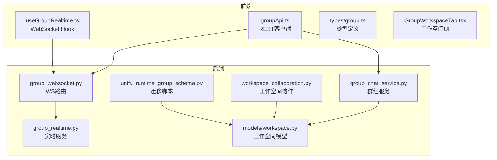
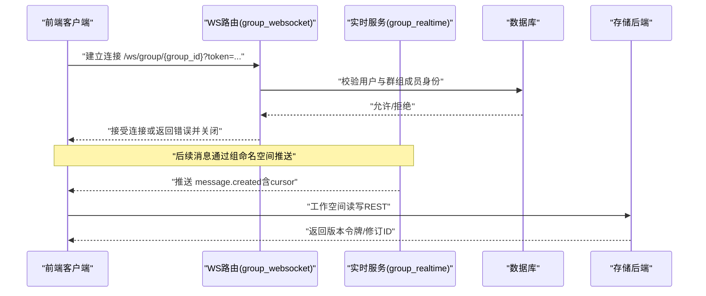
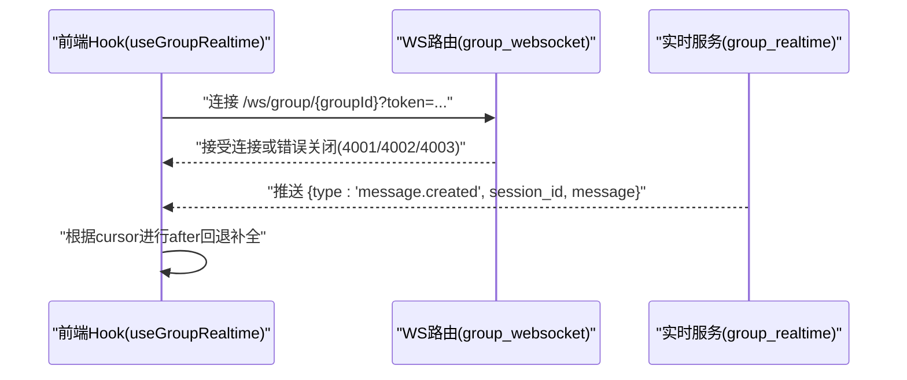
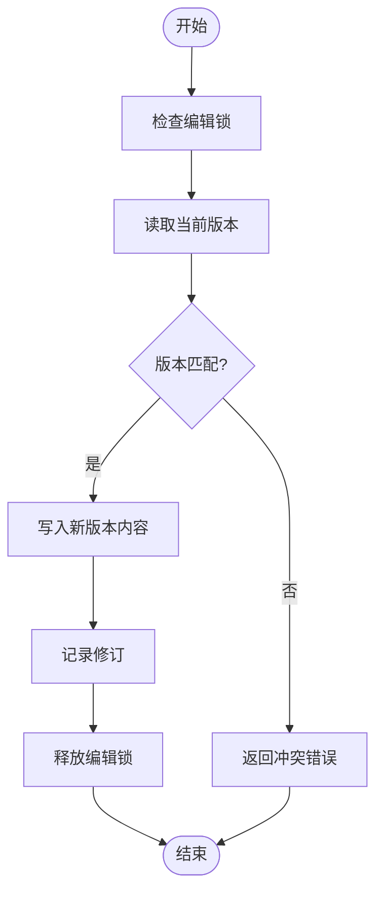
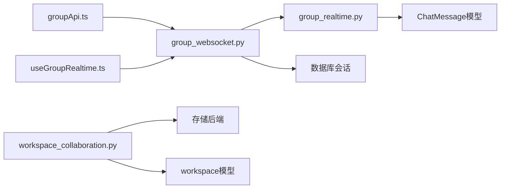

# 群组协作API

<cite>
**本文引用的文件**   
- [backend/app/api/group_websocket.py](file://backend/app/api/group_websocket.py)
- [backend/app/services/group_realtime.py](file://backend/app/services/group_realtime.py)
- [backend/app/services/group_chat_service.py](file://backend/app/services/group_chat_service.py)
- [backend/app/models/workspace.py](file://backend/app/models/workspace.py)
- [backend/app/services/workspace_collaboration.py](file://backend/app/services/workspace_collaboration.py)
- [backend/alembic/versions/202607161200_unify_runtime_group_schema.py](file://backend/alembic/versions/202607161200_unify_runtime_group_schema.py)
- [frontend/src/services/groupApi.ts](file://frontend/src/services/groupApi.ts)
- [frontend/src/hooks/useGroupRealtime.ts](file://frontend/src/hooks/useGroupRealtime.ts)
- [frontend/src/types/group.ts](file://frontend/src/types/group.ts)
- [frontend/src/pages/groups/GroupWorkspaceTab.tsx](file://frontend/src/pages/groups/GroupWorkspaceTab.tsx)
- [backend/tests/test_group_realtime.py](file://backend/tests/test_group_realtime.py)
- [frontend/tests/groupRealtimeContract.test.mjs](file://frontend/tests/groupRealtimeContract.test.mjs)
</cite>

## 目录
1. [简介](#简介)
2. [项目结构](#项目结构)
3. [核心组件](#核心组件)
4. [架构总览](#架构总览)
5. [详细组件分析](#详细组件分析)
6. [依赖关系分析](#依赖关系分析)
7. [性能考虑](#性能考虑)
8. [故障排查指南](#故障排查指南)
9. [结论](#结论)
10. [附录](#附录)

## 简介
本文件为Clawith平台的“群组协作”能力提供系统化API文档，覆盖群组创建与成员管理、消息通信（REST+WebSocket）、文件共享与工作空间版本控制、权限模型与实时同步机制。文档面向前后端开发者与集成方，既给出接口契约与数据模型，也提供典型协作场景流程、错误码说明与性能优化建议。

## 项目结构
围绕群组协作的关键代码分布在后端API与服务层、前端客户端与Hook、以及数据库迁移与测试用例中：
- 后端
  - WebSocket路由：群组实时推送入口
  - 实时服务：消息载荷构造与连接命名空间
  - 群组服务：成员授权、角色校验、访问控制
  - 工作空间模型与协作工具：版本化修订、编辑锁、CAS写入
  - 数据库迁移：统一工作组范围支持
- 前端
  - REST客户端：群组列表、详情、创建、发送消息等
  - 实时Hook：WebSocket连接、断线重连、游标回退补全
  - 类型定义：群组、会话摘要、工作空间条目等
  - 工作空间UI：文件浏览、上传、版本化适配器

图表来源
- [backend/app/api/group_websocket.py:1-78](file://backend/app/api/group_websocket.py#L1-L78)
- [backend/app/services/group_realtime.py:1-37](file://backend/app/services/group_realtime.py#L1-L37)
- [backend/app/services/group_chat_service.py:228-283](file://backend/app/services/group_chat_service.py#L228-L283)
- [backend/app/models/workspace.py:1-91](file://backend/app/models/workspace.py#L1-L91)
- [backend/app/services/workspace_collaboration.py:1-63](file://backend/app/services/workspace_collaboration.py#L1-L63)
- [backend/alembic/versions/202607161200_unify_runtime_group_schema.py:2358-2378](file://backend/alembic/versions/202607161200_unify_runtime_group_schema.py#L2358-L2378)
- [frontend/src/services/groupApi.ts:1-44](file://frontend/src/services/groupApi.ts#L1-L44)
- [frontend/src/hooks/useGroupRealtime.ts:1-121](file://frontend/src/hooks/useGroupRealtime.ts#L1-L121)
- [frontend/src/types/group.ts:110-128](file://frontend/src/types/group.ts#L110-L128)
- [frontend/src/pages/groups/GroupWorkspaceTab.tsx:1-19](file://frontend/src/pages/groups/GroupWorkspaceTab.tsx#L1-L19)

章节来源
- [backend/app/api/group_websocket.py:1-78](file://backend/app/api/group_websocket.py#L1-L78)
- [backend/app/services/group_realtime.py:1-37](file://backend/app/services/group_realtime.py#L1-L37)
- [backend/app/services/group_chat_service.py:228-283](file://backend/app/services/group_chat_service.py#L228-L283)
- [backend/app/models/workspace.py:1-91](file://backend/app/models/workspace.py#L1-L91)
- [backend/app/services/workspace_collaboration.py:1-63](file://backend/app/services/workspace_collaboration.py#L1-L63)
- [backend/alembic/versions/202607161200_unify_runtime_group_schema.py:2358-2378](file://backend/alembic/versions/202607161200_unify_runtime_group_schema.py#L2358-L2378)
- [frontend/src/services/groupApi.ts:1-44](file://frontend/src/services/groupApi.ts#L1-L44)
- [frontend/src/hooks/useGroupRealtime.ts:1-121](file://frontend/src/hooks/useGroupRealtime.ts#L1-L121)
- [frontend/src/types/group.ts:110-128](file://frontend/src/types/group.ts#L110-L128)
- [frontend/src/pages/groups/GroupWorkspaceTab.tsx:1-19](file://frontend/src/pages/groups/GroupWorkspaceTab.tsx#L1-L19)

## 核心组件
- 群组REST API（前端客户端）
  - 列举群组、获取群组详情、创建群组、邀请成员、发送消息等
  - 通过统一的fetch封装调用后端接口
- 群组WebSocket实时通道
  - 基于认证令牌鉴权，按群组命名空间推送已提交消息
  - 支持断线重连与游标回退补全
- 群组服务与权限
  - 成员有效性校验、角色检查（如manager-only）、租户隔离
- 工作空间与版本控制
  - 文件修订记录、人类编辑锁、条件写入（CAS）
  - 统一工作组范围支持（agent/group）

章节来源
- [frontend/src/services/groupApi.ts:1-44](file://frontend/src/services/groupApi.ts#L1-L44)
- [backend/app/api/group_websocket.py:1-78](file://backend/app/api/group_websocket.py#L1-L78)
- [backend/app/services/group_chat_service.py:228-283](file://backend/app/services/group_chat_service.py#L228-L283)
- [backend/app/models/workspace.py:1-91](file://backend/app/models/workspace.py#L1-L91)
- [backend/app/services/workspace_collaboration.py:1-63](file://backend/app/services/workspace_collaboration.py#L1-L63)

## 架构总览
群组协作由“REST + WebSocket”双通道组成：
- REST用于群组的CRUD、成员管理、消息历史与文件操作
- WebSocket用于实时消息推送与活动广播
- 工作空间采用版本化修订与编辑锁保障并发一致性

图表来源
- [backend/app/api/group_websocket.py:1-78](file://backend/app/api/group_websocket.py#L1-L78)
- [backend/app/services/group_realtime.py:1-37](file://backend/app/services/group_realtime.py#L1-L37)
- [backend/app/services/workspace_collaboration.py:1-63](file://backend/app/services/workspace_collaboration.py#L1-L63)

## 详细组件分析

### 群组REST API（创建、成员、消息）
- 功能要点
  - 群组列表与详情查询
  - 创建群组（可附带初始成员）
  - 邀请成员（基于participant_id）
  - 发送消息（支持@提及、去重message_id）
- 数据模型
  - Group、GroupMember、GroupMessage、GroupSessionSummary、GroupTextFile、GroupWorkspaceEntry等在前端类型中定义
- 错误处理
  - 鉴权失败、成员不存在、权限不足等错误由服务端统一返回

章节来源
- [frontend/src/services/groupApi.ts:1-44](file://frontend/src/services/groupApi.ts#L1-L44)
- [frontend/src/types/group.ts:110-128](file://frontend/src/types/group.ts#L110-L128)

### 群组WebSocket实时通信
- 连接建立
  - 路径：/ws/group/{group_id}
  - 参数：token（访问令牌）
  - 鉴权：解析令牌获取用户ID，校验是否为活跃成员且同租户
  - 错误码：4001鉴权失败、4002设置失败、4003非成员
- 事件与载荷
  - 事件类型：message.created
  - 载荷字段：id、role、content、participant_id、sender_name、mentions、created_at、cursor
  - cursor格式：ISO时间戳|消息ID，用于断线后增量拉取
- 前端实现
  - useGroupRealtime负责连接、重连、失败阈值、轮询降级、after游标回退补全

图表来源
- [backend/app/api/group_websocket.py:1-78](file://backend/app/api/group_websocket.py#L1-L78)
- [backend/app/services/group_realtime.py:1-37](file://backend/app/services/group_realtime.py#L1-L37)
- [frontend/src/hooks/useGroupRealtime.ts:1-121](file://frontend/src/hooks/useGroupRealtime.ts#L1-L121)
- [backend/tests/test_group_realtime.py:62-105](file://backend/tests/test_group_realtime.py#L62-L105)
- [frontend/tests/groupRealtimeContract.test.mjs:1-20](file://frontend/tests/groupRealtimeContract.test.mjs#L1-L20)

章节来源
- [backend/app/api/group_websocket.py:1-78](file://backend/app/api/group_websocket.py#L1-L78)
- [backend/app/services/group_realtime.py:1-37](file://backend/app/services/group_realtime.py#L1-L37)
- [frontend/src/hooks/useGroupRealtime.ts:1-121](file://frontend/src/hooks/useGroupRealtime.ts#L1-L121)
- [backend/tests/test_group_realtime.py:62-105](file://backend/tests/test_group_realtime.py#L62-L105)
- [frontend/tests/groupRealtimeContract.test.mjs:1-20](file://frontend/tests/groupRealtimeContract.test.mjs#L1-L20)

### 群组权限与成员管理
- 成员授权
  - 校验参与者有效性、是否人类成员、角色（如manager-only）
  - 返回Group、GroupMember、Participant三元组供后续操作使用
- 访问控制
  - 租户隔离、活跃状态、软删除过滤
  - 针对文件与工作空间的读写需再次授权

章节来源
- [backend/app/services/group_chat_service.py:228-283](file://backend/app/services/group_chat_service.py#L228-L283)

### 工作空间与版本控制
- 模型与约束
  - workspace_file_revisions：文件修订记录，支持scope_type为agent或group
  - workspace_edit_locks：人类编辑锁，唯一约束(scope_type, scope_id, path)
- 协作特性
  - 条件写入（CAS）：通过version_token确保并发安全
  - 自动合并与冲突检测：对文本与二进制扩展名差异化处理
  - 运行时操作准备与回执：prepared_write/prepared_delete，保证原子性
- 迁移支持
  - 统一工作组范围，新增索引与约束，兼容旧键

图表来源
- [backend/app/models/workspace.py:1-91](file://backend/app/models/workspace.py#L1-L91)
- [backend/app/services/workspace_collaboration.py:1-63](file://backend/app/services/workspace_collaboration.py#L1-L63)
- [backend/alembic/versions/202607161200_unify_runtime_group_schema.py:2358-2378](file://backend/alembic/versions/202607161200_unify_runtime_group_schema.py#L2358-L2378)

章节来源
- [backend/app/models/workspace.py:1-91](file://backend/app/models/workspace.py#L1-L91)
- [backend/app/services/workspace_collaboration.py:1-63](file://backend/app/services/workspace_collaboration.py#L1-L63)
- [backend/alembic/versions/202607161200_unify_runtime_group_schema.py:2358-2378](file://backend/alembic/versions/202607161200_unify_runtime_group_schema.py#L2358-L2378)

### 前端工作空间与实时体验
- 工作空间UI
  - 文件浏览器、上传、文本文件识别与读取
  - 版本化适配器对接后端版本令牌
- 实时体验
  - 连接状态机：connecting/live/polling/offline
  - 失败阈值与指数退避重试
  - after游标回退补全，限制最大页数避免长时阻塞

章节来源
- [frontend/src/pages/groups/GroupWorkspaceTab.tsx:1-19](file://frontend/src/pages/groups/GroupWorkspaceTab.tsx#L1-L19)
- [frontend/src/hooks/useGroupRealtime.ts:1-121](file://frontend/src/hooks/useGroupRealtime.ts#L1-L121)
- [frontend/src/types/group.ts:110-128](file://frontend/src/types/group.ts#L110-L128)

## 依赖关系分析
- 前端依赖
  - groupApi.ts依赖统一的HTTP封装与类型定义
  - useGroupRealtime.ts依赖groupApi用于历史消息与状态恢复
- 后端依赖
  - group_websocket.py依赖安全模块解码令牌、数据库会话、群组模型
  - group_realtime.py依赖审计消息模型与会话模型
  - workspace_collaboration.py依赖storage后端与数据库模型
- 外部依赖
  - Redis（跨实例路由与存在性）在实时路由中有体现
  - 文件系统/对象存储用于工作空间文件持久化

图表来源
- [frontend/src/services/groupApi.ts:1-44](file://frontend/src/services/groupApi.ts#L1-L44)
- [frontend/src/hooks/useGroupRealtime.ts:1-121](file://frontend/src/hooks/useGroupRealtime.ts#L1-L121)
- [backend/app/api/group_websocket.py:1-78](file://backend/app/api/group_websocket.py#L1-L78)
- [backend/app/services/group_realtime.py:1-37](file://backend/app/services/group_realtime.py#L1-L37)
- [backend/app/services/workspace_collaboration.py:1-63](file://backend/app/services/workspace_collaboration.py#L1-L63)

章节来源
- [frontend/src/services/groupApi.ts:1-44](file://frontend/src/services/groupApi.ts#L1-L44)
- [frontend/src/hooks/useGroupRealtime.ts:1-121](file://frontend/src/hooks/useGroupRealtime.ts#L1-L121)
- [backend/app/api/group_websocket.py:1-78](file://backend/app/api/group_websocket.py#L1-L78)
- [backend/app/services/group_realtime.py:1-37](file://backend/app/services/group_realtime.py#L1-L37)
- [backend/app/services/workspace_collaboration.py:1-63](file://backend/app/services/workspace_collaboration.py#L1-L63)

## 性能考虑
- 实时通道
  - 使用组命名空间减少广播开销
  - 断线后通过cursor进行增量拉取，限制最大回退页数
  - 失败阈值触发轮询降级，提高稳定性
- 工作空间写入
  - 条件写入（CAS）避免无谓的覆盖与冲突
  - 文本与二进制扩展名差异化处理，减少不必要的修订记录
  - 编辑锁TTL短生命周期，降低锁竞争
- 数据库与存储
  - 合理索引（scope_type+scope_id+path）提升查询效率
  - 存储后端选择与缓存策略影响吞吐

[本节为通用指导，不直接分析具体文件]

## 故障排查指南
- WebSocket连接失败
  - 4001：令牌无效或解析失败
  - 4002：成员身份查询异常
  - 4003：非群组成员或租户不一致
- 消息未推送
  - 检查组命名空间是否正确
  - 确认消息已提交并包含created_at
  - 前端after游标逻辑是否生效
- 工作空间冲突
  - version_token不匹配导致冲突错误
  - 检查编辑锁是否被其他人类用户持有
  - 查看修订记录与存储一致性

章节来源
- [backend/app/api/group_websocket.py:1-78](file://backend/app/api/group_websocket.py#L1-L78)
- [backend/app/services/group_realtime.py:1-37](file://backend/app/services/group_realtime.py#L1-L37)
- [backend/tests/test_group_realtime.py:62-105](file://backend/tests/test_group_realtime.py#L62-L105)
- [backend/tests/test_group_file_service.py:222-265](file://backend/tests/test_group_file_service.py#L222-L265)
- [backend/tests/test_group_workspace_reconciliation.py:478-523](file://backend/tests/test_group_workspace_reconciliation.py#L478-L523)

## 结论
群组协作为Clawith平台提供了企业级协作基础能力：REST与WebSocket双通道、严格的权限与租户隔离、版本化的工作空间与并发控制。通过清晰的接口契约与稳健的实时机制，团队可在同一群组内高效沟通、协作编辑与共享文件。建议在大规模部署中关注Redis路由、存储后端与数据库索引配置，以获得更佳性能与稳定性。

[本节为总结性内容，不直接分析具体文件]

## 附录
- 典型协作场景示例
  - 创建群组并邀请成员：前端调用创建接口，后端校验租户与成员有效性
  - 发送消息并实时推送：REST提交消息，WebSocket推送message.created事件
  - 工作空间协作编辑：人类编辑锁+CAS写入，冲突时提示重新加载
- 关键数据模型
  - Group、GroupMember、GroupMessage、GroupSessionSummary、GroupTextFile、GroupWorkspaceEntry
- 错误码参考
  - WebSocket：4001、4002、4003
  - 文件冲突：group_file_conflict、group_workspace_reconciliation_conflict

[本节为补充信息，不直接分析具体文件]