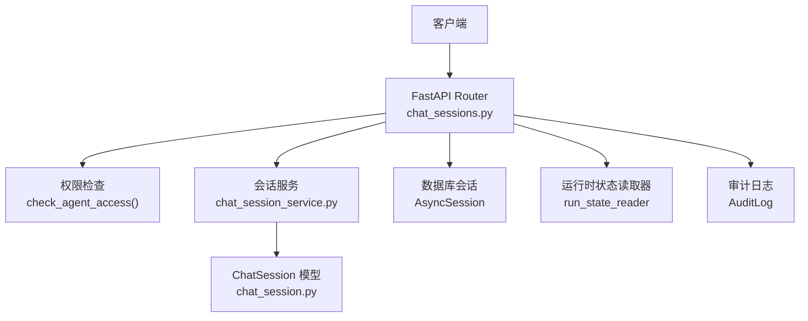
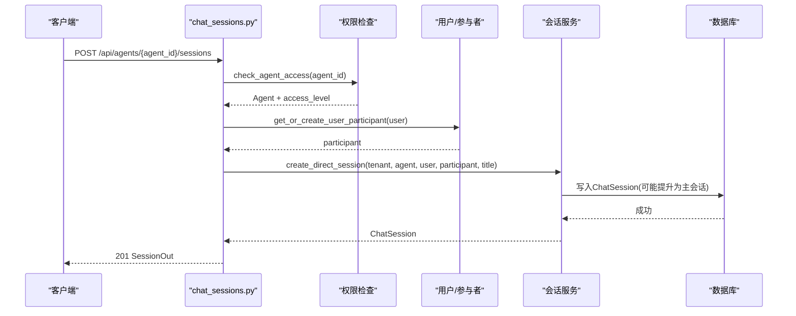
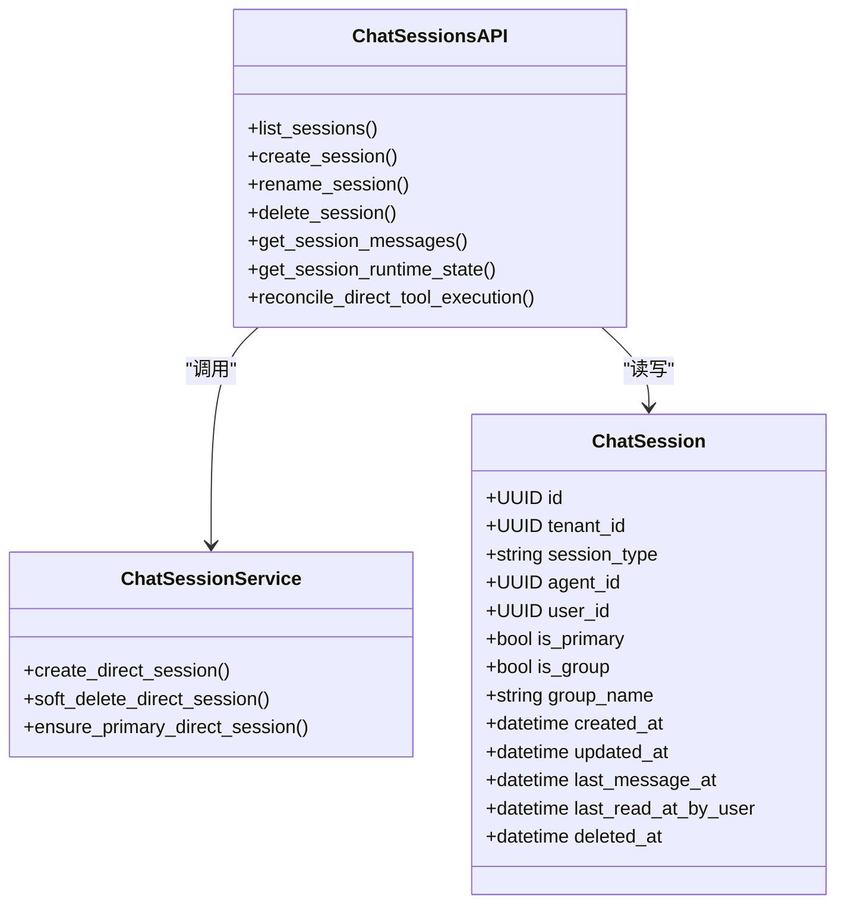

# REST API端点

<cite>
**本文引用的文件**   
- [chat_sessions.py](file://backend/app/api/chat_sessions.py)
- [chat_session_service.py](file://backend/app/services/chat_session_service.py)
- [chat_session.py](file://backend/app/models/chat_session.py)
- [security.py](file://backend/app/core/security.py)
- [permissions.py](file://backend/app/core/permissions.py)
- [error_contract.py](file://backend/app/core/error_contract.py)
- [test_chat_sessions_api.py](file://backend/tests/test_chat_sessions_api.py)
</cite>

## 目录
1. [简介](#简介)
2. [项目结构](#项目结构)
3. [核心组件](#核心组件)
4. [架构总览](#架构总览)
5. [详细组件分析](#详细组件分析)
6. [依赖关系分析](#依赖关系分析)
7. [性能考量](#性能考量)
8. [故障排查指南](#故障排查指南)
9. [结论](#结论)
10. [附录](#附录)

## 简介
本文件为Clawith平台“聊天会话”RESTful API的权威文档，覆盖以下端点：
- GET /api/agents/{agent_id}/sessions（获取会话列表）
- POST /api/agents/{agent_id}/sessions（创建新会话）
- PATCH /api/agents/{agent_id}/sessions/{session_id}（重命名会话）
- DELETE /api/agents/{agent_id}/sessions/{session_id}（删除会话）

同时补充与这些端点密切相关的运行时状态查询、消息拉取等辅助端点，以便完整理解会话生命周期。所有端点均要求认证、权限校验与多租户隔离。

## 项目结构
后端采用FastAPI路由组织，会话相关逻辑集中在：
- 路由层：backend/app/api/chat_sessions.py
- 服务层：backend/app/services/chat_session_service.py
- 数据模型：backend/app/models/chat_session.py
- 安全与权限：backend/app/core/security.py、backend/app/core/permissions.py
- 错误契约：backend/app/core/error_contract.py
- 测试用例：backend/tests/test_chat_sessions_api.py

图表来源
- [chat_sessions.py:216-356](file://backend/app/api/chat_sessions.py#L216-L356)
- [chat_session_service.py:175-211](file://backend/app/services/chat_session_service.py#L175-L211)
- [chat_session.py:23-116](file://backend/app/models/chat_session.py#L23-L116)
- [security.py:153-173](file://backend/app/core/security.py#L153-L173)
- [permissions.py:481-518](file://backend/app/core/permissions.py#L481-L518)

章节来源
- [chat_sessions.py:1-42](file://backend/app/api/chat_sessions.py#L1-L42)
- [chat_session_service.py:1-40](file://backend/app/services/chat_session_service.py#L1-L40)
- [chat_session.py:1-32](file://backend/app/models/chat_session.py#L1-L32)
- [security.py:1-27](file://backend/app/core/security.py#L1-L27)
- [permissions.py:1-33](file://backend/app/core/permissions.py#L1-L33)
- [error_contract.py:1-33](file://backend/app/core/error_contract.py#L1-L33)

## 核心组件
- 路由与参数校验：使用FastAPI的Query、Path、Body进行强类型校验与描述。
- 认证：通过HTTP Bearer Token解析JWT，加载当前用户并校验活跃状态。
- 权限：基于RBAC与Agent访问模式（company/private/custom），结合租户隔离。
- 多租户：所有查询强制附加tenant_id过滤，跨租户直接拒绝。
- 会话服务：封装创建、主会话提升、软删除及取消运行等事务性操作。
- 错误契约：统一错误体结构，包含code、message、trace_id等字段。

章节来源
- [chat_sessions.py:112-140](file://backend/app/api/chat_sessions.py#L112-L140)
- [security.py:128-173](file://backend/app/core/security.py#L128-L173)
- [permissions.py:44-92](file://backend/app/core/permissions.py#L44-L92)
- [chat_session_service.py:175-211](file://backend/app/services/chat_session_service.py#L175-L211)
- [error_contract.py:57-84](file://backend/app/core/error_contract.py#L57-L84)

## 架构总览
下图展示一次“创建会话”的典型调用链：鉴权→权限→租户校验→参与者解析→会话创建→提交事务→返回结果。

图表来源
- [chat_sessions.py:358-394](file://backend/app/api/chat_sessions.py#L358-L394)
- [chat_session_service.py:175-211](file://backend/app/services/chat_session_service.py#L175-L211)
- [permissions.py:481-518](file://backend/app/core/permissions.py#L481-L518)

## 详细组件分析

### 通用说明
- 认证方式：HTTP Bearer Token（JWT）。请求头需携带Authorization: Bearer <token>。
- 权限模型：
  - 角色：member、agent_admin、org_admin、platform_admin。
  - Agent访问模式：company、private、custom。
  - 创建者或具备管理权限的用户可执行管理操作；普通成员仅能使用。
- 多租户隔离：所有会话查询与变更均按tenant_id过滤，跨租户直接拒绝。
- 错误响应：遵循统一错误契约，包含detail与error对象（code、message、trace_id等）。

章节来源
- [security.py:153-173](file://backend/app/core/security.py#L153-L173)
- [permissions.py:481-518](file://backend/app/core/permissions.py#L481-L518)
- [error_contract.py:158-181](file://backend/app/core/error_contract.py#L158-L181)

### GET /api/agents/{agent_id}/sessions
- 功能：列出某Agent关联的活跃会话（支持mine/all两种范围）。
- 路径参数：
  - agent_id: UUID，Agent标识。
- 查询参数：
  - scope: 枚举值 mine|all，默认mine。
- 认证与权限：
  - 需要有效JWT。
  - 必须对agent_id具备use或manage权限。
  - scope=all时，仅管理员或Agent创建者可查看所有用户的会话。
- 响应体：数组，元素为SessionOut，包含id、agent_id、user_id、username、source_channel、title、created_at、last_message_at、message_count、unread_count、is_primary、peer_agent_id、peer_agent_name、participant_type、is_group、group_name等。
- 状态码：
  - 200：成功返回数组。
  - 400：scope非法。
  - 401：未认证或Token无效。
  - 403：无权限或跨租户。
  - 404：Agent不存在。
- 行为要点：
  - mine：仅返回当前用户在指定Agent下的direct会话。
  - all：返回该Agent下所有活跃会话（包括a2a、group、trigger等），并按最后消息时间排序。
  - unread_count仅对direct会话计算。
  - a2a会话会填充peer_agent_id与peer_agent_name。
  - group会话显示group_name与is_group=true。

章节来源
- [chat_sessions.py:216-356](file://backend/app/api/chat_sessions.py#L216-L356)
- [chat_sessions.py:45-54](file://backend/app/api/chat_sessions.py#L45-L54)
- [chat_sessions.py:95-104](file://backend/app/api/chat_sessions.py#L95-L104)
- [chat_sessions.py:112-131](file://backend/app/api/chat_sessions.py#L112-L131)

### POST /api/agents/{agent_id}/sessions
- 功能：为当前租户的活跃用户创建一条Direct会话。
- 路径参数：agent_id: UUID。
- 请求体：CreateSessionIn，可选title字符串。
- 认证与权限：
  - 需要有效JWT。
  - 必须对agent_id具备use或manage权限。
  - 当前用户必须在同一租户且处于活跃状态。
- 响应体：SessionOut。
- 状态码：
  - 201：创建成功。
  - 401：未认证或Token无效。
  - 403：无权限或用户非活跃/跨租户。
  - 404：Agent不存在。
- 行为要点：
  - 首次创建的会话会被标记为主会话（is_primary=true）。
  - 自动解析或创建参与者身份（display_name/avatar_url）。

章节来源
- [chat_sessions.py:358-394](file://backend/app/api/chat_sessions.py#L358-L394)
- [chat_session_service.py:175-211](file://backend/app/services/chat_session_service.py#L175-L211)

### PATCH /api/agents/{agent_id}/sessions/{session_id}
- 功能：重命名一条活跃的Direct会话。
- 路径参数：agent_id、session_id: UUID。
- 请求体：PatchSessionIn，必填title字符串。
- 认证与权限：
  - 需要有效JWT。
  - 必须对agent_id具备use或manage权限。
  - 仅会话所有者（user_id匹配）或管理员/创建者可修改。
- 响应体：{id, title}。
- 状态码：
  - 200：成功。
  - 401：未认证。
  - 403：无权限。
  - 404：会话不存在。

章节来源
- [chat_sessions.py:670-694](file://backend/app/api/chat_sessions.py#L670-L694)
- [chat_sessions.py:107-110](file://backend/app/api/chat_sessions.py#L107-L110)

### DELETE /api/agents/{agent_id}/sessions/{session_id}
- 功能：软删除一条Direct会话，并取消其前台协作运行。
- 路径参数：agent_id、session_id: UUID。
- 认证与权限：同PATCH。
- 响应体：空（204 No Content）。
- 状态码：
  - 204：成功。
  - 401：未认证。
  - 403：无权限。
  - 404：会话不存在。
- 行为要点：
  - 若被删除的是主会话，将提升另一条最近会话为主会话。
  - 异步取消与该会话相关的foreground/orchestration运行。

章节来源
- [chat_sessions.py:697-730](file://backend/app/api/chat_sessions.py#L697-L730)
- [chat_session_service.py:271-323](file://backend/app/services/chat_session_service.py#L271-L323)

### 辅助端点：GET /api/agents/{agent_id}/sessions/{session_id}/runtime-state
- 功能：返回Direct会话的运行时状态（是否存在前台运行的Run、是否可恢复/取消、待确认工具调用等）。
- 认证与权限：需对agent_id具备use/manage权限，且会话属于当前用户。
- 响应体：SessionRuntimeStateOut，包含active_run（可为空）。
- 状态码：
  - 200：成功。
  - 404：会话不存在。
  - 409：运行时状态不一致或多持有者冲突。

章节来源
- [chat_sessions.py:397-559](file://backend/app/api/chat_sessions.py#L397-L559)

### 辅助端点：POST /api/agents/{agent_id}/sessions/{session_id}/runs/{run_id}/tool-executions/{execution_id}/reconcile
- 功能：在等待用户输入的运行中，确认未知工具调用的结果（applied/not_applied），以继续流程。
- 认证与权限：同上。
- 请求体：ReconcileToolExecutionIn，包含outcome、correlation_id、note。
- 响应体：ReconcileToolExecutionOut，包含execution_id、status、result_summary。
- 状态码：
  - 200：成功。
  - 404：会话或运行不存在。
  - 409：运行不在waiting_user状态或correlation不匹配。
  - 422：缺少必要note。

章节来源
- [chat_sessions.py:562-667](file://backend/app/api/chat_sessions.py#L562-L667)

### 辅助端点：GET /api/agents/{agent_id}/sessions/{session_id}/messages
- 功能：分页拉取会话消息，支持cursor-based分页（before=ISO时间戳|消息ID）。
- 认证与权限：需对agent_id具备use/manage权限，且会话可见。
- 响应体：消息数组，包含id、role、content、created_at、cursor，以及tool_call扩展字段（toolName、toolArgs、toolStatus、toolResult、toolThinking、toolCallId）、runtime_error（失败诊断）、sender_name/participant_id（A2A场景）等。
- 状态码：
  - 200：成功。
  - 404：会话不存在。
- 行为要点：
  - direct会话且当前用户为会话所有者时，会推进last_read_at_by_user以减少未读计数。
  - A2A会话会解析内联工具块并拆分为多个条目。

章节来源
- [chat_sessions.py:794-930](file://backend/app/api/chat_sessions.py#L794-L930)

## 依赖关系分析
- 路由依赖：
  - get_current_user：从Bearer Token解析JWT并加载用户。
  - check_agent_access：校验Agent存在、租户一致性与访问级别。
  - get_db：提供异步数据库会话。
- 服务依赖：
  - create_direct_session：创建会话并处理主会话提升。
  - soft_delete_direct_session：软删除并编排取消运行。
- 模型依赖：
  - ChatSession：会话实体，包含租户、类型、主会话标记、分组信息等。
- 错误处理：
  - HTTPException统一由全局异常处理器包装为标准错误体。

图表来源
- [chat_session.py:23-116](file://backend/app/models/chat_session.py#L23-L116)
- [chat_sessions.py:216-356](file://backend/app/api/chat_sessions.py#L216-L356)
- [chat_session_service.py:175-211](file://backend/app/services/chat_session_service.py#L175-L211)

章节来源
- [chat_sessions.py:1-42](file://backend/app/api/chat_sessions.py#L1-L42)
- [chat_session_service.py:1-40](file://backend/app/services/chat_session_service.py#L1-L40)
- [chat_session.py:1-32](file://backend/app/models/chat_session.py#L1-L32)

## 性能考量
- 分页与游标：消息拉取使用cursor-based分页，避免深翻页开销。
- 只读优化：列表接口批量统计消息数与未读数，减少N+1查询。
- 并发控制：会话生命周期操作使用PG advisory锁序列化主会话变更，避免竞态。
- 索引利用：ChatSession表对tenant_id、agent_id、user_id、is_primary等建立索引，加速过滤与排序。
- 运行时状态读取：通过专用reader读取运行状态，避免阻塞主流程。

章节来源
- [chat_sessions.py:252-280](file://backend/app/api/chat_sessions.py#L252-L280)
- [chat_session_service.py:41-54](file://backend/app/services/chat_session_service.py#L41-L54)
- [chat_session.py:35-63](file://backend/app/models/chat_session.py#L35-L63)

## 故障排查指南
- 常见状态码与含义：
  - 401：Token无效或过期、用户不存在或不活跃。
  - 403：无Agent访问权限、跨租户访问、非会话所有者尝试修改/删除。
  - 404：Agent或会话不存在。
  - 409：运行时状态不一致（如多持有者、运行不在waiting_user）。
  - 422：请求体验证失败（如缺少必填字段）。
  - 500：内部错误（已记录trace_id）。
- 调试建议：
  - 关注响应体中的error.code与error.trace_id，便于定位问题。
  - 对于运行时相关错误，查看runtime-state与reconcile接口返回的详细信息。
  - 检查租户一致性（tenant_id）与Agent访问模式（access_mode）。
  - 使用测试用例作为参考，验证SQL条件与边界行为。

章节来源
- [error_contract.py:158-181](file://backend/app/core/error_contract.py#L158-L181)
- [chat_sessions.py:225-228](file://backend/app/api/chat_sessions.py#L225-L228)
- [chat_sessions.py:408-427](file://backend/app/api/chat_sessions.py#L408-L427)
- [chat_sessions.py:615-628](file://backend/app/api/chat_sessions.py#L615-L628)
- [test_chat_sessions_api.py:190-214](file://backend/tests/test_chat_sessions_api.py#L190-L214)

## 结论
本API围绕“会话”这一核心概念，提供了完整的CRUD能力，并通过严格的认证、权限与多租户隔离确保数据安全。配合运行时状态与消息拉取接口，形成端到端的对话管理能力。建议在集成时严格遵循请求/响应契约，妥善处理错误与重试策略，充分利用cursor分页与只读优化以提升性能。

## 附录

### 请求/响应示例（摘要）
- 创建会话
  - 请求：POST /api/agents/{agent_id}/sessions
  - 请求体：{"title": "主题名称"}
  - 响应：201 SessionOut
- 重命名会话
  - 请求：PATCH /api/agents/{agent_id}/sessions/{session_id}
  - 请求体：{"title": "新标题"}
  - 响应：200 {"id": "...", "title": "..."}
- 删除会话
  - 请求：DELETE /api/agents/{agent_id}/sessions/{session_id}
  - 响应：204 空体
- 获取会话列表
  - 请求：GET /api/agents/{agent_id}/sessions?scope=mine|all
  - 响应：200 [SessionOut]
- 获取运行时状态
  - 请求：GET /api/agents/{agent_id}/sessions/{session_id}/runtime-state
  - 响应：200 SessionRuntimeStateOut
- 工具调用确认
  - 请求：POST /api/agents/{agent_id}/sessions/{session_id}/runs/{run_id}/tool-executions/{execution_id}/reconcile
  - 请求体：{"outcome": "applied|not_applied", "correlation_id": "...", "note": "..."}
  - 响应：200 ReconcileToolExecutionOut
- 拉取消息
  - 请求：GET /api/agents/{agent_id}/sessions/{session_id}/messages?limit=20&before=<ISO>|<uuid>
  - 响应：200 [MessageEntry]

章节来源
- [chat_sessions.py:358-394](file://backend/app/api/chat_sessions.py#L358-L394)
- [chat_sessions.py:670-694](file://backend/app/api/chat_sessions.py#L670-L694)
- [chat_sessions.py:697-730](file://backend/app/api/chat_sessions.py#L697-L730)
- [chat_sessions.py:216-356](file://backend/app/api/chat_sessions.py#L216-L356)
- [chat_sessions.py:397-559](file://backend/app/api/chat_sessions.py#L397-L559)
- [chat_sessions.py:562-667](file://backend/app/api/chat_sessions.py#L562-L667)
- [chat_sessions.py:794-930](file://backend/app/api/chat_sessions.py#L794-L930)

### 最佳实践建议
- 始终携带有效的Bearer Token，并在服务端缓存最小化用户信息以降低重复查询。
- 使用scope=mine优先获取当前用户会话，减少不必要的数据暴露。
- 对消息拉取使用cursor分页，避免全量加载。
- 在处理运行时等待状态时，先查询runtime-state再决定操作（resume/cancel/reconcile）。
- 遇到409/422错误时，根据error.code与trace_id快速定位问题根因。
- 在批量操作中注意幂等键与去重，避免重复创建会话或重复确认工具调用。

[本节为通用指导，不直接分析具体文件]