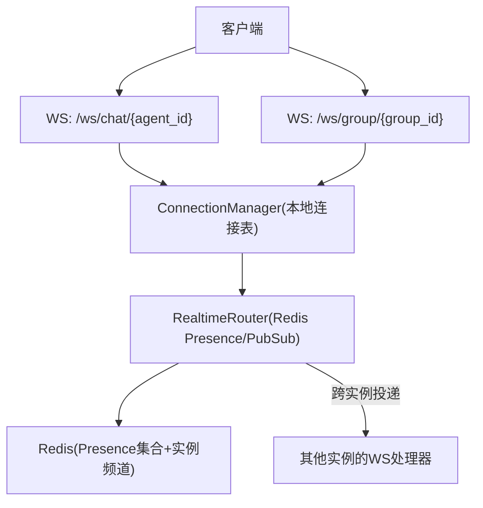
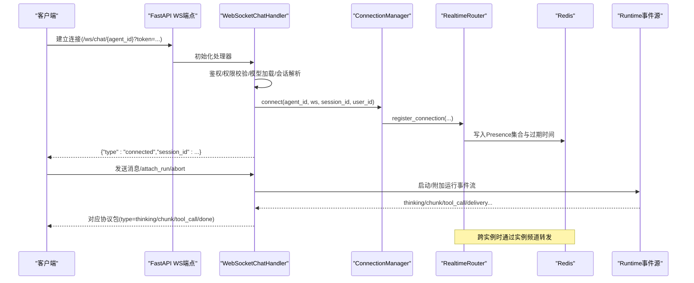
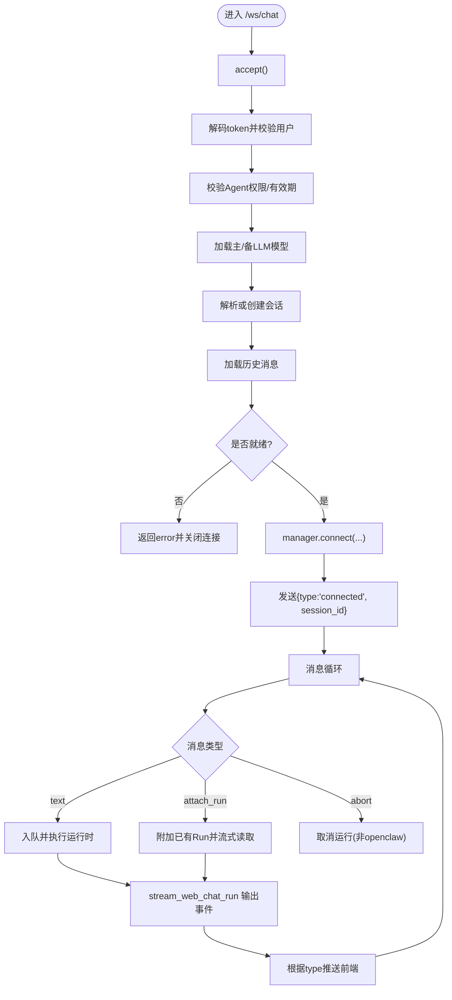
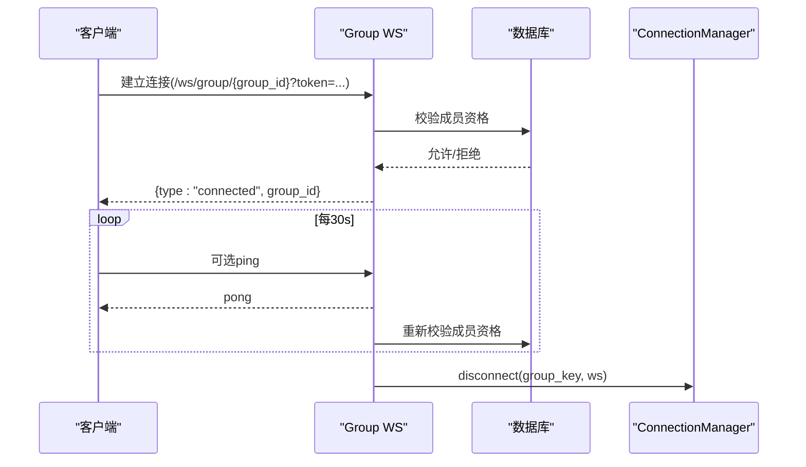
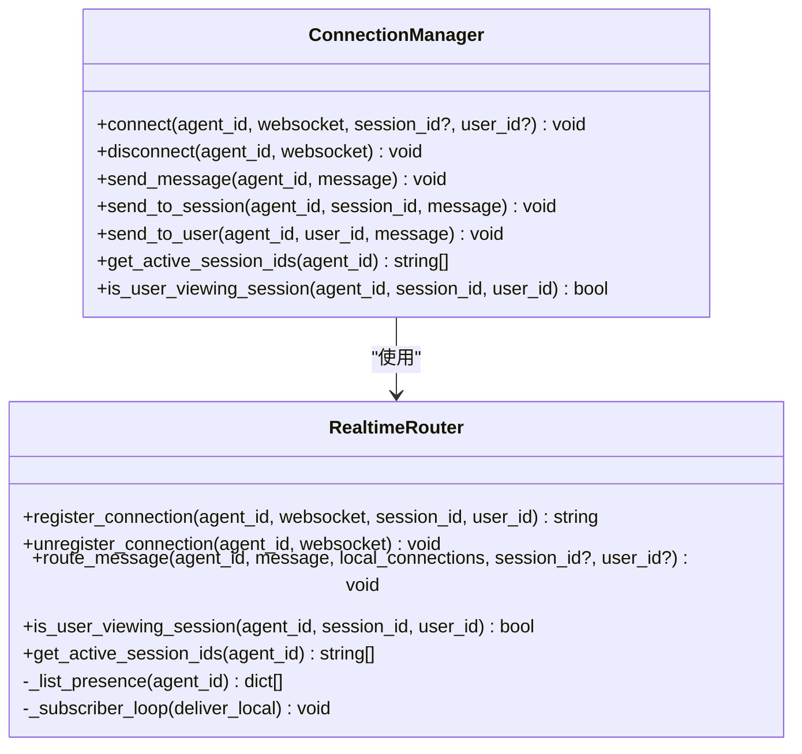
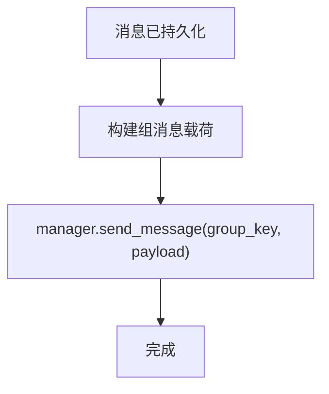
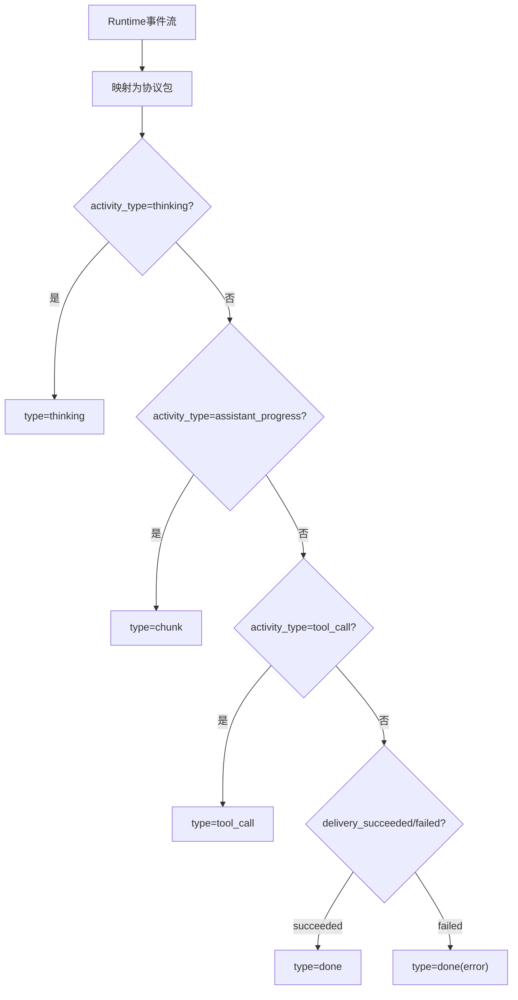
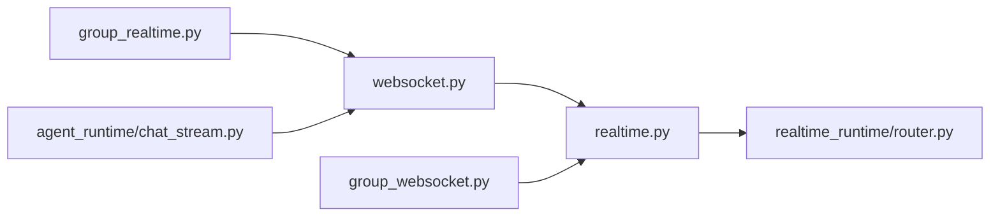

# WebSocket实时通信

<cite>
**本文引用的文件**   
- [backend/app/api/websocket.py](file://backend/app/api/websocket.py)
- [backend/app/api/group_websocket.py](file://backend/app/api/group_websocket.py)
- [backend/app/services/realtime.py](file://backend/app/services/realtime.py)
- [backend/app/services/realtime_runtime/router.py](file://backend/app/services/realtime_runtime/router.py)
- [backend/app/services/group_realtime.py](file://backend/app/services/group_realtime.py)
- [backend/app/services/agent_runtime/chat_stream.py](file://backend/app/services/agent_runtime/chat_stream.py)
</cite>

## 目录
1. [简介](#简介)
2. [项目结构](#项目结构)
3. [核心组件](#核心组件)
4. [架构总览](#架构总览)
5. [详细组件分析](#详细组件分析)
6. [依赖关系分析](#依赖关系分析)
7. [性能考量](#性能考量)
8. [故障排查指南](#故障排查指南)
9. [结论](#结论)
10. [附录：协议与事件规范](#附录协议与事件规范)

## 简介
本文件为Clawith平台的WebSocket实时通信系统提供完整技术文档，覆盖以下方面：
- WebSocket连接建立流程（单聊、群组）
- 消息格式规范与事件类型定义
- 实时消息推送、群组聊天、@提及等事件协议
- 连接管理、心跳机制、断线重连策略
- 消息订阅模式、房间管理、用户状态同步
- 客户端集成示例、错误处理方案与性能优化建议

## 项目结构
后端通过FastAPI暴露两个WebSocket端点：
- 单聊：/ws/chat/{agent_id}
- 群组：/ws/group/{group_id}

核心路由与分发由Redis Pub/Sub驱动，实现多实例间跨进程的消息路由与会话存在性管理。

图表来源 
- [backend/app/api/websocket.py](file://backend/app/api/websocket.py)
- [backend/app/api/group_websocket.py](file://backend/app/api/group_websocket.py)
- [backend/app/services/realtime_runtime/router.py](file://backend/app/services/realtime_runtime/router.py)

章节来源
- [backend/app/api/websocket.py](file://backend/app/api/websocket.py)
- [backend/app/api/group_websocket.py](file://backend/app/api/group_websocket.py)
- [backend/app/services/realtime_runtime/router.py](file://backend/app/services/realtime_runtime/router.py)

## 核心组件
- ConnectionManager：维护每个agent或group的连接映射，支持按session_id或user_id定向投递。
- RealtimeRouter：基于Redis的Presence管理与跨实例Pub/Sub路由，保证多实例部署下的可靠投递。
- GroupRealtime：群组消息提交后的实时广播与载荷序列化。
- ChatStream：将Runtime事件流转换为Web Chat协议包，并输出thinking/chunk/tool_call/done等事件。

章节来源
- [backend/app/api/websocket.py](file://backend/app/api/websocket.py)
- [backend/app/services/realtime_runtime/router.py](file://backend/app/services/realtime_runtime/router.py)
- [backend/app/services/group_realtime.py](file://backend/app/services/group_realtime.py)
- [backend/app/services/agent_runtime/chat_stream.py](file://backend/app/services/agent_runtime/chat_stream.py)

## 架构总览
下图展示从客户端到后端的端到端交互路径，包括认证、会话解析、运行时事件流与跨实例路由。

图表来源 
- [backend/app/api/websocket.py](file://backend/app/api/websocket.py)
- [backend/app/services/realtime_runtime/router.py](file://backend/app/services/realtime_runtime/router.py)
- [backend/app/services/agent_runtime/chat_stream.py](file://backend/app/services/agent_runtime/chat_stream.py)

## 详细组件分析

### 单聊WebSocket处理器（/ws/chat/{agent_id}）
- 连接建立：接受连接、鉴权、校验Agent访问权限、加载模型、解析或创建会话、加载历史消息。
- 消息循环：接收客户端消息，支持普通文本、onboarding_trigger、attach_run、abort等类型；持久化用户输入并触发运行时执行。
- 事件流：通过stream_web_chat_run将Runtime事件映射为协议包，包含thinking、chunk、tool_call、done等。
- 连接管理：注册/注销连接，支持按session_id或user_id定向投递。

图表来源 
- [backend/app/api/websocket.py](file://backend/app/api/websocket.py)
- [backend/app/services/agent_runtime/chat_stream.py](file://backend/app/services/agent_runtime/chat_stream.py)

章节来源
- [backend/app/api/websocket.py](file://backend/app/api/websocket.py)
- [backend/app/services/agent_runtime/chat_stream.py](file://backend/app/services/agent_runtime/chat_stream.py)

### 群组WebSocket（/ws/group/{group_id}）
- 连接建立：鉴权、校验成员资格，成功后发送connected并进入心跳轮询。
- 心跳机制：每30秒尝试接收消息，超时则重新校验成员资格；收到ping则回复pong。
- 断开清理：finally中确保disconnect释放连接资源。

图表来源 
- [backend/app/api/group_websocket.py](file://backend/app/api/group_websocket.py)

章节来源
- [backend/app/api/group_websocket.py](file://backend/app/api/group_websocket.py)

### 实时路由与存在性（RealtimeRouter）
- 连接注册：为每个连接生成connection_id，写入Redis哈希与集合，设置TTL。
- 消息路由：优先本地投递，再按实例维度通过Pub/Sub转发至远端实例。
- 订阅循环：监听实例频道，反序列化为payload并调用deliver_local进行本地投递。

图表来源 
- [backend/app/services/realtime_runtime/router.py](file://backend/app/services/realtime_runtime/router.py)
- [backend/app/api/websocket.py](file://backend/app/api/websocket.py)

章节来源
- [backend/app/services/realtime_runtime/router.py](file://backend/app/services/realtime_runtime/router.py)
- [backend/app/services/realtime.py](file://backend/app/services/realtime.py)

### 群组实时广播（GroupRealtime）
- 提交后广播：在消息已持久化后，构造标准载荷并通过manager.send_message推送到群组连接键。
- 载荷序列化：包含id、role、content、participant_id、sender_name、mentions、created_at、cursor等字段。

图表来源 
- [backend/app/services/group_realtime.py](file://backend/app/services/group_realtime.py)

章节来源
- [backend/app/services/group_realtime.py](file://backend/app/services/group_realtime.py)

### 运行时事件流映射（ChatStream）
- 事件映射：将Runtime事件转换为Web Chat协议包，如thinking、chunk、tool_call、runtime_status、done等。
- 交付边界：以delivery_succeeded/delivery_failed作为最终交付边界，确保一致性。
- 等待用户：waiting_started/resumed支持“等待用户”状态与恢复关联ID。

图表来源 
- [backend/app/services/agent_runtime/chat_stream.py](file://backend/app/services/agent_runtime/chat_stream.py)

章节来源
- [backend/app/services/agent_runtime/chat_stream.py](file://backend/app/services/agent_runtime/chat_stream.py)

## 依赖关系分析
- FastAPI端点依赖安全模块进行鉴权，依赖数据库会话进行权限与数据查询。
- ConnectionManager依赖RealtimeRouter进行跨实例路由与存在性管理。
- GroupRealtime依赖manager进行消息广播。
- ChatStream依赖数据库事件源与运行时契约。

图表来源 
- [backend/app/api/websocket.py](file://backend/app/api/websocket.py)
- [backend/app/api/group_websocket.py](file://backend/app/api/group_websocket.py)
- [backend/app/services/realtime.py](file://backend/app/services/realtime.py)
- [backend/app/services/realtime_runtime/router.py](file://backend/app/services/realtime_runtime/router.py)
- [backend/app/services/group_realtime.py](file://backend/app/services/group_realtime.py)
- [backend/app/services/agent_runtime/chat_stream.py](file://backend/app/services/agent_runtime/chat_stream.py)

章节来源
- [backend/app/api/websocket.py](file://backend/app/api/websocket.py)
- [backend/app/api/group_websocket.py](file://backend/app/api/group_websocket.py)
- [backend/app/services/realtime.py](file://backend/app/services/realtime.py)
- [backend/app/services/realtime_runtime/router.py](file://backend/app/services/realtime_runtime/router.py)
- [backend/app/services/group_realtime.py](file://backend/app/services/group_realtime.py)
- [backend/app/services/agent_runtime/chat_stream.py](file://backend/app/services/agent_runtime/chat_stream.py)

## 性能考量
- 连接存在性TTL：Presence记录默认TTL为180秒，避免僵尸连接占用内存。
- 本地优先投递：先向本地连接发送，再批量发布到远端实例，减少不必要的跨实例流量。
- 心跳间隔：群组心跳周期为30秒，平衡存活检测与网络开销。
- 事件流分页：attach_run支持cursor定位，避免重复消费与全量回放。
- 异步I/O：所有数据库与Redis操作均为异步，提升吞吐。

[本节为通用指导，不直接分析具体文件]

## 故障排查指南
- 鉴权失败：检查token有效性及用户是否存在。
- 会话范围不匹配：确认session_id与agent、tenant、source_channel等约束一致。
- 运行时不可用：确认模型配置与配额限制。
- 群组成员变更：心跳轮询会重新校验成员资格，若被移除将主动关闭连接。
- 跨实例投递失败：检查Redis连通性与实例频道订阅是否正常。

章节来源
- [backend/app/api/websocket.py](file://backend/app/api/websocket.py)
- [backend/app/api/group_websocket.py](file://backend/app/api/group_websocket.py)
- [backend/app/services/realtime_runtime/router.py](file://backend/app/services/realtime_runtime/router.py)

## 结论
Clawith的WebSocket实时通信系统通过清晰的端点设计、稳健的存在性管理与跨实例路由，实现了高可用、可扩展的单聊与群组实时能力。结合运行时事件流映射，能够稳定地向前端推送思考、分片、工具调用与最终结果。建议在客户端实现健壮的重连与幂等处理，并结合心跳与cursor机制保障一致性体验。

[本节为总结，不直接分析具体文件]

## 附录：协议与事件规范

### 连接建立
- 单聊端点：/ws/chat/{agent_id}?token=...&session_id=...&lang=en
- 群组端点：/ws/group/{group_id}?token=...
- 成功响应：
  - 单聊：{"type":"connected","session_id":"..."}
  - 群组：{"type":"connected","group_id":"..."}

章节来源
- [backend/app/api/websocket.py](file://backend/app/api/websocket.py)
- [backend/app/api/group_websocket.py](file://backend/app/api/group_websocket.py)

### 客户端上行消息（单聊）
- type=text：发送文本内容，字段content必填；可选display_content、file_name、model_id、message_id、run_id、correlation_id、kind="onboarding_trigger"
- type=attach_run：附加已有运行，字段run_id必填，cursor可选（格式"<created_at>|<event_id>"）
- type=abort：中止当前运行（对openclaw类型无效）

章节来源
- [backend/app/api/websocket.py](file://backend/app/api/websocket.py)

### 服务端下行事件（单聊）
- type=thinking：思考中提示
- type=chunk：分片内容
- type=tool_call：工具调用信息（name、call_id、args、status、result、reasoning_content、execution_status、error_code）
- type=runtime_status：运行时状态变化
- type=done：最终交付（包含role、content、message_id、run_id、runtime_status；失败时包含code、message、agent_id、stage、trace_id、error）

章节来源
- [backend/app/services/agent_runtime/chat_stream.py](file://backend/app/services/agent_runtime/chat_stream.py)
- [backend/app/api/websocket.py](file://backend/app/api/websocket.py)

### 群组事件
- 新增消息：{"type":"message.created","group_id":"...","session_id":"...","message":{"id":"...","role":"...","content":"...","participant_id":"...","sender_name":"...","mentions":[],"created_at":"...","cursor":"..."}}
- 心跳：客户端可发送{"type":"ping"}，服务端返回{"type":"pong"}

章节来源
- [backend/app/services/group_realtime.py](file://backend/app/services/group_realtime.py)
- [backend/app/api/group_websocket.py](file://backend/app/api/group_websocket.py)

### 错误码与关闭码
- 鉴权失败：type=error，close=4001
- 设置失败：type=error，close=4002
- 权限不足/成员缺失：type=error，close=4003
- 运行时错误：type=error，包含code、message、agent_id、stage、trace_id、error对象

章节来源
- [backend/app/api/websocket.py](file://backend/app/api/websocket.py)
- [backend/app/api/group_websocket.py](file://backend/app/api/group_websocket.py)

### 连接管理与重连策略
- 连接注册：register_connection写入Redis，设置TTL=180秒
- 断线重连：客户端应捕获异常并重试，使用attach_run与cursor避免重复消费
- 心跳保活：群组侧每30秒轮询，必要时重新校验成员资格

章节来源
- [backend/app/services/realtime_runtime/router.py](file://backend/app/services/realtime_runtime/router.py)
- [backend/app/api/group_websocket.py](file://backend/app/api/group_websocket.py)

### 订阅模式与房间管理
- 订阅键：
  - 单聊：agent_id
  - 群组：group:{group_id}
- 定向投递：
  - send_to_session(agent_id, session_id, message)
  - send_to_user(agent_id, user_id, message)

章节来源
- [backend/app/api/websocket.py](file://backend/app/api/websocket.py)
- [backend/app/services/group_realtime.py](file://backend/app/services/group_realtime.py)

### 用户状态同步
- is_user_viewing_session(agent_id, session_id, user_id)：判断指定用户是否正在查看该会话
- get_active_session_ids(agent_id)：获取活跃会话ID集合

章节来源
- [backend/app/services/realtime_runtime/router.py](file://backend/app/services/realtime_runtime/router.py)
- [backend/app/api/websocket.py](file://backend/app/api/websocket.py)

### 客户端集成示例（步骤）
- 建立连接：携带token与必要参数连接对应端点
- 处理connected：保存session_id或group_id
- 发送消息：按协议发送text/attach_run/abort
- 处理事件：根据type渲染thinking/chunk/tool_call/done
- 断线重连：捕获异常，延迟重试，使用attach_run与cursor恢复
- 心跳保活：群组侧定期发送ping

[本节为集成指导，不直接分析具体文件]

### 错误处理方案
- 统一错误包：type=error，包含code、message、agent_id、stage、trace_id、error对象
- 关闭码语义：4001鉴权失败、4002设置失败、4003权限不足
- 运行时错误：区分execution/delivery阶段，附带trace_id便于追踪

章节来源
- [backend/app/api/websocket.py](file://backend/app/api/websocket.py)
- [backend/app/services/agent_runtime/chat_stream.py](file://backend/app/services/agent_runtime/chat_stream.py)

### 性能优化建议
- 合理设置心跳间隔与TTL，避免频繁校验与内存泄漏
- 使用attach_run与cursor减少全量回放
- 批量发布远端实例消息，降低Redis负载
- 前端合并chunk渲染，避免过度重绘

[本节为通用指导，不直接分析具体文件]