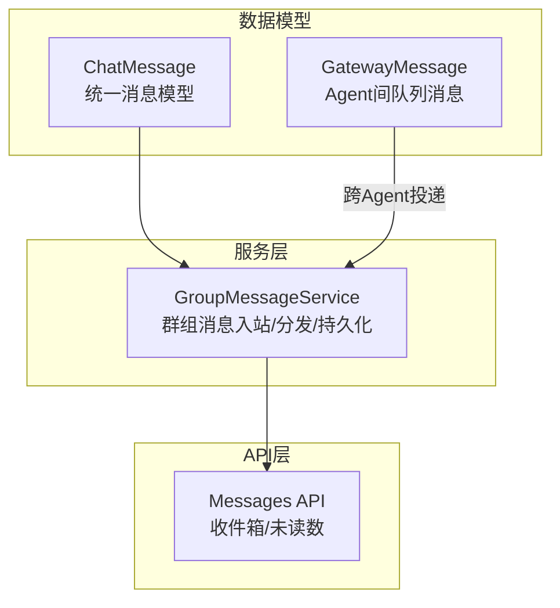
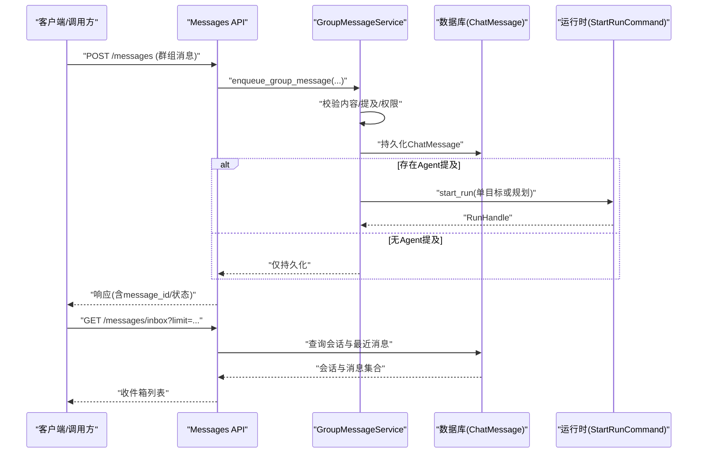
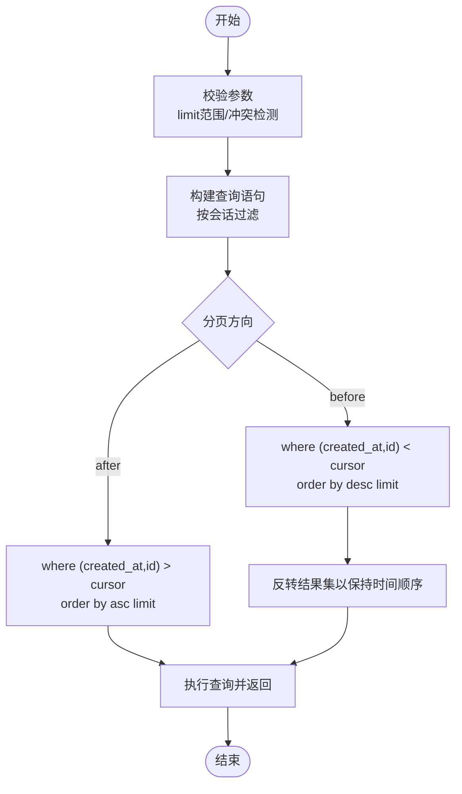
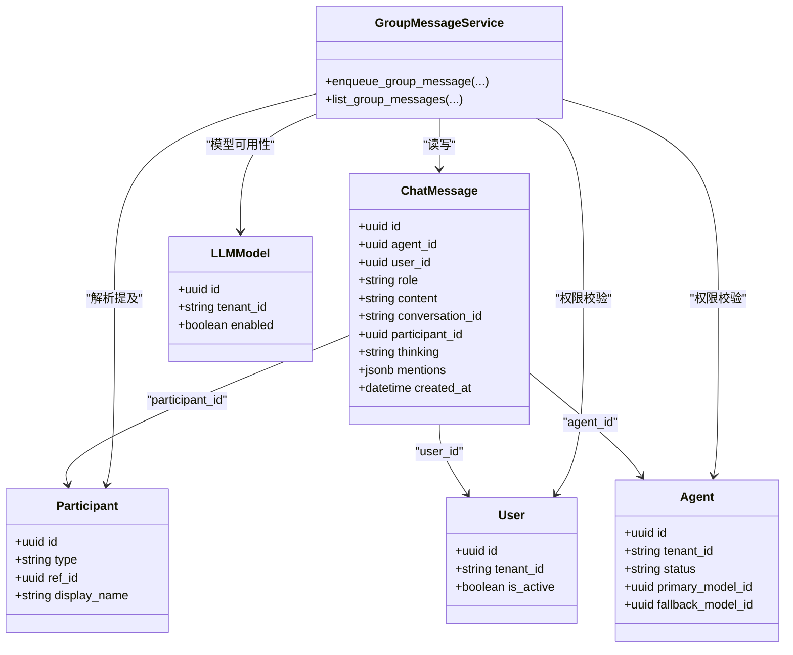

# 消息格式规范

<cite>
**本文引用的文件**   
- [backend/app/models/audit.py](file://backend/app/models/audit.py)
- [backend/app/services/group_message_service.py](file://backend/app/services/group_message_service.py)
- [backend/app/api/messages.py](file://backend/app/api/messages.py)
- [backend/app/models/gateway_message.py](file://backend/app/models/gateway_message.py)
</cite>

## 目录
1. [引言](#引言)
2. [项目结构](#项目结构)
3. [核心组件](#核心组件)
4. [架构总览](#架构总览)
5. [详细组件分析](#详细组件分析)
6. [依赖分析](#依赖分析)
7. [性能考虑](#性能考虑)
8. [故障排查指南](#故障排查指南)
9. [结论](#结论)
10. [附录](#附录)

## 引言
本规范面向Clawith平台的消息系统，定义统一的ChatMessage模型与消息格式，覆盖角色语义、富文本与多媒体编码约定、游标分页与时间排序规则、验证与安全策略，以及序列化/反序列化的完整示例。该规范基于后端数据模型与服务实现进行提炼，确保前后端与多通道（群组、Agent间）一致性与可演进性。

## 项目结构
与消息系统相关的核心代码主要分布在以下位置：
- 数据模型：消息实体定义位于审计模块的数据库模型中，包含id、role、content、created_at等字段及索引。
- 服务层：群组消息的入站处理、提及解析、持久化与运行时调度由群组消息服务完成。
- API层：提供收件箱与未读数查询接口，用于展示最近消息与统计。
- 网关消息：面向OpenClaw Agent通信的队列消息模型，用于跨Agent路由与状态跟踪。

图表来源
- [backend/app/models/audit.py:46-77](file://backend/app/models/audit.py#L46-L77)
- [backend/app/models/gateway_message.py:13-38](file://backend/app/models/gateway_message.py#L13-L38)
- [backend/app/services/group_message_service.py:615-747](file://backend/app/services/group_message_service.py#L615-L747)
- [backend/app/api/messages.py:26-101](file://backend/app/api/messages.py#L26-L101)

章节来源
- [backend/app/models/audit.py:46-77](file://backend/app/models/audit.py#L46-L77)
- [backend/app/models/gateway_message.py:13-38](file://backend/app/models/gateway_message.py#L13-L38)
- [backend/app/services/group_message_service.py:615-747](file://backend/app/services/group_message_service.py#L615-L747)
- [backend/app/api/messages.py:26-101](file://backend/app/api/messages.py#L26-L101)

## 核心组件
- ChatMessage模型
  - 字段：id、agent_id、user_id、role、content、conversation_id、participant_id、thinking、mentions、created_at
  - 约束：role为枚举值；content非空；conversation_id用于会话分组；created_at带时区并建索引
- GroupMessageService
  - 负责群组消息的校验、去重、提及解析、持久化与运行时命令生成（单目标或规划模式）
  - 提供游标分页读取接口，使用(created_at, id)作为稳定位置键
- Messages API
  - 提供收件箱与未读数接口，按会话最近消息聚合返回

章节来源
- [backend/app/models/audit.py:46-77](file://backend/app/models/audit.py#L46-L77)
- [backend/app/services/group_message_service.py:615-747](file://backend/app/services/group_message_service.py#L615-L747)
- [backend/app/api/messages.py:26-101](file://backend/app/api/messages.py#L26-L101)

## 架构总览
消息从客户端或服务侧进入后，经过服务层校验与解析，持久化为ChatMessage，并根据提及触发运行时的单目标或规划任务。读取侧通过游标分页获取历史消息，API层聚合会话最新几条消息形成收件箱视图。

图表来源
- [backend/app/services/group_message_service.py:615-747](file://backend/app/services/group_message_service.py#L615-L747)
- [backend/app/api/messages.py:26-101](file://backend/app/api/messages.py#L26-L101)

## 详细组件分析

### ChatMessage模型与字段规范
- id：UUID主键，唯一标识消息
- agent_id/user_id：可选，分别表示关联的Agent或用户
- role：枚举类型，支持"user"、"assistant"、"system"、"tool_call"
- content：文本主体，长度受服务层限制
- conversation_id：字符串，会话ID（如群组session.id），用于消息分组
- participant_id：统一参与者标识（User/Agent）
- thinking：可选，模型思考过程
- mentions：JSONB数组，存储提及元数据（参与者的有效性与触发信息）
- created_at：带时区的创建时间戳，用于排序与游标定位

角色差异说明
- user：来自真实用户的输入，通常包含用户意图与上下文
- assistant：助手回复，可能包含工具调用结果或结构化输出
- system：系统消息，用于状态提示、错误回退或内部通知
- tool_call：工具调用指令，携带参数与执行目标

富文本与多媒体约定
- 当前content字段为纯文本；如需富文本或多媒体，建议在mentions或扩展字段中以结构化方式描述（例如图片URL、视频缩略图、附件元数据），并在前端渲染层解析
- 文件附件建议采用“引用+元数据”的方式：在mentions中记录文件ID、名称、大小、MIME类型与访问令牌，避免直接嵌入大对象

章节来源
- [backend/app/models/audit.py:46-77](file://backend/app/models/audit.py#L46-L77)
- [backend/app/services/group_message_service.py:404-456](file://backend/app/services/group_message_service.py#L404-L456)

### 消息验证规则与长度限制
- 内容必填且非空白
- 最大长度限制：_MAX_CONTENT_LENGTH = 1,000,000字符
- 提及数量上限：_MAX_MENTIONS = 100，重复提及将被去重
- 发送者权限校验：必须为活跃成员（用户或可用Agent）
- 幂等性：相同message_id的重复提交需保证不可变字段一致，否则拒绝

章节来源
- [backend/app/services/group_message_service.py:108-129](file://backend/app/services/group_message_service.py#L108-L129)
- [backend/app/services/group_message_service.py:404-456](file://backend/app/services/group_message_service.py#L404-L456)

### 安全过滤策略
- 白名单错误语义：将内部规划失败映射为用户可读的错误码与消息
- 参与者有效性校验：仅允许活跃的租户用户与可用Agent
- 模型可用性检查：提及的Agent需绑定可用的LLM模型
- 会话与租户隔离：所有查询均限定tenant_id与deleted_at过滤

章节来源
- [backend/app/services/group_message_service.py:41-46](file://backend/app/services/group_message_service.py#L41-L46)
- [backend/app/services/group_message_service.py:131-236](file://backend/app/services/group_message_service.py#L131-L236)
- [backend/app/services/group_message_service.py:255-401](file://backend/app/services/group_message_service.py#L255-L401)

### 消息游标机制与分页查询
- 游标键：(created_at, id)组成的复合位置键，保证严格有序与稳定分页
- 分页方向：
  - after：按(created_at, id)升序取下一页
  - before：按(created_at, id)降序取上一页
- 限制范围：limit必须在1到500之间
- 冲突检测：同时传入before与after将报错

图表来源
- [backend/app/services/group_message_service.py:750-797](file://backend/app/services/group_message_service.py#L750-L797)

章节来源
- [backend/app/services/group_message_service.py:750-797](file://backend/app/services/group_message_service.py#L750-L797)

### 时间排序规则
- 读取默认按created_at降序排列，辅以id降序保证稳定性
- 新增消息时更新会话last_message_at，便于收件箱排序
- 规划失败的系统消息会在原消息时间戳基础上微增，确保时序正确

章节来源
- [backend/app/services/group_message_service.py:404-456](file://backend/app/services/group_message_service.py#L404-L456)
- [backend/app/services/group_message_service.py:577-612](file://backend/app/services/group_message_service.py#L577-L612)

### 消息序列化与反序列化示例
- 写入路径：
  - 客户端提交content与mention_participant_ids
  - 服务层校验并持久化为ChatMessage，返回message_id与created_at
  - 若存在Agent提及，生成StartRunCommand并启动运行时任务
- 读取路径：
  - 客户端通过(before/after, limit)游标分页获取ChatMessage列表
  - API层聚合每个会话的最新若干条消息，组装收件箱视图

章节来源
- [backend/app/services/group_message_service.py:615-747](file://backend/app/services/group_message_service.py#L615-L747)
- [backend/app/api/messages.py:26-101](file://backend/app/api/messages.py#L26-L101)

### GatewayMessage（跨Agent消息）
- 用途：面向OpenClaw Agent的队列消息，用于跨Agent通信与结果回传
- 关键字段：id、agent_id、sender_agent_id/sender_user_id、conversation_id、content、status、result、created_at/delivered_at/completed_at
- 生命周期：pending → delivered → completed（或过期）

章节来源
- [backend/app/models/gateway_message.py:13-38](file://backend/app/models/gateway_message.py#L13-L38)

## 依赖分析
- ChatMessage依赖：
  - 与会话ChatSession通过conversation_id关联
  - 与参与者Participant通过participant_id关联
  - 与用户User/Agent通过user_id/agent_id关联
- GroupMessageService依赖：
  - 读取Group、GroupMember、Participant、User、Agent、LLMModel、Tenant
  - 生成StartRunCommand驱动运行时调度
- Messages API依赖：
  - 读取ChatSession与ChatMessage，聚合最近消息

图表来源
- [backend/app/models/audit.py:46-77](file://backend/app/models/audit.py#L46-L77)
- [backend/app/services/group_message_service.py:255-401](file://backend/app/services/group_message_service.py#L255-L401)

章节来源
- [backend/app/models/audit.py:46-77](file://backend/app/models/audit.py#L46-L77)
- [backend/app/services/group_message_service.py:255-401](file://backend/app/services/group_message_service.py#L255-L401)

## 性能考虑
- 索引利用：created_at与conversation_id建有索引，提升按会话与时间范围的查询效率
- 游标分页：使用复合位置键避免深分页开销，减少全表扫描
- 批量读取：收件箱接口限制limit并只取每条会话最近若干条消息，降低网络与渲染压力
- 运行时调度：仅在存在Agent提及时触发start_run，避免不必要的计算

[本节为通用指导，不直接分析具体文件]

## 故障排查指南
- 常见错误码与含义：
  - group_message_invalid：内容为空或超长
  - group_mentions_invalid：提及数量超限
  - group_not_found / group_session_not_found：群组或会话不存在
  - group_access_denied：非活跃成员
  - group_sender_invalid：发送者无效（用户/Agent状态不符）
  - group_mention_dispatch_invalid：提及解析缺失必要身份或位置
  - group_message_limit_invalid：limit不在1~500范围内
  - group_message_cursor_conflict：同时传入before与after
- 排查步骤：
  - 检查content长度与空白情况
  - 校验mention_participant_ids是否属于活跃成员
  - 确认会话与租户隔离条件
  - 查看运行时调度是否成功（StartRunCommand与RunHandle）

章节来源
- [backend/app/services/group_message_service.py:48-54](file://backend/app/services/group_message_service.py#L48-L54)
- [backend/app/services/group_message_service.py:108-129](file://backend/app/services/group_message_service.py#L108-L129)
- [backend/app/services/group_message_service.py:750-797](file://backend/app/services/group_message_service.py#L750-L797)

## 结论
本规范明确了Clawith平台消息系统的统一数据模型、角色语义、验证与安全策略、游标分页与时序规则，并为富文本与多媒体扩展预留了结构化空间。遵循该规范可实现前后端一致、可扩展且高性能的消息处理能力。

[本节为总结，不直接分析具体文件]

## 附录
- 富文本与多媒体扩展建议：
  - 在mentions中增加type、payload（如url、mimeType、size、thumbnailUrl）等字段
  - 前端根据type渲染不同媒体组件
- 序列化/反序列化最佳实践：
  - 写入时严格校验并规范化content与mentions
  - 读取时按游标分页，保持(created_at, id)顺序一致性
  - 对敏感字段进行脱敏与最小化传输

[本节为概念性补充，不直接分析具体文件]