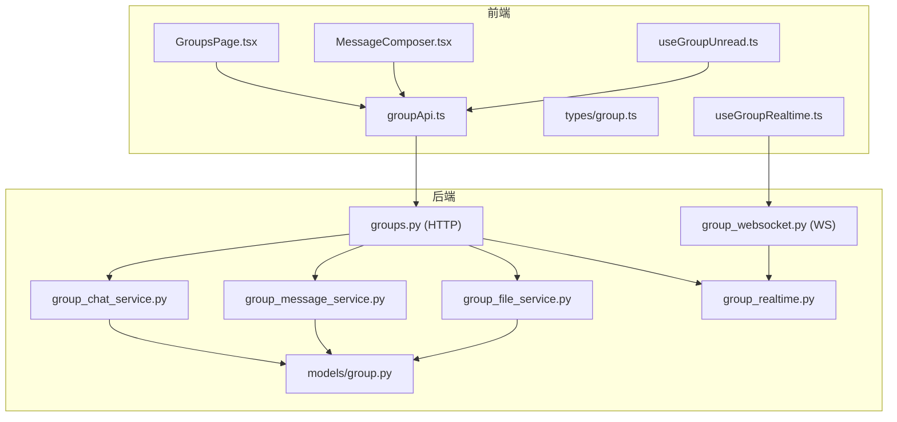
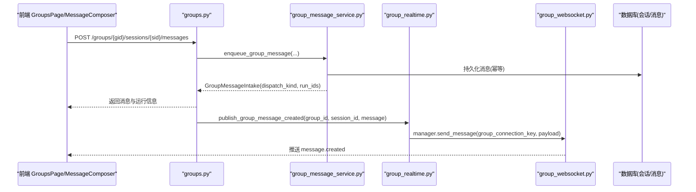
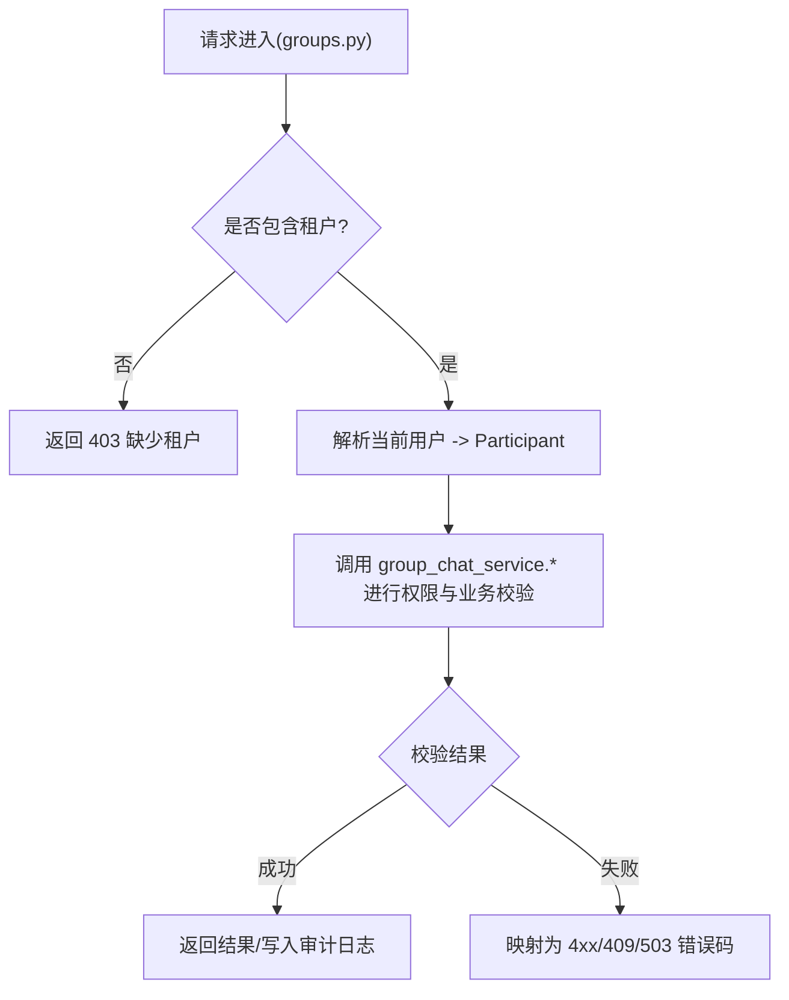
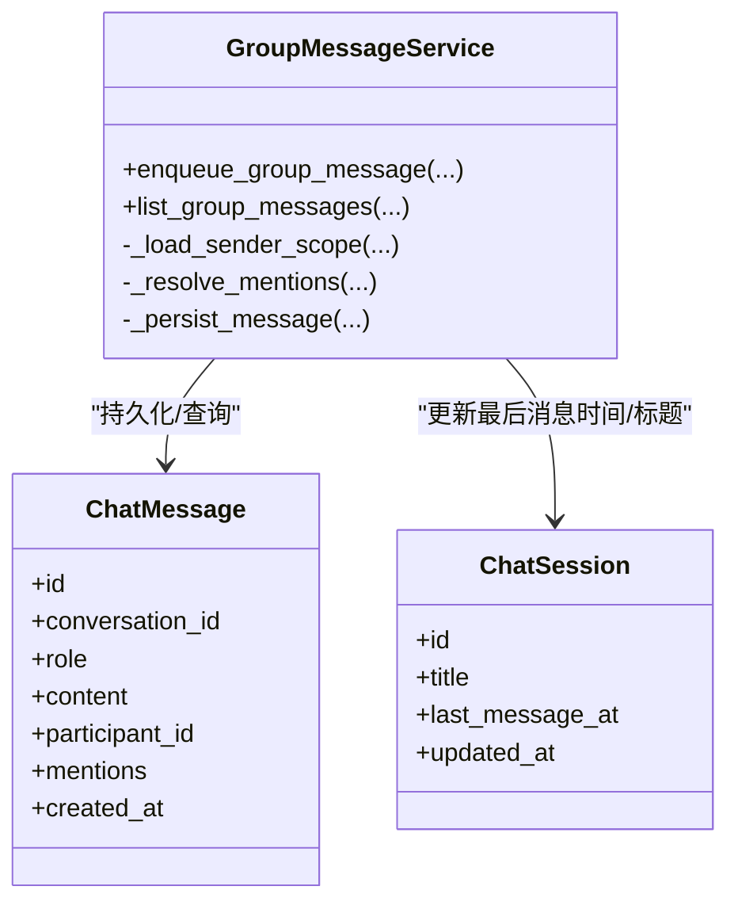
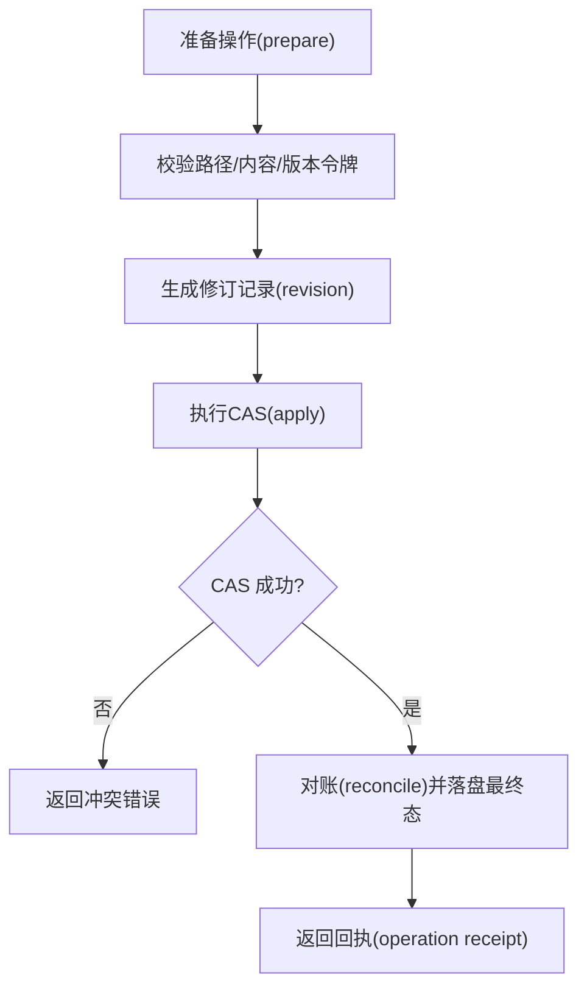
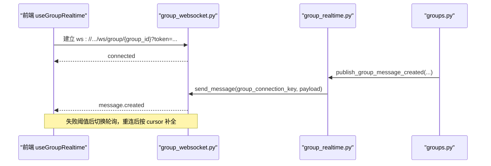
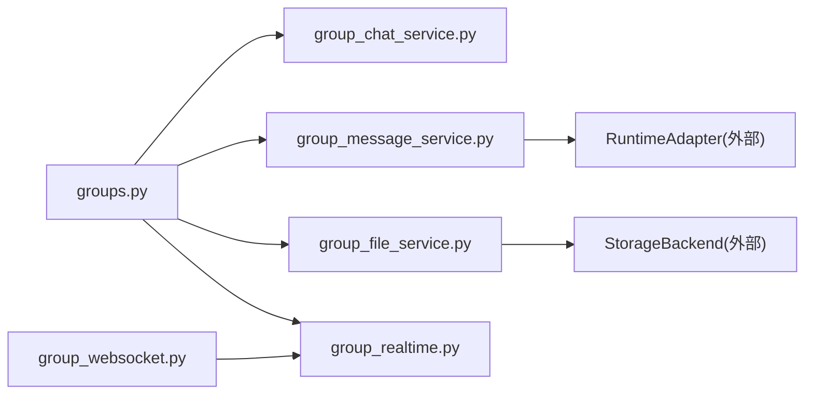

# 群组聊天功能

<cite>
**本文引用的文件**   
- [backend/app/api/groups.py](file://backend/app/api/groups.py)
- [backend/app/api/group_websocket.py](file://backend/app/api/group_websocket.py)
- [backend/app/services/group_chat_service.py](file://backend/app/services/group_chat_service.py)
- [backend/app/services/group_message_service.py](file://backend/app/services/group_message_service.py)
- [backend/app/services/group_file_service.py](file://backend/app/services/group_file_service.py)
- [backend/app/services/group_realtime.py](file://backend/app/services/group_realtime.py)
- [backend/app/models/group.py](file://backend/app/models/group.py)
- [frontend/src/services/groupApi.ts](file://frontend/src/services/groupApi.ts)
- [frontend/src/types/group.ts](file://frontend/src/types/group.ts)
- [frontend/src/hooks/useGroupRealtime.ts](file://frontend/src/hooks/useGroupRealtime.ts)
- [frontend/src/hooks/useGroupUnread.ts](file://frontend/src/hooks/useGroupUnread.ts)
- [frontend/src/pages/groups/GroupsPage.tsx](file://frontend/src/pages/groups/GroupsPage.tsx)
- [frontend/src/pages/groups/MessageComposer.tsx](file://frontend/src/pages/groups/MessageComposer.tsx)
- [frontend/src/pages/groups/CreateGroupModal.tsx](file://frontend/src/pages/groups/CreateGroupModal.tsx)
</cite>

## 目录
1. [简介](#简介)
2. [项目结构](#项目结构)
3. [核心组件](#核心组件)
4. [架构总览](#架构总览)
5. [详细组件分析](#详细组件分析)
6. [依赖关系分析](#依赖关系分析)
7. [性能考虑](#性能考虑)
8. [故障排查指南](#故障排查指南)
9. [结论](#结论)
10. [附录：API 使用示例与最佳实践](#附录api-使用示例与最佳实践)

## 简介
本文件面向 Clawith 平台的“群组聊天”能力，系统性说明以下方面：
- 群组创建、成员管理、权限控制机制
- 消息发送、历史消息查询、未读统计
- 文件共享、协作编辑、版本管理（公告、Agent 记忆、工作区）
- @提及、消息搜索、消息转发等交互特性
- 群组设置、通知配置、隐私控制选项
- 后端 API 与前端调用方式、WebSocket 实时推送、错误码与重试策略
- 最佳实践与常见问题排查

## 项目结构
群组聊天由后端 FastAPI 路由、领域服务、数据模型以及前端 React 页面、类型定义、API 客户端和实时 Hook 共同组成。关键路径如下：
- 后端 HTTP API：/api/groups/*
- 后端 WebSocket：/ws/group/{group_id}
- 领域服务：群组、消息、文件、实时广播
- 前端：群组列表页、会话与消息流、@提及输入框、未读数聚合、实时连接

**图表来源** 
- [backend/app/api/groups.py](file://backend/app/api/groups.py)
- [backend/app/api/group_websocket.py](file://backend/app/api/group_websocket.py)
- [backend/app/services/group_chat_service.py](file://backend/app/services/group_chat_service.py)
- [backend/app/services/group_message_service.py](file://backend/app/services/group_message_service.py)
- [backend/app/services/group_file_service.py](file://backend/app/services/group_file_service.py)
- [backend/app/services/group_realtime.py](file://backend/app/services/group_realtime.py)
- [backend/app/models/group.py](file://backend/app/models/group.py)
- [frontend/src/services/groupApi.ts](file://frontend/src/services/groupApi.ts)
- [frontend/src/types/group.ts](file://frontend/src/types/group.ts)
- [frontend/src/hooks/useGroupRealtime.ts](file://frontend/src/hooks/useGroupRealtime.ts)
- [frontend/src/hooks/useGroupUnread.ts](file://frontend/src/hooks/useGroupUnread.ts)
- [frontend/src/pages/groups/GroupsPage.tsx](file://frontend/src/pages/groups/GroupsPage.tsx)
- [frontend/src/pages/groups/MessageComposer.tsx](file://frontend/src/pages/groups/MessageComposer.tsx)

**章节来源**
- [backend/app/api/groups.py](file://backend/app/api/groups.py)
- [backend/app/api/group_websocket.py](file://backend/app/api/group_websocket.py)
- [backend/app/services/group_chat_service.py](file://backend/app/services/group_chat_service.py)
- [backend/app/services/group_message_service.py](file://backend/app/services/group_message_service.py)
- [backend/app/services/group_file_service.py](file://backend/app/services/group_file_service.py)
- [backend/app/services/group_realtime.py](file://backend/app/services/group_realtime.py)
- [backend/app/models/group.py](file://backend/app/models/group.py)
- [frontend/src/services/groupApi.ts](file://frontend/src/services/groupApi.ts)
- [frontend/src/types/group.ts](file://frontend/src/types/group.ts)
- [frontend/src/hooks/useGroupRealtime.ts](file://frontend/src/hooks/useGroupRealtime.ts)
- [frontend/src/hooks/useGroupUnread.ts](file://frontend/src/hooks/useGroupUnread.ts)
- [frontend/src/pages/groups/GroupsPage.tsx](file://frontend/src/pages/groups/GroupsPage.tsx)
- [frontend/src/pages/groups/MessageComposer.tsx](file://frontend/src/pages/groups/MessageComposer.tsx)

## 核心组件
- 群组与成员模型：Group、GroupMember，支持角色（manager/member）、软删除、会话读状态 JSONB
- 群组服务：创建/更新/删除群组、成员邀请/移除、候选者列举、会话授权
- 消息服务：幂等写入、@提及解析、单 Agent 或规划任务分发、分页查询
- 文件服务：公告、Agent 记忆、工作区读写、CAS 版本令牌、修订记录
- 实时推送：按 group_id 命名空间的消息广播、WebSocket 鉴权与会话重连
- 前端：群组树、会话与消息流、@提及输入、未读数聚合、向后/向前游标翻页

**章节来源**
- [backend/app/models/group.py](file://backend/app/models/group.py)
- [backend/app/services/group_chat_service.py](file://backend/app/services/group_chat_service.py)
- [backend/app/services/group_message_service.py](file://backend/app/services/group_message_service.py)
- [backend/app/services/group_file_service.py](file://backend/app/services/group_file_service.py)
- [backend/app/services/group_realtime.py](file://backend/app/services/group_realtime.py)
- [frontend/src/services/groupApi.ts](file://frontend/src/services/groupApi.ts)
- [frontend/src/types/group.ts](file://frontend/src/types/group.ts)
- [frontend/src/hooks/useGroupRealtime.ts](file://frontend/src/hooks/useGroupRealtime.ts)
- [frontend/src/hooks/useGroupUnread.ts](file://frontend/src/hooks/useGroupUnread.ts)

## 架构总览
群组聊天的整体流程包括：
- HTTP 接口负责群、成员、会话、消息、文件的 CRUD 与校验
- 消息写入后通过实时通道向同组活跃人类成员推送
- 前端通过 REST 获取历史，通过 WebSocket 接收新消息，失败时回退为轮询
- 文件操作采用“准备-执行-对账”的 CAS 模式，保证并发安全与可审计

**图表来源** 
- [backend/app/api/groups.py](file://backend/app/api/groups.py)
- [backend/app/services/group_message_service.py](file://backend/app/services/group_message_service.py)
- [backend/app/services/group_realtime.py](file://backend/app/services/group_realtime.py)
- [backend/app/api/group_websocket.py](file://backend/app/api/group_websocket.py)

**章节来源**
- [backend/app/api/groups.py](file://backend/app/api/groups.py)
- [backend/app/services/group_message_service.py](file://backend/app/services/group_message_service.py)
- [backend/app/services/group_realtime.py](file://backend/app/services/group_realtime.py)
- [backend/app/api/group_websocket.py](file://backend/app/api/group_websocket.py)

## 详细组件分析

### 群组与成员管理
- 创建群组：校验租户与创建者身份，初始化群组与创建者为 manager，可选初始成员
- 成员候选：按 user/agent 两类枚举，过滤已存在成员与不可见 Agent
- 邀请/移除：幂等加入（复用 removed_at 行），移除需 manager 权限且保留至少一个 manager
- 会话授权：所有会话级操作需先验证参与者为活跃成员

**图表来源** 
- [backend/app/api/groups.py](file://backend/app/api/groups.py)
- [backend/app/services/group_chat_service.py](file://backend/app/services/group_chat_service.py)

**章节来源**
- [backend/app/api/groups.py](file://backend/app/api/groups.py)
- [backend/app/services/group_chat_service.py](file://backend/app/services/group_chat_service.py)

### 消息发送与历史查询
- 幂等写入：客户端提供 message_id，服务端比对不可变字段避免重复
- @提及解析：仅允许活跃成员；若为 Agent 则触发单 Agent 运行或多 Agent 规划任务
- 分页游标：基于 (created_at, id) 的严格顺序，支持 before/after 两种方向
- 未读计数：会话级别维护 last_read_message_id，前端聚合 unread_count

**图表来源** 
- [backend/app/services/group_message_service.py](file://backend/app/services/group_message_service.py)

**章节来源**
- [backend/app/services/group_message_service.py](file://backend/app/services/group_message_service.py)
- [frontend/src/services/groupApi.ts](file://frontend/src/services/groupApi.ts)
- [frontend/src/types/group.ts](file://frontend/src/types/group.ts)

### 文件共享与协作编辑（公告、Agent 记忆、工作区）
- 公告与 Agent 记忆：文本文件，支持版本令牌 CAS 写、删除与读取
- 工作区：相对路径规范化、禁止危险扩展名、二进制与文本分别处理
- 版本与修订：prepare -> apply -> reconcile 三段式，确保一次 CAS 与审计追踪
- 权限：人类成员可写公告/记忆，Agent 只读；工作区写需成员授权

**图表来源** 
- [backend/app/services/group_file_service.py](file://backend/app/services/group_file_service.py)

**章节来源**
- [backend/app/services/group_file_service.py](file://backend/app/services/group_file_service.py)
- [frontend/src/services/groupApi.ts](file://frontend/src/services/groupApi.ts)

### 实时推送与未读统计
- WebSocket 鉴权：token 解码 + 组成员校验，周期性重验
- 推送通道：按 group_id 命名空间，消息体与 HTTP 输出一致
- 前端回退：连续失败阈值后切换轮询，断线重连自动补全
- 未读数：侧边栏聚合各会话 unread_count，定时刷新

**图表来源** 
- [backend/app/api/group_websocket.py](file://backend/app/api/group_websocket.py)
- [backend/app/services/group_realtime.py](file://backend/app/services/group_realtime.py)
- [frontend/src/hooks/useGroupRealtime.ts](file://frontend/src/hooks/useGroupRealtime.ts)

**章节来源**
- [backend/app/api/group_websocket.py](file://backend/app/api/group_websocket.py)
- [backend/app/services/group_realtime.py](file://backend/app/services/group_realtime.py)
- [frontend/src/hooks/useGroupRealtime.ts](file://frontend/src/hooks/useGroupRealtime.ts)
- [frontend/src/hooks/useGroupUnread.ts](file://frontend/src/hooks/useGroupUnread.ts)

### @提及、消息搜索与转发
- @提及：前端维护绑定（participant_id/type/text），后端仅信任 participant_id 解析
- 搜索：历史消息通过游标分页；全文检索可在上层构建索引（当前文档不实现）
- 转发：可通过复制消息 ID 与游标定位，结合 after/before 拉取上下文片段

**章节来源**
- [frontend/src/pages/groups/MessageComposer.tsx](file://frontend/src/pages/groups/MessageComposer.tsx)
- [backend/app/services/group_message_service.py](file://backend/app/services/group_message_service.py)
- [frontend/src/services/groupApi.ts](file://frontend/src/services/groupApi.ts)

### 群组设置、通知配置与隐私控制
- 设置：名称、描述、会话标题、主会话标记
- 通知：WebSocket 推送为主，轮询为降级；未读数聚合用于侧边栏
- 隐私：租户隔离、成员可见性、Agent 访问模式（private 不可入组）

**章节来源**
- [backend/app/api/groups.py](file://backend/app/api/groups.py)
- [backend/app/services/group_chat_service.py](file://backend/app/services/group_chat_service.py)
- [frontend/src/hooks/useGroupUnread.ts](file://frontend/src/hooks/useGroupUnread.ts)

## 依赖关系分析
- HTTP 路由依赖领域服务进行权限与业务校验，并将领域异常映射为 HTTP 状态码
- 消息服务依赖运行时适配器启动 Agent 运行（单 Agent 或规划）
- 文件服务依赖存储后端与修订系统，保证并发安全与审计
- 实时模块依赖 WebSocket 管理器，按 group_id 广播

**图表来源** 
- [backend/app/api/groups.py](file://backend/app/api/groups.py)
- [backend/app/services/group_chat_service.py](file://backend/app/services/group_chat_service.py)
- [backend/app/services/group_message_service.py](file://backend/app/services/group_message_service.py)
- [backend/app/services/group_file_service.py](file://backend/app/services/group_file_service.py)
- [backend/app/services/group_realtime.py](file://backend/app/services/group_realtime.py)
- [backend/app/api/group_websocket.py](file://backend/app/api/group_websocket.py)

**章节来源**
- [backend/app/api/groups.py](file://backend/app/api/groups.py)
- [backend/app/services/group_chat_service.py](file://backend/app/services/group_chat_service.py)
- [backend/app/services/group_message_service.py](file://backend/app/services/group_message_service.py)
- [backend/app/services/group_file_service.py](file://backend/app/services/group_file_service.py)
- [backend/app/services/group_realtime.py](file://backend/app/services/group_realtime.py)
- [backend/app/api/group_websocket.py](file://backend/app/api/group_websocket.py)

## 性能考虑
- 消息分页：基于 (created_at, id) 的强序游标，避免偏移量扫描
- 未读数聚合：前端缓存同一 key，减少重复请求
- 实时回退：WebSocket 失败阈值后切换轮询，限制最大补全页数
- 文件 CAS：最小化锁范围，prepare/apply/reconcile 分离，避免长事务
- 批量候选：成员候选限制上限，避免大结果集

[本节为通用指导，不直接分析具体文件]

## 故障排查指南
- 403 权限不足：检查租户、用户活跃状态、成员资格与角色
- 404 资源不存在：确认 group/session/message/run 是否存在于当前租户
- 409 冲突：消息幂等键不一致、文件版本令牌不匹配、成员已存在
- 503 服务不可用：多 Agent 规划模型不可用或运行时受限
- WebSocket 断开：检查 token、组成员有效性、网络连通性；观察轮询回退

**章节来源**
- [backend/app/api/groups.py](file://backend/app/api/groups.py)
- [backend/app/services/group_message_service.py](file://backend/app/services/group_message_service.py)
- [backend/app/services/group_file_service.py](file://backend/app/services/group_file_service.py)
- [backend/app/api/group_websocket.py](file://backend/app/api/group_websocket.py)
- [frontend/src/hooks/useGroupRealtime.ts](file://frontend/src/hooks/useGroupRealtime.ts)

## 结论
群组聊天以“强一致性+高可用”为目标，通过严格的权限校验、幂等消息、CAS 文件与实时推送，提供了稳定可靠的团队协作体验。前端在 WebSocket 不可用时具备完善的回退策略，保障消息不丢失、界面可用。

[本节为总结性内容，不直接分析具体文件]

## 附录：API 使用示例与最佳实践

### 常用 API 概览（节选）
- 群组
  - POST /api/groups — 创建群组
  - GET /api/groups — 列出我的群组
  - GET /api/groups/{id} — 获取群组详情
  - PATCH /api/groups/{id} — 更新群组
  - DELETE /api/groups/{id} — 软删除群组
- 成员
  - GET /api/groups/{id}/members — 成员列表
  - GET /api/groups/{id}/member-candidates?participant_type=user|agent — 候选者
  - POST /api/groups/{id}/members — 邀请成员
  - DELETE /api/groups/{id}/members/{member_id} — 移除成员
- 会话
  - GET /api/groups/{id}/sessions — 会话列表（含 unread_count）
  - POST /api/groups/{id}/sessions — 新建会话
  - PATCH /api/groups/{id}/sessions/{sid} — 重命名
  - DELETE /api/groups/{id}/sessions/{sid} — 删除会话
  - POST /api/groups/{id}/sessions/{sid}/read — 标记已读
- 消息
  - GET /api/groups/{id}/sessions/{sid}/messages?limit&before|after — 历史消息
  - POST /api/groups/{id}/sessions/{sid}/messages — 发送消息（含 mentions、message_id）
- 运行
  - GET /api/groups/{id}/sessions/{sid}/runs — 活跃运行
  - GET /api/groups/{id}/sessions/{sid}/runs/{runId} — 运行状态
  - POST /api/groups/{id}/sessions/{sid}/runs/{runId}/cancel — 取消运行
- 文件
  - GET/PUT /api/groups/{id}/announcement — 公告
  - GET/PUT/DELETE /api/groups/{id}/agents/{agentId}/memory — Agent 记忆
  - GET /api/groups/{id}/workspace?path — 工作区目录
  - GET/PUT/DELETE /api/groups/{id}/workspace/file?path — 工作区文件
  - POST /api/groups/{id}/workspace/upload?path — 上传二进制文件
  - GET /api/groups/{id}/workspace/download?path&token — 下载链接

**章节来源**
- [backend/app/api/groups.py](file://backend/app/api/groups.py)
- [frontend/src/services/groupApi.ts](file://frontend/src/services/groupApi.ts)

### 最佳实践
- 发送消息
  - 始终携带 client-generated message_id，避免重复提交
  - mentions 仅传 participant_id，显示名由后端解析
  - 合理设置 limit，配合 cursor 分页
- 历史加载
  - 首次无 cursor 拉最新一页；后续用 after 向前推进
  - 断线重连后根据 last cursor 做增量补全
- 文件协作
  - 写前读取 version_token，写时传入 expected_version_token
  - require_absent 用于“仅创建”，避免覆盖
  - 对大型二进制文件优先走 upload 接口
- 实时与未读
  - 监听 message.created 并去重；失败阈值后切换轮询
  - 侧边栏聚合 unread_count，定期刷新
- 权限与安全
  - 所有写操作需通过成员校验；Agent 私有权不可入组
  - 租户隔离，跨租户访问一律拒绝

**章节来源**
- [frontend/src/hooks/useGroupRealtime.ts](file://frontend/src/hooks/useGroupRealtime.ts)
- [frontend/src/services/groupApi.ts](file://frontend/src/services/groupApi.ts)
- [backend/app/services/group_message_service.py](file://backend/app/services/group_message_service.py)
- [backend/app/services/group_file_service.py](file://backend/app/services/group_file_service.py)
- [backend/app/services/group_chat_service.py](file://backend/app/services/group_chat_service.py)