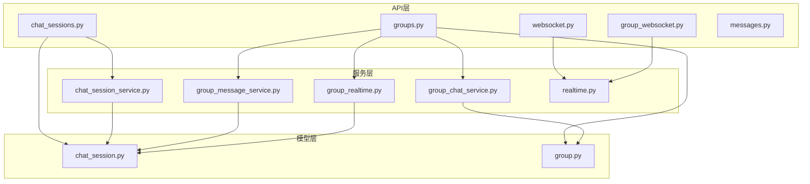
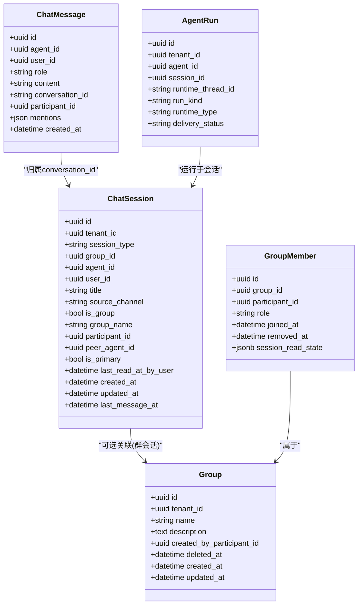
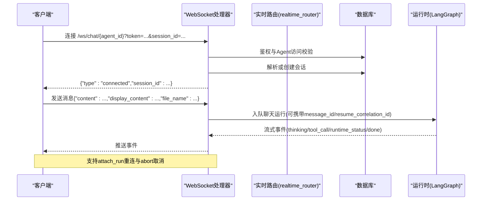
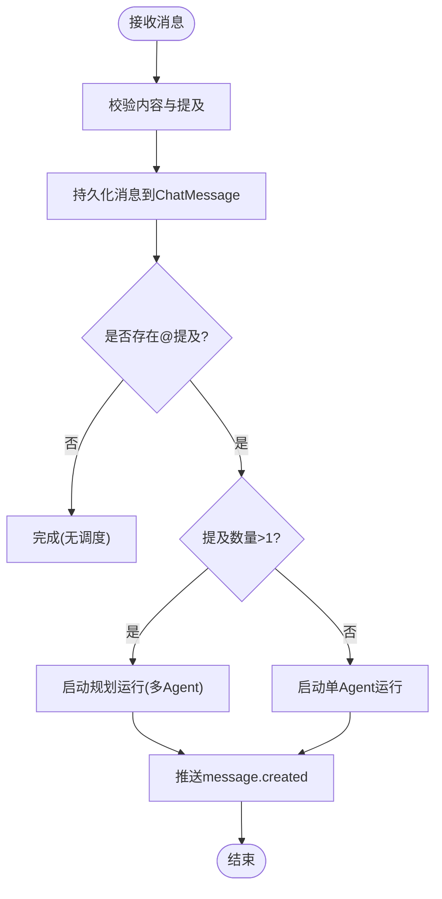
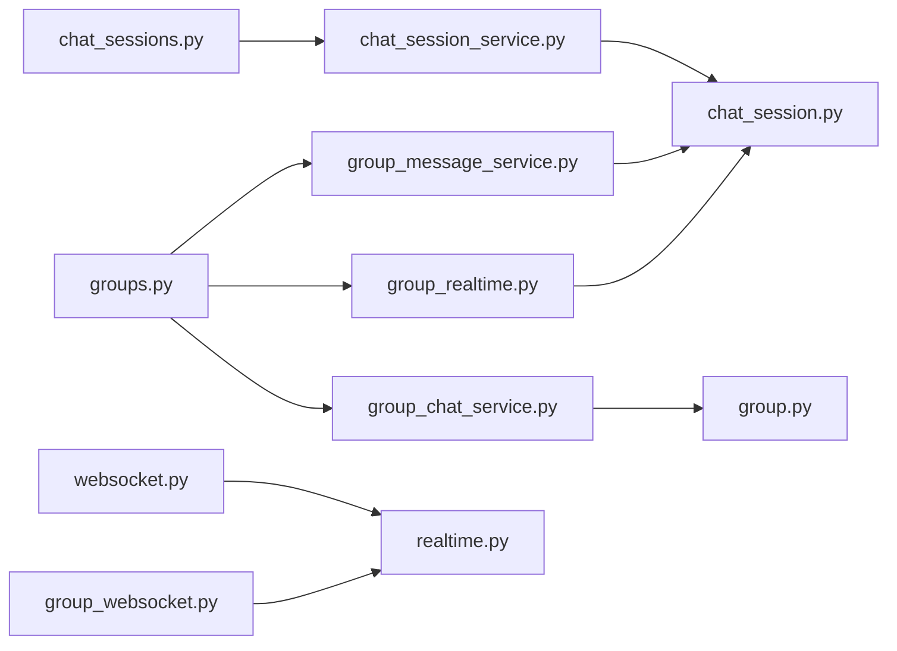

# 聊天会话API

<cite>
**本文引用的文件**   
- [chat_sessions.py](file://backend/app/api/chat_sessions.py)
- [messages.py](file://backend/app/api/messages.py)
- [websocket.py](file://backend/app/api/websocket.py)
- [group_websocket.py](file://backend/app/api/group_websocket.py)
- [groups.py](file://backend/app/api/groups.py)
- [chat_session.py](file://backend/app/models/chat_session.py)
- [group.py](file://backend/app/models/group.py)
- [chat_session_service.py](file://backend/app/services/chat_session_service.py)
- [group_chat_service.py](file://backend/app/services/group_chat_service.py)
- [group_message_service.py](file://backend/app/services/group_message_service.py)
- [group_realtime.py](file://backend/app/services/group_realtime.py)
- [realtime.py](file://backend/app/services/realtime.py)
</cite>

## 目录
1. [简介](#简介)
2. [项目结构](#项目结构)
3. [核心组件](#核心组件)
4. [架构总览](#架构总览)
5. [详细组件分析](#详细组件分析)
6. [依赖关系分析](#依赖关系分析)
7. [性能考虑](#性能考虑)
8. [故障排查指南](#故障排查指南)
9. [结论](#结论)
10. [附录：消息与事件格式](#附录消息与事件格式)

## 简介
本文件为Clawith平台聊天系统的API文档，覆盖以下能力：
- RESTful接口：聊天会话的创建、管理（列表、重命名、删除）、消息分页查询；群组聊天（创建群组、成员管理、会话管理、消息收发）。
- WebSocket实时通信：单Agent对话连接建立、消息发送与流式推送、运行状态与取消/恢复控制；群组聊天的实时推送。
- 群组协作：多人协作、@提及触发Agent任务、多Agent规划、文件共享（工作区文本文件读写）等。
- 消息格式：支持富文本内容、多媒体消息（图片数据内联）、工具调用日志、错误上下文标准化。
- 最佳实践与错误处理：幂等性、游标分页、断线重连、订阅策略、错误码与重试建议。

## 项目结构
后端采用FastAPI路由分层组织：
- API层：REST与WebSocket端点定义在 app/api 下，按功能模块划分（如 chat_sessions.py、groups.py、websocket.py、group_websocket.py、messages.py）。
- 模型层：数据库实体定义在 app/models 下（如 ChatSession、Group、GroupMember）。
- 服务层：领域逻辑封装在 app/services 下（如 chat_session_service、group_chat_service、group_message_service、group_realtime）。
- 实时路由：app/services/realtime.py 提供统一的路由门面，供WS连接管理与跨进程广播。

图表来源
- [chat_sessions.py:1-120](file://backend/app/api/chat_sessions.py#L1-L120)
- [groups.py:1-120](file://backend/app/api/groups.py#L1-L120)
- [websocket.py:1-120](file://backend/app/api/websocket.py#L1-L120)
- [group_websocket.py:1-60](file://backend/app/api/group_websocket.py#L1-L60)
- [messages.py:1-40](file://backend/app/api/messages.py#L1-L40)
- [chat_session.py:1-60](file://backend/app/models/chat_session.py#L1-L60)
- [group.py:1-60](file://backend/app/models/group.py#L1-L60)
- [chat_session_service.py:1-80](file://backend/app/services/chat_session_service.py#L1-L80)
- [group_chat_service.py:1-80](file://backend/app/services/group_chat_service.py#L1-L80)
- [group_message_service.py:1-80](file://backend/app/services/group_message_service.py#L1-L80)
- [group_realtime.py:1-60](file://backend/app/services/group_realtime.py#L1-L60)
- [realtime.py:1-20](file://backend/app/services/realtime.py#L1-L20)

章节来源
- [chat_sessions.py:1-120](file://backend/app/api/chat_sessions.py#L1-L120)
- [groups.py:1-120](file://backend/app/api/groups.py#L1-L120)
- [websocket.py:1-120](file://backend/app/api/websocket.py#L1-L120)
- [group_websocket.py:1-60](file://backend/app/api/group_websocket.py#L1-L60)
- [messages.py:1-40](file://backend/app/api/messages.py#L1-L40)
- [chat_session.py:1-60](file://backend/app/models/chat_session.py#L1-L60)
- [group.py:1-60](file://backend/app/models/group.py#L1-L60)
- [chat_session_service.py:1-80](file://backend/app/services/chat_session_service.py#L1-L80)
- [group_chat_service.py:1-80](file://backend/app/services/group_chat_service.py#L1-L80)
- [group_message_service.py:1-80](file://backend/app/services/group_message_service.py#L1-L80)
- [group_realtime.py:1-60](file://backend/app/services/group_realtime.py#L1-L60)
- [realtime.py:1-20](file://backend/app/services/realtime.py#L1-L20)

## 核心组件
- 会话管理（Direct Chat）：提供租户隔离的会话CRUD、运行时状态查询、工具执行对账、消息分页。
- 群组聊天（Group Chat）：群组生命周期、成员管理、会话管理、消息发布、@提及触发单Agent或多Agent规划、工作区文件操作。
- 实时通信（WebSocket）：Agent对话WS连接、消息流式推送、运行态控制；群组WS连接与消息推送。
- 消息与收件箱：Agent间消息收件箱与未读计数（当前实现返回0占位，可扩展）。

章节来源
- [chat_sessions.py:216-356](file://backend/app/api/chat_sessions.py#L216-L356)
- [chat_sessions.py:358-395](file://backend/app/api/chat_sessions.py#L358-L395)
- [chat_sessions.py:397-560](file://backend/app/api/chat_sessions.py#L397-L560)
- [chat_sessions.py:562-668](file://backend/app/api/chat_sessions.py#L562-L668)
- [chat_sessions.py:794-800](file://backend/app/api/chat_sessions.py#L794-L800)
- [messages.py:26-101](file://backend/app/api/messages.py#L26-L101)
- [groups.py:510-662](file://backend/app/api/groups.py#L510-L662)
- [groups.py:664-800](file://backend/app/api/groups.py#L664-L800)
- [websocket.py:229-392](file://backend/app/api/websocket.py#L229-L392)
- [group_websocket.py:51-118](file://backend/app/api/group_websocket.py#L51-L118)

## 架构总览
聊天系统以“会话”为中心，分为Direct Chat与Group Chat两条主线，并通过统一的ChatSession模型承载不同session_type（direct、group、a2a、trigger）。消息通过ChatMessage持久化，运行时通过AgentRun与LangGraph驱动，WebSocket负责实时推送。

图表来源
- [chat_session.py:23-116](file://backend/app/models/chat_session.py#L23-L116)
- [group.py:24-95](file://backend/app/models/group.py#L24-L95)
- [chat_sessions.py:216-356](file://backend/app/api/chat_sessions.py#L216-L356)
- [groups.py:510-662](file://backend/app/api/groups.py#L510-L662)

## 详细组件分析

### 直接聊天（Direct Chat）会话API
- 列出会话：GET /api/agents/{agent_id}/sessions?scope=mine|all
  - 权限：需具备Agent访问权限；scope=all需要管理员或创建者角色。
  - 返回：会话列表，包含消息数、未读数、参与者类型（user/agent/group）、是否群组等。
- 创建会话：POST /api/agents/{agent_id}/sessions
  - 请求体：title（可选）
  - 行为：在当前租户下为用户创建Direct Chat会话，首个活跃会话提升为主会话。
- 获取运行时状态：GET /api/agents/{agent_id}/sessions/{session_id}/runtime-state
  - 返回：active_run信息（run_id、thread_id、status、waiting_type、can_resume/cancel等），用于前端控制。
- 工具执行对账：POST /api/agents/{agent_id}/sessions/{session_id}/runs/{run_id}/tool-executions/{execution_id}/reconcile
  - 用途：在用户恢复运行前确认未知工具执行结果（applied/not_applied），并记录审计日志。
- 重命名会话：PATCH /api/agents/{agent_id}/sessions/{session_id}
- 删除会话：DELETE /api/agents/{agent_id}/sessions/{session_id}
  - 行为：软删除并取消前台协作运行，必要时修复主会话。
- 消息分页：GET /api/agents/{agent_id}/sessions/{session_id}/messages
  - 参数：limit、before（游标格式ISO时间|UUID）
  - 返回：消息条目，含id、role、content、created_at、cursor。

章节来源
- [chat_sessions.py:216-356](file://backend/app/api/chat_sessions.py#L216-L356)
- [chat_sessions.py:358-395](file://backend/app/api/chat_sessions.py#L358-L395)
- [chat_sessions.py:397-560](file://backend/app/api/chat_sessions.py#L397-L560)
- [chat_sessions.py:562-668](file://backend/app/api/chat_sessions.py#L562-L668)
- [chat_sessions.py:670-731](file://backend/app/api/chat_sessions.py#L670-L731)
- [chat_sessions.py:794-800](file://backend/app/api/chat_sessions.py#L794-L800)

#### Direct Chat WebSocket流程

图表来源
- [websocket.py:229-392](file://backend/app/api/websocket.py#L229-L392)
- [websocket.py:506-562](file://backend/app/api/websocket.py#L506-L562)
- [websocket.py:588-678](file://backend/app/api/websocket.py#L588-L678)
- [websocket.py:679-800](file://backend/app/api/websocket.py#L679-L800)

章节来源
- [websocket.py:229-392](file://backend/app/api/websocket.py#L229-L392)
- [websocket.py:506-562](file://backend/app/api/websocket.py#L506-L562)
- [websocket.py:588-678](file://backend/app/api/websocket.py#L588-L678)
- [websocket.py:679-800](file://backend/app/api/websocket.py#L679-L800)

### 群组聊天（Group Chat）API
- 群组CRUD：
  - 创建：POST /api/groups
  - 列表：GET /api/groups
  - 详情：GET /api/groups/{group_id}
  - 更新：PATCH /api/groups/{group_id}
  - 删除：DELETE /api/groups/{group_id}
- 成员管理：
  - 列表成员：GET /api/groups/{group_id}/members
  - 候选成员：GET /api/groups/{group_id}/member-candidates?participant_type=user|agent
  - 邀请成员：POST /api/groups/{group_id}/members
  - 移除成员：DELETE /api/groups/{group_id}/members/{member_id}
- 会话管理：
  - 列表会话：GET /api/groups/{group_id}/sessions
  - 创建会话：POST /api/groups/{group_id}/sessions
  - 重命名会话：PATCH /api/groups/{group_id}/sessions/{session_id}
  - 标记已读：PATCH /api/groups/{group_id}/sessions/{session_id}/read
  - 读取状态：GET /api/groups/{group_id}/sessions/{session_id}/read-state
- 消息收发：
  - 发送消息：POST /api/groups/{group_id}/sessions/{session_id}/messages
    - 支持mentions数组（@提及），触发单Agent或规划模式（多Agent）。
  - 消息分页：GET /api/groups/{group_id}/sessions/{session_id}/messages?before=...&after=...&limit=...
- 文件共享（工作区文本文件）：
  - 读取：GET /api/groups/{group_id}/workspace/files/{path}
  - 写入：PUT /api/groups/{group_id}/workspace/files/{path}（支持版本令牌与require_absent）
  - 上传：POST /api/groups/{group_id}/workspace/files/{path}/upload
  - 列举：GET /api/groups/{group_id}/workspace/files

章节来源
- [groups.py:510-662](file://backend/app/api/groups.py#L510-L662)
- [groups.py:664-800](file://backend/app/api/groups.py#L664-L800)
- [groups.py:782-800](file://backend/app/api/groups.py#L782-L800)
- [groups.py:800-1200](file://backend/app/api/groups.py#L800-L1200)

#### 群组消息处理流程（含@提及）

图表来源
- [group_message_service.py:615-748](file://backend/app/services/group_message_service.py#L615-L748)
- [group_realtime.py:40-67](file://backend/app/services/group_realtime.py#L40-L67)

章节来源
- [group_message_service.py:615-748](file://backend/app/services/group_message_service.py#L615-L748)
- [group_realtime.py:40-67](file://backend/app/services/group_realtime.py#L40-L67)

#### 群组WebSocket实时通信
- 连接：/ws/group/{group_id}?token=...
- 认证与成员校验：每次心跳周期重新验证成员资格。
- 推送：服务端提交消息后，通过manager.send_message向组内在线成员推送message.created事件。
- 心跳：客户端发送ping，服务端回复pong。

章节来源
- [group_websocket.py:51-118](file://backend/app/api/group_websocket.py#L51-L118)
- [group_realtime.py:40-67](file://backend/app/services/group_realtime.py#L40-L67)

### 消息与收件箱
- 收件箱：GET /api/messages/inbox
  - 返回用户管理的Agent之间的最近消息（基于source_channel='agent'的会话）。
- 未读计数：GET /api/messages/unread-count
  - 当前实现返回0（可扩展为逐条未读追踪）。

章节来源
- [messages.py:26-101](file://backend/app/api/messages.py#L26-L101)

## 依赖关系分析
- API层依赖服务层进行业务编排与权限校验。
- 服务层依赖模型层进行数据持久化与约束。
- WebSocket使用realtime_router统一管理连接与会话路由，支持本地与跨进程广播。
- 群组消息通过group_realtime将已提交的消息推送到在线成员。

图表来源
- [chat_sessions.py:1-120](file://backend/app/api/chat_sessions.py#L1-L120)
- [groups.py:1-120](file://backend/app/api/groups.py#L1-L120)
- [websocket.py:1-120](file://backend/app/api/websocket.py#L1-L120)
- [group_websocket.py:1-60](file://backend/app/api/group_websocket.py#L1-L60)
- [chat_session_service.py:1-80](file://backend/app/services/chat_session_service.py#L1-L80)
- [group_chat_service.py:1-80](file://backend/app/services/group_chat_service.py#L1-L80)
- [group_message_service.py:1-80](file://backend/app/services/group_message_service.py#L1-L80)
- [group_realtime.py:1-60](file://backend/app/services/group_realtime.py#L1-L60)
- [chat_session.py:1-60](file://backend/app/models/chat_session.py#L1-L60)
- [group.py:1-60](file://backend/app/models/group.py#L1-L60)
- [realtime.py:1-20](file://backend/app/services/realtime.py#L1-L20)

章节来源
- [chat_sessions.py:1-120](file://backend/app/api/chat_sessions.py#L1-L120)
- [groups.py:1-120](file://backend/app/api/groups.py#L1-L120)
- [websocket.py:1-120](file://backend/app/api/websocket.py#L1-L120)
- [group_websocket.py:1-60](file://backend/app/api/group_websocket.py#L1-L60)
- [chat_session_service.py:1-80](file://backend/app/services/chat_session_service.py#L1-L80)
- [group_chat_service.py:1-80](file://backend/app/services/group_chat_service.py#L1-L80)
- [group_message_service.py:1-80](file://backend/app/services/group_message_service.py#L1-L80)
- [group_realtime.py:1-60](file://backend/app/services/group_realtime.py#L1-L60)
- [chat_session.py:1-60](file://backend/app/models/chat_session.py#L1-L60)
- [group.py:1-60](file://backend/app/models/group.py#L1-L60)
- [realtime.py:1-20](file://backend/app/services/realtime.py#L1-L20)

## 性能考虑
- 游标分页：消息分页使用(created_at, id)组合游标，避免深翻页性能问题。
- 主会话锁定：Direct Chat主会话切换使用数据库行级锁与事务范围锁，保证一致性。
- 运行时状态读取：通过专用reader读取运行态，减少阻塞。
- 实时推送：使用realtime_router集中管理连接与路由，支持本地与Redis广播，降低耦合。
- 批量查询：会话列表聚合消息计数与未读数时采用分组查询，减少N+1。

[本节为通用指导，不直接分析具体文件]

## 故障排查指南
- 认证失败：WebSocket连接阶段会返回error包，包含code、message、stage、trace_id。检查token有效性及用户存在性。
- Agent过期：连接阶段检测Agent状态，过期则关闭连接并返回特定错误码。
- 会话作用域不匹配：传入session_id与实际会话不一致或权限不足，返回scope_mismatch错误。
- 运行时状态冲突：并发场景下可能产生409冲突，需根据can_resume/can_cancel字段重试或等待。
- 工具执行对账失败：确保correlation_id一致且note非空，否则返回422或409。
- 群组权限错误：成员资格校验失败或角色不足，返回相应错误码。
- 规划模型不可用：多Agent规划失败时返回友好提示，检查租户默认模型配置。

章节来源
- [websocket.py:173-206](file://backend/app/api/websocket.py#L173-L206)
- [websocket.py:294-392](file://backend/app/api/websocket.py#L294-L392)
- [websocket.py:588-678](file://backend/app/api/websocket.py#L588-L678)
- [chat_sessions.py:562-668](file://backend/app/api/chat_sessions.py#L562-L668)
- [groups.py:298-347](file://backend/app/api/groups.py#L298-L347)
- [group_message_service.py:41-46](file://backend/app/services/group_message_service.py#L41-L46)

## 结论
Clawith聊天系统提供了完整的Direct Chat与Group Chat能力，涵盖REST与WebSocket双通道，支持富文本、多媒体、@提及、多Agent规划与工作区文件共享。通过严格的权限校验、幂等性与游标分页机制，保障了高可用与一致性。建议在生产环境中结合错误码与trace_id进行监控与排障，并遵循最佳实践进行断线重连与订阅管理。

[本节为总结，不直接分析具体文件]

## 附录：消息与事件格式
- 消息条目（Direct/Group）：
  - id、role、content、created_at、cursor（ISO时间|UUID）
- WebSocket事件类型（Direct Chat）：
  - connected：连接成功，返回session_id
  - thinking：思考中
  - tool_call：工具调用开始/完成
  - runtime_status：运行时状态
  - done：完成
  - error：错误包，包含code、message、stage、trace_id、run_id、agent_id
- 群组消息事件：
  - message.created：包含message对象（id、role、content、participant_id、sender_name、mentions、created_at、cursor）
- 附件与多媒体：
  - 支持content中包含image_data:data:image/...内联图片数据，日志摘要统计图片数量。

章节来源
- [chat_sessions.py:758-766](file://backend/app/api/chat_sessions.py#L758-L766)
- [websocket.py:165-171](file://backend/app/api/websocket.py#L165-L171)
- [websocket.py:173-206](file://backend/app/api/websocket.py#L173-L206)
- [group_realtime.py:24-38](file://backend/app/services/group_realtime.py#L24-L38)