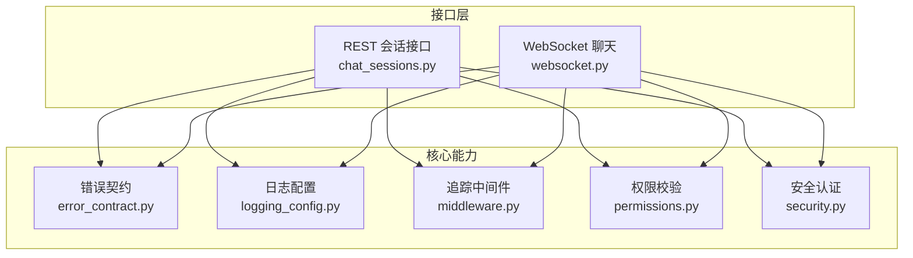
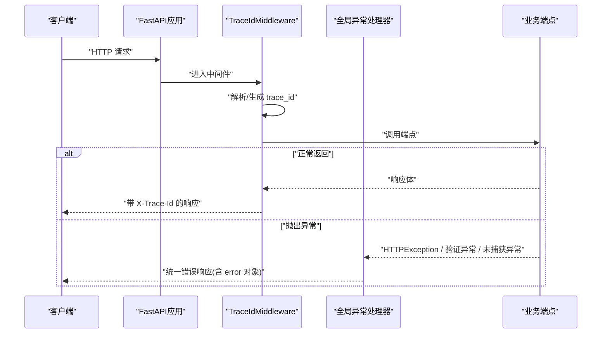
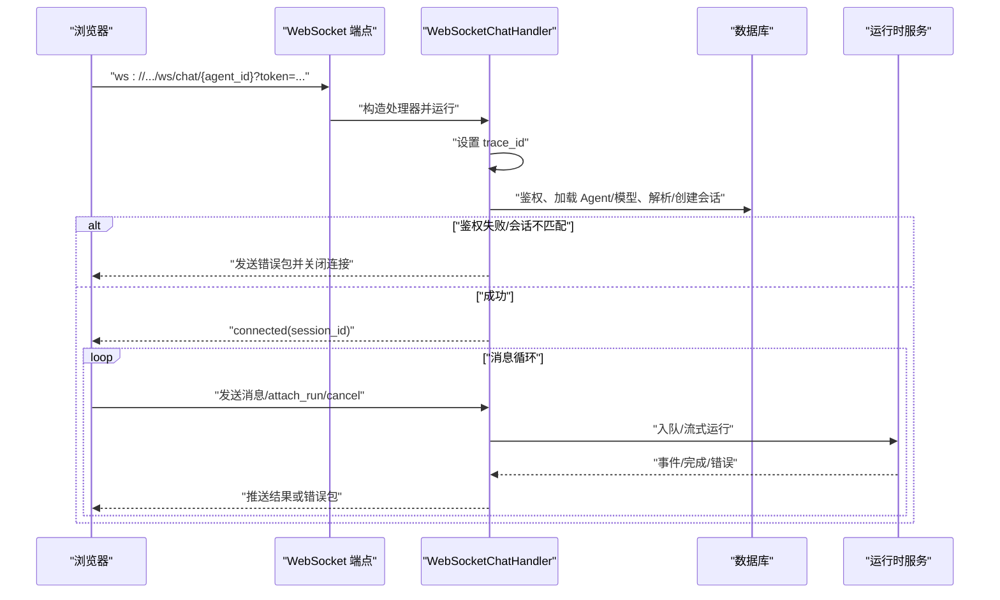
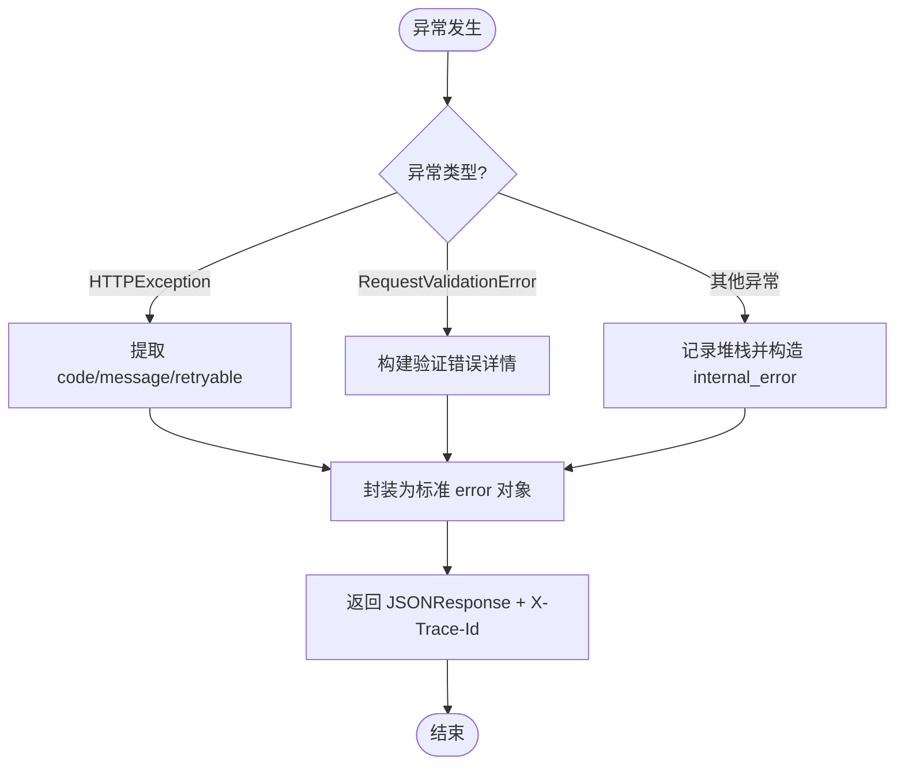
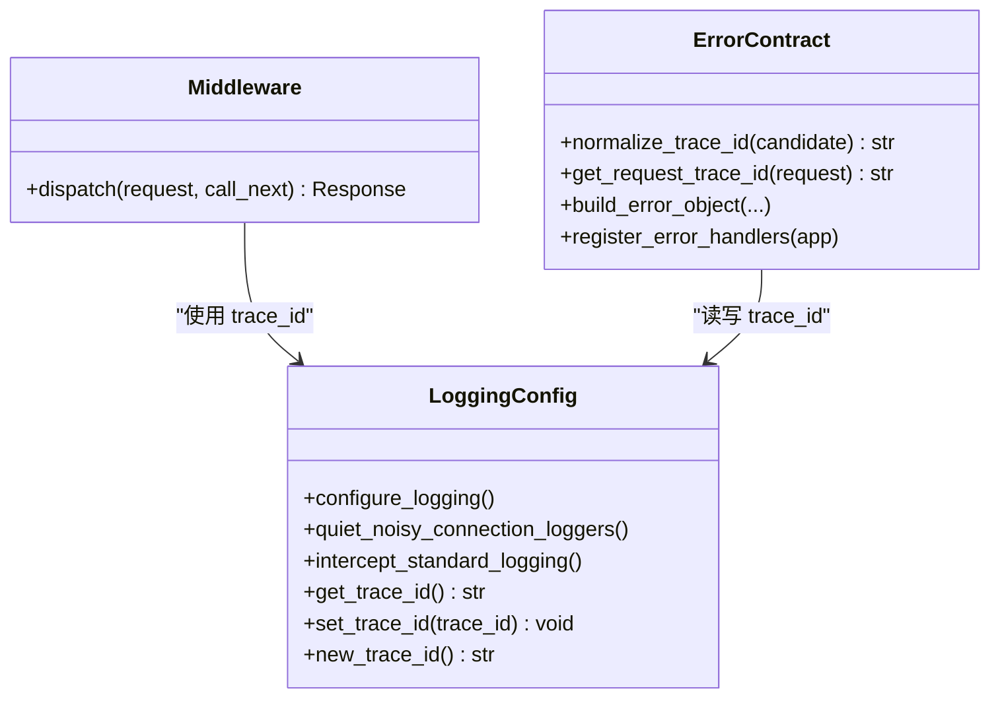
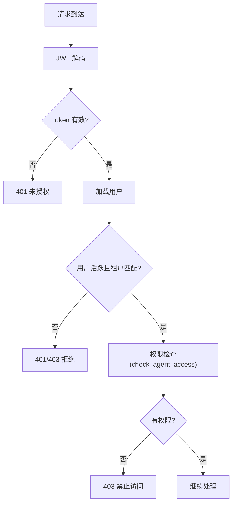
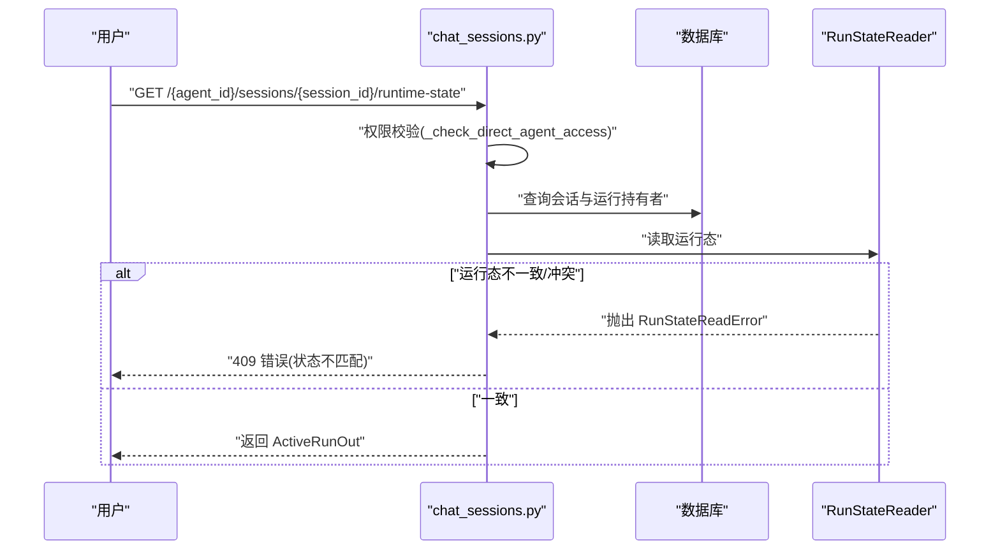
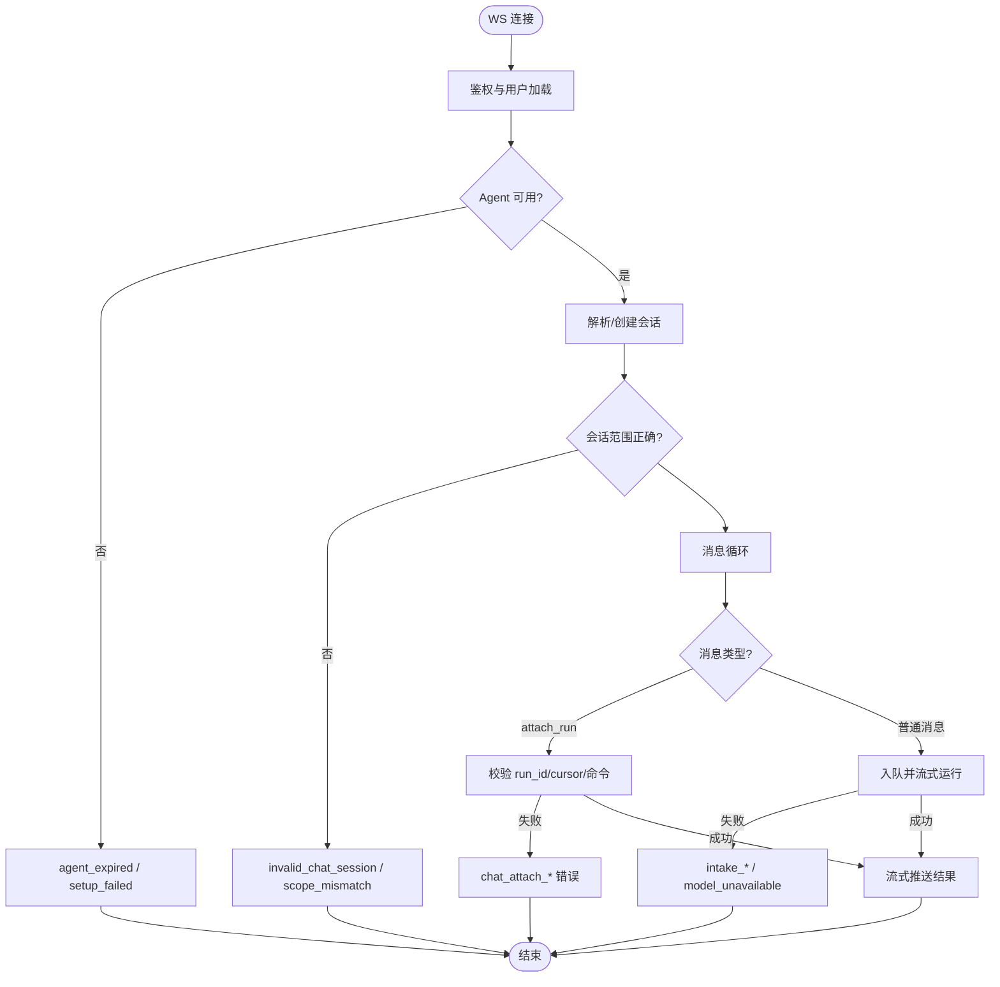
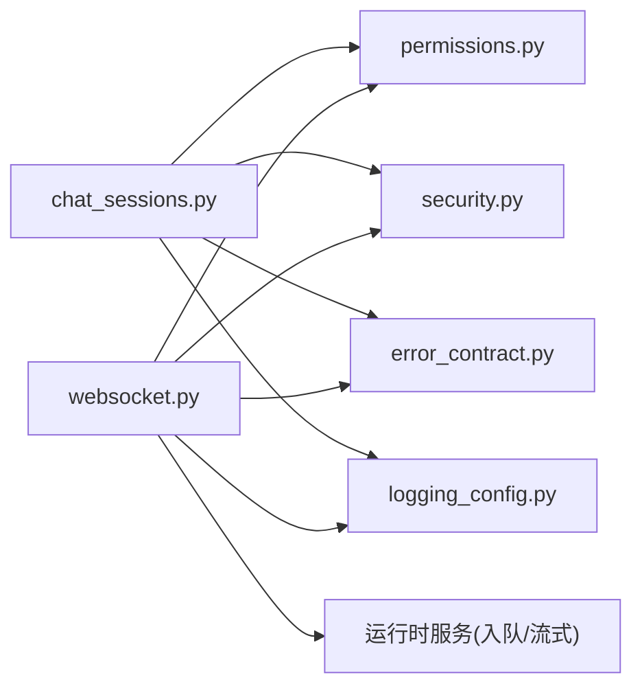

# 错误处理与调试

<cite>
**本文引用的文件**   
- [error_contract.py](file://backend/app/core/error_contract.py)
- [logging_config.py](file://backend/app/core/logging_config.py)
- [middleware.py](file://backend/app/core/middleware.py)
- [permissions.py](file://backend/app/core/permissions.py)
- [security.py](file://backend/app/core/security.py)
- [chat_sessions.py](file://backend/app/api/chat_sessions.py)
- [websocket.py](file://backend/app/api/websocket.py)
</cite>

## 目录
1. [简介](#简介)
2. [项目结构](#项目结构)
3. [核心组件](#核心组件)
4. [架构总览](#架构总览)
5. [详细组件分析](#详细组件分析)
6. [依赖关系分析](#依赖关系分析)
7. [性能考虑](#性能考虑)
8. [故障排查指南](#故障排查指南)
9. [结论](#结论)
10. [附录](#附录)

## 简介
本文件为 Clawith 平台聊天系统的“错误处理与调试”权威文档。目标包括：
- 定义统一的 HTTP 错误响应格式与状态码使用规范
- 记录常见错误场景（会话不存在、权限不足、消息格式错误、网络超时等）及对应处理策略
- 说明错误日志记录、追踪 ID 注入、监控指标收集方法
- 提供重试机制、降级策略、熔断保护等容错设计建议
- 给出调试工具使用指南、日志分析方法与性能优化建议

## 项目结构
后端采用 FastAPI + SQLAlchemy，错误处理集中在 core 层，HTTP 异常统一由全局处理器捕获；WebSocket 实时聊天在 api 层实现，内部通过运行时服务进行编排。关键路径如下：
- 全局错误契约与处理器：core/error_contract.py
- 请求追踪与日志配置：core/logging_config.py、core/middleware.py
- 权限校验与安全：core/permissions.py、core/security.py
- REST 聊天会话接口：api/chat_sessions.py
- WebSocket 实时聊天：api/websocket.py

**图表来源** 
- [error_contract.py:1-229](file://backend/app/core/error_contract.py#L1-L229)
- [logging_config.py:1-129](file://backend/app/core/logging_config.py#L1-L129)
- [middleware.py:1-53](file://backend/app/core/middleware.py#L1-L53)
- [permissions.py:1-554](file://backend/app/core/permissions.py#L1-L554)
- [security.py:1-227](file://backend/app/core/security.py#L1-L227)
- [chat_sessions.py:1-800](file://backend/app/api/chat_sessions.py#L1-L800)
- [websocket.py:1-800](file://backend/app/api/websocket.py#L1-L800)

**章节来源**
- [error_contract.py:1-229](file://backend/app/core/error_contract.py#L1-L229)
- [logging_config.py:1-129](file://backend/app/core/logging_config.py#L1-L129)
- [middleware.py:1-53](file://backend/app/core/middleware.py#L1-L53)
- [permissions.py:1-554](file://backend/app/core/permissions.py#L1-L554)
- [security.py:1-227](file://backend/app/core/security.py#L1-L227)
- [chat_sessions.py:1-800](file://backend/app/api/chat_sessions.py#L1-L800)
- [websocket.py:1-800](file://backend/app/api/websocket.py#L1-L800)

## 核心组件
- 统一错误契约与处理器
  - 定义标准错误对象字段：code、message、trace_id、run_id、agent_id、stage、details、retryable
  - 注册全局异常处理器：HTTPException、RequestValidationError、未捕获 Exception
  - 自动注入 X-Trace-Id 到响应头，便于跨链路追踪
- 日志与追踪
  - 基于 loguru 的集中式日志配置，输出包含 trace_id
  - ContextVar 维护当前请求/任务的 trace_id，支持后台任务独立追踪
  - 抑制高频连接日志，降低噪音
- 中间件
  - TraceIdMiddleware：从请求头读取或生成 trace_id，写入 request.state，并在响应头回写
  - 记录请求/响应耗时，异常时记录错误堆栈
- 权限与安全
  - RBAC 权限检查、租户隔离、Agent 访问控制
  - JWT 鉴权、角色校验、活跃用户校验
- 聊天接口
  - REST 会话管理：创建、查询、重命名、删除、运行态查看、工具执行对账
  - WebSocket 实时聊天：连接建立、消息收发、运行态附加、取消、配额与模型选择

**章节来源**
- [error_contract.py:1-229](file://backend/app/core/error_contract.py#L1-L229)
- [logging_config.py:1-129](file://backend/app/core/logging_config.py#L1-L129)
- [middleware.py:1-53](file://backend/app/core/middleware.py#L1-L53)
- [permissions.py:1-554](file://backend/app/core/permissions.py#L1-L554)
- [security.py:1-227](file://backend/app/core/security.py#L1-L227)
- [chat_sessions.py:1-800](file://backend/app/api/chat_sessions.py#L1-L800)
- [websocket.py:1-800](file://backend/app/api/websocket.py#L1-L800)

## 架构总览
下图展示一次典型的 REST 请求的错误处理流程，以及 WebSocket 连接的错误处理流程。

**图表来源** 
- [middleware.py:12-53](file://backend/app/core/middleware.py#L12-L53)
- [error_contract.py:158-229](file://backend/app/core/error_contract.py#L158-L229)

**图表来源** 
- [websocket.py:229-392](file://backend/app/api/websocket.py#L229-L392)
- [websocket.py:506-800](file://backend/app/api/websocket.py#L506-L800)

## 详细组件分析

### 统一错误契约与处理器
- 标准错误对象字段
  - code：业务错误码（如 validation_error、internal_error、http_4xx）
  - message：可读的人类可读信息
  - trace_id：请求级唯一追踪标识
  - run_id、agent_id、stage：可选上下文，用于定位运行阶段与资源
  - details：结构化细节（如验证错误列表）
  - retryable：是否可重试（布尔值）
- 全局异常处理器
  - HTTPException：保留原始 detail，同时包装标准 error 对象
  - RequestValidationError：返回 422，detail 为验证错误数组
  - 未捕获异常：记录完整堆栈，返回 500 与通用消息，避免泄露敏感信息
- 响应头
  - 始终携带 X-Trace-Id，便于前端与网关侧关联日志

**图表来源** 
- [error_contract.py:158-229](file://backend/app/core/error_contract.py#L158-L229)

**章节来源**
- [error_contract.py:1-229](file://backend/app/core/error_contract.py#L1-L229)

### 日志与追踪
- 日志格式
  - 包含时间、级别、trace_id、模块名、行号、消息
  - 异步输出，开启 backtrace 与诊断信息
- 追踪 ID
  - 请求级：中间件从请求头获取或生成，写入 request.state
  - 任务级：后台任务通过 new_trace_id() 绑定独立 trace_id
- 降噪
  - 抑制 uvicorn/websockets/urllib3 的连接级噪音日志

**图表来源** 
- [logging_config.py:1-129](file://backend/app/core/logging_config.py#L1-L129)
- [middleware.py:12-53](file://backend/app/core/middleware.py#L12-L53)
- [error_contract.py:34-48](file://backend/app/core/error_contract.py#L34-L48)

**章节来源**
- [logging_config.py:1-129](file://backend/app/core/logging_config.py#L1-L129)
- [middleware.py:1-53](file://backend/app/core/middleware.py#L1-L53)

### 权限与安全
- 权限模型
  - 基于 RBAC，支持公司级、自定义、私有三种 Agent 访问模式
  - 支持管理员与显式授权的用户访问
- 安全检查
  - check_agent_access：校验用户是否可访问指定 Agent，返回 (agent, access_level)
  - 租户隔离：不同 tenant 之间不可互相访问
- 安全认证
  - JWT 解码与过期校验
  - get_current_user：校验 token 并加载活跃用户
  - require_role：按角色限制访问

**图表来源** 
- [security.py:128-227](file://backend/app/core/security.py#L128-L227)
- [permissions.py:481-518](file://backend/app/core/permissions.py#L481-L518)

**章节来源**
- [permissions.py:1-554](file://backend/app/core/permissions.py#L1-L554)
- [security.py:1-227](file://backend/app/core/security.py#L1-L227)

### REST 聊天会话接口错误处理
- 常见错误场景
  - 会话不存在：404，detail 提示“Session not found”或“Chat session not found”
  - 权限不足：403，detail 提示“No access to this agent”或“Not authorized”
  - 参数非法：400/422，cursor 格式错误或必填字段缺失
  - 运行态冲突：409，多持有者、状态不匹配、等待用户但命令冲突
- 典型流程
  - 列出会话：scope 校验、权限校验、计数与未读统计
  - 创建会话：租户校验、用户活跃校验、参与者创建
  - 运行态查看：严格校验 tenant/agent/session/user/source_type/run_kind/runtime_type/thread_id/lane_held
  - 工具执行对账：校验运行态 waiting_user、correlation_id、note 必填

**图表来源** 
- [chat_sessions.py:397-559](file://backend/app/api/chat_sessions.py#L397-L559)

**章节来源**
- [chat_sessions.py:1-800](file://backend/app/api/chat_sessions.py#L1-L800)

### WebSocket 聊天错误处理
- 连接建立阶段
  - 鉴权失败：发送 authentication_failed 错误包，关闭连接
  - 用户不存在：user_not_found
  - Agent 过期：agent_expired
  - 会话范围不匹配：invalid_chat_session、chat_session_scope_mismatch
- 消息处理阶段
  - attach_run：校验 run_id、cursor、运行态存在性与命令可用性
  - 入队失败：ChatRuntimeIntakeError，映射为具体 code（如 invalid_event_cursor）
  - 模型不可用：model_unavailable
  - 配额超限：QuotaExceeded（由配额守卫抛出）
- 错误包结构
  - type="error"，content/message/code/agent_id/stage/trace_id/error.error 等字段

**图表来源** 
- [websocket.py:294-392](file://backend/app/api/websocket.py#L294-L392)
- [websocket.py:588-800](file://backend/app/api/websocket.py#L588-L800)

**章节来源**
- [websocket.py:1-800](file://backend/app/api/websocket.py#L1-L800)

## 依赖关系分析
- 模块耦合
  - chat_sessions.py 依赖 permissions.py、security.py、error_contract.py、logging_config.py
  - websocket.py 依赖 permissions.py、security.py、error_contract.py、logging_config.py、运行时服务
- 外部依赖
  - FastAPI/Starlette：异常处理、中间件、WebSocket
  - SQLAlchemy：异步数据库访问
  - loguru：日志
  - Pydantic：请求/响应模型校验

**图表来源** 
- [chat_sessions.py:1-800](file://backend/app/api/chat_sessions.py#L1-L800)
- [websocket.py:1-800](file://backend/app/api/websocket.py#L1-L800)
- [permissions.py:1-554](file://backend/app/core/permissions.py#L1-L554)
- [security.py:1-227](file://backend/app/core/security.py#L1-L227)
- [error_contract.py:1-229](file://backend/app/core/error_contract.py#L1-L229)
- [logging_config.py:1-129](file://backend/app/core/logging_config.py#L1-L129)

**章节来源**
- [chat_sessions.py:1-800](file://backend/app/api/chat_sessions.py#L1-L800)
- [websocket.py:1-800](file://backend/app/api/websocket.py#L1-L800)
- [permissions.py:1-554](file://backend/app/core/permissions.py#L1-L554)
- [security.py:1-227](file://backend/app/core/security.py#L1-L227)
- [error_contract.py:1-229](file://backend/app/core/error_contract.py#L1-L229)
- [logging_config.py:1-129](file://backend/app/core/logging_config.py#L1-L129)

## 性能考虑
- 日志性能
  - 使用 loguru 的 enqueue 异步输出，避免阻塞事件循环
  - 抑制高频连接日志，减少 I/O 压力
- 数据库查询
  - 会话列表与计数合并查询，减少往返
  - 运行态读取使用专用 reader，避免重复锁竞争
- 中间件开销
  - TraceIdMiddleware 仅做轻量字符串操作与日志记录
- 建议
  - 对热点接口增加缓存（如模型候选、会话计数）
  - 合理设置限流与队列深度，防止雪崩

[本节为通用指导，不直接分析具体文件]

## 故障排查指南
- 快速定位
  - 通过 X-Trace-Id 关联请求与日志，过滤同一 trace 的所有记录
  - 关注 error_contract 生成的 error.code 与 stage，快速判断错误阶段
- 常见问题
  - 会话不存在：检查 tenant_id、agent_id、user_id、session_type、source_channel、deleted_at
  - 权限不足：确认用户角色、租户隔离、Agent 访问模式与显式授权
  - 消息格式错误：校验 cursor 格式、必填字段、UUID 合法性
  - 运行态冲突：检查 lane_held、execution_status、waiting_correlation_id
- 日志分析
  - 搜索关键字："[WS]"、"Unhandled HTTP request exception"、"Runtime chat intake rejected"
  - 结合 trace_id 聚合日志，还原调用链
- 监控指标
  - 建议采集：HTTP 状态码分布、WS 连接数、消息吞吐、运行态读取延迟、错误率（按 code 分组）
  - 告警阈值：5xx 比例、409 冲突率、422 验证失败率、WS 断连率

**章节来源**
- [error_contract.py:158-229](file://backend/app/core/error_contract.py#L158-L229)
- [websocket.py:294-392](file://backend/app/api/websocket.py#L294-L392)
- [chat_sessions.py:397-559](file://backend/app/api/chat_sessions.py#L397-L559)

## 结论
Clawith 聊天系统通过统一的错误契约、集中式日志与追踪、严格的权限与安全校验，构建了稳健的错误处理体系。REST 与 WebSocket 两端均遵循一致的错误对象与状态码规范，便于前端与运维侧统一处理与监控。建议在现有基础上进一步完善监控指标与告警策略，并结合重试、降级与熔断策略提升系统韧性。

[本节为总结性内容，不直接分析具体文件]

## 附录

### 标准错误响应格式
- HTTP 响应体
  - detail：原始异常详情（可能为字符串或字典）
  - error：标准错误对象
    - code：业务错误码
    - message：人类可读消息
    - trace_id：追踪标识
    - run_id、agent_id、stage：可选上下文
    - details：结构化细节
    - retryable：是否可重试
- 响应头
  - X-Trace-Id：必须携带

**章节来源**
- [error_contract.py:57-111](file://backend/app/core/error_contract.py#L57-L111)
- [error_contract.py:158-229](file://backend/app/core/error_contract.py#L158-L229)

### HTTP 状态码使用规范
- 400：参数非法（如 cursor 格式错误）
- 401：未授权（token 无效或用户不存在/非活跃）
- 403：权限不足（租户隔离、Agent 访问受限）
- 404：资源不存在（会话、运行、工具执行）
- 409：状态冲突（运行态不匹配、多持有者、等待用户命令冲突）
- 422：请求校验失败（Pydantic 验证错误）
- 500：内部错误（未捕获异常）

**章节来源**
- [chat_sessions.py:216-355](file://backend/app/api/chat_sessions.py#L216-L355)
- [chat_sessions.py:397-559](file://backend/app/api/chat_sessions.py#L397-L559)
- [error_contract.py:184-229](file://backend/app/core/error_contract.py#L184-L229)

### 常见错误场景与处理策略
- 会话不存在
  - 现象：404，detail 提示“Session not found”或“Chat session not found”
  - 处理：前端提示用户重新选择或创建会话
- 权限不足
  - 现象：403，detail 提示“No access to this agent”或“Not authorized”
  - 处理：引导用户切换租户或申请权限
- 消息格式错误
  - 现象：400/422，cursor 或必填字段错误
  - 处理：前端校验输入，提示修正
- 网络超时
  - 现象：上游 LLM/存储超时导致 5xx
  - 处理：服务端记录堆栈，返回 500；客户端根据 retryable 决定是否重试

**章节来源**
- [chat_sessions.py:670-731](file://backend/app/api/chat_sessions.py#L670-L731)
- [websocket.py:294-392](file://backend/app/api/websocket.py#L294-L392)
- [error_contract.py:205-229](file://backend/app/core/error_contract.py#L205-L229)

### 重试机制、降级策略、熔断保护
- 重试机制
  - 适用于幂等请求（如消息入队），依据 error.retryable 与错误码决定重试次数与退避策略
- 降级策略
  - 模型不可用时，切换到备用模型或返回友好提示
  - 运行时繁忙时，排队或返回“稍后重试”
- 熔断保护
  - 对下游 LLM/存储调用设置熔断器，失败率超阈值时快速失败，避免雪崩

[本节为通用指导，不直接分析具体文件]

### 调试工具使用指南
- 前端
  - 打开开发者工具，查看 Network/WebSocket 面板，复制 X-Trace-Id
  - 打印错误包中的 error.code、stage、trace_id
- 后端
  - 使用 grep 过滤 trace_id，聚合同一请求的日志
  - 关注 "[WS]" 前缀的 WebSocket 日志与 "Unhandled HTTP request exception"
- 指标与告警
  - 采集 HTTP 状态码分布、WS 连接数、错误率（按 code 分组）
  - 设置 5xx 比例与 409 冲突率告警阈值

**章节来源**
- [logging_config.py:61-79](file://backend/app/core/logging_config.py#L61-L79)
- [middleware.py:24-52](file://backend/app/core/middleware.py#L24-L52)

### 性能优化建议
- 数据库
  - 合并查询，减少往返；合理使用索引（会话列表、计数、未读统计）
- 缓存
  - 模型候选、会话计数、用户信息缓存
- 日志
  - 按需调整日志级别，避免生产环境过度输出
- 中间件
  - 保持 TraceIdMiddleware 轻量，避免额外同步 IO

[本节为通用指导，不直接分析具体文件]