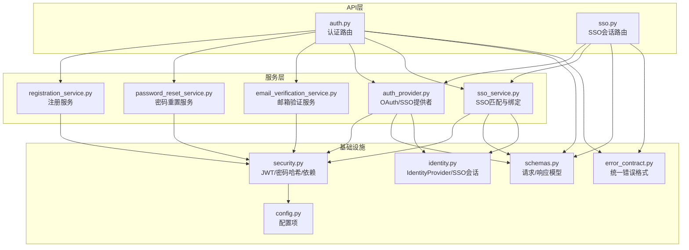
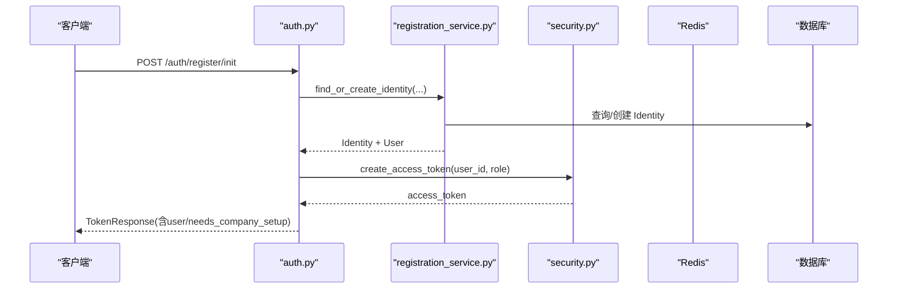
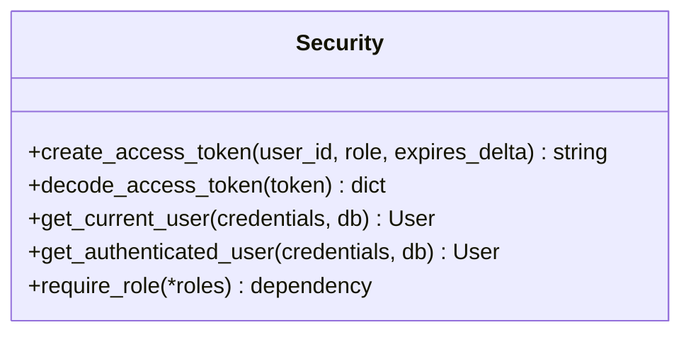
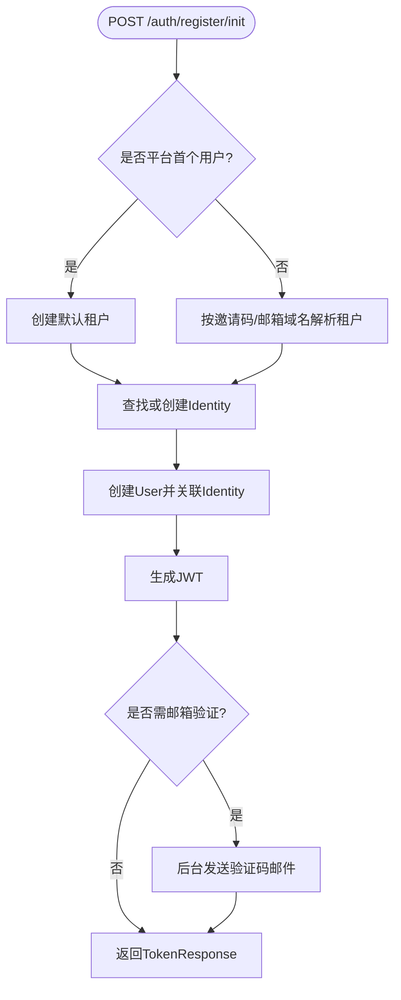
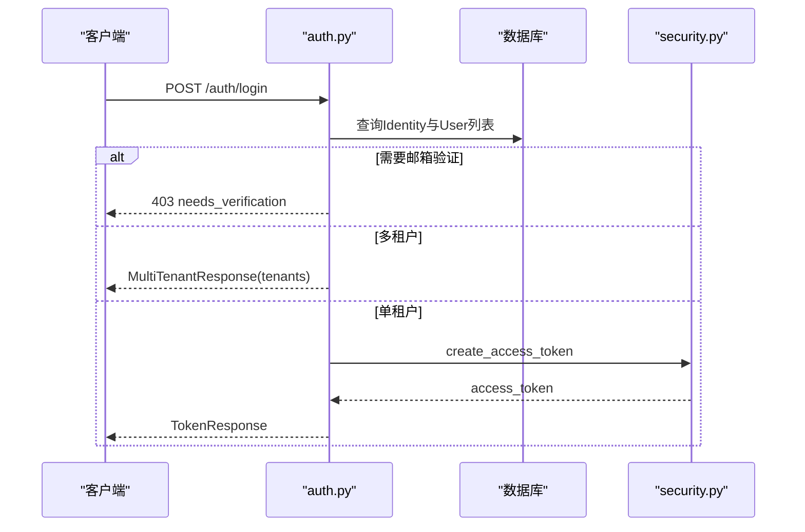
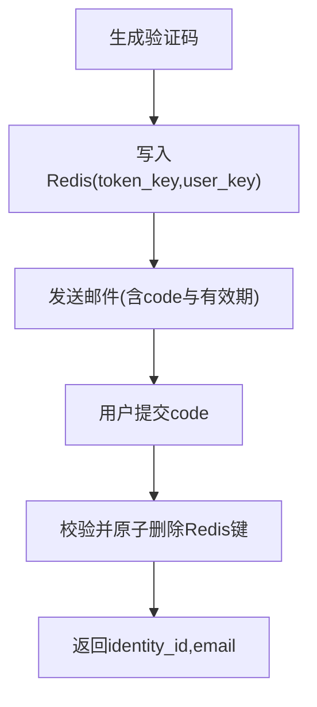
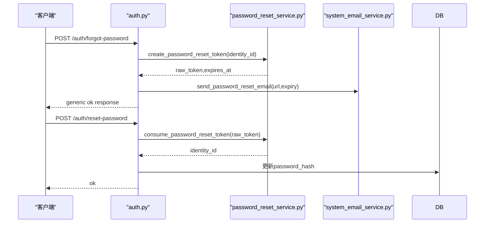
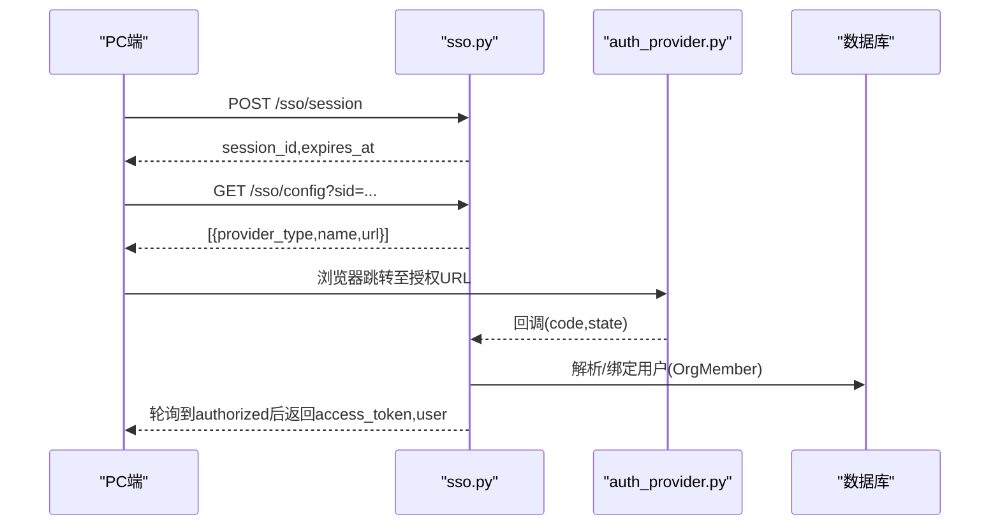
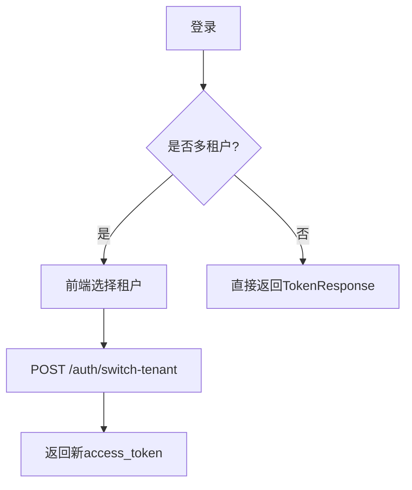
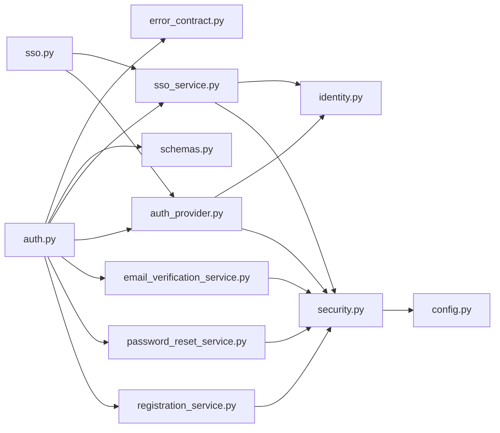

# 认证API

<cite>
**本文引用的文件**   
- [backend/app/api/auth.py](file://backend/app/api/auth.py)
- [backend/app/api/sso.py](file://backend/app/api/sso.py)
- [backend/app/core/security.py](file://backend/app/core/security.py)
- [backend/app/services/auth_provider.py](file://backend/app/services/auth_provider.py)
- [backend/app/services/password_reset_service.py](file://backend/app/services/password_reset_service.py)
- [backend/app/services/email_verification_service.py](file://backend/app/services/email_verification_service.py)
- [backend/app/services/registration_service.py](file://backend/app/services/registration_service.py)
- [backend/app/services/sso_service.py](file://backend/app/services/sso_service.py)
- [backend/app/schemas/schemas.py](file://backend/app/schemas/schemas.py)
- [backend/app/models/identity.py](file://backend/app/models/identity.py)
- [backend/app/config.py](file://backend/app/config.py)
- [backend/app/core/error_contract.py](file://backend/app/core/error_contract.py)
</cite>

## 目录
1. [简介](#简介)
2. [项目结构](#项目结构)
3. [核心组件](#核心组件)
4. [架构总览](#架构总览)
5. [详细组件分析](#详细组件分析)
6. [依赖关系分析](#依赖关系分析)
7. [性能考量](#性能考量)
8. [故障排查指南](#故障排查指南)
9. [结论](#结论)
10. [附录：API端点清单与示例](#附录api端点清单与示例)

## 简介
本文件为Clawith平台认证系统的权威API文档，覆盖用户注册、登录、密码重置、邮箱验证、多租户切换、SSO（OAuth2.0）等能力。系统采用JWT作为访问令牌，结合Redis实现一次性验证码与重置令牌的生命周期管理；通过统一的服务层抽象支持飞书、钉钉、企业微信、Google Workspace等多身份提供商的SSO集成。

## 项目结构
认证相关代码主要分布在以下模块：
- API路由：auth.py、sso.py
- 安全与鉴权：core/security.py
- 服务层：registration_service.py、password_reset_service.py、email_verification_service.py、auth_provider.py、sso_service.py
- 数据模型与配置：models/identity.py、config.py
- 请求/响应模式：schemas/schemas.py
- 错误处理：core/error_contract.py

**图示来源** 
- [backend/app/api/auth.py](file://backend/app/api/auth.py)
- [backend/app/api/sso.py](file://backend/app/api/sso.py)
- [backend/app/core/security.py](file://backend/app/core/security.py)
- [backend/app/services/auth_provider.py](file://backend/app/services/auth_provider.py)
- [backend/app/services/password_reset_service.py](file://backend/app/services/password_reset_service.py)
- [backend/app/services/email_verification_service.py](file://backend/app/services/email_verification_service.py)
- [backend/app/services/registration_service.py](file://backend/app/services/registration_service.py)
- [backend/app/services/sso_service.py](file://backend/app/services/sso_service.py)
- [backend/app/schemas/schemas.py](file://backend/app/schemas/schemas.py)
- [backend/app/models/identity.py](file://backend/app/models/identity.py)
- [backend/app/config.py](file://backend/app/config.py)
- [backend/app/core/error_contract.py](file://backend/app/core/error_contract.py)

**章节来源**
- [backend/app/api/auth.py](file://backend/app/api/auth.py)
- [backend/app/api/sso.py](file://backend/app/api/sso.py)
- [backend/app/core/security.py](file://backend/app/core/security.py)
- [backend/app/services/auth_provider.py](file://backend/app/services/auth_provider.py)
- [backend/app/services/password_reset_service.py](file://backend/app/services/password_reset_service.py)
- [backend/app/services/email_verification_service.py](file://backend/app/services/email_verification_service.py)
- [backend/app/services/registration_service.py](file://backend/app/services/registration_service.py)
- [backend/app/services/sso_service.py](file://backend/app/services/sso_service.py)
- [backend/app/schemas/schemas.py](file://backend/app/schemas/schemas.py)
- [backend/app/models/identity.py](file://backend/app/models/identity.py)
- [backend/app/config.py](file://backend/app/config.py)
- [backend/app/core/error_contract.py](file://backend/app/core/error_contract.py)

## 核心组件
- 认证路由（/auth）：提供注册初始化、SSO注册、登录、邮箱提示、忘记密码、重置密码、当前用户信息、租户列表与切换等接口。
- SSO会话路由（/sso）：创建扫码会话、查询状态、标记已扫描、获取可用SSO提供商及授权URL。
- 安全工具（security）：JWT生成与校验、密码哈希/校验、角色检查依赖。
- 注册服务（registration_service）：按邮箱域名自动归属租户、重复身份检测、创建或查找全局Identity并建立租户User。
- 密码重置服务（password_reset_service）：基于Redis的一次性重置令牌生命周期管理。
- 邮箱验证服务（email_verification_service）：基于Redis的6位验证码生命周期管理与邮件发送。
- OAuth/SSO提供者（auth_provider）：统一的BaseAuthProvider抽象与具体实现（飞书、钉钉、企业微信、Google Workspace）。
- SSO服务（sso_service）：外部身份解析、OrgMember关联、租户自动关联、去重与解绑。
- 配置（config）：JWT密钥、算法、过期时间、邮箱验证码与重置令牌过期策略等。
- 错误契约（error_contract）：统一的HTTP错误体结构与TraceId透传。

**章节来源**
- [backend/app/api/auth.py](file://backend/app/api/auth.py)
- [backend/app/api/sso.py](file://backend/app/api/sso.py)
- [backend/app/core/security.py](file://backend/app/core/security.py)
- [backend/app/services/registration_service.py](file://backend/app/services/registration_service.py)
- [backend/app/services/password_reset_service.py](file://backend/app/services/password_reset_service.py)
- [backend/app/services/email_verification_service.py](file://backend/app/services/email_verification_service.py)
- [backend/app/services/auth_provider.py](file://backend/app/services/auth_provider.py)
- [backend/app/services/sso_service.py](file://backend/app/services/sso_service.py)
- [backend/app/config.py](file://backend/app/config.py)
- [backend/app/core/error_contract.py](file://backend/app/core/error_contract.py)

## 架构总览
认证流程以FastAPI路由为入口，调用服务层完成业务逻辑，使用security进行JWT与权限控制，借助Redis存储一次性令牌，数据库持久化Identity/User/OrgMember等实体。

**图示来源** 
- [backend/app/api/auth.py](file://backend/app/api/auth.py)
- [backend/app/services/registration_service.py](file://backend/app/services/registration_service.py)
- [backend/app/core/security.py](file://backend/app/core/security.py)

## 详细组件分析

### JWT与令牌机制
- 令牌内容：包含用户ID(sub)、角色(role)、过期时间(exp)。
- 生成与解码：create_access_token/decode_access_token，使用配置的JWT_SECRET_KEY与JWT_ALGORITHM。
- 依赖注入：get_current_user/get_authenticated_user从Authorization头读取Bearer token并校验，加载User与Identity。
- 刷新策略：当前未实现refresh_token端点；建议前端在过期前主动刷新或引导重新登录。

**图示来源** 
- [backend/app/core/security.py](file://backend/app/core/security.py)

**章节来源**
- [backend/app/core/security.py](file://backend/app/core/security.py)
- [backend/app/config.py](file://backend/app/config.py)

### 用户注册
- 注册初始化（/auth/register/init）：创建或查找全局Identity，根据是否为平台首个用户决定默认租户，创建租户级User，返回access_token与是否需要公司设置。
- SSO注册（/auth/register/sso）：通过外部OAuth code换取用户信息，自动匹配或创建用户并绑定OrgMember。
- 旧版兼容（/auth/register）：内部转发至新流程。

**图示来源** 
- [backend/app/api/auth.py](file://backend/app/api/auth.py)
- [backend/app/services/registration_service.py](file://backend/app/services/registration_service.py)

**章节来源**
- [backend/app/api/auth.py](file://backend/app/api/auth.py)
- [backend/app/services/registration_service.py](file://backend/app/services/registration_service.py)
- [backend/app/schemas/schemas.py](file://backend/app/schemas/schemas.py)

### 登录与多租户选择
- 登录（/auth/login）：校验凭证，若未验证邮箱则触发验证流程并返回403+needs_verification；若同一身份存在多个租户，返回MultiTenantResponse供前端选择。
- 租户切换（/auth/switch-tenant）：校验成员资格后生成新token并可附带跨域redirect_url。

**图示来源** 
- [backend/app/api/auth.py](file://backend/app/api/auth.py)
- [backend/app/core/security.py](file://backend/app/core/security.py)

**章节来源**
- [backend/app/api/auth.py](file://backend/app/api/auth.py)
- [backend/app/schemas/schemas.py](file://backend/app/schemas/schemas.py)

### 邮箱验证
- 验证码生成：6位随机码，存于Redis，带TTL与用户映射键，支持原子删除保证一次性。
- 发送模板：通过system_email_service渲染模板并发送。
- 验证消费：consume_email_verification_token校验并删除，返回identity_id与email用于后续操作。

**图示来源** 
- [backend/app/services/email_verification_service.py](file://backend/app/services/email_verification_service.py)

**章节来源**
- [backend/app/services/email_verification_service.py](file://backend/app/services/email_verification_service.py)

### 密码重置
- 申请重置（/auth/forgot-password）：校验SMTP配置，生成一次性重置令牌（Redis），构建重置链接并发送邮件。
- 重置密码（/auth/reset-password）：消费令牌（原子删除），更新Identity.password_hash。

**图示来源** 
- [backend/app/api/auth.py](file://backend/app/api/auth.py)
- [backend/app/services/password_reset_service.py](file://backend/app/services/password_reset_service.py)

**章节来源**
- [backend/app/api/auth.py](file://backend/app/api/auth.py)
- [backend/app/services/password_reset_service.py](file://backend/app/services/password_reset_service.py)

### SSO（OAuth2.0）集成
- 会话创建（/sso/session）：生成临时扫码会话，设置过期时间。
- 状态查询（/sso/session/{sid}/status）：轮询状态，授权成功后返回access_token与user。
- 标记扫描（/sso/session/{sid}/scan）：移动端落地页加载时标记scanned。
- 提供商配置（/sso/config）：列出当前租户可用的SSO提供商及其授权URL（飞书、钉钉、企业微信、Google Workspace）。

**图示来源** 
- [backend/app/api/sso.py](file://backend/app/api/sso.py)
- [backend/app/services/auth_provider.py](file://backend/app/services/auth_provider.py)
- [backend/app/services/sso_service.py](file://backend/app/services/sso_service.py)

**章节来源**
- [backend/app/api/sso.py](file://backend/app/api/sso.py)
- [backend/app/services/auth_provider.py](file://backend/app/services/auth_provider.py)
- [backend/app/services/sso_service.py](file://backend/app/services/sso_service.py)
- [backend/app/models/identity.py](file://backend/app/models/identity.py)

### 多租户认证流程
- 登录时若同一身份对应多个租户，返回MultiTenantResponse，前端选择tenant_id后再调用select-oauth-tenant或直接携带tenant_id登录。
- 切换租户后生成新的access_token，可附带跨域redirect_url便于前端重定向。

**图示来源** 
- [backend/app/api/auth.py](file://backend/app/api/auth.py)
- [backend/app/schemas/schemas.py](file://backend/app/schemas/schemas.py)

**章节来源**
- [backend/app/api/auth.py](file://backend/app/api/auth.py)
- [backend/app/schemas/schemas.py](file://backend/app/schemas/schemas.py)

## 依赖关系分析
- API层依赖服务层完成业务编排，服务层依赖security进行令牌与密码处理，依赖Redis进行一次性令牌管理，依赖数据库持久化实体。
- SSO提供者抽象统一了不同平台的OAuth流程，降低耦合度。
- 错误契约确保所有HTTP异常具有一致的错误体结构与trace_id。

**图示来源** 
- [backend/app/api/auth.py](file://backend/app/api/auth.py)
- [backend/app/api/sso.py](file://backend/app/api/sso.py)
- [backend/app/services/auth_provider.py](file://backend/app/services/auth_provider.py)
- [backend/app/services/sso_service.py](file://backend/app/services/sso_service.py)
- [backend/app/services/registration_service.py](file://backend/app/services/registration_service.py)
- [backend/app/services/password_reset_service.py](file://backend/app/services/password_reset_service.py)
- [backend/app/services/email_verification_service.py](file://backend/app/services/email_verification_service.py)
- [backend/app/core/security.py](file://backend/app/core/security.py)
- [backend/app/schemas/schemas.py](file://backend/app/schemas/schemas.py)
- [backend/app/models/identity.py](file://backend/app/models/identity.py)
- [backend/app/config.py](file://backend/app/config.py)
- [backend/app/core/error_contract.py](file://backend/app/core/error_contract.py)

**章节来源**
- [backend/app/api/auth.py](file://backend/app/api/auth.py)
- [backend/app/api/sso.py](file://backend/app/api/sso.py)
- [backend/app/services/auth_provider.py](file://backend/app/services/auth_provider.py)
- [backend/app/services/sso_service.py](file://backend/app/services/sso_service.py)
- [backend/app/services/registration_service.py](file://backend/app/services/registration_service.py)
- [backend/app/services/password_reset_service.py](file://backend/app/services/password_reset_service.py)
- [backend/app/services/email_verification_service.py](file://backend/app/services/email_verification_service.py)
- [backend/app/core/security.py](file://backend/app/core/security.py)
- [backend/app/schemas/schemas.py](file://backend/app/schemas/schemas.py)
- [backend/app/models/identity.py](file://backend/app/models/identity.py)
- [backend/app/config.py](file://backend/app/config.py)
- [backend/app/core/error_contract.py](file://backend/app/core/error_contract.py)

## 性能考量
- 密码哈希与校验使用线程池避免阻塞事件循环。
- Redis一次性令牌使用管道事务保证原子性与低延迟。
- 注册流程中计算哈希与解析邮箱配置在事务外执行，减少锁竞争。
- 多租户查询与组织成员绑定按需加载，避免N+1问题。

[本节为通用指导，不直接分析具体文件]

## 故障排查指南
- 统一错误体：所有HTTP异常均返回包含code、message、trace_id的结构化错误对象，便于前端与日志追踪。
- TraceId：请求头X-Trace-Id可用于链路追踪。
- 常见错误码：
  - 401：无效或过期令牌、用户不存在或不活跃。
  - 403：账号禁用、组织禁用、无权限访问租户。
  - 404：无组织关联或会话不存在。
  - 409：邮箱/用户名冲突。
  - 422：请求校验失败。
  - 500：内部错误。

**章节来源**
- [backend/app/core/error_contract.py](file://backend/app/core/error_contract.py)

## 结论
Clawith认证系统以清晰的API分层、健壮的安全工具与可扩展的SSO提供者框架为核心，实现了多租户、邮箱验证、密码重置与OAuth2.0集成的完整认证闭环。建议在部署时严格配置JWT密钥与过期策略，启用CORS白名单，并根据业务需求开启邮箱验证强制策略。

[本节为总结性内容，不直接分析具体文件]

## 附录：API端点清单与示例

### 认证路由（/auth）
- GET /auth/registration-config
  - 作用：获取注册要求（是否需要邀请码）
  - 响应：{invitation_code_required: boolean}
- GET /auth/check-duplicate
  - 作用：检查邮箱/用户名是否已被占用
  - 参数：email?, username?
  - 响应：{email_exists:boolean, username_exists:boolean, has_conflict:boolean, conflicts:[...]}
- POST /auth/register/init
  - 作用：注册初始化（创建Identity与User，返回access_token）
  - 请求体：RegisterInitRequest
  - 响应：RegisterInitResponse
- POST /auth/register/sso
  - 作用：SSO注册（通过外部OAuth code）
  - 请求体：SSORegisterRequest
  - 响应：TokenResponse
- POST /auth/login
  - 作用：登录（支持多租户选择）
  - 请求体：UserLogin
  - 响应：TokenResponse 或 MultiTenantResponse 或 403 needs_verification
- GET /auth/email-hint
  - 作用：根据用户名返回脱敏邮箱提示
  - 参数：username
  - 响应：{hint:string}
- POST /auth/forgot-password
  - 作用：申请密码重置（发送重置链接）
  - 请求体：ForgotPasswordRequest
  - 响应：generic ok
- POST /auth/reset-password
  - 作用：重置密码（使用一次性token）
  - 请求体：ResetPasswordRequest
  - 响应：{ok:true}
- GET /auth/me
  - 作用：获取当前用户信息
  - 鉴权：Bearer token
  - 响应：UserOut
- PATCH /auth/me
  - 作用：更新当前用户信息
  - 鉴权：Bearer token
  - 请求体：UserUpdate
  - 响应：UserOut
- GET /auth/my-tenants
  - 作用：获取当前用户所属租户列表
  - 鉴权：Bearer token
  - 响应：list[TenantChoice]
- POST /auth/switch-tenant
  - 作用：切换租户并返回新token与可选redirect_url
  - 鉴权：Bearer token
  - 请求体：TenantSwitchRequest
  - 响应：TenantSwitchResponse

**章节来源**
- [backend/app/api/auth.py](file://backend/app/api/auth.py)
- [backend/app/schemas/schemas.py](file://backend/app/schemas/schemas.py)

### SSO会话路由（/sso）
- POST /sso/session
  - 作用：创建SSO扫码会话
  - 参数：tenant_id?
  - 响应：{session_id, expires_at}
- GET /sso/session/{sid}/status
  - 作用：查询会话状态（pending/scanned/authorized/expired/completed）
  - 响应：{status, provider_type, error_msg, access_token?, user?}
- PUT /sso/session/{sid}/scan
  - 作用：标记会话已扫描
  - 响应：{status:"ok"}
- GET /sso/config
  - 作用：获取可用SSO提供商与授权URL
  - 参数：sid
  - 响应：[{provider_type, name, url}, ...]

**章节来源**
- [backend/app/api/sso.py](file://backend/app/api/sso.py)
- [backend/app/models/identity.py](file://backend/app/models/identity.py)

### 安全与配置要点
- JWT配置：JWT_SECRET_KEY、JWT_ALGORITHM、JWT_ACCESS_TOKEN_EXPIRE_MINUTES
- 邮箱验证：EMAIL_VERIFICATION_TOKEN_EXPIRE_MINUTES、EMAIL_VERIFICATION_REQUIRED
- 密码重置：PASSWORD_RESET_TOKEN_EXPIRE_MINUTES
- CORS：CORS_ORIGINS

**章节来源**
- [backend/app/config.py](file://backend/app/config.py)

### 错误处理与最佳实践
- 错误体结构：detail与error.code/message/trace_id/detials/retryable
- 建议：
  - 前端在令牌过期前主动刷新或引导重新登录
  - 严格校验CORS与Referer
  - 生产环境更换JWT密钥与强密码策略
  - 启用邮箱验证强制策略（EMAIL_VERIFICATION_REQUIRED=true）
  - 合理设置令牌过期时间与短信/邮件频率限制

**章节来源**
- [backend/app/core/error_contract.py](file://backend/app/core/error_contract.py)